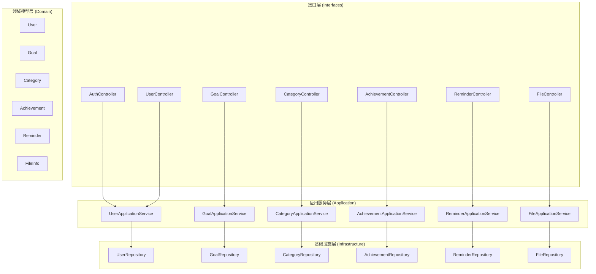
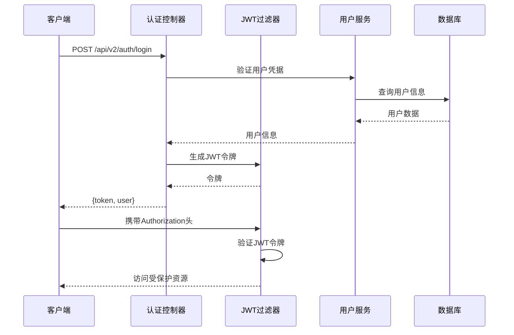
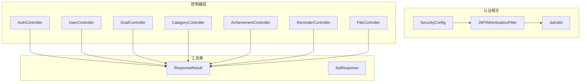

# API 接口文档

<cite>
**本文档引用的文件**
- [AuthController.java](file://src/main/java/com/crazydream/interfaces/auth/AuthController.java)
- [UserController.java](file://src/main/java/com/crazydream/interfaces/user/UserController.java)
- [GoalController.java](file://src/main/java/com/crazydream/interfaces/goal/GoalController.java)
- [CategoryController.java](file://src/main/java/com/crazydream/interfaces/category/CategoryController.java)
- [AchievementController.java](file://src/main/java/com/crazydream/interfaces/achievement/AchievementController.java)
- [ReminderController.java](file://src/main/java/com/crazydream/interfaces/reminder/ReminderController.java)
- [FileController.java](file://src/main/java/com/crazydream/interfaces/file/FileController.java)
- [LoginCommand.java](file://src/main/java/com/crazydream/application/user/dto/LoginCommand.java)
- [RegisterCommand.java](file://src/main/java/com/crazydream/application/user/dto/RegisterCommand.java)
- [LoginResponse.java](file://src/main/java/com/crazydream/application/user/dto/LoginResponse.java)
- [ResponseResult.java](file://src/main/java/com/crazydream/utils/ResponseResult.java)
- [application.yml](file://src/main/resources/application.yml)
- [JwtAuthenticationFilter.java](file://src/main/java/com/crazydream/security/JwtAuthenticationFilter.java)
- [JwtUtils.java](file://src/main/java/com/crazydream/utils/JwtUtils.java)
- [SecurityConfig.java](file://src/main/java/com/crazydream/security/SecurityConfig.java)
</cite>

## 目录
1. [简介](#简介)
2. [项目结构](#项目结构)
3. [核心组件](#核心组件)
4. [架构概览](#架构概览)
5. [详细组件分析](#详细组件分析)
6. [依赖关系分析](#依赖关系分析)
7. [性能考虑](#性能考虑)
8. [故障排除指南](#故障排除指南)
9. [结论](#结论)

## 简介

CrazyDream 是一个基于 Spring Boot 的目标管理应用，提供了完整的 RESTful API 接口体系。本项目采用分层架构设计，包含认证授权、用户管理、目标管理、分类管理、成就系统、提醒功能和文件管理等核心模块。

项目使用 JWT（JSON Web Token）进行身份认证，支持多环境配置，具备完善的错误处理机制和统一的响应格式。所有 API 接口均遵循 RESTful 设计原则，提供清晰的 HTTP 方法、URL 模式、请求参数和响应格式。

## 项目结构

CrazyDream 项目采用标准的 Spring Boot 项目结构，主要分为以下几个层次：



**图表来源**
- [AuthController.java](file://src/main/java/com/crazydream/interfaces/auth/AuthController.java#L17-L61)
- [UserController.java](file://src/main/java/com/crazydream/interfaces/user/UserController.java#L14-L131)
- [GoalController.java](file://src/main/java/com/crazydream/interfaces/goal/GoalController.java#L26-L287)

**章节来源**
- [AuthController.java](file://src/main/java/com/crazydream/interfaces/auth/AuthController.java#L1-L62)
- [application.yml](file://src/main/resources/application.yml#L1-L75)

## 核心组件

### JWT 认证机制

项目实现了基于 JWT 的无状态认证机制，具有以下特点：

- **令牌格式**: Bearer Token 格式，支持自定义头部名称
- **过期时间**: 可配置，默认24小时
- **密钥管理**: 支持环境变量配置，生产环境建议使用强密码
- **安全策略**: 无状态会话，支持测试模式下的默认用户

### 统一响应格式

所有 API 响应都遵循统一的 JSON 格式：

```json
{
    "code": 200,
    "message": "成功",
    "data": {}
}
```

### 错误处理机制

系统提供多层次的错误处理：
- 参数验证错误 (400)
- 认证失败 (401)
- 权限不足 (403)
- 资源不存在 (404)
- 服务器内部错误 (500)

**章节来源**
- [ResponseResult.java](file://src/main/java/com/crazydream/utils/ResponseResult.java#L14-L149)
- [JwtUtils.java](file://src/main/java/com/crazydream/utils/JwtUtils.java#L30-L165)
- [SecurityConfig.java](file://src/main/java/com/crazydream/security/SecurityConfig.java#L32-L105)

## 架构概览



**图表来源**
- [AuthController.java](file://src/main/java/com/crazydream/interfaces/auth/AuthController.java#L47-L60)
- [JwtAuthenticationFilter.java](file://src/main/java/com/crazydream/security/JwtAuthenticationFilter.java#L48-L127)
- [JwtUtils.java](file://src/main/java/com/crazydream/utils/JwtUtils.java#L57-L76)

## 详细组件分析

### 认证接口

#### 用户注册
- **HTTP 方法**: POST
- **URL 模式**: `/api/v2/auth/register`
- **请求参数**: RegisterCommand 对象
  - email: 用户邮箱 (必填)
  - password: 用户密码 (必填)
  - nickName: 昵称 (可选)
- **响应格式**: LoginResponse
  - token: JWT 认证令牌
  - user: 用户信息对象
- **状态码**: 
  - 200: 注册成功
  - 400: 参数验证失败
  - 500: 系统内部错误

#### 用户登录
- **HTTP 方法**: POST
- **URL 模式**: `/api/v2/auth/login`
- **请求参数**: LoginCommand 对象
  - email: 用户邮箱 (必填)
  - password: 用户密码 (必填)
- **响应格式**: LoginResponse
  - token: JWT 认证令牌
  - user: 用户信息对象
- **状态码**: 
  - 200: 登录成功
  - 401: 认证失败
  - 500: 系统内部错误

**章节来源**
- [AuthController.java](file://src/main/java/com/crazydream/interfaces/auth/AuthController.java#L26-L60)
- [RegisterCommand.java](file://src/main/java/com/crazydream/application/user/dto/RegisterCommand.java#L6-L10)
- [LoginCommand.java](file://src/main/java/com/crazydream/application/user/dto/LoginCommand.java#L6-L9)
- [LoginResponse.java](file://src/main/java/com/crazydream/application/user/dto/LoginResponse.java#L8-L11)

### 用户接口

#### 获取当前用户信息
- **HTTP 方法**: GET
- **URL 模式**: `/api/v2/users/me`
- **请求头**: Authorization: Bearer {token}
- **响应格式**: UserDTO
- **状态码**: 
  - 200: 获取成功
  - 404: 用户不存在
  - 500: 系统内部错误

#### 获取用户档案
- **HTTP 方法**: GET
- **URL 模式**: `/api/v2/users/profile`
- **请求头**: Authorization: Bearer {token}
- **响应格式**: UserDTO
- **状态码**: 
  - 200: 获取成功
  - 404: 用户不存在
  - 500: 系统内部错误

#### 获取指定用户
- **HTTP 方法**: GET
- **URL 模式**: `/api/v2/users/{id}`
- **路径参数**: id (用户ID)
- **响应格式**: UserDTO
- **状态码**: 
  - 200: 获取成功
  - 404: 用户不存在
  - 500: 系统内部错误

#### 更新用户资料
- **HTTP 方法**: PUT
- **URL 模式**: `/api/v2/users/profile`
- **请求头**: Authorization: Bearer {token}
- **请求参数**: UpdateProfileCommand
- **响应格式**: UserDTO
- **状态码**: 
  - 200: 更新成功
  - 400: 参数错误
  - 500: 系统内部错误

#### 增加积分
- **HTTP 方法**: POST
- **URL 模式**: `/api/v2/users/points`
- **请求头**: Authorization: Bearer {token}
- **查询参数**: points (积分数量)
- **响应格式**: Void
- **状态码**: 
  - 200: 增加成功
  - 400: 参数错误
  - 500: 系统内部错误

**章节来源**
- [UserController.java](file://src/main/java/com/crazydream/interfaces/user/UserController.java#L36-L99)

### 目标接口

#### 创建目标
- **HTTP 方法**: POST
- **URL 模式**: `/api/v2/goals`
- **请求头**: Authorization: Bearer {token}
- **请求参数**: CreateGoalCommand
- **响应格式**: GoalDTO
- **状态码**: 
  - 200: 创建成功
  - 400: 参数验证失败
  - 500: 系统内部错误

#### 更新目标
- **HTTP 方法**: PUT
- **URL 模式**: `/api/v2/goals/{id}`
- **路径参数**: id (目标ID)
- **请求头**: Authorization: Bearer {token}
- **请求参数**: UpdateGoalCommand
- **响应格式**: GoalDTO
- **状态码**: 
  - 200: 更新成功
  - 400: 参数验证失败
  - 500: 系统内部错误

#### 获取用户所有目标
- **HTTP 方法**: GET
- **URL 模式**: `/api/v2/goals`
- **请求头**: Authorization: Bearer {token}
- **响应格式**: List<GoalDTO>
- **状态码**: 
  - 200: 获取成功
  - 500: 系统内部错误

#### 获取指定目标
- **HTTP 方法**: GET
- **URL 模式**: `/api/v2/goals/{id}`
- **路径参数**: id (目标ID)
- **请求头**: Authorization: Bearer {token}
- **响应格式**: GoalDTO
- **状态码**: 
  - 200: 获取成功
  - 404: 目标不存在
  - 500: 系统内部错误

#### 按分类获取目标
- **HTTP 方法**: GET
- **URL 模式**: `/api/v2/goals/category/{categoryId}`
- **路径参数**: categoryId (分类ID)
- **请求头**: Authorization: Bearer {token}
- **响应格式**: List<GoalDTO>
- **状态码**: 
  - 200: 获取成功
  - 500: 系统内部错误

#### 删除目标
- **HTTP 方法**: DELETE
- **URL 模式**: `/api/v2/goals/{id}`
- **路径参数**: id (目标ID)
- **请求头**: Authorization: Bearer {token}
- **响应格式**: Boolean
- **状态码**: 
  - 200: 删除成功
  - 404: 目标不存在
  - 500: 系统内部错误

#### 批量删除目标
- **HTTP 方法**: DELETE
- **URL 模式**: `/api/v2/goals/batch`
- **请求头**: Authorization: Bearer {token}
- **请求参数**: List<Long> (目标ID列表)
- **响应格式**: Integer (删除数量)
- **状态码**: 
  - 200: 删除成功
  - 500: 系统内部错误

#### 更新目标进度
- **HTTP 方法**: PATCH
- **URL 模式**: `/api/v2/goals/{id}/progress`
- **路径参数**: id (目标ID)
- **请求头**: Authorization: Bearer {token}
- **查询参数**: progress (进度百分比)
- **响应格式**: GoalDTO
- **状态码**: 
  - 200: 更新成功
  - 400: 参数错误
  - 500: 系统内部错误

#### 完成目标
- **HTTP 方法**: PATCH
- **URL 模式**: `/api/v2/goals/{id}/complete`
- **路径参数**: id (目标ID)
- **请求头**: Authorization: Bearer {token}
- **响应格式**: GoalDTO
- **状态码**: 
  - 200: 完成成功
  - 400: 参数错误
  - 500: 系统内部错误

#### 获取最近更新的目标
- **HTTP 方法**: GET
- **URL 模式**: `/api/v2/goals/recent`
- **请求头**: Authorization: Bearer {token}
- **查询参数**: limit (默认10)
- **响应格式**: List<GoalDTO>
- **状态码**: 
  - 200: 获取成功
  - 500: 系统内部错误

#### 获取今日提醒的目标
- **HTTP 方法**: GET
- **URL 模式**: `/api/v2/goals/today-reminders`
- **请求头**: Authorization: Bearer {token}
- **查询参数**: date (可选，默认当天)
- **响应格式**: List<GoalDTO>
- **状态码**: 
  - 200: 获取成功
  - 500: 系统内部错误

#### 获取目标统计
- **HTTP 方法**: GET
- **URL 模式**: `/api/v2/goals/statistics`
- **请求头**: Authorization: Bearer {token}
- **响应格式**: Map<String, Integer>
- **状态码**: 
  - 200: 获取成功
  - 500: 系统内部错误

**章节来源**
- [GoalController.java](file://src/main/java/com/crazydream/interfaces/goal/GoalController.java#L76-L286)

### 分类接口

#### 创建分类
- **HTTP 方法**: POST
- **URL 模式**: `/api/v2/categories`
- **请求参数**: CreateCategoryCommand
- **响应格式**: CategoryDTO
- **状态码**: 
  - 200: 创建成功
  - 400: 参数错误
  - 500: 系统内部错误

#### 获取所有分类
- **HTTP 方法**: GET
- **URL 模式**: `/api/v2/categories`
- **响应格式**: List<CategoryDTO>
- **状态码**: 
  - 200: 获取成功
  - 500: 系统内部错误

#### 获取启用的分类
- **HTTP 方法**: GET
- **URL 模式**: `/api/v2/categories/enabled`
- **响应格式**: List<CategoryDTO>
- **状态码**: 
  - 200: 获取成功
  - 500: 系统内部错误

#### 获取指定分类
- **HTTP 方法**: GET
- **URL 模式**: `/api/v2/categories/{id}`
- **路径参数**: id (分类ID)
- **响应格式**: CategoryDTO
- **状态码**: 
  - 200: 获取成功
  - 404: 分类不存在
  - 500: 系统内部错误

#### 更新分类
- **HTTP 方法**: PUT
- **URL 模式**: `/api/v2/categories/{id}`
- **路径参数**: id (分类ID)
- **请求参数**: Map<String, Object> (分类属性)
- **响应格式**: CategoryDTO
- **状态码**: 
  - 200: 更新成功
  - 400: 参数错误
  - 500: 系统内部错误

#### 删除分类
- **HTTP 方法**: DELETE
- **URL 模式**: `/api/v2/categories/{id}`
- **路径参数**: id (分类ID)
- **响应格式**: Boolean
- **状态码**: 
  - 200: 删除成功
  - 500: 系统内部错误

**章节来源**
- [CategoryController.java](file://src/main/java/com/crazydream/interfaces/category/CategoryController.java#L18-L81)

### 成就接口

#### 获取用户成就
- **HTTP 方法**: GET
- **URL 模式**: `/api/v2/achievements`
- **请求头**: Authorization: Bearer {token}
- **响应格式**: List<AchievementDTO>
- **状态码**: 
  - 200: 获取成功
  - 500: 系统内部错误

#### 获取已解锁成就
- **HTTP 方法**: GET
- **URL 模式**: `/api/v2/achievements/unlocked`
- **请求头**: Authorization: Bearer {token}
- **响应格式**: List<AchievementDTO>
- **状态码**: 
  - 200: 获取成功
  - 500: 系统内部错误

#### 解锁成就
- **HTTP 方法**: POST
- **URL 模式**: `/api/v2/achievements/unlock`
- **请求头**: Authorization: Bearer {token}
- **请求参数**: UnlockAchievementRequest
  - userId: 用户ID (可选)
  - achievementId: 成就ID
- **响应格式**: AchievementDTO
- **状态码**: 
  - 200: 解锁成功
  - 500: 系统内部错误

**章节来源**
- [AchievementController.java](file://src/main/java/com/crazydream/interfaces/achievement/AchievementController.java#L28-L112)

### 提醒接口

#### 创建提醒
- **HTTP 方法**: POST
- **URL 模式**: `/api/v2/reminders`
- **请求头**: Authorization: Bearer {token}
- **请求参数**: CreateReminderCommand
- **响应格式**: ReminderDTO
- **状态码**: 
  - 200: 创建成功
  - 400: 参数错误
  - 500: 系统内部错误

#### 获取用户提醒
- **HTTP 方法**: GET
- **URL 模式**: `/api/v2/reminders`
- **请求头**: Authorization: Bearer {token}
- **响应格式**: List<ReminderDTO>
- **状态码**: 
  - 200: 获取成功
  - 500: 系统内部错误

#### 获取未读提醒
- **HTTP 方法**: GET
- **URL 模式**: `/api/v2/reminders/unread`
- **请求头**: Authorization: Bearer {token}
- **响应格式**: List<ReminderDTO>
- **状态码**: 
  - 200: 获取成功
  - 500: 系统内部错误

#### 标记为已读
- **HTTP 方法**: PATCH
- **URL 模式**: `/api/v2/reminders/{id}/read`
- **路径参数**: id (提醒ID)
- **请求头**: Authorization: Bearer {token}
- **响应格式**: ReminderDTO
- **状态码**: 
  - 200: 标记成功
  - 400: 参数错误
  - 500: 系统内部错误

#### 删除提醒
- **HTTP 方法**: DELETE
- **URL 模式**: `/api/v2/reminders/{id}`
- **路径参数**: id (提醒ID)
- **请求头**: Authorization: Bearer {token}
- **响应格式**: Boolean
- **状态码**: 
  - 200: 删除成功
  - 500: 系统内部错误

**章节来源**
- [ReminderController.java](file://src/main/java/com/crazydream/interfaces/reminder/ReminderController.java#L28-L112)

### 文件接口

#### 获取用户文件
- **HTTP 方法**: GET
- **URL 模式**: `/api/v2/files`
- **请求头**: Authorization: Bearer {token}
- **响应格式**: List<FileDTO>
- **状态码**: 
  - 200: 获取成功
  - 500: 系统内部错误

#### 获取指定文件
- **HTTP 方法**: GET
- **URL 模式**: `/api/v2/files/{id}`
- **路径参数**: id (文件ID)
- **请求头**: Authorization: Bearer {token}
- **响应格式**: FileDTO
- **状态码**: 
  - 200: 获取成功
  - 404: 文件不存在
  - 500: 系统内部错误

#### 删除文件
- **HTTP 方法**: DELETE
- **URL 模式**: `/api/v2/files/{id}`
- **路径参数**: id (文件ID)
- **请求头**: Authorization: Bearer {token}
- **响应格式**: Boolean
- **状态码**: 
  - 200: 删除成功
  - 500: 系统内部错误

#### 上传文件
- **HTTP 方法**: POST
- **URL 模式**: `/api/v2/files/upload`
- **请求头**: Authorization: Bearer {token}
- **请求参数**: multipart/form-data (file)
- **响应格式**: FileDTO
- **状态码**: 
  - 200: 上传成功
  - 500: 系统内部错误

**章节来源**
- [FileController.java](file://src/main/java/com/crazydream/interfaces/file/FileController.java#L32-L108)

## 依赖关系分析



**图表来源**
- [JwtAuthenticationFilter.java](file://src/main/java/com/crazydream/security/JwtAuthenticationFilter.java#L29-L128)
- [JwtUtils.java](file://src/main/java/com/crazydream/utils/JwtUtils.java#L29-L165)
- [SecurityConfig.java](file://src/main/java/com/crazydream/security/SecurityConfig.java#L32-L105)

### API 版本管理

项目采用版本化的 API 设计：
- **v2 版本**: 新架构实现，位于 `/api/v2/` 路径
- **v1 版本**: 旧架构实现，位于 `/api/` 路径
- **兼容性**: 同时支持新旧版本，逐步迁移

### 速率限制

系统具备基础的速率限制能力：
- **文件上传**: 单次最大 10MB
- **并发控制**: 基于 Spring Security 的并发连接管理
- **自定义扩展**: 可通过添加 @RateLimit 注解实现细粒度控制

### 安全考虑

#### JWT 配置
- **密钥长度**: 256-bit HMAC 密钥
- **过期时间**: 默认 24 小时
- **头部格式**: `Authorization: Bearer {token}`

#### CORS 配置
- **跨域支持**: 允许任意域名访问
- **凭证传递**: 支持携带 Cookie 和认证头
- **方法限制**: 支持所有 HTTP 方法

#### 测试模式
- **禁用认证**: 开发环境下可完全禁用安全认证
- **默认用户**: 未提供令牌时使用默认用户 ID
- **环境切换**: 通过配置文件控制启用状态

**章节来源**
- [application.yml](file://src/main/resources/application.yml#L46-L75)
- [JwtAuthenticationFilter.java](file://src/main/java/com/crazydream/security/JwtAuthenticationFilter.java#L40-L46)
- [SecurityConfig.java](file://src/main/java/com/crazydream/security/SecurityConfig.java#L94-L103)

## 性能考虑

### 缓存策略
- **用户信息缓存**: Spring Security 默认缓存用户详情
- **令牌验证缓存**: JWT 解析结果可在短时间内复用
- **数据库查询优化**: 使用 MyBatis 的懒加载和二级缓存

### 异步处理
- **文件上传**: 支持异步文件处理（需额外配置）
- **批量操作**: 批量删除和更新操作支持事务优化
- **统计计算**: 复杂统计查询可考虑缓存策略

### 监控指标
- **请求追踪**: SLF4J 日志记录请求详情
- **性能监控**: Spring Boot Actuator 提供健康检查
- **错误统计**: 统一异常处理器记录错误信息

## 故障排除指南

### 常见问题

#### 认证失败
**症状**: 返回 401 状态码
**原因**: 
- 令牌过期或格式错误
- 用户名或密码错误
- 令牌未正确设置

**解决方案**:
1. 检查 Authorization 头格式
2. 重新登录获取新令牌
3. 验证 JWT 密钥配置

#### 参数验证错误
**症状**: 返回 400 状态码
**原因**:
- 必填字段缺失
- 数据类型不匹配
- 业务规则违反

**解决方案**:
1. 检查请求体格式
2. 验证字段类型和范围
3. 查看具体错误消息

#### 资源不存在
**症状**: 返回 404 状态码
**原因**:
- 请求的资源ID不存在
- 用户权限不足
- 资源已被删除

**解决方案**:
1. 验证资源ID的有效性
2. 检查用户权限
3. 确认资源状态

### 调试技巧

#### 启用调试日志
```yaml
logging:
  level:
    com.crazydream: DEBUG
```

#### 测试模式
```yaml
security:
  auth:
    disabled: true
  test:
    default-user-id: 1
```

#### 健康检查
访问 `/health` 端点检查服务状态

**章节来源**
- [application.yml](file://src/main/resources/application.yml#L41-L44)
- [JwtAuthenticationFilter.java](file://src/main/java/com/crazydream/security/JwtAuthenticationFilter.java#L104-L122)

## 结论

CrazyDream 项目提供了完整的企业级 API 接口解决方案，具有以下优势：

### 技术特性
- **完整的认证体系**: 基于 JWT 的无状态认证
- **RESTful 设计**: 符合 RESTful 原则的接口设计
- **统一响应格式**: 标准化的响应结构
- **多环境支持**: 开发、测试、生产环境配置分离

### 架构优势
- **分层清晰**: 清晰的分层架构便于维护
- **可扩展性**: 支持模块化扩展和功能增强
- **安全性**: 多层次的安全防护机制
- **性能**: 无状态设计支持水平扩展

### 最佳实践
- **版本管理**: 平滑的 API 版本演进策略
- **错误处理**: 完善的错误处理和恢复机制
- **文档完善**: 详细的 API 文档和示例
- **测试覆盖**: 全面的单元测试和集成测试

该 API 接口文档为开发者提供了全面的技术参考，支持快速集成和二次开发。建议在生产环境中进一步完善安全配置和性能监控机制。