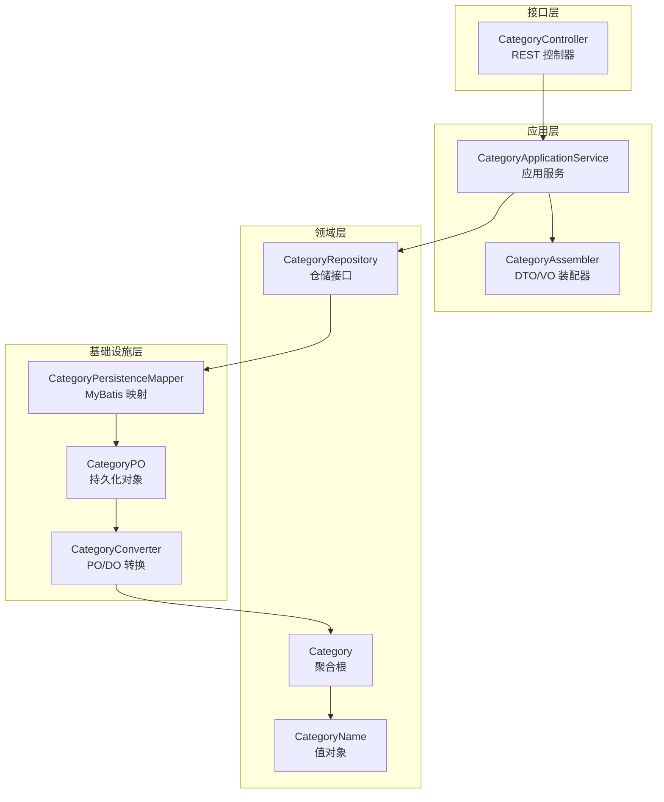
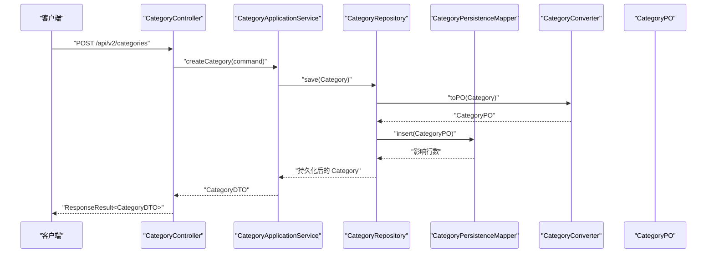
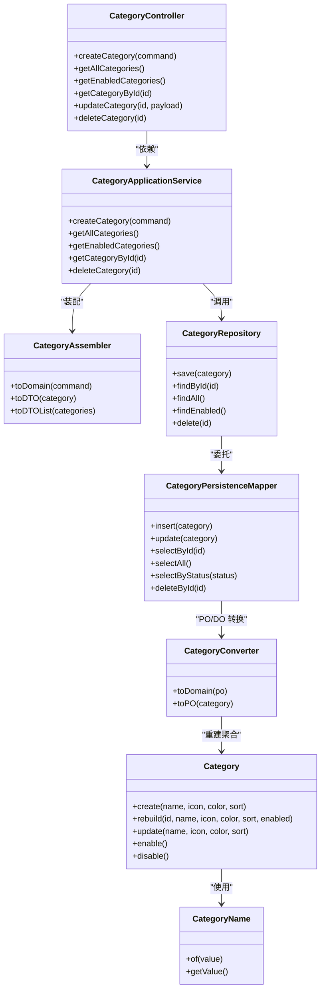

# 分类接口

<cite>
**本文引用的文件**
- [CategoryController.java](file://src/main/java/com/crazydream/interfaces/category/CategoryController.java)
- [CategoryApplicationService.java](file://src/main/java/com/crazydream/application/category/service/CategoryApplicationService.java)
- [CategoryAssembler.java](file://src/main/java/com/crazydream/application/category/assembler/CategoryAssembler.java)
- [CategoryDTO.java](file://src/main/java/com/crazydream/application/category/dto/CategoryDTO.java)
- [CreateCategoryCommand.java](file://src/main/java/com/crazydream/application/category/dto/CreateCategoryCommand.java)
- [Category.java](file://src/main/java/com/crazydream/domain/category/model/aggregate/Category.java)
- [CategoryName.java](file://src/main/java/com/crazydream/domain/category/model/valueobject/CategoryName.java)
- [CategoryRepository.java](file://src/main/java/com/crazydream/domain/category/repository/CategoryRepository.java)
- [CategoryPersistenceMapper.java](file://src/main/java/com/crazydream/infrastructure/persistence/mapper/CategoryPersistenceMapper.java)
- [CategoryConverter.java](file://src/main/java/com/crazydream/infrastructure/persistence/converter/CategoryConverter.java)
- [CategoryPO.java](file://src/main/java/com/crazydream/infrastructure/persistence/po/CategoryPO.java)
- [ResponseResult.java](file://src/main/java/com/crazydream/utils/ResponseResult.java)
</cite>

## 目录
1. [简介](#简介)
2. [项目结构](#项目结构)
3. [核心组件](#核心组件)
4. [架构总览](#架构总览)
5. [详细组件分析](#详细组件分析)
6. [依赖关系分析](#依赖关系分析)
7. [性能考虑](#性能考虑)
8. [故障排查指南](#故障排查指南)
9. [结论](#结论)
10. [附录](#附录)

## 简介
本文件为“分类模块”的详细 API 接口文档，覆盖分类管理的完整生命周期接口：创建分类、获取全部分类、获取启用的分类、按 ID 获取分类、更新分类、删除分类。文档同时说明分类的图标、颜色、排序字段的使用方法，状态管理与启用/禁用机制，数据结构与字段校验规则，以及分类与目标之间的业务关联与数据一致性保障方式，并给出排序算法与前端展示建议。

## 项目结构
分类模块采用分层架构，接口层负责暴露 REST API，应用服务层编排业务流程，领域层维护聚合与值对象，基础设施层负责持久化映射与 PO 转换。

图表来源
- [CategoryController.java](file://src/main/java/com/crazydream/interfaces/category/CategoryController.java#L1-L83)
- [CategoryApplicationService.java](file://src/main/java/com/crazydream/application/category/service/CategoryApplicationService.java#L1-L48)
- [CategoryAssembler.java](file://src/main/java/com/crazydream/application/category/assembler/CategoryAssembler.java#L1-L42)
- [CategoryRepository.java](file://src/main/java/com/crazydream/domain/category/repository/CategoryRepository.java#L1-L16)
- [CategoryPersistenceMapper.java](file://src/main/java/com/crazydream/infrastructure/persistence/mapper/CategoryPersistenceMapper.java#L1-L16)
- [CategoryConverter.java](file://src/main/java/com/crazydream/infrastructure/persistence/converter/CategoryConverter.java#L1-L38)
- [CategoryPO.java](file://src/main/java/com/crazydream/infrastructure/persistence/po/CategoryPO.java#L1-L14)
- [Category.java](file://src/main/java/com/crazydream/domain/category/model/aggregate/Category.java#L1-L83)
- [CategoryName.java](file://src/main/java/com/crazydream/domain/category/model/valueobject/CategoryName.java#L1-L34)

章节来源
- [CategoryController.java](file://src/main/java/com/crazydream/interfaces/category/CategoryController.java#L1-L83)
- [CategoryApplicationService.java](file://src/main/java/com/crazydream/application/category/service/CategoryApplicationService.java#L1-L48)

## 核心组件
- 接口控制器：提供 REST API，统一响应包装。
- 应用服务：编排业务流程，处理事务与装配 DTO。
- 领域模型：聚合根 Category 及值对象 CategoryName，维护状态与行为。
- 仓储接口：定义保存、查询、删除等操作。
- 基础设施：Mapper 映射数据库表，Converter 负责 PO/DO 转换，PO 对应数据库表字段。

章节来源
- [CategoryController.java](file://src/main/java/com/crazydream/interfaces/category/CategoryController.java#L1-L83)
- [CategoryApplicationService.java](file://src/main/java/com/crazydream/application/category/service/CategoryApplicationService.java#L1-L48)
- [Category.java](file://src/main/java/com/crazydream/domain/category/model/aggregate/Category.java#L1-L83)
- [CategoryName.java](file://src/main/java/com/crazydream/domain/category/model/valueobject/CategoryName.java#L1-L34)
- [CategoryRepository.java](file://src/main/java/com/crazydream/domain/category/repository/CategoryRepository.java#L1-L16)
- [CategoryPersistenceMapper.java](file://src/main/java/com/crazydream/infrastructure/persistence/mapper/CategoryPersistenceMapper.java#L1-L16)
- [CategoryConverter.java](file://src/main/java/com/crazydream/infrastructure/persistence/converter/CategoryConverter.java#L1-L38)
- [CategoryPO.java](file://src/main/java/com/crazydream/infrastructure/persistence/po/CategoryPO.java#L1-L14)

## 架构总览
分类模块遵循 DDD 分层，接口层通过应用服务调用仓储，仓储通过 MyBatis Mapper 访问数据库，PO 由 Converter 在持久化与领域模型之间转换。状态字段在 PO 中以整型表示，在领域模型中以布尔值表达，转换时进行映射。

图表来源
- [CategoryController.java](file://src/main/java/com/crazydream/interfaces/category/CategoryController.java#L18-L26)
- [CategoryApplicationService.java](file://src/main/java/com/crazydream/application/category/service/CategoryApplicationService.java#L20-L25)
- [CategoryAssembler.java](file://src/main/java/com/crazydream/application/category/assembler/CategoryAssembler.java#L12-L19)
- [CategoryConverter.java](file://src/main/java/com/crazydream/infrastructure/persistence/converter/CategoryConverter.java#L23-L36)
- [CategoryPersistenceMapper.java](file://src/main/java/com/crazydream/infrastructure/persistence/mapper/CategoryPersistenceMapper.java#L9-L10)

## 详细组件分析

### API 定义与请求/响应规范
- 基础路径：/api/v2/categories
- 统一响应包装：使用 ResponseResult 包裹 code、message、data；HTTP 状态码根据 code 自动映射。

接口一览
- POST /api/v2/categories
  - 功能：创建分类
  - 请求体：CreateCategoryCommand
  - 响应体：CategoryDTO
  - 成功：200 OK
  - 失败：400 Bad Request（参数或业务异常）

- GET /api/v2/categories
  - 功能：获取全部分类
  - 响应体：List<CategoryDTO>
  - 成功：200 OK
  - 失败：500 Internal Server Error

- GET /api/v2/categories/enabled
  - 功能：获取启用的分类
  - 响应体：List<CategoryDTO>
  - 成功：200 OK
  - 失败：500 Internal Server Error

- GET /api/v2/categories/{id}
  - 功能：按 ID 获取分类
  - 路径参数：id（Long）
  - 响应体：CategoryDTO
  - 成功：200 OK
  - 失败：404 Not Found

- PUT /api/v2/categories/{id}
  - 功能：更新分类（简化实现：仅支持动态字段更新，返回更新后的 DTO）
  - 路径参数：id（Long）
  - 请求体：Map<String,Object>（示例：name）
  - 响应体：CategoryDTO
  - 成功：200 OK
  - 失败：400 Bad Request

- DELETE /api/v2/categories/{id}
  - 功能：删除分类
  - 路径参数：id（Long）
  - 响应体：Boolean
  - 成功：200 OK
  - 失败：500 Internal Server Error

章节来源
- [CategoryController.java](file://src/main/java/com/crazydream/interfaces/category/CategoryController.java#L18-L81)
- [ResponseResult.java](file://src/main/java/com/crazydream/utils/ResponseResult.java#L14-L149)

### 数据模型与字段说明
- CreateCategoryCommand（创建请求体）
  - 字段：name（字符串）、icon（字符串）、color（字符串）、sort（整数）
  - 用途：创建分类时的输入参数

- CategoryDTO（通用输出 DTO）
  - 字段：id（长整型）、name（字符串）、icon（字符串）、color（字符串）、sort（整数）、enabled（布尔）
  - 用途：对外输出分类信息

- CategoryPO（持久化对象）
  - 字段：id（长整型）、name（字符串）、icon（字符串）、color（字符串）、sort（整数）、status（整数，1 启用，0 禁用）
  - 用途：数据库表映射

- Category（领域聚合根）
  - 字段：id（CategoryId）、name（CategoryName）、icon（字符串）、color（字符串）、sort（整数）、enabled（布尔）
  - 行为：create、rebuild、update、enable、disable

- CategoryName（值对象）
  - 约束：非空且去除首尾空白；否则抛出非法参数异常

章节来源
- [CreateCategoryCommand.java](file://src/main/java/com/crazydream/application/category/dto/CreateCategoryCommand.java#L1-L12)
- [CategoryDTO.java](file://src/main/java/com/crazydream/application/category/dto/CategoryDTO.java#L1-L14)
- [CategoryPO.java](file://src/main/java/com/crazydream/infrastructure/persistence/po/CategoryPO.java#L1-L14)
- [Category.java](file://src/main/java/com/crazydream/domain/category/model/aggregate/Category.java#L11-L56)
- [CategoryName.java](file://src/main/java/com/crazydream/domain/category/model/valueobject/CategoryName.java#L8-L12)

### 字段验证与约束
- 名称校验：CategoryName 的 of 方法对空值与空白字符串进行校验，非法将抛出异常。
- 其他字段：未在当前代码中显式校验，建议在接口层或应用层补充长度、格式等校验（如 icon/color 的格式、sort 的范围）。

章节来源
- [CategoryName.java](file://src/main/java/com/crazydream/domain/category/model/valueobject/CategoryName.java#L8-L12)

### 状态管理与启用/禁用机制
- 存储层：PO 的 status 字段使用 1 表示启用、0 表示禁用。
- 领域层：Category 的 enabled 字段为布尔值，默认创建即启用。
- 转换层：Converter 在 toDomain/toPO 时进行状态映射。
- 当前实现：应用服务未提供显式的启用/禁用接口，但领域模型具备 enable/disable 行为。

章节来源
- [CategoryPO.java](file://src/main/java/com/crazydream/infrastructure/persistence/po/CategoryPO.java#L12)
- [Category.java](file://src/main/java/com/crazydream/domain/category/model/aggregate/Category.java#L21-L56)
- [CategoryConverter.java](file://src/main/java/com/crazydream/infrastructure/persistence/converter/CategoryConverter.java#L19-L34)

### 图标、颜色与排序字段使用方法
- 图标 icon：用于前端展示分类的视觉标识，建议使用矢量图标或可缩放资源。
- 颜色 color：用于前端主题色或标签色，建议使用十六进制颜色值。
- 排序 sort：整数字段，数值越小优先级越高（或显示顺序越靠前），用于前端列表排序与展示。

章节来源
- [CreateCategoryCommand.java](file://src/main/java/com/crazydream/application/category/dto/CreateCategoryCommand.java#L7-L10)
- [CategoryDTO.java](file://src/main/java/com/crazydream/application/category/dto/CategoryDTO.java#L8-L12)
- [Category.java](file://src/main/java/com/crazydream/domain/category/model/aggregate/Category.java#L14-L17)

### 分类与目标的业务关联与一致性
- 关联关系：目标（Goal/SubGoal）通常会关联到分类（Category），用于归类与统计。
- 一致性保障：当前仓库未提供目标与分类的直接关联代码，建议在目标实体中引入 CategoryId 并在删除分类前检查是否存在关联目标，若存在则拒绝删除或执行级联处理策略。
- 建议：在应用服务层增加删除前的关联检查与事务控制，确保数据一致性。

章节来源
- [Category.java](file://src/main/java/com/crazydream/domain/category/model/aggregate/Category.java#L1-L83)

### 排序算法与前端展示规则
- 排序字段：sort（整数）作为排序依据。
- 排序算法：建议采用稳定排序（如归并排序）对集合按 sort 升序排列；若存在相同 sort 值，可再按 id 或创建时间二次排序。
- 展示规则：前端按排序结果从上到下渲染；启用状态的分类参与展示，禁用分类可隐藏或置灰。

章节来源
- [Category.java](file://src/main/java/com/crazydream/domain/category/model/aggregate/Category.java#L16-L17)

### 更新接口简化说明
- 当前 PUT 实现为简化版本：仅当请求体包含 name 时更新 DTO 的 name 字段并返回，未真正持久化。
- 建议：完善更新逻辑，接收 CategoryDTO 或专用 UpdateCategoryCommand，调用领域模型 update 并持久化。

章节来源
- [CategoryController.java](file://src/main/java/com/crazydream/interfaces/category/CategoryController.java#L58-L71)

## 依赖关系分析

图表来源
- [CategoryController.java](file://src/main/java/com/crazydream/interfaces/category/CategoryController.java#L1-L83)
- [CategoryApplicationService.java](file://src/main/java/com/crazydream/application/category/service/CategoryApplicationService.java#L1-L48)
- [CategoryAssembler.java](file://src/main/java/com/crazydream/application/category/assembler/CategoryAssembler.java#L1-L42)
- [CategoryRepository.java](file://src/main/java/com/crazydream/domain/category/repository/CategoryRepository.java#L1-L16)
- [CategoryPersistenceMapper.java](file://src/main/java/com/crazydream/infrastructure/persistence/mapper/CategoryPersistenceMapper.java#L1-L16)
- [CategoryConverter.java](file://src/main/java/com/crazydream/infrastructure/persistence/converter/CategoryConverter.java#L1-L38)
- [Category.java](file://src/main/java/com/crazydream/domain/category/model/aggregate/Category.java#L1-L83)
- [CategoryName.java](file://src/main/java/com/crazydream/domain/category/model/valueobject/CategoryName.java#L1-L34)

## 性能考虑
- 查询优化：全量查询与启用查询均走数据库，建议在 sort 与 status 上建立索引以提升排序与筛选性能。
- DTO 装配：批量转换使用流式处理，注意大数据量下的内存占用与 GC 压力。
- 事务边界：创建与删除为单点事务，避免跨聚合的长事务；更新接口建议明确事务范围。
- 缓存策略：对只读的启用分类列表可考虑缓存，结合状态变更失效策略。

## 故障排查指南
- 400 错误（创建/更新失败）
  - 可能原因：名称为空或空白；请求体格式不正确。
  - 排查步骤：检查 CreateCategoryCommand 与请求体字段；查看领域值对象校验日志。
- 404 错误（按 ID 查询不存在）
  - 可能原因：ID 不存在或已被删除。
  - 排查步骤：确认 ID 是否正确；检查数据库是否存在对应记录。
- 500 错误（服务器内部错误）
  - 可能原因：数据库异常、转换异常、事务回滚。
  - 排查步骤：查看应用日志；检查 Mapper 与 Converter 的映射是否一致。

章节来源
- [CategoryController.java](file://src/main/java/com/crazydream/interfaces/category/CategoryController.java#L20-L25)
- [CategoryController.java](file://src/main/java/com/crazydream/interfaces/category/CategoryController.java#L49-L55)
- [CategoryController.java](file://src/main/java/com/crazydream/interfaces/category/CategoryController.java#L74-L80)
- [CategoryName.java](file://src/main/java/com/crazydream/domain/category/model/valueobject/CategoryName.java#L8-L12)

## 结论
分类模块提供了完整的 CRUD 能力与统一响应包装，状态管理与持久化映射清晰。当前更新接口为简化实现，建议补齐完整更新逻辑与字段校验；同时建议完善启用/禁用接口与分类删除前的关联检查，以保证业务一致性与用户体验。

## 附录

### 字段与类型对照表
- CreateCategoryCommand
  - name → 字符串
  - icon → 字符串
  - color → 字符串
  - sort → 整数
- CategoryDTO
  - id → 长整型
  - name → 字符串
  - icon → 字符串
  - color → 字符串
  - sort → 整数
  - enabled → 布尔
- CategoryPO
  - id → 长整型
  - name → 字符串
  - icon → 字符串
  - color → 字符串
  - sort → 整数
  - status → 整数（1 启用，0 禁用）

章节来源
- [CreateCategoryCommand.java](file://src/main/java/com/crazydream/application/category/dto/CreateCategoryCommand.java#L7-L10)
- [CategoryDTO.java](file://src/main/java/com/crazydream/application/category/dto/CategoryDTO.java#L7-L12)
- [CategoryPO.java](file://src/main/java/com/crazydream/infrastructure/persistence/po/CategoryPO.java#L7-L12)