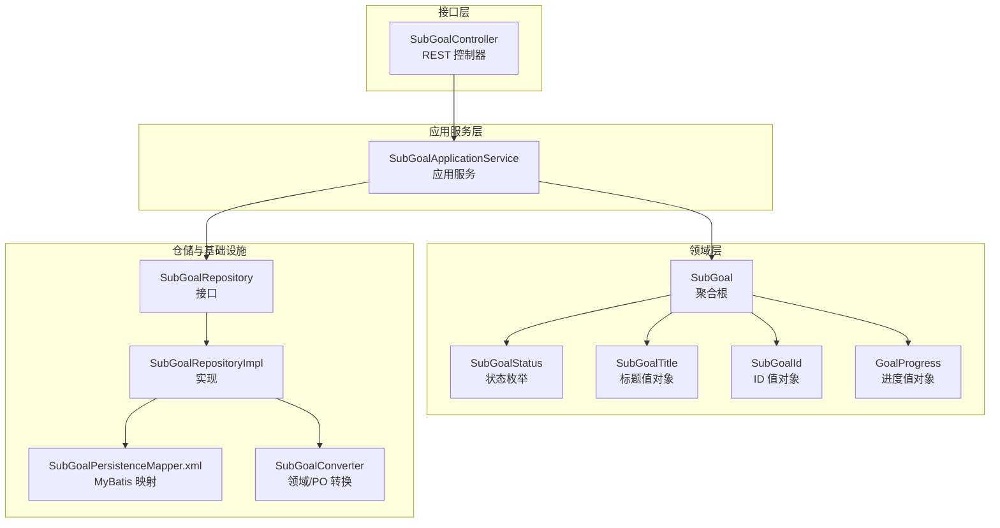
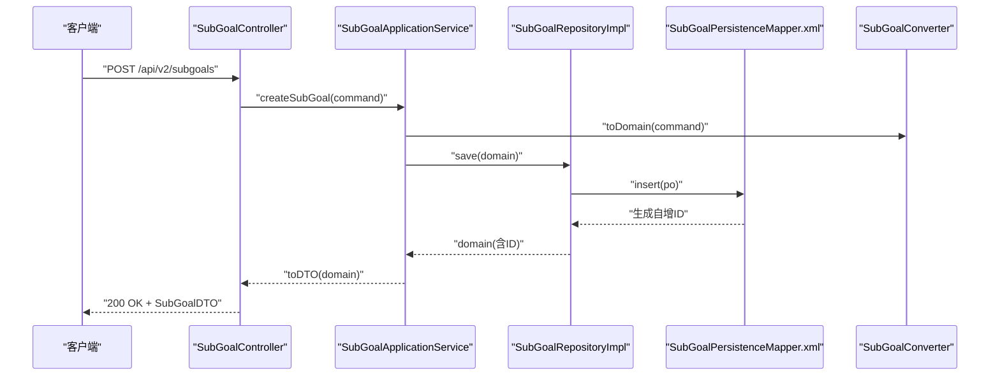
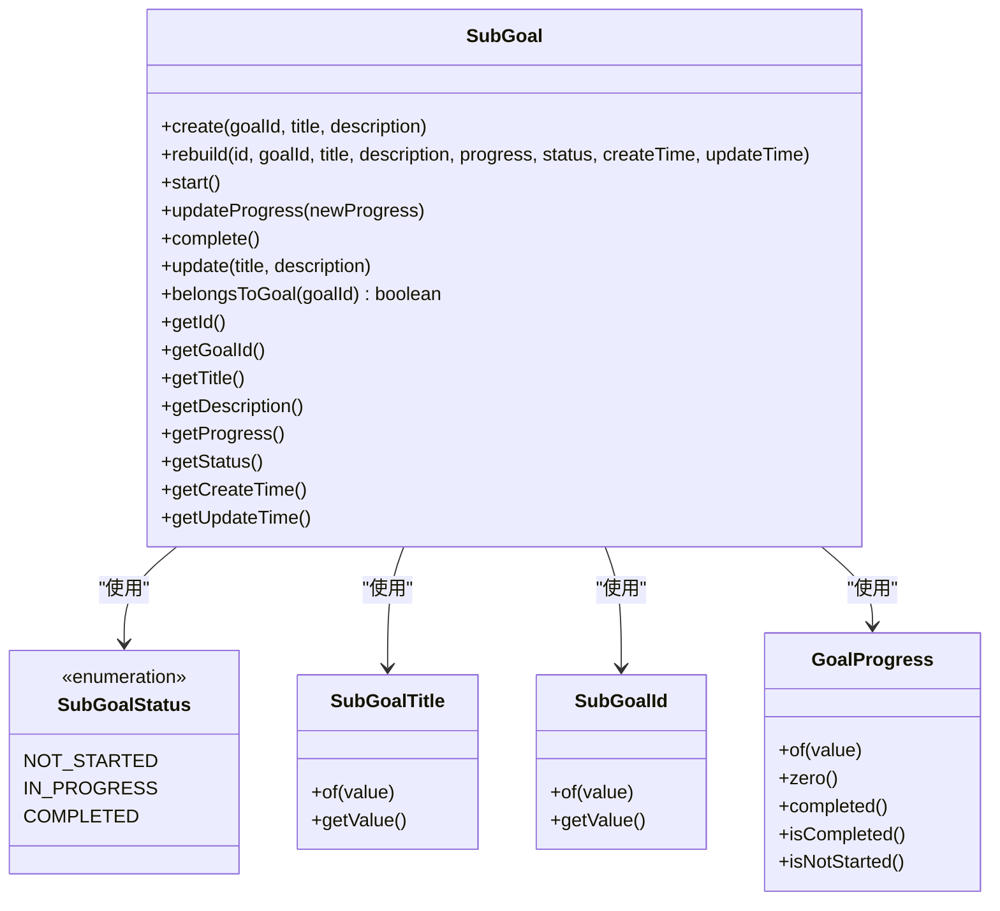
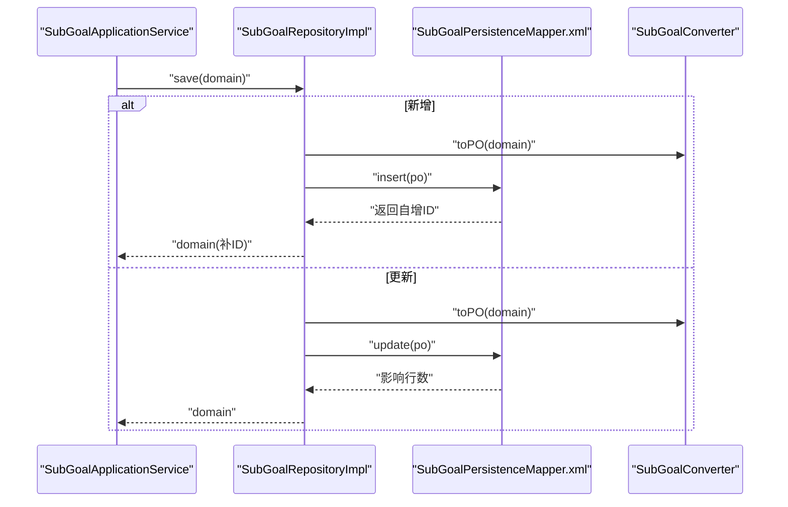
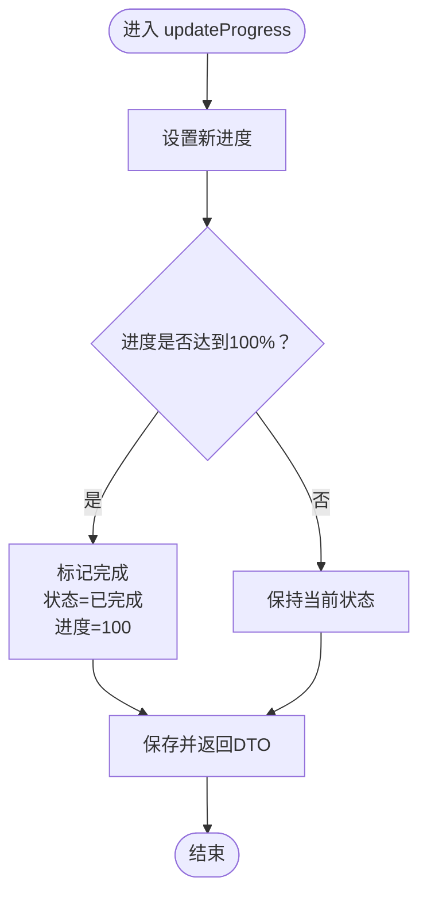
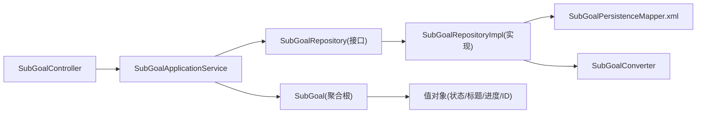

# 子目标接口

<cite>
**本文引用的文件**
- [SubGoalController.java](file://src/main/java/com/crazydream/interfaces/subgoal/SubGoalController.java)
- [SubGoalApplicationService.java](file://src/main/java/com/crazydream/application/subgoal/service/SubGoalApplicationService.java)
- [SubGoalAssembler.java](file://src/main/java/com/crazydream/application/subgoal/assembler/SubGoalAssembler.java)
- [SubGoalRepository.java](file://src/main/java/com/crazydream/domain/subgoal/repository/SubGoalRepository.java)
- [SubGoalRepositoryImpl.java](file://src/main/java/com/crazydream/infrastructure/persistence/repository/SubGoalRepositoryImpl.java)
- [SubGoal.java](file://src/main/java/com/crazydream/domain/subgoal/model/aggregate/SubGoal.java)
- [SubGoalStatus.java](file://src/main/java/com/crazydream/domain/subgoal/model/valueobject/SubGoalStatus.java)
- [SubGoalTitle.java](file://src/main/java/com/crazydream/domain/subgoal/model/valueobject/SubGoalTitle.java)
- [SubGoalId.java](file://src/main/java/com/crazydream/domain/subgoal/model/valueobject/SubGoalId.java)
- [GoalProgress.java](file://src/main/java/com/crazydream/domain/goal/model/valueobject/GoalProgress.java)
- [GoalStatus.java](file://src/main/java/com/crazydream/domain/goal/model/valueobject/GoalStatus.java)
- [SubGoalPersistenceMapper.xml](file://src/main/resources/mapper/SubGoalPersistenceMapper.xml)
- [SubGoalDTO.java](file://src/main/java/com/crazydream/application/subgoal/dto/SubGoalDTO.java)
- [CreateSubGoalCommand.java](file://src/main/java/com/crazydream/application/subgoal/dto/CreateSubGoalCommand.java)
- [SubGoalConverter.java](file://src/main/java/com/crazydream/infrastructure/persistence/converter/SubGoalConverter.java)
</cite>

## 目录
1. [简介](#简介)
2. [项目结构](#项目结构)
3. [核心组件](#核心组件)
4. [架构总览](#架构总览)
5. [详细组件分析](#详细组件分析)
6. [依赖关系分析](#依赖关系分析)
7. [性能考虑](#性能考虑)
8. [故障排查指南](#故障排查指南)
9. [结论](#结论)
10. [附录](#附录)

## 简介
本文件为子目标模块的详细 API 接口文档，覆盖创建、查询、更新、删除及批量删除等能力，并深入说明子目标与父目标（目标）的关联关系、层级结构、状态管理（未开始、进行中、已完成）、进度计算方式、优先级与截止日期现状、以及子目标完成对父目标进度的影响机制与状态同步逻辑。同时记录了批量操作与数据迁移路径。

## 项目结构
子目标模块采用分层架构：接口层（Controller）负责暴露 REST API；应用服务层（ApplicationService）编排业务流程；领域层（Aggregate/ValueObject）封装业务规则；仓储层（Repository）抽象持久化；基础设施层（MyBatis Mapper/Converter）实现数据访问与转换。

图表来源
- [SubGoalController.java](file://src/main/java/com/crazydream/interfaces/subgoal/SubGoalController.java#L1-L116)
- [SubGoalApplicationService.java](file://src/main/java/com/crazydream/application/subgoal/service/SubGoalApplicationService.java#L1-L61)
- [SubGoalRepository.java](file://src/main/java/com/crazydream/domain/subgoal/repository/SubGoalRepository.java#L1-L17)
- [SubGoalRepositoryImpl.java](file://src/main/java/com/crazydream/infrastructure/persistence/repository/SubGoalRepositoryImpl.java#L1-L62)
- [SubGoalPersistenceMapper.xml](file://src/main/resources/mapper/SubGoalPersistenceMapper.xml#L1-L48)
- [SubGoalConverter.java](file://src/main/java/com/crazydream/infrastructure/persistence/converter/SubGoalConverter.java#L1-L43)
- [SubGoal.java](file://src/main/java/com/crazydream/domain/subgoal/model/aggregate/SubGoal.java#L1-L118)
- [SubGoalStatus.java](file://src/main/java/com/crazydream/domain/subgoal/model/valueobject/SubGoalStatus.java#L1-L39)
- [SubGoalTitle.java](file://src/main/java/com/crazydream/domain/subgoal/model/valueobject/SubGoalTitle.java#L1-L44)
- [SubGoalId.java](file://src/main/java/com/crazydream/domain/subgoal/model/valueobject/SubGoalId.java#L1-L39)
- [GoalProgress.java](file://src/main/java/com/crazydream/domain/goal/model/valueobject/GoalProgress.java#L1-L78)

章节来源
- [SubGoalController.java](file://src/main/java/com/crazydream/interfaces/subgoal/SubGoalController.java#L1-L116)
- [SubGoalApplicationService.java](file://src/main/java/com/crazydream/application/subgoal/service/SubGoalApplicationService.java#L1-L61)
- [SubGoalRepository.java](file://src/main/java/com/crazydream/domain/subgoal/repository/SubGoalRepository.java#L1-L17)
- [SubGoalRepositoryImpl.java](file://src/main/java/com/crazydream/infrastructure/persistence/repository/SubGoalRepositoryImpl.java#L1-L62)
- [SubGoalPersistenceMapper.xml](file://src/main/resources/mapper/SubGoalPersistenceMapper.xml#L1-L48)
- [SubGoalConverter.java](file://src/main/java/com/crazydream/infrastructure/persistence/converter/SubGoalConverter.java#L1-L43)
- [SubGoal.java](file://src/main/java/com/crazydream/domain/subgoal/model/aggregate/SubGoal.java#L1-L118)
- [SubGoalStatus.java](file://src/main/java/com/crazydream/domain/subgoal/model/valueobject/SubGoalStatus.java#L1-L39)
- [SubGoalTitle.java](file://src/main/java/com/crazydream/domain/subgoal/model/valueobject/SubGoalTitle.java#L1-L44)
- [SubGoalId.java](file://src/main/java/com/crazydream/domain/subgoal/model/valueobject/SubGoalId.java#L1-L39)
- [GoalProgress.java](file://src/main/java/com/crazydream/domain/goal/model/valueobject/GoalProgress.java#L1-L78)

## 核心组件
- 接口控制器：提供 REST API，处理请求与响应包装。
- 应用服务：编排业务流程，事务控制，调用仓储与装配器。
- 领域模型：子目标聚合根与值对象，封装业务规则与状态机。
- 仓储接口与实现：抽象与实现持久化操作，支持单条与批量删除。
- 数据访问：MyBatis 映射文件定义 SQL，转换器负责领域对象与 PO 的双向转换。

章节来源
- [SubGoalController.java](file://src/main/java/com/crazydream/interfaces/subgoal/SubGoalController.java#L1-L116)
- [SubGoalApplicationService.java](file://src/main/java/com/crazydream/application/subgoal/service/SubGoalApplicationService.java#L1-L61)
- [SubGoal.java](file://src/main/java/com/crazydream/domain/subgoal/model/aggregate/SubGoal.java#L1-L118)
- [SubGoalRepository.java](file://src/main/java/com/crazydream/domain/subgoal/repository/SubGoalRepository.java#L1-L17)
- [SubGoalRepositoryImpl.java](file://src/main/java/com/crazydream/infrastructure/persistence/repository/SubGoalRepositoryImpl.java#L1-L62)
- [SubGoalPersistenceMapper.xml](file://src/main/resources/mapper/SubGoalPersistenceMapper.xml#L1-L48)
- [SubGoalAssembler.java](file://src/main/java/com/crazydream/application/subgoal/assembler/SubGoalAssembler.java#L1-L44)
- [SubGoalConverter.java](file://src/main/java/com/crazydream/infrastructure/persistence/converter/SubGoalConverter.java#L1-L43)

## 架构总览
子目标模块遵循 DDD 分层与六边形架构思想，接口层仅负责协议与参数校验，应用层编排业务，领域层承载核心业务规则，仓储与基础设施层屏蔽数据访问细节。

图表来源
- [SubGoalController.java](file://src/main/java/com/crazydream/interfaces/subgoal/SubGoalController.java#L18-L26)
- [SubGoalApplicationService.java](file://src/main/java/com/crazydream/application/subgoal/service/SubGoalApplicationService.java#L21-L26)
- [SubGoalRepositoryImpl.java](file://src/main/java/com/crazydream/infrastructure/persistence/repository/SubGoalRepositoryImpl.java#L23-L33)
- [SubGoalPersistenceMapper.xml](file://src/main/resources/mapper/SubGoalPersistenceMapper.xml#L7-L11)
- [SubGoalAssembler.java](file://src/main/java/com/crazydream/application/subgoal/assembler/SubGoalAssembler.java#L13-L19)
- [SubGoalConverter.java](file://src/main/java/com/crazydream/infrastructure/persistence/converter/SubGoalConverter.java#L26-L41)

## 详细组件分析

### 接口层（REST API）
- 基础路径：/api/v2/subgoals
- 支持方法与路径：
  - POST /api/v2/subgoals：创建子目标
  - GET /api/v2/subgoals：获取当前用户的所有子目标（当前实现返回空列表）
  - GET /api/v2/subgoals/goal/{goalId}：按父目标ID查询子目标列表
  - GET /api/v2/subgoals/{id}：按ID查询子目标详情
  - PUT /api/v2/subgoals/{id}：更新子目标（支持进度字段与标题/描述）
  - PATCH /api/v2/subgoals/{id}/complete：标记子目标为完成（进度=100）
  - DELETE /api/v2/subgoals/{id}：删除子目标
  - DELETE /api/v2/subgoals/batch：批量删除子目标（传入ID数组）
  - PATCH /api/v2/subgoals/{id}/progress：按进度参数更新子目标

请求与响应示例（以路径为准）
- 创建子目标
  - 请求体：CreateSubGoalCommand（goalId, title, description）
  - 响应体：SubGoalDTO
  - 参考路径：[SubGoalController.java](file://src/main/java/com/crazydream/interfaces/subgoal/SubGoalController.java#L18-L26)，[CreateSubGoalCommand.java](file://src/main/java/com/crazydream/application/subgoal/dto/CreateSubGoalCommand.java#L1-L11)，[SubGoalDTO.java](file://src/main/java/com/crazydream/application/subgoal/dto/SubGoalDTO.java#L1-L17)
- 查询子目标列表（按父目标）
  - 路径参数：goalId
  - 响应体：List<SubGoalDTO>
  - 参考路径：[SubGoalController.java](file://src/main/java/com/crazydream/interfaces/subgoal/SubGoalController.java#L38-L46)，[SubGoalApplicationService.java](file://src/main/java/com/crazydream/application/subgoal/service/SubGoalApplicationService.java#L28-L31)
- 按ID查询
  - 路径参数：id
  - 响应体：SubGoalDTO
  - 参考路径：[SubGoalController.java](file://src/main/java/com/crazydream/interfaces/subgoal/SubGoalController.java#L48-L56)，[SubGoalApplicationService.java](file://src/main/java/com/crazydream/application/subgoal/service/SubGoalApplicationService.java#L33-L37)
- 更新进度（PUT）
  - 路径参数：id
  - 请求体：Map<String,Object>，可包含 progress 字段
  - 响应体：SubGoalDTO
  - 参考路径：[SubGoalController.java](file://src/main/java/com/crazydream/interfaces/subgoal/SubGoalController.java#L58-L73)，[SubGoalApplicationService.java](file://src/main/java/com/crazydream/application/subgoal/service/SubGoalApplicationService.java#L52-L59)
- 标记完成（PATCH）
  - 路径参数：id
  - 响应体：SubGoalDTO
  - 参考路径：[SubGoalController.java](file://src/main/java/com/crazydream/interfaces/subgoal/SubGoalController.java#L75-L84)
- 删除单个（DELETE）
  - 路径参数：id
  - 响应体：Boolean
  - 参考路径：[SubGoalController.java](file://src/main/java/com/crazydream/interfaces/subgoal/SubGoalController.java#L86-L94)，[SubGoalApplicationService.java](file://src/main/java/com/crazydream/application/subgoal/service/SubGoalApplicationService.java#L39-L42)
- 批量删除（DELETE）
  - 请求体：List<Long>（IDs）
  - 响应体：Integer（删除数量）
  - 参考路径：[SubGoalController.java](file://src/main/java/com/crazydream/interfaces/subgoal/SubGoalController.java#L96-L104)，[SubGoalApplicationService.java](file://src/main/java/com/crazydream/application/subgoal/service/SubGoalApplicationService.java#L44-L50)

章节来源
- [SubGoalController.java](file://src/main/java/com/crazydream/interfaces/subgoal/SubGoalController.java#L1-L116)
- [SubGoalApplicationService.java](file://src/main/java/com/crazydream/application/subgoal/service/SubGoalApplicationService.java#L1-L61)
- [CreateSubGoalCommand.java](file://src/main/java/com/crazydream/application/subgoal/dto/CreateSubGoalCommand.java#L1-L11)
- [SubGoalDTO.java](file://src/main/java/com/crazydream/application/subgoal/dto/SubGoalDTO.java#L1-L17)

### 应用服务层（业务编排）
- 负责事务边界（@Transactional），调用仓储与装配器。
- 提供的能力：
  - createSubGoal：命令转领域对象，保存后转DTO返回
  - getSubGoalsByGoalId：按父目标ID查询子目标列表
  - getSubGoalById：按ID查询子目标
  - updateProgress：更新进度并触发状态机（自动完成）
  - deleteSubGoal：删除单个子目标
  - batchDeleteSubGoals：批量删除子目标
- 关键点：
  - 进度更新通过领域对象的 updateProgress 触发状态变更
  - 异常时抛出非法参数异常，由控制器捕获并返回错误码

章节来源
- [SubGoalApplicationService.java](file://src/main/java/com/crazydream/application/subgoal/service/SubGoalApplicationService.java#L1-L61)
- [SubGoalAssembler.java](file://src/main/java/com/crazydream/application/subgoal/assembler/SubGoalAssembler.java#L1-L44)

### 领域层（业务规则与状态机）
- 子目标聚合根（充血模型）：
  - 关键属性：父目标ID、标题、描述、进度、状态、创建/更新时间
  - 关联关系：通过 GoalId 与父目标建立一对多关系
  - 状态机：未开始 → 进行中 → 已完成；进度达到100%自动完成
- 值对象：
  - SubGoalStatus：状态枚举（未开始、进行中、已完成）
  - SubGoalTitle：标题值对象，带长度校验
  - SubGoalId：ID 值对象，校验非空与正数
  - GoalProgress：进度值对象（0-100），提供 isCompleted/isNotStarted 等判定
- 业务行为：
  - create：初始化进度为0%，状态为未开始
  - updateProgress：设置进度并检查是否完成，完成后自动置状态为已完成
  - complete：直接完成并设置进度为100%
  - update：更新标题与描述

图表来源
- [SubGoal.java](file://src/main/java/com/crazydream/domain/subgoal/model/aggregate/SubGoal.java#L1-L118)
- [SubGoalStatus.java](file://src/main/java/com/crazydream/domain/subgoal/model/valueobject/SubGoalStatus.java#L1-L39)
- [SubGoalTitle.java](file://src/main/java/com/crazydream/domain/subgoal/model/valueobject/SubGoalTitle.java#L1-L44)
- [SubGoalId.java](file://src/main/java/com/crazydream/domain/subgoal/model/valueobject/SubGoalId.java#L1-L39)
- [GoalProgress.java](file://src/main/java/com/crazydream/domain/goal/model/valueobject/GoalProgress.java#L1-L78)

章节来源
- [SubGoal.java](file://src/main/java/com/crazydream/domain/subgoal/model/aggregate/SubGoal.java#L1-L118)
- [SubGoalStatus.java](file://src/main/java/com/crazydream/domain/subgoal/model/valueobject/SubGoalStatus.java#L1-L39)
- [SubGoalTitle.java](file://src/main/java/com/crazydream/domain/subgoal/model/valueobject/SubGoalTitle.java#L1-L44)
- [SubGoalId.java](file://src/main/java/com/crazydream/domain/subgoal/model/valueobject/SubGoalId.java#L1-L39)
- [GoalProgress.java](file://src/main/java/com/crazydream/domain/goal/model/valueobject/GoalProgress.java#L1-L78)

### 仓储与持久化
- 仓储接口定义：
  - save、findById、findByGoalId、delete、batchDelete
- 实现类：
  - SubGoalRepositoryImpl：调用 MyBatis Mapper，PO/DTO 转换通过 Converter
- Mapper：
  - insert、update、selectById、selectByGoalId、deleteById、batchDelete
- 转换器：
  - SubGoalConverter：领域对象与 PO 的双向转换

图表来源
- [SubGoalApplicationService.java](file://src/main/java/com/crazydream/application/subgoal/service/SubGoalApplicationService.java#L21-L26)
- [SubGoalRepositoryImpl.java](file://src/main/java/com/crazydream/infrastructure/persistence/repository/SubGoalRepositoryImpl.java#L23-L33)
- [SubGoalPersistenceMapper.xml](file://src/main/resources/mapper/SubGoalPersistenceMapper.xml#L7-L21)
- [SubGoalConverter.java](file://src/main/java/com/crazydream/infrastructure/persistence/converter/SubGoalConverter.java#L26-L41)

章节来源
- [SubGoalRepository.java](file://src/main/java/com/crazydream/domain/subgoal/repository/SubGoalRepository.java#L1-L17)
- [SubGoalRepositoryImpl.java](file://src/main/java/com/crazydream/infrastructure/persistence/repository/SubGoalRepositoryImpl.java#L1-L62)
- [SubGoalPersistenceMapper.xml](file://src/main/resources/mapper/SubGoalPersistenceMapper.xml#L1-L48)
- [SubGoalConverter.java](file://src/main/java/com/crazydream/infrastructure/persistence/converter/SubGoalConverter.java#L1-L43)

### 子目标与父目标的关联关系与层级结构
- 关联关系：
  - 子目标通过 GoalId 关联到父目标，形成一对多关系
  - 查询接口按父目标ID过滤子目标列表
- 层级结构：
  - 父目标（Goal）为上层目标实体，子目标（SubGoal）为下层执行单元
  - 子目标不跨父目标共享，保证职责单一

章节来源
- [SubGoal.java](file://src/main/java/com/crazydream/domain/subgoal/model/aggregate/SubGoal.java#L14-L57)
- [SubGoalRepositoryImpl.java](file://src/main/java/com/crazydream/infrastructure/persistence/repository/SubGoalRepositoryImpl.java#L42-L47)
- [SubGoalPersistenceMapper.xml](file://src/main/resources/mapper/SubGoalPersistenceMapper.xml#L29-L34)

### 状态管理与进度计算
- 状态：
  - 未开始、进行中、已完成
  - 通过 SubGoalStatus 枚举管理，支持从代码到描述的映射
- 进度：
  - 通过 GoalProgress 值对象管理（0-100）
  - updateProgress 自动判断是否完成，完成后状态切换为已完成
- 完成标记：
  - PATCH /{id}/complete 将进度设为100并触发完成逻辑

图表来源
- [SubGoal.java](file://src/main/java/com/crazydream/domain/subgoal/model/aggregate/SubGoal.java#L66-L78)
- [GoalProgress.java](file://src/main/java/com/crazydream/domain/goal/model/valueobject/GoalProgress.java#L44-L46)

章节来源
- [SubGoalStatus.java](file://src/main/java/com/crazydream/domain/subgoal/model/valueobject/SubGoalStatus.java#L1-L39)
- [GoalProgress.java](file://src/main/java/com/crazydream/domain/goal/model/valueobject/GoalProgress.java#L1-L78)
- [SubGoal.java](file://src/main/java/com/crazydream/domain/subgoal/model/aggregate/SubGoal.java#L66-L78)

### 优先级与截止日期管理
- 当前实现未提供优先级与截止日期字段；如需扩展，建议：
  - 在 DTO 与命令对象中新增字段
  - 在领域对象中引入相应值对象
  - 在 Mapper 中增加对应列并更新转换器
- 扩展点参考：
  - DTO：[SubGoalDTO.java](file://src/main/java/com/crazydream/application/subgoal/dto/SubGoalDTO.java#L1-L17)
  - 命令：[CreateSubGoalCommand.java](file://src/main/java/com/crazydream/application/subgoal/dto/CreateSubGoalCommand.java#L1-L11)
  - 领域对象：[SubGoal.java](file://src/main/java/com/crazydream/domain/subgoal/model/aggregate/SubGoal.java#L14-L57)
  - 转换器：[SubGoalConverter.java](file://src/main/java/com/crazydream/infrastructure/persistence/converter/SubGoalConverter.java#L9-L42)
  - Mapper：[SubGoalPersistenceMapper.xml](file://src/main/resources/mapper/SubGoalPersistenceMapper.xml#L7-L21)

### 子目标完成对父目标进度的影响与状态同步
- 当前实现：
  - 子目标完成会触发自身状态与进度更新
  - 未实现“子目标完成自动更新父目标进度”的逻辑
- 建议扩展：
  - 在应用服务层增加对父目标进度的重新计算与更新
  - 可通过统计所有子目标的完成比例作为父目标进度
  - 注意幂等性与事务一致性

章节来源
- [SubGoal.java](file://src/main/java/com/crazydream/domain/subgoal/model/aggregate/SubGoal.java#L66-L78)
- [GoalProgress.java](file://src/main/java/com/crazydream/domain/goal/model/valueobject/GoalProgress.java#L1-L78)
- [GoalStatus.java](file://src/main/java/com/crazydream/domain/goal/model/valueobject/GoalStatus.java#L1-L64)

### 批量操作与数据迁移
- 批量删除：
  - DELETE /api/v2/subgoals/batch：传入ID数组，返回删除数量
  - 实现：应用服务将ID集合转为领域ID集合，调用仓储批量删除
- 数据迁移：
  - 通过 Converter 与 Mapper 实现领域对象与 PO 的双向转换
  - 扩展：可在转换器中加入字段映射与兼容逻辑，支持版本演进

章节来源
- [SubGoalController.java](file://src/main/java/com/crazydream/interfaces/subgoal/SubGoalController.java#L96-L104)
- [SubGoalApplicationService.java](file://src/main/java/com/crazydream/application/subgoal/service/SubGoalApplicationService.java#L44-L50)
- [SubGoalRepositoryImpl.java](file://src/main/java/com/crazydream/infrastructure/persistence/repository/SubGoalRepositoryImpl.java#L54-L60)
- [SubGoalPersistenceMapper.xml](file://src/main/resources/mapper/SubGoalPersistenceMapper.xml#L40-L45)
- [SubGoalConverter.java](file://src/main/java/com/crazydream/infrastructure/persistence/converter/SubGoalConverter.java#L9-L42)

## 依赖关系分析
- 控制器依赖应用服务，应用服务依赖仓储接口与装配器，仓储实现依赖 Mapper 与转换器。
- 领域对象与值对象解耦，便于测试与复用。
- DTO 与命令对象分离，避免领域层受接口层污染。

图表来源
- [SubGoalController.java](file://src/main/java/com/crazydream/interfaces/subgoal/SubGoalController.java#L1-L116)
- [SubGoalApplicationService.java](file://src/main/java/com/crazydream/application/subgoal/service/SubGoalApplicationService.java#L1-L61)
- [SubGoalRepository.java](file://src/main/java/com/crazydream/domain/subgoal/repository/SubGoalRepository.java#L1-L17)
- [SubGoalRepositoryImpl.java](file://src/main/java/com/crazydream/infrastructure/persistence/repository/SubGoalRepositoryImpl.java#L1-L62)
- [SubGoalPersistenceMapper.xml](file://src/main/resources/mapper/SubGoalPersistenceMapper.xml#L1-L48)
- [SubGoalConverter.java](file://src/main/java/com/crazydream/infrastructure/persistence/converter/SubGoalConverter.java#L1-L43)
- [SubGoal.java](file://src/main/java/com/crazydream/domain/subgoal/model/aggregate/SubGoal.java#L1-L118)

章节来源
- [SubGoalController.java](file://src/main/java/com/crazydream/interfaces/subgoal/SubGoalController.java#L1-L116)
- [SubGoalApplicationService.java](file://src/main/java/com/crazydream/application/subgoal/service/SubGoalApplicationService.java#L1-L61)
- [SubGoalRepository.java](file://src/main/java/com/crazydream/domain/subgoal/repository/SubGoalRepository.java#L1-L17)
- [SubGoalRepositoryImpl.java](file://src/main/java/com/crazydream/infrastructure/persistence/repository/SubGoalRepositoryImpl.java#L1-L62)
- [SubGoalPersistenceMapper.xml](file://src/main/resources/mapper/SubGoalPersistenceMapper.xml#L1-L48)
- [SubGoalConverter.java](file://src/main/java/com/crazydream/infrastructure/persistence/converter/SubGoalConverter.java#L1-L43)
- [SubGoal.java](file://src/main/java/com/crazydream/domain/subgoal/model/aggregate/SubGoal.java#L1-L118)

## 性能考虑
- 批量删除使用 MyBatis foreach 批量 IN 条件，减少网络往返。
- 查询按父目标ID排序（按创建时间倒序），有利于前端分页展示。
- 进度更新为单条写入，建议在高并发场景下结合缓存与异步任务优化。

## 故障排查指南
- 常见错误与处理：
  - 子目标不存在：getSubGoalById 抛出非法参数异常，控制器返回404
  - 进度越界：GoalProgress 构造函数校验范围，抛出非法参数异常
  - ID 非法：SubGoalId 校验非空与正数，抛出非法参数异常
- 建议排查步骤：
  - 检查请求参数（goalId、progress、IDs）
  - 核对数据库记录是否存在
  - 查看应用日志定位异常堆栈

章节来源
- [SubGoalApplicationService.java](file://src/main/java/com/crazydream/application/subgoal/service/SubGoalApplicationService.java#L33-L37)
- [GoalProgress.java](file://src/main/java/com/crazydream/domain/goal/model/valueobject/GoalProgress.java#L18-L26)
- [SubGoalId.java](file://src/main/java/com/crazydream/domain/subgoal/model/valueobject/SubGoalId.java#L11-L16)
- [SubGoalController.java](file://src/main/java/com/crazydream/interfaces/subgoal/SubGoalController.java#L50-L56)

## 结论
子目标模块提供了完整的 CRUD 与批量删除能力，具备清晰的领域模型与状态机，满足基本的进度与状态管理需求。当前未实现父目标进度联动与优先级/截止日期字段，建议在不影响现有接口的前提下逐步扩展。

## 附录
- API 列表与说明（基于控制器）
  - POST /api/v2/subgoals：创建子目标
  - GET /api/v2/subgoals：获取当前用户的所有子目标（当前实现返回空列表）
  - GET /api/v2/subgoals/goal/{goalId}：按父目标ID查询子目标列表
  - GET /api/v2/subgoals/{id}：按ID查询子目标详情
  - PUT /api/v2/subgoals/{id}：更新子目标（支持进度字段与标题/描述）
  - PATCH /api/v2/subgoals/{id}/complete：标记子目标为完成（进度=100）
  - DELETE /api/v2/subgoals/{id}：删除子目标
  - DELETE /api/v2/subgoals/batch：批量删除子目标（传入ID数组）
  - PATCH /api/v2/subgoals/{id}/progress：按进度参数更新子目标