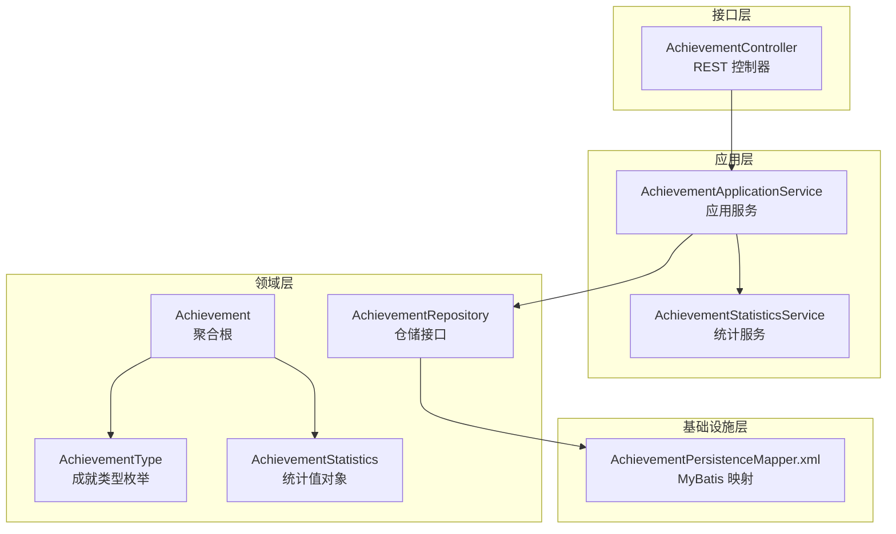
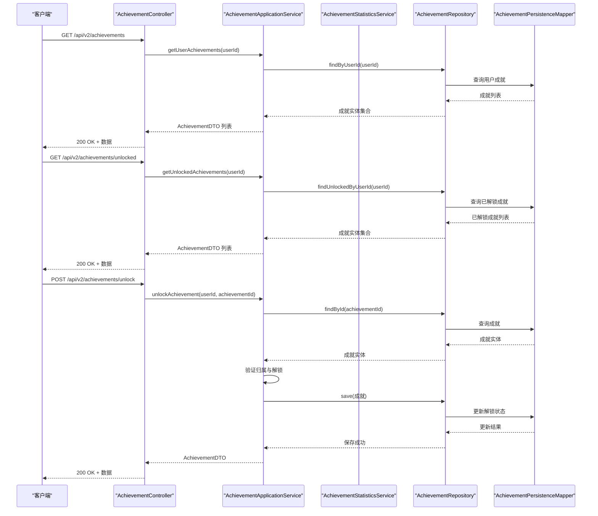
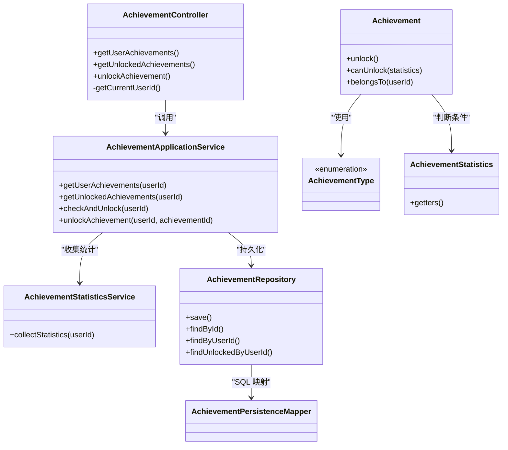
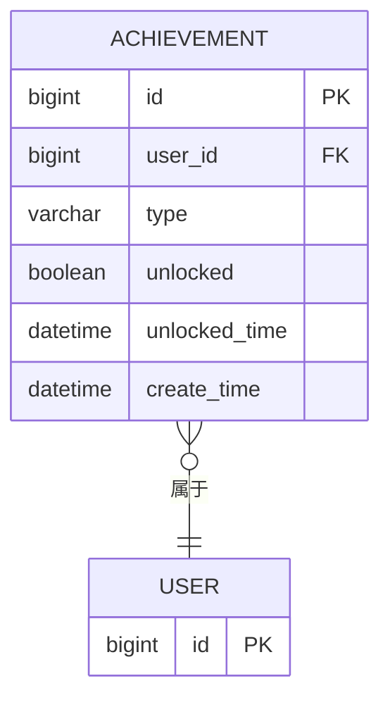
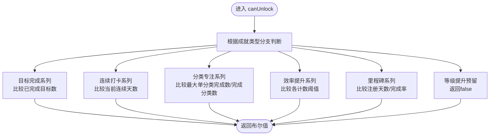

# 成就接口

<cite>
**本文引用的文件**
- [AchievementController.java](file://src/main/java/com/crazydream/interfaces/achievement/AchievementController.java)
- [AchievementApplicationService.java](file://src/main/java/com/crazydream/application/achievement/service/AchievementApplicationService.java)
- [AchievementStatisticsService.java](file://src/main/java/com/crazydream/application/achievement/service/AchievementStatisticsService.java)
- [AchievementDTO.java](file://src/main/java/com/crazydream/application/achievement/dto/AchievementDTO.java)
- [AchievementAssembler.java](file://src/main/java/com/crazydream/application/achievement/assembler/AchievementAssembler.java)
- [Achievement.java](file://src/main/java/com/crazydream/domain/achievement/model/aggregate/Achievement.java)
- [AchievementType.java](file://src/main/java/com/crazydream/domain/achievement/model/valueobject/AchievementType.java)
- [AchievementStatistics.java](file://src/main/java/com/crazydream/domain/achievement/model/valueobject/AchievementStatistics.java)
- [AchievementRepository.java](file://src/main/java/com/crazydream/domain/achievement/repository/AchievementRepository.java)
- [AchievementPersistenceMapper.xml](file://src/main/resources/mapper/AchievementPersistenceMapper.xml)
- [application.yml](file://src/main/resources/application.yml)
- [spec.md](file://openspec/specs/achievement-system-enhancement/spec.md)
- [AchievementServiceTest.java](file://src/test/java/com/crazydream/service/AchievementServiceTest.java)
</cite>

## 目录
1. [简介](#简介)
2. [项目结构](#项目结构)
3. [核心组件](#核心组件)
4. [架构总览](#架构总览)
5. [详细组件分析](#详细组件分析)
6. [依赖关系分析](#依赖关系分析)
7. [性能考虑](#性能考虑)
8. [故障排查指南](#故障排查指南)
9. [结论](#结论)
10. [附录](#附录)

## 简介
本文件为成就模块的完整 API 接口文档，涵盖以下内容：
- 成就系统接口清单：获取用户成就列表、查询已解锁成就、手动解锁成就等
- 成就类型与解锁条件：目标完成数量、连续登录天数、分类专注、效率提升、里程碑与等级提升等
- 成就等级与奖励机制：当前版本未实现具体奖励，保留扩展空间
- 进度跟踪与完成状态：通过统计数据驱动的自动解锁与手动解锁
- 排行榜与社交分享：当前版本未提供，保留扩展空间
- 缓存策略与性能优化：当前未实现缓存，建议后续引入缓存与批量统计优化

## 项目结构
成就模块采用分层架构，主要位于以下包中：
- 接口层：控制器负责接收请求、解析用户身份并调用应用服务
- 应用层：应用服务编排领域模型与仓储，负责成就聚合初始化、自动解锁与手动解锁
- 领域层：聚合根与值对象封装业务规则与解锁条件
- 基础设施层：MyBatis 映射器负责持久化
- 配置与规范：应用配置与开规格文档定义了接口演进要求

图表来源
- [AchievementController.java](file://src/main/java/com/crazydream/interfaces/achievement/AchievementController.java#L16-L113)
- [AchievementApplicationService.java](file://src/main/java/com/crazydream/application/achievement/service/AchievementApplicationService.java#L16-L91)
- [AchievementStatisticsService.java](file://src/main/java/com/crazydream/application/achievement/service/AchievementStatisticsService.java#L25-L142)
- [Achievement.java](file://src/main/java/com/crazydream/domain/achievement/model/aggregate/Achievement.java#L12-L184)
- [AchievementType.java](file://src/main/java/com/crazydream/domain/achievement/model/valueobject/AchievementType.java#L3-L62)
- [AchievementStatistics.java](file://src/main/java/com/crazydream/domain/achievement/model/valueobject/AchievementStatistics.java#L10-L192)
- [AchievementRepository.java](file://src/main/java/com/crazydream/domain/achievement/repository/AchievementRepository.java#L10-L16)
- [AchievementPersistenceMapper.xml](file://src/main/resources/mapper/AchievementPersistenceMapper.xml#L5-L47)

章节来源
- [AchievementController.java](file://src/main/java/com/crazydream/interfaces/achievement/AchievementController.java#L16-L113)
- [AchievementApplicationService.java](file://src/main/java/com/crazydream/application/achievement/service/AchievementApplicationService.java#L16-L91)
- [AchievementStatisticsService.java](file://src/main/java/com/crazydream/application/achievement/service/AchievementStatisticsService.java#L25-L142)
- [Achievement.java](file://src/main/java/com/crazydream/domain/achievement/model/aggregate/Achievement.java#L12-L184)
- [AchievementType.java](file://src/main/java/com/crazydream/domain/achievement/model/valueobject/AchievementType.java#L3-L62)
- [AchievementStatistics.java](file://src/main/java/com/crazydream/domain/achievement/model/valueobject/AchievementStatistics.java#L10-L192)
- [AchievementRepository.java](file://src/main/java/com/crazydream/domain/achievement/repository/AchievementRepository.java#L10-L16)
- [AchievementPersistenceMapper.xml](file://src/main/resources/mapper/AchievementPersistenceMapper.xml#L5-L47)

## 核心组件
- 接口层控制器：提供三个 REST 接口，分别用于获取用户成就列表、查询已解锁成就、手动解锁成就，并内置用户身份解析逻辑
- 应用服务：负责确保用户拥有全部成就类型、自动检查并解锁成就、手动解锁成就
- 统计服务：收集用户目标、分类、时间维度与注册时长等统计数据，供解锁条件判断使用
- 领域模型：成就聚合根封装解锁状态与解锁条件判断；成就类型枚举定义解锁条件；统计值对象承载统计数据
- 仓储与映射：定义持久化接口与 MyBatis SQL 映射

章节来源
- [AchievementController.java](file://src/main/java/com/crazydream/interfaces/achievement/AchievementController.java#L28-L111)
- [AchievementApplicationService.java](file://src/main/java/com/crazydream/application/achievement/service/AchievementApplicationService.java#L25-L89)
- [AchievementStatisticsService.java](file://src/main/java/com/crazydream/application/achievement/service/AchievementStatisticsService.java#L34-L117)
- [Achievement.java](file://src/main/java/com/crazydream/domain/achievement/model/aggregate/Achievement.java#L44-L126)
- [AchievementType.java](file://src/main/java/com/crazydream/domain/achievement/model/valueobject/AchievementType.java#L3-L62)
- [AchievementStatistics.java](file://src/main/java/com/crazydream/domain/achievement/model/valueobject/AchievementStatistics.java#L34-L190)
- [AchievementRepository.java](file://src/main/java/com/crazydream/domain/achievement/repository/AchievementRepository.java#L10-L16)
- [AchievementPersistenceMapper.xml](file://src/main/resources/mapper/AchievementPersistenceMapper.xml#L7-L44)

## 架构总览
下图展示了成就接口的端到端调用流程，从控制器到应用服务、统计服务与仓储的交互。

图表来源
- [AchievementController.java](file://src/main/java/com/crazydream/interfaces/achievement/AchievementController.java#L28-L111)
- [AchievementApplicationService.java](file://src/main/java/com/crazydream/application/achievement/service/AchievementApplicationService.java#L41-L89)
- [AchievementRepository.java](file://src/main/java/com/crazydream/domain/achievement/repository/AchievementRepository.java#L13-L14)
- [AchievementPersistenceMapper.xml](file://src/main/resources/mapper/AchievementPersistenceMapper.xml#L23-L44)

## 详细组件分析

### 接口层：AchievementController
- 路径与方法
  - GET /api/v2/achievements：获取当前用户的所有成就（包含未解锁）
  - GET /api/v2/achievements/unlocked：获取当前用户已解锁的成就
  - POST /api/v2/achievements/unlock：手动解锁指定成就（可选指定 userId）
- 用户身份解析
  - 优先从安全上下文解析用户 ID，若匿名或为空则使用配置的默认用户 ID
- 返回值
  - 统一使用响应包装类返回，异常时返回错误码与消息

章节来源
- [AchievementController.java](file://src/main/java/com/crazydream/interfaces/achievement/AchievementController.java#L28-L111)
- [application.yml](file://src/main/resources/application.yml#L71-L75)

### 应用层：AchievementApplicationService
- 职责
  - 确保用户拥有全部成就类型（缺失则创建）
  - 自动检查并解锁：收集统计数据，逐项判断解锁条件，保存解锁状态
  - 手动解锁：校验归属后解锁并持久化
- 关键方法
  - getUserAchievements(userId)：返回用户全部成就 DTO 列表
  - getUnlockedAchievements(userId)：返回用户已解锁成就 DTO 列表
  - checkAndUnlock(userId)：自动解锁入口（内部收集统计）
  - unlockAchievement(userId, achievementId)：手动解锁入口

章节来源
- [AchievementApplicationService.java](file://src/main/java/com/crazydream/application/achievement/service/AchievementApplicationService.java#L25-L89)

### 统计层：AchievementStatisticsService
- 统计指标
  - 目标统计：总数、已完成数
  - 连续打卡：当前连续天数、最长连续天数
  - 分类统计：各分类完成数与完成分类数
  - 时间维度：早起鸟、夜猫子、效率达人、守时之星计数
  - 里程碑：注册天数、完成率
- 计算逻辑
  - 连续天数：从今日回溯至未完成为止
  - 完成率：基于“有效目标”（不含已放弃）计算

章节来源
- [AchievementStatisticsService.java](file://src/main/java/com/crazydream/application/achievement/service/AchievementStatisticsService.java#L34-L141)
- [AchievementStatistics.java](file://src/main/java/com/crazydream/domain/achievement/model/valueobject/AchievementStatistics.java#L34-L190)

### 领域层：Achievement 与 AchievementType
- Achievement
  - 行为：unlock()、canUnlock(AchievementStatistics)、belongsTo(userId)
  - 状态：解锁状态与解锁时间
- AchievementType
  - 定义所有成就类型及其解锁条件（如首次完成、连续天数、分类专注、效率提升、里程碑、等级提升预留）

章节来源
- [Achievement.java](file://src/main/java/com/crazydream/domain/achievement/model/aggregate/Achievement.java#L44-L156)
- [AchievementType.java](file://src/main/java/com/crazydream/domain/achievement/model/valueobject/AchievementType.java#L3-L62)

### DTO 与装配器
- AchievementDTO：对外暴露的成就数据结构（含类型编码、名称、描述、解锁状态与时间等）
- AchievementAssembler：领域模型与 DTO 的转换器

章节来源
- [AchievementDTO.java](file://src/main/java/com/crazydream/application/achievement/dto/AchievementDTO.java#L7-L16)
- [AchievementAssembler.java](file://src/main/java/com/crazydream/application/achievement/assembler/AchievementAssembler.java#L11-L32)

### 仓储与持久化
- AchievementRepository：定义保存、按 ID 查找、按用户查找、按用户查找已解锁等方法
- AchievementPersistenceMapper.xml：对应 SQL 实现（插入、更新、按 ID/用户查询、按用户查询已解锁）

章节来源
- [AchievementRepository.java](file://src/main/java/com/crazydream/domain/achievement/repository/AchievementRepository.java#L10-L16)
- [AchievementPersistenceMapper.xml](file://src/main/resources/mapper/AchievementPersistenceMapper.xml#L7-L44)

### 开规格与接口演进
- Achievement.canUnlock() 参数从 (goalCount, level) 扩展为 (AchievementStatistics)
- AchievementApplicationService.checkAndUnlock() 简化为仅基于 userId 的调用

章节来源
- [spec.md](file://openspec/specs/achievement-system-enhancement/spec.md#L6-L61)

## 依赖关系分析

图表来源
- [AchievementController.java](file://src/main/java/com/crazydream/interfaces/achievement/AchievementController.java#L28-L111)
- [AchievementApplicationService.java](file://src/main/java/com/crazydream/application/achievement/service/AchievementApplicationService.java#L41-L89)
- [AchievementStatisticsService.java](file://src/main/java/com/crazydream/application/achievement/service/AchievementStatisticsService.java#L34-L117)
- [Achievement.java](file://src/main/java/com/crazydream/domain/achievement/model/aggregate/Achievement.java#L61-L126)
- [AchievementType.java](file://src/main/java/com/crazydream/domain/achievement/model/valueobject/AchievementType.java#L3-L62)
- [AchievementStatistics.java](file://src/main/java/com/crazydream/domain/achievement/model/valueobject/AchievementStatistics.java#L34-L190)
- [AchievementRepository.java](file://src/main/java/com/crazydream/domain/achievement/repository/AchievementRepository.java#L10-L16)
- [AchievementPersistenceMapper.xml](file://src/main/resources/mapper/AchievementPersistenceMapper.xml#L7-L44)

## 性能考虑
- 当前实现
  - 自动解锁在每次调用时会重新收集统计并遍历所有成就类型，存在重复计算风险
  - 未实现缓存策略，高并发场景下数据库压力较大
- 建议优化
  - 引入 Redis 缓存：缓存用户成就聚合与统计数据，设置合理过期时间
  - 批量统计：对统计服务进行批量计算与写入，减少频繁查询
  - 异步解锁：在目标状态变更时异步触发统计与解锁，降低主流程延迟
  - 分页与限流：对查询接口增加分页与限流保护

[本节为通用性能建议，不直接分析具体文件，故无章节来源]

## 故障排查指南
- 常见问题
  - 未登录或匿名访问：控制器会回退到配置的默认用户 ID，确认配置项是否正确
  - 无权限操作他人成就：手动解锁时会校验归属，确认请求中的用户 ID 与当前登录用户一致
  - 成就未解锁：检查统计服务是否正确收集指标，确认 Achievement.canUnlock 条件是否满足
- 排查步骤
  - 检查控制器日志与安全上下文解析
  - 核对统计服务的指标计算（连续天数、分类计数、完成率等）
  - 验证仓储与映射是否正确执行插入/更新
- 单元测试参考
  - 测试手动解锁、无效类型、用户成就列表与自动解锁逻辑

章节来源
- [AchievementController.java](file://src/main/java/com/crazydream/interfaces/achievement/AchievementController.java#L72-L111)
- [AchievementApplicationService.java](file://src/main/java/com/crazydream/application/achievement/service/AchievementApplicationService.java#L74-L89)
- [AchievementStatisticsService.java](file://src/main/java/com/crazydream/application/achievement/service/AchievementStatisticsService.java#L119-L141)
- [AchievementServiceTest.java](file://src/test/java/com/crazydream/service/AchievementServiceTest.java#L38-L168)

## 结论
- 成就模块已实现基础的成就类型定义、自动解锁与手动解锁能力，接口清晰、职责明确
- 统计服务提供了丰富的指标，支撑多样化的解锁条件
- 当前未实现奖励、排行榜与社交分享，具备良好扩展性
- 建议尽快引入缓存与异步处理，以提升高并发场景下的性能与稳定性

[本节为总结性内容，不直接分析具体文件，故无章节来源]

## 附录

### API 接口规范

- 获取用户成就列表
  - 方法：GET
  - 路径：/api/v2/achievements
  - 认证：需要登录
  - 响应：AchievementDTO 列表
  - 失败：返回错误码与消息

- 获取已解锁成就列表
  - 方法：GET
  - 路径：/api/v2/achievements/unlocked
  - 认证：需要登录
  - 响应：AchievementDTO 列表
  - 失败：返回错误码与消息

- 手动解锁成就
  - 方法：POST
  - 路径：/api/v2/achievements/unlock
  - 认证：需要登录
  - 请求体：{
      "userId": "Long",
      "achievementId": "Long"
    }
  - 响应：AchievementDTO
  - 失败：返回错误码与消息

- 用户身份解析规则
  - 从安全上下文解析用户 ID
  - 若为空或匿名，使用配置的默认用户 ID

章节来源
- [AchievementController.java](file://src/main/java/com/crazydream/interfaces/achievement/AchievementController.java#L28-L111)
- [application.yml](file://src/main/resources/application.yml#L71-L75)

### 成就类型与解锁条件

- 目标完成数量系列
  - 首个目标：已完成目标数 ≥ 1
  - 小有成就：≥ 10
  - 初露锋芒：≥ 30
  - 坚持不懈：≥ 50
  - 成就达人：≥ 100
  - 目标大师：≥ 200

- 连续打卡系列
  - 三日坚持：当前连续天数 ≥ 3
  - 七日坚持：≥ 7
  - 两周习惯：≥ 14
  - 月度冠军：≥ 30
  - 百日传奇：≥ 100

- 分类专注系列
  - 分类达人：单分类完成数 ≥ 10
  - 分类专家：≥ 30
  - 全能选手：完成分类数 ≥ 6（预设分类数）

- 效率提升系列
  - 早起鸟：6-8 点完成目标数 ≥ 5
  - 夜猫子：22-24 点完成目标数 ≥ 5
  - 效率达人：24 小时内完成目标数 ≥ 10
  - 守时之星：提前完成目标数 ≥ 20

- 里程碑系列
  - 初入殿堂：注册天数 ≥ 7
  - 月度会员：≥ 30
  - 年度坚持：≥ 365
  - 完美主义者：完成率 ≥ 90% 且已完成目标数 ≥ 20

- 等级提升（预留）
  - 当前返回 false，需单独处理用户等级变化

章节来源
- [AchievementType.java](file://src/main/java/com/crazydream/domain/achievement/model/valueobject/AchievementType.java#L3-L62)
- [Achievement.java](file://src/main/java/com/crazydream/domain/achievement/model/aggregate/Achievement.java#L61-L126)

### 数据模型与序列图

图表来源
- [AchievementPersistenceMapper.xml](file://src/main/resources/mapper/AchievementPersistenceMapper.xml#L23-L44)

图表来源
- [Achievement.java](file://src/main/java/com/crazydream/domain/achievement/model/aggregate/Achievement.java#L61-L126)