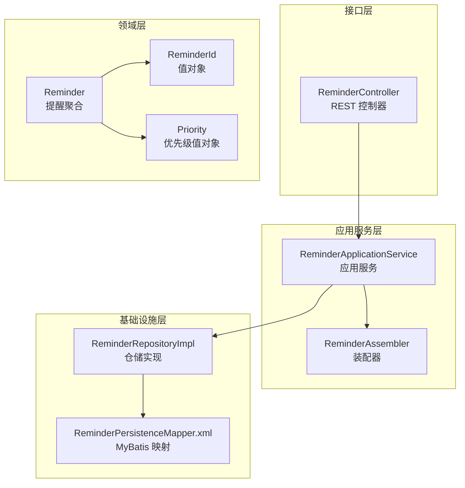
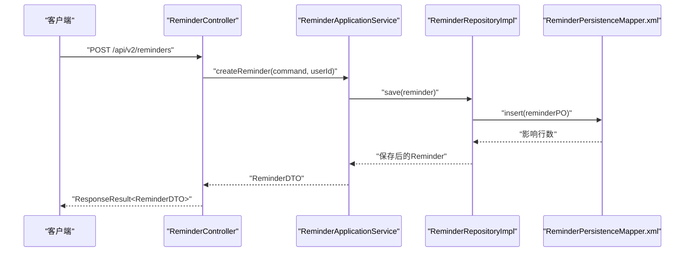
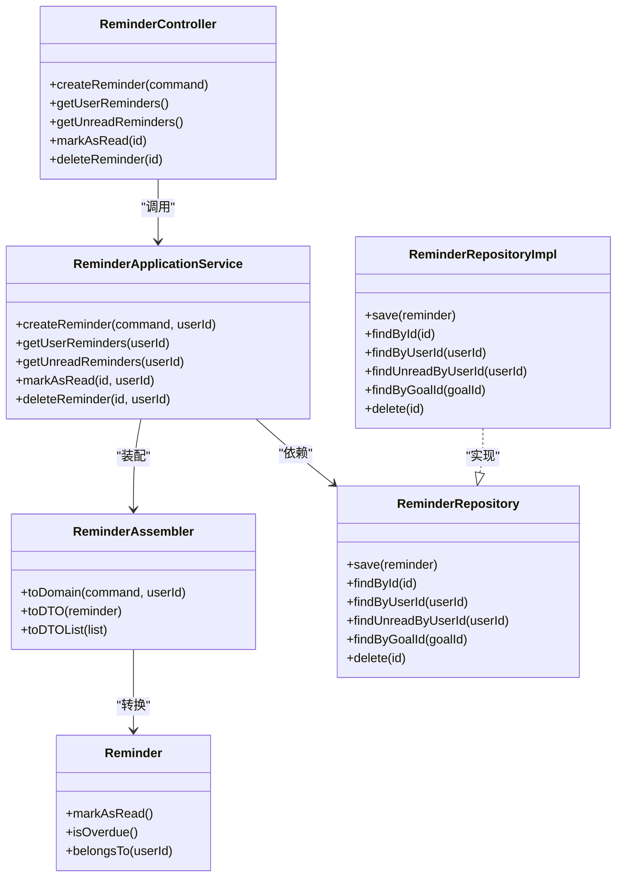
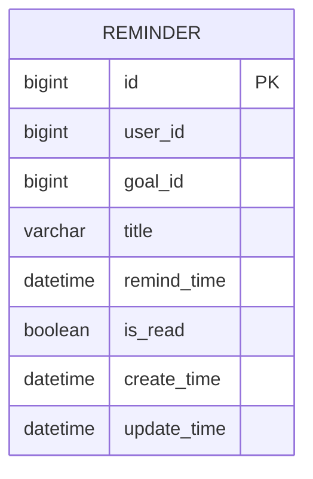
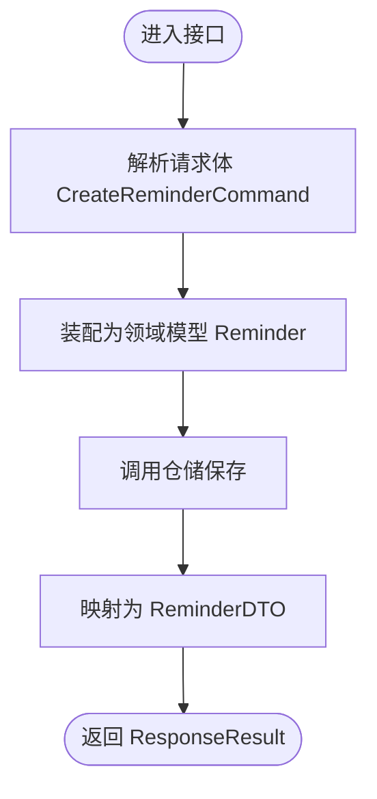

# 提醒接口

<cite>
**本文引用的文件**
- [ReminderController.java](file://src/main/java/com/crazydream/interfaces/reminder/ReminderController.java)
- [ReminderApplicationService.java](file://src/main/java/com/crazydream/application/reminder/service/ReminderApplicationService.java)
- [ReminderAssembler.java](file://src/main/java/com/crazydream/application/reminder/assembler/ReminderAssembler.java)
- [CreateReminderCommand.java](file://src/main/java/com/crazydream/application/reminder/dto/CreateReminderCommand.java)
- [ReminderDTO.java](file://src/main/java/com/crazydream/application/reminder/dto/ReminderDTO.java)
- [Reminder.java](file://src/main/java/com/crazydream/domain/reminder/model/aggregate/Reminder.java)
- [ReminderRepository.java](file://src/main/java/com/crazydream/domain/reminder/repository/ReminderRepository.java)
- [ReminderRepositoryImpl.java](file://src/main/java/com/crazydream/infrastructure/persistence/repository/ReminderRepositoryImpl.java)
- [ReminderPersistenceMapper.xml](file://src/main/resources/mapper/ReminderPersistenceMapper.xml)
- [ResponseResult.java](file://src/main/java/com/crazydream/utils/ResponseResult.java)
- [application.yml](file://src/main/resources/application.yml)
- [Priority.java](file://src/main/java/com/crazydream/domain/goal/model/valueobject/Priority.java)
</cite>

## 目录
1. [简介](#简介)
2. [项目结构](#项目结构)
3. [核心组件](#核心组件)
4. [架构总览](#架构总览)
5. [详细组件分析](#详细组件分析)
6. [依赖关系分析](#依赖关系分析)
7. [性能考虑](#性能考虑)
8. [故障排查指南](#故障排查指南)
9. [结论](#结论)
10. [附录](#附录)

## 简介
本文件为提醒模块的详细 API 接口文档，覆盖创建提醒、获取用户提醒列表、获取未读提醒、标记为已读、按 ID 删除提醒等接口。文档同时说明提醒的时间设置、状态管理（已读/未读）、过期判定、与目标关联关系、以及统一响应结构。由于当前仓库未实现提醒的重复周期、通知方式、优先级与重要度标记、定时任务调度与推送通知集成等能力，本文在相应章节明确标注“当前未实现”，并提供可扩展的设计建议。

## 项目结构
提醒模块采用分层架构：接口层负责接收请求并返回统一响应；应用服务层编排领域模型与仓储；领域层定义提醒聚合与值对象；基础设施层负责持久化映射与存储。

图表来源
- [ReminderController.java](file://src/main/java/com/crazydream/interfaces/reminder/ReminderController.java#L16-L114)
- [ReminderApplicationService.java](file://src/main/java/com/crazydream/application/reminder/service/ReminderApplicationService.java#L15-L63)
- [ReminderAssembler.java](file://src/main/java/com/crazydream/application/reminder/assembler/ReminderAssembler.java#L11-L44)
- [Reminder.java](file://src/main/java/com/crazydream/domain/reminder/model/aggregate/Reminder.java#L13-L94)
- [ReminderRepositoryImpl.java](file://src/main/java/com/crazydream/infrastructure/persistence/repository/ReminderRepositoryImpl.java#L18-L67)
- [ReminderPersistenceMapper.xml](file://src/main/resources/mapper/ReminderPersistenceMapper.xml#L5-L51)
- [Priority.java](file://src/main/java/com/crazydream/domain/goal/model/valueobject/Priority.java#L10-L57)

章节来源
- [ReminderController.java](file://src/main/java/com/crazydream/interfaces/reminder/ReminderController.java#L16-L114)
- [ReminderApplicationService.java](file://src/main/java/com/crazydream/application/reminder/service/ReminderApplicationService.java#L15-L63)
- [ReminderAssembler.java](file://src/main/java/com/crazydream/application/reminder/assembler/ReminderAssembler.java#L11-L44)
- [Reminder.java](file://src/main/java/com/crazydream/domain/reminder/model/aggregate/Reminder.java#L13-L94)
- [ReminderRepositoryImpl.java](file://src/main/java/com/crazydream/infrastructure/persistence/repository/ReminderRepositoryImpl.java#L18-L67)
- [ReminderPersistenceMapper.xml](file://src/main/resources/mapper/ReminderPersistenceMapper.xml#L5-L51)
- [Priority.java](file://src/main/java/com/crazydream/domain/goal/model/valueobject/Priority.java#L10-L57)

## 核心组件
- 接口控制器：提供 REST 接口，负责参数接收、鉴权上下文提取、调用应用服务并返回统一响应。
- 应用服务：编排领域模型与仓储，处理业务逻辑（如权限校验、状态变更）。
- 领域模型：提醒聚合根，包含提醒的基本属性、过期判断与归属校验等行为。
- 仓储接口与实现：抽象与具体持久化实现，提供按用户、按目标、未读等查询能力。
- 装配器：在 DTO 与领域模型之间进行转换。
- 统一响应：封装 HTTP 状态与业务状态，简化前端处理。

章节来源
- [ReminderController.java](file://src/main/java/com/crazydream/interfaces/reminder/ReminderController.java#L16-L114)
- [ReminderApplicationService.java](file://src/main/java/com/crazydream/application/reminder/service/ReminderApplicationService.java#L15-L63)
- [Reminder.java](file://src/main/java/com/crazydream/domain/reminder/model/aggregate/Reminder.java#L13-L94)
- [ReminderRepository.java](file://src/main/java/com/crazydream/domain/reminder/repository/ReminderRepository.java#L11-L18)
- [ReminderRepositoryImpl.java](file://src/main/java/com/crazydream/infrastructure/persistence/repository/ReminderRepositoryImpl.java#L18-L67)
- [ReminderAssembler.java](file://src/main/java/com/crazydream/application/reminder/assembler/ReminderAssembler.java#L11-L44)
- [ResponseResult.java](file://src/main/java/com/crazydream/utils/ResponseResult.java#L14-L148)

## 架构总览
提醒模块遵循分层架构，接口层与应用层解耦，应用层与领域层解耦，领域层与基础设施层解耦。接口层通过应用服务访问领域模型，应用服务通过仓储接口访问持久化实现。

图表来源
- [ReminderController.java](file://src/main/java/com/crazydream/interfaces/reminder/ReminderController.java#L28-L37)
- [ReminderApplicationService.java](file://src/main/java/com/crazydream/application/reminder/service/ReminderApplicationService.java#L21-L26)
- [ReminderRepositoryImpl.java](file://src/main/java/com/crazydream/infrastructure/persistence/repository/ReminderRepositoryImpl.java#L24-L34)
- [ReminderPersistenceMapper.xml](file://src/main/resources/mapper/ReminderPersistenceMapper.xml#L7-L11)

## 详细组件分析

### 接口层：ReminderController
- 路由前缀：/api/v2/reminders
- 主要接口
  - POST /api/v2/reminders：创建提醒
  - GET /api/v2/reminders：获取当前用户提醒列表
  - GET /api/v2/reminders/unread：获取当前用户未读提醒
  - PATCH /api/v2/reminders/{id}/read：将指定提醒标记为已读
  - DELETE /api/v2/reminders/{id}：删除指定提醒
- 用户身份提取：从安全上下文中获取当前用户 ID，若无认证则使用配置的默认用户 ID（测试用途）

章节来源
- [ReminderController.java](file://src/main/java/com/crazydream/interfaces/reminder/ReminderController.java#L16-L114)
- [application.yml](file://src/main/resources/application.yml#L65-L75)

### 应用服务层：ReminderApplicationService
- 负责调用装配器将命令转换为领域模型，再通过仓储保存或查询。
- 权限控制：在标记已读与删除时，校验提醒是否属于当前用户。
- 事务性：创建与状态变更接口使用事务注解保证一致性。

章节来源
- [ReminderApplicationService.java](file://src/main/java/com/crazydream/application/reminder/service/ReminderApplicationService.java#L15-L63)

### 领域层：Reminder 聚合
- 属性：用户 ID、目标 ID、标题、提醒时间、是否已读、创建与更新时间。
- 行为：
  - 标记为已读：更新已读状态与更新时间
  - 过期判断：基于当前时间与提醒时间比较
  - 归属校验：判断提醒是否属于指定用户
- 值对象：ReminderId、UserId、GoalId

章节来源
- [Reminder.java](file://src/main/java/com/crazydream/domain/reminder/model/aggregate/Reminder.java#L13-L94)
- [ReminderId.java](file://src/main/java/com/crazydream/domain/reminder/model/valueobject/ReminderId.java#L5-L33)

### 仓储层：ReminderRepository 与实现
- 仓储接口定义：保存、按 ID 查询、按用户查询、按用户查询未读、按目标查询、删除。
- 实现：通过 MyBatis 映射执行 SQL，完成数据持久化与查询。
- 查询排序：
  - 按用户查询：按提醒时间倒序
  - 按用户查询未读：按提醒时间正序

章节来源
- [ReminderRepository.java](file://src/main/java/com/crazydream/domain/reminder/repository/ReminderRepository.java#L11-L18)
- [ReminderRepositoryImpl.java](file://src/main/java/com/crazydream/infrastructure/persistence/repository/ReminderRepositoryImpl.java#L18-L67)
- [ReminderPersistenceMapper.xml](file://src/main/resources/mapper/ReminderPersistenceMapper.xml#L26-L45)

### DTO 与装配器
- CreateReminderCommand：创建提醒的输入命令，包含目标 ID、标题、提醒时间。
- ReminderDTO：对外输出的提醒数据传输对象，包含已读状态与过期标记。
- ReminderAssembler：在命令与 DTO 之间进行转换，并将领域模型转换为 DTO。

章节来源
- [CreateReminderCommand.java](file://src/main/java/com/crazydream/application/reminder/dto/CreateReminderCommand.java#L7-L11)
- [ReminderDTO.java](file://src/main/java/com/crazydream/application/reminder/dto/ReminderDTO.java#L7-L16)
- [ReminderAssembler.java](file://src/main/java/com/crazydream/application/reminder/assembler/ReminderAssembler.java#L11-L44)

### 统一响应结构
- ResponseResult：封装 code、message、data 字段，支持 success 与 error 多种工厂方法。
- HTTP 状态映射：根据 code 自动映射到对应 HTTP 状态码。

章节来源
- [ResponseResult.java](file://src/main/java/com/crazydream/utils/ResponseResult.java#L14-L148)

### API 接口定义

- 创建提醒
  - 方法与路径：POST /api/v2/reminders
  - 请求体：CreateReminderCommand
    - goalId：目标 ID
    - title：提醒标题
    - remindTime：提醒时间（ISO 8601）
  - 返回：ResponseResult<ReminderDTO>
  - 认证：需要登录态，从安全上下文提取用户 ID
  - 事务：是

- 获取用户提醒列表
  - 方法与路径：GET /api/v2/reminders
  - 查询参数：无
  - 返回：ResponseResult<List<ReminderDTO>>
  - 认证：需要登录态
  - 排序：按提醒时间倒序

- 获取未读提醒
  - 方法与路径：GET /api/v2/reminders/unread
  - 查询参数：无
  - 返回：ResponseResult<List<ReminderDTO>>
  - 认证：需要登录态
  - 排序：按提醒时间正序

- 标记为已读
  - 方法与路径：PATCH /api/v2/reminders/{id}/read
  - 路径参数：id（提醒 ID）
  - 返回：ResponseResult<ReminderDTO>
  - 认证：需要登录态
  - 权限：仅允许操作当前用户的提醒
  - 事务：是

- 删除提醒
  - 方法与路径：DELETE /api/v2/reminders/{id}
  - 路径参数：id（提醒 ID）
  - 返回：ResponseResult<Boolean>
  - 认证：需要登录态
  - 权限：仅允许操作当前用户的提醒
  - 事务：是

章节来源
- [ReminderController.java](file://src/main/java/com/crazydream/interfaces/reminder/ReminderController.java#L28-L81)
- [ReminderApplicationService.java](file://src/main/java/com/crazydream/application/reminder/service/ReminderApplicationService.java#L21-L62)
- [ReminderPersistenceMapper.xml](file://src/main/resources/mapper/ReminderPersistenceMapper.xml#L26-L45)

### 时间设置与过期判定
- 时间设置：创建时传入提醒时间；更新时通过标记已读更新更新时间。
- 过期判定：基于当前时间与提醒时间比较，返回是否过期标记。
- 排序：按提醒时间排序，便于前端展示与调度。

章节来源
- [Reminder.java](file://src/main/java/com/crazydream/domain/reminder/model/aggregate/Reminder.java#L59-L61)
- [ReminderAssembler.java](file://src/main/java/com/crazydream/application/reminder/assembler/ReminderAssembler.java#L22-L37)
- [ReminderPersistenceMapper.xml](file://src/main/resources/mapper/ReminderPersistenceMapper.xml#L30-L38)

### 状态管理与自动转换
- 已读/未读：通过 is_read 字段标识；标记已读会更新更新时间。
- 过期状态：通过 isOverdue 判断，返回布尔标记供前端展示。
- 当前未实现：提醒的完整生命周期状态（未开始、进行中、已完成、已取消）与自动转换规则。

章节来源
- [Reminder.java](file://src/main/java/com/crazydream/domain/reminder/model/aggregate/Reminder.java#L54-L61)
- [ReminderDTO.java](file://src/main/java/com/crazydream/application/reminder/dto/ReminderDTO.java#L13-L14)

### 优先级与重要程度标记
- 当前未实现：提醒未引入优先级与重要程度标记。
- 参考目标优先级：目标模块存在 Priority 值对象，可作为提醒优先级设计参考。

章节来源
- [Priority.java](file://src/main/java/com/crazydream/domain/goal/model/valueobject/Priority.java#L10-L57)

### 重复周期与通知方式
- 当前未实现：提醒未实现重复周期与通知方式配置。
- 可扩展建议：
  - 引入 RepeatPattern 值对象与 NotificationMethod 枚举
  - 在 Reminder 中新增 repeatPattern、notificationMethods 等字段
  - 结合定时任务框架（如 Spring Scheduler 或 Quartz）实现周期性提醒

### 推送通知与第三方集成
- 当前未实现：未见推送通知或第三方集成相关代码。
- 可扩展建议：
  - 引入消息队列（如 RabbitMQ/Kafka）异步派发通知
  - 支持邮件、短信、站内信等多种通知渠道
  - 提供通知模板与用户偏好设置

### 定时任务调度与性能优化
- 当前未实现：未见定时任务调度与性能优化策略。
- 可扩展建议：
  - 使用 @Scheduled 或基于数据库的作业调度器
  - 为查询接口添加索引（user_id、is_read、remind_time）
  - 缓存热点数据（如最近未读提醒）
  - 分页查询与懒加载

## 依赖关系分析

图表来源
- [ReminderController.java](file://src/main/java/com/crazydream/interfaces/reminder/ReminderController.java#L16-L114)
- [ReminderApplicationService.java](file://src/main/java/com/crazydream/application/reminder/service/ReminderApplicationService.java#L15-L63)
- [ReminderAssembler.java](file://src/main/java/com/crazydream/application/reminder/assembler/ReminderAssembler.java#L11-L44)
- [ReminderRepository.java](file://src/main/java/com/crazydream/domain/reminder/repository/ReminderRepository.java#L11-L18)
- [ReminderRepositoryImpl.java](file://src/main/java/com/crazydream/infrastructure/persistence/repository/ReminderRepositoryImpl.java#L18-L67)
- [Reminder.java](file://src/main/java/com/crazydream/domain/reminder/model/aggregate/Reminder.java#L13-L94)

## 性能考虑
- 数据库层面
  - 为 user_id、is_read、remind_time 添加复合索引，提升查询效率
  - 对高频查询（按用户未读）使用专用 SQL 与排序策略
- 应用层面
  - 对未读提醒列表启用分页与懒加载
  - 对热点数据进行缓存（如最近 N 条未读提醒）
- 接口层面
  - 统一响应结构减少前端分支处理
  - 合理的超时与重试策略

## 故障排查指南
- 无权限操作
  - 现象：标记已读或删除提醒时报错
  - 原因：提醒不属于当前用户
  - 处理：确认登录态与用户 ID 是否正确

- 提醒不存在
  - 现象：按 ID 查询或操作时报错
  - 原因：ID 无效或已被删除
  - 处理：检查 ID 与数据一致性

- 认证信息缺失
  - 现象：接口返回默认用户数据
  - 原因：security.auth.disabled=true 或请求未携带 Token
  - 处理：生产环境开启安全认证，确保携带有效 Token

章节来源
- [ReminderApplicationService.java](file://src/main/java/com/crazydream/application/reminder/service/ReminderApplicationService.java#L38-L62)
- [ReminderController.java](file://src/main/java/com/crazydream/interfaces/reminder/ReminderController.java#L83-L112)
- [application.yml](file://src/main/resources/application.yml#L65-L75)

## 结论
当前提醒模块实现了基础的 CRUD 与状态标记能力，具备清晰的分层架构与统一响应结构。重复周期、通知方式、优先级与重要程度标记、定时任务调度与推送通知集成尚未实现，可在现有架构基础上平滑扩展。建议优先完善状态管理与通知机制，以满足实际业务需求。

## 附录

### 数据模型图

图表来源
- [ReminderPersistenceMapper.xml](file://src/main/resources/mapper/ReminderPersistenceMapper.xml#L9-L17)

### 关键流程图：创建提醒

图表来源
- [ReminderController.java](file://src/main/java/com/crazydream/interfaces/reminder/ReminderController.java#L28-L37)
- [ReminderApplicationService.java](file://src/main/java/com/crazydream/application/reminder/service/ReminderApplicationService.java#L21-L26)
- [ReminderAssembler.java](file://src/main/java/com/crazydream/application/reminder/assembler/ReminderAssembler.java#L13-L20)