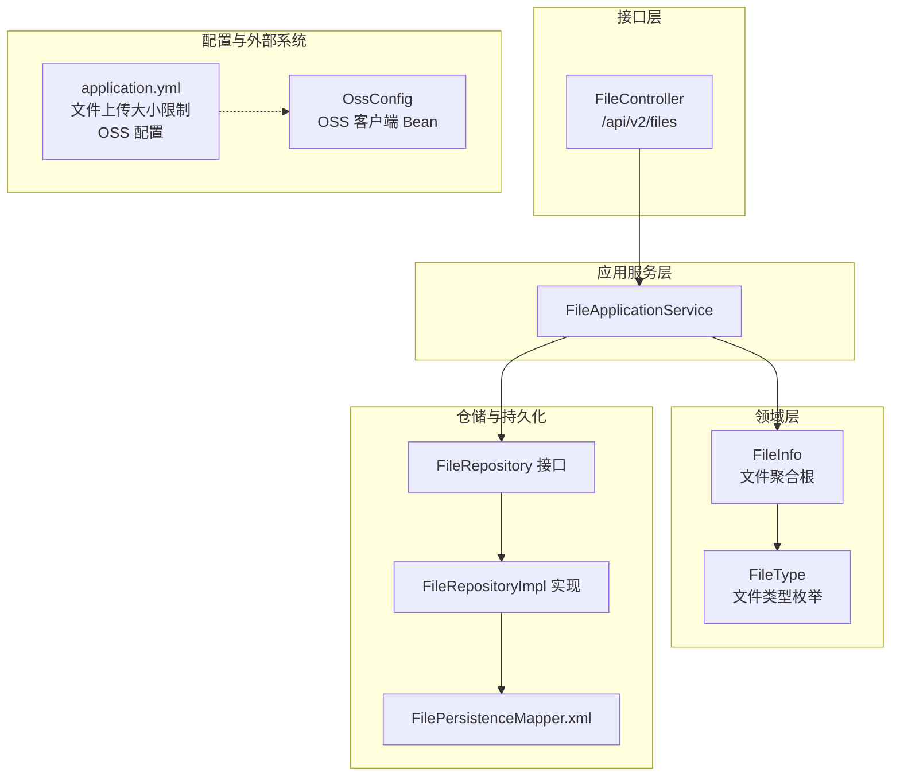
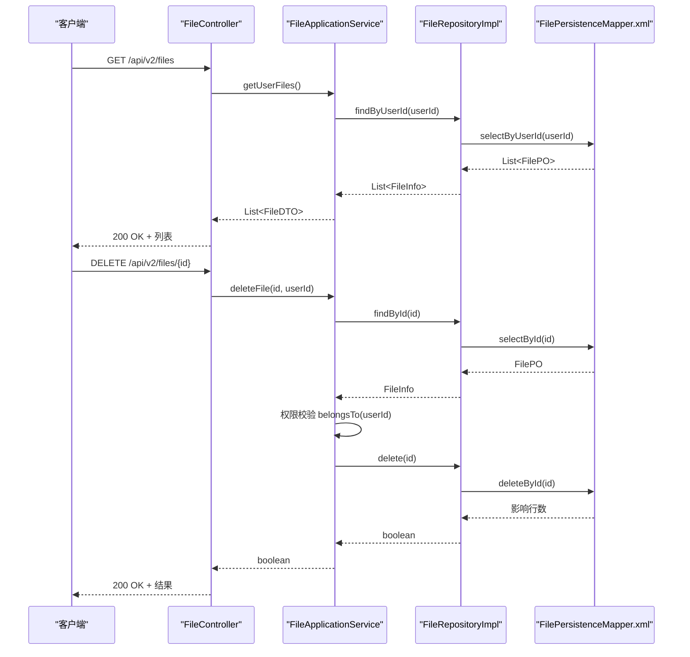
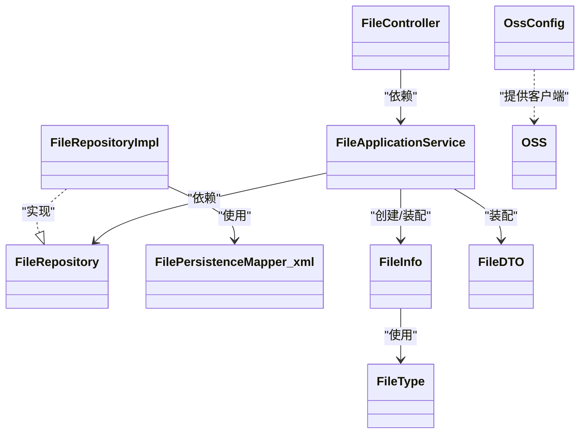
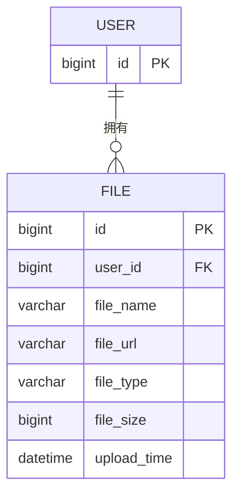

# 文件接口

<cite>
**本文引用的文件**
- [src/main/java/com/crazydream/interfaces/file/FileController.java](file://src/main/java/com/crazydream/interfaces/file/FileController.java)
- [src/main/java/com/crazydream/application/file/service/FileApplicationService.java](file://src/main/java/com/crazydream/application/file/service/FileApplicationService.java)
- [src/main/java/com/crazydream/application/file/assembler/FileAssembler.java](file://src/main/java/com/crazydream/application/file/assembler/FileAssembler.java)
- [src/main/java/com/crazydream/application/file/dto/FileDTO.java](file://src/main/java/com/crazydream/application/file/dto/FileDTO.java)
- [src/main/java/com/crazydream/domain/file/model/aggregate/FileInfo.java](file://src/main/java/com/crazydream/domain/file/model/aggregate/FileInfo.java)
- [src/main/java/com/crazydream/domain/file/model/valueobject/FileType.java](file://src/main/java/com/crazydream/domain/file/model/valueobject/FileType.java)
- [src/main/java/com/crazydream/domain/file/repository/FileRepository.java](file://src/main/java/com/crazydream/domain/file/repository/FileRepository.java)
- [src/main/java/com/crazydream/infrastructure/persistence/repository/FileRepositoryImpl.java](file://src/main/java/com/crazydream/infrastructure/persistence/repository/FileRepositoryImpl.java)
- [src/main/resources/mapper/FilePersistenceMapper.xml](file://src/main/resources/mapper/FilePersistenceMapper.xml)
- [src/main/resources/application.yml](file://src/main/resources/application.yml)
- [src/main/java/com/crazydream/config/OssConfig.java](file://src/main/java/com/crazydream/config/OssConfig.java)
- [src/main/resources/schema.sql](file://src/main/resources/schema.sql)
</cite>

## 目录
1. [简介](#简介)
2. [项目结构](#项目结构)
3. [核心组件](#核心组件)
4. [架构总览](#架构总览)
5. [详细组件分析](#详细组件分析)
6. [依赖分析](#依赖分析)
7. [性能考虑](#性能考虑)
8. [故障排查指南](#故障排查指南)
9. [结论](#结论)
10. [附录](#附录)

## 简介
本文件接口文档聚焦于文件模块的 API 接口，涵盖文件上传、存储与访问控制、文件类型识别与大小限制、安全校验、删除与清理流程、CDN 加速配置以及断点续传与大文件处理方案。同时，文档记录了阿里云 OSS 的集成配置与使用要点，并给出文件安全扫描与病毒检测的集成思路。

## 项目结构
文件模块采用分层架构，控制器负责对外暴露 REST API，应用服务封装业务逻辑，领域模型承载业务规则，仓储层负责持久化，MyBatis 映射器负责 SQL 执行。

图表来源
- [src/main/java/com/crazydream/interfaces/file/FileController.java](file://src/main/java/com/crazydream/interfaces/file/FileController.java#L17-L110)
- [src/main/java/com/crazydream/application/file/service/FileApplicationService.java](file://src/main/java/com/crazydream/application/file/service/FileApplicationService.java#L16-L52)
- [src/main/java/com/crazydream/domain/file/model/aggregate/FileInfo.java](file://src/main/java/com/crazydream/domain/file/model/aggregate/FileInfo.java#L12-L91)
- [src/main/java/com/crazydream/domain/file/model/valueobject/FileType.java](file://src/main/java/com/crazydream/domain/file/model/valueobject/FileType.java#L3-L61)
- [src/main/java/com/crazydream/domain/file/repository/FileRepository.java](file://src/main/java/com/crazydream/domain/file/repository/FileRepository.java#L10-L16)
- [src/main/java/com/crazydream/infrastructure/persistence/repository/FileRepositoryImpl.java](file://src/main/java/com/crazydream/infrastructure/persistence/repository/FileRepositoryImpl.java#L17-L49)
- [src/main/resources/mapper/FilePersistenceMapper.xml](file://src/main/resources/mapper/FilePersistenceMapper.xml#L5-L31)
- [src/main/resources/application.yml](file://src/main/resources/application.yml#L19-L24)
- [src/main/java/com/crazydream/config/OssConfig.java](file://src/main/java/com/crazydream/config/OssConfig.java#L16-L103)

章节来源
- [src/main/java/com/crazydream/interfaces/file/FileController.java](file://src/main/java/com/crazydream/interfaces/file/FileController.java#L17-L110)
- [src/main/java/com/crazydream/application/file/service/FileApplicationService.java](file://src/main/java/com/crazydream/application/file/service/FileApplicationService.java#L16-L52)
- [src/main/java/com/crazydream/domain/file/model/aggregate/FileInfo.java](file://src/main/java/com/crazydream/domain/file/model/aggregate/FileInfo.java#L12-L91)
- [src/main/java/com/crazydream/domain/file/model/valueobject/FileType.java](file://src/main/java/com/crazydream/domain/file/model/valueobject/FileType.java#L3-L61)
- [src/main/java/com/crazydream/domain/file/repository/FileRepository.java](file://src/main/java/com/crazydream/domain/file/repository/FileRepository.java#L10-L16)
- [src/main/java/com/crazydream/infrastructure/persistence/repository/FileRepositoryImpl.java](file://src/main/java/com/crazydream/infrastructure/persistence/repository/FileRepositoryImpl.java#L17-L49)
- [src/main/resources/mapper/FilePersistenceMapper.xml](file://src/main/resources/mapper/FilePersistenceMapper.xml#L5-L31)
- [src/main/resources/application.yml](file://src/main/resources/application.yml#L19-L24)
- [src/main/java/com/crazydream/config/OssConfig.java](file://src/main/java/com/crazydream/config/OssConfig.java#L16-L103)

## 核心组件
- 控制器：提供文件列表查询、按 ID 查询、删除以及上传接口（当前为简化实现，后续可接入 OSS）。
- 应用服务：封装文件记录保存、查询与删除的业务逻辑，执行权限校验。
- 领域模型：文件聚合根 FileInfo 负责文件归属校验、类型识别与扩展名提取；FileType 提供类型判定。
- 仓储与持久化：FileRepository 抽象与 FileRepositoryImpl 实现，配合 MyBatis 映射器进行数据库 CRUD。
- 配置：application.yml 控制上传大小限制；OssConfig 提供 OSS 客户端 Bean 与配置项注入。

章节来源
- [src/main/java/com/crazydream/interfaces/file/FileController.java](file://src/main/java/com/crazydream/interfaces/file/FileController.java#L32-L77)
- [src/main/java/com/crazydream/application/file/service/FileApplicationService.java](file://src/main/java/com/crazydream/application/file/service/FileApplicationService.java#L24-L51)
- [src/main/java/com/crazydream/domain/file/model/aggregate/FileInfo.java](file://src/main/java/com/crazydream/domain/file/model/aggregate/FileInfo.java#L49-L62)
- [src/main/java/com/crazydream/domain/file/model/valueobject/FileType.java](file://src/main/java/com/crazydream/domain/file/model/valueobject/FileType.java#L30-L56)
- [src/main/java/com/crazydream/domain/file/repository/FileRepository.java](file://src/main/java/com/crazydream/domain/file/repository/FileRepository.java#L10-L16)
- [src/main/java/com/crazydream/infrastructure/persistence/repository/FileRepositoryImpl.java](file://src/main/java/com/crazydream/infrastructure/persistence/repository/FileRepositoryImpl.java#L24-L47)
- [src/main/resources/mapper/FilePersistenceMapper.xml](file://src/main/resources/mapper/FilePersistenceMapper.xml#L7-L28)
- [src/main/resources/application.yml](file://src/main/resources/application.yml#L19-L24)
- [src/main/java/com/crazydream/config/OssConfig.java](file://src/main/java/com/crazydream/config/OssConfig.java#L54-L57)

## 架构总览
文件接口的调用链路从控制器进入，经应用服务处理业务与权限，再由仓储层持久化至数据库。OSS 配置通过 Spring Bean 注入，便于在服务层扩展上传能力。

图表来源
- [src/main/java/com/crazydream/interfaces/file/FileController.java](file://src/main/java/com/crazydream/interfaces/file/FileController.java#L32-L62)
- [src/main/java/com/crazydream/application/file/service/FileApplicationService.java](file://src/main/java/com/crazydream/application/file/service/FileApplicationService.java#L30-L51)
- [src/main/java/com/crazydream/infrastructure/persistence/repository/FileRepositoryImpl.java](file://src/main/java/com/crazydream/infrastructure/persistence/repository/FileRepositoryImpl.java#L32-L47)
- [src/main/resources/mapper/FilePersistenceMapper.xml](file://src/main/resources/mapper/FilePersistenceMapper.xml#L13-L28)

## 详细组件分析

### 控制器：FileController
- 路由前缀：/api/v2/files
- 主要接口
  - GET /api/v2/files：获取当前用户的所有文件记录
  - GET /api/v2/files/{id}：按 ID 获取文件记录
  - DELETE /api/v2/files/{id}：删除文件记录（需权限校验）
  - POST /api/v2/files/upload：上传接口（当前为简化实现，返回本地占位 URL）
- 认证与用户 ID 解析：从安全上下文中解析当前用户 ID，若不可用则回退到配置中的默认用户 ID
- 错误处理：统一包装为响应结果对象，异常时返回错误码与消息

章节来源
- [src/main/java/com/crazydream/interfaces/file/FileController.java](file://src/main/java/com/crazydream/interfaces/file/FileController.java#L17-L110)

### 应用服务：FileApplicationService
- 保存文件记录：接收文件名、URL、大小与用户 ID，组装领域对象并持久化
- 查询文件：按用户 ID 查询文件列表；按 ID 查询单个文件
- 删除文件：先加载文件并校验归属，再删除
- 事务性：保存与删除操作标注事务

章节来源
- [src/main/java/com/crazydream/application/file/service/FileApplicationService.java](file://src/main/java/com/crazydream/application/file/service/FileApplicationService.java#L16-L52)

### 领域模型：FileInfo 与 FileType
- FileInfo
  - 职责：文件聚合根，维护文件元信息、归属校验、类型识别、扩展名提取、上传时间
  - 关键方法：belongsTo(userId)、getFileExtension()、isImage()
- FileType
  - 职责：根据扩展名判断文件类型（图片、视频、文档、音频、其他）

章节来源
- [src/main/java/com/crazydream/domain/file/model/aggregate/FileInfo.java](file://src/main/java/com/crazydream/domain/file/model/aggregate/FileInfo.java#L12-L91)
- [src/main/java/com/crazydream/domain/file/model/valueobject/FileType.java](file://src/main/java/com/crazydream/domain/file/model/valueobject/FileType.java#L3-L61)

### DTO 与装配器：FileDTO 与 FileAssembler
- FileDTO：传输对象，包含文件 ID、用户 ID、文件名、URL、类型编码与描述、大小、上传时间
- FileAssembler：在领域对象与 DTO 之间进行转换，保证数据一致性

章节来源
- [src/main/java/com/crazydream/application/file/dto/FileDTO.java](file://src/main/java/com/crazydream/application/file/dto/FileDTO.java#L7-L16)
- [src/main/java/com/crazydream/application/file/assembler/FileAssembler.java](file://src/main/java/com/crazydream/application/file/assembler/FileAssembler.java#L10-L38)

### 仓储与持久化：FileRepository 与 FileRepositoryImpl
- FileRepository：定义保存、按 ID 查找、按用户查找、删除
- FileRepositoryImpl：将领域对象转换为 PO 并调用 MyBatis Mapper 执行数据库操作
- Mapper XML：定义插入、按 ID 查询、按用户查询、删除

章节来源
- [src/main/java/com/crazydream/domain/file/repository/FileRepository.java](file://src/main/java/com/crazydream/domain/file/repository/FileRepository.java#L10-L16)
- [src/main/java/com/crazydream/infrastructure/persistence/repository/FileRepositoryImpl.java](file://src/main/java/com/crazydream/infrastructure/persistence/repository/FileRepositoryImpl.java#L17-L49)
- [src/main/resources/mapper/FilePersistenceMapper.xml](file://src/main/resources/mapper/FilePersistenceMapper.xml#L5-L31)

### 阿里云 OSS 集成
- 配置项（application.yml）
  - endpoint：OSS 服务端点
  - access-key-id：访问密钥 ID
  - access-key-secret：访问密钥 Secret
  - bucket-name：存储桶名称
  - domain：自定义域名
- 客户端 Bean（OssConfig）
  - 通过 @Bean 提供 OSS 客户端实例
  - 提供 getter 方法以便在其他组件中读取配置
- 使用建议
  - 在应用服务或专用的服务层扩展上传逻辑，使用 OSS 客户端上传文件并生成访问 URL
  - 对外返回的文件 URL 可指向 OSS 或自定义域名
  - 建议结合签名 URL 与过期时间控制访问权限

章节来源
- [src/main/resources/application.yml](file://src/main/resources/application.yml#L46-L56)
- [src/main/java/com/crazydream/config/OssConfig.java](file://src/main/java/com/crazydream/config/OssConfig.java#L16-L103)

### 文件类型验证、大小限制与安全检查
- 大小限制
  - spring.servlet.multipart.max-file-size 与 max-request-size 控制上传大小（当前为 10MB）
- 类型识别
  - FileType 依据扩展名自动识别文件类型，可用于白名单/黑名单策略
- 安全检查
  - 控制器解析用户 ID 并在删除时校验归属
  - 建议增加：文件名清洗、路径遍历防护、MIME 类型二次校验、病毒扫描集成

章节来源
- [src/main/resources/application.yml](file://src/main/resources/application.yml#L19-L24)
- [src/main/java/com/crazydream/domain/file/model/valueobject/FileType.java](file://src/main/java/com/crazydream/domain/file/model/valueobject/FileType.java#L30-L56)
- [src/main/java/com/crazydream/interfaces/file/FileController.java](file://src/main/java/com/crazydream/interfaces/file/FileController.java#L79-L108)
- [src/main/java/com/crazydream/application/file/service/FileApplicationService.java](file://src/main/java/com/crazydream/application/file/service/FileApplicationService.java#L42-L48)

### 文件删除与清理流程
- 删除接口：DELETE /api/v2/files/{id}
- 流程
  - 应用服务加载文件并校验归属
  - 仓储层执行删除
  - 返回布尔结果
- 自动化清理建议
  - 定时任务扫描过期或未绑定的文件记录并触发清理
  - 结合 OSS 生命周期策略与数据库冗余清理

章节来源
- [src/main/java/com/crazydream/interfaces/file/FileController.java](file://src/main/java/com/crazydream/interfaces/file/FileController.java#L53-L62)
- [src/main/java/com/crazydream/application/file/service/FileApplicationService.java](file://src/main/java/com/crazydream/application/file/service/FileApplicationService.java#L41-L51)
- [src/main/java/com/crazydream/infrastructure/persistence/repository/FileRepositoryImpl.java](file://src/main/java/com/crazydream/infrastructure/persistence/repository/FileRepositoryImpl.java#L44-L47)
- [src/main/resources/mapper/FilePersistenceMapper.xml](file://src/main/resources/mapper/FilePersistenceMapper.xml#L26-L28)

### 文件访问统计与 CDN 加速
- 访问统计
  - 可在 OSS 层面开启访问日志，或在应用层埋点记录下载次数与时间
- CDN 加速
  - 将 OSS 域名配置为 CDN 加速域名，确保静态资源就近分发
  - 控制器返回的文件 URL 建议指向 CDN 域名

章节来源
- [src/main/resources/application.yml](file://src/main/resources/application.yml#L54-L55)
- [src/main/java/com/crazydream/config/OssConfig.java](file://src/main/java/com/crazydream/config/OssConfig.java#L46-L47)

### 断点续传与大文件处理
- 方案建议
  - 客户端分片上传，服务端生成临时上传凭证与分片 ID
  - 服务端聚合分片并校验完整性
  - 结合 OSS 分片上传能力与签名 URL 控制上传窗口
- 本项目现状
  - 当前上传接口为简化实现，未接入 OSS 与分片逻辑
  - 后续可在应用服务层扩展上传流程

章节来源
- [src/main/java/com/crazydream/interfaces/file/FileController.java](file://src/main/java/com/crazydream/interfaces/file/FileController.java#L64-L77)

### 文件安全扫描与病毒检测
- 集成思路
  - 上传完成后调用第三方病毒扫描服务或 SDK
  - 根据扫描结果标记文件状态并阻断访问
- 本项目现状
  - 未见现有病毒扫描集成代码，建议在应用服务保存后增加扫描步骤

章节来源
- [src/main/java/com/crazydream/application/file/service/FileApplicationService.java](file://src/main/java/com/crazydream/application/file/service/FileApplicationService.java#L24-L28)

## 依赖分析
- 控制器依赖应用服务
- 应用服务依赖仓储接口与装配器
- 仓储实现依赖 MyBatis Mapper 与转换器
- 配置文件提供 OSS 与上传大小限制参数
- OSS 客户端通过配置类注入

图表来源
- [src/main/java/com/crazydream/interfaces/file/FileController.java](file://src/main/java/com/crazydream/interfaces/file/FileController.java#L17-L25)
- [src/main/java/com/crazydream/application/file/service/FileApplicationService.java](file://src/main/java/com/crazydream/application/file/service/FileApplicationService.java#L16-L20)
- [src/main/java/com/crazydream/domain/file/repository/FileRepository.java](file://src/main/java/com/crazydream/domain/file/repository/FileRepository.java#L10-L16)
- [src/main/java/com/crazydream/infrastructure/persistence/repository/FileRepositoryImpl.java](file://src/main/java/com/crazydream/infrastructure/persistence/repository/FileRepositoryImpl.java#L17-L22)
- [src/main/resources/mapper/FilePersistenceMapper.xml](file://src/main/resources/mapper/FilePersistenceMapper.xml#L5-L11)
- [src/main/java/com/crazydream/domain/file/model/aggregate/FileInfo.java](file://src/main/java/com/crazydream/domain/file/model/aggregate/FileInfo.java#L12-L32)
- [src/main/java/com/crazydream/domain/file/model/valueobject/FileType.java](file://src/main/java/com/crazydream/domain/file/model/valueobject/FileType.java#L3-L8)
- [src/main/java/com/crazydream/application/file/dto/FileDTO.java](file://src/main/java/com/crazydream/application/file/dto/FileDTO.java#L7-L16)
- [src/main/java/com/crazydream/config/OssConfig.java](file://src/main/java/com/crazydream/config/OssConfig.java#L54-L57)

## 性能考虑
- 上传大小限制：当前为 10MB，建议根据业务场景调整
- 分页与排序：查询接口按上传时间倒序，建议增加分页参数
- 缓存：对热点文件列表可引入缓存层
- CDN：静态资源走 CDN，降低源站压力
- 异步处理：上传成功后异步触发扫描与统计

## 故障排查指南
- 上传失败
  - 检查 spring.servlet.multipart 配置是否过小
  - 确认 OSS 配置项是否正确
- 权限错误
  - 确认安全上下文是否正确传递用户 ID
  - 检查删除接口的归属校验逻辑
- 数据不一致
  - 核对 FileAssembler 的字段映射
  - 检查 Mapper SQL 是否完整

章节来源
- [src/main/resources/application.yml](file://src/main/resources/application.yml#L19-L24)
- [src/main/java/com/crazydream/interfaces/file/FileController.java](file://src/main/java/com/crazydream/interfaces/file/FileController.java#L79-L108)
- [src/main/java/com/crazydream/application/file/assembler/FileAssembler.java](file://src/main/java/com/crazydream/application/file/assembler/FileAssembler.java#L16-L31)
- [src/main/resources/mapper/FilePersistenceMapper.xml](file://src/main/resources/mapper/FilePersistenceMapper.xml#L7-L11)

## 结论
文件模块当前提供基础的文件记录查询与删除能力，上传接口为简化实现。通过引入 OSS 客户端与完善安全策略、类型校验、大小限制与病毒扫描，可构建完整的文件上传与管理能力。建议尽快补齐上传接口与分片续传方案，并启用 CDN 与访问统计。

## 附录

### API 定义概览
- GET /api/v2/files
  - 功能：获取当前用户文件列表
  - 认证：需要登录
  - 响应：文件列表
- GET /api/v2/files/{id}
  - 功能：按 ID 获取文件详情
  - 认证：需要登录
  - 响应：文件详情
- DELETE /api/v2/files/{id}
  - 功能：删除文件记录（仅限文件归属者）
  - 认证：需要登录
  - 响应：布尔结果
- POST /api/v2/files/upload
  - 功能：上传文件（当前为简化实现）
  - 认证：需要登录
  - 请求体：multipart/form-data，字段名为 file
  - 响应：文件信息（含占位 URL）

章节来源
- [src/main/java/com/crazydream/interfaces/file/FileController.java](file://src/main/java/com/crazydream/interfaces/file/FileController.java#L32-L77)

### 数据模型

图表来源
- [src/main/resources/mapper/FilePersistenceMapper.xml](file://src/main/resources/mapper/FilePersistenceMapper.xml#L9-L11)
- [src/main/resources/schema.sql](file://src/main/resources/schema.sql#L2-L19)