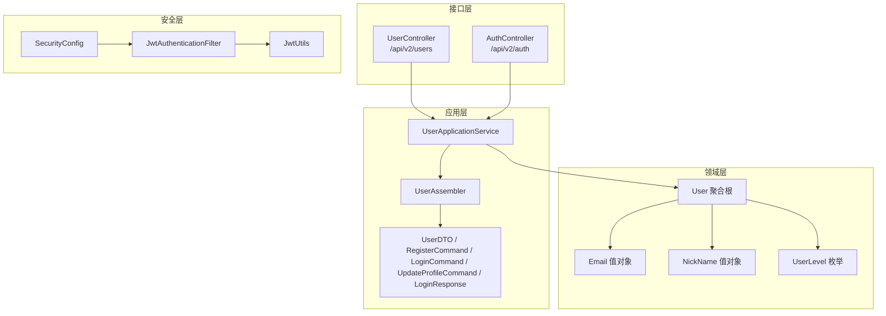
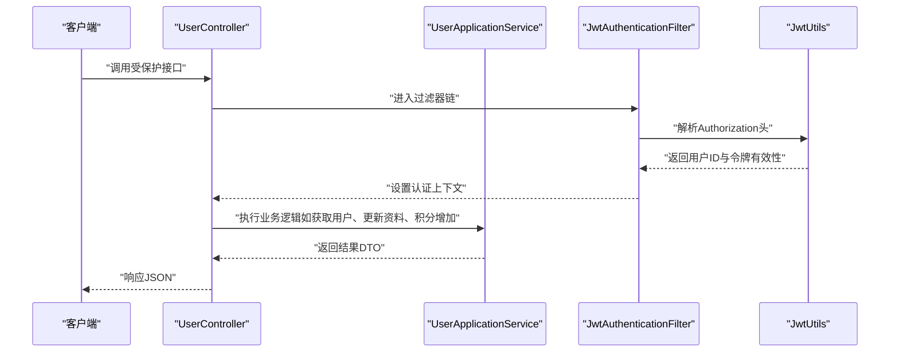
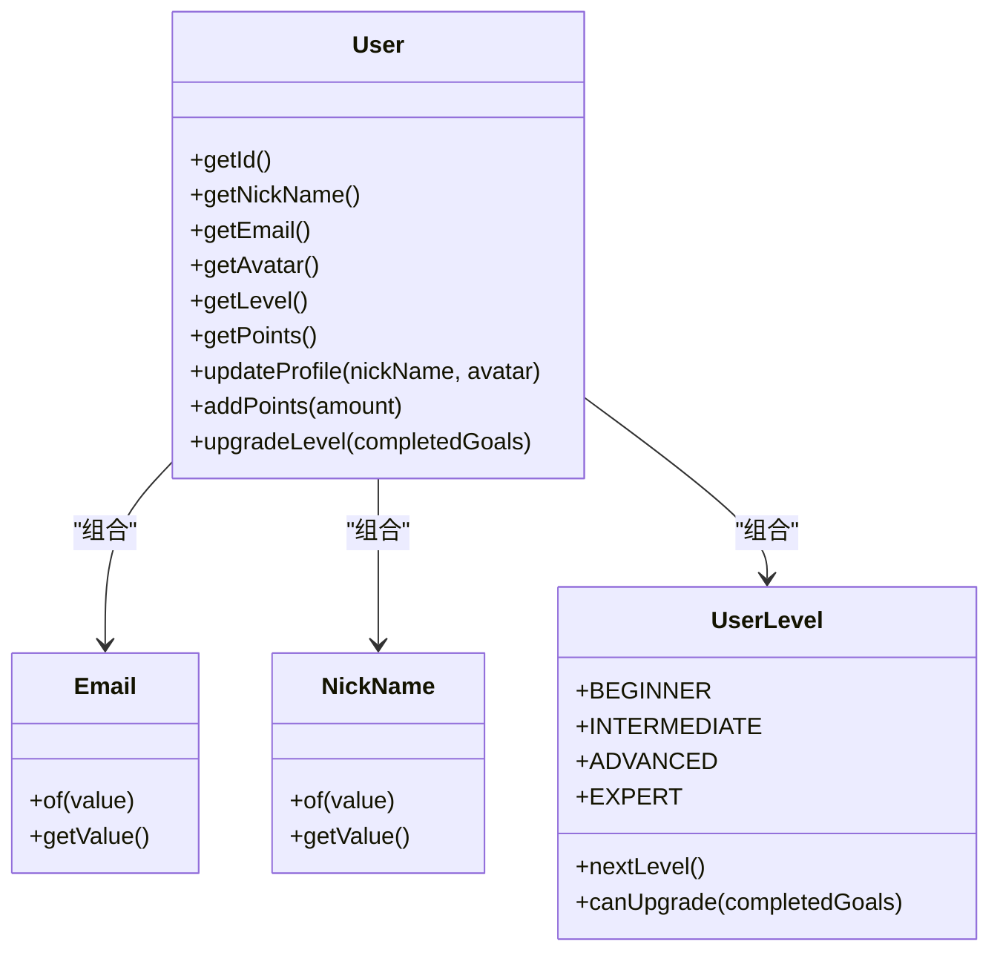
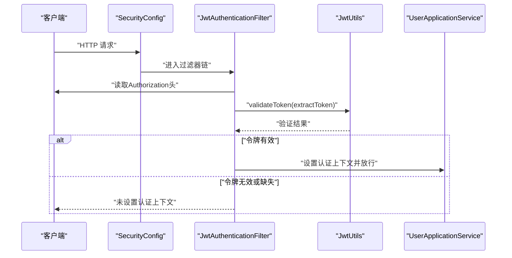
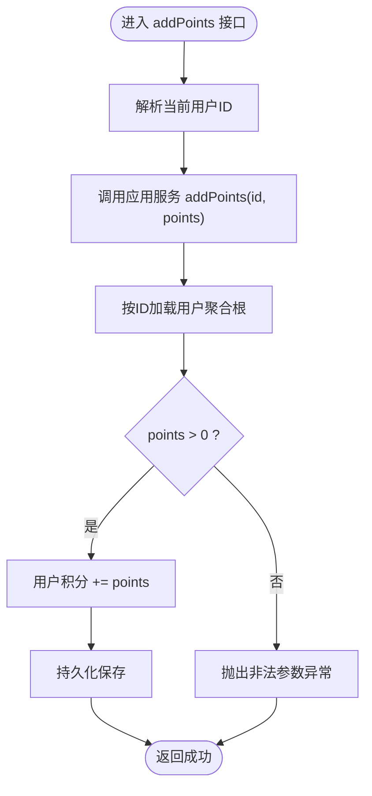
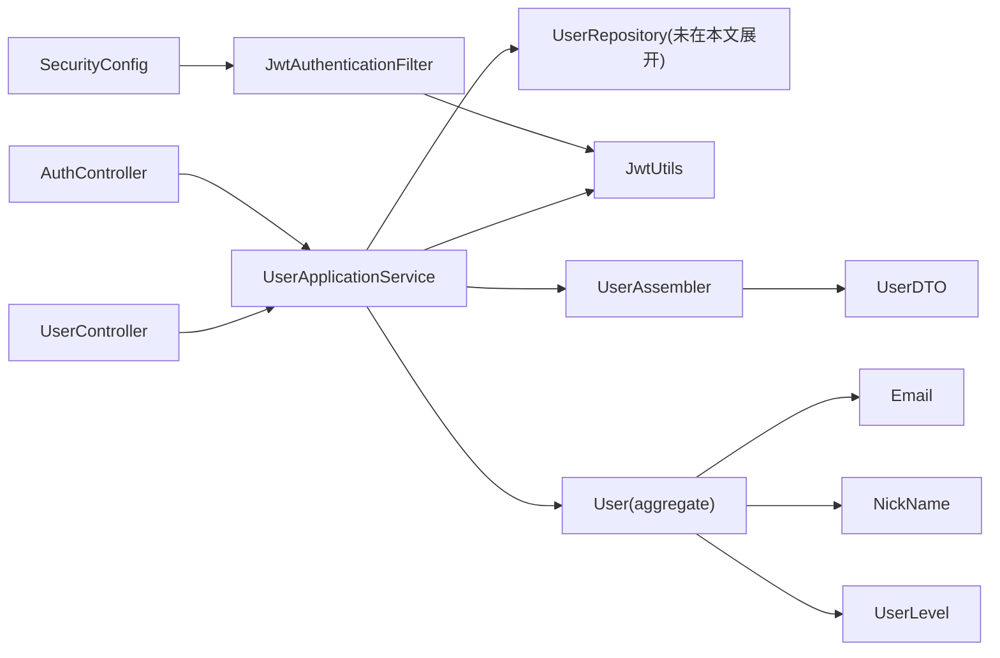

# 用户接口

<cite>
**本文引用的文件**
- [src/main/java/com/crazydream/interfaces/user/UserController.java](file://src/main/java/com/crazydream/interfaces/user/UserController.java)
- [src/main/java/com/crazydream/application/user/service/UserApplicationService.java](file://src/main/java/com/crazydream/application/user/service/UserApplicationService.java)
- [src/main/java/com/crazydream/application/user/dto/UserDTO.java](file://src/main/java/com/crazydream/application/user/dto/UserDTO.java)
- [src/main/java/com/crazydream/application/user/dto/RegisterCommand.java](file://src/main/java/com/crazydream/application/user/dto/RegisterCommand.java)
- [src/main/java/com/crazydream/application/user/dto/LoginCommand.java](file://src/main/java/com/crazydream/application/user/dto/LoginCommand.java)
- [src/main/java/com/crazydream/application/user/dto/UpdateProfileCommand.java](file://src/main/java/com/crazydream/application/user/dto/UpdateProfileCommand.java)
- [src/main/java/com/crazydream/application/user/dto/LoginResponse.java](file://src/main/java/com/crazydream/application/user/dto/LoginResponse.java)
- [src/main/java/com/crazydream/application/user/assembler/UserAssembler.java](file://src/main/java/com/crazydream/application/user/assembler/UserAssembler.java)
- [src/main/java/com/crazydream/domain/user/model/aggregate/User.java](file://src/main/java/com/crazydream/domain/user/model/aggregate/User.java)
- [src/main/java/com/crazydream/domain/user/model/valueobject/Email.java](file://src/main/java/com/crazydream/domain/user/model/valueobject/Email.java)
- [src/main/java/com/crazydream/domain/user/model/valueobject/NickName.java](file://src/main/java/com/crazydream/domain/user/model/valueobject/NickName.java)
- [src/main/java/com/crazydream/domain/user/model/valueobject/UserLevel.java](file://src/main/java/com/crazydream/domain/user/model/valueobject/UserLevel.java)
- [src/main/java/com/crazydream/security/JwtAuthenticationFilter.java](file://src/main/java/com/crazydream/security/JwtAuthenticationFilter.java)
- [src/main/java/com/crazydream/security/SecurityConfig.java](file://src/main/java/com/crazydream/security/SecurityConfig.java)
- [src/main/java/com/crazydream/utils/JwtUtils.java](file://src/main/java/com/crazydream/utils/JwtUtils.java)
- [src/main/java/com/crazydream/interfaces/auth/AuthController.java](file://src/main/java/com/crazydream/interfaces/auth/AuthController.java)
- [src/main/resources/application.yml](file://src/main/resources/application.yml)
</cite>

## 目录
1. [简介](#简介)
2. [项目结构](#项目结构)
3. [核心组件](#核心组件)
4. [架构总览](#架构总览)
5. [详细组件分析](#详细组件分析)
6. [依赖关系分析](#依赖关系分析)
7. [性能与扩展性](#性能与扩展性)
8. [故障排查指南](#故障排查指南)
9. [结论](#结论)
10. [附录](#附录)

## 简介
本文件为用户模块的全面 API 接口文档，覆盖用户信息管理相关接口，包括：
- 获取当前用户信息
- 获取用户资料
- 根据 ID 获取用户信息
- 更新用户信息
- 更新用户资料
- 用户积分增加
- 登录与注册（认证相关）

文档还说明了用户数据结构、字段校验规则、权限控制机制、积分计算逻辑、头像上传与昵称更新、邮箱验证流程以及安全与隐私保护措施。

## 项目结构
用户模块采用分层架构，主要涉及接口层、应用层、领域层与基础设施层：
- 接口层：UserController、AuthController
- 应用层：UserApplicationService 及 DTO、Assembler
- 领域层：User 聚合根及值对象（Email、NickName、UserLevel）
- 安全层：JwtAuthenticationFilter、SecurityConfig、JwtUtils
- 配置：application.yml

图表来源
- [src/main/java/com/crazydream/interfaces/user/UserController.java](file://src/main/java/com/crazydream/interfaces/user/UserController.java#L1-L132)
- [src/main/java/com/crazydream/interfaces/auth/AuthController.java](file://src/main/java/com/crazydream/interfaces/auth/AuthController.java#L1-L62)
- [src/main/java/com/crazydream/application/user/service/UserApplicationService.java](file://src/main/java/com/crazydream/application/user/service/UserApplicationService.java#L1-L98)
- [src/main/java/com/crazydream/application/user/assembler/UserAssembler.java](file://src/main/java/com/crazydream/application/user/assembler/UserAssembler.java#L1-L35)
- [src/main/java/com/crazydream/domain/user/model/aggregate/User.java](file://src/main/java/com/crazydream/domain/user/model/aggregate/User.java#L1-L122)
- [src/main/java/com/crazydream/domain/user/model/valueobject/Email.java](file://src/main/java/com/crazydream/domain/user/model/valueobject/Email.java#L1-L46)
- [src/main/java/com/crazydream/domain/user/model/valueobject/NickName.java](file://src/main/java/com/crazydream/domain/user/model/valueobject/NickName.java#L1-L44)
- [src/main/java/com/crazydream/domain/user/model/valueobject/UserLevel.java](file://src/main/java/com/crazydream/domain/user/model/valueobject/UserLevel.java#L1-L66)
- [src/main/java/com/crazydream/security/SecurityConfig.java](file://src/main/java/com/crazydream/security/SecurityConfig.java#L1-L105)
- [src/main/java/com/crazydream/security/JwtAuthenticationFilter.java](file://src/main/java/com/crazydream/security/JwtAuthenticationFilter.java#L1-L129)
- [src/main/java/com/crazydream/utils/JwtUtils.java](file://src/main/java/com/crazydream/utils/JwtUtils.java#L1-L165)

章节来源
- [src/main/java/com/crazydream/interfaces/user/UserController.java](file://src/main/java/com/crazydream/interfaces/user/UserController.java#L1-L132)
- [src/main/java/com/crazydream/interfaces/auth/AuthController.java](file://src/main/java/com/crazydream/interfaces/auth/AuthController.java#L1-L62)
- [src/main/java/com/crazydream/application/user/service/UserApplicationService.java](file://src/main/java/com/crazydream/application/user/service/UserApplicationService.java#L1-L98)
- [src/main/java/com/crazydream/security/SecurityConfig.java](file://src/main/java/com/crazydream/security/SecurityConfig.java#L1-L105)

## 核心组件
- 用户控制器 UserController：提供用户信息查询、更新、积分操作等接口，并通过安全上下文解析当前用户 ID。
- 用户应用服务 UserApplicationService：封装业务逻辑，如注册、登录、获取用户、更新资料、积分增加、等级升级。
- 用户 DTO 与命令对象：RegisterCommand、LoginCommand、UpdateProfileCommand、UserDTO、LoginResponse。
- 用户装配器 UserAssembler：负责领域对象与 DTO 的相互转换。
- 领域模型 User：用户聚合根，包含昵称、邮箱、头像、等级、积分等属性与行为。
- 值对象 Email、NickName：对邮箱与昵称进行格式与长度约束。
- 用户等级 UserLevel：定义等级、描述与升级所需完成目标数。
- 安全组件：SecurityConfig、JwtAuthenticationFilter、JwtUtils，负责 JWT 认证与授权。

章节来源
- [src/main/java/com/crazydream/interfaces/user/UserController.java](file://src/main/java/com/crazydream/interfaces/user/UserController.java#L1-L132)
- [src/main/java/com/crazydream/application/user/service/UserApplicationService.java](file://src/main/java/com/crazydream/application/user/service/UserApplicationService.java#L1-L98)
- [src/main/java/com/crazydream/application/user/dto/UserDTO.java](file://src/main/java/com/crazydream/application/user/dto/UserDTO.java#L1-L18)
- [src/main/java/com/crazydream/application/user/dto/RegisterCommand.java](file://src/main/java/com/crazydream/application/user/dto/RegisterCommand.java#L1-L11)
- [src/main/java/com/crazydream/application/user/dto/LoginCommand.java](file://src/main/java/com/crazydream/application/user/dto/LoginCommand.java#L1-L10)
- [src/main/java/com/crazydream/application/user/dto/UpdateProfileCommand.java](file://src/main/java/com/crazydream/application/user/dto/UpdateProfileCommand.java#L1-L10)
- [src/main/java/com/crazydream/application/user/dto/LoginResponse.java](file://src/main/java/com/crazydream/application/user/dto/LoginResponse.java#L1-L12)
- [src/main/java/com/crazydream/application/user/assembler/UserAssembler.java](file://src/main/java/com/crazydream/application/user/assembler/UserAssembler.java#L1-L35)
- [src/main/java/com/crazydream/domain/user/model/aggregate/User.java](file://src/main/java/com/crazydream/domain/user/model/aggregate/User.java#L1-L122)
- [src/main/java/com/crazydream/domain/user/model/valueobject/Email.java](file://src/main/java/com/crazydream/domain/user/model/valueobject/Email.java#L1-L46)
- [src/main/java/com/crazydream/domain/user/model/valueobject/NickName.java](file://src/main/java/com/crazydream/domain/user/model/valueobject/NickName.java#L1-L44)
- [src/main/java/com/crazydream/domain/user/model/valueobject/UserLevel.java](file://src/main/java/com/crazydream/domain/user/model/valueobject/UserLevel.java#L1-L66)
- [src/main/java/com/crazydream/security/SecurityConfig.java](file://src/main/java/com/crazydream/security/SecurityConfig.java#L1-L105)
- [src/main/java/com/crazydream/security/JwtAuthenticationFilter.java](file://src/main/java/com/crazydream/security/JwtAuthenticationFilter.java#L1-L129)
- [src/main/java/com/crazydream/utils/JwtUtils.java](file://src/main/java/com/crazydream/utils/JwtUtils.java#L1-L165)

## 架构总览
用户模块遵循分层架构，接口层接收请求，应用层编排业务，领域层承载业务规则，安全层统一处理认证与授权。

图表来源
- [src/main/java/com/crazydream/interfaces/user/UserController.java](file://src/main/java/com/crazydream/interfaces/user/UserController.java#L1-L132)
- [src/main/java/com/crazydream/security/JwtAuthenticationFilter.java](file://src/main/java/com/crazydream/security/JwtAuthenticationFilter.java#L1-L129)
- [src/main/java/com/crazydream/utils/JwtUtils.java](file://src/main/java/com/crazydream/utils/JwtUtils.java#L1-L165)
- [src/main/java/com/crazydream/application/user/service/UserApplicationService.java](file://src/main/java/com/crazydream/application/user/service/UserApplicationService.java#L1-L98)

## 详细组件分析

### 用户接口清单与规范

- 获取当前用户信息
  - 方法与路径：GET /api/v2/users/me
  - 权限：已认证用户
  - 请求参数：无
  - 响应：UserDTO
  - 行为：从安全上下文中解析当前用户 ID，调用应用服务按 ID 查询用户

- 获取用户资料
  - 方法与路径：GET /api/v2/users/profile
  - 权限：已认证用户
  - 请求参数：无
  - 响应：UserDTO
  - 行为：同“获取当前用户信息”

- 根据 ID 获取用户信息
  - 方法与路径：GET /api/v2/users/{id}
  - 权限：已认证用户
  - 路径参数：id（Long）
  - 响应：UserDTO
  - 行为：应用服务按 ID 查询用户

- 更新用户信息
  - 方法与路径：PUT /api/v2/users/{id}
  - 权限：已认证用户
  - 路径参数：id（Long）
  - 请求体：Map<String,Object>（简化实现：直接返回当前用户信息）
  - 响应：UserDTO
  - 行为：当前实现为简化返回；实际业务可扩展为按 payload 字段更新

- 更新用户资料
  - 方法与路径：PUT /api/v2/users/profile
  - 权限：已认证用户
  - 请求体：UpdateProfileCommand（包含 nickName、avatar）
  - 响应：UserDTO
  - 行为：应用服务根据命令更新昵称与头像，保存并返回最新 DTO

- 用户积分增加
  - 方法与路径：POST /api/v2/users/points
  - 权限：已认证用户
  - 查询参数：points（int）
  - 响应：空内容
  - 行为：应用服务按当前用户 ID 增加积分；领域模型校验积分必须大于 0

- 登录与注册（认证相关）
  - 注册：POST /api/v2/auth/register
  - 登录：POST /api/v2/auth/login
  - 权限：无需认证
  - 请求体：RegisterCommand 或 LoginCommand
  - 响应：LoginResponse（token + UserDTO）

章节来源
- [src/main/java/com/crazydream/interfaces/user/UserController.java](file://src/main/java/com/crazydream/interfaces/user/UserController.java#L36-L99)
- [src/main/java/com/crazydream/interfaces/auth/AuthController.java](file://src/main/java/com/crazydream/interfaces/auth/AuthController.java#L26-L60)
- [src/main/java/com/crazydream/application/user/dto/UpdateProfileCommand.java](file://src/main/java/com/crazydream/application/user/dto/UpdateProfileCommand.java#L1-L10)
- [src/main/java/com/crazydream/application/user/dto/RegisterCommand.java](file://src/main/java/com/crazydream/application/user/dto/RegisterCommand.java#L1-L11)
- [src/main/java/com/crazydream/application/user/dto/LoginCommand.java](file://src/main/java/com/crazydream/application/user/dto/LoginCommand.java#L1-L10)
- [src/main/java/com/crazydream/application/user/dto/LoginResponse.java](file://src/main/java/com/crazydream/application/user/dto/LoginResponse.java#L1-L12)

### 用户数据结构与字段校验

- UserDTO 字段
  - id、nickName、email、avatar、level、levelDescription、points、createTime、updateTime
  - 由领域模型装配生成

- RegisterCommand 字段
  - email、password、nickName
  - 邮箱与昵称的校验由领域层值对象承担

- LoginCommand 字段
  - email、password

- UpdateProfileCommand 字段
  - nickName、avatar

- 值对象校验规则
  - Email：非空、格式匹配、大小写归一化
  - NickName：非空、长度不超过 50
  - UserLevel：等级枚举、升级阈值

图表来源
- [src/main/java/com/crazydream/domain/user/model/aggregate/User.java](file://src/main/java/com/crazydream/domain/user/model/aggregate/User.java#L1-L122)
- [src/main/java/com/crazydream/domain/user/model/valueobject/Email.java](file://src/main/java/com/crazydream/domain/user/model/valueobject/Email.java#L1-L46)
- [src/main/java/com/crazydream/domain/user/model/valueobject/NickName.java](file://src/main/java/com/crazydream/domain/user/model/valueobject/NickName.java#L1-L44)
- [src/main/java/com/crazydream/domain/user/model/valueobject/UserLevel.java](file://src/main/java/com/crazydream/domain/user/model/valueobject/UserLevel.java#L1-L66)

章节来源
- [src/main/java/com/crazydream/application/user/dto/UserDTO.java](file://src/main/java/com/crazydream/application/user/dto/UserDTO.java#L1-L18)
- [src/main/java/com/crazydream/domain/user/model/aggregate/User.java](file://src/main/java/com/crazydream/domain/user/model/aggregate/User.java#L1-L122)
- [src/main/java/com/crazydream/domain/user/model/valueobject/Email.java](file://src/main/java/com/crazydream/domain/user/model/valueobject/Email.java#L1-L46)
- [src/main/java/com/crazydream/domain/user/model/valueobject/NickName.java](file://src/main/java/com/crazydream/domain/user/model/valueobject/NickName.java#L1-L44)
- [src/main/java/com/crazydream/domain/user/model/valueobject/UserLevel.java](file://src/main/java/com/crazydream/domain/user/model/valueobject/UserLevel.java#L1-L66)

### 权限控制与认证流程

- 安全配置
  - 无状态会话策略
  - CORS 放通
  - 除登录/注册与健康检查外，其余接口均需认证
  - 支持测试模式下禁用安全认证并设置默认用户

- JWT 过滤器
  - 从 Authorization 头解析 Bearer 令牌
  - 验证令牌有效性并从载荷提取用户 ID
  - 将认证信息写入 Spring Security 上下文

图表来源
- [src/main/java/com/crazydream/security/SecurityConfig.java](file://src/main/java/com/crazydream/security/SecurityConfig.java#L54-L91)
- [src/main/java/com/crazydream/security/JwtAuthenticationFilter.java](file://src/main/java/com/crazydream/security/JwtAuthenticationFilter.java#L48-L127)
- [src/main/java/com/crazydream/utils/JwtUtils.java](file://src/main/java/com/crazydream/utils/JwtUtils.java#L113-L138)

章节来源
- [src/main/java/com/crazydream/security/SecurityConfig.java](file://src/main/java/com/crazydream/security/SecurityConfig.java#L1-L105)
- [src/main/java/com/crazydream/security/JwtAuthenticationFilter.java](file://src/main/java/com/crazydream/security/JwtAuthenticationFilter.java#L1-L129)
- [src/main/java/com/crazydream/utils/JwtUtils.java](file://src/main/java/com/crazydream/utils/JwtUtils.java#L1-L165)

### 积分增加接口与计算逻辑

- 接口
  - POST /api/v2/users/points
  - 参数：points（int）
  - 行为：应用服务按当前用户 ID 增加积分

- 领域规则
  - 增加量必须大于 0，否则抛出非法参数异常
  - 更新时间随业务操作同步更新

图表来源
- [src/main/java/com/crazydream/interfaces/user/UserController.java](file://src/main/java/com/crazydream/interfaces/user/UserController.java#L90-L99)
- [src/main/java/com/crazydream/application/user/service/UserApplicationService.java](file://src/main/java/com/crazydream/application/user/service/UserApplicationService.java#L81-L87)
- [src/main/java/com/crazydream/domain/user/model/aggregate/User.java](file://src/main/java/com/crazydream/domain/user/model/aggregate/User.java#L74-L80)

章节来源
- [src/main/java/com/crazydream/interfaces/user/UserController.java](file://src/main/java/com/crazydream/interfaces/user/UserController.java#L90-L99)
- [src/main/java/com/crazydream/application/user/service/UserApplicationService.java](file://src/main/java/com/crazydream/application/user/service/UserApplicationService.java#L81-L87)
- [src/main/java/com/crazydream/domain/user/model/aggregate/User.java](file://src/main/java/com/crazydream/domain/user/model/aggregate/User.java#L74-L80)

### 头像上传、昵称更新与邮箱验证

- 头像上传
  - 当前实现：通过更新资料接口将 avatar 字段提交至后端；具体文件上传与存储由前端或独立文件服务处理，后端仅保存 URL 或标识
  - 建议：结合文件上传能力与对象存储服务（如 OSS）实现完整的头像上传流程

- 昵称更新
  - 通过 PUT /api/v2/users/profile 提交 UpdateProfileCommand，包含 nickName 与可选 avatar
  - 领域层对昵称长度与非空进行校验

- 邮箱验证
  - 当前实现：注册时对邮箱格式进行校验；未见专门的邮箱验证接口或邮件发送逻辑
  - 建议：新增邮箱验证接口与邮件发送流程，以提升账户安全性与合规性

章节来源
- [src/main/java/com/crazydream/interfaces/user/UserController.java](file://src/main/java/com/crazydream/interfaces/user/UserController.java#L79-L88)
- [src/main/java/com/crazydream/application/user/dto/UpdateProfileCommand.java](file://src/main/java/com/crazydream/application/user/dto/UpdateProfileCommand.java#L1-L10)
- [src/main/java/com/crazydream/domain/user/model/valueobject/NickName.java](file://src/main/java/com/crazydream/domain/user/model/valueobject/NickName.java#L1-L44)
- [src/main/java/com/crazydream/domain/user/model/valueobject/Email.java](file://src/main/java/com/crazydream/domain/user/model/valueobject/Email.java#L1-L46)

### 安全与隐私保护

- 密码处理
  - 注册与登录使用 PasswordEncoder 进行加密存储与匹配
  - 领域模型仅保存加密后的密码

- JWT 安全
  - 密钥、过期时间、头部前缀等通过配置文件注入
  - 过滤器严格校验令牌有效性并解析用户 ID

- 测试模式
  - 可通过配置禁用安全认证（仅测试环境），并设置默认用户 ID

- 隐私与数据最小化
  - DTO 中未暴露敏感字段（如密码）
  - 建议：对外接口避免泄露内部实现细节，遵循最小必要原则

章节来源
- [src/main/java/com/crazydream/application/user/service/UserApplicationService.java](file://src/main/java/com/crazydream/application/user/service/UserApplicationService.java#L28-L42)
- [src/main/java/com/crazydream/utils/JwtUtils.java](file://src/main/java/com/crazydream/utils/JwtUtils.java#L34-L44)
- [src/main/java/com/crazydream/security/SecurityConfig.java](file://src/main/java/com/crazydream/security/SecurityConfig.java#L40-L47)
- [src/main/resources/application.yml](file://src/main/resources/application.yml#L65-L75)

## 依赖关系分析

图表来源
- [src/main/java/com/crazydream/interfaces/user/UserController.java](file://src/main/java/com/crazydream/interfaces/user/UserController.java#L1-L132)
- [src/main/java/com/crazydream/interfaces/auth/AuthController.java](file://src/main/java/com/crazydream/interfaces/auth/AuthController.java#L1-L62)
- [src/main/java/com/crazydream/application/user/service/UserApplicationService.java](file://src/main/java/com/crazydream/application/user/service/UserApplicationService.java#L1-L98)
- [src/main/java/com/crazydream/application/user/assembler/UserAssembler.java](file://src/main/java/com/crazydream/application/user/assembler/UserAssembler.java#L1-L35)
- [src/main/java/com/crazydream/domain/user/model/aggregate/User.java](file://src/main/java/com/crazydream/domain/user/model/aggregate/User.java#L1-L122)
- [src/main/java/com/crazydream/security/SecurityConfig.java](file://src/main/java/com/crazydream/security/SecurityConfig.java#L1-L105)
- [src/main/java/com/crazydream/security/JwtAuthenticationFilter.java](file://src/main/java/com/crazydream/security/JwtAuthenticationFilter.java#L1-L129)
- [src/main/java/com/crazydream/utils/JwtUtils.java](file://src/main/java/com/crazydream/utils/JwtUtils.java#L1-L165)

章节来源
- [src/main/java/com/crazydream/interfaces/user/UserController.java](file://src/main/java/com/crazydream/interfaces/user/UserController.java#L1-L132)
- [src/main/java/com/crazydream/application/user/service/UserApplicationService.java](file://src/main/java/com/crazydream/application/user/service/UserApplicationService.java#L1-L98)
- [src/main/java/com/crazydream/security/SecurityConfig.java](file://src/main/java/com/crazydream/security/SecurityConfig.java#L1-L105)

## 性能与扩展性
- 无状态设计：JWT 无状态认证减少会话开销，适合水平扩展
- 事务边界：注册、更新资料、积分增加等关键操作使用事务保证一致性
- 建议优化点
  - 缓存热点用户信息（如按 ID 查询）
  - 对频繁更新的字段（如积分）考虑批量更新策略
  - 引入幂等性控制（如积分增加）防止重复提交

[本节为通用建议，不直接分析具体文件]

## 故障排查指南
- 常见错误与原因
  - 401 未认证：缺少或无效的 Authorization 头
  - 400 参数错误：points ≤ 0、昵称为空或超长、邮箱格式不正确
  - 404 用户不存在：按 ID 查询时用户不存在
  - 400 邮箱已被注册：注册时邮箱冲突
  - 401 邮箱或密码错误：登录凭据不匹配

- 排查步骤
  - 确认请求头 Authorization 是否为 Bearer 令牌
  - 校验请求体字段格式与长度
  - 检查 JWT 密钥、过期时间配置
  - 在测试环境启用禁用安全认证时确认默认用户 ID

章节来源
- [src/main/java/com/crazydream/interfaces/user/UserController.java](file://src/main/java/com/crazydream/interfaces/user/UserController.java#L36-L99)
- [src/main/java/com/crazydream/application/user/service/UserApplicationService.java](file://src/main/java/com/crazydream/application/user/service/UserApplicationService.java#L28-L42)
- [src/main/java/com/crazydream/security/JwtAuthenticationFilter.java](file://src/main/java/com/crazydream/security/JwtAuthenticationFilter.java#L48-L127)
- [src/main/java/com/crazydream/utils/JwtUtils.java](file://src/main/java/com/crazydream/utils/JwtUtils.java#L113-L138)

## 结论
用户模块提供了清晰的分层架构与完善的认证授权机制，覆盖用户信息管理与积分体系的核心需求。建议后续补充邮箱验证、头像上传与更细粒度的权限控制，以进一步提升安全性与用户体验。

[本节为总结性内容，不直接分析具体文件]

## 附录

### 关键配置项
- JWT 配置：密钥、过期时间、请求头名称与前缀
- 安全配置：是否禁用认证、测试默认用户 ID
- 文件上传：最大文件大小与请求大小

章节来源
- [src/main/resources/application.yml](file://src/main/resources/application.yml#L57-L75)