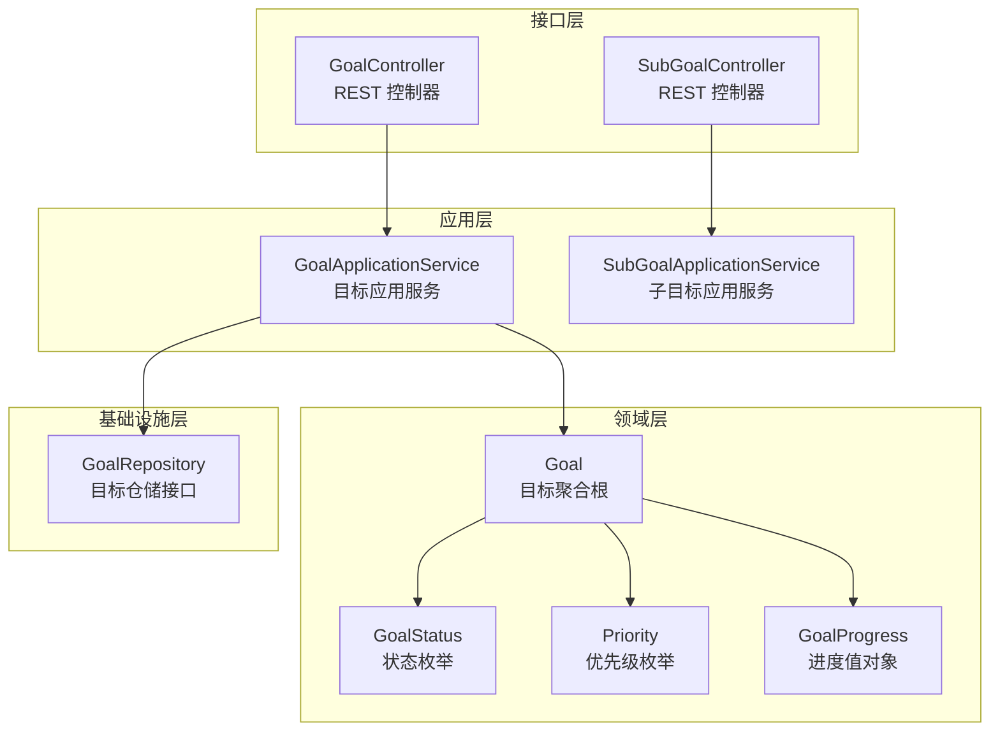
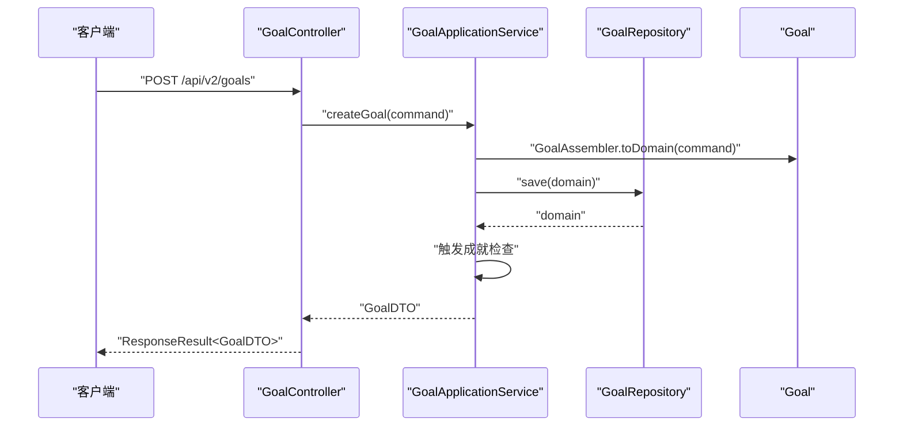
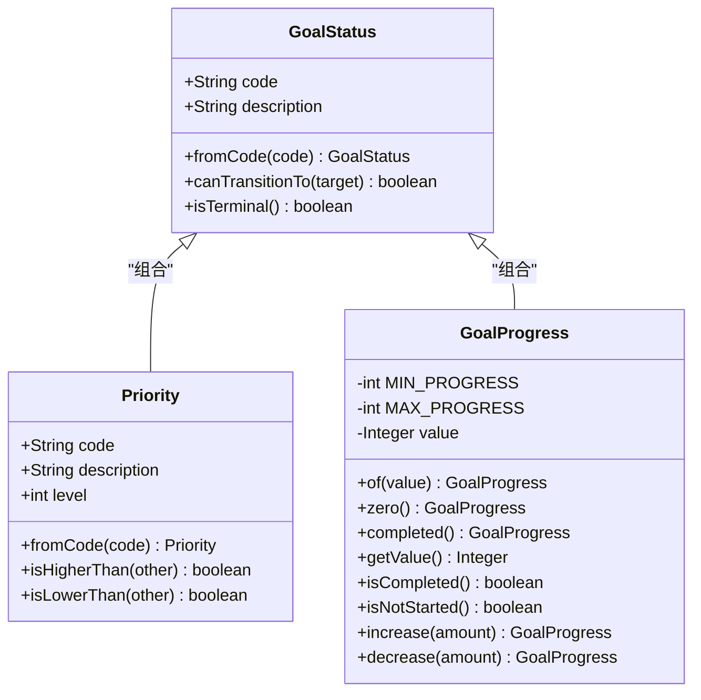
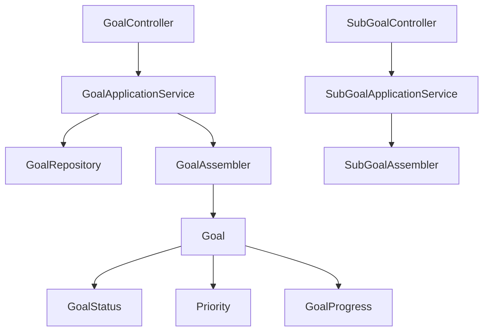

# 目标接口

<cite>
**本文档引用的文件**
- [GoalController.java](file://src/main/java/com/crazydream/interfaces/goal/GoalController.java)
- [GoalApplicationService.java](file://src/main/java/com/crazydream/application/goal/service/GoalApplicationService.java)
- [GoalAssembler.java](file://src/main/java/com/crazydream/application/goal/assembler/GoalAssembler.java)
- [CreateGoalCommand.java](file://src/main/java/com/crazydream/application/goal/dto/CreateGoalCommand.java)
- [UpdateGoalCommand.java](file://src/main/java/com/crazydream/application/goal/dto/UpdateGoalCommand.java)
- [GoalDTO.java](file://src/main/java/com/crazydream/application/goal/dto/GoalDTO.java)
- [GoalRepository.java](file://src/main/java/com/crazydream/domain/goal/repository/GoalRepository.java)
- [GoalStatus.java](file://src/main/java/com/crazydream/domain/goal/model/valueobject/GoalStatus.java)
- [Priority.java](file://src/main/java/com/crazydream/domain/goal/model/valueobject/Priority.java)
- [GoalProgress.java](file://src/main/java/com/crazydream/domain/goal/model/valueobject/GoalProgress.java)
- [GoalApplicationServiceTest.java](file://src/test/java/com/crazydream/application/goal/GoalApplicationServiceTest.java)
- [SubGoalController.java](file://src/main/java/com/crazydream/interfaces/subgoal/SubGoalController.java)
- [SubGoalApplicationService.java](file://src/main/java/com/crazydream/application/subgoal/service/SubGoalApplicationService.java)
- [BUGFIX-2026-01-19-STATUS-TRANSITION.md](file://BUGFIX-2026-01-19-STATUS-TRANSITION.md)
</cite>

## 目录
1. [简介](#简介)
2. [项目结构](#项目结构)
3. [核心组件](#核心组件)
4. [架构概览](#架构概览)
5. [详细组件分析](#详细组件分析)
6. [依赖关系分析](#依赖关系分析)
7. [性能考虑](#性能考虑)
8. [故障排除指南](#故障排除指南)
9. [结论](#结论)

## 简介
本文件为 CrazyDream 项目中目标管理模块的完整 API 接口文档。目标管理涵盖目标的创建、更新、查询、删除以及进度管理等功能，并包含状态管理（未开始、进行中、已完成、已放弃）、优先级设置、截止日期处理、进度计算逻辑与状态自动转换规则。同时，文档还说明了目标与子目标的关联关系与层级管理，以及目标搜索、筛选和排序的接口规范。

## 项目结构
目标模块采用分层架构，主要分为以下层次：
- 接口层（Interface Layer）：暴露 HTTP REST 接口，处理请求与响应
- 应用层（Application Layer）：编排业务流程，协调领域对象
- 领域层（Domain Layer）：封装业务规则与状态机
- 基础设施层（Infrastructure Layer）：数据持久化与仓储实现

**图表来源**
- [GoalController.java](file://src/main/java/com/crazydream/interfaces/goal/GoalController.java#L26-L287)
- [GoalApplicationService.java](file://src/main/java/com/crazydream/application/goal/service/GoalApplicationService.java#L30-L245)
- [GoalAssembler.java](file://src/main/java/com/crazydream/application/goal/assembler/GoalAssembler.java#L21-L86)
- [GoalRepository.java](file://src/main/java/com/crazydream/domain/goal/repository/GoalRepository.java#L18-L69)

**章节来源**
- [GoalController.java](file://src/main/java/com/crazydream/interfaces/goal/GoalController.java#L26-L287)
- [GoalApplicationService.java](file://src/main/java/com/crazydream/application/goal/service/GoalApplicationService.java#L30-L245)

## 核心组件
- 目标控制器（GoalController）：提供 REST API，负责请求处理与响应封装
- 目标应用服务（GoalApplicationService）：编排业务流程，协调领域对象执行用例
- 目标装配器（GoalAssembler）：负责领域对象与 DTO 之间的转换
- 目标仓储接口（GoalRepository）：定义目标的持久化操作契约
- 值对象：GoalStatus（状态）、Priority（优先级）、GoalProgress（进度）

**章节来源**
- [GoalController.java](file://src/main/java/com/crazydream/interfaces/goal/GoalController.java#L26-L287)
- [GoalApplicationService.java](file://src/main/java/com/crazydream/application/goal/service/GoalApplicationService.java#L30-L245)
- [GoalAssembler.java](file://src/main/java/com/crazydream/application/goal/assembler/GoalAssembler.java#L21-L86)
- [GoalRepository.java](file://src/main/java/com/crazydream/domain/goal/repository/GoalRepository.java#L18-L69)

## 架构概览
目标模块遵循整洁架构（Clean Architecture）分层原则：
- 接口层仅负责请求与响应，不包含业务逻辑
- 应用层编排业务流程，协调领域对象
- 领域层封装核心业务规则与状态机
- 基础设施层提供数据持久化能力

**图表来源**
- [GoalController.java](file://src/main/java/com/crazydream/interfaces/goal/GoalController.java#L76-L91)
- [GoalApplicationService.java](file://src/main/java/com/crazydream/application/goal/service/GoalApplicationService.java#L44-L62)
- [GoalAssembler.java](file://src/main/java/com/crazydream/application/goal/assembler/GoalAssembler.java#L26-L35)

**章节来源**
- [GoalController.java](file://src/main/java/com/crazydream/interfaces/goal/GoalController.java#L76-L91)
- [GoalApplicationService.java](file://src/main/java/com/crazydream/application/goal/service/GoalApplicationService.java#L44-L62)

## 详细组件分析

### API 接口规范

#### 1. 创建目标
- 方法：POST
- 路径：/api/v2/goals
- 请求体：CreateGoalCommand
- 响应：GoalDTO
- 权限：基于认证上下文获取当前用户 ID
- 错误码：400 参数错误；500 系统内部错误

请求体字段说明：
- userId：目标所属用户 ID（可选，接口层自动注入）
- title：目标标题
- description：目标描述
- categoryId：分类 ID
- priority：优先级（low/medium/high）
- deadline：截止日期

响应字段说明：
- id、userId、title、description、categoryId、priority、deadline、progress、status、imageUrl、createTime、updateTime

**章节来源**
- [GoalController.java](file://src/main/java/com/crazydream/interfaces/goal/GoalController.java#L76-L91)
- [CreateGoalCommand.java](file://src/main/java/com/crazydream/application/goal/dto/CreateGoalCommand.java#L13-L20)
- [GoalDTO.java](file://src/main/java/com/crazydream/application/goal/dto/GoalDTO.java#L14-L27)

#### 2. 更新目标
- 方法：PUT
- 路径：/api/v2/goals/{id}
- 路径参数：id（目标 ID）
- 请求体：UpdateGoalCommand
- 响应：GoalDTO
- 权限：需为目标所属用户
- 错误码：400 参数错误；404 目标不存在；500 系统内部错误

请求体字段说明：
- id、userId、title、description、categoryId、priority、deadline、imageUrl

**章节来源**
- [GoalController.java](file://src/main/java/com/crazydream/interfaces/goal/GoalController.java#L96-L113)
- [UpdateGoalCommand.java](file://src/main/java/com/crazydream/application/goal/dto/UpdateGoalCommand.java#L13-L22)

#### 3. 获取用户所有目标
- 方法：GET
- 路径：/api/v2/goals
- 响应：List<GoalDTO>
- 权限：基于认证上下文获取当前用户 ID
- 错误码：400 参数错误；500 系统内部错误

**章节来源**
- [GoalController.java](file://src/main/java/com/crazydream/interfaces/goal/GoalController.java#L118-L131)

#### 4. 根据 ID 获取目标
- 方法：GET
- 路径：/api/v2/goals/{id}
- 路径参数：id（目标 ID）
- 响应：GoalDTO
- 权限：需为目标所属用户
- 错误码：404 目标不存在；500 系统内部错误

**章节来源**
- [GoalController.java](file://src/main/java/com/crazydream/interfaces/goal/GoalController.java#L136-L149)

#### 5. 根据分类获取目标
- 方法：GET
- 路径：/api/v2/goals/category/{categoryId}
- 路径参数：categoryId（分类 ID）
- 响应：List<GoalDTO>
- 权限：基于认证上下文获取当前用户 ID
- 错误码：400 参数错误；500 系统内部错误

**章节来源**
- [GoalController.java](file://src/main/java/com/crazydream/interfaces/goal/GoalController.java#L154-L167)

#### 6. 删除目标
- 方法：DELETE
- 路径：/api/v2/goals/{id}
- 路径参数：id（目标 ID）
- 响应：Boolean
- 权限：需为目标所属用户
- 错误码：404 目标不存在；500 系统内部错误

**章节来源**
- [GoalController.java](file://src/main/java/com/crazydream/interfaces/goal/GoalController.java#L172-L185)

#### 7. 批量删除目标
- 方法：DELETE
- 路径：/api/v2/goals/batch
- 请求体：List<Long>（目标 ID 列表）
- 响应：Integer（删除成功的数量）
- 权限：基于认证上下文获取当前用户 ID
- 错误码：500 系统内部错误

**章节来源**
- [GoalController.java](file://src/main/java/com/crazydream/interfaces/goal/GoalController.java#L190-L200)

#### 8. 更新目标进度
- 方法：PATCH
- 路径：/api/v2/goals/{id}/progress
- 路径参数：id（目标 ID）
- 查询参数：progress（进度百分比）
- 响应：GoalDTO
- 权限：需为目标所属用户
- 错误码：400 参数错误；500 系统内部错误

状态自动转换规则：
- 若目标状态为未开始且进度大于0，则自动转换为进行中
- 进度达到100%时自动完成
- 已结束目标（已完成/已放弃）禁止更新进度

**章节来源**
- [GoalController.java](file://src/main/java/com/crazydream/interfaces/goal/GoalController.java#L205-L219)
- [GoalApplicationService.java](file://src/main/java/com/crazydream/application/goal/service/GoalApplicationService.java#L156-L186)
- [BUGFIX-2026-01-19-STATUS-TRANSITION.md](file://BUGFIX-2026-01-19-STATUS-TRANSITION.md#L85-L124)

#### 9. 完成目标
- 方法：PATCH
- 路径：/api/v2/goals/{id}/complete
- 路径参数：id（目标 ID）
- 响应：GoalDTO
- 权限：需为目标所属用户
- 错误码：400 参数错误；500 系统内部错误

完成目标会触发成就检查。

**章节来源**
- [GoalController.java](file://src/main/java/com/crazydream/interfaces/goal/GoalController.java#L224-L237)
- [GoalApplicationService.java](file://src/main/java/com/crazydream/application/goal/service/GoalApplicationService.java#L191-L214)

#### 10. 获取最近更新的目标
- 方法：GET
- 路径：/api/v2/goals/recent
- 查询参数：limit（默认10）
- 响应：List<GoalDTO>
- 权限：基于认证上下文获取当前用户 ID
- 错误码：500 系统内部错误

**章节来源**
- [GoalController.java](file://src/main/java/com/crazydream/interfaces/goal/GoalController.java#L242-L252)

#### 11. 获取今日提醒的目标
- 方法：GET
- 路径：/api/v2/goals/today-reminders
- 查询参数：date（可选，默认当天日期）
- 响应：List<GoalDTO>
- 权限：基于认证上下文获取当前用户 ID
- 错误码：500 系统内部错误

**章节来源**
- [GoalController.java](file://src/main/java/com/crazydream/interfaces/goal/GoalController.java#L257-L271)

#### 12. 获取目标统计
- 方法：GET
- 路径：/api/v2/goals/statistics
- 响应：Map<String, Integer>（按状态分组统计）
- 权限：基于认证上下文获取当前用户 ID
- 错误码：500 系统内部错误

**章节来源**
- [GoalController.java](file://src/main/java/com/crazydream/interfaces/goal/GoalController.java#L276-L286)
- [GoalApplicationService.java](file://src/main/java/com/crazydream/application/goal/service/GoalApplicationService.java#L235-L244)

### 子目标接口（与目标的关联关系）
- 创建子目标：POST /api/v2/subgoals
- 获取所有子目标：GET /api/v2/subgoals
- 根据目标 ID 获取子目标：GET /api/v2/subgoals/goal/{goalId}
- 根据 ID 获取子目标：GET /api/v2/subgoals/{id}
- 更新子目标进度：PATCH /api/v2/subgoals/{id}/progress
- 完成子目标：PATCH /api/v2/subgoals/{id}/complete
- 删除子目标：DELETE /api/v2/subgoals/{id}
- 批量删除子目标：DELETE /api/v2/subgoals/batch

子目标与目标存在一对多关联关系，子目标的进度更新不会直接影响父目标状态，但可用于整体进度计算。

**章节来源**
- [SubGoalController.java](file://src/main/java/com/crazydream/interfaces/subgoal/SubGoalController.java#L18-L114)
- [SubGoalApplicationService.java](file://src/main/java/com/crazydream/application/subgoal/service/SubGoalApplicationService.java#L21-L60)

### 数据模型与状态管理

**图表来源**
- [GoalStatus.java](file://src/main/java/com/crazydream/domain/goal/model/valueobject/GoalStatus.java#L10-L63)
- [Priority.java](file://src/main/java/com/crazydream/domain/goal/model/valueobject/Priority.java#L10-L57)
- [GoalProgress.java](file://src/main/java/com/crazydream/domain/goal/model/valueobject/GoalProgress.java#L12-L77)

状态管理与转换规则：
- 未开始（not_started）→ 进行中（in_progress）或已放弃（abandoned）
- 进行中（in_progress）→ 已完成（completed）或已放弃（abandoned）
- 已完成（completed）/已放弃（abandoned）为终态，不可再转换

优先级设置：
- 低优先级（low）、中优先级（medium）、高优先级（high）
- 默认优先级为中优先级

截止日期处理：
- deadline 字段支持空值，表示无截止日期
- 截止日期用于提醒与统计展示

进度计算逻辑：
- 进度范围为0-100
- 进度达到100%自动完成
- 未开始目标若进度大于0，自动转换为进行中

**章节来源**
- [GoalStatus.java](file://src/main/java/com/crazydream/domain/goal/model/valueobject/GoalStatus.java#L45-L62)
- [Priority.java](file://src/main/java/com/crazydream/domain/goal/model/valueobject/Priority.java#L25-L36)
- [GoalProgress.java](file://src/main/java/com/crazydream/domain/goal/model/valueobject/GoalProgress.java#L18-L26)
- [GoalProgress.java](file://src/main/java/com/crazydream/domain/goal/model/valueobject/GoalProgress.java#L44-L50)

### 搜索、筛选与排序规范
- 用户维度：通过认证上下文获取当前用户 ID，所有查询均按用户隔离
- 分类筛选：通过 /category/{categoryId} 接口按分类过滤
- 最近更新：通过 /recent 接口按更新时间倒序返回
- 今日提醒：通过 /today-reminders 接口按提醒日期过滤
- 状态统计：通过 /statistics 接口按状态分组统计

注意：当前版本未提供通用的查询参数（如关键词搜索、多条件筛选、自定义排序字段）。如需扩展，可在应用层添加查询条件映射并在仓储层实现相应查询方法。

**章节来源**
- [GoalController.java](file://src/main/java/com/crazydream/interfaces/goal/GoalController.java#L154-L167)
- [GoalController.java](file://src/main/java/com/crazydream/interfaces/goal/GoalController.java#L242-L252)
- [GoalController.java](file://src/main/java/com/crazydream/interfaces/goal/GoalController.java#L257-L271)
- [GoalApplicationService.java](file://src/main/java/com/crazydream/application/goal/service/GoalApplicationService.java#L235-L244)

## 依赖关系分析

**图表来源**
- [GoalController.java](file://src/main/java/com/crazydream/interfaces/goal/GoalController.java#L32-L33)
- [GoalApplicationService.java](file://src/main/java/com/crazydream/application/goal/service/GoalApplicationService.java#L35-L39)
- [GoalAssembler.java](file://src/main/java/com/crazydream/application/goal/assembler/GoalAssembler.java#L26-L35)

**章节来源**
- [GoalController.java](file://src/main/java/com/crazydream/interfaces/goal/GoalController.java#L32-L33)
- [GoalApplicationService.java](file://src/main/java/com/crazydream/application/goal/service/GoalApplicationService.java#L35-L39)

## 性能考虑
- 批量删除：提供 /batch 接口以减少网络往返次数
- 统一响应封装：使用 ResponseResult 统一响应格式，便于前端处理
- 权限校验：在应用层对目标归属进行校验，避免无效数据库操作
- 状态转换：在领域层实现状态机，确保业务规则一致性

## 故障排除指南
常见错误与处理：
- 参数错误：400 状态码，检查请求体字段类型与必填项
- 目标不存在：404 状态码，确认目标 ID 与用户归属
- 权限不足：抛出参数异常，确认当前登录用户与目标所属用户一致
- 系统内部错误：500 状态码，查看日志定位具体异常

状态转换异常：
- 未开始目标直接设置进度为100%会触发状态转换异常
- 解决方案：后端逻辑会在进度大于0时自动转换为进行中，再进行完成判断

**章节来源**
- [GoalController.java](file://src/main/java/com/crazydream/interfaces/goal/GoalController.java#L84-L90)
- [GoalController.java](file://src/main/java/com/crazydream/interfaces/goal/GoalController.java#L142-L148)
- [GoalApplicationServiceTest.java](file://src/test/java/com/crazydream/application/goal/GoalApplicationServiceTest.java#L131-L139)
- [BUGFIX-2026-01-19-STATUS-TRANSITION.md](file://BUGFIX-2026-01-19-STATUS-TRANSITION.md#L85-L124)

## 结论
目标模块提供了完整的 CRUD 与进度管理接口，结合状态机与值对象实现了严谨的业务规则。通过分层架构与装配器模式，系统具备良好的可维护性与扩展性。未来可在此基础上增加更灵活的查询参数与排序选项，以满足多样化的业务需求。