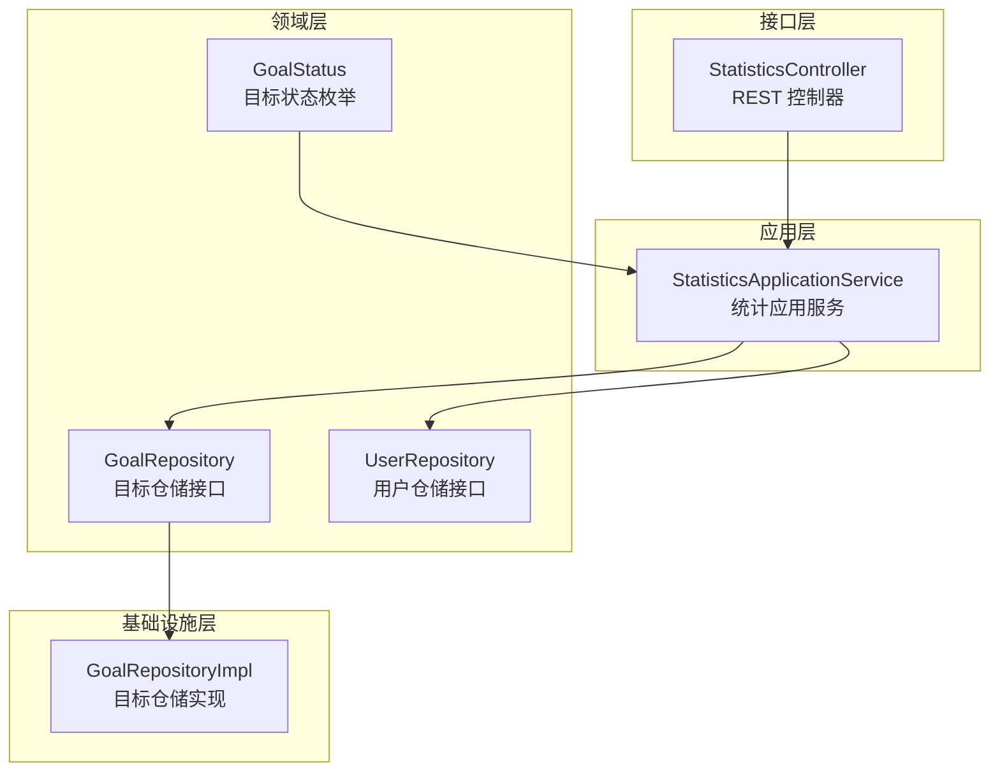
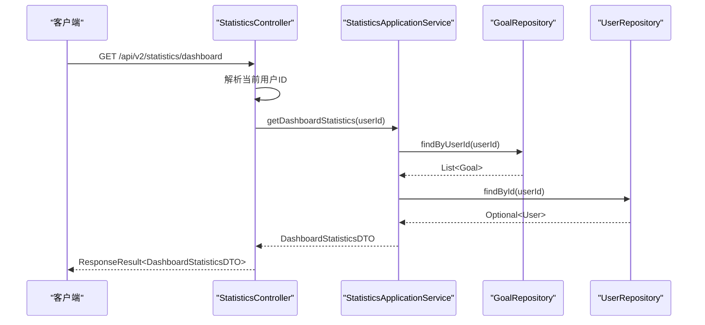
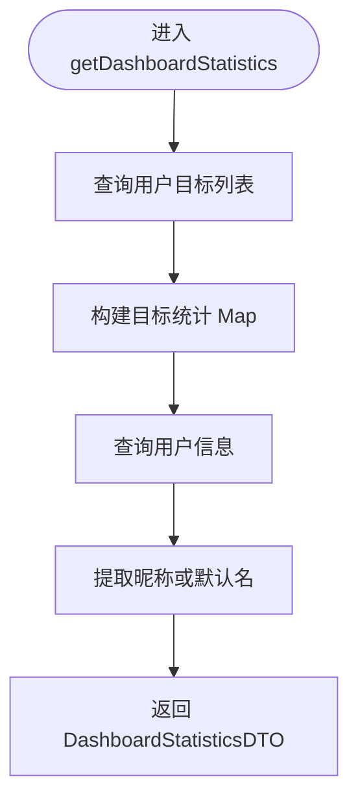
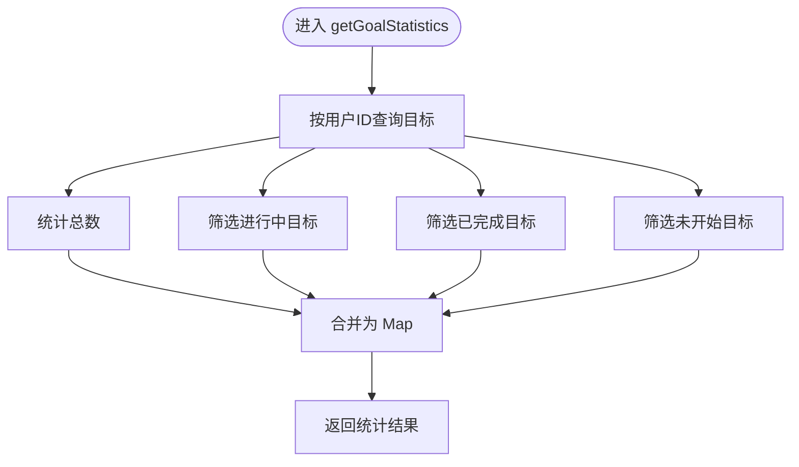
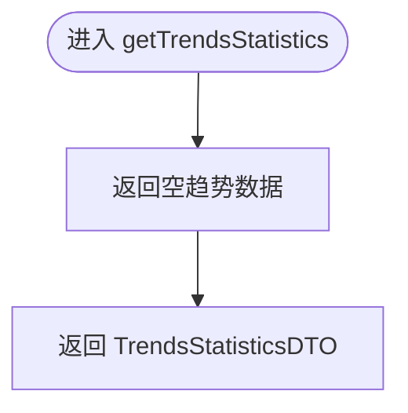
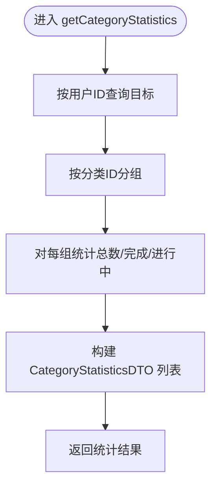
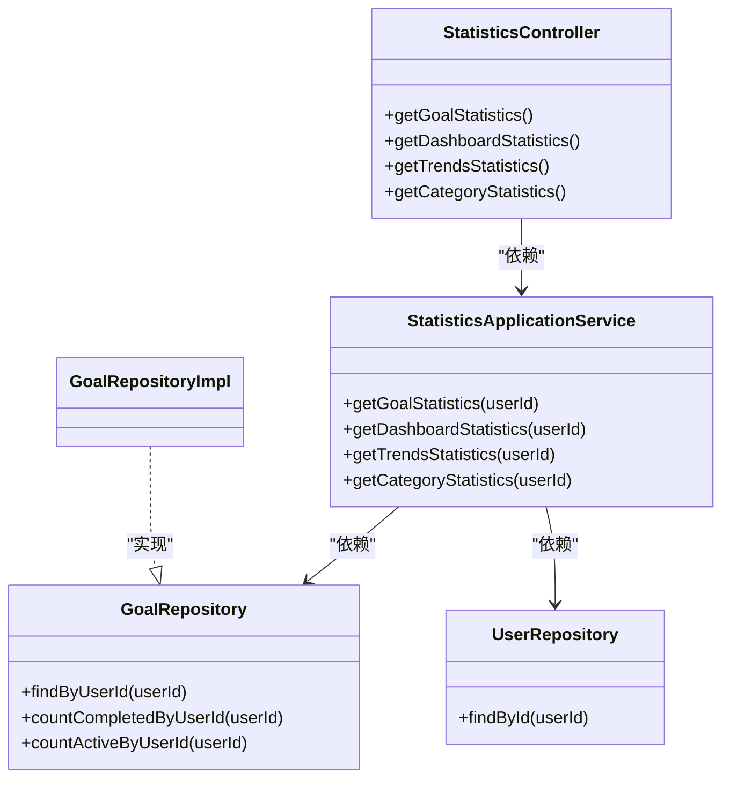

# 统计接口

<cite>
**本文引用的文件**
- [StatisticsController.java](file://src/main/java/com/crazydream/interfaces/statistics/StatisticsController.java)
- [StatisticsApplicationService.java](file://src/main/java/com/crazydream/application/statistics/service/StatisticsApplicationService.java)
- [DashboardStatisticsDTO.java](file://src/main/java/com/crazydream/application/statistics/dto/DashboardStatisticsDTO.java)
- [TrendsStatisticsDTO.java](file://src/main/java/com/crazydream/application/statistics/dto/TrendsStatisticsDTO.java)
- [CategoryStatisticsDTO.java](file://src/main/java/com/crazydream/application/statistics/dto/CategoryStatisticsDTO.java)
- [GoalRepository.java](file://src/main/java/com/crazydream/domain/goal/repository/GoalRepository.java)
- [UserRepository.java](file://src/main/java/com/crazydream/domain/user/repository/UserRepository.java)
- [GoalRepositoryImpl.java](file://src/main/java/com/crazydream/infrastructure/persistence/repository/GoalRepositoryImpl.java)
- [GoalStatus.java](file://src/main/java/com/crazydream/domain/goal/model/valueobject/GoalStatus.java)
- [application.yml](file://src/main/resources/application.yml)
- [api-documentation.md](file://api-documentation.md)
</cite>

## 目录
1. [简介](#简介)
2. [项目结构](#项目结构)
3. [核心组件](#核心组件)
4. [架构总览](#架构总览)
5. [详细组件分析](#详细组件分析)
6. [依赖关系分析](#依赖关系分析)
7. [性能考虑](#性能考虑)
8. [故障排查指南](#故障排查指南)
9. [结论](#结论)
10. [附录](#附录)

## 简介
本文件为统计模块的全面 API 接口文档，覆盖仪表盘统计、目标统计、趋势分析与分类统计等能力。文档详细说明各接口的请求与响应格式、数据计算逻辑、时间范围与聚合规则、图表数据格式化与前端展示建议，并给出缓存策略与性能优化建议。同时，结合现有实现，明确当前趋势统计的简化状态与后续可扩展方向。

## 项目结构
统计相关代码位于四层架构中的接口层与应用层，分别负责请求接入与业务编排；领域层提供目标与用户仓储接口，基础设施层提供仓储实现与数据库访问。

**图示来源**
- [StatisticsController.java](file://src/main/java/com/crazydream/interfaces/statistics/StatisticsController.java#L25-L135)
- [StatisticsApplicationService.java](file://src/main/java/com/crazydream/application/statistics/service/StatisticsApplicationService.java#L18-L106)
- [GoalRepository.java](file://src/main/java/com/crazydream/domain/goal/repository/GoalRepository.java#L18-L70)
- [UserRepository.java](file://src/main/java/com/crazydream/domain/user/repository/UserRepository.java#L9-L15)
- [GoalRepositoryImpl.java](file://src/main/java/com/crazydream/infrastructure/persistence/repository/GoalRepositoryImpl.java#L25-L112)
- [GoalStatus.java](file://src/main/java/com/crazydream/domain/goal/model/valueobject/GoalStatus.java#L10-L64)

**章节来源**
- [StatisticsController.java](file://src/main/java/com/crazydream/interfaces/statistics/StatisticsController.java#L1-L135)
- [StatisticsApplicationService.java](file://src/main/java/com/crazydream/application/statistics/service/StatisticsApplicationService.java#L1-L106)
- [GoalRepository.java](file://src/main/java/com/crazydream/domain/goal/repository/GoalRepository.java#L1-L70)
- [UserRepository.java](file://src/main/java/com/crazydream/domain/user/repository/UserRepository.java#L1-L15)
- [GoalRepositoryImpl.java](file://src/main/java/com/crazydream/infrastructure/persistence/repository/GoalRepositoryImpl.java#L1-L112)
- [GoalStatus.java](file://src/main/java/com/crazydream/domain/goal/model/valueobject/GoalStatus.java#L1-L64)

## 核心组件
- 统计控制器：提供四个统计接口，分别返回目标统计、仪表盘统计、趋势统计与分类统计。
- 统计应用服务：封装统计计算逻辑，调用仓储接口获取数据并组装 DTO。
- DTO 对象：定义仪表盘、趋势与分类统计的数据结构。
- 仓储接口与实现：提供按用户维度查询目标、统计完成数与活跃数等能力。

**章节来源**
- [StatisticsController.java](file://src/main/java/com/crazydream/interfaces/statistics/StatisticsController.java#L25-L135)
- [StatisticsApplicationService.java](file://src/main/java/com/crazydream/application/statistics/service/StatisticsApplicationService.java#L18-L106)
- [DashboardStatisticsDTO.java](file://src/main/java/com/crazydream/application/statistics/dto/DashboardStatisticsDTO.java#L1-L17)
- [TrendsStatisticsDTO.java](file://src/main/java/com/crazydream/application/statistics/dto/TrendsStatisticsDTO.java#L1-L17)
- [CategoryStatisticsDTO.java](file://src/main/java/com/crazydream/application/statistics/dto/CategoryStatisticsDTO.java#L1-L17)

## 架构总览
统计接口遵循 DDD + COLA 四层架构：
- 接口层：接收 HTTP 请求，解析用户身份，调用应用服务。
- 应用层：编排统计逻辑，组装 DTO。
- 领域层：定义仓储接口，约束查询契约。
- 基础设施层：实现仓储，连接数据库。

**图示来源**
- [StatisticsController.java](file://src/main/java/com/crazydream/interfaces/statistics/StatisticsController.java#L74-L101)
- [StatisticsApplicationService.java](file://src/main/java/com/crazydream/application/statistics/service/StatisticsApplicationService.java#L44-L55)
- [GoalRepository.java](file://src/main/java/com/crazydream/domain/goal/repository/GoalRepository.java#L30-L38)
- [UserRepository.java](file://src/main/java/com/crazydream/domain/user/repository/UserRepository.java#L10-L13)

## 详细组件分析

### 接口清单与规范
- 基础 URL：/api/v2/statistics
- 认证方式：Bearer Token（JWT），测试模式下可使用默认用户 ID
- 通用响应：统一由 ResponseResult 包装，包含 code、message、data

**章节来源**
- [api-documentation.md](file://api-documentation.md#L48-L78)
- [application.yml](file://src/main/resources/application.yml#L66-L75)
- [StatisticsController.java](file://src/main/java/com/crazydream/interfaces/statistics/StatisticsController.java#L26-L135)

### 仪表盘统计
- 接口：GET /api/v2/statistics/dashboard
- 功能：返回目标统计概览、用户标识与用户名
- 数据来源：目标统计 + 用户昵称
- 返回结构：DashboardStatisticsDTO（目标统计 Map、用户ID、用户名）

**图示来源**
- [StatisticsApplicationService.java](file://src/main/java/com/crazydream/application/statistics/service/StatisticsApplicationService.java#L44-L55)
- [GoalRepository.java](file://src/main/java/com/crazydream/domain/goal/repository/GoalRepository.java#L30-L38)
- [UserRepository.java](file://src/main/java/com/crazydream/domain/user/repository/UserRepository.java#L10-L13)

**章节来源**
- [StatisticsController.java](file://src/main/java/com/crazydream/interfaces/statistics/StatisticsController.java#L88-L101)
- [StatisticsApplicationService.java](file://src/main/java/com/crazydream/application/statistics/service/StatisticsApplicationService.java#L44-L55)
- [DashboardStatisticsDTO.java](file://src/main/java/com/crazydream/application/statistics/dto/DashboardStatisticsDTO.java#L12-L16)

### 目标统计
- 接口：GET /api/v2/statistics/goals
- 功能：返回目标总数、进行中、已完成、未开始的数量
- 数据来源：按用户过滤的目标集合
- 计算逻辑：基于目标状态枚举进行计数

**图示来源**
- [StatisticsApplicationService.java](file://src/main/java/com/crazydream/application/statistics/service/StatisticsApplicationService.java#L29-L39)
- [GoalStatus.java](file://src/main/java/com/crazydream/domain/goal/model/valueobject/GoalStatus.java#L10-L14)

**章节来源**
- [StatisticsController.java](file://src/main/java/com/crazydream/interfaces/statistics/StatisticsController.java#L71-L85)
- [StatisticsApplicationService.java](file://src/main/java/com/crazydream/application/statistics/service/StatisticsApplicationService.java#L29-L39)
- [GoalStatus.java](file://src/main/java/com/crazydream/domain/goal/model/valueobject/GoalStatus.java#L10-L14)

### 趋势统计
- 接口：GET /api/v2/statistics/trends
- 功能：返回时间序列的完成与进行中趋势数据
- 当前实现：返回空列表占位，未实现按时间聚合的统计逻辑
- 建议扩展：按日期分组统计目标完成与进行中数量，返回等长的日期与数值列表

**图示来源**
- [StatisticsApplicationService.java](file://src/main/java/com/crazydream/application/statistics/service/StatisticsApplicationService.java#L60-L68)
- [TrendsStatisticsDTO.java](file://src/main/java/com/crazydream/application/statistics/dto/TrendsStatisticsDTO.java#L12-L16)

**章节来源**
- [StatisticsController.java](file://src/main/java/com/crazydream/interfaces/statistics/StatisticsController.java#L103-L117)
- [StatisticsApplicationService.java](file://src/main/java/com/crazydream/application/statistics/service/StatisticsApplicationService.java#L60-L68)
- [TrendsStatisticsDTO.java](file://src/main/java/com/crazydream/application/statistics/dto/TrendsStatisticsDTO.java#L1-L17)

### 分类统计
- 接口：GET /api/v2/statistics/categories
- 功能：按分类统计目标总数、完成数与进行中数
- 数据来源：按用户过滤的目标集合，按分类 ID 分组
- 返回结构：CategoryStatisticsDTO 列表

**图示来源**
- [StatisticsApplicationService.java](file://src/main/java/com/crazydream/application/statistics/service/StatisticsApplicationService.java#L73-L104)

**章节来源**
- [StatisticsController.java](file://src/main/java/com/crazydream/interfaces/statistics/StatisticsController.java#L119-L133)
- [StatisticsApplicationService.java](file://src/main/java/com/crazydream/application/statistics/service/StatisticsApplicationService.java#L73-L104)
- [CategoryStatisticsDTO.java](file://src/main/java/com/crazydream/application/statistics/dto/CategoryStatisticsDTO.java#L10-L16)

### 数据结构与字段说明
- DashboardStatisticsDTO
  - goalStatistics: Map<String, Integer>，键为统计项（如 total、inProgress、completed、notStarted），值为对应数量
  - userId: Long，用户标识
  - username: String，用户昵称或默认名
- TrendsStatisticsDTO
  - dates: List<String>，日期字符串列表（建议 ISO-8601）
  - completed: List<Integer>，对应日期完成数
  - inProgress: List<Integer>，对应日期进行中数
- CategoryStatisticsDTO
  - categoryId: Long，分类标识
  - categoryName: String，分类名称
  - count: Integer，该分类目标总数
  - completed: Integer，该分类完成数
  - inProgress: Integer，该分类进行中数

**章节来源**
- [DashboardStatisticsDTO.java](file://src/main/java/com/crazydream/application/statistics/dto/DashboardStatisticsDTO.java#L12-L16)
- [TrendsStatisticsDTO.java](file://src/main/java/com/crazydream/application/statistics/dto/TrendsStatisticsDTO.java#L12-L16)
- [CategoryStatisticsDTO.java](file://src/main/java/com/crazydream/application/statistics/dto/CategoryStatisticsDTO.java#L10-L16)

### 时间范围筛选与数据聚合
- 当前实现
  - 仪表盘与目标统计：按用户维度直接聚合，未涉及时间范围筛选
  - 分类统计：按分类维度聚合，未涉及时间范围筛选
  - 趋势统计：当前为空数据，未实现时间序列聚合
- 建议规范
  - 时间范围参数：start_date、end_date（ISO-8601）
  - 聚合粒度：日、周、月（由前端选择，后端按日期聚合）
  - 趋势数据：返回等长的日期与数值列表，便于折线图渲染

[本节为规范建议，不直接分析具体文件，故无“章节来源”]

### 图表数据格式化与前端展示
- 折线图：趋势统计返回 dates 与 completed/inProgress 数值列表，前端按日期排序绘制
- 柱状图：分类统计返回分类名与 count/completed/inProgress，前端按分类分组显示
- 仪表盘：目标统计 Map 直接映射到卡片组件，展示关键指标

[本节为前端对接建议，不直接分析具体文件，故无“章节来源”]

### 统计缓存策略与性能优化
- 缓存策略
  - 仪表盘与目标统计：建议按用户 ID 缓存短期（如 5 分钟）缓存，热点命中高
  - 分类统计：按用户 ID + 分类维度缓存，减少重复分组统计
  - 趋势统计：按用户 ID + 时间范围缓存，避免重复聚合
- 性能优化
  - 数据库层面：为目标查询添加用户索引与状态索引，提升过滤效率
  - 应用层面：批量查询目标，避免 N+1 查询；使用流式聚合减少中间对象
  - 缓存层面：采用本地缓存 + 远程缓存（Redis）双层缓存，降低数据库压力

[本节为通用优化建议，不直接分析具体文件，故无“章节来源”]

## 依赖关系分析
统计应用服务依赖仓储接口，控制器依赖应用服务；仓储实现依赖数据库映射层。

**图示来源**
- [StatisticsController.java](file://src/main/java/com/crazydream/interfaces/statistics/StatisticsController.java#L25-L135)
- [StatisticsApplicationService.java](file://src/main/java/com/crazydream/application/statistics/service/StatisticsApplicationService.java#L18-L106)
- [GoalRepository.java](file://src/main/java/com/crazydream/domain/goal/repository/GoalRepository.java#L18-L70)
- [UserRepository.java](file://src/main/java/com/crazydream/domain/user/repository/UserRepository.java#L9-L15)
- [GoalRepositoryImpl.java](file://src/main/java/com/crazydream/infrastructure/persistence/repository/GoalRepositoryImpl.java#L25-L112)

**章节来源**
- [StatisticsController.java](file://src/main/java/com/crazydream/interfaces/statistics/StatisticsController.java#L25-L135)
- [StatisticsApplicationService.java](file://src/main/java/com/crazydream/application/statistics/service/StatisticsApplicationService.java#L18-L106)
- [GoalRepository.java](file://src/main/java/com/crazydream/domain/goal/repository/GoalRepository.java#L18-L70)
- [UserRepository.java](file://src/main/java/com/crazydream/domain/user/repository/UserRepository.java#L9-L15)
- [GoalRepositoryImpl.java](file://src/main/java/com/crazydream/infrastructure/persistence/repository/GoalRepositoryImpl.java#L25-L112)

## 性能考虑
- 统计接口通常为读多写少场景，适合缓存与批量查询
- 当前实现未引入缓存，建议在应用层增加缓存注解或手动缓存策略
- 数据库查询建议使用索引覆盖，避免全表扫描
- 对于大规模用户，建议分页或异步任务生成统计快照，定时刷新

[本节提供通用指导，不直接分析具体文件，故无“章节来源”]

## 故障排查指南
- 未认证或匿名访问
  - 现象：使用默认用户 ID 处理请求
  - 处理：确保携带有效 JWT Token 或在测试环境正确配置默认用户 ID
- 统计结果为空
  - 现象：目标统计、分类统计返回空或零
  - 处理：确认用户存在目标数据；检查目标状态是否正确
- 趋势统计为空
  - 现象：趋势接口返回空列表
  - 处理：当前实现为占位，需扩展按时间聚合逻辑
- 日志定位
  - 控制器与应用服务均包含日志记录，可通过日志定位异常

**章节来源**
- [application.yml](file://src/main/resources/application.yml#L66-L75)
- [StatisticsController.java](file://src/main/java/com/crazydream/interfaces/statistics/StatisticsController.java#L38-L69)
- [StatisticsApplicationService.java](file://src/main/java/com/crazydream/application/statistics/service/StatisticsApplicationService.java#L26-L68)

## 结论
统计模块提供了基础的仪表盘、目标与分类统计能力，接口简洁、职责清晰。趋势统计目前为占位实现，建议后续按时间范围与粒度扩展聚合逻辑。配合缓存与数据库索引优化，可在保证实时性的前提下提升整体性能与用户体验。

[本节为总结，不直接分析具体文件，故无“章节来源”]

## 附录

### 接口一览表
- GET /api/v2/statistics/dashboard
  - 功能：仪表盘统计
  - 返回：DashboardStatisticsDTO
- GET /api/v2/statistics/goals
  - 功能：目标统计
  - 返回：Map<String, Integer>
- GET /api/v2/statistics/trends
  - 功能：趋势统计（当前为空）
  - 返回：TrendsStatisticsDTO
- GET /api/v2/statistics/categories
  - 功能：分类统计
  - 返回：List<CategoryStatisticsDTO>

**章节来源**
- [StatisticsController.java](file://src/main/java/com/crazydream/interfaces/statistics/StatisticsController.java#L74-L133)