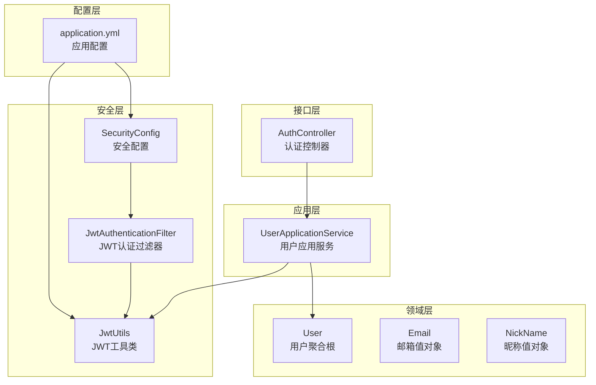
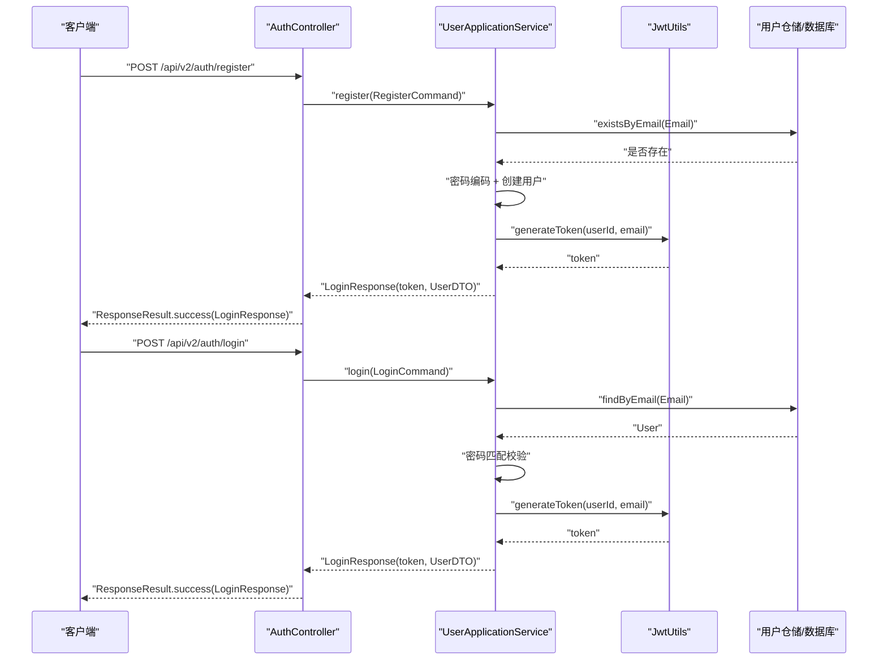
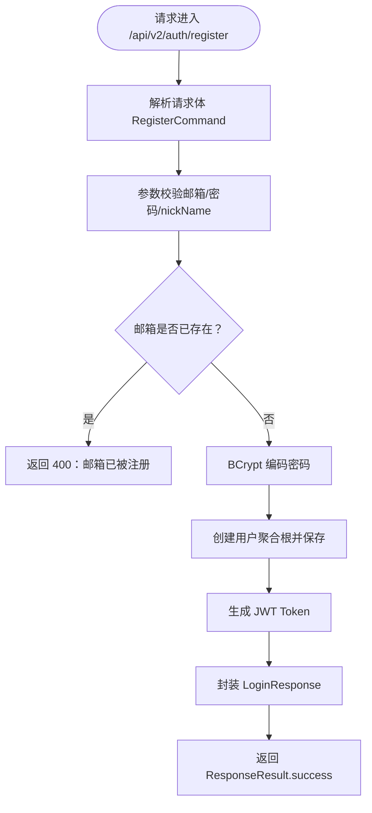
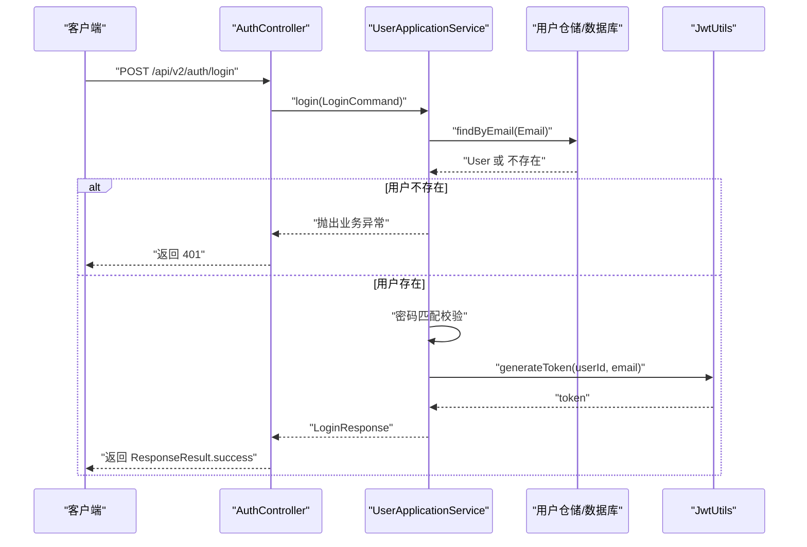
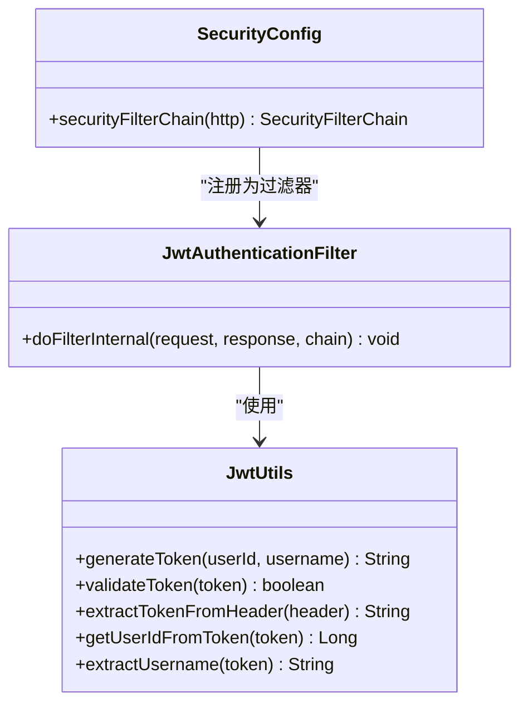
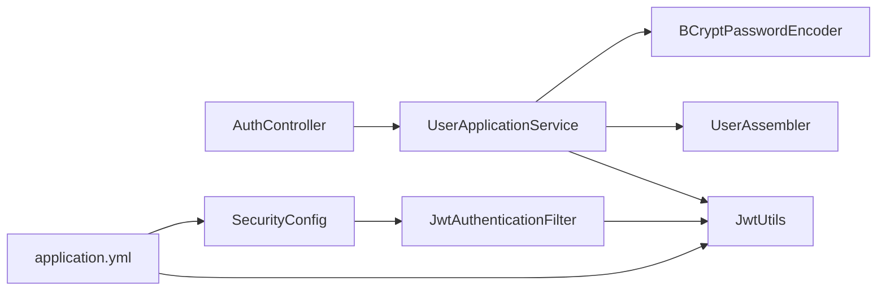

# 认证接口

<cite>
**本文引用的文件**
- [AuthController.java](file://src/main/java/com/crazydream/interfaces/auth/AuthController.java)
- [UserApplicationService.java](file://src/main/java/com/crazydream/application/user/service/UserApplicationService.java)
- [RegisterCommand.java](file://src/main/java/com/crazydream/application/user/dto/RegisterCommand.java)
- [LoginCommand.java](file://src/main/java/com/crazydream/application/user/dto/LoginCommand.java)
- [LoginResponse.java](file://src/main/java/com/crazydream/application/user/dto/LoginResponse.java)
- [UserDTO.java](file://src/main/java/com/crazydream/application/user/dto/UserDTO.java)
- [UserAssembler.java](file://src/main/java/com/crazydream/application/user/assembler/UserAssembler.java)
- [JwtUtils.java](file://src/main/java/com/crazydream/utils/JwtUtils.java)
- [JwtAuthenticationFilter.java](file://src/main/java/com/crazydream/security/JwtAuthenticationFilter.java)
- [SecurityConfig.java](file://src/main/java/com/crazydream/security/SecurityConfig.java)
- [application.yml](file://src/main/resources/application.yml)
- [ResponseResult.java](file://src/main/java/com/crazydream/utils/ResponseResult.java)
- [ApiResponse.java](file://src/main/java/com/crazydream/common/ApiResponse.java)
- [GlobalExceptionHandler.java](file://src/main/java/com/crazydream/config/GlobalExceptionHandler.java)
</cite>

## 目录
1. [简介](#简介)
2. [项目结构](#项目结构)
3. [核心组件](#核心组件)
4. [架构总览](#架构总览)
5. [详细组件分析](#详细组件分析)
6. [依赖关系分析](#依赖关系分析)
7. [性能与安全考虑](#性能与安全考虑)
8. [故障排查指南](#故障排查指南)
9. [结论](#结论)
10. [附录](#附录)

## 简介
本文件为认证模块的详细 API 接口文档，聚焦用户注册与登录两大核心接口，涵盖：
- 请求参数校验与响应格式
- JWT 认证机制与 Token 生命周期
- 注册流程中的邮箱唯一性校验与密码加密策略
- 登录流程中的邮箱/密码验证与 Token 生成
- 认证中间件的使用方式与 Token 有效期管理
- 常见错误场景与处理建议

## 项目结构
认证相关代码采用分层架构组织，主要涉及接口层、应用层、领域层与基础设施层：
- 接口层：认证控制器负责接收请求、调用应用服务并返回统一封装的响应
- 应用层：用户应用服务编排业务逻辑，包括注册、登录、用户信息查询与更新
- 领域层：用户聚合根与值对象承载业务规则（如密码匹配、等级升级等）
- 安全层：JWT 工具类、JWT 过滤器与安全配置共同完成 Token 的签发、解析与校验
- 配置层：应用配置文件集中管理 JWT 密钥、过期时间、安全开关等

图表来源
- [AuthController.java](file://src/main/java/com/crazydream/interfaces/auth/AuthController.java#L17-L61)
- [UserApplicationService.java](file://src/main/java/com/crazydream/application/user/service/UserApplicationService.java#L15-L97)
- [JwtUtils.java](file://src/main/java/com/crazydream/utils/JwtUtils.java#L29-L164)
- [JwtAuthenticationFilter.java](file://src/main/java/com/crazydream/security/JwtAuthenticationFilter.java#L29-L128)
- [SecurityConfig.java](file://src/main/java/com/crazydream/security/SecurityConfig.java#L32-L104)
- [application.yml](file://src/main/resources/application.yml#L57-L75)

章节来源
- [AuthController.java](file://src/main/java/com/crazydream/interfaces/auth/AuthController.java#L17-L61)
- [UserApplicationService.java](file://src/main/java/com/crazydream/application/user/service/UserApplicationService.java#L15-L97)
- [JwtUtils.java](file://src/main/java/com/crazydream/utils/JwtUtils.java#L29-L164)
- [JwtAuthenticationFilter.java](file://src/main/java/com/crazydream/security/JwtAuthenticationFilter.java#L29-L128)
- [SecurityConfig.java](file://src/main/java/com/crazydream/security/SecurityConfig.java#L32-L104)
- [application.yml](file://src/main/resources/application.yml#L57-L75)

## 核心组件
- 认证控制器：提供注册与登录两个端点，负责接收请求体、调用应用服务并返回统一封装响应
- 用户应用服务：实现注册与登录的核心业务逻辑，包括邮箱唯一性校验、密码编码与匹配、Token 生成与返回用户信息
- DTO 与装配器：封装请求参数与响应数据，并在应用层与领域层之间进行转换
- JWT 工具类：负责 Token 的生成、解析、校验与头部提取
- 安全配置与过滤器：配置无状态会话、CORS、放行登录/注册接口，并在请求进入时解析 Token 并设置认证上下文
- 统一响应与异常处理：对控制器与全局异常进行统一响应封装与状态码映射

章节来源
- [AuthController.java](file://src/main/java/com/crazydream/interfaces/auth/AuthController.java#L17-L61)
- [UserApplicationService.java](file://src/main/java/com/crazydream/application/user/service/UserApplicationService.java#L15-L97)
- [RegisterCommand.java](file://src/main/java/com/crazydream/application/user/dto/RegisterCommand.java#L6-L10)
- [LoginCommand.java](file://src/main/java/com/crazydream/application/user/dto/LoginCommand.java#L6-L9)
- [LoginResponse.java](file://src/main/java/com/crazydream/application/user/dto/LoginResponse.java#L8-L11)
- [UserDTO.java](file://src/main/java/com/crazydream/application/user/dto/UserDTO.java#L7-L17)
- [UserAssembler.java](file://src/main/java/com/crazydream/application/user/assembler/UserAssembler.java#L7-L34)
- [JwtUtils.java](file://src/main/java/com/crazydream/utils/JwtUtils.java#L29-L164)
- [JwtAuthenticationFilter.java](file://src/main/java/com/crazydream/security/JwtAuthenticationFilter.java#L29-L128)
- [SecurityConfig.java](file://src/main/java/com/crazydream/security/SecurityConfig.java#L32-L104)
- [ResponseResult.java](file://src/main/java/com/crazydream/utils/ResponseResult.java#L14-L148)
- [GlobalExceptionHandler.java](file://src/main/java/com/crazydream/config/GlobalExceptionHandler.java#L14-L60)

## 架构总览
认证流程由“接口层 → 应用层 → 领域层/仓储 → 安全层”构成，关键交互如下：
- 控制器接收请求，调用应用服务
- 应用服务执行业务规则（邮箱唯一性、密码匹配、Token 生成），并返回 DTO
- 安全配置与过滤器确保登录/注册接口免认证，其他接口需携带有效 Token

图表来源
- [AuthController.java](file://src/main/java/com/crazydream/interfaces/auth/AuthController.java#L29-L60)
- [UserApplicationService.java](file://src/main/java/com/crazydream/application/user/service/UserApplicationService.java#L27-L59)
- [JwtUtils.java](file://src/main/java/com/crazydream/utils/JwtUtils.java#L57-L76)
- [application.yml](file://src/main/resources/application.yml#L57-L63)

## 详细组件分析

### 注册接口
- 接口地址：POST /api/v2/auth/register
- 请求体参数：
  - email：字符串，必填
  - password：字符串，必填
  - nickName：字符串，必填
- 业务流程：
  - 参数校验：由应用服务在构建邮箱值对象时触发（若存在更严格的参数校验可在此处扩展）
  - 邮箱唯一性：查询用户仓储确认邮箱未被注册
  - 密码加密：使用 BCrypt 编码存储
  - 用户创建：通过装配器将命令对象转换为领域模型并保存
  - Token 生成：使用 JWT 工具类生成 Token，包含用户 ID 与邮箱
  - 返回：LoginResponse，包含 token 与 UserDTO
- 响应格式：ResponseResult<LoginResponse>
- 错误处理：
  - 邮箱已存在：返回 400
  - 其他业务异常：返回 500
  - 控制器层异常：返回 500

图表来源
- [UserApplicationService.java](file://src/main/java/com/crazydream/application/user/service/UserApplicationService.java#L27-L43)
- [RegisterCommand.java](file://src/main/java/com/crazydream/application/user/dto/RegisterCommand.java#L6-L10)
- [UserAssembler.java](file://src/main/java/com/crazydream/application/user/assembler/UserAssembler.java#L9-L15)
- [JwtUtils.java](file://src/main/java/com/crazydream/utils/JwtUtils.java#L57-L76)

章节来源
- [AuthController.java](file://src/main/java/com/crazydream/interfaces/auth/AuthController.java#L29-L42)
- [UserApplicationService.java](file://src/main/java/com/crazydream/application/user/service/UserApplicationService.java#L27-L43)
- [RegisterCommand.java](file://src/main/java/com/crazydream/application/user/dto/RegisterCommand.java#L6-L10)
- [UserAssembler.java](file://src/main/java/com/crazydream/application/user/assembler/UserAssembler.java#L9-L15)
- [JwtUtils.java](file://src/main/java/com/crazydream/utils/JwtUtils.java#L57-L76)
- [ResponseResult.java](file://src/main/java/com/crazydream/utils/ResponseResult.java#L51-L89)

### 登录接口
- 接口地址：POST /api/v2/auth/login
- 请求体参数：
  - email：字符串，必填
  - password：字符串，必填
- 业务流程：
  - 查询用户：按邮箱查找用户
  - 密码匹配：使用 BCrypt 匹配输入密码与存储密码
  - Token 生成：使用 JWT 工具类生成 Token
  - 返回：LoginResponse，包含 token 与 UserDTO
- 响应格式：ResponseResult<LoginResponse>
- 错误处理：
  - 邮箱或密码错误：返回 401
  - 其他业务异常：返回 500

图表来源
- [AuthController.java](file://src/main/java/com/crazydream/interfaces/auth/AuthController.java#L47-L60)
- [UserApplicationService.java](file://src/main/java/com/crazydream/application/user/service/UserApplicationService.java#L45-L59)
- [JwtUtils.java](file://src/main/java/com/crazydream/utils/JwtUtils.java#L57-L76)

章节来源
- [AuthController.java](file://src/main/java/com/crazydream/interfaces/auth/AuthController.java#L47-L60)
- [UserApplicationService.java](file://src/main/java/com/crazydream/application/user/service/UserApplicationService.java#L45-L59)
- [LoginCommand.java](file://src/main/java/com/crazydream/application/user/dto/LoginCommand.java#L6-L9)
- [JwtUtils.java](file://src/main/java/com/crazydream/utils/JwtUtils.java#L57-L76)
- [ResponseResult.java](file://src/main/java/com/crazydream/utils/ResponseResult.java#L96-L120)

### JWT 认证机制与 Token 管理
- Token 生成：包含用户 ID 与邮箱，签名算法为 HS256，过期时间由配置项控制
- Token 校验：过滤器从 Authorization 头中提取 Token，验证签名与过期时间
- 认证上下文：校验通过后将用户认证信息写入 Spring Security 上下文
- 有效期管理：过期时间由配置项控制，默认单位为秒
- 安全配置：生产模式下除登录/注册与健康检查外均需认证；测试模式可禁用安全并设置默认用户

图表来源
- [JwtUtils.java](file://src/main/java/com/crazydream/utils/JwtUtils.java#L29-L164)
- [JwtAuthenticationFilter.java](file://src/main/java/com/crazydream/security/JwtAuthenticationFilter.java#L29-L128)
- [SecurityConfig.java](file://src/main/java/com/crazydream/security/SecurityConfig.java#L32-L104)

章节来源
- [JwtUtils.java](file://src/main/java/com/crazydream/utils/JwtUtils.java#L34-L164)
- [JwtAuthenticationFilter.java](file://src/main/java/com/crazydream/security/JwtAuthenticationFilter.java#L48-L127)
- [SecurityConfig.java](file://src/main/java/com/crazydream/security/SecurityConfig.java#L54-L91)
- [application.yml](file://src/main/resources/application.yml#L57-L63)

### 统一响应与错误处理
- 统一响应：ResponseResult 封装 code、message、data，并根据 code 映射 HTTP 状态码
- 控制器层：AuthController 对业务异常进行分类处理（400/401/500）
- 全局异常：GlobalExceptionHandler 对 SQL 异常、404、运行时异常进行统一处理

章节来源
- [ResponseResult.java](file://src/main/java/com/crazydream/utils/ResponseResult.java#L14-L148)
- [AuthController.java](file://src/main/java/com/crazydream/interfaces/auth/AuthController.java#L30-L60)
- [GlobalExceptionHandler.java](file://src/main/java/com/crazydream/config/GlobalExceptionHandler.java#L14-L60)

## 依赖关系分析
- 控制器依赖应用服务与统一响应工具
- 应用服务依赖仓储、装配器、密码编码器与 JWT 工具类
- 安全配置依赖 JWT 过滤器与密码编码器
- JWT 工具类依赖配置文件中的密钥、过期时间与头部前缀

图表来源
- [AuthController.java](file://src/main/java/com/crazydream/interfaces/auth/AuthController.java#L17-L61)
- [UserApplicationService.java](file://src/main/java/com/crazydream/application/user/service/UserApplicationService.java#L15-L97)
- [UserAssembler.java](file://src/main/java/com/crazydream/application/user/assembler/UserAssembler.java#L7-L34)
- [JwtUtils.java](file://src/main/java/com/crazydream/utils/JwtUtils.java#L29-L164)
- [JwtAuthenticationFilter.java](file://src/main/java/com/crazydream/security/JwtAuthenticationFilter.java#L29-L128)
- [SecurityConfig.java](file://src/main/java/com/crazydream/security/SecurityConfig.java#L32-L104)
- [application.yml](file://src/main/resources/application.yml#L57-L75)

章节来源
- [AuthController.java](file://src/main/java/com/crazydream/interfaces/auth/AuthController.java#L17-L61)
- [UserApplicationService.java](file://src/main/java/com/crazydream/application/user/service/UserApplicationService.java#L15-L97)
- [UserAssembler.java](file://src/main/java/com/crazydream/application/user/assembler/UserAssembler.java#L7-L34)
- [JwtUtils.java](file://src/main/java/com/crazydream/utils/JwtUtils.java#L29-L164)
- [JwtAuthenticationFilter.java](file://src/main/java/com/crazydream/security/JwtAuthenticationFilter.java#L29-L128)
- [SecurityConfig.java](file://src/main/java/com/crazydream/security/SecurityConfig.java#L32-L104)
- [application.yml](file://src/main/resources/application.yml#L57-L75)

## 性能与安全考虑
- 无状态会话：通过配置 SessionCreationPolicy.STATELESS，避免会话开销
- 密码安全：使用 BCrypt 进行密码编码与匹配，降低密码泄露风险
- Token 过期：合理设置过期时间，建议结合刷新 Token 策略（当前实现未包含刷新接口）
- CORS 放行：允许跨域访问，注意生产环境限制具体来源
- 测试模式：可通过配置禁用安全认证，便于本地联调，但不应在生产启用

章节来源
- [SecurityConfig.java](file://src/main/java/com/crazydream/security/SecurityConfig.java#L54-L91)
- [application.yml](file://src/main/resources/application.yml#L57-L75)

## 故障排查指南
- 注册失败（400）：邮箱已被注册
  - 检查邮箱唯一性约束与仓储实现
  - 参考：[UserApplicationService.java](file://src/main/java/com/crazydream/application/user/service/UserApplicationService.java#L31-L33)
- 登录失败（401）：邮箱或密码错误
  - 确认邮箱存在与密码匹配逻辑
  - 参考：[UserApplicationService.java](file://src/main/java/com/crazydream/application/user/service/UserApplicationService.java#L48-L53)
- Token 无效或过期
  - 检查 JWT 密钥、过期时间与头部前缀配置
  - 参考：[JwtUtils.java](file://src/main/java/com/crazydream/utils/JwtUtils.java#L113-L125)，[application.yml](file://src/main/resources/application.yml#L57-L63)
- 认证失败（401/403）
  - 确认请求头 Authorization 格式与过滤器放行规则
  - 参考：[JwtAuthenticationFilter.java](file://src/main/java/com/crazydream/security/JwtAuthenticationFilter.java#L56-L63)，[SecurityConfig.java](file://src/main/java/com/crazydream/security/SecurityConfig.java#L76-L84)
- 全局异常（500）
  - 查看日志定位具体异常类型并修复
  - 参考：[GlobalExceptionHandler.java](file://src/main/java/com/crazydream/config/GlobalExceptionHandler.java#L54-L59)

章节来源
- [UserApplicationService.java](file://src/main/java/com/crazydream/application/user/service/UserApplicationService.java#L31-L53)
- [JwtUtils.java](file://src/main/java/com/crazydream/utils/JwtUtils.java#L113-L125)
- [JwtAuthenticationFilter.java](file://src/main/java/com/crazydream/security/JwtAuthenticationFilter.java#L56-L63)
- [SecurityConfig.java](file://src/main/java/com/crazydream/security/SecurityConfig.java#L76-L84)
- [GlobalExceptionHandler.java](file://src/main/java/com/crazydream/config/GlobalExceptionHandler.java#L54-L59)

## 结论
本认证模块提供了清晰的注册与登录接口，结合 JWT 无状态认证与统一响应封装，具备良好的可维护性与扩展性。建议后续补充密码强度校验、Token 刷新机制与更细粒度的权限控制，以进一步提升安全性与用户体验。

## 附录

### 接口清单与规范
- 注册
  - 方法：POST
  - 路径：/api/v2/auth/register
  - 请求体：RegisterCommand
  - 响应：ResponseResult<LoginResponse>
  - 状态码：200 成功；400 邮箱已存在；500 服务器错误
- 登录
  - 方法：POST
  - 路径：/api/v2/auth/login
  - 请求体：LoginCommand
  - 响应：ResponseResult<LoginResponse>
  - 状态码：200 成功；401 邮箱或密码错误；500 服务器错误

章节来源
- [AuthController.java](file://src/main/java/com/crazydream/interfaces/auth/AuthController.java#L29-L60)
- [RegisterCommand.java](file://src/main/java/com/crazydream/application/user/dto/RegisterCommand.java#L6-L10)
- [LoginCommand.java](file://src/main/java/com/crazydream/application/user/dto/LoginCommand.java#L6-L9)
- [LoginResponse.java](file://src/main/java/com/crazydream/application/user/dto/LoginResponse.java#L8-L11)
- [ResponseResult.java](file://src/main/java/com/crazydream/utils/ResponseResult.java#L96-L120)

### 请求与响应示例（路径引用）
- 注册请求示例
  - 请求体：RegisterCommand
  - 参考：[RegisterCommand.java](file://src/main/java/com/crazydream/application/user/dto/RegisterCommand.java#L6-L10)
- 登录请求示例
  - 请求体：LoginCommand
  - 参考：[LoginCommand.java](file://src/main/java/com/crazydream/application/user/dto/LoginCommand.java#L6-L9)
- 登录响应示例
  - 响应体：LoginResponse（包含 token 与 UserDTO）
  - 参考：[LoginResponse.java](file://src/main/java/com/crazydream/application/user/dto/LoginResponse.java#L8-L11)，[UserDTO.java](file://src/main/java/com/crazydream/application/user/dto/UserDTO.java#L7-L17)

### 认证中间件使用说明
- 放行规则：登录/注册接口（含 v1 与 v2 路径）无需认证
- 认证规则：其他接口需携带有效 Token（Authorization 头，格式为“Bearer {token}”）
- 测试模式：可禁用安全认证并设置默认用户 ID，便于本地调试
- 参考：
  - [SecurityConfig.java](file://src/main/java/com/crazydream/security/SecurityConfig.java#L76-L84)
  - [JwtAuthenticationFilter.java](file://src/main/java/com/crazydream/security/JwtAuthenticationFilter.java#L56-L63)
  - [application.yml](file://src/main/resources/application.yml#L65-L75)

### Token 有效期管理
- 配置项：jwt.expiration（秒）
- 默认值：86400（24 小时）
- 建议：结合刷新 Token 策略，避免长期持有高权限 Token
- 参考：[application.yml](file://src/main/resources/application.yml#L61)，[JwtUtils.java](file://src/main/java/com/crazydream/utils/JwtUtils.java#L64)