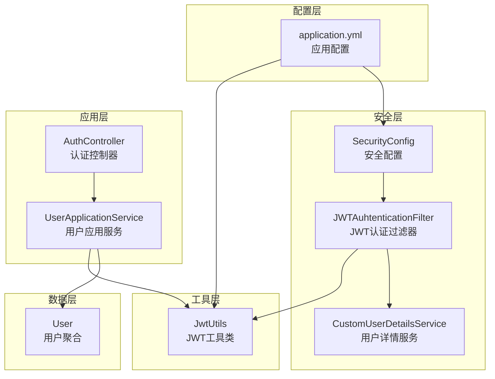
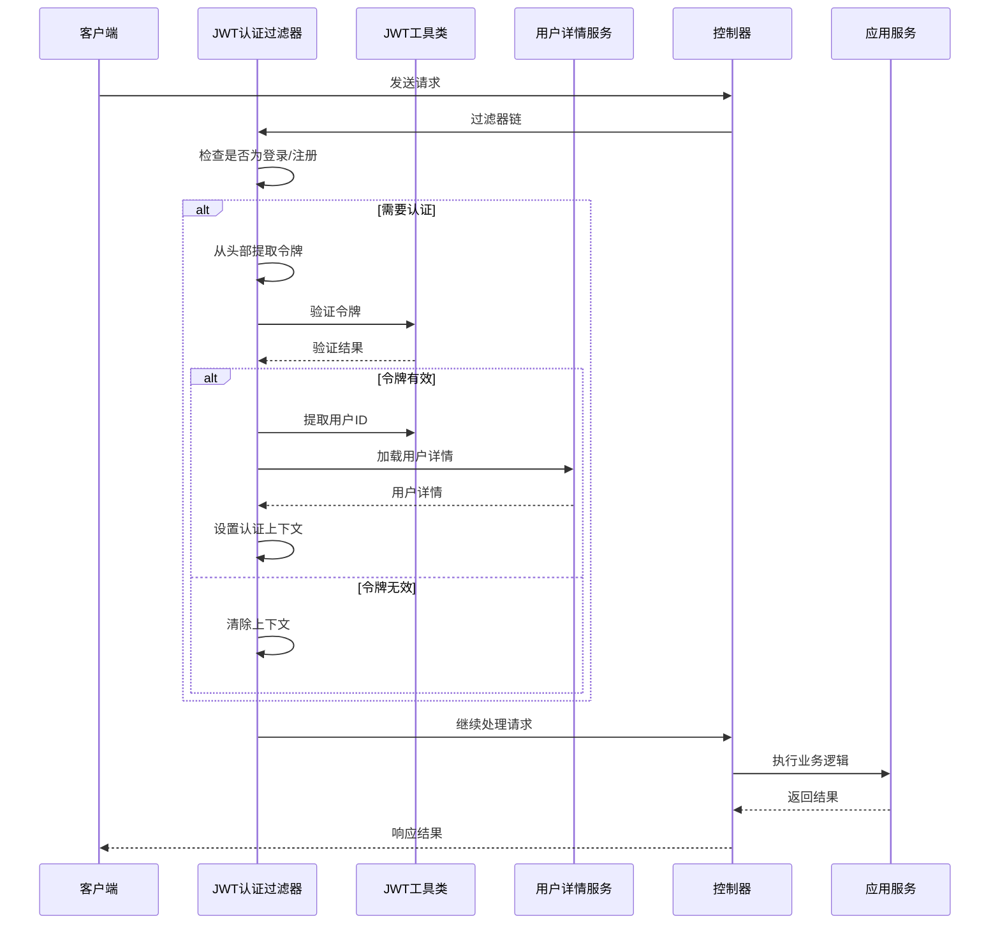
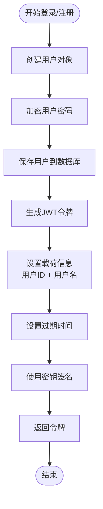
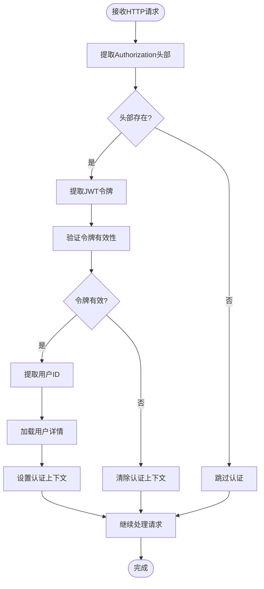
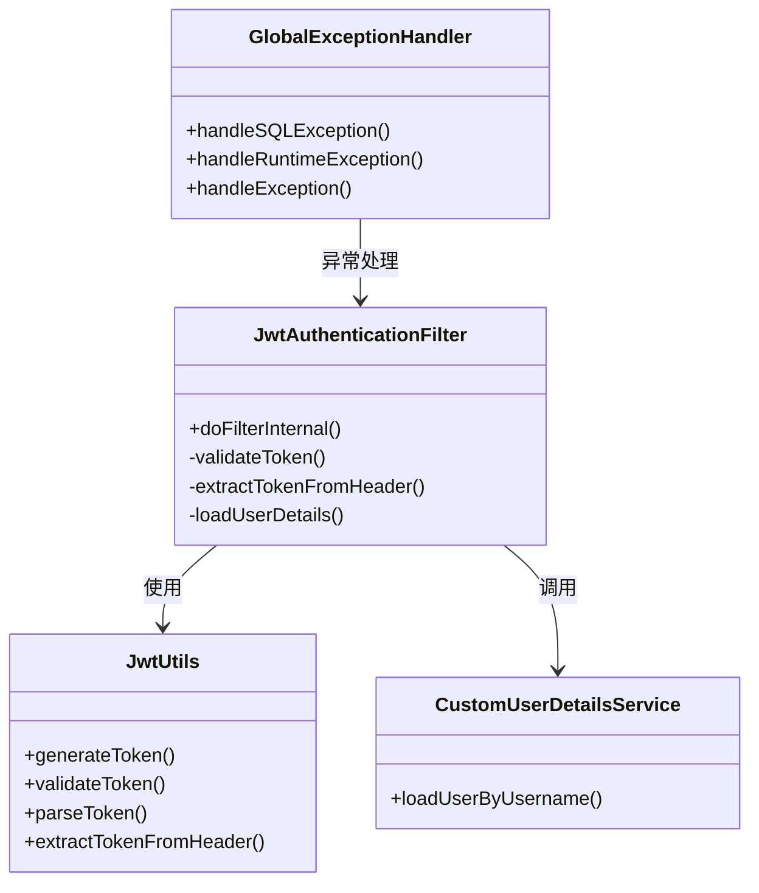
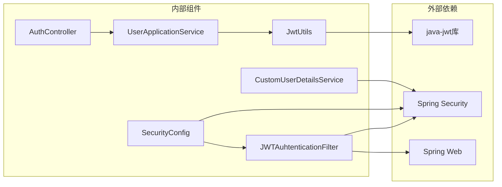

# JWT 认证机制

<cite>
**本文档引用的文件**
- [JwtAuthenticationFilter.java](file://src/main/java/com/crazydream/security/JwtAuthenticationFilter.java)
- [JwtUtils.java](file://src/main/java/com/crazydream/utils/JwtUtils.java)
- [SecurityConfig.java](file://src/main/java/com/crazydream/security/SecurityConfig.java)
- [CustomUserDetailsService.java](file://src/main/java/com/crazydream/security/CustomUserDetailsService.java)
- [application.yml](file://src/main/resources/application.yml)
- [AuthController.java](file://src/main/java/com/crazydream/interfaces/auth/AuthController.java)
- [UserApplicationService.java](file://src/main/java/com/crazydream/application/user/service/UserApplicationService.java)
- [LoginResponse.java](file://src/main/java/com/crazydream/application/user/dto/LoginResponse.java)
- [ResponseResult.java](file://src/main/java/com/crazydream/utils/ResponseResult.java)
- [GlobalExceptionHandler.java](file://src/main/java/com/crazydream/config/GlobalExceptionHandler.java)
- [User.java](file://src/main/java/com/crazydream/domain/user/model/aggregate/User.java)
</cite>

## 目录
1. [简介](#简介)
2. [项目结构](#项目结构)
3. [核心组件](#核心组件)
4. [架构概览](#架构概览)
5. [详细组件分析](#详细组件分析)
6. [依赖关系分析](#依赖关系分析)
7. [性能考虑](#性能考虑)
8. [故障排除指南](#故障排除指南)
9. [结论](#结论)

## 简介

本项目实现了基于 JWT（JSON Web Token）的无状态认证机制，采用 Spring Security 进行安全控制。JWT 认证机制通过在请求头中携带令牌来实现用户身份验证，支持令牌生成、验证和测试环境下的特殊处理。

该认证系统具有以下特点：
- 无状态设计，适合微服务架构
- 支持测试环境的特殊配置
- 完整的日志记录和错误处理机制
- 基于 Spring Security 的细粒度权限控制

## 项目结构

JWT 认证机制涉及以下关键模块：



**图表来源**
- [SecurityConfig.java](file://src/main/java/com/crazydream/security/SecurityConfig.java#L32-L91)
- [JwtAuthenticationFilter.java](file://src/main/java/com/crazydream/security/JwtAuthenticationFilter.java#L30-L127)
- [JwtUtils.java](file://src/main/java/com/crazydream/utils/JwtUtils.java#L30-L165)

**章节来源**
- [SecurityConfig.java](file://src/main/java/com/crazydream/security/SecurityConfig.java#L32-L91)
- [JwtAuthenticationFilter.java](file://src/main/java/com/crazydream/security/JwtAuthenticationFilter.java#L30-L127)
- [JwtUtils.java](file://src/main/java/com/crazydream/utils/JwtUtils.java#L30-L165)

## 核心组件

### JWT 工具类 (JwtUtils)

JwtUtils 是整个 JWT 认证系统的核心工具类，负责令牌的生成、解析和验证。

**主要功能**：
- 令牌生成：包含用户ID和用户名的载荷
- 令牌解析：从令牌中提取用户信息
- 令牌验证：验证令牌的有效性和完整性
- 头部处理：从 HTTP 请求头中提取 JWT 令牌

**配置参数**：
- `jwt.secret`：JWT 密钥，用于签名验证
- `jwt.expiration`：令牌过期时间（秒）
- `jwt.header`：HTTP 请求头名称，默认为 "Authorization"
- `jwt.prefix`：令牌前缀，默认为 "Bearer "

**章节来源**
- [JwtUtils.java](file://src/main/java/com/crazydream/utils/JwtUtils.java#L30-L165)
- [application.yml](file://src/main/resources/application.yml#L57-L63)

### JWT 认证过滤器 (JwtAuthenticationFilter)

JwtAuthenticationFilter 是 Spring Security 的过滤器，负责拦截每个 HTTP 请求并进行 JWT 验证。

**工作流程**：
1. 忽略登录和注册接口的验证
2. 从 Authorization 头部提取 JWT 令牌
3. 验证令牌的有效性
4. 从令牌中提取用户ID并加载用户详情
5. 在 Spring Security 上下文中设置认证信息

**测试模式支持**：
- 当 `security.auth.disabled` 为 true 时，所有请求都允许通过
- 使用 `security.test.default-user-id` 作为默认测试用户

**章节来源**
- [JwtAuthenticationFilter.java](file://src/main/java/com/crazydream/security/JwtAuthenticationFilter.java#L30-L127)

### 安全配置 (SecurityConfig)

SecurityConfig 配置了整个 Spring Security 的安全策略。

**主要配置**：
- CSRF 保护禁用（API 通常不需要 CSRF 保护）
- CORS 配置支持跨域请求
- 无状态会话管理（STATELESS）
- 动态认证规则（根据配置启用或禁用安全）

**认证规则**：
- 登录和注册接口无需认证
- 健康检查接口无需认证
- 其他所有接口都需要认证

**章节来源**
- [SecurityConfig.java](file://src/main/java/com/crazydream/security/SecurityConfig.java#L32-L91)

### 自定义用户详情服务 (CustomUserDetailsService)

CustomUserDetailsService 实现了 Spring Security 的 UserDetailsService 接口，负责从数据库加载用户信息。

**功能特性**：
- 从用户ID加载用户详情
- 返回标准的 UserDetails 对象
- 处理用户不存在的情况

**章节来源**
- [CustomUserDetailsService.java](file://src/main/java/com/crazydream/security/CustomUserDetailsService.java#L24-L62)

## 架构概览

JWT 认证系统的整体架构如下：



**图表来源**
- [JwtAuthenticationFilter.java](file://src/main/java/com/crazydream/security/JwtAuthenticationFilter.java#L48-L127)
- [JwtUtils.java](file://src/main/java/com/crazydream/utils/JwtUtils.java#L113-L138)
- [CustomUserDetailsService.java](file://src/main/java/com/crazydream/security/CustomUserDetailsService.java#L32-L61)

## 详细组件分析

### JWT 令牌生成流程



**图表来源**
- [UserApplicationService.java](file://src/main/java/com/crazydream/application/user/service/UserApplicationService.java#L27-L58)
- [JwtUtils.java](file://src/main/java/com/crazydream/utils/JwtUtils.java#L57-L76)

**章节来源**
- [UserApplicationService.java](file://src/main/java/com/crazydream/application/user/service/UserApplicationService.java#L27-L58)
- [JwtUtils.java](file://src/main/java/com/crazydream/utils/JwtUtils.java#L57-L76)

### JWT 令牌验证流程



**图表来源**
- [JwtAuthenticationFilter.java](file://src/main/java/com/crazydream/security/JwtAuthenticationFilter.java#L65-L127)

**章节来源**
- [JwtAuthenticationFilter.java](file://src/main/java/com/crazydream/security/JwtAuthenticationFilter.java#L65-L127)

### 令牌在请求头中的传递方式

JWT 令牌通过 HTTP Authorization 头部传递，格式如下：

```
Authorization: Bearer <JWT_TOKEN>
```

**配置参数**：
- 头部名称：`Authorization`（可配置）
- 令牌前缀：`Bearer `（可配置）
- 令牌格式：`Bearer <token>`

**章节来源**
- [JwtUtils.java](file://src/main/java/com/crazydream/utils/JwtUtils.java#L151-L156)
- [application.yml](file://src/main/resources/application.yml#L62-L63)

### 错误处理机制

系统实现了多层次的错误处理机制：



**图表来源**
- [JwtAuthenticationFilter.java](file://src/main/java/com/crazydream/security/JwtAuthenticationFilter.java#L30-L127)
- [JwtUtils.java](file://src/main/java/com/crazydream/utils/JwtUtils.java#L30-L165)
- [CustomUserDetailsService.java](file://src/main/java/com/crazydream/security/CustomUserDetailsService.java#L24-L62)
- [GlobalExceptionHandler.java](file://src/main/java/com/crazydream/config/GlobalExceptionHandler.java#L14-L60)

**章节来源**
- [JwtAuthenticationFilter.java](file://src/main/java/com/crazydream/security/JwtAuthenticationFilter.java#L92-L96)
- [GlobalExceptionHandler.java](file://src/main/java/com/crazydream/config/GlobalExceptionHandler.java#L14-L60)

## 依赖关系分析

JWT 认证机制的依赖关系如下：



**图表来源**
- [JwtUtils.java](file://src/main/java/com/crazydream/utils/JwtUtils.java#L3-L8)
- [JwtAuthenticationFilter.java](file://src/main/java/com/crazydream/security/JwtAuthenticationFilter.java#L3-L18)
- [SecurityConfig.java](file://src/main/java/com/crazydream/security/SecurityConfig.java#L3-L24)

**章节来源**
- [JwtUtils.java](file://src/main/java/com/crazydream/utils/JwtUtils.java#L3-L8)
- [JwtAuthenticationFilter.java](file://src/main/java/com/crazydream/security/JwtAuthenticationFilter.java#L3-L18)
- [SecurityConfig.java](file://src/main/java/com/crazydream/security/SecurityConfig.java#L3-L24)

## 性能考虑

### 令牌缓存策略

当前实现中，JWT 令牌在每次请求时都会重新解析和验证。对于高并发场景，可以考虑以下优化：

1. **令牌缓存**：将已验证的令牌存储在内存缓存中
2. **异步验证**：使用异步方式验证令牌
3. **批量验证**：对多个请求进行批量令牌验证

### 内存使用优化

- 令牌载荷只包含必要的用户信息
- 使用无状态设计避免会话存储
- 合理设置令牌过期时间

### 网络传输优化

- 使用 HTTPS 传输令牌
- 避免在 URL 中传递令牌
- 合理设置 Cookie 属性（如果使用 Cookie 存储）

## 故障排除指南

### 常见问题及解决方案

**问题1：令牌验证失败**
- 检查 JWT 密钥配置是否正确
- 验证令牌是否过期
- 确认签名算法匹配

**问题2：用户认证失败**
- 检查用户是否存在
- 验证用户状态是否正常
- 确认用户详情服务配置正确

**问题3：测试模式无法使用**
- 确认 `security.auth.disabled` 设置为 `true`
- 检查默认用户ID配置
- 验证测试环境配置

### 调试技巧

1. **启用详细日志**：在 `application.yml` 中设置日志级别为 DEBUG
2. **检查请求头**：确认 Authorization 头部格式正确
3. **验证令牌结构**：使用在线 JWT 解析工具检查令牌内容
4. **监控认证流程**：观察过滤器链的执行情况

**章节来源**
- [application.yml](file://src/main/resources/application.yml#L41-L44)
- [JwtAuthenticationFilter.java](file://src/main/java/com/crazydream/security/JwtAuthenticationFilter.java#L92-L96)

## 结论

本项目的 JWT 认证机制实现了完整的无状态认证解决方案，具有以下优势：

1. **安全性**：使用标准的 JWT 协议和 Spring Security 框架
2. **灵活性**：支持测试环境的特殊配置
3. **可维护性**：清晰的代码结构和完善的日志记录
4. **扩展性**：模块化设计便于功能扩展

**最佳实践建议**：
- 在生产环境中使用强密码学密钥
- 合理设置令牌过期时间
- 实施适当的速率限制
- 定期审计认证日志
- 考虑实施令牌撤销机制

该认证系统为后续的功能扩展提供了良好的基础，可以根据业务需求进一步增强安全性和功能性。