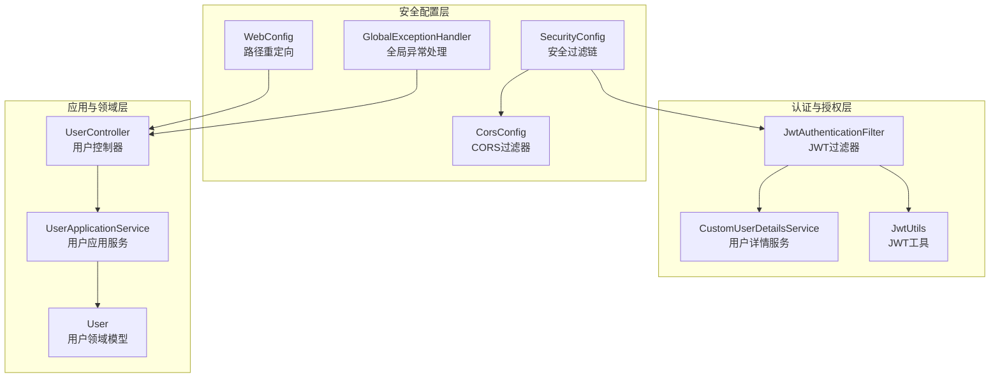
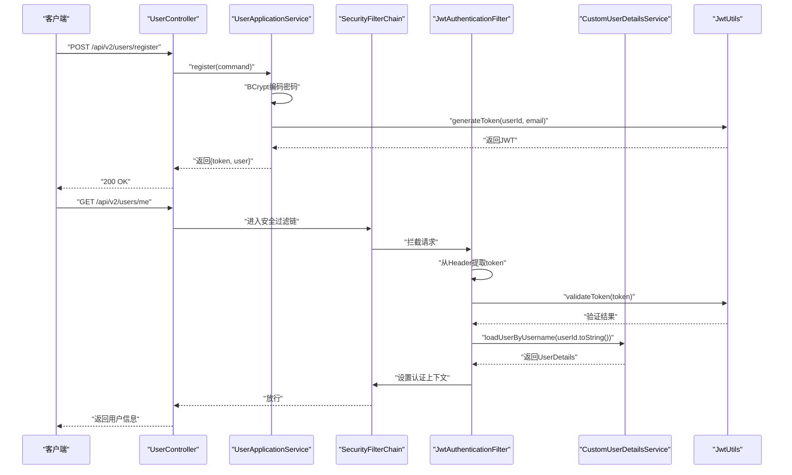
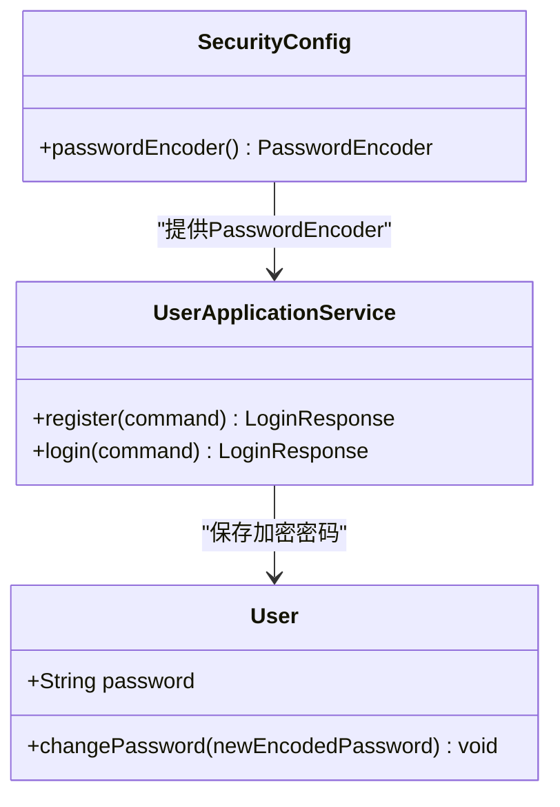
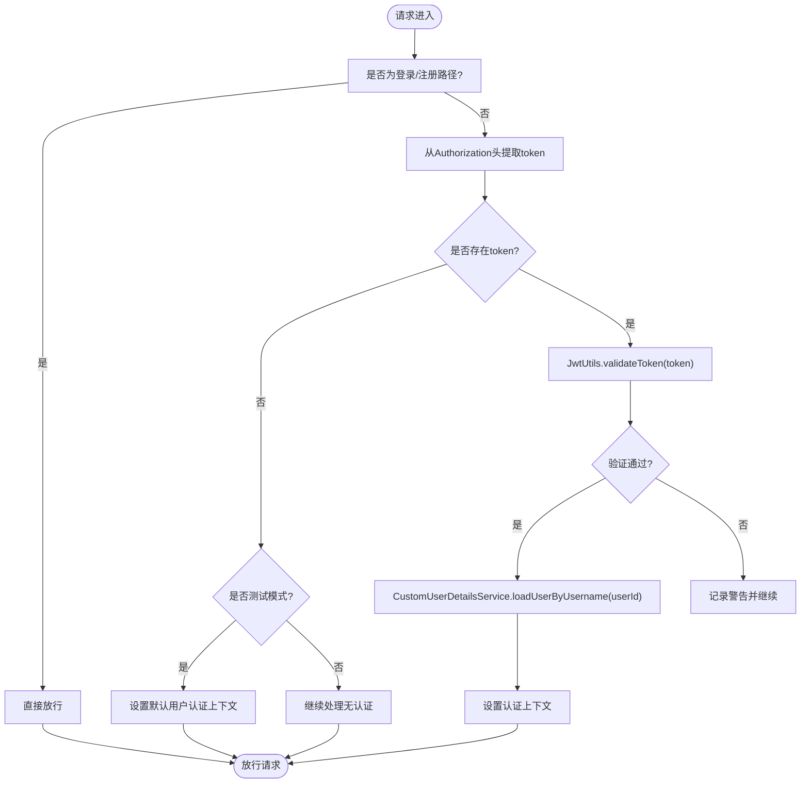
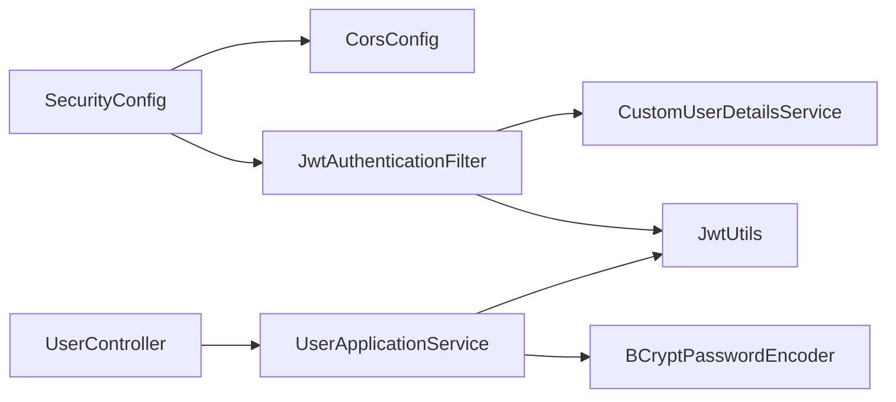

# 安全最佳实践

<cite>
**本文档引用的文件**
- [SecurityConfig.java](file://src/main/java/com/crazydream/security/SecurityConfig.java)
- [JwtAuthenticationFilter.java](file://src/main/java/com/crazydream/security/JwtAuthenticationFilter.java)
- [CustomUserDetailsService.java](file://src/main/java/com/crazydream/security/CustomUserDetailsService.java)
- [JwtUtils.java](file://src/main/java/com/crazydream/utils/JwtUtils.java)
- [application.yml](file://src/main/resources/application.yml)
- [application-prod.yml](file://src/main/resources/application-prod.yml)
- [CorsConfig.java](file://src/main/java/com/crazydream/config/CorsConfig.java)
- [WebConfig.java](file://src/main/java/com/crazydream/config/WebConfig.java)
- [UserController.java](file://src/main/java/com/crazydream/interfaces/user/UserController.java)
- [UserApplicationService.java](file://src/main/java/com/crazydream/application/user/service/UserApplicationService.java)
- [User.java](file://src/main/java/com/crazydream/domain/user/model/aggregate/User.java)
- [GlobalExceptionHandler.java](file://src/main/java/com/crazydream/config/GlobalExceptionHandler.java)
- [DEPLOYMENT.md](file://DEPLOYMENT.md)
</cite>

## 目录
1. [引言](#引言)
2. [项目结构](#项目结构)
3. [核心组件](#核心组件)
4. [架构总览](#架构总览)
5. [详细组件分析](#详细组件分析)
6. [依赖分析](#依赖分析)
7. [性能考虑](#性能考虑)
8. [故障排除指南](#故障排除指南)
9. [结论](#结论)
10. [附录](#附录)

## 引言
本指南面向开发者与运维人员，基于现有代码库总结安全最佳实践，涵盖密码加密策略（BCrypt）、JWT认证与授权、CORS与响应头、输入验证与输出编码、安全审计与监控、安全测试与应急响应，以及安全编码规范与常见问题解决方案。文档以实际代码为依据，确保可落地、可执行。

## 项目结构
后端采用Spring Security + JWT无状态认证，结合MyBatis数据访问层。安全相关的关键模块分布如下：
- 安全配置：Spring Security配置、CORS配置、全局异常处理
- 认证与授权：JWT过滤器、自定义UserDetailsService、JWT工具类
- 应用与领域：用户注册/登录、密码编码、领域模型
- 配置文件：开发/生产环境安全参数与默认值

图表来源
- [SecurityConfig.java](file://src/main/java/com/crazydream/security/SecurityConfig.java#L54-L91)
- [CorsConfig.java](file://src/main/java/com/crazydream/config/CorsConfig.java#L24-L52)
- [WebConfig.java](file://src/main/java/com/crazydream/config/WebConfig.java#L10-L17)
- [JwtAuthenticationFilter.java](file://src/main/java/com/crazydream/security/JwtAuthenticationFilter.java#L48-L127)
- [CustomUserDetailsService.java](file://src/main/java/com/crazydream/security/CustomUserDetailsService.java#L32-L61)
- [JwtUtils.java](file://src/main/java/com/crazydream/utils/JwtUtils.java#L57-L100)
- [UserApplicationService.java](file://src/main/java/com/crazydream/application/user/service/UserApplicationService.java#L27-L59)
- [UserController.java](file://src/main/java/com/crazydream/interfaces/user/UserController.java#L101-L130)
- [GlobalExceptionHandler.java](file://src/main/java/com/crazydream/config/GlobalExceptionHandler.java#L14-L60)

章节来源
- [SecurityConfig.java](file://src/main/java/com/crazydream/security/SecurityConfig.java#L1-L105)
- [CorsConfig.java](file://src/main/java/com/crazydream/config/CorsConfig.java#L1-L53)
- [WebConfig.java](file://src/main/java/com/crazydream/config/WebConfig.java#L1-L18)
- [GlobalExceptionHandler.java](file://src/main/java/com/crazydream/config/GlobalExceptionHandler.java#L1-L61)

## 核心组件
- 密码加密策略：使用BCryptPasswordEncoder进行密码编码与匹配，确保密码存储安全。
- JWT认证：通过JwtUtils生成与验证令牌，JwtAuthenticationFilter拦截请求并解析令牌，设置认证上下文。
- CORS与响应头：统一配置CORS允许凭证与暴露必要头部；生产环境默认开启安全认证。
- 输入验证与输出：控制器与应用服务对输入进行校验，异常统一处理，避免敏感信息泄露。
- 安全配置：通过application.yml与application-prod.yml区分开发/生产环境，强制生产环境启用认证。

章节来源
- [UserApplicationService.java](file://src/main/java/com/crazydream/application/user/service/UserApplicationService.java#L35-L53)
- [JwtUtils.java](file://src/main/java/com/crazydream/utils/JwtUtils.java#L57-L100)
- [JwtAuthenticationFilter.java](file://src/main/java/com/crazydream/security/JwtAuthenticationFilter.java#L72-L101)
- [SecurityConfig.java](file://src/main/java/com/crazydream/security/SecurityConfig.java#L54-L91)
- [application.yml](file://src/main/resources/application.yml#L65-L75)
- [application-prod.yml](file://src/main/resources/application-prod.yml#L11-L13)

## 架构总览
下图展示从客户端到后端的认证与授权流程，包括JWT生成、拦截与验证、用户详情加载及认证上下文设置。

图表来源
- [UserController.java](file://src/main/java/com/crazydream/interfaces/user/UserController.java#L26-L45)
- [UserApplicationService.java](file://src/main/java/com/crazydream/application/user/service/UserApplicationService.java#L27-L43)
- [SecurityConfig.java](file://src/main/java/com/crazydream/security/SecurityConfig.java#L54-L91)
- [JwtAuthenticationFilter.java](file://src/main/java/com/crazydream/security/JwtAuthenticationFilter.java#L48-L127)
- [CustomUserDetailsService.java](file://src/main/java/com/crazydream/security/CustomUserDetailsService.java#L32-L61)
- [JwtUtils.java](file://src/main/java/com/crazydream/utils/JwtUtils.java#L113-L125)

## 详细组件分析

### 密码加密策略（BCrypt）
- 编码器：在SecurityConfig中定义BCryptPasswordEncoder Bean，用于注册与登录时对密码进行编码。
- 匹配：UserApplicationService在登录时使用matches进行明文密码与存储密码的比对，确保不暴露原始密码。
- 领域模型：User聚合根保存加密后的密码字符串，不存储明文。

图表来源
- [SecurityConfig.java](file://src/main/java/com/crazydream/security/SecurityConfig.java#L44-L47)
- [UserApplicationService.java](file://src/main/java/com/crazydream/application/user/service/UserApplicationService.java#L35-L53)
- [User.java](file://src/main/java/com/crazydream/domain/user/model/aggregate/User.java#L16-L72)

章节来源
- [SecurityConfig.java](file://src/main/java/com/crazydream/security/SecurityConfig.java#L44-L47)
- [UserApplicationService.java](file://src/main/java/com/crazydream/application/user/service/UserApplicationService.java#L35-L53)
- [User.java](file://src/main/java/com/crazydream/domain/user/model/aggregate/User.java#L16-L72)

### JWT认证与授权
- 过滤链：SecurityConfig禁用CSRF，配置CORS与无状态会话；根据security.auth.disabled动态决定是否允许所有请求并通过JWT过滤器。
- 过滤器：JwtAuthenticationFilter拦截除登录/注册外的所有请求，从Authorization头提取token，验证后设置认证上下文；测试模式下可使用默认用户。
- 用户详情：CustomUserDetailsService根据用户ID加载UserDetails；UserRepository提供按ID查询能力。
- 工具类：JwtUtils负责生成、解析、验证token，并从Header前缀中提取token。

图表来源
- [JwtAuthenticationFilter.java](file://src/main/java/com/crazydream/security/JwtAuthenticationFilter.java#L48-L127)
- [JwtUtils.java](file://src/main/java/com/crazydream/utils/JwtUtils.java#L113-L125)
- [CustomUserDetailsService.java](file://src/main/java/com/crazydream/security/CustomUserDetailsService.java#L32-L61)
- [SecurityConfig.java](file://src/main/java/com/crazydream/security/SecurityConfig.java#L66-L88)

章节来源
- [SecurityConfig.java](file://src/main/java/com/crazydream/security/SecurityConfig.java#L54-L91)
- [JwtAuthenticationFilter.java](file://src/main/java/com/crazydream/security/JwtAuthenticationFilter.java#L48-L127)
- [CustomUserDetailsService.java](file://src/main/java/com/crazydream/security/CustomUserDetailsService.java#L32-L61)
- [JwtUtils.java](file://src/main/java/com/crazydream/utils/JwtUtils.java#L57-L100)

### CORS与响应头
- CORS配置：CorsConfig允许凭证、通配方法与头，暴露Authorization与X-Total-Count等头部，对/api/**路径生效。
- WebConfig：将旧路径/auth/login与/auth/register重定向至/api/auth/login与/api/auth/register，保持接口一致性。
- 安全响应头：当前代码未显式设置额外的安全响应头（如Content-Security-Policy等），建议在网关或反向代理层补充。

章节来源
- [CorsConfig.java](file://src/main/java/com/crazydream/config/CorsConfig.java#L24-L52)
- [WebConfig.java](file://src/main/java/com/crazydream/config/WebConfig.java#L10-L17)

### 输入验证与输出编码
- 控制器层：UserController与GoalController在获取当前用户ID时，对认证上下文进行多类型兼容处理，避免空指针与格式错误。
- 应用服务层：UserApplicationService在注册/登录时对邮箱唯一性与密码有效性进行前置校验。
- 输出：ResponseResult统一封装响应，异常通过GlobalExceptionHandler转换为安全的错误码与消息，避免敏感堆栈信息泄露。

章节来源
- [UserController.java](file://src/main/java/com/crazydream/interfaces/user/UserController.java#L101-L130)
- [UserApplicationService.java](file://src/main/java/com/crazydream/application/user/service/UserApplicationService.java#L27-L59)
- [GlobalExceptionHandler.java](file://src/main/java/com/crazydream/config/GlobalExceptionHandler.java#L14-L60)

### 安全配置最佳实践
- HTTPS与强制跳转：当前未见HTTPS强制配置，建议在网关或反向代理层启用TLS与301重定向。
- 安全响应头：建议在网关层添加HSTS、X-Frame-Options、X-Content-Type-Options、Referrer-Policy等。
- 敏感信息保护：JWT密钥通过环境变量注入；生产环境默认开启认证，禁止明文提交数据库凭据。
- 配置文件：application.yml提供默认值，application-prod.yml仅覆盖日志与认证开关。

章节来源
- [application.yml](file://src/main/resources/application.yml#L57-L75)
- [application-prod.yml](file://src/main/resources/application-prod.yml#L11-L13)
- [DEPLOYMENT.md](file://DEPLOYMENT.md#L162-L220)

### 安全审计与监控
- 访问日志：建议在网关层记录请求路径、IP、User-Agent、响应码与耗时；后端可结合SLF4J记录关键事件。
- 异常检测：GlobalExceptionHandler统一捕获SQL异常、404与运行时异常，避免敏感信息泄露。
- 审计要点：记录登录/注册、用户信息变更、积分变动等敏感操作；对频繁失败的登录尝试进行限流与告警。

章节来源
- [GlobalExceptionHandler.java](file://src/main/java/com/crazydream/config/GlobalExceptionHandler.java#L14-L60)

### 安全测试与应急响应
- 安全测试：建议引入OWASP ZAP、Burp Suite进行渗透测试；对JWT密钥、CORS策略、认证绕过等场景进行专项测试。
- 漏洞扫描：CI/CD集成静态分析（SpotBugs、PMD）与依赖漏洞扫描（OSV、Snyk）。
- 应急响应：当发现密钥泄露或配置错误时，立即轮换密钥、更新环境变量并在生产环境执行安全检查脚本。

章节来源
- [DEPLOYMENT.md](file://DEPLOYMENT.md#L191-L220)

## 依赖分析
- 组件耦合：SecurityConfig依赖JwtAuthenticationFilter；JwtAuthenticationFilter依赖JwtUtils与CustomUserDetailsService；UserApplicationService依赖PasswordEncoder与JwtUtils。
- 外部依赖：Spring Security、MyBatis、JWT库；数据库连接通过环境变量注入。
- 潜在风险：CSRF已禁用，需确保无状态设计与严格的接口鉴权；CORS允许通配符来源，建议在生产环境限制来源。

图表来源
- [SecurityConfig.java](file://src/main/java/com/crazydream/security/SecurityConfig.java#L37-L42)
- [JwtAuthenticationFilter.java](file://src/main/java/com/crazydream/security/JwtAuthenticationFilter.java#L34-L42)
- [JwtUtils.java](file://src/main/java/com/crazydream/utils/JwtUtils.java#L34-L44)
- [CustomUserDetailsService.java](file://src/main/java/com/crazydream/security/CustomUserDetailsService.java#L29-L31)
- [UserApplicationService.java](file://src/main/java/com/crazydream/application/user/service/UserApplicationService.java#L21-L25)

章节来源
- [SecurityConfig.java](file://src/main/java/com/crazydream/security/SecurityConfig.java#L37-L42)
- [JwtAuthenticationFilter.java](file://src/main/java/com/crazydream/security/JwtAuthenticationFilter.java#L34-L42)
- [JwtUtils.java](file://src/main/java/com/crazydream/utils/JwtUtils.java#L34-L44)
- [CustomUserDetailsService.java](file://src/main/java/com/crazydream/security/CustomUserDetailsService.java#L29-L31)
- [UserApplicationService.java](file://src/main/java/com/crazydream/application/user/service/UserApplicationService.java#L21-L25)

## 性能考虑
- JWT无状态：无状态设计降低会话存储开销，适合水平扩展。
- 密码编码成本：BCrypt迭代次数适中，注册/登录时延可控；建议在高并发场景下缓存热点用户信息。
- 过滤器链：禁用CSRF与无状态会话减少开销；CORS配置应避免不必要的通配符来源。

## 故障排除指南
- 认证失败
  - 确认Authorization头格式正确（前缀与Header名称）。
  - 检查JWT密钥是否被替换为默认值或泄露。
  - 在测试环境确认security.auth.disabled与default-user-id配置。
- 用户不存在/无效ID
  - 检查CustomUserDetailsService按ID加载逻辑与UserRepository实现。
- 登录/注册异常
  - 查看GlobalExceptionHandler对SQL异常与运行时异常的统一处理。
- CORS问题
  - 确认CORS配置允许来源、方法与头；检查暴露头部是否包含Authorization。

章节来源
- [JwtUtils.java](file://src/main/java/com/crazydream/utils/JwtUtils.java#L151-L156)
- [application.yml](file://src/main/resources/application.yml#L65-L75)
- [CustomUserDetailsService.java](file://src/main/java/com/crazydream/security/CustomUserDetailsService.java#L32-L61)
- [GlobalExceptionHandler.java](file://src/main/java/com/crazydream/config/GlobalExceptionHandler.java#L14-L60)
- [CorsConfig.java](file://src/main/java/com/crazydream/config/CorsConfig.java#L24-L52)

## 结论
本项目已实现BCrypt密码编码、JWT无状态认证与基础CORS配置，具备良好的安全基础。建议在网关层完善HTTPS与安全响应头，强化CORS白名单策略，补充访问日志与异常监控，并在CI/CD中集成安全扫描与应急响应流程，持续提升整体安全性与合规性。

## 附录
- 安全编码规范
  - 密码：仅存储哈希，不落盘明文；使用BCrypt，避免硬编码密钥。
  - JWT：短有效期、强密钥、严格Header前缀；避免在Cookie中存储。
  - 输入：严格校验与白名单；拒绝未知字段；对枚举与范围进行约束。
  - 输出：统一响应体；隐藏堆栈与数据库细节；对敏感字段脱敏。
  - 配置：环境变量注入敏感信息；生产环境默认启用认证与HTTPS。
- 常见攻击防护
  - SQL注入：使用ORM/预编译参数，避免拼接SQL；对输入进行参数化。
  - XSS：对输出进行HTML转义；限制富文本与脚本标签。
  - CSRF：若启用有状态会话，需CSRF令牌；当前无状态设计建议严格鉴权与CORS控制。
  - 暴力破解：登录失败计数、限速与二次验证；弱口令策略。
- 工具与流程
  - 渗透测试：OWASP ZAP/Burp Suite；专项测试JWT与CORS。
  - 依赖扫描：Snyk/OSV；定期更新依赖。
  - 应急响应：密钥轮换、配置审计、日志回溯与告警联动。