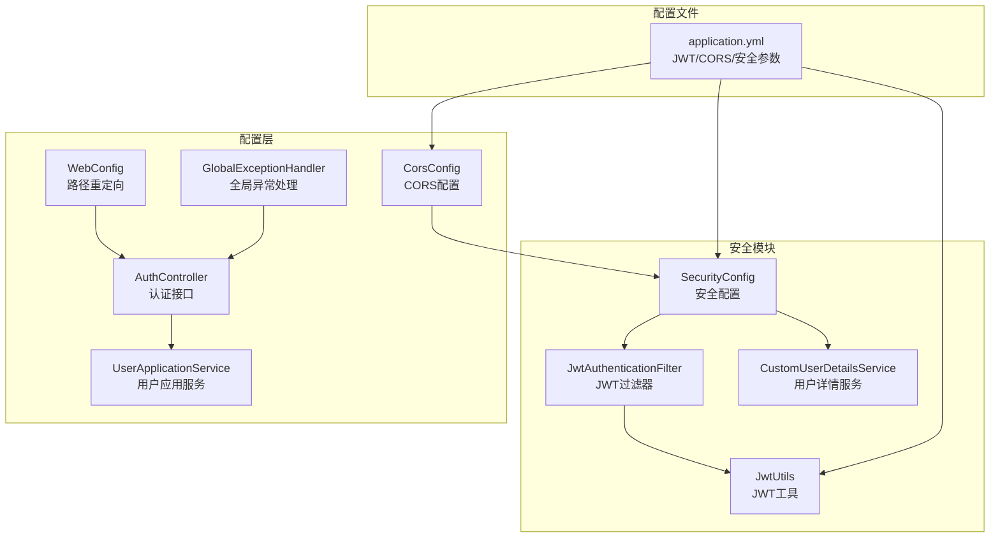
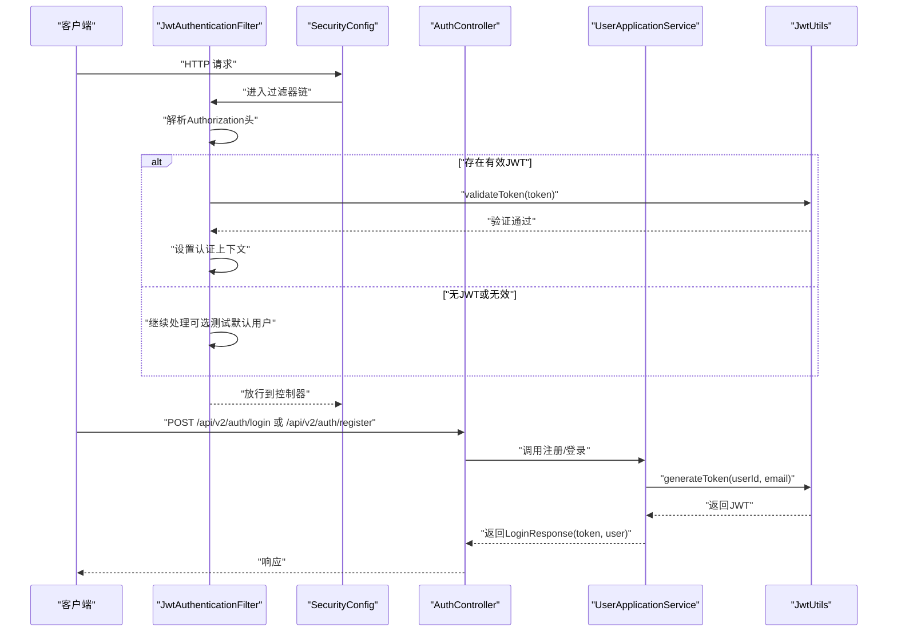
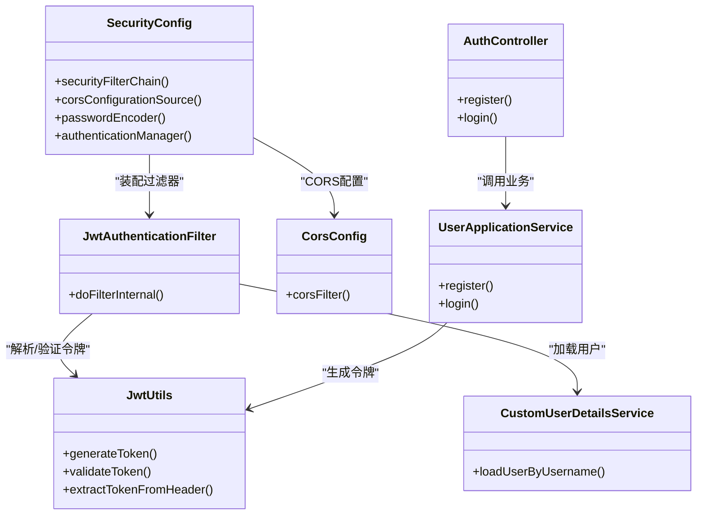

# 安全配置

<cite>
**本文引用的文件**
- [SecurityConfig.java](file://src/main/java/com/crazydream/security/SecurityConfig.java)
- [JwtAuthenticationFilter.java](file://src/main/java/com/crazydream/security/JwtAuthenticationFilter.java)
- [CustomUserDetailsService.java](file://src/main/java/com/crazydream/security/CustomUserDetailsService.java)
- [JwtUtils.java](file://src/main/java/com/crazydream/utils/JwtUtils.java)
- [CorsConfig.java](file://src/main/java/com/crazydream/config/CorsConfig.java)
- [application.yml](file://src/main/resources/application.yml)
- [AuthController.java](file://src/main/java/com/crazydream/interfaces/auth/AuthController.java)
- [UserApplicationService.java](file://src/main/java/com/crazydream/application/user/service/UserApplicationService.java)
- [WebConfig.java](file://src/main/java/com/crazydream/config/WebConfig.java)
- [GlobalExceptionHandler.java](file://src/main/java/com/crazydream/config/GlobalExceptionHandler.java)
- [LoginCommand.java](file://src/main/java/com/crazydream/application/user/dto/LoginCommand.java)
</cite>

## 目录
1. [简介](#简介)
2. [项目结构与安全模块定位](#项目结构与安全模块定位)
3. [核心组件](#核心组件)
4. [架构总览](#架构总览)
5. [组件详解](#组件详解)
6. [依赖关系分析](#依赖关系分析)
7. [性能与安全特性](#性能与安全特性)
8. [故障排查指南](#故障排查指南)
9. [结论](#结论)
10. [附录：配置清单与最佳实践](#附录配置清单与最佳实践)

## 简介
本文件面向开发者，系统性梳理 CrazyDream 项目的安全配置与实现，重点覆盖以下方面：
- JWT 认证机制的实现原理、配置方法与最佳实践
- Spring Security 的安全配置、过滤器链与用户详情服务
- CORS 配置、密码加密策略与权限控制
- 安全漏洞防护措施、输入验证与访问控制策略
- 安全配置的完整指南与安全编码规范

## 项目结构与安全模块定位
安全相关代码主要分布在以下包与文件：
- 安全配置与过滤器：com.crazydream.security
- 工具类：com.crazydream.utils
- 配置与全局异常：com.crazydream.config
- 认证接口与应用服务：com.crazydream.interfaces.auth、com.crazydream.application.user.service
- 配置文件：application.yml

图表来源
- [SecurityConfig.java](file://src/main/java/com/crazydream/security/SecurityConfig.java#L55-L91)
- [JwtAuthenticationFilter.java](file://src/main/java/com/crazydream/security/JwtAuthenticationFilter.java#L48-L127)
- [CustomUserDetailsService.java](file://src/main/java/com/crazydream/security/CustomUserDetailsService.java#L32-L61)
- [JwtUtils.java](file://src/main/java/com/crazydream/utils/JwtUtils.java#L57-L76)
- [CorsConfig.java](file://src/main/java/com/crazydream/config/CorsConfig.java#L24-L52)
- [AuthController.java](file://src/main/java/com/crazydream/interfaces/auth/AuthController.java#L29-L60)
- [UserApplicationService.java](file://src/main/java/com/crazydream/application/user/service/UserApplicationService.java#L28-L59)
- [WebConfig.java](file://src/main/java/com/crazydream/config/WebConfig.java#L11-L16)
- [GlobalExceptionHandler.java](file://src/main/java/com/crazydream/config/GlobalExceptionHandler.java#L19-L59)
- [application.yml](file://src/main/resources/application.yml#L57-L75)

章节来源
- [SecurityConfig.java](file://src/main/java/com/crazydream/security/SecurityConfig.java#L1-L105)
- [application.yml](file://src/main/resources/application.yml#L57-L75)

## 核心组件
- 安全配置类：负责启用 Web 安全、方法级安全、CORS、CSRF 策略、会话策略以及安全过滤器链的装配。
- JWT 认证过滤器：拦截请求，从 Authorization 头解析并校验 JWT，必要时设置认证上下文。
- 用户详情服务：基于用户 ID 从领域仓库加载用户信息，供认证流程使用。
- JWT 工具类：生成与验证 JWT、解析载荷、提取令牌、校验过期等。
- CORS 配置：统一跨域策略，暴露必要的响应头。
- 认证接口与应用服务：处理注册/登录，生成 JWT 并返回给客户端。
- 全局异常处理：对常见异常进行统一响应，避免泄露敏感信息。
- Web 配置：将旧版认证路径重定向至新版路径，保证兼容性。

章节来源
- [SecurityConfig.java](file://src/main/java/com/crazydream/security/SecurityConfig.java#L32-L103)
- [JwtAuthenticationFilter.java](file://src/main/java/com/crazydream/security/JwtAuthenticationFilter.java#L29-L128)
- [CustomUserDetailsService.java](file://src/main/java/com/crazydream/security/CustomUserDetailsService.java#L24-L62)
- [JwtUtils.java](file://src/main/java/com/crazydream/utils/JwtUtils.java#L29-L165)
- [CorsConfig.java](file://src/main/java/com/crazydream/config/CorsConfig.java#L16-L52)
- [AuthController.java](file://src/main/java/com/crazydream/interfaces/auth/AuthController.java#L17-L61)
- [UserApplicationService.java](file://src/main/java/com/crazydream/application/user/service/UserApplicationService.java#L15-L97)
- [GlobalExceptionHandler.java](file://src/main/java/com/crazydream/config/GlobalExceptionHandler.java#L14-L60)
- [WebConfig.java](file://src/main/java/com/crazydream/config/WebConfig.java#L9-L17)

## 架构总览
下图展示了认证与安全的关键交互流程：客户端发起请求，JWT 过滤器解析令牌并设置认证上下文，随后进入控制器；注册/登录由应用服务生成 JWT 返回。

图表来源
- [JwtAuthenticationFilter.java](file://src/main/java/com/crazydream/security/JwtAuthenticationFilter.java#L48-L127)
- [SecurityConfig.java](file://src/main/java/com/crazydream/security/SecurityConfig.java#L55-L91)
- [AuthController.java](file://src/main/java/com/crazydream/interfaces/auth/AuthController.java#L29-L60)
- [UserApplicationService.java](file://src/main/java/com/crazydream/application/user/service/UserApplicationService.java#L28-L59)
- [JwtUtils.java](file://src/main/java/com/crazydream/utils/JwtUtils.java#L57-L76)

## 组件详解

### 1) Spring Security 安全配置
- 启用 Web 安全与方法级安全注解，禁用 CSRF 保护（无状态 JWT 场景），设置会话策略为无状态。
- 支持两种运行模式：
  - 生产模式：除登录/注册/健康检查外的所有接口均需认证，并将 JWT 过滤器插入到 UsernamePasswordAuthenticationFilter 之前。
  - 测试模式：允许所有请求，但仍注入 JWT 过滤器以解析 token；若未携带 token 且开启测试模式，则使用默认测试用户 ID 设置认证上下文。
- CORS 配置：允许任意来源、方法与头，允许携带凭证，并暴露 Authorization 等响应头。

章节来源
- [SecurityConfig.java](file://src/main/java/com/crazydream/security/SecurityConfig.java#L55-L91)
- [SecurityConfig.java](file://src/main/java/com/crazydream/security/SecurityConfig.java#L94-L103)

### 2) JWT 认证过滤器
- 功能要点：
  - 忽略登录/注册接口的 JWT 校验，直接放行。
  - 从 Authorization 头按前缀提取 JWT。
  - 若令牌有效，从载荷提取用户 ID，委托用户详情服务加载用户，构建认证令牌并写入 SecurityContext。
  - 若未携带令牌且处于测试模式，使用默认测试用户 ID 设置认证上下文。
  - 异常情况下清理上下文，确保不会残留无效认证信息。
- 与配置联动：
  - 读取配置项决定是否禁用安全认证与默认测试用户 ID。
  - 依赖 JwtUtils 提供的头部键、前缀与令牌解析能力。

章节来源
- [JwtAuthenticationFilter.java](file://src/main/java/com/crazydream/security/JwtAuthenticationFilter.java#L48-L127)
- [application.yml](file://src/main/resources/application.yml#L65-L75)

### 3) 用户详情服务
- 将传入的 username 视作用户 ID，尝试解析为 Long 类型并从领域仓库查询用户。
- 返回 Spring Security 的 UserDetails 对象（密码字段可为空，因为使用 JWT 认证）。
- 未找到用户或 ID 非法时抛出 UsernameNotFoundException。

章节来源
- [CustomUserDetailsService.java](file://src/main/java/com/crazydream/security/CustomUserDetailsService.java#L32-L61)

### 4) JWT 工具类
- 生成令牌：设置签发时间、过期时间与自定义载荷（如用户 ID、用户名），使用 HS256 算法签名。
- 验证令牌：使用相同密钥验证签名与有效期。
- 解析与提取：从 Authorization 头中去除前缀提取原始令牌；从令牌载荷中提取用户 ID 与用户名。
- 配置依赖：从 application.yml 读取密钥、过期时间、头部键与前缀。

章节来源
- [JwtUtils.java](file://src/main/java/com/crazydream/utils/JwtUtils.java#L57-L76)
- [JwtUtils.java](file://src/main/java/com/crazydream/utils/JwtUtils.java#L113-L125)
- [JwtUtils.java](file://src/main/java/com/crazydream/utils/JwtUtils.java#L151-L156)
- [application.yml](file://src/main/resources/application.yml#L57-L64)

### 5) CORS 配置
- 允许任意来源、方法与头，允许携带凭证。
- 显式暴露 Authorization 与 X-Total-Count 响应头，便于前端获取 token 与分页信息。
- 仅对 /api/** 路径生效，避免对静态资源造成不必要的跨域影响。

章节来源
- [CorsConfig.java](file://src/main/java/com/crazydream/config/CorsConfig.java#L24-L52)

### 6) 认证接口与应用服务
- 注册：校验邮箱唯一性，使用 PasswordEncoder 加密密码，保存用户并生成 JWT 返回。
- 登录：根据邮箱查找用户，使用 PasswordEncoder 校验密码，成功后生成 JWT 返回。
- 与控制器配合：控制器接收请求体 DTO，调用应用服务执行业务逻辑，返回统一封装的响应结果。

章节来源
- [AuthController.java](file://src/main/java/com/crazydream/interfaces/auth/AuthController.java#L29-L60)
- [UserApplicationService.java](file://src/main/java/com/crazydream/application/user/service/UserApplicationService.java#L28-L59)
- [LoginCommand.java](file://src/main/java/com/crazydream/application/user/dto/LoginCommand.java#L6-L9)

### 7) 全局异常处理与路径重定向
- 全局异常处理：对 SQL 异常、未找到资源、运行时异常与通用异常进行统一响应，避免泄露内部错误细节。
- 路径重定向：将旧版 /auth/login 与 /auth/register 重定向到新版 /api/auth/login 与 /api/auth/register，保持兼容。

章节来源
- [GlobalExceptionHandler.java](file://src/main/java/com/crazydream/config/GlobalExceptionHandler.java#L19-L59)
- [WebConfig.java](file://src/main/java/com/crazydream/config/WebConfig.java#L11-L16)

## 依赖关系分析
- SecurityConfig 依赖 JwtAuthenticationFilter、BCryptPasswordEncoder、CorsConfigurationSource。
- JwtAuthenticationFilter 依赖 JwtUtils、UserDetailsService、application.yml 中的安全配置。
- UserApplicationService 依赖 PasswordEncoder、JwtUtils、UserRepository。
- AuthController 依赖 UserApplicationService、ResponseResult。
- CorsConfig 与 SecurityConfig 可独立工作，但 SecurityConfig 内部也提供 CORS 配置源。

图表来源
- [SecurityConfig.java](file://src/main/java/com/crazydream/security/SecurityConfig.java#L38-L52)
- [JwtAuthenticationFilter.java](file://src/main/java/com/crazydream/security/JwtAuthenticationFilter.java#L34-L42)
- [CustomUserDetailsService.java](file://src/main/java/com/crazydream/security/CustomUserDetailsService.java#L29-L31)
- [JwtUtils.java](file://src/main/java/com/crazydream/utils/JwtUtils.java#L34-L44)
- [CorsConfig.java](file://src/main/java/com/crazydream/config/CorsConfig.java#L24-L52)
- [AuthController.java](file://src/main/java/com/crazydream/interfaces/auth/AuthController.java#L23-L24)
- [UserApplicationService.java](file://src/main/java/com/crazydream/application/user/service/UserApplicationService.java#L18-L25)

## 性能与安全特性
- 无状态认证：会话策略为 STATELESS，降低服务端状态维护成本，提升横向扩展能力。
- 过滤器链轻量：仅在必要接口上进行 JWT 校验，登录/注册接口直接放行，减少额外开销。
- 密码加密：使用 BCryptPasswordEncoder 对密码进行加密存储，增强抗破解能力。
- CORS 策略：允许凭证与任意来源/方法/头，便于前端开发调试；生产环境建议收紧来源白名单。
- 测试模式：提供 authDisabled 与默认测试用户 ID，便于本地联调；生产环境务必关闭。

章节来源
- [SecurityConfig.java](file://src/main/java/com/crazydream/security/SecurityConfig.java#L63-L64)
- [SecurityConfig.java](file://src/main/java/com/crazydream/security/SecurityConfig.java#L67-L88)
- [application.yml](file://src/main/resources/application.yml#L65-L75)

## 故障排查指南
- 无法登录/注册
  - 检查 application.yml 中的 JWT 密钥与过期时间配置是否正确。
  - 确认注册接口未被误拦截（登录/注册接口应放行）。
  - 查看全局异常处理器对 400/401/500 的响应，定位具体错误原因。
- 令牌无效或过期
  - 核对 Authorization 头格式是否符合前缀约定。
  - 检查 JwtUtils 的密钥与算法配置，确认前后端一致。
  - 关注令牌过期时间，适当调整 expiration。
- 跨域问题
  - 确认 CORS 配置已生效，且暴露了 Authorization 等必要响应头。
  - 生产环境建议限制 allowedOriginPattern，避免通配符带来的风险。
- 测试模式异常
  - 确认 security.auth.disabled 与 security.test.default-user-id 配置正确。
  - 在测试模式下，未携带 token 会使用默认用户 ID，注意区分真实用户场景。

章节来源
- [JwtUtils.java](file://src/main/java/com/crazydream/utils/JwtUtils.java#L151-L156)
- [application.yml](file://src/main/resources/application.yml#L57-L75)
- [GlobalExceptionHandler.java](file://src/main/java/com/crazydream/config/GlobalExceptionHandler.java#L19-L59)
- [CorsConfig.java](file://src/main/java/com/crazydream/config/CorsConfig.java#L24-L52)

## 结论
CrazyDream 的安全体系以无状态 JWT 为核心，结合 Spring Security 的过滤器链、CORS 配置与全局异常处理，实现了简洁而有效的认证与授权机制。生产部署时建议：
- 关闭测试模式，严格启用认证与授权规则
- 收紧 CORS 策略，限制来源与暴露头
- 使用强密钥与合理过期时间，定期轮换
- 在控制器与应用服务中加强输入校验与异常处理
- 对敏感接口引入细粒度权限控制与审计日志

## 附录：配置清单与最佳实践

### 配置清单
- JWT 参数
  - jwt.secret：用于 HS256 签名的密钥（生产环境务必通过环境变量覆盖）
  - jwt.expiration：令牌过期秒数
  - jwt.header：Authorization 头键
  - jwt.prefix：令牌前缀（如 Bearer ）
- 安全参数
  - security.auth.disabled：测试模式开关
  - security.test.default-user-id：测试模式默认用户 ID
- CORS 参数
  - 允许来源、方法、头与凭证
  - 暴露 Authorization、X-Total-Count 等响应头

章节来源
- [application.yml](file://src/main/resources/application.yml#L57-L75)

### 最佳实践
- 认证与授权
  - 仅对受保护接口启用认证；登录/注册/健康检查等公共接口放行
  - 使用方法级安全注解（如 @PreAuthorize）细化权限控制
- 密码与数据
  - 使用 BCryptPasswordEncoder 存储密码，禁止明文存储
  - 输入参数进行严格校验，避免 SQL 注入与参数篡改
- 令牌与会话
  - 采用无状态 JWT，禁用会话 Cookie
  - 合理设置过期时间，支持刷新令牌策略
- CORS 与网络
  - 生产环境限制 allowedOriginPattern，避免通配符
  - 仅暴露必要响应头，避免泄露敏感信息
- 日志与监控
  - 记录认证失败与异常事件，便于审计与追踪
  - 对高频攻击行为进行限流与告警