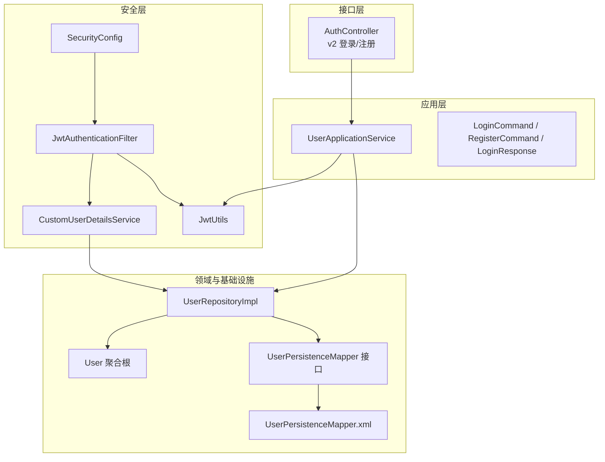
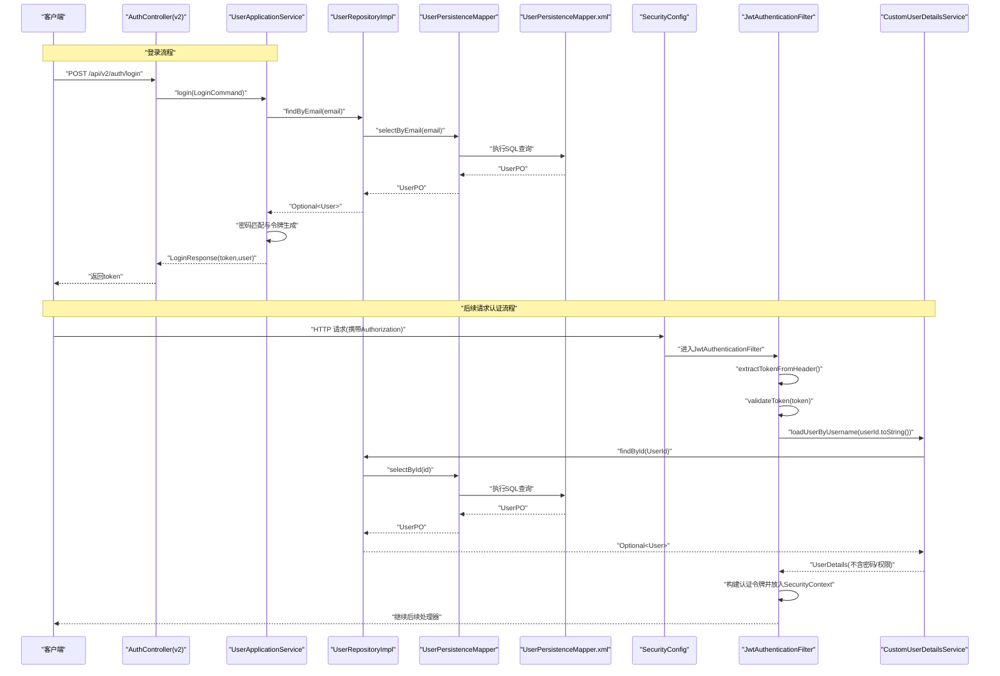
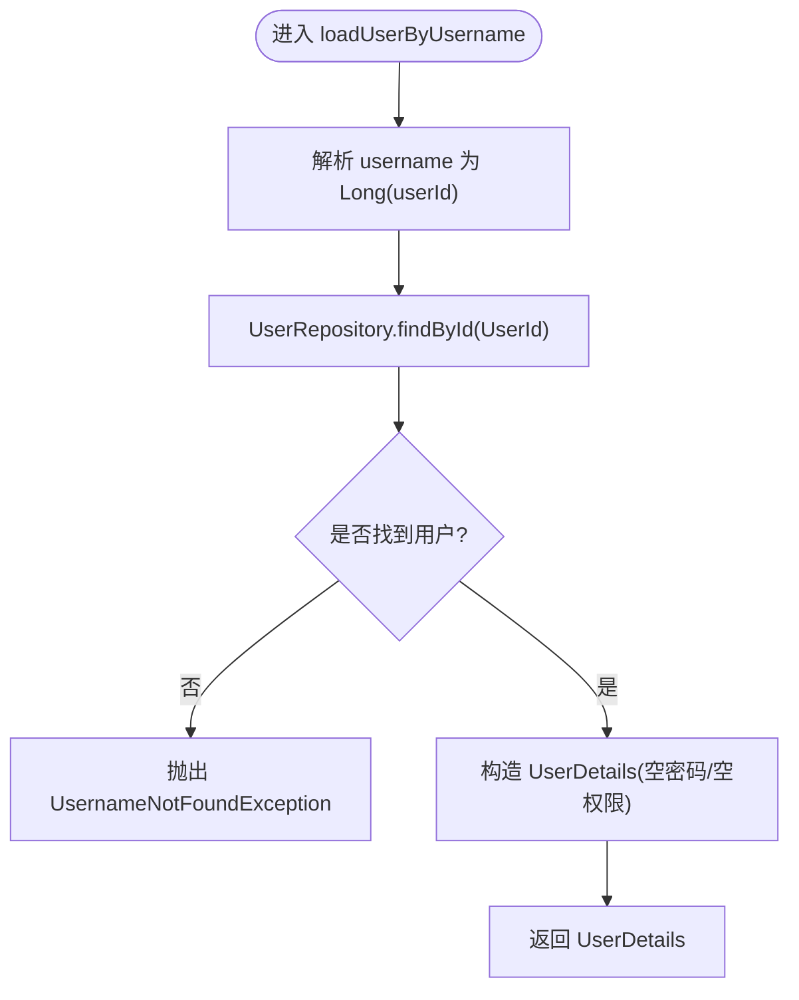
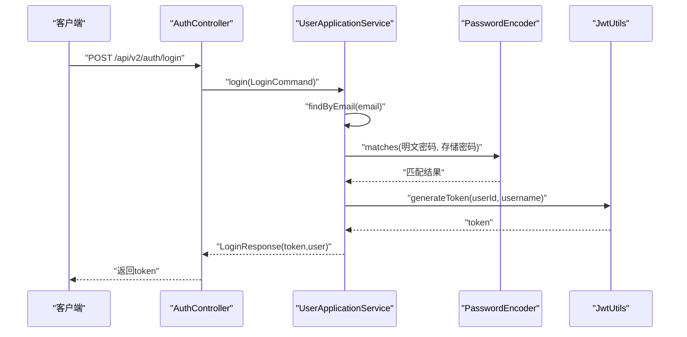
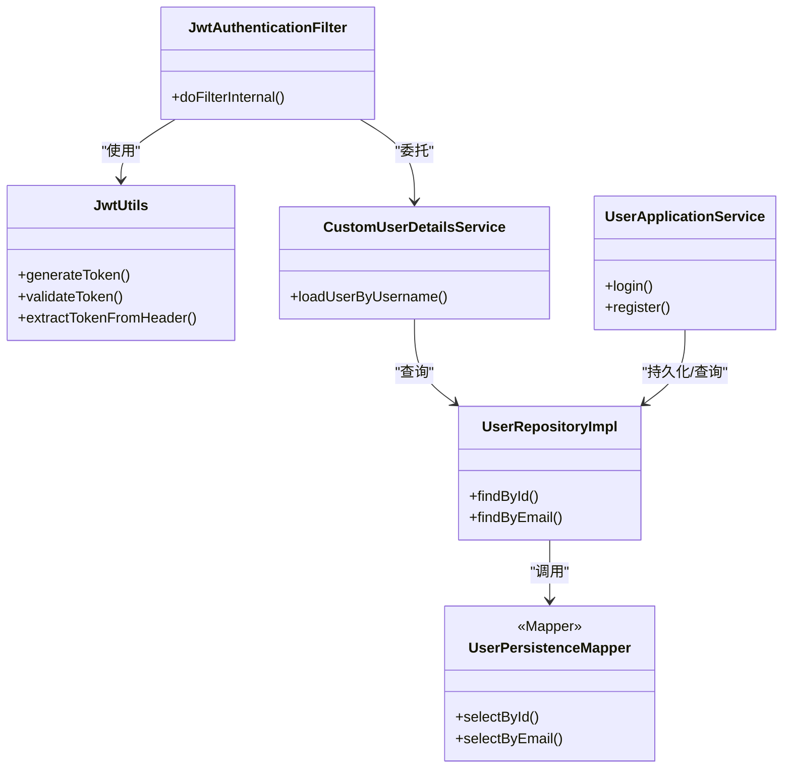

# 用户详情服务

<cite>
**本文引用的文件**
- [src/main/java/com/crazydream/security/CustomUserDetailsService.java](file://src/main/java/com/crazydream/security/CustomUserDetailsService.java)
- [src/main/java/com/crazydream/domain/user/model/aggregate/User.java](file://src/main/java/com/crazydream/domain/user/model/aggregate/User.java)
- [src/main/java/com/crazydream/infrastructure/persistence/repository/UserRepositoryImpl.java](file://src/main/java/com/crazydream/infrastructure/persistence/repository/UserRepositoryImpl.java)
- [src/main/java/com/crazydream/infrastructure/persistence/mapper/UserPersistenceMapper.java](file://src/main/java/com/crazydream/infrastructure/persistence/mapper/UserPersistenceMapper.java)
- [src/main/resources/mapper/UserPersistenceMapper.xml](file://src/main/resources/mapper/UserPersistenceMapper.xml)
- [src/main/java/com/crazydream/security/SecurityConfig.java](file://src/main/java/com/crazydream/security/SecurityConfig.java)
- [src/main/java/com/crazydream/security/JwtAuthenticationFilter.java](file://src/main/java/com/crazydream/security/JwtAuthenticationFilter.java)
- [src/main/java/com/crazydream/utils/JwtUtils.java](file://src/main/java/com/crazydream/utils/JwtUtils.java)
- [src/main/java/com/crazydream/application/user/service/UserApplicationService.java](file://src/main/java/com/crazydream/application/user/service/UserApplicationService.java)
- [src/main/java/com/crazydream/application/user/dto/LoginCommand.java](file://src/main/java/com/crazydream/application/user/dto/LoginCommand.java)
- [src/main/java/com/crazydream/application/user/dto/RegisterCommand.java](file://src/main/java/com/crazydream/application/user/dto/RegisterCommand.java)
- [src/main/java/com/crazydream/application/user/dto/LoginResponse.java](file://src/main/java/com/crazydream/application/user/dto/LoginResponse.java)
- [src/main/resources/application.yml](file://src/main/resources/application.yml)
</cite>

## 目录
1. [简介](#简介)
2. [项目结构](#项目结构)
3. [核心组件](#核心组件)
4. [架构总览](#架构总览)
5. [详细组件分析](#详细组件分析)
6. [依赖关系分析](#依赖关系分析)
7. [性能考虑](#性能考虑)
8. [故障排查指南](#故障排查指南)
9. [结论](#结论)
10. [附录](#附录)

## 简介
本文件围绕“用户详情服务”展开，重点解释 CustomUserDetailsService 的实现原理与职责边界，涵盖用户信息加载、密码验证与账户状态检查的现状与建议；说明 UserDetails 的实现方式与权限/角色体系的扩展点；梳理用户数据源的配置（数据库查询与缓存策略）；给出用户认证流程的完整说明（登录验证、权限继承与异常处理）；并补充用户信息扩展、多租户支持与性能优化建议。

## 项目结构
本项目采用分层架构，用户详情服务位于安全层与领域层之间，负责将外部请求中的用户标识转换为 Spring Security 的 UserDetails，并驱动后续的鉴权与授权流程。关键文件分布如下：
- 安全层：CustomUserDetailsService、JwtAuthenticationFilter、SecurityConfig、JwtUtils
- 应用层：UserApplicationService、LoginCommand、RegisterCommand、LoginResponse
- 领域与基础设施：User 聚合根、UserRepository 及其实现、MyBatis 映射

图表来源
- [src/main/java/com/crazydream/interfaces/auth/AuthController.java](file://src/main/java/com/crazydream/interfaces/auth/AuthController.java#L1-L62)
- [src/main/java/com/crazydream/application/user/service/UserApplicationService.java](file://src/main/java/com/crazydream/application/user/service/UserApplicationService.java#L1-L98)
- [src/main/java/com/crazydream/security/SecurityConfig.java](file://src/main/java/com/crazydream/security/SecurityConfig.java#L1-L105)
- [src/main/java/com/crazydream/security/JwtAuthenticationFilter.java](file://src/main/java/com/crazydream/security/JwtAuthenticationFilter.java#L1-L129)
- [src/main/java/com/crazydream/security/CustomUserDetailsService.java](file://src/main/java/com/crazydream/security/CustomUserDetailsService.java#L1-L63)
- [src/main/java/com/crazydream/utils/JwtUtils.java](file://src/main/java/com/crazydream/utils/JwtUtils.java#L1-L165)
- [src/main/java/com/crazydream/infrastructure/persistence/repository/UserRepositoryImpl.java](file://src/main/java/com/crazydream/infrastructure/persistence/repository/UserRepositoryImpl.java#L1-L59)
- [src/main/java/com/crazydream/infrastructure/persistence/mapper/UserPersistenceMapper.java](file://src/main/java/com/crazydream/infrastructure/persistence/mapper/UserPersistenceMapper.java#L1-L13)
- [src/main/resources/mapper/UserPersistenceMapper.xml](file://src/main/resources/mapper/UserPersistenceMapper.xml#L1-L38)

章节来源
- [src/main/java/com/crazydream/security/CustomUserDetailsService.java](file://src/main/java/com/crazydream/security/CustomUserDetailsService.java#L1-L63)
- [src/main/java/com/crazydream/security/SecurityConfig.java](file://src/main/java/com/crazydream/security/SecurityConfig.java#L1-L105)
- [src/main/java/com/crazydream/security/JwtAuthenticationFilter.java](file://src/main/java/com/crazydream/security/JwtAuthenticationFilter.java#L1-L129)
- [src/main/java/com/crazydream/application/user/service/UserApplicationService.java](file://src/main/java/com/crazydream/application/user/service/UserApplicationService.java#L1-L98)
- [src/main/java/com/crazydream/infrastructure/persistence/repository/UserRepositoryImpl.java](file://src/main/java/com/crazydream/infrastructure/persistence/repository/UserRepositoryImpl.java#L1-L59)
- [src/main/java/com/crazydream/infrastructure/persistence/mapper/UserPersistenceMapper.java](file://src/main/java/com/crazydream/infrastructure/persistence/mapper/UserPersistenceMapper.java#L1-L13)
- [src/main/resources/mapper/UserPersistenceMapper.xml](file://src/main/resources/mapper/UserPersistenceMapper.xml#L1-L38)

## 核心组件
- CustomUserDetailsService：实现 Spring Security 的 UserDetailsService，负责根据“用户ID字符串”加载用户信息并返回 UserDetails。当前实现将用户ID解析为 Long 后查询领域 User，再构造一个不含密码与权限的 UserDetails 返回，用于 JWT 无状态认证场景。
- UserRepositoryImpl：封装对 UserPersistenceMapper 的调用，完成用户实体的持久化读写与按 ID/Email 查询。
- UserPersistenceMapper 与 UserPersistenceMapper.xml：MyBatis 映射层，提供按 ID 与邮箱的查询能力。
- JwtAuthenticationFilter：拦截请求，从 Authorization 头解析 JWT，校验有效性，提取用户 ID，委托 CustomUserDetailsService 构建认证上下文。
- SecurityConfig：配置无状态会话、CORS、放行登录/注册等接口，并注入 JWT 过滤器。
- UserApplicationService：处理登录/注册业务，其中登录环节执行密码匹配与令牌签发；注册环节执行密码编码与持久化。
- JwtUtils：提供 JWT 生成、解析、校验与头部令牌提取等工具方法。

章节来源
- [src/main/java/com/crazydream/security/CustomUserDetailsService.java](file://src/main/java/com/crazydream/security/CustomUserDetailsService.java#L1-L63)
- [src/main/java/com/crazydream/infrastructure/persistence/repository/UserRepositoryImpl.java](file://src/main/java/com/crazydream/infrastructure/persistence/repository/UserRepositoryImpl.java#L1-L59)
- [src/main/java/com/crazydream/infrastructure/persistence/mapper/UserPersistenceMapper.java](file://src/main/java/com/crazydream/infrastructure/persistence/mapper/UserPersistenceMapper.java#L1-L13)
- [src/main/resources/mapper/UserPersistenceMapper.xml](file://src/main/resources/mapper/UserPersistenceMapper.xml#L1-L38)
- [src/main/java/com/crazydream/security/JwtAuthenticationFilter.java](file://src/main/java/com/crazydream/security/JwtAuthenticationFilter.java#L1-L129)
- [src/main/java/com/crazydream/security/SecurityConfig.java](file://src/main/java/com/crazydream/security/SecurityConfig.java#L1-L105)
- [src/main/java/com/crazydream/application/user/service/UserApplicationService.java](file://src/main/java/com/crazydream/application/user/service/UserApplicationService.java#L1-L98)
- [src/main/java/com/crazydream/utils/JwtUtils.java](file://src/main/java/com/crazydream/utils/JwtUtils.java#L1-L165)

## 架构总览
下图展示了从客户端发起登录请求到生成 JWT，再到后续请求携带 JWT 并由过滤器解析、加载用户详情、建立认证上下文的整体流程。

图表来源
- [src/main/java/com/crazydream/interfaces/auth/AuthController.java](file://src/main/java/com/crazydream/interfaces/auth/AuthController.java#L1-L62)
- [src/main/java/com/crazydream/application/user/service/UserApplicationService.java](file://src/main/java/com/crazydream/application/user/service/UserApplicationService.java#L1-L98)
- [src/main/java/com/crazydream/infrastructure/persistence/repository/UserRepositoryImpl.java](file://src/main/java/com/crazydream/infrastructure/persistence/repository/UserRepositoryImpl.java#L1-L59)
- [src/main/java/com/crazydream/infrastructure/persistence/mapper/UserPersistenceMapper.java](file://src/main/java/com/crazydream/infrastructure/persistence/mapper/UserPersistenceMapper.java#L1-L13)
- [src/main/resources/mapper/UserPersistenceMapper.xml](file://src/main/resources/mapper/UserPersistenceMapper.xml#L1-L38)
- [src/main/java/com/crazydream/security/SecurityConfig.java](file://src/main/java/com/crazydream/security/SecurityConfig.java#L1-L105)
- [src/main/java/com/crazydream/security/JwtAuthenticationFilter.java](file://src/main/java/com/crazydream/security/JwtAuthenticationFilter.java#L1-L129)
- [src/main/java/com/crazydream/security/CustomUserDetailsService.java](file://src/main/java/com/crazydream/security/CustomUserDetailsService.java#L1-L63)

## 详细组件分析

### CustomUserDetailsService 实现原理
- 用户信息加载
  - 输入参数 username 在本实现中代表“用户ID字符串”，先尝试解析为 Long，随后通过 UserRepository.findById(UserId) 查询领域 User。
  - 若未找到用户，抛出 UsernameNotFoundException。
- 密码验证
  - 当前实现返回的 UserDetails 密码字段为空字符串，意味着不进行密码比对；密码校验发生在登录阶段（UserApplicationService.login），由 PasswordEncoder.matches 执行。
- 账户状态检查
  - 当前实现未对账户锁定、过期、启用状态等进行检查；如需扩展，可在返回 UserDetails 前加入相应校验逻辑。
- 权限与角色
  - 当前返回的 UserDetails authorities 为空集合，暂不处理权限；如需扩展，可在构造 UserDetails 时传入权限集合。

图表来源
- [src/main/java/com/crazydream/security/CustomUserDetailsService.java](file://src/main/java/com/crazydream/security/CustomUserDetailsService.java#L32-L61)

章节来源
- [src/main/java/com/crazydream/security/CustomUserDetailsService.java](file://src/main/java/com/crazydream/security/CustomUserDetailsService.java#L1-L63)

### UserDetails 的实现方式与扩展
- 当前实现
  - 返回的 UserDetails 不包含密码与权限集合，适用于基于 JWT 的无状态认证。
- 权限与角色扩展建议
  - 在 CustomUserDetailsService 中为 UserDetails 注入权限集合（例如从数据库查询用户角色/权限映射），并在 JwtAuthenticationFilter 中正确传递给认证令牌。
- 账户状态扩展建议
  - 在返回 UserDetails 前增加账户锁定、过期、启用状态检查，必要时抛出相应的 Disabled、Locked、Expired 异常。

章节来源
- [src/main/java/com/crazydream/security/CustomUserDetailsService.java](file://src/main/java/com/crazydream/security/CustomUserDetailsService.java#L50-L56)

### 用户数据源配置：数据库查询与缓存策略
- 数据库查询
  - UserRepositoryImpl 提供按 ID 与邮箱的查询方法，内部通过 UserPersistenceMapper 接口与 UserPersistenceMapper.xml 执行 SQL。
  - UserPersistenceMapper.xml 定义了 insert、update、selectById、selectByEmail 四个操作。
- 缓存策略
  - 当前实现未引入缓存层；建议在高频读场景（如按 ID 查询用户详情）引入 Redis 或本地缓存，结合合理的过期策略与失效策略，降低数据库压力。

章节来源
- [src/main/java/com/crazydream/infrastructure/persistence/repository/UserRepositoryImpl.java](file://src/main/java/com/crazydream/infrastructure/persistence/repository/UserRepositoryImpl.java#L1-L59)
- [src/main/java/com/crazydream/infrastructure/persistence/mapper/UserPersistenceMapper.java](file://src/main/java/com/crazydream/infrastructure/persistence/mapper/UserPersistenceMapper.java#L1-L13)
- [src/main/resources/mapper/UserPersistenceMapper.xml](file://src/main/resources/mapper/UserPersistenceMapper.xml#L1-L38)

### 用户认证流程：登录验证、权限继承与异常处理
- 登录验证
  - AuthController 接收登录请求，UserApplicationService.login 先按邮箱查询用户，再通过 PasswordEncoder.matches 校验密码，成功后生成 JWT。
- 权限继承
  - 当前实现未在 UserDetails 中注入权限，因此不存在“权限继承”的概念；若扩展权限体系，应在 CustomUserDetailsService 中统一装配。
- 异常处理
  - 登录失败抛出 IllegalArgumentException，由控制器捕获并返回 401；注册失败同样捕获并返回 400；其他异常返回 500。

图表来源
- [src/main/java/com/crazydream/interfaces/auth/AuthController.java](file://src/main/java/com/crazydream/interfaces/auth/AuthController.java#L47-L60)
- [src/main/java/com/crazydream/application/user/service/UserApplicationService.java](file://src/main/java/com/crazydream/application/user/service/UserApplicationService.java#L45-L59)
- [src/main/java/com/crazydream/utils/JwtUtils.java](file://src/main/java/com/crazydream/utils/JwtUtils.java#L57-L76)

章节来源
- [src/main/java/com/crazydream/interfaces/auth/AuthController.java](file://src/main/java/com/crazydream/interfaces/auth/AuthController.java#L1-L62)
- [src/main/java/com/crazydream/application/user/service/UserApplicationService.java](file://src/main/java/com/crazydream/application/user/service/UserApplicationService.java#L1-L98)
- [src/main/java/com/crazydream/utils/JwtUtils.java](file://src/main/java/com/crazydream/utils/JwtUtils.java#L1-L165)

### 用户信息扩展、多租户支持与性能优化建议
- 用户信息扩展
  - 可在 User 聚合根中扩展更多属性（如头像、昵称、等级、积分等），并在 UserAssembler 与 DTO 层同步更新。
- 多租户支持
  - 可在 User 聚合根与数据库表中引入 tenant_id 字段，并在 CustomUserDetailsService 与查询层增加租户隔离条件；在 JWT 中也可携带 tenant_id 以便跨服务识别。
- 性能优化
  - 引入缓存：对高频读取的用户详情（按 ID）进行缓存，设置合理 TTL 与失效策略。
  - 数据库优化：确保按 ID 与邮箱的查询有索引；避免 N+1 查询；分页与投影查询减少不必要的列读取。
  - 连接池与超时：合理配置数据库连接池大小与查询超时，避免慢查询拖垮系统。
  - 日志与监控：对用户详情加载与 JWT 验证的关键路径增加埋点与告警。

章节来源
- [src/main/java/com/crazydream/domain/user/model/aggregate/User.java](file://src/main/java/com/crazydream/domain/user/model/aggregate/User.java#L1-L122)
- [src/main/java/com/crazydream/infrastructure/persistence/repository/UserRepositoryImpl.java](file://src/main/java/com/crazydream/infrastructure/persistence/repository/UserRepositoryImpl.java#L1-L59)
- [src/main/resources/application.yml](file://src/main/resources/application.yml#L57-L75)

## 依赖关系分析
- 组件耦合
  - JwtAuthenticationFilter 依赖 JwtUtils 与 UserDetailsService；CustomUserDetailsService 依赖 UserRepository；UserApplicationService 依赖 UserRepository、PasswordEncoder、JwtUtils。
- 外部依赖
  - Spring Security、MyBatis、BCryptPasswordEncoder、JWT 库。
- 循环依赖
  - 当前模块未见明显循环依赖迹象；若后续扩展权限与角色实体，应避免在领域层引入对安全层的直接依赖。

图表来源
- [src/main/java/com/crazydream/security/JwtAuthenticationFilter.java](file://src/main/java/com/crazydream/security/JwtAuthenticationFilter.java#L1-L129)
- [src/main/java/com/crazydream/utils/JwtUtils.java](file://src/main/java/com/crazydream/utils/JwtUtils.java#L1-L165)
- [src/main/java/com/crazydream/security/CustomUserDetailsService.java](file://src/main/java/com/crazydream/security/CustomUserDetailsService.java#L1-L63)
- [src/main/java/com/crazydream/infrastructure/persistence/repository/UserRepositoryImpl.java](file://src/main/java/com/crazydream/infrastructure/persistence/repository/UserRepositoryImpl.java#L1-L59)
- [src/main/java/com/crazydream/infrastructure/persistence/mapper/UserPersistenceMapper.java](file://src/main/java/com/crazydream/infrastructure/persistence/mapper/UserPersistenceMapper.java#L1-L13)
- [src/main/java/com/crazydream/application/user/service/UserApplicationService.java](file://src/main/java/com/crazydream/application/user/service/UserApplicationService.java#L1-L98)

章节来源
- [src/main/java/com/crazydream/security/JwtAuthenticationFilter.java](file://src/main/java/com/crazydream/security/JwtAuthenticationFilter.java#L1-L129)
- [src/main/java/com/crazydream/utils/JwtUtils.java](file://src/main/java/com/crazydream/utils/JwtUtils.java#L1-L165)
- [src/main/java/com/crazydream/security/CustomUserDetailsService.java](file://src/main/java/com/crazydream/security/CustomUserDetailsService.java#L1-L63)
- [src/main/java/com/crazydream/infrastructure/persistence/repository/UserRepositoryImpl.java](file://src/main/java/com/crazydream/infrastructure/persistence/repository/UserRepositoryImpl.java#L1-L59)
- [src/main/java/com/crazydream/infrastructure/persistence/mapper/UserPersistenceMapper.java](file://src/main/java/com/crazydream/infrastructure/persistence/mapper/UserPersistenceMapper.java#L1-L13)
- [src/main/java/com/crazydream/application/user/service/UserApplicationService.java](file://src/main/java/com/crazydream/application/user/service/UserApplicationService.java#L1-L98)

## 性能考虑
- 查询性能
  - 确保用户表的主键与邮箱字段具备索引；对高频查询（如按 ID 查询）引入缓存。
- 序列化与传输
  - JWT 中仅存储必要声明（如 userId、username），避免携带大对象；控制响应体大小。
- 并发与事务
  - 登录/注册涉及写操作时使用事务；并发冲突时做好重试与幂等设计。
- 监控与告警
  - 对用户详情加载、JWT 验证、数据库查询耗时进行埋点与告警。

## 故障排查指南
- 用户不存在
  - 现象：loadUserByUsername 抛出 UsernameNotFoundException。
  - 排查：确认 username 是否为合法的用户 ID；检查数据库是否存在该用户；核对日志输出。
- 无效的用户 ID
  - 现象：NumberFormatException 导致 UsernameNotFoundException。
  - 排查：确认请求头 Authorization 中携带的 token 是否正确；核对前端传参。
- JWT 验证失败
  - 现象：JwtAuthenticationFilter 中记录警告或错误日志。
  - 排查：检查密钥、过期时间、头部前缀配置；确认客户端是否正确携带 Bearer Token。
- 登录失败
  - 现象：UserApplicationService.login 抛出非法参数异常。
  - 排查：确认邮箱存在且密码匹配；检查 PasswordEncoder 配置与加密算法一致性。

章节来源
- [src/main/java/com/crazydream/security/CustomUserDetailsService.java](file://src/main/java/com/crazydream/security/CustomUserDetailsService.java#L57-L60)
- [src/main/java/com/crazydream/security/JwtAuthenticationFilter.java](file://src/main/java/com/crazydream/security/JwtAuthenticationFilter.java#L92-L101)
- [src/main/java/com/crazydream/application/user/service/UserApplicationService.java](file://src/main/java/com/crazydream/application/user/service/UserApplicationService.java#L45-L59)
- [src/main/resources/application.yml](file://src/main/resources/application.yml#L57-L75)

## 结论
本项目的用户详情服务采用“JWT 无状态认证 + 自定义 UserDetailsService 加载用户”的架构，满足轻量级认证需求。当前实现未在 UserDetails 中注入权限与账户状态检查，建议在扩展权限体系与多租户支持时逐步完善 CustomUserDetailsService 的职责边界，并配合缓存与数据库优化提升整体性能与稳定性。

## 附录
- 关键配置项
  - JWT 密钥、过期时间、头部名称与前缀
  - 安全认证开关与测试默认用户 ID
- 建议新增
  - 权限与角色实体及映射表
  - 用户状态枚举与账户锁定逻辑
  - Redis 缓存与失效策略
  - 多租户字段与隔离策略

章节来源
- [src/main/resources/application.yml](file://src/main/resources/application.yml#L57-L75)