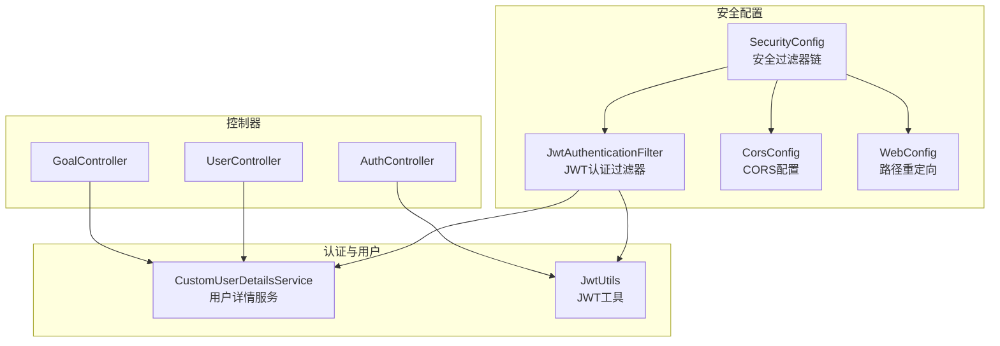
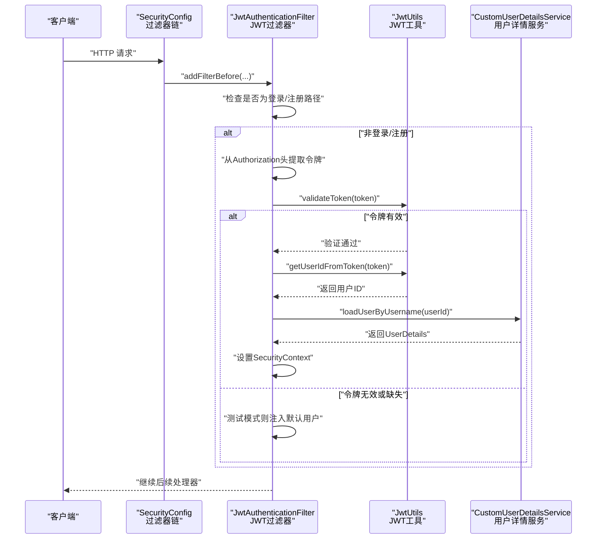
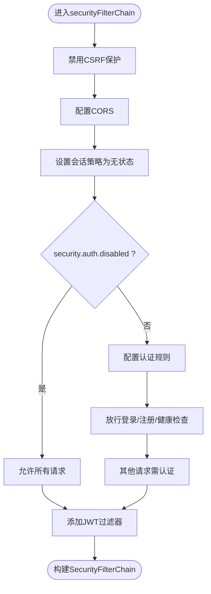
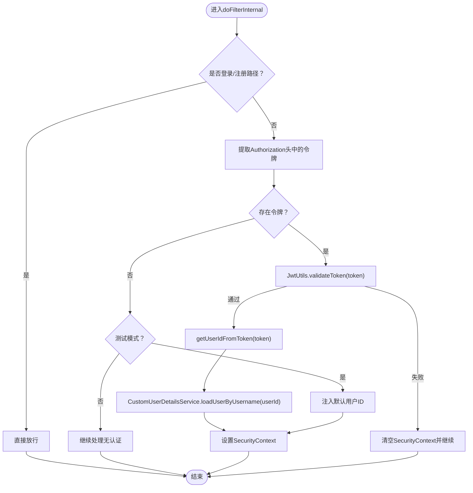
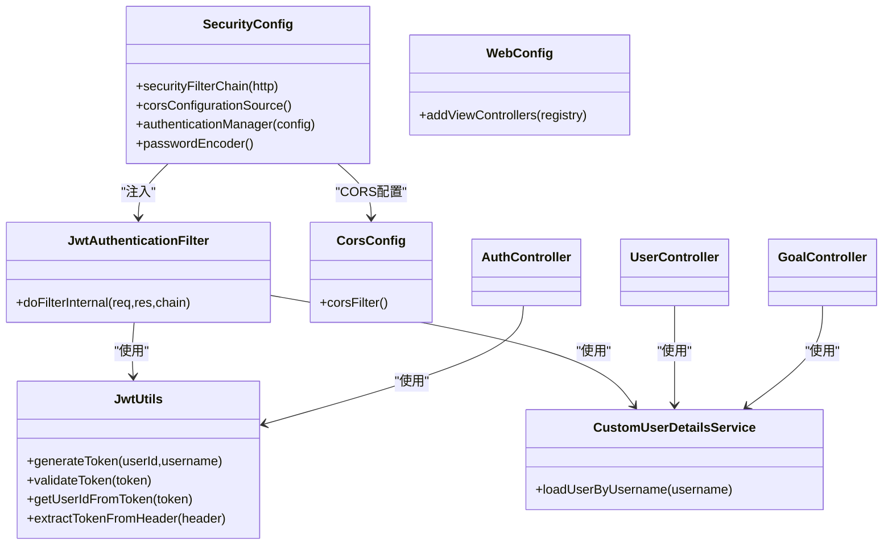

# 访问控制策略

<cite>
**本文引用的文件**
- [SecurityConfig.java](file://src/main/java/com/crazydream/security/SecurityConfig.java)
- [JwtAuthenticationFilter.java](file://src/main/java/com/crazydream/security/JwtAuthenticationFilter.java)
- [CustomUserDetailsService.java](file://src/main/java/com/crazydream/security/CustomUserDetailsService.java)
- [JwtUtils.java](file://src/main/java/com/crazydream/utils/JwtUtils.java)
- [application.yml](file://src/main/resources/application.yml)
- [application-prod.yml](file://src/main/resources/application-prod.yml)
- [application-dev.yml](file://src/main/resources/application-dev.yml)
- [application-test.yml](file://src/main/resources/application-test.yml)
- [CorsConfig.java](file://src/main/java/com/crazydream/config/CorsConfig.java)
- [WebConfig.java](file://src/main/java/com/crazydream/config/WebConfig.java)
- [AuthController.java](file://src/main/java/com/crazydream/interfaces/auth/AuthController.java)
- [UserController.java](file://src/main/java/com/crazydream/interfaces/user/UserController.java)
- [GoalController.java](file://src/main/java/com/crazydream/interfaces/goal/GoalController.java)
</cite>

## 目录
1. [简介](#简介)
2. [项目结构](#项目结构)
3. [核心组件](#核心组件)
4. [架构总览](#架构总览)
5. [详细组件分析](#详细组件分析)
6. [依赖关系分析](#依赖关系分析)
7. [性能考量](#性能考量)
8. [故障排查指南](#故障排查指南)
9. [结论](#结论)
10. [附录](#附录)

## 简介
本文件系统性阐述本项目的访问控制策略与实现，涵盖基于注解的权限验证、URL 路径匹配、安全过滤器链配置（含 CSRF 禁用、CORS 配置、会话管理）、不同环境的安全策略差异（开发/测试/生产），以及权限注解的使用方法与安全防护实践。文档以代码为依据，辅以可视化图示，帮助读者快速理解并正确使用系统的安全机制。

## 项目结构
围绕访问控制的关键模块分布如下：
- 安全配置与过滤器链：SecurityConfig、JwtAuthenticationFilter、CorsConfig、WebConfig
- 认证与用户细节：CustomUserDetailsService、JwtUtils
- 控制器层：AuthController、UserController、GoalController（展示如何从安全上下文获取当前用户）
- 环境配置：application.yml、application-dev.yml、application-test.yml、application-prod.yml

图表来源
- [SecurityConfig.java](file://src/main/java/com/crazydream/security/SecurityConfig.java#L55-L91)
- [JwtAuthenticationFilter.java](file://src/main/java/com/crazydream/security/JwtAuthenticationFilter.java#L48-L127)
- [CorsConfig.java](file://src/main/java/com/crazydream/config/CorsConfig.java#L24-L52)
- [WebConfig.java](file://src/main/java/com/crazydream/config/WebConfig.java#L10-L17)
- [CustomUserDetailsService.java](file://src/main/java/com/crazydream/security/CustomUserDetailsService.java#L24-L62)
- [JwtUtils.java](file://src/main/java/com/crazydream/utils/JwtUtils.java#L29-L165)
- [AuthController.java](file://src/main/java/com/crazydream/interfaces/auth/AuthController.java#L17-L61)
- [UserController.java](file://src/main/java/com/crazydream/interfaces/user/UserController.java#L14-L118)
- [GoalController.java](file://src/main/java/com/crazydream/interfaces/goal/GoalController.java#L26-L71)

章节来源
- [SecurityConfig.java](file://src/main/java/com/crazydream/security/SecurityConfig.java#L32-L105)
- [application.yml](file://src/main/resources/application.yml#L65-L75)

## 核心组件
- 安全过滤器链：统一配置 CSRF 禁用、CORS、会话策略，并按环境动态启用/禁用认证。
- JWT 认证过滤器：拦截请求，解析 Authorization 头中的 JWT，校验并注入认证上下文；测试模式下可注入默认用户。
- 用户详情服务：根据用户 ID 加载用户信息，供认证流程使用。
- JWT 工具：生成与验证令牌、解析用户信息、从请求头提取令牌。
- CORS 配置：允许凭证、通配方法与头，对 /api/** 应用。
- Web 配置：将旧路径重定向至新路径，保证兼容性。
- 控制器层：通过 SecurityContextHolder 获取当前用户 ID，实现业务逻辑的用户绑定。

章节来源
- [SecurityConfig.java](file://src/main/java/com/crazydream/security/SecurityConfig.java#L54-L91)
- [JwtAuthenticationFilter.java](file://src/main/java/com/crazydream/security/JwtAuthenticationFilter.java#L48-L127)
- [CustomUserDetailsService.java](file://src/main/java/com/crazydream/security/CustomUserDetailsService.java#L32-L61)
- [JwtUtils.java](file://src/main/java/com/crazydream/utils/JwtUtils.java#L56-L165)
- [CorsConfig.java](file://src/main/java/com/crazydream/config/CorsConfig.java#L24-L52)
- [WebConfig.java](file://src/main/java/com/crazydream/config/WebConfig.java#L10-L17)
- [UserController.java](file://src/main/java/com/crazydream/interfaces/user/UserController.java#L101-L118)
- [GoalController.java](file://src/main/java/com/crazydream/interfaces/goal/GoalController.java#L41-L71)

## 架构总览
下图展示了请求从进入系统到完成鉴权与授权的整体流程，包括 CSRF、CORS、会话策略、JWT 过滤器与用户详情服务的协作。

图表来源
- [SecurityConfig.java](file://src/main/java/com/crazydream/security/SecurityConfig.java#L55-L91)
- [JwtAuthenticationFilter.java](file://src/main/java/com/crazydream/security/JwtAuthenticationFilter.java#L48-L127)
- [JwtUtils.java](file://src/main/java/com/crazydream/utils/JwtUtils.java#L113-L125)
- [CustomUserDetailsService.java](file://src/main/java/com/crazydream/security/CustomUserDetailsService.java#L32-L61)

## 详细组件分析

### 安全过滤器链与路径匹配
- CSRF 禁用：出于无状态 API 设计，显式禁用 CSRF 保护。
- CORS 配置：通过 corsConfigurationSource() 提供全局 CORS 规则，允许凭证、通配方法与头。
- 会话管理：设置为无状态（STATELESS），避免服务端维护会话。
- 动态认证规则：
  - 测试模式（security.auth.disabled=true）：允许所有请求，但仍注入 JWT 过滤器以解析 token。
  - 生产模式（security.auth.disabled=false）：对特定公开路径（登录/注册/健康检查）放行，其余接口均需认证。
- 登录/注册路径兼容：同时支持新旧路径，便于迁移。

图表来源
- [SecurityConfig.java](file://src/main/java/com/crazydream/security/SecurityConfig.java#L55-L91)

章节来源
- [SecurityConfig.java](file://src/main/java/com/crazydream/security/SecurityConfig.java#L54-L91)
- [application.yml](file://src/main/resources/application.yml#L65-L75)
- [application-prod.yml](file://src/main/resources/application-prod.yml#L11-L14)

### JWT 认证过滤器
- 登录/注册路径直接放行，避免重复认证。
- 从 Authorization 头提取令牌前缀，调用 JwtUtils.validateToken 校验。
- 成功后通过 JwtUtils.getUserIdFromToken 获取用户 ID，再由 CustomUserDetailsService 加载用户详情，构造认证令牌并写入 SecurityContext。
- 测试模式下若无令牌，注入默认用户 ID，便于本地联调。

图表来源
- [JwtAuthenticationFilter.java](file://src/main/java/com/crazydream/security/JwtAuthenticationFilter.java#L48-L127)
- [JwtUtils.java](file://src/main/java/com/crazydream/utils/JwtUtils.java#L113-L125)
- [CustomUserDetailsService.java](file://src/main/java/com/crazydream/security/CustomUserDetailsService.java#L32-L61)

章节来源
- [JwtAuthenticationFilter.java](file://src/main/java/com/crazydream/security/JwtAuthenticationFilter.java#L48-L127)

### 用户详情服务
- 将 username 视作用户 ID，尝试解析为 Long 并从仓储查询用户。
- 返回 Spring Security 的 UserDetails 对象（密码字段可为空，因采用 JWT）。
- 异常场景抛出 UsernameNotFoundException，交由上层处理。

章节来源
- [CustomUserDetailsService.java](file://src/main/java/com/crazydream/security/CustomUserDetailsService.java#L32-L61)

### JWT 工具
- 生成令牌：包含用户 ID 与用户名，设置签发时间与过期时间。
- 验证令牌：使用对称密钥验证签名，捕获异常并返回失败。
- 解析与提取：从令牌中读取用户 ID/用户名，从请求头中提取令牌值。

章节来源
- [JwtUtils.java](file://src/main/java/com/crazydream/utils/JwtUtils.java#L56-L165)

### CORS 配置
- 允许来源、方法、头均为通配，允许携带凭证。
- 暴露 Authorization 与 X-Total-Count 响应头，便于前端获取令牌与分页总数。
- 对 /api/** 应用该配置。

章节来源
- [CorsConfig.java](file://src/main/java/com/crazydream/config/CorsConfig.java#L24-L52)

### Web 配置与路径重定向
- 将旧的 /auth/login 与 /auth/register 重定向到新的 /api/auth/login 与 /api/auth/register，提升兼容性。

章节来源
- [WebConfig.java](file://src/main/java/com/crazydream/config/WebConfig.java#L10-L17)

### 控制器层的用户识别
- 通过 SecurityContextHolder 获取当前认证信息，支持多种 principal 类型（User、Long、String），并处理 anonymousUser 场景。
- 在业务方法中读取当前用户 ID，确保操作的用户边界。

章节来源
- [UserController.java](file://src/main/java/com/crazydream/interfaces/user/UserController.java#L101-L118)
- [GoalController.java](file://src/main/java/com/crazydream/interfaces/goal/GoalController.java#L41-L71)

### 权限注解使用说明
- 本项目已启用方法级安全（@EnableMethodSecurity），但当前未在业务层使用 @PreAuthorize、@PostAuthorize 或 @Secured 注解。
- 若需在服务层进行方法级权限控制，可在相应服务方法上添加注解，并确保方法可见性与代理生效。
- 建议结合业务角色与资源边界设计细粒度权限表达式。

章节来源
- [SecurityConfig.java](file://src/main/java/com/crazydream/security/SecurityConfig.java#L34)

## 依赖关系分析
- SecurityConfig 依赖 JwtAuthenticationFilter、CorsConfigurationSource、AuthenticationManager、PasswordEncoder。
- JwtAuthenticationFilter 依赖 JwtUtils、UserDetailsService、配置项（security.auth.disabled、security.test.default-user-id）。
- CustomUserDetailsService 依赖 UserRepository。
- JwtUtils 依赖配置项（jwt.secret、jwt.expiration、jwt.header、jwt.prefix）。
- 控制器层通过 SecurityContextHolder 获取当前用户，间接依赖 Security 上下文。

图表来源
- [SecurityConfig.java](file://src/main/java/com/crazydream/security/SecurityConfig.java#L32-L105)
- [JwtAuthenticationFilter.java](file://src/main/java/com/crazydream/security/JwtAuthenticationFilter.java#L29-L129)
- [CustomUserDetailsService.java](file://src/main/java/com/crazydream/security/CustomUserDetailsService.java#L24-L63)
- [JwtUtils.java](file://src/main/java/com/crazydream/utils/JwtUtils.java#L29-L165)
- [CorsConfig.java](file://src/main/java/com/crazydream/config/CorsConfig.java#L16-L53)
- [WebConfig.java](file://src/main/java/com/crazydream/config/WebConfig.java#L9-L17)
- [AuthController.java](file://src/main/java/com/crazydream/interfaces/auth/AuthController.java#L17-L61)
- [UserController.java](file://src/main/java/com/crazydream/interfaces/user/UserController.java#L14-L118)
- [GoalController.java](file://src/main/java/com/crazydream/interfaces/goal/GoalController.java#L26-L71)

## 性能考量
- 无状态会话：STATELESS 策略降低服务端会话存储开销，适合水平扩展。
- JWT 校验：validateToken 为轻量级签名验证，建议合理设置过期时间以平衡安全性与性能。
- 过滤器链顺序：JWT 过滤器位于用户名密码过滤器之前，避免重复认证与多余开销。
- CORS 通配：在生产环境建议收敛 allowedOriginPattern 以减少预检请求成本。

[本节为通用指导，不直接分析具体文件]

## 故障排查指南
- 令牌无效或过期
  - 现象：JwtUtils.validateToken 返回失败，SecurityContext 未设置。
  - 排查：确认 jwt.secret 一致、时间同步、令牌未过期；检查请求头 Authorization 前缀与值。
  - 参考
    - [JwtUtils.java](file://src/main/java/com/crazydream/utils/JwtUtils.java#L113-L125)
- 未设置认证上下文
  - 现象：控制器读取不到当前用户 ID。
  - 排查：确认 JwtAuthenticationFilter 是否被正确加入过滤器链；检查登录/注册路径是否被放行；测试模式下是否注入默认用户。
  - 参考
    - [SecurityConfig.java](file://src/main/java/com/crazydream/security/SecurityConfig.java#L74-L88)
    - [JwtAuthenticationFilter.java](file://src/main/java/com/crazydream/security/JwtAuthenticationFilter.java#L48-L127)
- 用户不存在
  - 现象：CustomUserDetailsService 抛出 UsernameNotFoundException。
  - 排查：确认用户 ID 合法且存在；检查用户仓储查询逻辑。
  - 参考
    - [CustomUserDetailsService.java](file://src/main/java/com/crazydream/security/CustomUserDetailsService.java#L32-L61)
- CORS 问题
  - 现象：浏览器跨域失败或预检失败。
  - 排查：确认 allowedOriginPattern、allowedMethod、allowedHeader、allowCredentials 设置；核对暴露头是否包含 Authorization。
  - 参考
    - [CorsConfig.java](file://src/main/java/com/crazydream/config/CorsConfig.java#L24-L52)
- 环境配置差异
  - 现象：测试环境与生产环境行为不一致。
  - 排查：确认 security.auth.disabled 与 security.test.default-user-id 的值；核对各 profile 的 application-*.yml。
  - 参考
    - [application.yml](file://src/main/resources/application.yml#L65-L75)
    - [application-prod.yml](file://src/main/resources/application-prod.yml#L11-L14)

章节来源
- [JwtUtils.java](file://src/main/java/com/crazydream/utils/JwtUtils.java#L113-L125)
- [JwtAuthenticationFilter.java](file://src/main/java/com/crazydream/security/JwtAuthenticationFilter.java#L48-L127)
- [CustomUserDetailsService.java](file://src/main/java/com/crazydream/security/CustomUserDetailsService.java#L32-L61)
- [CorsConfig.java](file://src/main/java/com/crazydream/config/CorsConfig.java#L24-L52)
- [application.yml](file://src/main/resources/application.yml#L65-L75)
- [application-prod.yml](file://src/main/resources/application-prod.yml#L11-L14)

## 结论
本项目采用无状态 JWT 认证与 Spring Security 过滤器链实现统一访问控制，结合动态环境配置实现开发/测试/生产的差异化策略。通过 CORS 与路径重定向提升兼容性与可用性。当前未启用方法级权限注解，如需更细粒度的授权控制，可在服务层引入 @PreAuthorize/@PostAuthorize/@Secured 并完善权限表达式。

[本节为总结性内容，不直接分析具体文件]

## 附录

### 不同环境的安全配置要点
- 开发环境（dev）
  - 复用 application.yml 的本地配置，默认开启调试日志。
  - 参考
    - [application-dev.yml](file://src/main/resources/application-dev.yml#L1-L5)
- 测试环境（test）
  - 复用 application.yml 的默认配置；可通过 application-test.yml 覆盖日志级别或数据源。
  - 参考
    - [application-test.yml](file://src/main/resources/application-test.yml#L1-L5)
- 生产环境（prod）
  - 降低日志级别；关闭测试模式（security.auth.disabled=false）。
  - 参考
    - [application-prod.yml](file://src/main/resources/application-prod.yml#L6-L14)

### URL 路径匹配与公开接口
- 放行路径（无需认证）
  - /api/auth/register, /api/auth/login, /auth/register, /auth/login
  - /api/v2/auth/register, /api/v2/auth/login
  - /health
- 其余接口均需认证
- 参考
  - [SecurityConfig.java](file://src/main/java/com/crazydream/security/SecurityConfig.java#L76-L84)
  - [WebConfig.java](file://src/main/java/com/crazydream/config/WebConfig.java#L10-L17)

### 权限注解使用建议
- 方法级权限控制
  - 在服务层方法上使用 @PreAuthorize、@PostAuthorize 或 @Secured。
  - 示例参考路径
    - [SecurityConfig.java](file://src/main/java/com/crazydream/security/SecurityConfig.java#L34)
- 表达式设计
  - 结合 SpEL 表达式与 Spring Security 的元数据（如角色、变量）设计细粒度授权。
  - 示例参考路径
    - [UserController.java](file://src/main/java/com/crazydream/interfaces/user/UserController.java#L101-L118)
    - [GoalController.java](file://src/main/java/com/crazydream/interfaces/goal/GoalController.java#L41-L71)

### 安全漏洞防护与输入验证
- 输入验证
  - 控制器层对参数进行基本校验，异常时返回明确错误码与消息。
  - 参考
    - [AuthController.java](file://src/main/java/com/crazydream/interfaces/auth/AuthController.java#L26-L61)
    - [UserController.java](file://src/main/java/com/crazydream/interfaces/user/UserController.java#L26-L118)
    - [GoalController.java](file://src/main/java/com/crazydream/interfaces/goal/GoalController.java#L76-L288)
- 访问日志
  - 过滤器与控制器中广泛使用 SLF4J 记录请求 URI、用户 ID、认证状态等，便于审计与排障。
  - 参考
    - [JwtAuthenticationFilter.java](file://src/main/java/com/crazydream/security/JwtAuthenticationFilter.java#L54-L127)
    - [AuthController.java](file://src/main/java/com/crazydream/interfaces/auth/AuthController.java#L26-L61)
    - [application.yml](file://src/main/resources/application.yml#L41-L45)