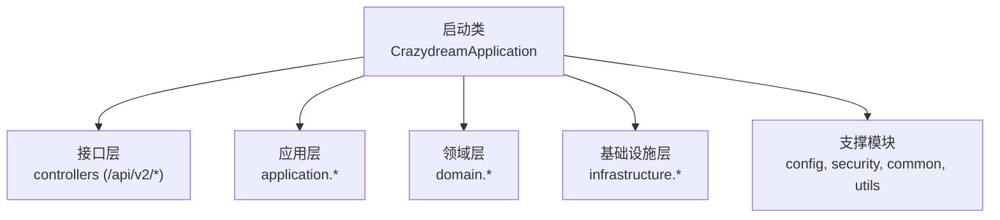
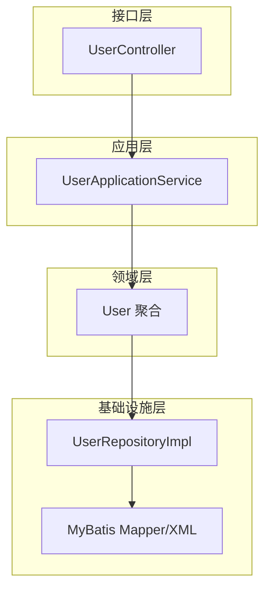
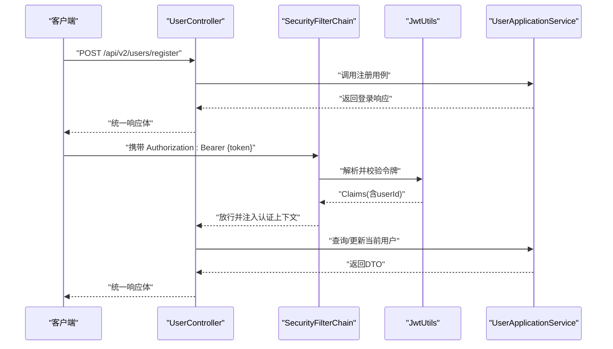
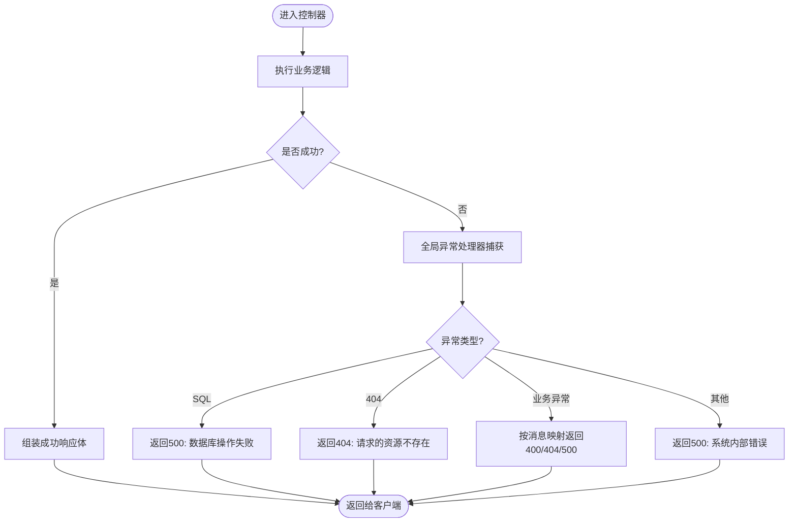
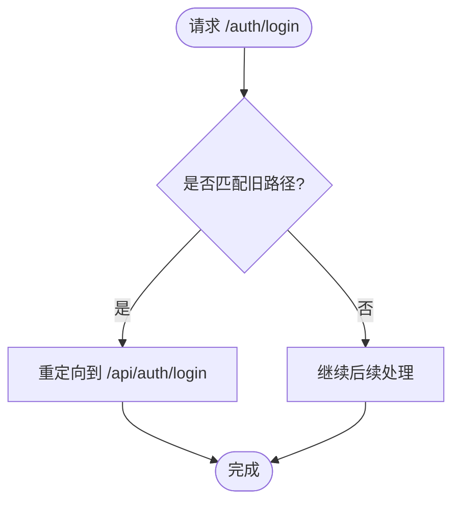
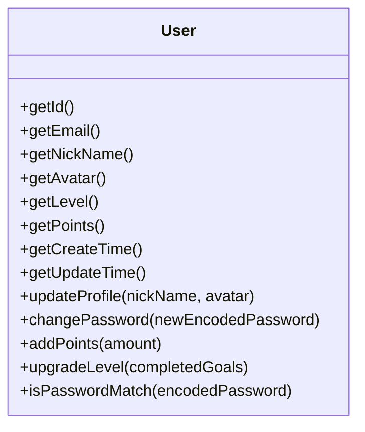
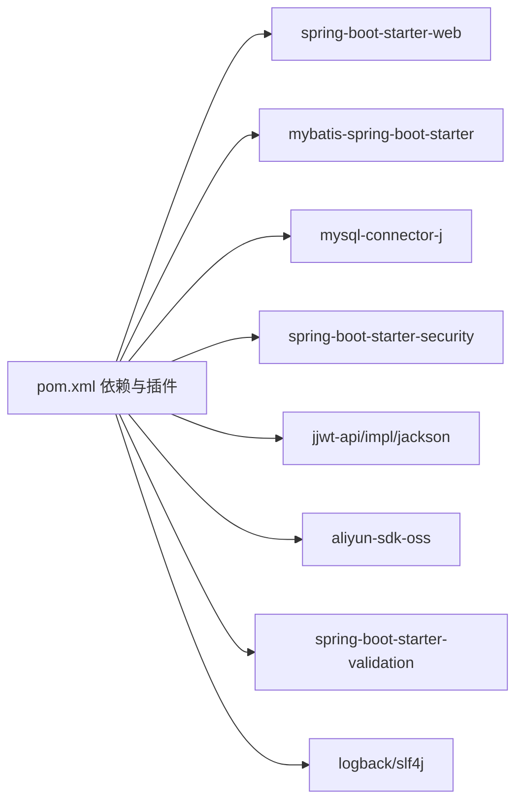

# 开发指南

<cite>
**本文引用的文件**
- [README.md](file://README.md)
- [pom.xml](file://pom.xml)
- [application.yml](file://src/main/resources/application.yml)
- [application-dev.yml](file://src/main/resources/application-dev.yml)
- [application-prod.yml](file://src/main/resources/application-prod.yml)
- [CrazydreamApplication.java](file://src/main/java/com/crazydream/CrazydreamApplication.java)
- [SecurityConfig.java](file://src/main/java/com/crazydream/security/SecurityConfig.java)
- [WebConfig.java](file://src/main/java/com/crazydream/config/WebConfig.java)
- [CorsConfig.java](file://src/main/java/com/crazydream/config/CorsConfig.java)
- [GlobalExceptionHandler.java](file://src/main/java/com/crazydream/config/GlobalExceptionHandler.java)
- [UserController.java](file://src/main/java/com/crazydream/interfaces/user/UserController.java)
- [User.java](file://src/main/java/com/crazydream/domain/user/model/aggregate/User.java)
- [ApiResponse.java](file://src/main/java/com/crazydream/common/ApiResponse.java)
- [JwtUtils.java](file://src/main/java/com/crazydream/utils/JwtUtils.java)
</cite>

## 目录
1. [简介](#简介)
2. [项目结构](#项目结构)
3. [核心组件](#核心组件)
4. [架构总览](#架构总览)
5. [详细组件分析](#详细组件分析)
6. [依赖分析](#依赖分析)
7. [性能考虑](#性能考虑)
8. [故障排查指南](#故障排查指南)
9. [结论](#结论)
10. [附录](#附录)

## 简介
本开发指南面向新加入的开发者，提供从环境搭建、IDE 配置、代码规范、Git 工作流到调试与性能优化的全流程指引。项目基于 Spring Boot 3.2.0 + MyBatis 的 DDD + COLA 四层架构，提供用户、目标、子目标、分类、成就与统计等模块，支持 JWT 认证、CORS、统一异常处理与多环境配置。

## 项目结构
- 启动类位于应用根包，扫描 Mapper 并启动 Spring Boot 应用。
- 接口层（/api/v2/*）通过控制器暴露 REST API。
- 应用层负责用例编排与 DTO。
- 领域层包含聚合、值对象与领域服务。
- 基础设施层实现 Repository 与外部系统适配（如 OSS）。
- 支撑模块包括配置、安全、公共返回体与工具类。

**图表来源**
- [CrazydreamApplication.java](file://src/main/java/com/crazydream/CrazydreamApplication.java#L14-L27)
- [README.md](file://README.md#L62-L71)

**章节来源**
- [README.md](file://README.md#L62-L85)
- [CrazydreamApplication.java](file://src/main/java/com/crazydream/CrazydreamApplication.java#L14-L27)

## 核心组件
- 统一响应体：封装 code、message、data，提供 success/fail 工厂方法。
- 全局异常处理：集中处理 SQL、404、运行时异常与未知异常。
- 安全配置：无状态 JWT、CORS、开放注册/登录/健康检查路径。
- Web 配置：旧路径重定向至新路径，保证兼容性。
- JWT 工具：生成、解析、校验令牌，提取用户信息与头部前缀。
- 用户聚合：用户实体的业务行为（更新资料、改密、加积分、升级等级）。

**章节来源**
- [ApiResponse.java](file://src/main/java/com/crazydream/common/ApiResponse.java#L12-L108)
- [GlobalExceptionHandler.java](file://src/main/java/com/crazydream/config/GlobalExceptionHandler.java#L14-L61)
- [SecurityConfig.java](file://src/main/java/com/crazydream/security/SecurityConfig.java#L32-L105)
- [WebConfig.java](file://src/main/java/com/crazydream/config/WebConfig.java#L9-L18)
- [JwtUtils.java](file://src/main/java/com/crazydream/utils/JwtUtils.java#L29-L165)
- [User.java](file://src/main/java/com/crazydream/domain/user/model/aggregate/User.java#L12-L122)

## 架构总览
系统采用 DDD + COLA 四层架构，接口层负责请求适配与 DTO 组装；应用层编排用例与事务；领域层承载业务规则；基础设施层实现持久化与外部系统适配。

**图表来源**
- [UserController.java](file://src/main/java/com/crazydream/interfaces/user/UserController.java#L14-L132)
- [User.java](file://src/main/java/com/crazydream/domain/user/model/aggregate/User.java#L12-L122)

## 详细组件分析

### 安全与认证组件
- 安全配置：禁用 CSRF、启用 CORS、无状态会话；根据开关决定是否放行全部请求或按路径鉴权；注册/登录/健康检查放行。
- JWT 工具：从请求头提取令牌、解析载荷、校验签名与过期；提供用户 ID 与用户名提取。
- 用户控制器：从认证上下文解析当前用户 ID，支持测试默认用户回退。

**图表来源**
- [SecurityConfig.java](file://src/main/java/com/crazydream/security/SecurityConfig.java#L54-L91)
- [JwtUtils.java](file://src/main/java/com/crazydream/utils/JwtUtils.java#L78-L138)
- [UserController.java](file://src/main/java/com/crazydream/interfaces/user/UserController.java#L26-L132)

**章节来源**
- [SecurityConfig.java](file://src/main/java/com/crazydream/security/SecurityConfig.java#L32-L105)
- [JwtUtils.java](file://src/main/java/com/crazydream/utils/JwtUtils.java#L29-L165)
- [UserController.java](file://src/main/java/com/crazydream/interfaces/user/UserController.java#L14-L132)

### 统一响应与异常处理
- 统一响应体：success/fail 工厂方法，确保前后端一致的数据结构。
- 全局异常处理：对 SQL、404、特定运行时异常进行分类处理，返回相应状态码与消息。

**图表来源**
- [ApiResponse.java](file://src/main/java/com/crazydream/common/ApiResponse.java#L45-L107)
- [GlobalExceptionHandler.java](file://src/main/java/com/crazydream/config/GlobalExceptionHandler.java#L22-L60)

**章节来源**
- [ApiResponse.java](file://src/main/java/com/crazydream/common/ApiResponse.java#L12-L108)
- [GlobalExceptionHandler.java](file://src/main/java/com/crazydream/config/GlobalExceptionHandler.java#L14-L61)

### CORS 与路径重定向
- CORS：允许任意来源、方法与头，暴露必要响应头，对 /api/** 生效。
- Web 配置：将旧路径 /auth/login、/auth/register 重定向到新路径 /api/auth/login、/api/auth/register。

**图表来源**
- [CorsConfig.java](file://src/main/java/com/crazydream/config/CorsConfig.java#L24-L53)
- [WebConfig.java](file://src/main/java/com/crazydream/config/WebConfig.java#L12-L16)

**章节来源**
- [CorsConfig.java](file://src/main/java/com/crazydream/config/CorsConfig.java#L16-L53)
- [WebConfig.java](file://src/main/java/com/crazydream/config/WebConfig.java#L9-L18)

### 用户聚合与业务行为
- 用户聚合：包含用户标识、邮箱、昵称、头像、等级、积分、时间戳等；提供更新资料、改密、加积分、升级等级等业务方法。
- 值对象：邮箱、昵称、等级等作为不可变或受控变更的值对象，保障领域一致性。

**图表来源**
- [User.java](file://src/main/java/com/crazydream/domain/user/model/aggregate/User.java#L12-L122)

**章节来源**
- [User.java](file://src/main/java/com/crazydream/domain/user/model/aggregate/User.java#L12-L122)

## 依赖分析
- 构建工具：Maven，Java 17，MyBatis 3.0.3，Lombok 1.18.30。
- 运行时依赖：Spring Boot Web、MyBatis、MySQL 驱动、Spring Security、JWT、OSS SDK、校验、日志。
- 编译插件：Lombok 注解处理器、Spring Boot Maven 插件、MyBatis Generator。

**图表来源**
- [pom.xml](file://pom.xml#L24-L118)

**章节来源**
- [pom.xml](file://pom.xml#L18-L118)

## 性能考虑
- 数据库连接与 SQL：开启驼峰映射，合理使用索引；避免 N+1 查询；批量操作时减少往返。
- 缓存策略：对热点读取（如用户资料、分类列表）引入缓存；注意缓存与数据库的一致性。
- 日志级别：生产环境降低日志级别，避免高频写入影响性能。
- 文件上传：限制最大文件大小与并发；OSS 上传采用分片与断点续传（如需）。
- 并发与线程：无状态接口与 JWT 无会话设计，有利于水平扩展。

## 故障排查指南
- 404 资源不存在：确认路径是否正确，是否已重定向；检查控制器是否存在。
- SQL 异常：检查数据库连接、SQL 语句与表结构；查看日志定位具体异常。
- 认证失败：确认 Authorization 头格式是否为 Bearer {token}；检查 JWT 密钥与过期时间；核对安全配置是否放行相关路径。
- CORS 问题：确认允许的来源、方法与头；检查暴露头是否包含必要的响应头。
- 本地开发与生产差异：通过环境变量覆盖敏感配置；切换 profiles.active。

**章节来源**
- [GlobalExceptionHandler.java](file://src/main/java/com/crazydream/config/GlobalExceptionHandler.java#L22-L60)
- [SecurityConfig.java](file://src/main/java/com/crazydream/security/SecurityConfig.java#L54-L91)
- [CorsConfig.java](file://src/main/java/com/crazydream/config/CorsConfig.java#L24-L53)
- [application.yml](file://src/main/resources/application.yml#L10-L75)

## 结论
本指南提供了从环境搭建到日常开发与运维的完整路径。遵循 DDD 分层与 COLA 设计原则、统一响应与异常处理、JWT 无状态认证与 CORS 配置，有助于保持代码清晰、可维护与高性能。建议在开发中坚持单元测试与 API 测试，持续关注日志与性能指标。

## 附录

### 开发环境搭建
- 前置条件：JDK 17+、MySQL 8.0+、Maven 3.8+、Git。
- 数据库：创建数据库并配置 application.yml 中的 datasource。
- OSS（可选）：在 application.yml 中配置 aliyun.oss.*。
- 构建与运行：mvn clean install、mvn spring-boot:run 或打包后 java -jar。
- 验证：访问 http://localhost:8080/api。

**章节来源**
- [README.md](file://README.md#L87-L157)
- [application.yml](file://src/main/resources/application.yml#L10-L75)

### IDE 配置与代码规范
- 语言与框架：Java 17、Spring Boot 3.2、MyBatis、Lombok。
- 规范要点：遵循 Java 编码规范；使用 Lombok 简化样板代码；为公共类与复杂方法添加注释；为 DTO/VO 命名清晰、职责单一。
- 注释标准：类与方法添加简要说明；复杂逻辑补充注释；异常与边界条件明确注释。
- 格式化：统一使用项目风格（推荐使用 IDE 的代码格式化快捷键与保存时格式化）；保持缩进与空行一致。

**章节来源**
- [README.md](file://README.md#L237-L266)
- [pom.xml](file://pom.xml#L18-L22)

### Git 工作流与分支策略
- 分支策略：主分支保护，特性开发在 feature/*，修复在 fix/*，热修复在 hotfix/*。
- 提交规范：语义化提交信息，描述做什么、为什么做；关联 Issue。
- Pull Request：PR 描述清晰，包含需求背景、改动范围、测试要点与风险提示；至少一次代码审查与 CI 通过。

**章节来源**
- [README.md](file://README.md#L239-L246)

### 调试技巧
- 启动参数：通过环境变量覆盖敏感配置（如数据库、JWT、OSS）。
- 日志：开发环境 DEBUG，生产环境 INFO/WARN；结合统一异常处理定位问题。
- 断点与单测：先写单元测试，再断点调试；对关键链路（控制器 → 应用层 → 领域 → 基础设施）逐步验证。
- 性能：使用性能测试脚本与负载测试，观察慢查询与热点接口。

**章节来源**
- [application.yml](file://src/main/resources/application.yml#L10-L75)
- [README.md](file://README.md#L202-L211)

### 配置文件说明
- application.yml：基础配置（数据库、文件上传、MyBatis、日志、OSS、JWT、安全开关）。
- application-dev.yml：开发环境覆盖（可为空，默认复用本地配置）。
- application-prod.yml：生产环境覆盖（日志级别、关闭安全开关）。

**章节来源**
- [application.yml](file://src/main/resources/application.yml#L1-L75)
- [application-dev.yml](file://src/main/resources/application-dev.yml#L1-L5)
- [application-prod.yml](file://src/main/resources/application-prod.yml#L1-L14)