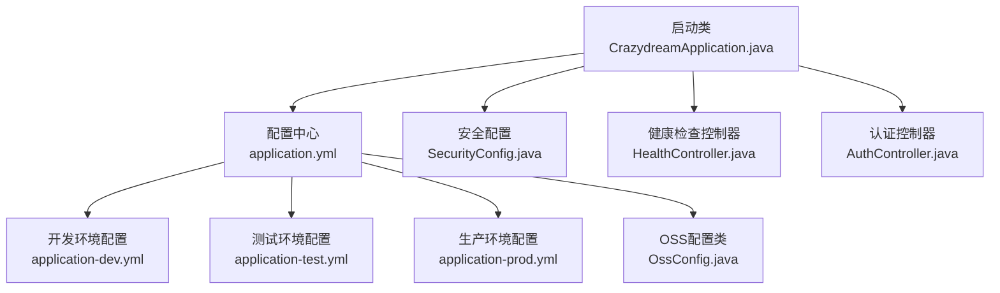
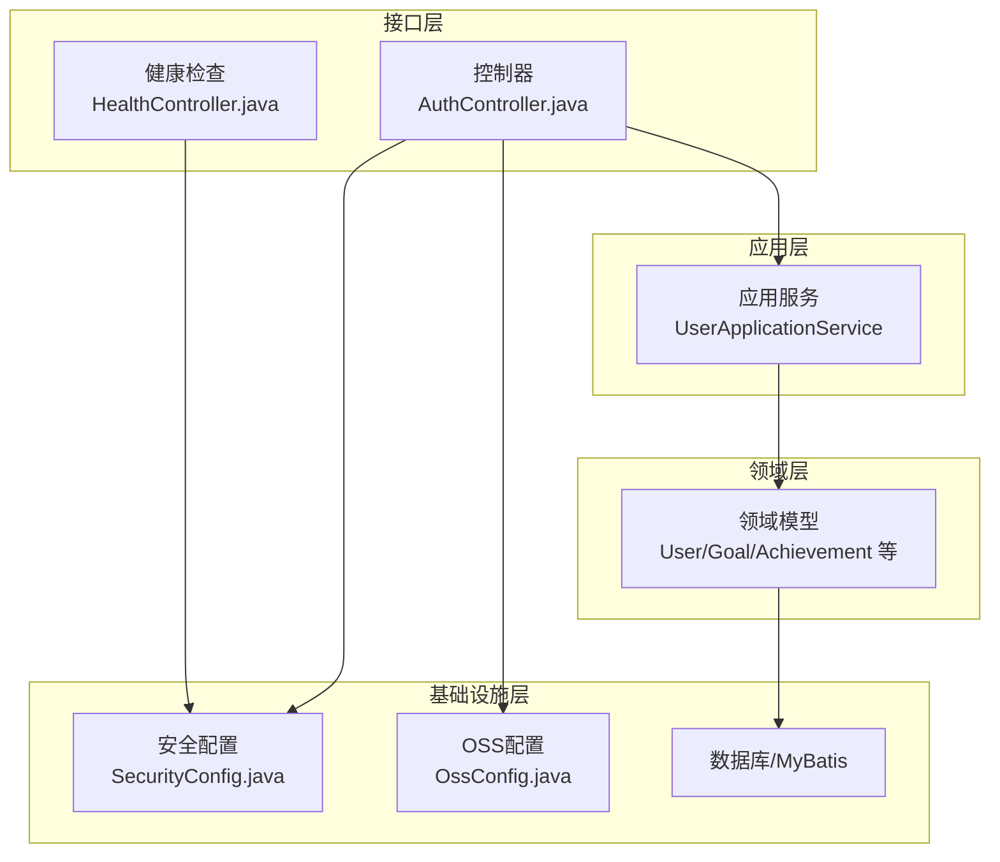
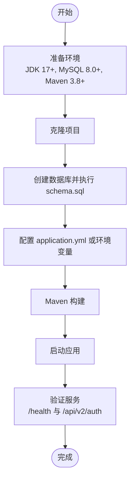
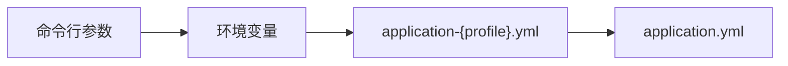
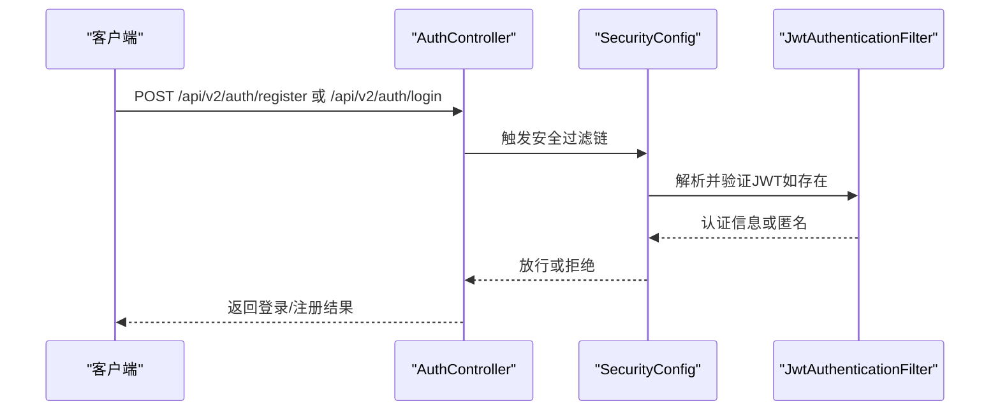
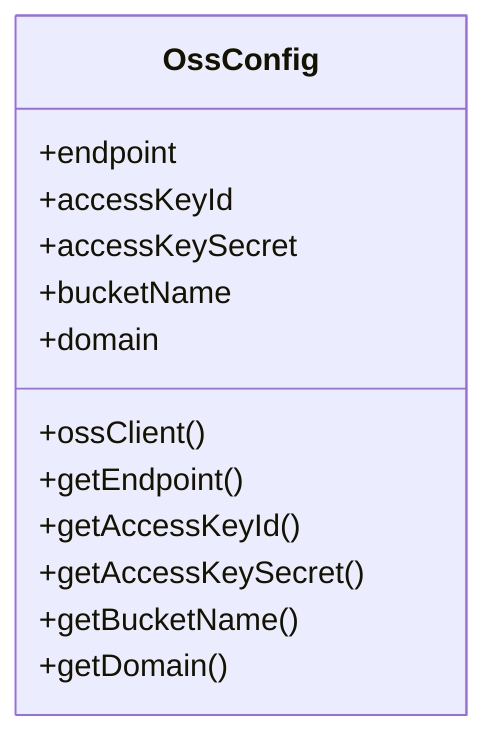
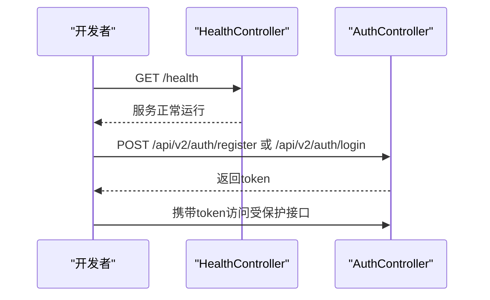
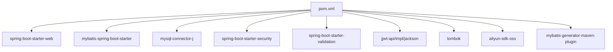

# 快速开始

<cite>
**本文引用的文件**
- [README.md](file://README.md)
- [DEPLOYMENT.md](file://DEPLOYMENT.md)
- [pom.xml](file://pom.xml)
- [application.yml](file://src/main/resources/application.yml)
- [application-dev.yml](file://src/main/resources/application-dev.yml)
- [application-test.yml](file://src/main/resources/application-test.yml)
- [application-prod.yml](file://src/main/resources/application-prod.yml)
- [.env.example](file://.env.example)
- [schema.sql](file://src/main/resources/schema.sql)
- [OssConfig.java](file://src/main/java/com/crazydream/config/OssConfig.java)
- [CrazydreamApplication.java](file://src/main/java/com/crazydream/CrazydreamApplication.java)
- [SecurityConfig.java](file://src/main/java/com/crazydream/security/SecurityConfig.java)
- [HealthController.java](file://src/main/java/com/crazydream/controller/HealthController.java)
- [AuthController.java](file://src/main/java/com/crazydream/interfaces/auth/AuthController.java)
</cite>

## 目录
1. [简介](#简介)
2. [项目结构](#项目结构)
3. [核心组件](#核心组件)
4. [架构总览](#架构总览)
5. [详细组件分析](#详细组件分析)
6. [依赖分析](#依赖分析)
7. [性能注意事项](#性能注意事项)
8. [故障排除指南](#故障排除指南)
9. [结论](#结论)
10. [附录](#附录)

## 简介
CrazyDream 是一个基于 Spring Boot 的后端服务，提供目标管理、子目标追踪、分类管理、成就系统与数据统计能力，并支持用户认证与文件上传（集成阿里云 OSS）。本“快速开始”旨在帮助新开发者在最短时间内完成环境准备、项目克隆、数据库与 OSS 配置、构建与运行，并验证服务可用性。

## 项目结构
- 启动类位于应用根包下，负责扫描 Mapper 与启动 Spring Boot 应用。
- 配置文件按环境拆分：通用配置与多环境配置文件分别存放于资源目录。
- 安全与认证通过 Spring Security + JWT 实现，支持按环境开关认证。
- OSS 配置通过独立配置类加载 application.yml 中的 aliyun.oss 节点。

**图示来源**
- [CrazydreamApplication.java](file://src/main/java/com/crazydream/CrazydreamApplication.java#L14-L25)
- [application.yml](file://src/main/resources/application.yml#L1-L75)
- [application-dev.yml](file://src/main/resources/application-dev.yml#L1-L5)
- [application-test.yml](file://src/main/resources/application-test.yml#L1-L5)
- [application-prod.yml](file://src/main/resources/application-prod.yml#L1-L14)
- [OssConfig.java](file://src/main/java/com/crazydream/config/OssConfig.java#L16-L103)
- [SecurityConfig.java](file://src/main/java/com/crazydream/security/SecurityConfig.java#L32-L105)
- [HealthController.java](file://src/main/java/com/crazydream/controller/HealthController.java#L8-L15)
- [AuthController.java](file://src/main/java/com/crazydream/interfaces/auth/AuthController.java#L17-L61)

**章节来源**
- [CrazydreamApplication.java](file://src/main/java/com/crazydream/CrazydreamApplication.java#L14-L25)
- [application.yml](file://src/main/resources/application.yml#L1-L75)
- [application-dev.yml](file://src/main/resources/application-dev.yml#L1-L5)
- [application-test.yml](file://src/main/resources/application-test.yml#L1-L5)
- [application-prod.yml](file://src/main/resources/application-prod.yml#L1-L14)
- [OssConfig.java](file://src/main/java/com/crazydream/config/OssConfig.java#L16-L103)
- [SecurityConfig.java](file://src/main/java/com/crazydream/security/SecurityConfig.java#L32-L105)
- [HealthController.java](file://src/main/java/com/crazydream/controller/HealthController.java#L8-L15)
- [AuthController.java](file://src/main/java/com/crazydream/interfaces/auth/AuthController.java#L17-L61)

## 核心组件
- 启动类与扫描路径：启动类负责扫描 Mapper 与启动应用。
- 配置体系：application.yml 为主配置，application-{env}.yml 为环境差异化配置；支持通过环境变量覆盖敏感信息。
- 安全与认证：通过 SecurityConfig 配置 CORS、无状态会话与 JWT 过滤链；可通过 security.auth.disabled 控制是否禁用认证。
- OSS 集成：OssConfig 从 application.yml 的 aliyun.oss 节点读取端点、AK、Bucket 等配置。
- 健康检查：/health 接口返回服务运行状态。
- 认证接口：/api/v2/auth/register 与 /api/v2/auth/login 支持注册与登录。

**章节来源**
- [CrazydreamApplication.java](file://src/main/java/com/crazydream/CrazydreamApplication.java#L14-L25)
- [application.yml](file://src/main/resources/application.yml#L1-L75)
- [SecurityConfig.java](file://src/main/java/com/crazydream/security/SecurityConfig.java#L32-L105)
- [OssConfig.java](file://src/main/java/com/crazydream/config/OssConfig.java#L16-L103)
- [HealthController.java](file://src/main/java/com/crazydream/controller/HealthController.java#L8-L15)
- [AuthController.java](file://src/main/java/com/crazydream/interfaces/auth/AuthController.java#L17-L61)

## 架构总览
系统采用 DDD + COLA 四层架构，接口层、应用层、领域层、基础设施层职责清晰；安全层通过 Spring Security + JWT 实现无状态认证；OSS 作为基础设施层的一部分提供文件上传能力。

**图示来源**
- [AuthController.java](file://src/main/java/com/crazydream/interfaces/auth/AuthController.java#L17-L61)
- [HealthController.java](file://src/main/java/com/crazydream/controller/HealthController.java#L8-L15)
- [SecurityConfig.java](file://src/main/java/com/crazydream/security/SecurityConfig.java#L32-L105)
- [OssConfig.java](file://src/main/java/com/crazydream/config/OssConfig.java#L16-L103)

**章节来源**
- [AuthController.java](file://src/main/java/com/crazydream/interfaces/auth/AuthController.java#L17-L61)
- [HealthController.java](file://src/main/java/com/crazydream/controller/HealthController.java#L8-L15)
- [SecurityConfig.java](file://src/main/java/com/crazydream/security/SecurityConfig.java#L32-L105)
- [OssConfig.java](file://src/main/java/com/crazydream/config/OssConfig.java#L16-L103)

## 详细组件分析

### 安装与运行流程
- 环境准备：JDK 17+、MySQL 8.0+、Maven 3.8+、Git（可选）。
- 克隆项目：使用 Git 将仓库克隆至本地。
- 数据库准备：创建数据库与初始化表结构（schema.sql）。
- 配置文件：修改 application.yml 或通过环境变量覆盖敏感配置。
- 构建与运行：使用 Maven 构建并启动应用，或打包后以 jar 方式运行。
- 服务验证：访问 /health 与 /api/v2/auth 接口确认服务可用。

**图示来源**
- [README.md](file://README.md#L87-L156)
- [schema.sql](file://src/main/resources/schema.sql#L1-L111)
- [application.yml](file://src/main/resources/application.yml#L1-L75)
- [HealthController.java](file://src/main/java/com/crazydream/controller/HealthController.java#L8-L15)
- [AuthController.java](file://src/main/java/com/crazydream/interfaces/auth/AuthController.java#L17-L61)

**章节来源**
- [README.md](file://README.md#L87-L156)
- [schema.sql](file://src/main/resources/schema.sql#L1-L111)
- [application.yml](file://src/main/resources/application.yml#L1-L75)
- [HealthController.java](file://src/main/java/com/crazydream/controller/HealthController.java#L8-L15)
- [AuthController.java](file://src/main/java/com/crazydream/interfaces/auth/AuthController.java#L17-L61)

### 配置文件与环境变量
- application.yml：通用配置，包含数据库、OSS、JWT、日志、MyBatis 等。
- application-{dev,test,prod}.yml：按环境覆盖差异化配置。
- .env.example：示例环境变量文件，包含数据库、JWT、OSS 等变量及优先级说明。
- 环境变量优先级：命令行参数 > 环境变量 > application-{profile}.yml > application.yml。

**图示来源**
- [DEPLOYMENT.md](file://DEPLOYMENT.md#L180-L188)
- [.env.example](file://.env.example#L1-L40)
- [application.yml](file://src/main/resources/application.yml#L1-L75)
- [application-dev.yml](file://src/main/resources/application-dev.yml#L1-L5)
- [application-test.yml](file://src/main/resources/application-test.yml#L1-L5)
- [application-prod.yml](file://src/main/resources/application-prod.yml#L1-L14)

**章节来源**
- [DEPLOYMENT.md](file://DEPLOYMENT.md#L162-L188)
- [.env.example](file://.env.example#L1-L40)
- [application.yml](file://src/main/resources/application.yml#L1-L75)
- [application-dev.yml](file://src/main/resources/application-dev.yml#L1-L5)
- [application-test.yml](file://src/main/resources/application-test.yml#L1-L5)
- [application-prod.yml](file://src/main/resources/application-prod.yml#L1-L14)

### 安全与认证流程
- 认证接口：/api/v2/auth/register 与 /api/v2/auth/login。
- 安全策略：无状态会话、CORS 放通、JWT 过滤器；可通过 security.auth.disabled 控制是否禁用认证。
- 测试模式：当 authDisabled=true 时，允许所有请求通过，但仍会解析 JWT（若携带）。

**图示来源**
- [AuthController.java](file://src/main/java/com/crazydream/interfaces/auth/AuthController.java#L17-L61)
- [SecurityConfig.java](file://src/main/java/com/crazydream/security/SecurityConfig.java#L54-L91)

**章节来源**
- [AuthController.java](file://src/main/java/com/crazydream/interfaces/auth/AuthController.java#L17-L61)
- [SecurityConfig.java](file://src/main/java/com/crazydream/security/SecurityConfig.java#L32-L105)

### OSS 配置与文件上传
- OSS 配置类从 application.yml 的 aliyun.oss 节点读取端点、AK、Bucket 等。
- 若未配置 OSS，文件上传功能将不可用；如需使用，需完善 OSS 相关配置。

**图示来源**
- [OssConfig.java](file://src/main/java/com/crazydream/config/OssConfig.java#L16-L103)
- [application.yml](file://src/main/resources/application.yml#L46-L63)

**章节来源**
- [OssConfig.java](file://src/main/java/com/crazydream/config/OssConfig.java#L16-L103)
- [application.yml](file://src/main/resources/application.yml#L46-L63)

### 健康检查与服务验证
- 健康检查接口：/health 返回服务运行状态。
- 认证接口：/api/v2/auth/register 与 /api/v2/auth/login 用于验证认证链路。
- 建议验证步骤：先访问 /health，再调用认证接口获取 token，最后访问受保护接口。

**图示来源**
- [HealthController.java](file://src/main/java/com/crazydream/controller/HealthController.java#L8-L15)
- [AuthController.java](file://src/main/java/com/crazydream/interfaces/auth/AuthController.java#L17-L61)

**章节来源**
- [HealthController.java](file://src/main/java/com/crazydream/controller/HealthController.java#L8-L15)
- [AuthController.java](file://src/main/java/com/crazydream/interfaces/auth/AuthController.java#L17-L61)

## 依赖分析
- 核心技术栈：Spring Boot 3.2.0、MyBatis 3.0.3、MySQL 8.0+、Spring Security、JWT、Lombok、阿里云 OSS SDK、Maven 3.8+。
- 依赖插件：Spring Boot Maven 插件、MyBatis Generator 插件、编译器插件（指定 Java 17）。

**图示来源**
- [pom.xml](file://pom.xml#L24-L118)

**章节来源**
- [pom.xml](file://pom.xml#L18-L22)
- [pom.xml](file://pom.xml#L24-L118)

## 性能注意事项
- 日志级别：开发环境开启 DEBUG，生产环境建议降低日志级别以减少 IO 压力。
- 数据库连接池与 SQL：合理配置连接数与慢查询日志，避免阻塞。
- JWT 过期时间：根据业务场景调整过期时间，平衡安全性与用户体验。
- 文件上传：限制文件大小与类型，结合 OSS CDN 优化访问速度。

## 故障排除指南
- 端口被占用：检查 8080 端口占用并释放进程。
- 数据库连接失败：核对连接 URL、用户名、密码与网络连通性。
- JWT 无效：确认生产环境使用自定义 JWT_SECRET，检查 token 格式与过期时间。
- 文件上传失败：确认 OSS 配置正确、AK 权限充足、Bucket 存在且可写。
- 认证接口报 401：确认 security.auth.disabled 配置与请求头格式。

**章节来源**
- [DEPLOYMENT.md](file://DEPLOYMENT.md#L221-L251)
- [application.yml](file://src/main/resources/application.yml#L57-L75)
- [SecurityConfig.java](file://src/main/java/com/crazydream/security/SecurityConfig.java#L66-L88)

## 结论
按照本指南完成环境准备、数据库初始化、配置覆盖与构建运行后，即可快速验证 CrazyDream 服务的可用性。建议在开发环境中先完成基础功能验证，再逐步完善生产环境配置与安全加固。

## 附录
- 快速命令参考（不含具体代码内容）：
  - 克隆与进入目录
  - 创建数据库并执行初始化脚本
  - 修改 application.yml 或设置环境变量
  - Maven 构建与启动
  - 访问 /health 与 /api/v2/auth 接口验证
- API 使用示例（不含具体代码内容）：
  - 用户注册
  - 用户登录
  - 创建目标
  - 获取目标列表

**章节来源**
- [README.md](file://README.md#L87-L211)
- [DEPLOYMENT.md](file://DEPLOYMENT.md#L52-L84)