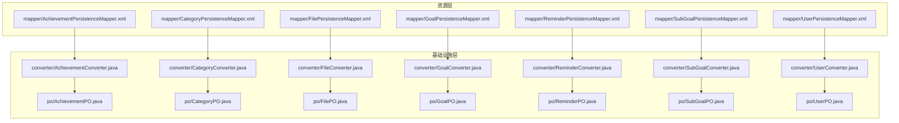
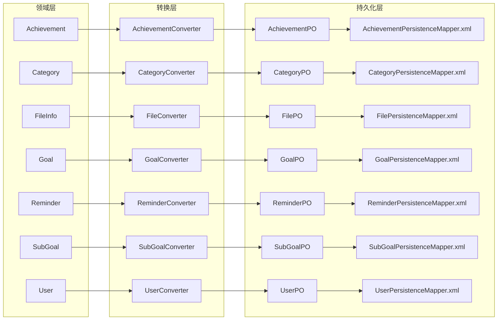
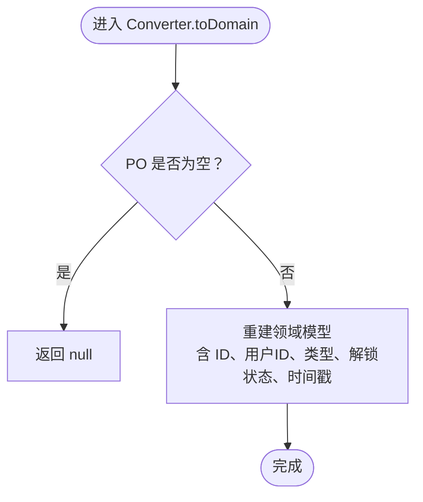
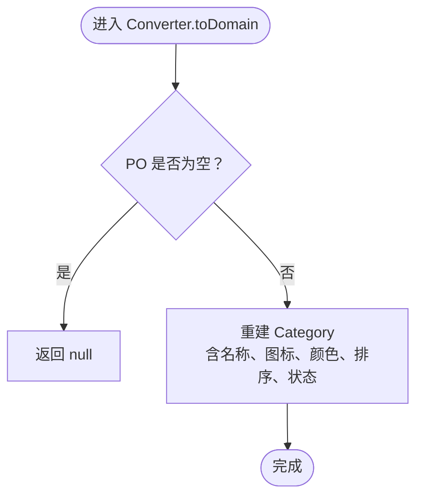
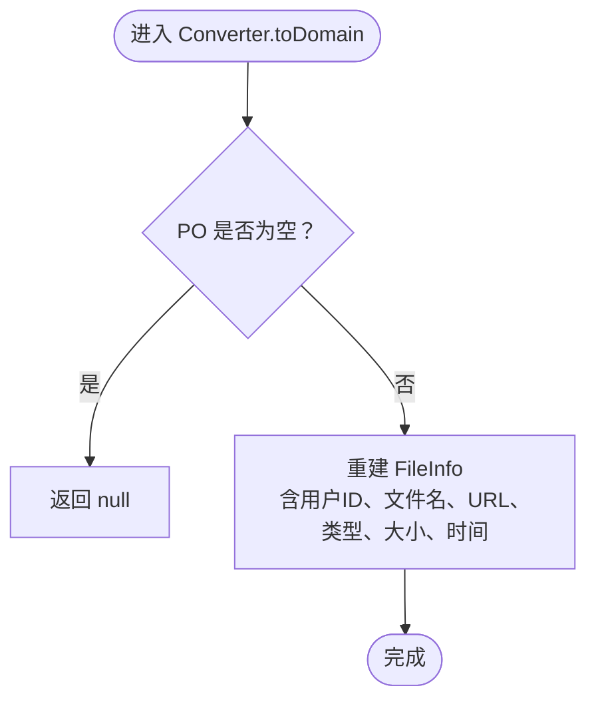
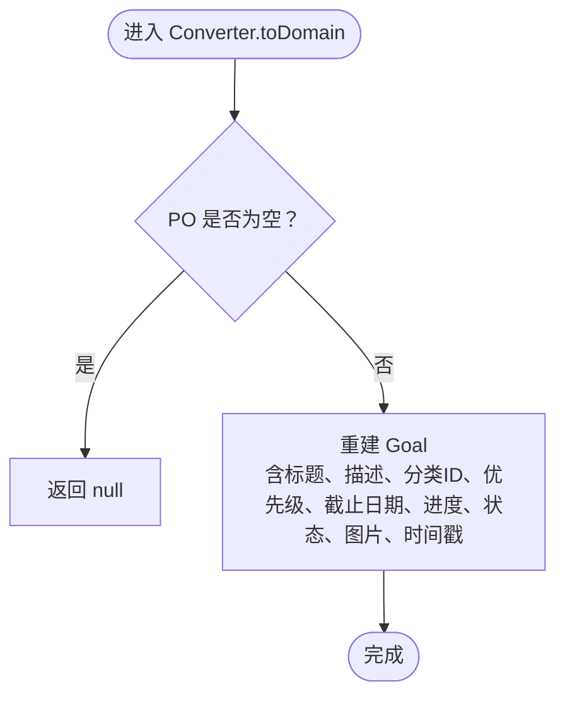
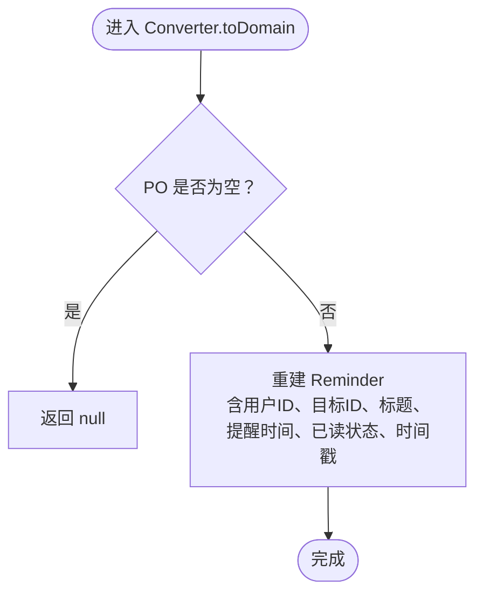
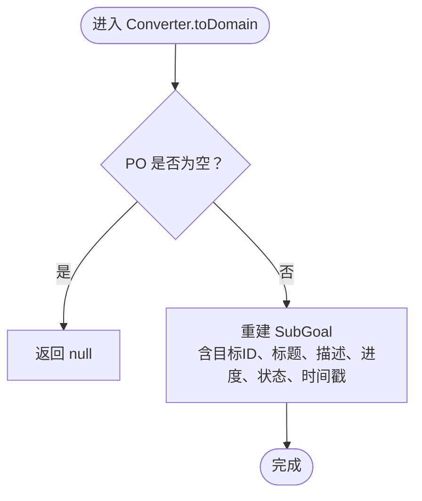
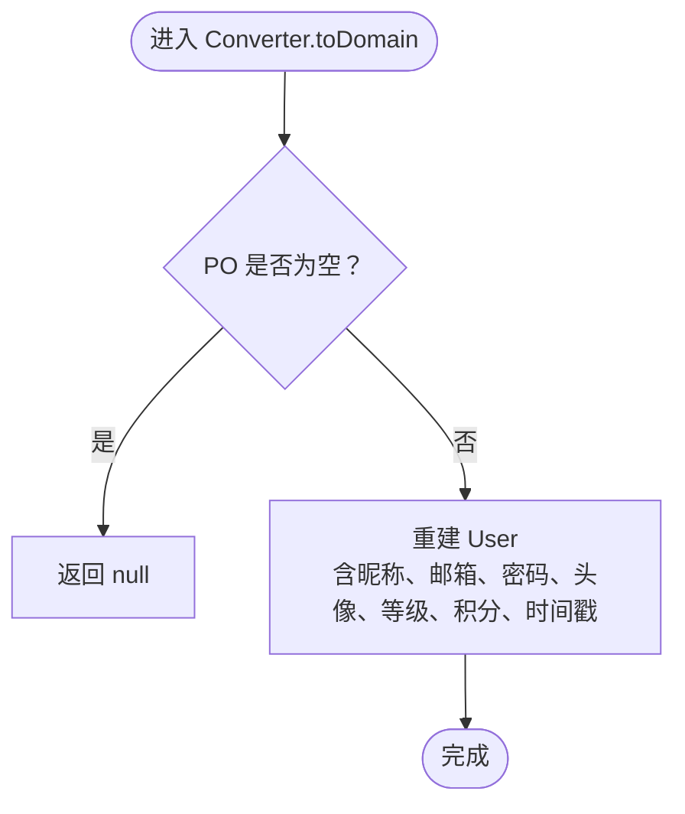
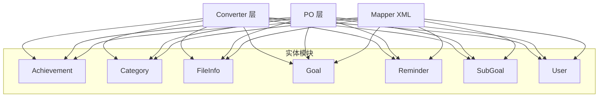

# ORM 映射配置

<cite>
**本文引用的文件**
- [AchievementPersistenceMapper.xml](file://src/main/resources/mapper/AchievementPersistenceMapper.xml)
- [CategoryPersistenceMapper.xml](file://src/main/resources/mapper/CategoryPersistenceMapper.xml)
- [FilePersistenceMapper.xml](file://src/main/resources/mapper/FilePersistenceMapper.xml)
- [GoalPersistenceMapper.xml](file://src/main/resources/mapper/GoalPersistenceMapper.xml)
- [ReminderPersistenceMapper.xml](file://src/main/resources/mapper/ReminderPersistenceMapper.xml)
- [SubGoalPersistenceMapper.xml](file://src/main/resources/mapper/SubGoalPersistenceMapper.xml)
- [UserPersistenceMapper.xml](file://src/main/resources/mapper/UserPersistenceMapper.xml)
- [AchievementConverter.java](file://src/main/java/com/crazydream/infrastructure/persistence/converter/AchievementConverter.java)
- [CategoryConverter.java](file://src/main/java/com/crazydream/infrastructure/persistence/converter/CategoryConverter.java)
- [FileConverter.java](file://src/main/java/com/crazydream/infrastructure/persistence/converter/FileConverter.java)
- [GoalConverter.java](file://src/main/java/com/crazydream/infrastructure/persistence/converter/GoalConverter.java)
- [ReminderConverter.java](file://src/main/java/com/crazydream/infrastructure/persistence/converter/ReminderConverter.java)
- [SubGoalConverter.java](file://src/main/java/com/crazydream/infrastructure/persistence/converter/SubGoalConverter.java)
- [UserConverter.java](file://src/main/java/com/crazydream/infrastructure/persistence/converter/UserConverter.java)
- [AchievementPO.java](file://src/main/java/com/crazydream/infrastructure/persistence/po/AchievementPO.java)
- [CategoryPO.java](file://src/main/java/com/crazydream/infrastructure/persistence/po/CategoryPO.java)
- [FilePO.java](file://src/main/java/com/crazydream/infrastructure/persistence/po/FilePO.java)
- [GoalPO.java](file://src/main/java/com/crazydream/infrastructure/persistence/po/GoalPO.java)
- [ReminderPO.java](file://src/main/java/com/crazydream/infrastructure/persistence/po/ReminderPO.java)
- [SubGoalPO.java](file://src/main/java/com/crazydream/infrastructure/persistence/po/SubGoalPO.java)
- [UserPO.java](file://src/main/java/com/crazydream/infrastructure/persistence/po/UserPO.java)
</cite>

## 目录
1. [简介](#简介)
2. [项目结构](#项目结构)
3. [核心组件](#核心组件)
4. [架构总览](#架构总览)
5. [详细组件分析](#详细组件分析)
6. [依赖关系分析](#依赖关系分析)
7. [性能考虑](#性能考虑)
8. [故障排查指南](#故障排查指南)
9. [结论](#结论)
10. [附录](#附录)

## 简介
本文件系统性梳理 CrazyDream 项目的 MyBatis ORM 映射配置，覆盖以下方面：
- 每个实体对应的 Mapper XML 文件结构、SQL 定义、参数映射与结果集映射
- 实体转换器（Converter）在领域模型与持久化对象之间的职责与实现
- 查询优化技巧、批量操作配置与缓存策略建议
- 数据访问层最佳实践与性能优化建议
- 为开发者提供完整的 ORM 配置参考

## 项目结构
MyBatis 的映射配置采用“按实体分文件”的组织方式，位于资源目录下；与之配套的是 Converter 层与 PO 对象，分别承担“领域模型 ↔ 持久化对象”的双向转换。

图表来源
- [AchievementPersistenceMapper.xml](file://src/main/resources/mapper/AchievementPersistenceMapper.xml#L1-L47)
- [CategoryPersistenceMapper.xml](file://src/main/resources/mapper/CategoryPersistenceMapper.xml#L1-L47)
- [FilePersistenceMapper.xml](file://src/main/resources/mapper/FilePersistenceMapper.xml#L1-L31)
- [GoalPersistenceMapper.xml](file://src/main/resources/mapper/GoalPersistenceMapper.xml#L1-L129)
- [ReminderPersistenceMapper.xml](file://src/main/resources/mapper/ReminderPersistenceMapper.xml#L1-L52)
- [SubGoalPersistenceMapper.xml](file://src/main/resources/mapper/SubGoalPersistenceMapper.xml#L1-L48)
- [UserPersistenceMapper.xml](file://src/main/resources/mapper/UserPersistenceMapper.xml#L1-L38)
- [AchievementConverter.java](file://src/main/java/com/crazydream/infrastructure/persistence/converter/AchievementConverter.java#L1-L45)
- [CategoryConverter.java](file://src/main/java/com/crazydream/infrastructure/persistence/converter/CategoryConverter.java#L1-L38)
- [FileConverter.java](file://src/main/java/com/crazydream/infrastructure/persistence/converter/FileConverter.java#L1-L40)
- [GoalConverter.java](file://src/main/java/com/crazydream/infrastructure/persistence/converter/GoalConverter.java#L1-L68)
- [ReminderConverter.java](file://src/main/java/com/crazydream/infrastructure/persistence/converter/ReminderConverter.java#L1-L43)
- [SubGoalConverter.java](file://src/main/java/com/crazydream/infrastructure/persistence/converter/SubGoalConverter.java#L1-L43)
- [UserConverter.java](file://src/main/java/com/crazydream/infrastructure/persistence/converter/UserConverter.java#L1-L44)
- [AchievementPO.java](file://src/main/java/com/crazydream/infrastructure/persistence/po/AchievementPO.java#L1-L22)
- [CategoryPO.java](file://src/main/java/com/crazydream/infrastructure/persistence/po/CategoryPO.java#L1-L14)
- [FilePO.java](file://src/main/java/com/crazydream/infrastructure/persistence/po/FilePO.java#L1-L16)
- [GoalPO.java](file://src/main/java/com/crazydream/infrastructure/persistence/po/GoalPO.java#L1-L28)
- [ReminderPO.java](file://src/main/java/com/crazydream/infrastructure/persistence/po/ReminderPO.java#L1-L17)
- [SubGoalPO.java](file://src/main/java/com/crazydream/infrastructure/persistence/po/SubGoalPO.java#L1-L17)
- [UserPO.java](file://src/main/java/com/crazydream/infrastructure/persistence/po/UserPO.java#L1-L18)

章节来源
- [AchievementPersistenceMapper.xml](file://src/main/resources/mapper/AchievementPersistenceMapper.xml#L1-L47)
- [CategoryPersistenceMapper.xml](file://src/main/resources/mapper/CategoryPersistenceMapper.xml#L1-L47)
- [FilePersistenceMapper.xml](file://src/main/resources/mapper/FilePersistenceMapper.xml#L1-L31)
- [GoalPersistenceMapper.xml](file://src/main/resources/mapper/GoalPersistenceMapper.xml#L1-L129)
- [ReminderPersistenceMapper.xml](file://src/main/resources/mapper/ReminderPersistenceMapper.xml#L1-L52)
- [SubGoalPersistenceMapper.xml](file://src/main/resources/mapper/SubGoalPersistenceMapper.xml#L1-L48)
- [UserPersistenceMapper.xml](file://src/main/resources/mapper/UserPersistenceMapper.xml#L1-L38)

## 核心组件
- Mapper XML：定义命名空间、SQL 语句、参数映射与结果集映射，统一由 MyBatis 扫描加载
- Converter：负责领域模型与 PO 之间的双向转换，确保业务模型与数据库字段解耦
- PO：纯数据载体，仅承载数据库字段映射，无业务逻辑

章节来源
- [AchievementPersistenceMapper.xml](file://src/main/resources/mapper/AchievementPersistenceMapper.xml#L5-L11)
- [CategoryPersistenceMapper.xml](file://src/main/resources/mapper/CategoryPersistenceMapper.xml#L5-L11)
- [FilePersistenceMapper.xml](file://src/main/resources/mapper/FilePersistenceMapper.xml#L5-L11)
- [GoalPersistenceMapper.xml](file://src/main/resources/mapper/GoalPersistenceMapper.xml#L5-L21)
- [ReminderPersistenceMapper.xml](file://src/main/resources/mapper/ReminderPersistenceMapper.xml#L5-L11)
- [SubGoalPersistenceMapper.xml](file://src/main/resources/mapper/SubGoalPersistenceMapper.xml#L5-L11)
- [UserPersistenceMapper.xml](file://src/main/resources/mapper/UserPersistenceMapper.xml#L5-L11)
- [AchievementConverter.java](file://src/main/java/com/crazydream/infrastructure/persistence/converter/AchievementConverter.java#L8-L44)
- [CategoryConverter.java](file://src/main/java/com/crazydream/infrastructure/persistence/converter/CategoryConverter.java#L8-L37)
- [FileConverter.java](file://src/main/java/com/crazydream/infrastructure/persistence/converter/FileConverter.java#L8-L39)
- [GoalConverter.java](file://src/main/java/com/crazydream/infrastructure/persistence/converter/GoalConverter.java#L15-L67)
- [ReminderConverter.java](file://src/main/java/com/crazydream/infrastructure/persistence/converter/ReminderConverter.java#L9-L42)
- [SubGoalConverter.java](file://src/main/java/com/crazydream/infrastructure/persistence/converter/SubGoalConverter.java#L9-L42)
- [UserConverter.java](file://src/main/java/com/crazydream/infrastructure/persistence/converter/UserConverter.java#L8-L43)
- [AchievementPO.java](file://src/main/java/com/crazydream/infrastructure/persistence/po/AchievementPO.java#L7-L21)
- [CategoryPO.java](file://src/main/java/com/crazydream/infrastructure/persistence/po/CategoryPO.java#L6-L13)
- [FilePO.java](file://src/main/java/com/crazydream/infrastructure/persistence/po/FilePO.java#L7-L15)
- [GoalPO.java](file://src/main/java/com/crazydream/infrastructure/persistence/po/GoalPO.java#L14-L27)
- [ReminderPO.java](file://src/main/java/com/crazydream/infrastructure/persistence/po/ReminderPO.java#L7-L16)
- [SubGoalPO.java](file://src/main/java/com/crazydream/infrastructure/persistence/po/SubGoalPO.java#L7-L16)
- [UserPO.java](file://src/main/java/com/crazydream/infrastructure/persistence/po/UserPO.java#L7-L17)

## 架构总览
下图展示 Converter 与各实体 Mapper 的交互关系，体现“领域模型 → PO → 数据库”的转换链路。

图表来源
- [AchievementConverter.java](file://src/main/java/com/crazydream/infrastructure/persistence/converter/AchievementConverter.java#L8-L44)
- [CategoryConverter.java](file://src/main/java/com/crazydream/infrastructure/persistence/converter/CategoryConverter.java#L8-L37)
- [FileConverter.java](file://src/main/java/com/crazydream/infrastructure/persistence/converter/FileConverter.java#L8-L39)
- [GoalConverter.java](file://src/main/java/com/crazydream/infrastructure/persistence/converter/GoalConverter.java#L15-L67)
- [ReminderConverter.java](file://src/main/java/com/crazydream/infrastructure/persistence/converter/ReminderConverter.java#L9-L42)
- [SubGoalConverter.java](file://src/main/java/com/crazydream/infrastructure/persistence/converter/SubGoalConverter.java#L9-L42)
- [UserConverter.java](file://src/main/java/com/crazydream/infrastructure/persistence/converter/UserConverter.java#L8-L43)
- [AchievementPersistenceMapper.xml](file://src/main/resources/mapper/AchievementPersistenceMapper.xml#L5-L11)
- [CategoryPersistenceMapper.xml](file://src/main/resources/mapper/CategoryPersistenceMapper.xml#L5-L11)
- [FilePersistenceMapper.xml](file://src/main/resources/mapper/FilePersistenceMapper.xml#L5-L11)
- [GoalPersistenceMapper.xml](file://src/main/resources/mapper/GoalPersistenceMapper.xml#L5-L21)
- [ReminderPersistenceMapper.xml](file://src/main/resources/mapper/ReminderPersistenceMapper.xml#L5-L11)
- [SubGoalPersistenceMapper.xml](file://src/main/resources/mapper/SubGoalPersistenceMapper.xml#L5-L11)
- [UserPersistenceMapper.xml](file://src/main/resources/mapper/UserPersistenceMapper.xml#L5-L11)

## 详细组件分析

### Achievement（成就）映射
- 命名空间与 CRUD
  - 插入：使用自增主键，keyProperty 指向 PO 的 id 字段
  - 更新：按 id 更新解锁状态与时间等字段
  - 查询：按 id 与用户 id 查询；支持已解锁条件过滤
- 参数映射与结果映射
  - insert/update 使用 parameterType 指定 PO 类型
  - select 返回 PO 类型，字段与表列一一对应
- 转换器要点
  - 将 PO 转回领域模型时，类型码与布尔状态字段需正确映射
  - 从领域模型写入 PO 时，填充标题、描述、徽章等派生信息

图表来源
- [AchievementConverter.java](file://src/main/java/com/crazydream/infrastructure/persistence/converter/AchievementConverter.java#L10-L21)

章节来源
- [AchievementPersistenceMapper.xml](file://src/main/resources/mapper/AchievementPersistenceMapper.xml#L5-L46)
- [AchievementConverter.java](file://src/main/java/com/crazydream/infrastructure/persistence/converter/AchievementConverter.java#L8-L44)
- [AchievementPO.java](file://src/main/java/com/crazydream/infrastructure/persistence/po/AchievementPO.java#L7-L21)

### Category（分类）映射
- 命名空间与 CRUD
  - 插入/更新：包含名称、图标、颜色、排序与状态
  - 查询：按 id、全部列表、按状态筛选
  - 删除：按 id 删除
- 参数映射与结果映射
  - select 语句返回 PO，字段与表列一致
  - 状态字段以整数表示启用/禁用
- 转换器要点
  - PO → 领域模型：状态整数转布尔
  - 领域模型 → PO：布尔转整数

图表来源
- [CategoryConverter.java](file://src/main/java/com/crazydream/infrastructure/persistence/converter/CategoryConverter.java#L10-L21)

章节来源
- [CategoryPersistenceMapper.xml](file://src/main/resources/mapper/CategoryPersistenceMapper.xml#L5-L46)
- [CategoryConverter.java](file://src/main/java/com/crazydream/infrastructure/persistence/converter/CategoryConverter.java#L8-L37)
- [CategoryPO.java](file://src/main/java/com/crazydream/infrastructure/persistence/po/CategoryPO.java#L6-L13)

### File（文件）映射
- 命名空间与 CRUD
  - 插入：包含用户 id、文件名、URL、类型、大小与上传时间
  - 查询：按 id 与用户 id 查询
  - 删除：按 id 删除
- 参数映射与结果映射
  - 字段与表列一一对应，时间字段使用 LocalDateTime
- 转换器要点
  - PO → 领域模型：构建 FileInfo 并设置类型枚举
  - 领域模型 → PO：类型编码写入 PO

图表来源
- [FileConverter.java](file://src/main/java/com/crazydream/infrastructure/persistence/converter/FileConverter.java#L10-L22)

章节来源
- [FilePersistenceMapper.xml](file://src/main/resources/mapper/FilePersistenceMapper.xml#L5-L30)
- [FileConverter.java](file://src/main/java/com/crazydream/infrastructure/persistence/converter/FileConverter.java#L8-L39)
- [FilePO.java](file://src/main/java/com/crazydream/infrastructure/persistence/po/FilePO.java#L7-L15)

### Goal（目标）映射
- 结果映射与复杂查询
  - 定义 resultMap，将列与 PO 属性精确映射
  - 提供按 id、用户 id、分类+用户 id 的查询
  - 支持最近更新列表、今日提醒目标联表查询、统计完成/活跃数量
- 批量与删除
  - 支持按 id 列表批量删除
- 参数映射与结果映射
  - 多处使用 resultMap，确保复杂查询结果的准确映射
- 转换器要点
  - PO → 领域模型：优先处理枚举类型（优先级、状态）、数值型进度
  - 领域模型 → PO：将枚举编码写入对应字段

图表来源
- [GoalConverter.java](file://src/main/java/com/crazydream/infrastructure/persistence/converter/GoalConverter.java#L20-L39)

章节来源
- [GoalPersistenceMapper.xml](file://src/main/resources/mapper/GoalPersistenceMapper.xml#L5-L128)
- [GoalConverter.java](file://src/main/java/com/crazydream/infrastructure/persistence/converter/GoalConverter.java#L15-L67)
- [GoalPO.java](file://src/main/java/com/crazydream/infrastructure/persistence/po/GoalPO.java#L14-L27)

### Reminder（提醒）映射
- 命名空间与 CRUD
  - 插入/更新：包含用户 id、目标 id、标题、提醒时间与是否已读
  - 查询：按 id、用户 id、未读、目标 id 查询
  - 删除：按 id 删除
- 参数映射与结果映射
  - 已读状态为布尔值，注意与数据库存储类型的匹配

图表来源
- [ReminderConverter.java](file://src/main/java/com/crazydream/infrastructure/persistence/converter/ReminderConverter.java#L11-L24)

章节来源
- [ReminderPersistenceMapper.xml](file://src/main/resources/mapper/ReminderPersistenceMapper.xml#L5-L51)
- [ReminderConverter.java](file://src/main/java/com/crazydream/infrastructure/persistence/converter/ReminderConverter.java#L9-L42)
- [ReminderPO.java](file://src/main/java/com/crazydream/infrastructure/persistence/po/ReminderPO.java#L7-L16)

### SubGoal（子目标）映射
- 命名空间与 CRUD
  - 插入/更新：包含目标 id、标题、描述、进度与状态
  - 查询：按 id 与目标 id 查询
  - 删除：按 id 删除；支持按 id 列表批量删除
- 参数映射与结果映射
  - 进度与状态为数值与枚举编码，注意与领域模型的互转

图表来源
- [SubGoalConverter.java](file://src/main/java/com/crazydream/infrastructure/persistence/converter/SubGoalConverter.java#L11-L24)

章节来源
- [SubGoalPersistenceMapper.xml](file://src/main/resources/mapper/SubGoalPersistenceMapper.xml#L5-L47)
- [SubGoalConverter.java](file://src/main/java/com/crazydream/infrastructure/persistence/converter/SubGoalConverter.java#L9-L42)
- [SubGoalPO.java](file://src/main/java/com/crazydream/infrastructure/persistence/po/SubGoalPO.java#L7-L16)

### User（用户）映射
- 命名空间与 CRUD
  - 插入/更新：包含昵称、邮箱、密码、头像、等级、积分与时间戳
  - 查询：按 id 与邮箱查询
- 参数映射与结果映射
  - 邮箱唯一性可通过查询约束保障，Mapper 中提供按邮箱查询能力

图表来源
- [UserConverter.java](file://src/main/java/com/crazydream/infrastructure/persistence/converter/UserConverter.java#L10-L24)

章节来源
- [UserPersistenceMapper.xml](file://src/main/resources/mapper/UserPersistenceMapper.xml#L5-L37)
- [UserConverter.java](file://src/main/java/com/crazydream/infrastructure/persistence/converter/UserConverter.java#L8-L43)
- [UserPO.java](file://src/main/java/com/crazydream/infrastructure/persistence/po/UserPO.java#L7-L17)

## 依赖关系分析
- 组件内聚与耦合
  - 每个实体的 Mapper、Converter、PO 形成高内聚模块，彼此通过接口清晰解耦
  - Converter 作为桥梁，避免领域模型直接依赖数据库字段细节
- 外部依赖
  - MyBatis 3.x：Mapper XML 语法、动态 SQL、结果映射
  - Lombok：简化 PO 的 getter/setter/toString
- 可能的循环依赖
  - 当前结构中不存在循环依赖，各模块单向流向：领域 → Converter → PO → Mapper

图表来源
- [AchievementConverter.java](file://src/main/java/com/crazydream/infrastructure/persistence/converter/AchievementConverter.java#L8-L44)
- [CategoryConverter.java](file://src/main/java/com/crazydream/infrastructure/persistence/converter/CategoryConverter.java#L8-L37)
- [FileConverter.java](file://src/main/java/com/crazydream/infrastructure/persistence/converter/FileConverter.java#L8-L39)
- [GoalConverter.java](file://src/main/java/com/crazydream/infrastructure/persistence/converter/GoalConverter.java#L15-L67)
- [ReminderConverter.java](file://src/main/java/com/crazydream/infrastructure/persistence/converter/ReminderConverter.java#L9-L42)
- [SubGoalConverter.java](file://src/main/java/com/crazydream/infrastructure/persistence/converter/SubGoalConverter.java#L9-L42)
- [UserConverter.java](file://src/main/java/com/crazydream/infrastructure/persistence/converter/UserConverter.java#L8-L43)
- [AchievementPersistenceMapper.xml](file://src/main/resources/mapper/AchievementPersistenceMapper.xml#L5-L11)
- [CategoryPersistenceMapper.xml](file://src/main/resources/mapper/CategoryPersistenceMapper.xml#L5-L11)
- [FilePersistenceMapper.xml](file://src/main/resources/mapper/FilePersistenceMapper.xml#L5-L11)
- [GoalPersistenceMapper.xml](file://src/main/resources/mapper/GoalPersistenceMapper.xml#L5-L21)
- [ReminderPersistenceMapper.xml](file://src/main/resources/mapper/ReminderPersistenceMapper.xml#L5-L11)
- [SubGoalPersistenceMapper.xml](file://src/main/resources/mapper/SubGoalPersistenceMapper.xml#L5-L11)
- [UserPersistenceMapper.xml](file://src/main/resources/mapper/UserPersistenceMapper.xml#L5-L11)

## 性能考虑
- 查询优化
  - 为高频查询字段建立索引：如用户 id、目标 id、状态、时间字段
  - 合理使用 LIMIT 与排序，避免全表扫描（例如最近记录查询）
- 批量操作
  - 使用 foreach 批量删除（见目标与子目标的批量删除配置），减少网络往返
- 缓存策略
  - 启用二级缓存（需在 Mapper XML 中声明）以复用热点查询结果
  - 对只读或低频更新的数据启用只读缓存，降低写放大
- 动态 SQL
  - 使用 trim/where/foreach 等标签减少拼接错误与 SQL 注入风险
- 时间字段
  - 统一使用 LocalDateTime，避免时区转换问题；必要时在应用层进行时区转换

## 故障排查指南
- 常见问题定位
  - 字段不匹配：检查 Mapper XML 的列名与 PO 属性是否一致
  - 枚举映射异常：确认 Converter 中枚举编码与数据库存储一致
  - 批量删除失败：核对 ids 集合非空且类型正确
- 日志与监控
  - 开启 MyBatis SQL 日志，定位慢查询与错误语句
  - 关注 Converter 异常：空指针、类型转换异常
- 最佳实践
  - 保持 PO 与领域模型分离，避免在 PO 中引入业务逻辑
  - 所有新增字段均需同步到 Mapper XML 与 Converter

章节来源
- [GoalPersistenceMapper.xml](file://src/main/resources/mapper/GoalPersistenceMapper.xml#L81-L88)
- [SubGoalPersistenceMapper.xml](file://src/main/resources/mapper/SubGoalPersistenceMapper.xml#L40-L45)

## 结论
CrazyDream 项目的 ORM 配置遵循清晰的分层与职责划分：Mapper XML 负责 SQL 与映射，Converter 负责领域与持久化对象转换，PO 仅承载数据。该设计具备良好的可维护性与扩展性，配合合理的索引、批量操作与缓存策略，可在保证开发效率的同时提升运行性能。

## 附录
- 快速对照表（Mapper 关键点）
  - 插入：useGeneratedKeys 与 keyProperty
  - 更新：WHERE 条件与字段选择性更新
  - 查询：resultType/resultMap、参数占位符、排序与限制
  - 批量：foreach 集合遍历
- 转换器编写规范
  - 空值保护：输入为空时返回 null
  - 枚举处理：明确编码与数据库存储格式
  - 时间处理：统一 LocalDateTime，避免时区偏差