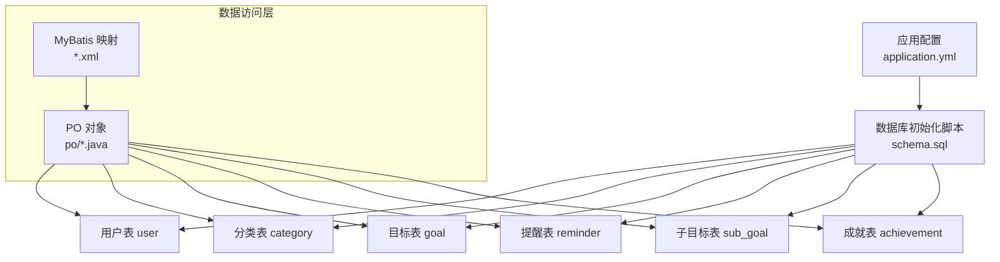
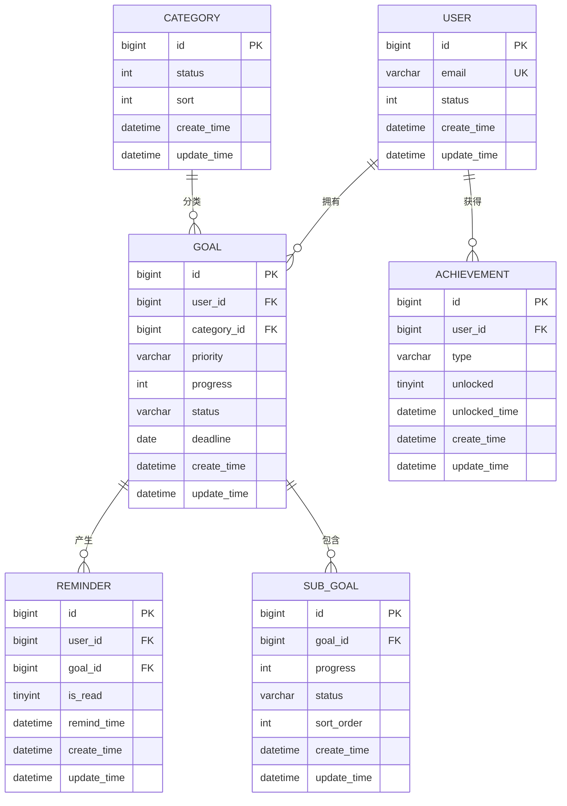
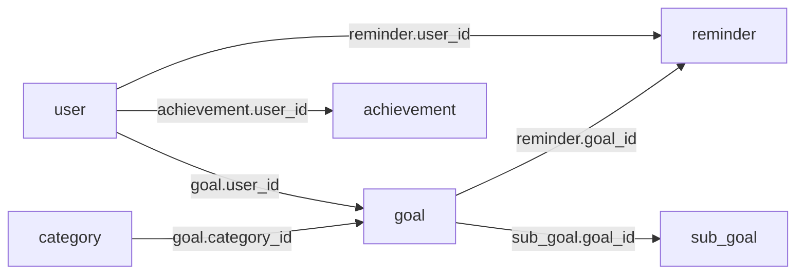

# 数据库表结构

<cite>
**本文引用的文件**
- [schema.sql](file://src/main/resources/schema.sql)
- [application.yml](file://src/main/resources/application.yml)
- [UserPersistenceMapper.xml](file://src/main/resources/mapper/UserPersistenceMapper.xml)
- [CategoryPersistenceMapper.xml](file://src/main/resources/mapper/CategoryPersistenceMapper.xml)
- [GoalPersistenceMapper.xml](file://src/main/resources/mapper/GoalPersistenceMapper.xml)
- [ReminderPersistenceMapper.xml](file://src/main/resources/mapper/ReminderPersistenceMapper.xml)
- [SubGoalPersistenceMapper.xml](file://src/main/resources/mapper/SubGoalPersistenceMapper.xml)
- [AchievementPersistenceMapper.xml](file://src/main/resources/mapper/AchievementPersistenceMapper.xml)
- [UserPO.java](file://src/main/java/com/crazydream/infrastructure/persistence/po/UserPO.java)
- [CategoryPO.java](file://src/main/java/com/crazydream/infrastructure/persistence/po/CategoryPO.java)
- [GoalPO.java](file://src/main/java/com/crazydream/infrastructure/persistence/po/GoalPO.java)
- [ReminderPO.java](file://src/main/java/com/crazydream/infrastructure/persistence/po/ReminderPO.java)
- [SubGoalPO.java](file://src/main/java/com/crazydream/infrastructure/persistence/po/SubGoalPO.java)
- [AchievementPO.java](file://src/main/java/com/crazydream/infrastructure/persistence/po/AchievementPO.java)
- [User.java](file://src/main/java/com/crazydream/domain/user/model/aggregate/User.java)
- [Goal.java](file://src/main/java/com/crazydream/domain/goal/model/aggregate/Goal.java)
- [Category.java](file://src/main/java/com/crazydream/domain/category/model/aggregate/Category.java)
- [Reminder.java](file://src/main/java/com/crazydream/domain/reminder/model/aggregate/Reminder.java)
- [SubGoal.java](file://src/main/java/com/crazydream/domain/subgoal/model/aggregate/SubGoal.java)
- [Achievement.java](file://src/main/java/com/crazydream/domain/achievement/model/aggregate/Achievement.java)
</cite>

## 目录
1. [简介](#简介)
2. [项目结构](#项目结构)
3. [核心组件](#核心组件)
4. [架构总览](#架构总览)
5. [详细组件分析](#详细组件分析)
6. [依赖分析](#依赖分析)
7. [性能考虑](#性能考虑)
8. [故障排查指南](#故障排查指南)
9. [结论](#结论)
10. [附录](#附录)

## 简介
本文件面向数据库管理员与开发者，系统性梳理 CrazyDream 项目的数据库表结构与实体关系。文档基于实际的建表脚本与 MyBatis 映射文件，逐表说明字段定义、数据类型、约束条件、默认值、索引策略以及业务规则，并给出表间关联关系图与 ERD，帮助读者快速理解并高效维护数据库。

## 项目结构
本项目采用后端 Java 工程，数据库初始化脚本位于资源目录，MyBatis 的 XML 映射文件负责 SQL 与 PO 对象的绑定。应用配置文件中包含数据库连接与 MyBatis 基础配置，便于理解数据访问层的整体组织方式。

图表来源
- [application.yml](file://src/main/resources/application.yml#L10-L39)
- [schema.sql](file://src/main/resources/schema.sql#L1-L111)

章节来源
- [application.yml](file://src/main/resources/application.yml#L10-L39)
- [schema.sql](file://src/main/resources/schema.sql#L1-L111)

## 核心组件
本节对六大核心表逐一进行结构说明：用户表、分类表、目标表、提醒表、子目标表、成就表。每张表均包含字段定义、数据类型、约束与默认值、索引设计、业务规则与典型查询场景。

- 用户表 user
  - 主键：自增 id
  - 字段要点：昵称、邮箱（唯一）、密码、头像、等级、积分、第三方 openid、性别、地区、语言、状态、时间戳
  - 约束与默认值：邮箱唯一；状态默认 1（正常）；时间戳默认当前时间
  - 索引：无显式索引（建议按业务查询建立索引）
  - 业务规则：积分变更与等级升级由领域模型控制，持久化层仅存取

- 分类表 category
  - 主键：自增 id
  - 字段要点：名称、图标、颜色、排序、状态、时间戳
  - 约束与默认值：状态默认 1（启用）；排序默认 0
  - 索引：无显式索引（建议按排序与状态查询建立索引）
  - 业务规则：启用/禁用状态由领域模型控制

- 目标表 goal
  - 主键：自增 id
  - 外键：user_id 引用 user.id（级联删除），category_id 引用 category.id（SET NULL）
  - 字段要点：用户标识、标题、描述、分类、优先级、截止日期、进度、状态、图片、时间戳
  - 约束与默认值：优先级默认 medium；进度默认 0；状态默认 in_progress；时间戳默认当前时间
  - 索引：无显式索引（建议按 user_id、category_id、status、deadline 建立复合索引）
  - 业务规则：状态机与进度计算由领域模型控制，持久化层仅存取

- 提醒表 reminder
  - 主键：自增 id
  - 外键：user_id 引用 user.id（级联删除），goal_id 引用 goal.id（级联删除）
  - 字段要点：用户标识、目标标识、标题、内容、提醒时间、已读标记、时间戳
  - 约束与默认值：已读默认 0（未读）；时间戳默认当前时间
  - 索引：无显式索引（建议按 user_id、goal_id、remind_time、is_read 建立复合索引）
  - 业务规则：已读标记由领域模型控制

- 子目标表 sub_goal
  - 主键：自增 id
  - 外键：goal_id 引用 goal.id（级联删除）
  - 字段要点：所属目标、标题、描述、进度、状态、排序、时间戳
  - 约束与默认值：进度默认 0；状态默认 not_started；排序默认 0
  - 索引：无显式索引（建议按 goal_id、status、sort_order 建立复合索引）
  - 业务规则：进度与状态由领域模型控制

- 成就表 achievement
  - 主键：自增 id
  - 外键：user_id 引用 user.id（级联删除）
  - 字段要点：用户标识、类型、标题、描述、徽章、解锁条件、解锁标记、解锁时间、时间戳
  - 约束与默认值：解锁标记默认 0（未解锁）；兼容字段 is_unlocked、unlocked_at、unlocked_time
  - 索引：无显式索引（建议按 user_id、type、unlocked 建立复合索引）
  - 业务规则：解锁判定由领域模型根据统计信息决定

章节来源
- [schema.sql](file://src/main/resources/schema.sql#L2-L19)
- [schema.sql](file://src/main/resources/schema.sql#L26-L36)
- [schema.sql](file://src/main/resources/schema.sql#L38-L54)
- [schema.sql](file://src/main/resources/schema.sql#L56-L69)
- [schema.sql](file://src/main/resources/schema.sql#L71-L84)
- [schema.sql](file://src/main/resources/schema.sql#L86-L102)

## 架构总览
下图展示数据库层的实体关系与外键约束，体现用户、分类、目标、提醒、子目标、成就之间的关联。

图表来源
- [schema.sql](file://src/main/resources/schema.sql#L2-L19)
- [schema.sql](file://src/main/resources/schema.sql#L26-L36)
- [schema.sql](file://src/main/resources/schema.sql#L38-L54)
- [schema.sql](file://src/main/resources/schema.sql#L56-L69)
- [schema.sql](file://src/main/resources/schema.sql#L71-L84)
- [schema.sql](file://src/main/resources/schema.sql#L86-L102)

## 详细组件分析

### 用户表 user
- 字段与类型
  - id：bigint，主键，自增
  - nick_name：varchar(50)，可空
  - email：varchar(100)，非空，唯一
  - password：varchar(255)，可空
  - avatar：varchar(255)，可空
  - level：int，默认 1
  - points：int，默认 0
  - openid：varchar(100)，可空
  - gender：tinyint，默认 0（0:未知, 1:男, 2:女）
  - country/province/city/language：可空
  - status：tinyint，默认 1（1:正常, 0:禁用）
  - create_time/update_time：datetime，默认当前时间
- 约束与默认值
  - email 唯一
  - 状态默认 1
  - 时间戳默认当前时间，更新时自动更新
- 索引设计建议
  - 建议在 email 上建立唯一索引（已由唯一约束保证）
  - 可按业务需要在 status、level 建立普通索引
- 业务规则
  - 积分与等级变更由领域模型控制，持久化层仅存取
- MyBatis 映射
  - 插入/更新/按 id 查询/按 email 查询
- 领域模型对应
  - 领域聚合根包含昵称、邮箱、密码、头像、等级、积分等属性

章节来源
- [schema.sql](file://src/main/resources/schema.sql#L2-L19)
- [UserPersistenceMapper.xml](file://src/main/resources/mapper/UserPersistenceMapper.xml#L7-L35)
- [UserPO.java](file://src/main/java/com/crazydream/infrastructure/persistence/po/UserPO.java#L8-L16)
- [User.java](file://src/main/java/com/crazydream/domain/user/model/aggregate/User.java#L13-L21)

### 分类表 category
- 字段与类型
  - id：bigint，主键，自增
  - name：varchar(50)，非空
  - icon/color：可空
  - sort：int，默认 0
  - status：tinyint，默认 1（1:启用, 0:禁用）
  - create_time/update_time：datetime，默认当前时间
- 约束与默认值
  - 名称非空
  - 状态默认 1
  - 排序默认 0
- 索引设计建议
  - 建议在 status、sort 组合索引，满足“按状态与排序查询”的常见场景
- 业务规则
  - 启用/禁用由领域模型控制
- MyBatis 映射
  - 插入/更新/按 id 查询/查询全部/按状态查询/删除
- 领域模型对应
  - 领域聚合根包含名称、图标、颜色、排序、启用状态

章节来源
- [schema.sql](file://src/main/resources/schema.sql#L26-L36)
- [CategoryPersistenceMapper.xml](file://src/main/resources/mapper/CategoryPersistenceMapper.xml#L7-L44)
- [CategoryPO.java](file://src/main/java/com/crazydream/infrastructure/persistence/po/CategoryPO.java#L7-L12)
- [Category.java](file://src/main/java/com/crazydream/domain/category/model/aggregate/Category.java#L12-L17)

### 目标表 goal
- 字段与类型
  - id：bigint，主键，自增
  - user_id：bigint，非空，外键引用 user.id（级联删除）
  - title：varchar(100)，非空
  - description：text，可空
  - category_id：bigint，可空，外键引用 category.id（SET NULL）
  - priority：varchar(20)，默认 medium
  - deadline：date，可空
  - progress：int，默认 0
  - status：varchar(20)，默认 in_progress
  - image_url：varchar(255)，可空
  - create_time/update_time：datetime，默认当前时间
- 约束与默认值
  - user_id 外键约束（级联删除）
  - category_id 外键约束（SET NULL）
  - 优先级默认 medium
  - 进度默认 0
  - 状态默认 in_progress
- 索引设计建议
  - 建议在 user_id、category_id、status、deadline 建立复合索引
  - 可按需在 title、progress 建立索引
- 业务规则
  - 状态机与进度计算由领域模型控制；当进度达 100 且状态非完成时自动完成
- MyBatis 映射
  - 插入/更新/按 id 查询/按用户查询/按分类+用户查询/批量删除/最近记录查询/今日提醒目标查询/完成数/活跃数统计
- 领域模型对应
  - 领域聚合根包含标题、描述、分类、优先级、截止日期、进度、状态、图片、时间戳等

章节来源
- [schema.sql](file://src/main/resources/schema.sql#L38-L54)
- [GoalPersistenceMapper.xml](file://src/main/resources/mapper/GoalPersistenceMapper.xml#L24-L127)
- [GoalPO.java](file://src/main/java/com/crazydream/infrastructure/persistence/po/GoalPO.java#L15-L26)
- [Goal.java](file://src/main/java/com/crazydream/domain/goal/model/aggregate/Goal.java#L18-L52)

### 提醒表 reminder
- 字段与类型
  - id：bigint，主键，自增
  - user_id：bigint，非空，外键引用 user.id（级联删除）
  - goal_id：bigint，非空，外键引用 goal.id（级联删除）
  - title：varchar(100)，非空
  - content：varchar(200)，可空
  - remind_time：datetime，非空
  - is_read：tinyint，默认 0（0:未读, 1:已读）
  - create_time/update_time：datetime，默认当前时间
- 约束与默认值
  - user_id、goal_id 外键约束（级联删除）
  - 已读默认 0
- 索引设计建议
  - 建议在 user_id、goal_id、remind_time、is_read 建立复合索引
- 业务规则
  - 已读标记由领域模型控制；过期判断由领域模型基于当前时间与提醒时间比较
- MyBatis 映射
  - 插入/更新/按 id 查询/按用户查询/按目标查询/未读查询/删除
- 领域模型对应
  - 领域聚合根包含标题、提醒时间、已读标记、时间戳等

章节来源
- [schema.sql](file://src/main/resources/schema.sql#L56-L69)
- [ReminderPersistenceMapper.xml](file://src/main/resources/mapper/ReminderPersistenceMapper.xml#L7-L49)
- [ReminderPO.java](file://src/main/java/com/crazydream/infrastructure/persistence/po/ReminderPO.java#L8-L15)
- [Reminder.java](file://src/main/java/com/crazydream/domain/reminder/model/aggregate/Reminder.java#L14-L21)

### 子目标表 sub_goal
- 字段与类型
  - id：bigint，主键，自增
  - goal_id：bigint，非空，外键引用 goal.id（级联删除）
  - title：varchar(100)，非空
  - description：text，可空
  - progress：int，默认 0
  - status：varchar(20)，默认 not_started
  - is_completed：tinyint，默认 0（0:未完成, 1:已完成）
  - sort_order：int，默认 0
  - create_time/update_time：datetime，默认当前时间
- 约束与默认值
  - goal_id 外键约束（级联删除）
  - 进度默认 0
  - 状态默认 not_started
  - 排序默认 0
- 索引设计建议
  - 建议在 goal_id、status、sort_order 建立复合索引
- 业务规则
  - 进度与状态由领域模型控制；进度达 100 自动完成
- MyBatis 映射
  - 插入/更新/按 id 查询/按目标查询/批量删除
- 领域模型对应
  - 领域聚合根包含标题、描述、进度、状态、时间戳等

章节来源
- [schema.sql](file://src/main/resources/schema.sql#L71-L84)
- [SubGoalPersistenceMapper.xml](file://src/main/resources/mapper/SubGoalPersistenceMapper.xml#L7-L45)
- [SubGoalPO.java](file://src/main/java/com/crazydream/infrastructure/persistence/po/SubGoalPO.java#L8-L15)
- [SubGoal.java](file://src/main/java/com/crazydream/domain/subgoal/model/aggregate/SubGoal.java#L15-L22)

### 成就表 achievement
- 字段与类型
  - id：bigint，主键，自增
  - user_id：bigint，非空，外键引用 user.id（级联删除）
  - type：varchar(50)，非空
  - title：varchar(100)，非空
  - description：text，可空
  - badge_url：varchar(255)，可空
  - unlock_condition：varchar(200)，可空
  - unlocked：tinyint，默认 0（0:未解锁, 1:已解锁）
  - is_unlocked：tinyint，默认 0（兼容字段）
  - unlocked_time/unlocked_at：datetime，可空（兼容字段）
  - create_time/update_time：datetime，默认当前时间
- 约束与默认值
  - user_id 外键约束（级联删除）
  - 解锁标记默认 0
- 索引设计建议
  - 建议在 user_id、type、unlocked 建立复合索引
- 业务规则
  - 解锁判定由领域模型根据统计信息决定；解锁后写入解锁时间
- MyBatis 映射
  - 插入/更新/按 id 查询/按用户查询/按用户+已解锁查询
- 领域模型对应
  - 领域聚合根包含类型、解锁状态、解锁时间、创建时间等

章节来源
- [schema.sql](file://src/main/resources/schema.sql#L86-L102)
- [AchievementPersistenceMapper.xml](file://src/main/resources/mapper/AchievementPersistenceMapper.xml#L7-L44)
- [AchievementPO.java](file://src/main/java/com/crazydream/infrastructure/persistence/po/AchievementPO.java#L8-L20)
- [Achievement.java](file://src/main/java/com/crazydream/domain/achievement/model/aggregate/Achievement.java#L13-L20)

## 依赖分析
- 外键关系
  - goal.user_id → user.id（级联删除）
  - goal.category_id → category.id（SET NULL）
  - reminder.user_id → user.id（级联删除）
  - reminder.goal_id → goal.id（级联删除）
  - sub_goal.goal_id → goal.id（级联删除）
  - achievement.user_id → user.id（级联删除）
- 参照完整性
  - 通过外键约束确保删除用户或目标时，相关记录按策略清理或置空
- MyBatis 映射与 PO
  - 每张表均有对应的 XML 映射与 PO 类，字段名与类型与建表脚本保持一致

图表来源
- [schema.sql](file://src/main/resources/schema.sql#L52-L53)
- [schema.sql](file://src/main/resources/schema.sql#L67-L68)
- [schema.sql](file://src/main/resources/schema.sql#L83)
- [schema.sql](file://src/main/resources/schema.sql#L101)

章节来源
- [schema.sql](file://src/main/resources/schema.sql#L52-L53)
- [schema.sql](file://src/main/resources/schema.sql#L67-L68)
- [schema.sql](file://src/main/resources/schema.sql#L83)
- [schema.sql](file://src/main/resources/schema.sql#L101)

## 性能考虑
- 索引建议
  - user 表：email 唯一索引（已存在），可考虑 status、level 索引
  - category 表：status、sort 组合索引
  - goal 表：user_id、category_id、status、deadline 复合索引；title、progress 索引
  - reminder 表：user_id、goal_id、remind_time、is_read 复合索引
  - sub_goal 表：goal_id、status、sort_order 复合索引
  - achievement 表：user_id、type、unlocked 复合索引
- 查询优化
  - 领域层的状态机与进度计算在内存完成，持久层仅承担数据存取，减少复杂 SQL
  - 常见统计查询（如完成数、活跃数）通过 SQL 聚合实现，建议配合索引
- 写入优化
  - 使用批量删除（如 sub_goal 的批量删除）降低事务开销
  - 合理利用时间戳默认值，避免冗余更新

## 故障排查指南
- 常见错误与定位
  - 外键约束失败：检查关联记录是否存在、是否被提前删除
  - 唯一约束冲突：检查 email 或其他唯一字段重复
  - 级联删除影响：确认删除用户或目标后，相关记录是否按预期清理
- 排查步骤
  - 确认建表脚本与数据库版本一致
  - 检查 MyBatis 映射文件中的列名与类型是否与 PO 一致
  - 核对业务逻辑中状态转换与进度计算是否符合预期
- 相关文件定位
  - 建表与约束：schema.sql
  - 数据访问映射：mapper/*.xml
  - 实体定义：po/*.java

章节来源
- [schema.sql](file://src/main/resources/schema.sql#L2-L19)
- [schema.sql](file://src/main/resources/schema.sql#L26-L36)
- [schema.sql](file://src/main/resources/schema.sql#L38-L54)
- [schema.sql](file://src/main/resources/schema.sql#L56-L69)
- [schema.sql](file://src/main/resources/schema.sql#L71-L84)
- [schema.sql](file://src/main/resources/schema.sql#L86-L102)
- [UserPersistenceMapper.xml](file://src/main/resources/mapper/UserPersistenceMapper.xml#L7-L35)
- [GoalPersistenceMapper.xml](file://src/main/resources/mapper/GoalPersistenceMapper.xml#L24-L127)
- [ReminderPersistenceMapper.xml](file://src/main/resources/mapper/ReminderPersistenceMapper.xml#L7-L49)
- [SubGoalPersistenceMapper.xml](file://src/main/resources/mapper/SubGoalPersistenceMapper.xml#L7-L45)
- [AchievementPersistenceMapper.xml](file://src/main/resources/mapper/AchievementPersistenceMapper.xml#L7-L44)

## 结论
CrazyDream 项目的数据库层采用清晰的六表结构，结合外键约束与领域模型，实现了目标管理与成就体系的数据一致性与业务规则表达。通过本文档提供的字段定义、约束说明、索引建议与 ERD，数据库管理员与开发者可高效完成表结构维护、查询优化与故障排查。

## 附录
- 数据库连接与 MyBatis 配置
  - 数据源 URL、用户名、密码、驱动类名
  - MyBatis 映射路径与驼峰命名映射开关
- 默认数据
  - 初始化用户与默认分类数据示例

章节来源
- [application.yml](file://src/main/resources/application.yml#L13-L39)
- [schema.sql](file://src/main/resources/schema.sql#L21-L24)
- [schema.sql](file://src/main/resources/schema.sql#L105-L111)