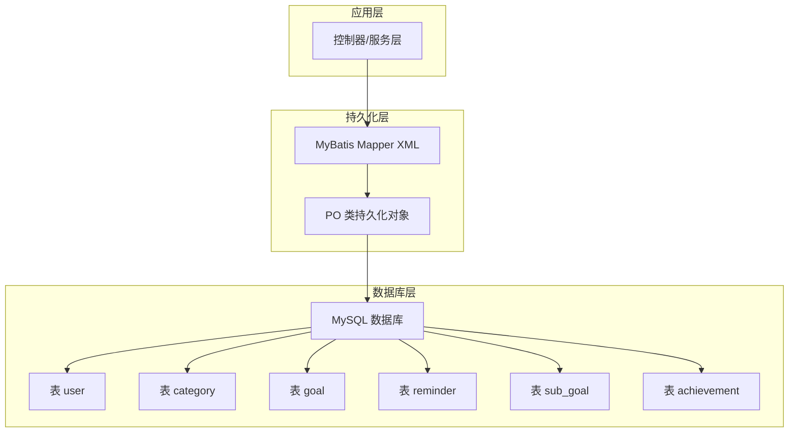
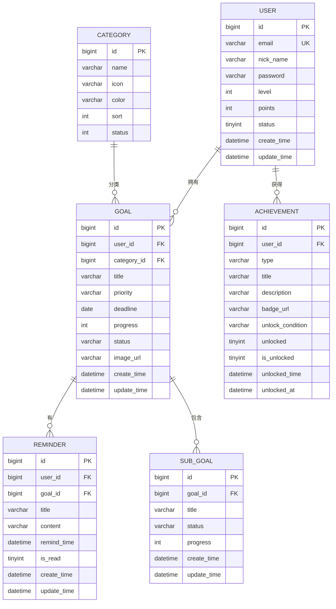
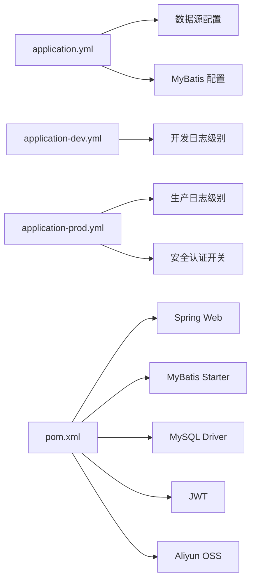

# 数据库设计

<cite>
**本文引用的文件**
- [schema.sql](file://src/main/resources/schema.sql)
- [application.yml](file://src/main/resources/application.yml)
- [application-dev.yml](file://src/main/resources/application-dev.yml)
- [application-prod.yml](file://src/main/resources/application-prod.yml)
- [pom.xml](file://pom.xml)
- [UserPersistenceMapper.xml](file://src/main/resources/mapper/UserPersistenceMapper.xml)
- [GoalPersistenceMapper.xml](file://src/main/resources/mapper/GoalPersistenceMapper.xml)
- [AchievementPersistenceMapper.xml](file://src/main/resources/mapper/AchievementPersistenceMapper.xml)
- [CategoryPersistenceMapper.xml](file://src/main/resources/mapper/CategoryPersistenceMapper.xml)
- [SubGoalPersistenceMapper.xml](file://src/main/resources/mapper/SubGoalPersistenceMapper.xml)
- [UserPO.java](file://src/main/java/com/crazydream/infrastructure/persistence/po/UserPO.java)
- [GoalPO.java](file://src/main/java/com/crazydream/infrastructure/persistence/po/GoalPO.java)
- [AchievementPO.java](file://src/main/java/com/crazydream/infrastructure/persistence/po/AchievementPO.java)
- [CategoryPO.java](file://src/main/java/com/crazydream/infrastructure/persistence/po/CategoryPO.java)
- [SubGoalPO.java](file://src/main/java/com/crazydream/infrastructure/persistence/po/SubGoalPO.java)
</cite>

## 目录
1. [简介](#简介)
2. [项目结构](#项目结构)
3. [核心组件](#核心组件)
4. [架构总览](#架构总览)
5. [详细组件分析](#详细组件分析)
6. [依赖分析](#依赖分析)
7. [性能考虑](#性能考虑)
8. [故障排查指南](#故障排查指南)
9. [结论](#结论)
10. [附录](#附录)

## 简介
本文件面向数据库管理员与开发者，系统性梳理 CrazyDream 项目的数据库设计：包括表结构、字段定义、主外键关系与索引设计；实体关系模型（ERD）与数据完整性约束；数据库初始化脚本与迁移策略；MyBatis 持久化映射配置与数据访问模式；以及性能优化、备份恢复与数据安全建议。文档基于仓库中的 SQL 初始化脚本、MyBatis 映射 XML 与 PO 类进行归纳总结。

## 项目结构
CrazyDream 使用 Spring Boot + MyBatis 技术栈，数据库初始化脚本位于资源目录，MyBatis Mapper XML 与 PO 类分别位于资源与 Java 源码路径中。应用通过 application.yml 及其环境配置文件管理数据源与 MyBatis 基础设置。

```mermaid
graph TB
A["应用配置<br/>application.yml"] --> B["数据源配置"]
A --> C["MyBatis 配置<br/>mapper-locations/type-aliases-package"]
D["初始化脚本<br/>schema.sql"] --> E["用户表 user"]
D --> F["分类表 category"]
D --> G["目标表 goal"]
D --> H["提醒表 reminder"]
D --> I["子目标表 sub_goal"]
D --> J["成就表 achievement"]
K["Mapper XML"] --> L["UserPersistenceMapper.xml"]
K --> M["GoalPersistenceMapper.xml"]
K --> N["AchievementPersistenceMapper.xml"]
K --> O["CategoryPersistenceMapper.xml"]
K --> P["SubGoalPersistenceMapper.xml"]
Q["PO 类"] --> R["UserPO.java"]
Q --> S["GoalPO.java"]
Q --> T["AchievementPO.java"]
Q --> U["CategoryPO.java"]
Q --> V["SubGoalPO.java"]
```

图表来源
- [application.yml](file://src/main/resources/application.yml#L10-L39)
- [schema.sql](file://src/main/resources/schema.sql#L1-L111)
- [UserPersistenceMapper.xml](file://src/main/resources/mapper/UserPersistenceMapper.xml#L1-L38)
- [GoalPersistenceMapper.xml](file://src/main/resources/mapper/GoalPersistenceMapper.xml#L1-L129)
- [AchievementPersistenceMapper.xml](file://src/main/resources/mapper/AchievementPersistenceMapper.xml#L1-L47)
- [CategoryPersistenceMapper.xml](file://src/main/resources/mapper/CategoryPersistenceMapper.xml#L1-L47)
- [SubGoalPersistenceMapper.xml](file://src/main/resources/mapper/SubGoalPersistenceMapper.xml#L1-L48)
- [UserPO.java](file://src/main/java/com/crazydream/infrastructure/persistence/po/UserPO.java#L1-L18)
- [GoalPO.java](file://src/main/java/com/crazydream/infrastructure/persistence/po/GoalPO.java#L1-L28)
- [AchievementPO.java](file://src/main/java/com/crazydream/infrastructure/persistence/po/AchievementPO.java#L1-L22)
- [CategoryPO.java](file://src/main/java/com/crazydream/infrastructure/persistence/po/CategoryPO.java#L1-L14)
- [SubGoalPO.java](file://src/main/java/com/crazydream/infrastructure/persistence/po/SubGoalPO.java#L1-L17)

章节来源
- [application.yml](file://src/main/resources/application.yml#L1-L75)
- [schema.sql](file://src/main/resources/schema.sql#L1-L111)

## 核心组件
- 用户表 user：存储用户基本信息与账户状态，支持唯一邮箱与软删除风格的状态字段。
- 分类表 category：目标分类元数据，含图标、颜色与排序。
- 目标表 goal：核心业务实体，关联用户与分类，记录优先级、截止日期、进度与状态。
- 提醒表 reminder：与目标关联，记录提醒时间与已读状态。
- 子目标表 sub_goal：对目标进行细粒度拆分，记录进度与状态。
- 成就表 achievement：记录用户成就类型、标题、描述与解锁状态。

章节来源
- [schema.sql](file://src/main/resources/schema.sql#L2-L102)

## 架构总览
下图展示数据库层与持久化层的交互：应用通过 MyBatis Mapper XML 执行 SQL，PO 类承载数据库行到对象的映射；外键约束保证引用完整性；应用配置文件提供数据源与 MyBatis 参数。

图表来源
- [application.yml](file://src/main/resources/application.yml#L34-L39)
- [UserPersistenceMapper.xml](file://src/main/resources/mapper/UserPersistenceMapper.xml#L5-L37)
- [GoalPersistenceMapper.xml](file://src/main/resources/mapper/GoalPersistenceMapper.xml#L5-L128)
- [AchievementPersistenceMapper.xml](file://src/main/resources/mapper/AchievementPersistenceMapper.xml#L5-L46)
- [CategoryPersistenceMapper.xml](file://src/main/resources/mapper/CategoryPersistenceMapper.xml#L5-L46)
- [SubGoalPersistenceMapper.xml](file://src/main/resources/mapper/SubGoalPersistenceMapper.xml#L5-L47)
- [UserPO.java](file://src/main/java/com/crazydream/infrastructure/persistence/po/UserPO.java#L6-L17)
- [GoalPO.java](file://src/main/java/com/crazydream/infrastructure/persistence/po/GoalPO.java#L13-L27)
- [AchievementPO.java](file://src/main/java/com/crazydream/infrastructure/persistence/po/AchievementPO.java#L6-L21)
- [CategoryPO.java](file://src/main/java/com/crazydream/infrastructure/persistence/po/CategoryPO.java#L5-L13)
- [SubGoalPO.java](file://src/main/java/com/crazydream/infrastructure/persistence/po/SubGoalPO.java#L6-L16)

## 详细组件分析

### 用户表 user
- 字段概览（关键字段）：自增主键 id；昵称 nick_name；唯一邮箱 email；密码 password；头像 avatar；等级 level；积分 points；性别 gender；地区 country/province/city；语言 language；状态 status；时间 create_time/update_time。
- 约束与索引：主键 id；唯一索引 email；状态字段用于逻辑禁用；时间字段自动维护。
- 访问模式：按 id 与 email 查询；插入与更新操作由 UserPersistenceMapper.xml 定义。
- 安全要点：密码字段应加密存储；邮箱唯一性由数据库约束保障。

章节来源
- [schema.sql](file://src/main/resources/schema.sql#L2-L19)
- [UserPersistenceMapper.xml](file://src/main/resources/mapper/UserPersistenceMapper.xml#L7-L35)
- [UserPO.java](file://src/main/java/com/crazydream/infrastructure/persistence/po/UserPO.java#L8-L16)

### 分类表 category
- 字段概览：自增主键 id；名称 name；图标 icon；颜色 color；排序 sort；状态 status；时间 create_time/update_time。
- 约束与索引：主键 id；无显式唯一索引；排序字段用于前端展示顺序。
- 访问模式：按 id 查询、查询全部并按 sort 排序、按状态筛选、删除。

章节来源
- [schema.sql](file://src/main/resources/schema.sql#L27-L36)
- [CategoryPersistenceMapper.xml](file://src/main/resources/mapper/CategoryPersistenceMapper.xml#L7-L44)
- [CategoryPO.java](file://src/main/java/com/crazydream/infrastructure/persistence/po/CategoryPO.java#L6-L12)

### 目标表 goal
- 字段概览：自增主键 id；用户 id user_id；标题 title；描述 description；分类 id category_id；优先级 priority；截止日期 deadline；进度 progress；状态 status；图片 url image_url；时间 create_time/update_time。
- 外键关系：user_id 引用 user(id)，删除级联；category_id 引用 category(id)，删除置空。
- 约束与索引：主键 id；外键约束；无显式唯一索引；按更新时间倒序查询常用。
- 访问模式：按 id、用户 id、分类+用户组合查询；批量删除；统计完成/活跃目标数量；今日提醒目标关联查询。

章节来源
- [schema.sql](file://src/main/resources/schema.sql#L38-L54)
- [GoalPersistenceMapper.xml](file://src/main/resources/mapper/GoalPersistenceMapper.xml#L24-L126)
- [GoalPO.java](file://src/main/java/com/crazydream/infrastructure/persistence/po/GoalPO.java#L14-L26)

### 提醒表 reminder
- 字段概览：自增主键 id；用户 id user_id；目标 id goal_id；标题 title；内容 content；提醒时间 remind_time；已读标志 is_read；时间 create_time/update_time。
- 外键关系：user_id 引用 user(id)，删除级联；goal_id 引用 goal(id)，删除级联。
- 约束与索引：主键 id；外键约束；无显式唯一索引。
- 访问模式：按用户与目标查询；按提醒时间与状态查询。

章节来源
- [schema.sql](file://src/main/resources/schema.sql#L56-L69)
- [GoalPersistenceMapper.xml](file://src/main/resources/mapper/GoalPersistenceMapper.xml#L100-L110)

### 子目标表 sub_goal
- 字段概览：自增主键 id；所属目标 id goal_id；标题 title；描述 description；进度 progress；状态 status；排序 sort_order；时间 create_time/update_time。
- 外键关系：goal_id 引用 goal(id)，删除级联。
- 约束与索引：主键 id；外键约束；无显式唯一索引。
- 访问模式：按目标 id 查询；按创建时间倒序；批量删除。

章节来源
- [schema.sql](file://src/main/resources/schema.sql#L71-L84)
- [SubGoalPersistenceMapper.xml](file://src/main/resources/mapper/SubGoalPersistenceMapper.xml#L7-L47)
- [SubGoalPO.java](file://src/main/java/com/crazydream/infrastructure/persistence/po/SubGoalPO.java#L7-L15)

### 成就表 achievement
- 字段概览：自增主键 id；用户 id user_id；类型 type；标题 title；描述 description；徽章 badge_url；解锁条件 unlock_condition；解锁标志 unlocked/is_unlocked；解锁时间 unlocked_time/unlocked_at；时间 create_time/update_time。
- 外键关系：user_id 引用 user(id)，删除级联。
- 约束与索引：主键 id；外键约束；无显式唯一索引；兼容字段 is_unlocked/unlocked_at 用于历史兼容。
- 访问模式：按 id、用户 id 查询；查询已解锁成就并按解锁时间倒序。

章节来源
- [schema.sql](file://src/main/resources/schema.sql#L86-L102)
- [AchievementPersistenceMapper.xml](file://src/main/resources/mapper/AchievementPersistenceMapper.xml#L7-L44)
- [AchievementPO.java](file://src/main/java/com/crazydream/infrastructure/persistence/po/AchievementPO.java#L7-L20)

### 实体关系模型（ERD）

图表来源
- [schema.sql](file://src/main/resources/schema.sql#L2-L102)

## 依赖分析
- 应用配置依赖：application.yml 提供数据源 URL、用户名、密码、驱动与 MyBatis 基础配置；application-dev.yml 与 application-prod.yml 覆盖不同环境的日志与安全配置。
- 持久化依赖：各 Mapper XML 与 PO 类一一对应，遵循 MyBatis 的命名空间与参数类型约定。
- 运行时依赖：pom.xml 引入 Spring Boot Starter Web、MyBatis、MySQL Connector、JWT、OSS 等依赖。

图表来源
- [application.yml](file://src/main/resources/application.yml#L10-L63)
- [application-dev.yml](file://src/main/resources/application-dev.yml#L1-L5)
- [application-prod.yml](file://src/main/resources/application-prod.yml#L1-L14)
- [pom.xml](file://pom.xml#L24-L118)

章节来源
- [application.yml](file://src/main/resources/application.yml#L10-L63)
- [application-dev.yml](file://src/main/resources/application-dev.yml#L1-L5)
- [application-prod.yml](file://src/main/resources/application-prod.yml#L1-L14)
- [pom.xml](file://pom.xml#L24-L118)

## 性能考虑
- 索引与查询热点
  - 目标表 goal：按 user_id 与 category_id 组合查询频繁，建议在 user_id、category_id 上建立普通索引以提升过滤效率。
  - 提醒表 reminder：按 user_id 与 remind_time 查询常见，建议在 user_id、remind_time 建立复合索引或单列索引以加速提醒检索。
  - 子目标表 sub_goal：按 goal_id 查询与按创建时间排序，建议在 goal_id 建立索引，并在 create_time 建立索引以支持排序。
  - 成就表 achievement：按 user_id 查询与按解锁时间排序，建议在 user_id、unlocked_time 建立索引。
- 写入优化
  - 批量删除/更新：利用 foreach 批处理（如 Goal 的批量删除、SubGoal 的批量删除）减少往返次数。
  - 时间戳字段：统一使用数据库默认值与自动更新，避免应用层重复赋值。
- 缓存与分页
  - 对高频查询结果（如最近目标、分类列表）可引入 Redis 缓存；对长列表查询采用分页。
- 连接池与事务
  - 合理配置连接池大小与超时；对批量写入使用事务合并提交。
- 监控与慢查
  - 开启慢查询日志与执行计划分析，定期审查索引使用情况。

## 故障排查指南
- 连接失败
  - 检查 application.yml 中的 SPRING_DATASOURCE_URL、username、password 是否正确；确认数据库服务运行与网络连通。
- SQL 执行异常
  - 核对 Mapper XML 的命名空间与 parameterType 是否与 PO 类一致；确认字段名与驼峰映射配置（map-underscore-to-camel-case）生效。
- 外键约束错误
  - 删除父记录前检查子记录是否存在；根据业务需求选择级联删除或置空策略。
- 密码安全
  - 确保密码字段使用强哈希算法存储，避免明文或弱加密。
- 日志定位
  - 开发环境开启 DEBUG 级别日志，生产环境适当降低日志级别以平衡性能。

章节来源
- [application.yml](file://src/main/resources/application.yml#L10-L39)
- [GoalPersistenceMapper.xml](file://src/main/resources/mapper/GoalPersistenceMapper.xml#L82-L88)
- [SubGoalPersistenceMapper.xml](file://src/main/resources/mapper/SubGoalPersistenceMapper.xml#L40-L45)

## 结论
CrazyDream 的数据库设计围绕用户、目标、分类、提醒、子目标与成就六大实体展开，采用清晰的外键关系与基础索引满足核心业务查询。结合 MyBatis 的 XML 映射与 PO 类，实现了稳定的持久化访问模式。建议在现有基础上补充关键查询的索引、强化密码安全与审计日志，并制定规范的数据库迁移与备份恢复流程，以支撑业务持续演进。

## 附录

### 数据库初始化脚本与迁移策略
- 初始化脚本位置：src/main/resources/schema.sql
  - 包含用户、分类、目标、提醒、子目标、成就表的建表与初始数据插入。
  - 建议每次变更先在测试环境验证，再通过版本化迁移脚本推进到生产。
- 迁移策略建议
  - 版本化：以增量方式维护迁移脚本，保留回滚方案。
  - 回归测试：迁移前后执行关键查询与业务场景回归测试。
  - 零停机：对大表变更采用影子表、灰度发布或在线 DDL 工具。

章节来源
- [schema.sql](file://src/main/resources/schema.sql#L1-L111)

### MyBatis 持久化映射配置与数据访问模式
- 配置项
  - mapper-locations：classpath:mapper/*.xml
  - type-aliases-package：com.crazydream.entity
  - map-underscore-to-camel-case：开启数据库下划线到 Java 驼峰映射
- 访问模式
  - 插入：useGeneratedKeys + keyProperty 返回自增主键
  - 更新：按主键更新，自动更新时间字段
  - 查询：按主键、按外键、按组合条件、批量删除、统计计数等
- PO 类映射
  - UserPO、GoalPO、AchievementPO、CategoryPO、SubGoalPO 与对应表字段一一对应，便于 MyBatis 自动映射

章节来源
- [application.yml](file://src/main/resources/application.yml#L34-L39)
- [UserPersistenceMapper.xml](file://src/main/resources/mapper/UserPersistenceMapper.xml#L7-L35)
- [GoalPersistenceMapper.xml](file://src/main/resources/mapper/GoalPersistenceMapper.xml#L24-L126)
- [AchievementPersistenceMapper.xml](file://src/main/resources/mapper/AchievementPersistenceMapper.xml#L7-L44)
- [CategoryPersistenceMapper.xml](file://src/main/resources/mapper/CategoryPersistenceMapper.xml#L7-L44)
- [SubGoalPersistenceMapper.xml](file://src/main/resources/mapper/SubGoalPersistenceMapper.xml#L7-L47)
- [UserPO.java](file://src/main/java/com/crazydream/infrastructure/persistence/po/UserPO.java#L6-L17)
- [GoalPO.java](file://src/main/java/com/crazydream/infrastructure/persistence/po/GoalPO.java#L13-L27)
- [AchievementPO.java](file://src/main/java/com/crazydream/infrastructure/po/AchievementPO.java#L6-L21)
- [CategoryPO.java](file://src/main/java/com/crazydream/infrastructure/persistence/po/CategoryPO.java#L5-L13)
- [SubGoalPO.java](file://src/main/java/com/crazydream/infrastructure/persistence/po/SubGoalPO.java#L6-L16)

### 备份恢复策略
- 备份
  - 全量备份：定期执行 mysqldump 或物理备份工具（如 Percona XtraBackup）
  - 增量备份：结合 binlog 定期归档
  - 归档：将历史数据迁移到冷存储，控制热数据规模
- 恢复
  - 快速恢复：从最近全备 + binlog 增量恢复到指定时间点
  - 验证：恢复后执行一致性校验与关键查询验证
- 最小化影响
  - 在低峰时段执行备份；对大表备份采用只读快照或锁窗口最小化

### 数据安全考虑
- 传输安全
  - 启用 SSL 连接与强密码套件；避免明文传输
- 存储安全
  - 密码字段使用强哈希算法；敏感字段脱敏存储
- 访问控制
  - 最小权限原则；区分开发/测试/生产账号
- 审计与合规
  - 记录关键操作日志；定期审计权限与变更