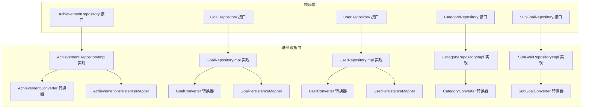
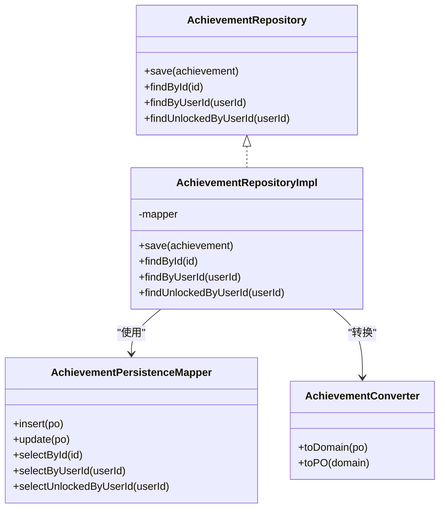
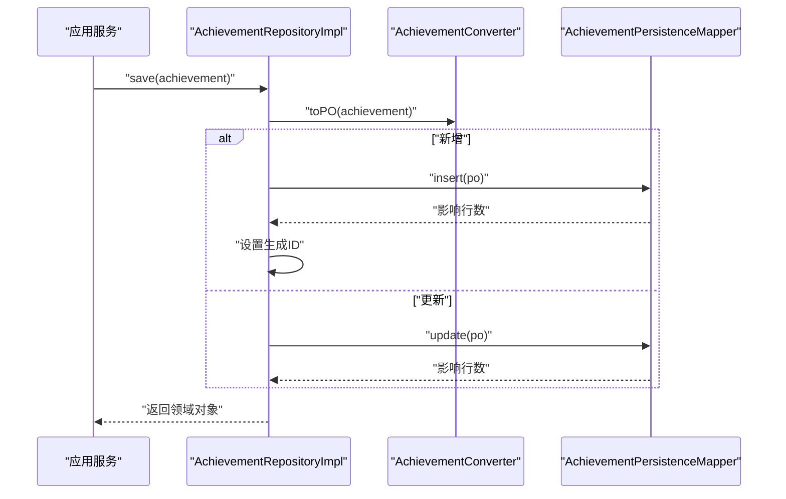
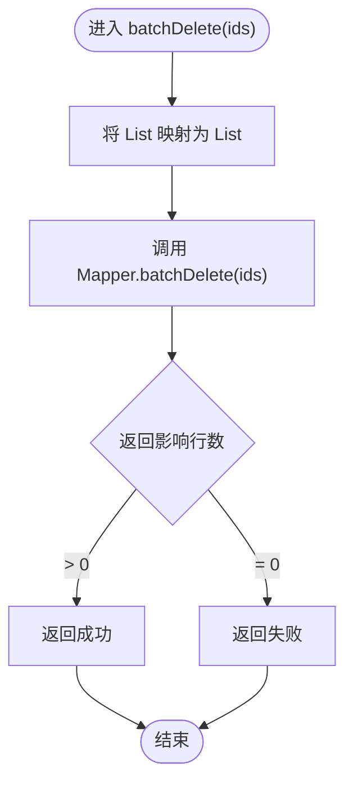
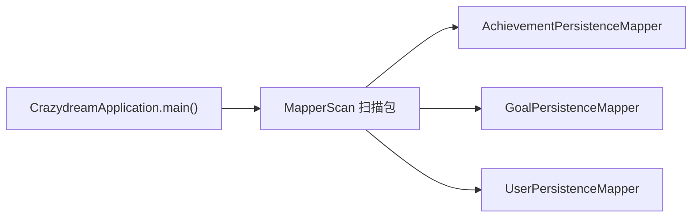

# 数据访问模式

<cite>
**本文引用的文件**
- [CrazydreamApplication.java](file://src/main/java/com/crazydream/CrazydreamApplication.java)
- [application.yml](file://src/main/resources/application.yml)
- [schema.sql](file://src/main/resources/schema.sql)
- [AchievementRepository.java](file://src/main/java/com/crazydream/domain/achievement/repository/AchievementRepository.java)
- [AchievementRepositoryImpl.java](file://src/main/java/com/crazydream/infrastructure/persistence/repository/AchievementRepositoryImpl.java)
- [AchievementPersistenceMapper.java](file://src/main/java/com/crazydream/infrastructure/persistence/mapper/AchievementPersistenceMapper.java)
- [AchievementConverter.java](file://src/main/java/com/crazydream/infrastructure/persistence/converter/AchievementConverter.java)
- [GoalRepository.java](file://src/main/java/com/crazydream/domain/goal/repository/GoalRepository.java)
- [GoalRepositoryImpl.java](file://src/main/java/com/crazydream/infrastructure/persistence/repository/GoalRepositoryImpl.java)
- [GoalPersistenceMapper.java](file://src/main/java/com/crazydream/infrastructure/persistence/mapper/GoalPersistenceMapper.java)
- [UserRepository.java](file://src/main/java/com/crazydream/domain/user/repository/UserRepository.java)
- [UserRepositoryImpl.java](file://src/main/java/com/crazydream/infrastructure/persistence/repository/UserRepositoryImpl.java)
- [UserPersistenceMapper.java](file://src/main/java/com/crazydream/infrastructure/persistence/mapper/UserPersistenceMapper.java)
- [CategoryRepository.java](file://src/main/java/com/crazydream/domain/category/repository/CategoryRepository.java)
- [CategoryRepositoryImpl.java](file://src/main/java/com/crazydream/infrastructure/persistence/repository/CategoryRepositoryImpl.java)
- [SubGoalRepository.java](file://src/main/java/com/crazydream/domain/subgoal/repository/SubGoalRepository.java)
- [SubGoalRepositoryImpl.java](file://src/main/java/com/crazydream/infrastructure/persistence/repository/SubGoalRepositoryImpl.java)
</cite>

## 目录
1. [引言](#引言)
2. [项目结构](#项目结构)
3. [核心组件](#核心组件)
4. [架构总览](#架构总览)
5. [详细组件分析](#详细组件分析)
6. [依赖分析](#依赖分析)
7. [性能考虑](#性能考虑)
8. [故障排查指南](#故障排查指南)
9. [结论](#结论)
10. [附录](#附录)

## 引言
本文件系统性梳理 CrazyDream 项目的数据访问层设计，重点阐述领域驱动设计（DDD）中仓储模式的实现与基础设施层对接方式。围绕 Repository 接口与实现类的职责划分、数据访问方法封装、转换器与持久化 Mapper 的协作、事务与连接池配置、异常处理策略、性能优化与批量操作等维度展开，旨在为开发者提供一套完整且可复用的数据访问层设计参考。

## 项目结构
数据访问层采用“领域接口 + 基础设施实现”的分层组织方式：
- 领域层：定义各聚合的仓储接口，作为防腐层，隔离业务与持久化细节
- 基础设施层：实现仓储接口，编排转换器与持久化 Mapper，完成数据库交互
- 配置层：Spring Boot 启动类扫描 Mapper 包，MyBatis 配置加载 XML 映射文件

图表来源
- [AchievementRepository.java](file://src/main/java/com/crazydream/domain/achievement/repository/AchievementRepository.java#L10-L15)
- [AchievementRepositoryImpl.java](file://src/main/java/com/crazydream/infrastructure/persistence/repository/AchievementRepositoryImpl.java#L18-L54)
- [AchievementPersistenceMapper.java](file://src/main/java/com/crazydream/infrastructure/persistence/mapper/AchievementPersistenceMapper.java#L8-L14)
- [AchievementConverter.java](file://src/main/java/com/crazydream/infrastructure/persistence/converter/AchievementConverter.java#L8-L44)
- [GoalRepository.java](file://src/main/java/com/crazydream/domain/goal/repository/GoalRepository.java#L18-L69)
- [GoalRepositoryImpl.java](file://src/main/java/com/crazydream/infrastructure/persistence/repository/GoalRepositoryImpl.java#L26-L111)
- [GoalPersistenceMapper.java](file://src/main/java/com/crazydream/infrastructure/persistence/mapper/GoalPersistenceMapper.java#L17-L74)
- [UserRepository.java](file://src/main/java/com/crazydream/domain/user/repository/UserRepository.java#L9-L14)
- [UserRepositoryImpl.java](file://src/main/java/com/crazydream/infrastructure/persistence/repository/UserRepositoryImpl.java#L18-L58)
- [UserPersistenceMapper.java](file://src/main/java/com/crazydream/infrastructure/persistence/mapper/UserPersistenceMapper.java#L7-L12)

章节来源
- [CrazydreamApplication.java](file://src/main/java/com/crazydream/CrazydreamApplication.java#L14-L25)
- [application.yml](file://src/main/resources/application.yml#L34-L39)

## 核心组件
- 仓储接口：定义聚合的持久化契约，如保存、查询、统计、批量删除等，确保领域模型与数据存储解耦
- 仓储实现：注入对应的持久化 Mapper，编排转换器，完成 PO/VO 到领域对象的双向转换
- 转换器：承担领域对象与持久化对象之间的映射与兼容处理
- 持久化 Mapper：基于 MyBatis 的接口映射，仅承载 SQL 访问，不包含业务逻辑
- 配置：启动类扫描 Mapper 包，MyBatis 配置启用驼峰映射与 XML 映射路径

章节来源
- [AchievementRepository.java](file://src/main/java/com/crazydream/domain/achievement/repository/AchievementRepository.java#L10-L15)
- [GoalRepository.java](file://src/main/java/com/crazydream/domain/goal/repository/GoalRepository.java#L18-L69)
- [UserRepository.java](file://src/main/java/com/crazydream/domain/user/repository/UserRepository.java#L9-L14)
- [CategoryRepository.java](file://src/main/java/com/crazydream/domain/category/repository/CategoryRepository.java#L9-L15)
- [SubGoalRepository.java](file://src/main/java/com/crazydream/domain/subgoal/repository/SubGoalRepository.java#L10-L16)

## 架构总览
下图展示仓储接口与实现、转换器与 Mapper 的整体交互关系，体现 DDD 中“领域接口在上、基础设施在下”的分层思想。

图表来源
- [AchievementRepository.java](file://src/main/java/com/crazydream/domain/achievement/repository/AchievementRepository.java#L10-L15)
- [AchievementRepositoryImpl.java](file://src/main/java/com/crazydream/infrastructure/persistence/repository/AchievementRepositoryImpl.java#L18-L54)
- [AchievementPersistenceMapper.java](file://src/main/java/com/crazydream/infrastructure/persistence/mapper/AchievementPersistenceMapper.java#L8-L14)
- [AchievementConverter.java](file://src/main/java/com/crazydream/infrastructure/persistence/converter/AchievementConverter.java#L8-L44)

## 详细组件分析

### 成就仓储（Achievement）
- 仓储接口：定义保存、按 ID 查询、按用户查询、查询已解锁成就等方法
- 实现类：根据是否存在 ID 决定插入或更新；查询后通过转换器映射为领域对象
- 转换器：负责将 PO 映射为领域对象并重建聚合，同时将领域对象写回 PO
- Mapper：提供基础 CRUD 与按用户筛选、按用户筛选已解锁记录的方法

图表来源
- [AchievementRepositoryImpl.java](file://src/main/java/com/crazydream/infrastructure/persistence/repository/AchievementRepositoryImpl.java#L24-L33)
- [AchievementPersistenceMapper.java](file://src/main/java/com/crazydream/infrastructure/persistence/mapper/AchievementPersistenceMapper.java#L9-L13)
- [AchievementConverter.java](file://src/main/java/com/crazydream/infrastructure/persistence/converter/AchievementConverter.java#L23-L43)

章节来源
- [AchievementRepository.java](file://src/main/java/com/crazydream/domain/achievement/repository/AchievementRepository.java#L10-L15)
- [AchievementRepositoryImpl.java](file://src/main/java/com/crazydream/infrastructure/persistence/repository/AchievementRepositoryImpl.java#L18-L54)
- [AchievementPersistenceMapper.java](file://src/main/java/com/crazydream/infrastructure/persistence/mapper/AchievementPersistenceMapper.java#L8-L14)
- [AchievementConverter.java](file://src/main/java/com/crazydream/infrastructure/persistence/converter/AchievementConverter.java#L8-L44)

### 目标仓储（Goal）
- 仓储接口：除基本 CRUD 外，扩展了按分类+用户查询、批量删除、最近更新列表、今日提醒、统计完成/有效数量等方法
- 实现类：统一通过转换器与 Mapper 协作；批量删除将 ID 列表转换为原生 Long 列表后委托 Mapper
- Mapper：提供批量删除、最近记录、今日提醒、统计等专用查询

图表来源
- [GoalRepositoryImpl.java](file://src/main/java/com/crazydream/infrastructure/persistence/repository/GoalRepositoryImpl.java#L79-L84)
- [GoalPersistenceMapper.java](file://src/main/java/com/crazydream/infrastructure/persistence/mapper/GoalPersistenceMapper.java#L53-L53)

章节来源
- [GoalRepository.java](file://src/main/java/com/crazydream/domain/goal/repository/GoalRepository.java#L18-L69)
- [GoalRepositoryImpl.java](file://src/main/java/com/crazydream/infrastructure/persistence/repository/GoalRepositoryImpl.java#L26-L111)
- [GoalPersistenceMapper.java](file://src/main/java/com/crazydream/infrastructure/persistence/mapper/GoalPersistenceMapper.java#L17-L74)

### 用户仓储（User）
- 仓储接口：保存、按 ID 查询、按邮箱查询、存在性检查
- 实现类：在按 ID 查询时输出调试日志，便于定位问题；存在性检查通过按邮箱查询结果判断
- Mapper：提供基础 CRUD 与按邮箱查询

章节来源
- [UserRepository.java](file://src/main/java/com/crazydream/domain/user/repository/UserRepository.java#L9-L14)
- [UserRepositoryImpl.java](file://src/main/java/com/crazydream/infrastructure/persistence/repository/UserRepositoryImpl.java#L18-L58)
- [UserPersistenceMapper.java](file://src/main/java/com/crazydream/infrastructure/persistence/mapper/UserPersistenceMapper.java#L7-L12)

### 分类仓储（Category）与子目标仓储（SubGoal）
- 分类仓储：提供保存、按 ID 查询、查询全部、查询启用、删除等方法
- 子目标仓储：提供保存、按 ID 查询、按目标查询、删除、批量删除

章节来源
- [CategoryRepository.java](file://src/main/java/com/crazydream/domain/category/repository/CategoryRepository.java#L9-L15)
- [CategoryRepositoryImpl.java](file://src/main/java/com/crazydream/infrastructure/persistence/repository/CategoryRepositoryImpl.java#L17-L58)
- [SubGoalRepository.java](file://src/main/java/com/crazydream/domain/subgoal/repository/SubGoalRepository.java#L10-L16)
- [SubGoalRepositoryImpl.java](file://src/main/java/com/crazydream/infrastructure/persistence/repository/SubGoalRepositoryImpl.java#L18-L61)

## 依赖分析
- 组件耦合：仓储实现依赖转换器与 Mapper，保持领域模型与数据访问的低耦合
- 循环依赖：通过允许循环依赖的配置避免跨包装配问题
- 扫描范围：启动类集中扫描 Mapper 包，确保 MyBatis 能正确加载 XML 映射

图表来源
- [CrazydreamApplication.java](file://src/main/java/com/crazydream/CrazydreamApplication.java#L14-L25)

章节来源
- [application.yml](file://src/main/resources/application.yml#L34-L39)

## 性能考虑
- 连接池与事务
  - 数据源配置位于 application.yml，生产环境建议通过环境变量注入敏感信息
  - 事务管理：当前实现未显式声明事务注解，建议在应用服务层对写操作进行事务控制，以保证一致性
- 批量操作
  - 已在目标仓储实现批量删除，建议对频繁的批量写入场景统一走批量接口，减少往返次数
- 缓存机制
  - 未发现显式缓存实现；可在高频只读查询（如分类启用列表、用户基本信息）引入二级缓存或本地缓存，降低数据库压力
- SQL 优化
  - 建议为常用查询字段建立索引（如 user_id、category_id、email 等），并结合慢查询日志定位热点 SQL
- ORM 映射
  - MyBatis 已开启驼峰命名映射，有助于提升字段映射效率与可维护性

章节来源
- [application.yml](file://src/main/resources/application.yml#L10-L17)
- [GoalRepositoryImpl.java](file://src/main/java/com/crazydream/infrastructure/persistence/repository/GoalRepositoryImpl.java#L79-L84)
- [application.yml](file://src/main/resources/application.yml#L34-L39)

## 故障排查指南
- 数据库连接
  - 检查数据源 URL、用户名、密码是否正确，生产环境通过环境变量注入
- 日志定位
  - 用户仓储在按 ID 查询时输出调试日志，可用于快速确认查询路径与结果
- 字段映射
  - 确认实体字段与数据库列名一致或启用驼峰映射，避免空值或类型不匹配
- SQL 映射
  - 确认 Mapper XML 文件路径与 application.yml 中的 mapper-locations 配置一致

章节来源
- [application.yml](file://src/main/resources/application.yml#L10-L17)
- [UserRepositoryImpl.java](file://src/main/java/com/crazydream/infrastructure/persistence/repository/UserRepositoryImpl.java#L39-L45)
- [application.yml](file://src/main/resources/application.yml#L34-L39)

## 结论
CrazyDream 的数据访问层严格遵循 DDD 仓储模式，通过“领域接口 + 基础设施实现 + 转换器 + Mapper”的分层设计，实现了领域模型与持久化技术的解耦。当前实现具备良好的扩展性与可维护性，建议在应用服务层补充事务管理，并针对高频只读数据引入缓存与索引优化，以进一步提升系统性能与稳定性。

## 附录
- 数据库建表脚本：包含用户、分类、目标、提醒、子目标、成就等核心表结构与默认数据
- 启动类与 MyBatis 配置：集中扫描 Mapper 包并启用驼峰映射，确保运行时正确加载

章节来源
- [schema.sql](file://src/main/resources/schema.sql#L1-L111)
- [CrazydreamApplication.java](file://src/main/java/com/crazydream/CrazydreamApplication.java#L14-L25)
- [application.yml](file://src/main/resources/application.yml#L34-L39)