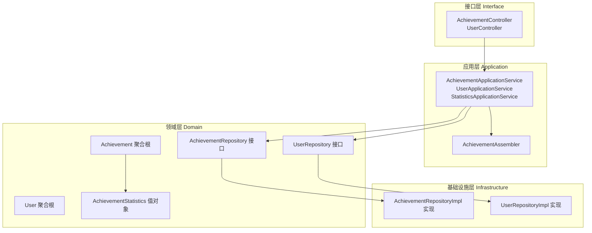
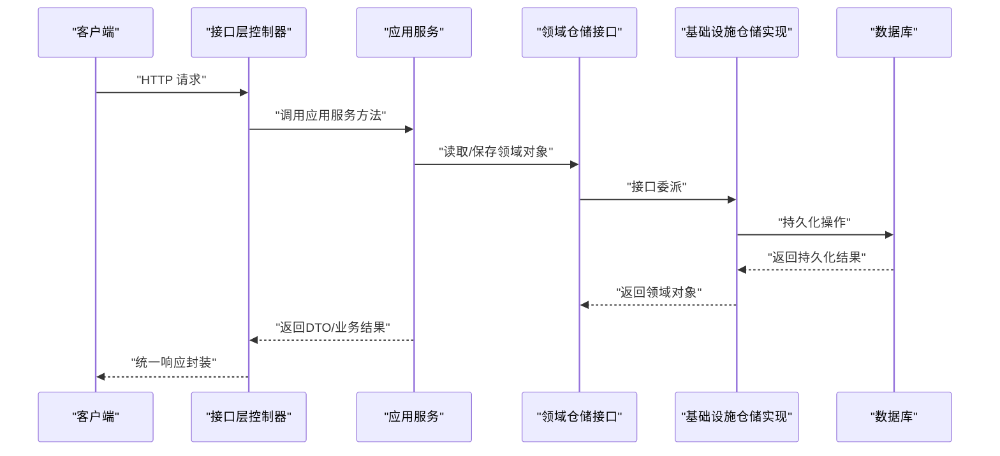
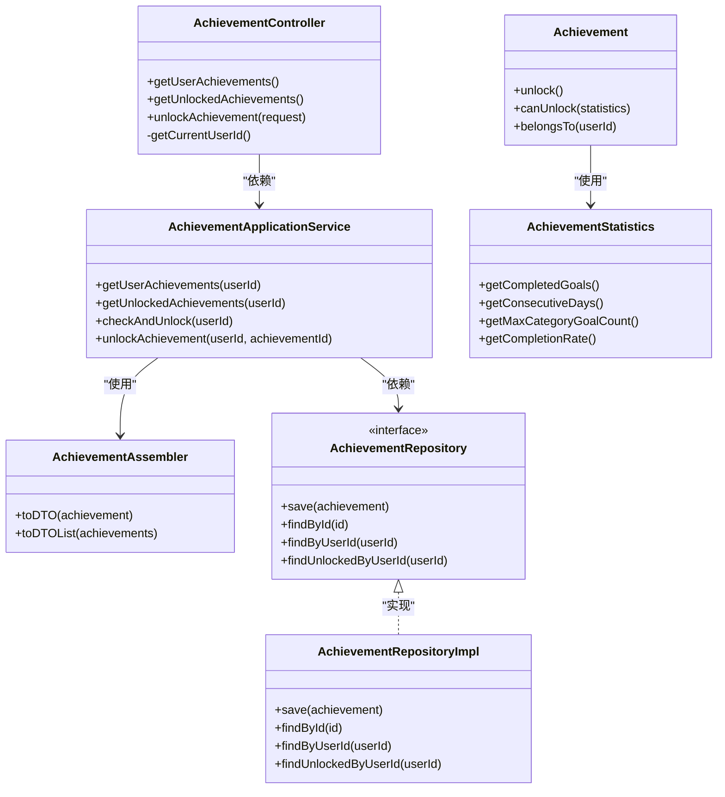
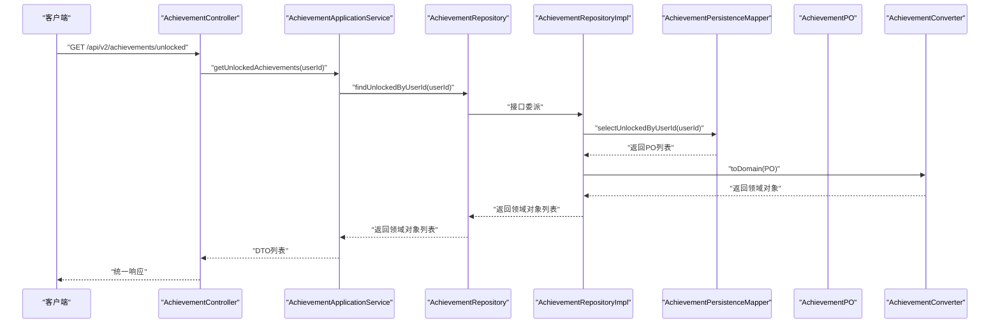
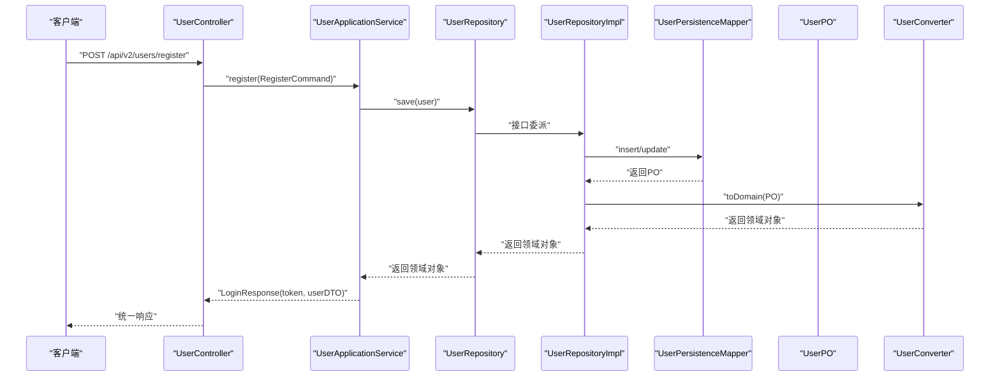
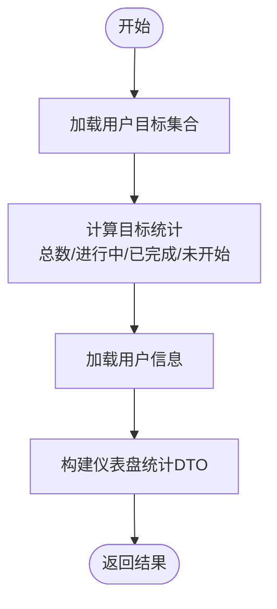
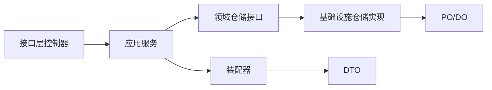

# DDD + COLA 四层架构

<cite>
**本文引用的文件**
- [README.md](file://README.md)
- [CrazydreamApplication.java](file://src/main/java/com/crazydream/CrazydreamApplication.java)
- [AchievementController.java](file://src/main/java/com/crazydream/interfaces/achievement/AchievementController.java)
- [UserController.java](file://src/main/java/com/crazydream/interfaces/user/UserController.java)
- [AchievementApplicationService.java](file://src/main/java/com/crazydream/application/achievement/service/AchievementApplicationService.java)
- [UserApplicationService.java](file://src/main/java/com/crazydream/application/user/service/UserApplicationService.java)
- [StatisticsApplicationService.java](file://src/main/java/com/crazydream/application/statistics/service/StatisticsApplicationService.java)
- [AchievementAssembler.java](file://src/main/java/com/crazydream/application/achievement/assembler/AchievementAssembler.java)
- [AchievementRepository.java](file://src/main/java/com/crazydream/domain/achievement/repository/AchievementRepository.java)
- [AchievementRepositoryImpl.java](file://src/main/java/com/crazydream/infrastructure/persistence/repository/AchievementRepositoryImpl.java)
- [UserRepository.java](file://src/main/java/com/crazydream/domain/user/repository/UserRepository.java)
- [UserRepositoryImpl.java](file://src/main/java/com/crazydream/infrastructure/persistence/repository/UserRepositoryImpl.java)
- [Achievement.java](file://src/main/java/com/crazydream/domain/achievement/model/aggregate/Achievement.java)
- [User.java](file://src/main/java/com/crazydream/domain/user/model/aggregate/User.java)
- [AchievementStatistics.java](file://src/main/java/com/crazydream/domain/achievement/model/valueobject/AchievementStatistics.java)
- [ApiResponse.java](file://src/main/java/com/crazydream/common/ApiResponse.java)
- [pom.xml](file://pom.xml)
</cite>

## 目录
1. [引言](#引言)
2. [项目结构](#项目结构)
3. [核心组件](#核心组件)
4. [架构总览](#架构总览)
5. [详细组件分析](#详细组件分析)
6. [依赖分析](#依赖分析)
7. [性能考量](#性能考量)
8. [故障排查指南](#故障排查指南)
9. [结论](#结论)
10. [附录](#附录)

## 引言
本文件面向 CrazyDream 项目，系统性阐述其基于 DDD（领域驱动设计）与 COLA（Clean Object-Oriented Architecture）的四层架构落地方式。四层分别为：
- Interface 层（接口层）：对外暴露 REST API，负责请求适配与 DTO 组装
- Application 层（应用层）：编排用例流程、协调领域对象与基础设施、承担事务边界
- Domain 层（领域层）：承载核心业务规则、实体与值对象、领域服务
- Infrastructure 层（基础设施层）：实现 Repository、持久化与外部系统适配

该架构强调“以领域模型为核心”，通过清晰的分层与依赖方向，确保业务逻辑内聚、可测试、可演进。

章节来源
- file://README.md#L62-L85

## 项目结构
项目采用按“能力域”划分的多模块结构，配合 COLA 的四层组织方式：
- 接口层：com.crazydream.interfaces 下按功能域划分控制器
- 应用层：com.crazydream.application 下按功能域划分应用服务与装配器
- 领域层：com.crazydream.domain 下按聚合与值对象组织
- 基础设施层：com.crazydream.infrastructure 下按持久化与转换器组织
- 支撑模块：config、security、common、utils 提供配置、安全、公共模型与工具

图表来源
- [AchievementController.java](file://src/main/java/com/crazydream/interfaces/achievement/AchievementController.java#L1-L113)
- [UserController.java](file://src/main/java/com/crazydream/interfaces/user/UserController.java#L1-L132)
- [AchievementApplicationService.java](file://src/main/java/com/crazydream/application/achievement/service/AchievementApplicationService.java#L1-L91)
- [UserApplicationService.java](file://src/main/java/com/crazydream/application/user/service/UserApplicationService.java#L1-L98)
- [StatisticsApplicationService.java](file://src/main/java/com/crazydream/application/statistics/service/StatisticsApplicationService.java#L1-L106)
- [AchievementAssembler.java](file://src/main/java/com/crazydream/application/achievement/assembler/AchievementAssembler.java#L1-L34)
- [AchievementRepository.java](file://src/main/java/com/crazydream/domain/achievement/repository/AchievementRepository.java#L1-L16)
- [UserRepository.java](file://src/main/java/com/crazydream/domain/user/repository/UserRepository.java)
- [AchievementRepositoryImpl.java](file://src/main/java/com/crazydream/infrastructure/persistence/repository/AchievementRepositoryImpl.java#L1-L55)
- [UserRepositoryImpl.java](file://src/main/java/com/crazydream/infrastructure/persistence/repository/UserRepositoryImpl.java#L1-L59)
- [Achievement.java](file://src/main/java/com/crazydream/domain/achievement/model/aggregate/Achievement.java#L1-L184)
- [User.java](file://src/main/java/com/crazydream/domain/user/model/aggregate/User.java#L1-L122)
- [AchievementStatistics.java](file://src/main/java/com/crazydream/domain/achievement/model/valueobject/AchievementStatistics.java#L1-L192)

章节来源
- file://README.md#L72-L85

## 核心组件
- 接口层控制器：提供 REST API，负责参数接收、鉴权上下文解析、异常兜底与统一响应封装
- 应用服务：编排业务用例、协调仓储与装配器、声明事务边界
- 领域模型：聚合根与值对象承载业务规则，保证不变量与行为内聚
- 基础设施仓储：实现领域仓储接口，完成 PO/DO 与领域对象的双向转换

章节来源
- file://src/main/java/com/crazydream/interfaces/achievement/AchievementController.java#L1-L113
- file://src/main/java/com/crazydream/application/achievement/service/AchievementApplicationService.java#L1-L91
- file://src/main/java/com/crazydream/domain/achievement/model/aggregate/Achievement.java#L1-L184
- file://src/main/java/com/crazydream/infrastructure/persistence/repository/AchievementRepositoryImpl.java#L1-L55

## 架构总览
COLA 四层与 DDD 的结合要点：
- 以领域模型为核心，应用层仅编排，不做业务判断
- 接口层只做请求适配与响应封装，不参与业务决策
- 基础设施层屏蔽持久化与外部系统差异，向上暴露领域仓储接口
- 通过装配器在应用层完成 DTO 与领域对象的转换

图表来源
- [AchievementController.java](file://src/main/java/com/crazydream/interfaces/achievement/AchievementController.java#L28-L58)
- [AchievementApplicationService.java](file://src/main/java/com/crazydream/application/achievement/service/AchievementApplicationService.java#L41-L62)
- [AchievementRepository.java](file://src/main/java/com/crazydream/domain/achievement/repository/AchievementRepository.java#L10-L15)
- [AchievementRepositoryImpl.java](file://src/main/java/com/crazydream/infrastructure/persistence/repository/AchievementRepositoryImpl.java#L24-L33)

## 详细组件分析

### 成就系统（Achievement）组件分析
- 控制器职责：解析当前用户、调用应用服务、统一响应封装
- 应用服务职责：确保成就聚合齐全、触发成就检查与解锁、权限校验
- 领域模型职责：成就聚合根承载解锁与可解锁判定、值对象封装统计数据
- 基础设施职责：PO/DO 转换、Mapper 映射、仓储实现

图表来源
- [AchievementController.java](file://src/main/java/com/crazydream/interfaces/achievement/AchievementController.java#L1-L113)
- [AchievementApplicationService.java](file://src/main/java/com/crazydream/application/achievement/service/AchievementApplicationService.java#L1-L91)
- [AchievementAssembler.java](file://src/main/java/com/crazydream/application/achievement/assembler/AchievementAssembler.java#L1-L34)
- [AchievementRepository.java](file://src/main/java/com/crazydream/domain/achievement/repository/AchievementRepository.java#L1-L16)
- [AchievementRepositoryImpl.java](file://src/main/java/com/crazydream/infrastructure/persistence/repository/AchievementRepositoryImpl.java#L1-L55)
- [Achievement.java](file://src/main/java/com/crazydream/domain/achievement/model/aggregate/Achievement.java#L1-L184)
- [AchievementStatistics.java](file://src/main/java/com/crazydream/domain/achievement/model/valueobject/AchievementStatistics.java#L1-L192)

图表来源
- [AchievementController.java](file://src/main/java/com/crazydream/interfaces/achievement/AchievementController.java#L39-L48)
- [AchievementApplicationService.java](file://src/main/java/com/crazydream/application/achievement/service/AchievementApplicationService.java#L46-L49)
- [AchievementRepositoryImpl.java](file://src/main/java/com/crazydream/infrastructure/persistence/repository/AchievementRepositoryImpl.java#L48-L53)

章节来源
- file://src/main/java/com/crazydream/interfaces/achievement/AchievementController.java#L28-L58
- file://src/main/java/com/crazydream/application/achievement/service/AchievementApplicationService.java#L41-L62
- file://src/main/java/com/crazydream/domain/achievement/model/aggregate/Achievement.java#L44-L126
- file://src/main/java/com/crazydream/infrastructure/persistence/repository/AchievementRepositoryImpl.java#L24-L53

### 用户系统（User）组件分析
- 控制器职责：注册、登录、获取/更新用户资料、积分加减
- 应用服务职责：密码加密、JWT 签发、用户资料更新、等级升级
- 领域模型职责：用户聚合根封装资料变更、积分与等级规则
- 基础设施职责：用户仓储实现、PO/DO 转换

图表来源
- [UserController.java](file://src/main/java/com/crazydream/interfaces/user/UserController.java#L26-L34)
- [UserApplicationService.java](file://src/main/java/com/crazydream/application/user/service/UserApplicationService.java#L27-L43)
- [UserRepositoryImpl.java](file://src/main/java/com/crazydream/infrastructure/persistence/repository/UserRepositoryImpl.java#L25-L35)

章节来源
- file://src/main/java/com/crazydream/interfaces/user/UserController.java#L26-L88
- file://src/main/java/com/crazydream/application/user/service/UserApplicationService.java#L27-L43
- file://src/main/java/com/crazydream/domain/user/model/aggregate/User.java#L28-L87
- file://src/main/java/com/crazydream/infrastructure/persistence/repository/UserRepositoryImpl.java#L25-L57

### 统计系统（Statistics）组件分析
- 应用服务职责：聚合目标统计、仪表盘统计、分类统计与趋势统计
- 领域协作：读取目标与用户仓储，组装 DTO 返回

图表来源
- [StatisticsApplicationService.java](file://src/main/java/com/crazydream/application/statistics/service/StatisticsApplicationService.java#L29-L55)

章节来源
- file://src/main/java/com/crazydream/application/statistics/service/StatisticsApplicationService.java#L17-L105

## 依赖分析
- 分层依赖方向：接口层 → 应用层 → 领域层 → 基础设施层
- 反向依赖：基础设施实现实现领域仓储接口，向上提供领域对象
- 关键依赖点：
  - 控制器依赖应用服务
  - 应用服务依赖领域仓储接口
  - 领域仓储接口由基础设施实现
  - 应用服务使用装配器进行 DTO 转换

图表来源
- [AchievementController.java](file://src/main/java/com/crazydream/interfaces/achievement/AchievementController.java#L1-L113)
- [AchievementApplicationService.java](file://src/main/java/com/crazydream/application/achievement/service/AchievementApplicationService.java#L1-L91)
- [AchievementAssembler.java](file://src/main/java/com/crazydream/application/achievement/assembler/AchievementAssembler.java#L1-L34)
- [AchievementRepository.java](file://src/main/java/com/crazydream/domain/achievement/repository/AchievementRepository.java#L1-L16)
- [AchievementRepositoryImpl.java](file://src/main/java/com/crazydream/infrastructure/persistence/repository/AchievementRepositoryImpl.java#L1-L55)

章节来源
- file://src/main/java/com/crazydream/interfaces/achievement/AchievementController.java#L1-L113
- file://src/main/java/com/crazydream/application/achievement/service/AchievementApplicationService.java#L1-L91
- file://src/main/java/com/crazydream/infrastructure/persistence/repository/AchievementRepositoryImpl.java#L1-L55

## 性能考量
- DTO 转换成本：装配器在应用层集中处理，建议批量转换与缓存热点数据
- 仓储查询：尽量使用 ID 精准查询，避免 N+1；复杂统计建议在应用层聚合
- 事务范围：应用服务声明事务，保持短事务，避免在事务内执行 IO 或耗时操作
- 日志与监控：利用统一响应与日志记录关键路径，定位性能瓶颈

## 故障排查指南
- 统一响应封装：接口层控制器与公共响应类统一返回格式，便于前端与网关侧处理
- 异常处理：控制器捕获异常并返回统一错误响应，应用层抛出语义化异常
- 鉴权上下文：控制器从安全上下文中解析用户 ID，若为空则使用默认值，便于测试与降级

章节来源
- file://src/main/java/com/crazydream/interfaces/achievement/AchievementController.java#L30-L37
- file://src/main/java/com/crazydream/interfaces/user/UserController.java#L101-L130
- file://src/main/java/com/crazydream/common/ApiResponse.java#L1-L108

## 结论
CrazyDream 项目通过 DDD 与 COLA 的结合，实现了清晰的分层与职责分离。接口层专注于请求适配与响应封装，应用层编排业务用例并声明事务，领域层承载核心规则，基础设施层屏蔽持久化细节。该架构有利于长期演进、团队协作与测试覆盖。

## 附录
- 启动入口：应用启动类扫描 Mapper 并启动 Spring Boot
- 依赖管理：pom.xml 管理 Spring Boot、MyBatis、Security、JWT、OSS 等依赖

章节来源
- file://src/main/java/com/crazydream/CrazydreamApplication.java#L1-L27
- file://pom.xml#L24-L118