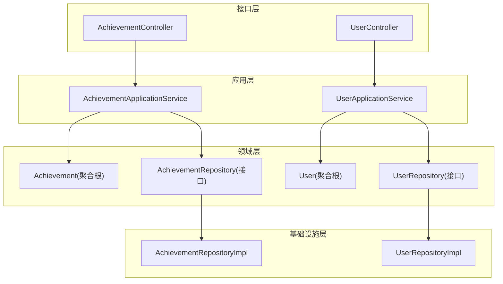
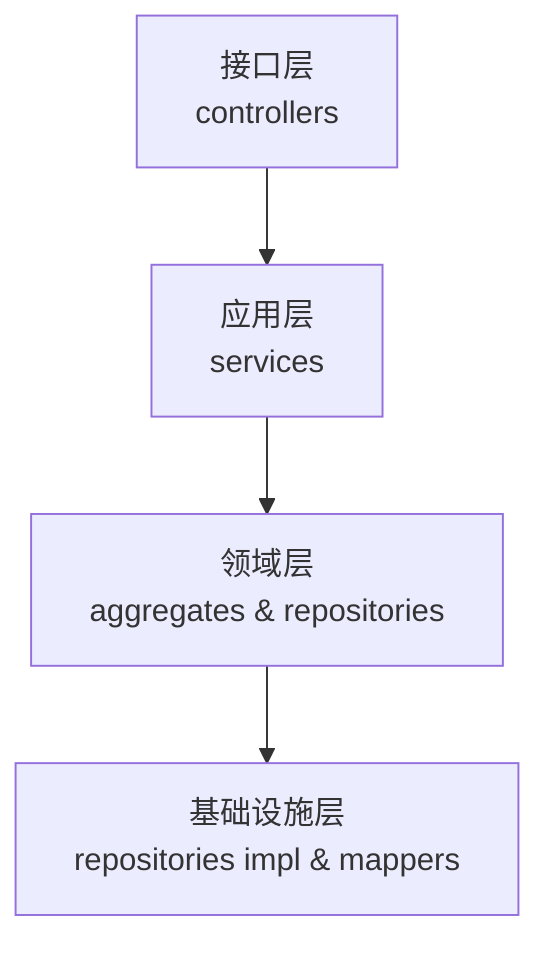
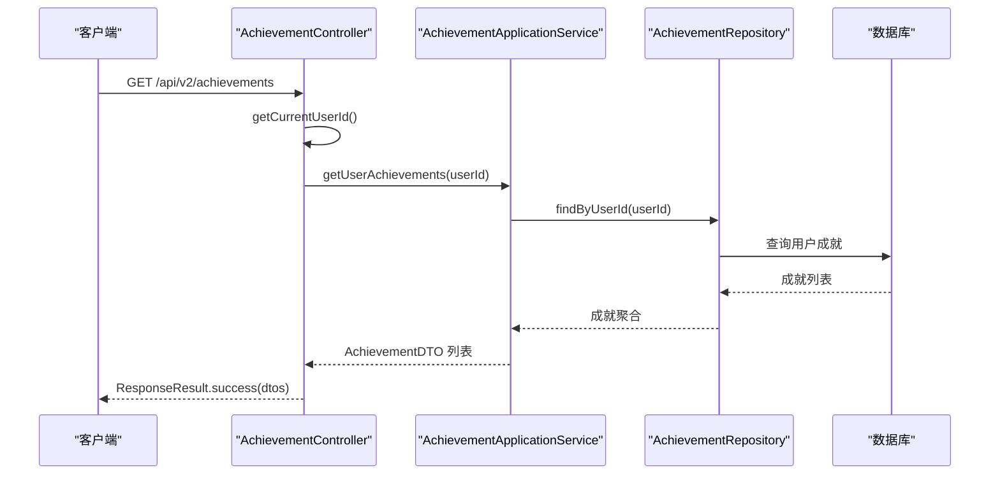
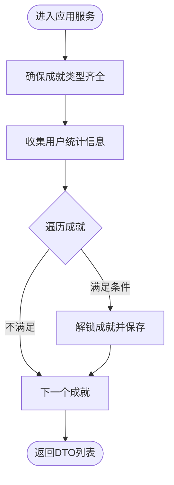
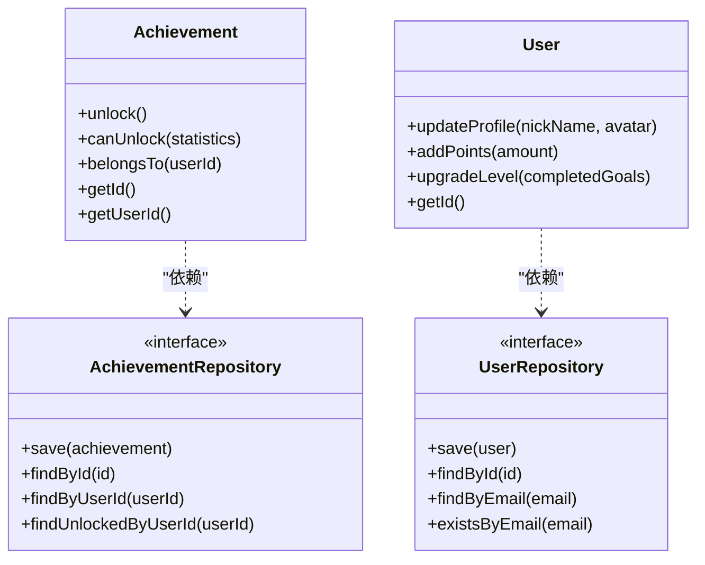
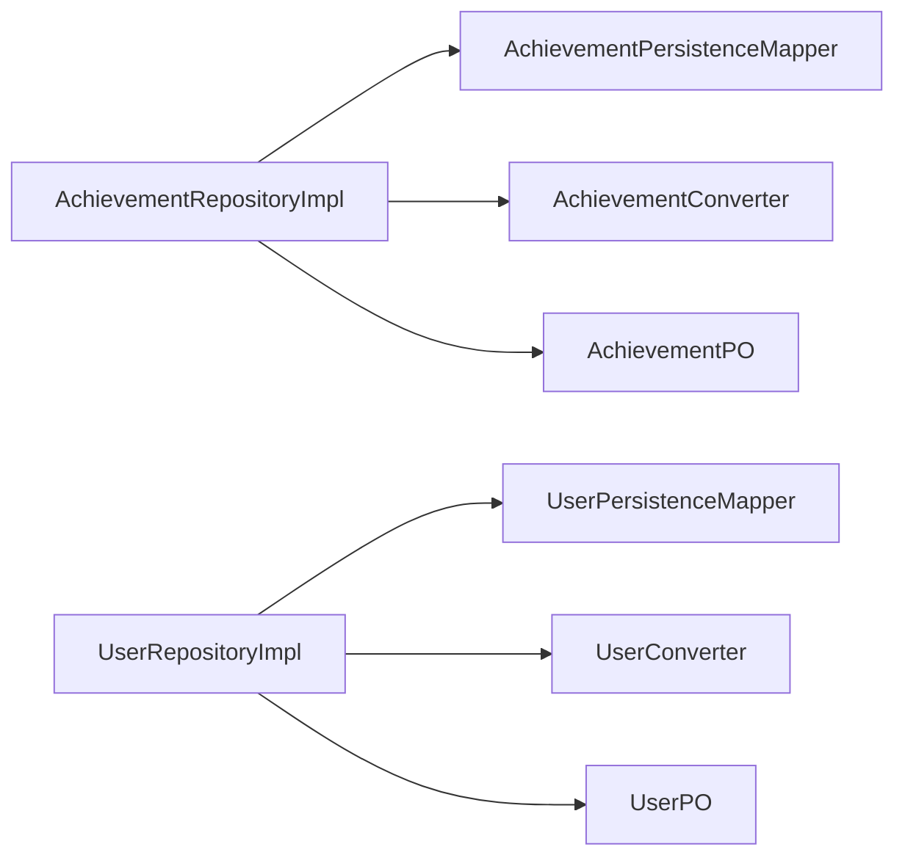
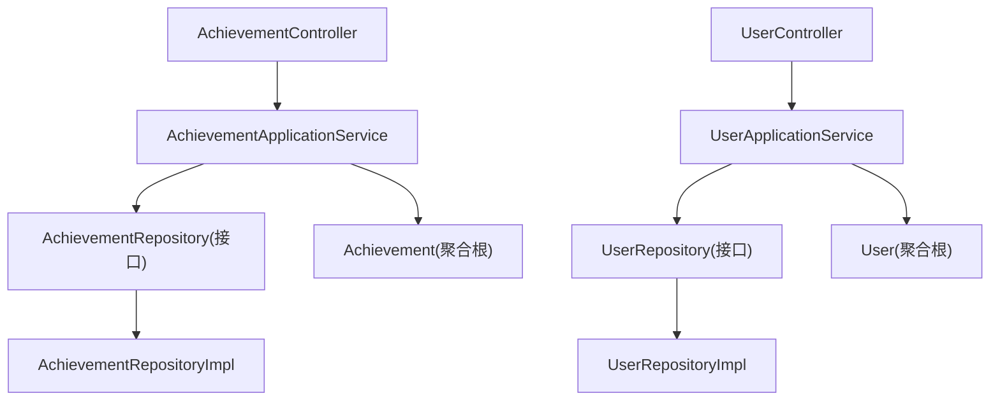

# 分层架构设计模式

<cite>
**本文档引用的文件**
- [CrazydreamApplication.java](file://src/main/java/com/crazydream/CrazydreamApplication.java)
- [AchievementController.java](file://src/main/java/com/crazydream/interfaces/achievement/AchievementController.java)
- [UserController.java](file://src/main/java/com/crazydream/interfaces/user/UserController.java)
- [AchievementApplicationService.java](file://src/main/java/com/crazydream/application/achievement/service/AchievementApplicationService.java)
- [UserApplicationService.java](file://src/main/java/com/crazydream/application/user/service/UserApplicationService.java)
- [AchievementAssembler.java](file://src/main/java/com/crazydream/application/achievement/assembler/AchievementAssembler.java)
- [UserAssembler.java](file://src/main/java/com/crazydream/application/user/assembler/UserAssembler.java)
- [Achievement.java](file://src/main/java/com/crazydream/domain/achievement/model/aggregate/Achievement.java)
- [User.java](file://src/main/java/com/crazydream/domain/user/model/aggregate/User.java)
- [AchievementRepository.java](file://src/main/java/com/crazydream/domain/achievement/repository/AchievementRepository.java)
- [UserRepository.java](file://src/main/java/com/crazydream/domain/user/repository/UserRepository.java)
- [AchievementRepositoryImpl.java](file://src/main/java/com/crazydream/infrastructure/persistence/repository/AchievementRepositoryImpl.java)
- [UserRepositoryImpl.java](file://src/main/java/com/crazydream/infrastructure/persistence/repository/UserRepositoryImpl.java)
- [ResponseResult.java](file://src/main/java/com/crazydream/utils/ResponseResult.java)
- [ApiResponse.java](file://src/main/java/com/crazydream/common/ApiResponse.java)
- [application.yml](file://src/main/resources/application.yml)
- [pom.xml](file://pom.xml)
</cite>

## 目录
1. [引言](#引言)
2. [项目结构](#项目结构)
3. [核心组件](#核心组件)
4. [架构总览](#架构总览)
5. [详细组件分析](#详细组件分析)
6. [依赖关系分析](#依赖关系分析)
7. [性能考虑](#性能考虑)
8. [故障排除指南](#故障排除指南)
9. [结论](#结论)

## 引言
本文件系统性阐述 CrazyDream 项目的分层架构设计模式，围绕接口层、应用层、领域层与基础设施层的职责划分、依赖方向与通信机制展开，并结合实际代码路径说明依赖倒置原则的应用与解耦策略。文档同时提供面向不同技术背景读者的渐进式理解路径与可视化图示。

## 项目结构
项目采用按层次与按功能域混合的组织方式：
- 接口层（interfaces）：暴露 HTTP REST 接口，负责请求封装与响应统一封装
- 应用层（application）：编排业务用例，协调领域对象与 DTO 转换
- 领域层（domain）：承载核心业务模型与规则，采用充血模型
- 基础设施层（infrastructure）：处理持久化、外部依赖与第三方集成
- 公共工具（common、utils）：提供统一响应封装与通用工具类
- 配置（resources）：Spring、MyBatis、安全等配置

图表来源
- [AchievementController.java](file://src/main/java/com/crazydream/interfaces/achievement/AchievementController.java#L1-L113)
- [UserController.java](file://src/main/java/com/crazydream/interfaces/user/UserController.java#L1-L132)
- [AchievementApplicationService.java](file://src/main/java/com/crazydream/application/achievement/service/AchievementApplicationService.java#L1-L91)
- [UserApplicationService.java](file://src/main/java/com/crazydream/application/user/service/UserApplicationService.java#L1-L98)
- [Achievement.java](file://src/main/java/com/crazydream/domain/achievement/model/aggregate/Achievement.java#L1-L184)
- [User.java](file://src/main/java/com/crazydream/domain/user/model/aggregate/User.java#L1-L122)
- [AchievementRepository.java](file://src/main/java/com/crazydream/domain/achievement/repository/AchievementRepository.java#L1-L16)
- [UserRepository.java](file://src/main/java/com/crazydream/domain/user/repository/UserRepository.java)
- [AchievementRepositoryImpl.java](file://src/main/java/com/crazydream/infrastructure/persistence/repository/AchievementRepositoryImpl.java#L1-L55)
- [UserRepositoryImpl.java](file://src/main/java/com/crazydream/infrastructure/persistence/repository/UserRepositoryImpl.java#L1-L59)

章节来源
- [CrazydreamApplication.java](file://src/main/java/com/crazydream/CrazydreamApplication.java#L1-L27)
- [application.yml](file://src/main/resources/application.yml#L1-L75)

## 核心组件
- 接口层控制器：接收 HTTP 请求，解析认证上下文，调用应用服务，使用统一响应封装返回
- 应用服务：编排业务流程，协调仓储与装配器，处理事务边界
- 领域模型：以聚合根为核心，封装业务行为与不变式
- 仓储接口与实现：定义领域抽象，由基础设施层具体实现
- 统一响应封装：对外输出一致的数据结构

章节来源
- [AchievementController.java](file://src/main/java/com/crazydream/interfaces/achievement/AchievementController.java#L1-L113)
- [UserController.java](file://src/main/java/com/crazydream/interfaces/user/UserController.java#L1-L132)
- [AchievementApplicationService.java](file://src/main/java/com/crazydream/application/achievement/service/AchievementApplicationService.java#L1-L91)
- [UserApplicationService.java](file://src/main/java/com/crazydream/application/user/service/UserApplicationService.java#L1-L98)
- [Achievement.java](file://src/main/java/com/crazydream/domain/achievement/model/aggregate/Achievement.java#L1-L184)
- [User.java](file://src/main/java/com/crazydream/domain/user/model/aggregate/User.java#L1-L122)
- [AchievementRepository.java](file://src/main/java/com/crazydream/domain/achievement/repository/AchievementRepository.java#L1-L16)
- [UserRepository.java](file://src/main/java/com/crazydream/domain/user/repository/UserRepository.java)
- [AchievementRepositoryImpl.java](file://src/main/java/com/crazydream/infrastructure/persistence/repository/AchievementRepositoryImpl.java#L1-L55)
- [UserRepositoryImpl.java](file://src/main/java/com/crazydream/infrastructure/persistence/repository/UserRepositoryImpl.java#L1-L59)
- [ResponseResult.java](file://src/main/java/com/crazydream/utils/ResponseResult.java#L1-L149)
- [ApiResponse.java](file://src/main/java/com/crazydream/common/ApiResponse.java#L1-L108)

## 架构总览
分层架构遵循“依赖倒置”与“单一职责”原则：
- 上层（接口层、应用层）仅依赖下层抽象（领域接口、仓储接口）
- 下层（基础设施层）实现上层抽象，向上提供稳定接口
- 领域层保持纯净业务逻辑，避免受框架与外部依赖影响

图表来源
- [AchievementController.java](file://src/main/java/com/crazydream/interfaces/achievement/AchievementController.java#L1-L113)
- [UserController.java](file://src/main/java/com/crazydream/interfaces/user/UserController.java#L1-L132)
- [AchievementApplicationService.java](file://src/main/java/com/crazydream/application/achievement/service/AchievementApplicationService.java#L1-L91)
- [UserApplicationService.java](file://src/main/java/com/crazydream/application/user/service/UserApplicationService.java#L1-L98)
- [AchievementRepositoryImpl.java](file://src/main/java/com/crazydream/infrastructure/persistence/repository/AchievementRepositoryImpl.java#L1-L55)
- [UserRepositoryImpl.java](file://src/main/java/com/crazydream/infrastructure/persistence/repository/UserRepositoryImpl.java#L1-L59)

## 详细组件分析

### 接口层：HTTP 请求与响应封装
- 控制器职责
  - AchievementController：提供成就查询、解锁等接口；从安全上下文解析当前用户 ID；调用应用服务并返回统一响应
  - UserController：提供用户注册、登录、查询与更新等接口；同样基于安全上下文解析用户 ID 并调用应用服务
- 统一响应封装
  - ResponseResult：封装 code、message、data，并可转换为 ResponseEntity，依据 code 映射 HTTP 状态码
  - ApiResponse：另一种统一响应封装（用于不同场景），与 ResponseResult 协同使用

图表来源
- [AchievementController.java](file://src/main/java/com/crazydream/interfaces/achievement/AchievementController.java#L28-L37)
- [AchievementApplicationService.java](file://src/main/java/com/crazydream/application/achievement/service/AchievementApplicationService.java#L41-L44)
- [AchievementRepositoryImpl.java](file://src/main/java/com/crazydream/infrastructure/persistence/repository/AchievementRepositoryImpl.java#L42-L46)

章节来源
- [AchievementController.java](file://src/main/java/com/crazydream/interfaces/achievement/AchievementController.java#L1-L113)
- [UserController.java](file://src/main/java/com/crazydream/interfaces/user/UserController.java#L1-L132)
- [ResponseResult.java](file://src/main/java/com/crazydream/utils/ResponseResult.java#L1-L149)
- [ApiResponse.java](file://src/main/java/com/crazydream/common/ApiResponse.java#L1-L108)

### 应用层：业务用例编排
- AchievementApplicationService
  - 确保用户拥有完整成就类型集合（缺失则创建并保存）
  - 基于统计信息检查并批量解锁成就
  - 支持手动解锁并进行权限校验
  - 使用 AchievementAssembler 将领域对象转换为 DTO
- UserApplicationService
  - 注册：校验邮箱唯一性、加密密码、生成 JWT、返回登录响应
  - 登录：验证凭据并签发令牌
  - 更新资料与积分变动、等级升级等

图表来源
- [AchievementApplicationService.java](file://src/main/java/com/crazydream/application/achievement/service/AchievementApplicationService.java#L25-L62)
- [AchievementAssembler.java](file://src/main/java/com/crazydream/application/achievement/assembler/AchievementAssembler.java#L9-L33)

章节来源
- [AchievementApplicationService.java](file://src/main/java/com/crazydream/application/achievement/service/AchievementApplicationService.java#L1-L91)
- [UserApplicationService.java](file://src/main/java/com/crazydream/application/user/service/UserApplicationService.java#L1-L98)
- [AchievementAssembler.java](file://src/main/java/com/crazydream/application/achievement/assembler/AchievementAssembler.java#L1-L34)
- [UserAssembler.java](file://src/main/java/com/crazydream/application/user/assembler/UserAssembler.java)

### 领域层：业务逻辑封装
- Achievement（聚合根）
  - 提供解锁、判定解锁条件、归属校验等业务行为
  - 通过 AchievementStatistics 判定解锁条件，覆盖目标完成、连续打卡、分类专注、效率提升、里程碑等多个维度
- User（聚合根）
  - 提供更新资料、变更密码、积分增减、等级升级等业务行为
  - 通过 UserLevel 的升级策略控制等级变化

图表来源
- [Achievement.java](file://src/main/java/com/crazydream/domain/achievement/model/aggregate/Achievement.java#L1-L184)
- [User.java](file://src/main/java/com/crazydream/domain/user/model/aggregate/User.java#L1-L122)
- [AchievementRepository.java](file://src/main/java/com/crazydream/domain/achievement/repository/AchievementRepository.java#L1-L16)
- [UserRepository.java](file://src/main/java/com/crazydream/domain/user/repository/UserRepository.java)

章节来源
- [Achievement.java](file://src/main/java/com/crazydream/domain/achievement/model/aggregate/Achievement.java#L1-L184)
- [User.java](file://src/main/java/com/crazydream/domain/user/model/aggregate/User.java#L1-L122)
- [AchievementRepository.java](file://src/main/java/com/crazydream/domain/achievement/repository/AchievementRepository.java#L1-L16)
- [UserRepository.java](file://src/main/java/com/crazydream/domain/user/repository/UserRepository.java)

### 基础设施层：外部依赖与持久化
- AchievementRepositoryImpl / UserRepositoryImpl
  - 实现仓储接口，负责与持久层交互（PO/DTO 转换、Mapper 调用）
  - 在新增与更新时维护聚合根 ID 一致性
- 配置与依赖
  - application.yml：数据库、MyBatis、日志、JWT、安全等配置
  - pom.xml：Spring Boot、MyBatis、MySQL、Security、JWT、OSS 等依赖

图表来源
- [AchievementRepositoryImpl.java](file://src/main/java/com/crazydream/infrastructure/persistence/repository/AchievementRepositoryImpl.java#L1-L55)
- [UserRepositoryImpl.java](file://src/main/java/com/crazydream/infrastructure/persistence/repository/UserRepositoryImpl.java#L1-L59)
- [application.yml](file://src/main/resources/application.yml#L1-L75)
- [pom.xml](file://pom.xml#L1-L163)

章节来源
- [AchievementRepositoryImpl.java](file://src/main/java/com/crazydream/infrastructure/persistence/repository/AchievementRepositoryImpl.java#L1-L55)
- [UserRepositoryImpl.java](file://src/main/java/com/crazydream/infrastructure/persistence/repository/UserRepositoryImpl.java#L1-L59)
- [application.yml](file://src/main/resources/application.yml#L1-L75)
- [pom.xml](file://pom.xml#L1-L163)

## 依赖关系分析
- 依赖方向
  - 接口层 → 应用层：控制器调用应用服务
  - 应用层 → 领域层：应用服务编排领域对象与仓储
  - 领域层 → 基础设施层：仓储接口由实现类提供
- 依赖倒置
  - 应用层与接口层仅依赖仓储接口，不依赖具体实现
  - 领域层不依赖框架与外部系统，保持纯净
- 循环依赖
  - application.yml 中允许循环依赖，需谨慎管理模块间耦合

图表来源
- [AchievementController.java](file://src/main/java/com/crazydream/interfaces/achievement/AchievementController.java#L1-L113)
- [UserController.java](file://src/main/java/com/crazydream/interfaces/user/UserController.java#L1-L132)
- [AchievementApplicationService.java](file://src/main/java/com/crazydream/application/achievement/service/AchievementApplicationService.java#L1-L91)
- [UserApplicationService.java](file://src/main/java/com/crazydream/application/user/service/UserApplicationService.java#L1-L98)
- [AchievementRepository.java](file://src/main/java/com/crazydream/domain/achievement/repository/AchievementRepository.java#L1-L16)
- [UserRepository.java](file://src/main/java/com/crazydream/domain/user/repository/UserRepository.java)
- [AchievementRepositoryImpl.java](file://src/main/java/com/crazydream/infrastructure/persistence/repository/AchievementRepositoryImpl.java#L1-L55)
- [UserRepositoryImpl.java](file://src/main/java/com/crazydream/infrastructure/persistence/repository/UserRepositoryImpl.java#L1-L59)

章节来源
- [application.yml](file://src/main/resources/application.yml#L6-L8)

## 性能考虑
- 事务边界
  - 应用服务中涉及写操作的方法标注事务，保证数据一致性
- DTO 转换
  - 使用装配器集中处理领域对象到 DTO 的映射，减少重复逻辑与潜在开销
- 查询优化
  - 仓储实现中对查询结果进行流式转换，注意在大数据量场景下的分页与索引
- 统一响应
  - 统一响应封装减少前端适配成本，但需避免过度嵌套与冗余字段

## 故障排除指南
- 认证上下文解析异常
  - 控制器通过 SecurityContextHolder 获取用户 ID，若为空或匿名用户，回退至配置的默认用户 ID
- 业务异常处理
  - 应用服务抛出的非法参数异常会被控制器捕获并返回统一错误响应
- 日志与调试
  - 基础设施层仓储实现包含调试日志，便于定位持久化问题

章节来源
- [AchievementController.java](file://src/main/java/com/crazydream/interfaces/achievement/AchievementController.java#L72-L111)
- [UserController.java](file://src/main/java/com/crazydream/interfaces/user/UserController.java#L101-L130)
- [UserRepositoryImpl.java](file://src/main/java/com/crazydream/infrastructure/persistence/repository/UserRepositoryImpl.java#L20-L58)
- [ResponseResult.java](file://src/main/java/com/crazydream/utils/ResponseResult.java#L69-L89)

## 结论
CrazyDream 项目通过清晰的分层架构实现了职责分离与依赖倒置，接口层专注于请求与响应封装，应用层编排业务用例，领域层保持纯净业务逻辑，基础设施层处理外部依赖。该设计提升了系统的可维护性、可测试性与扩展性，同时通过统一响应与装配器进一步降低了跨层耦合风险。