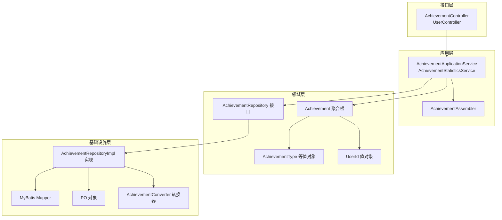
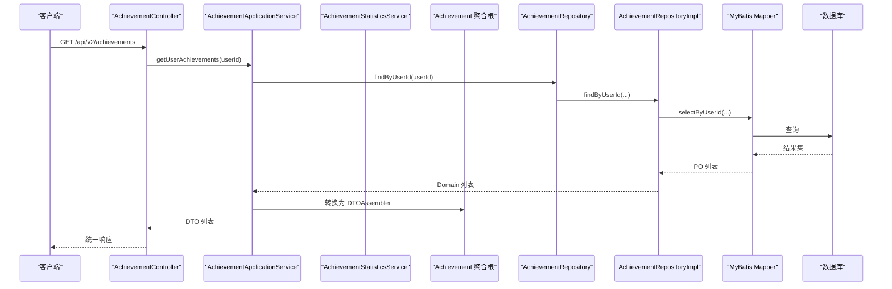
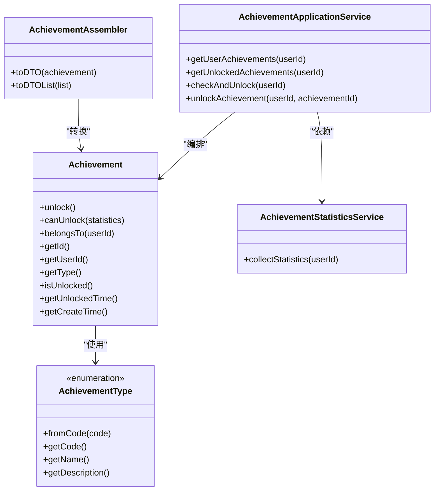
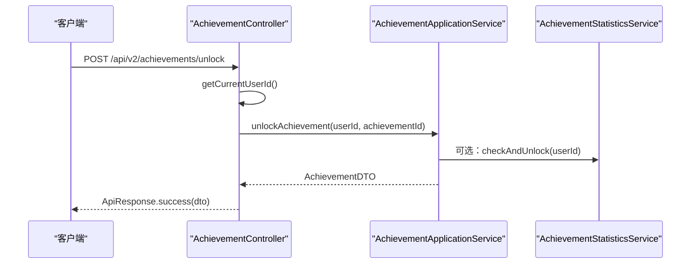
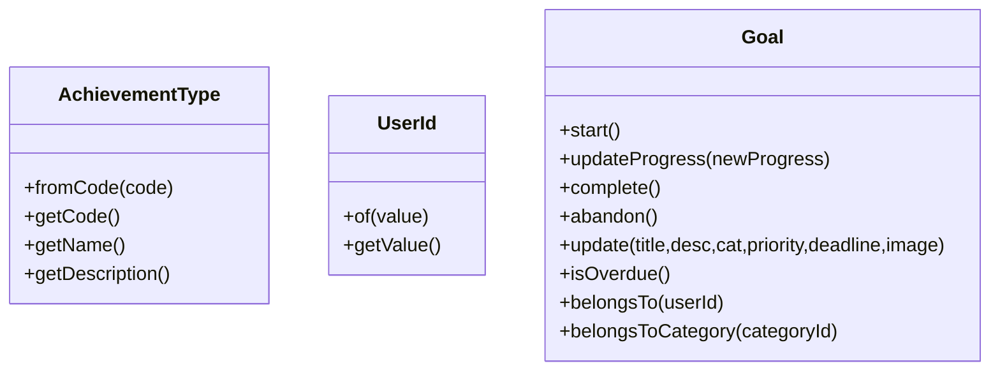
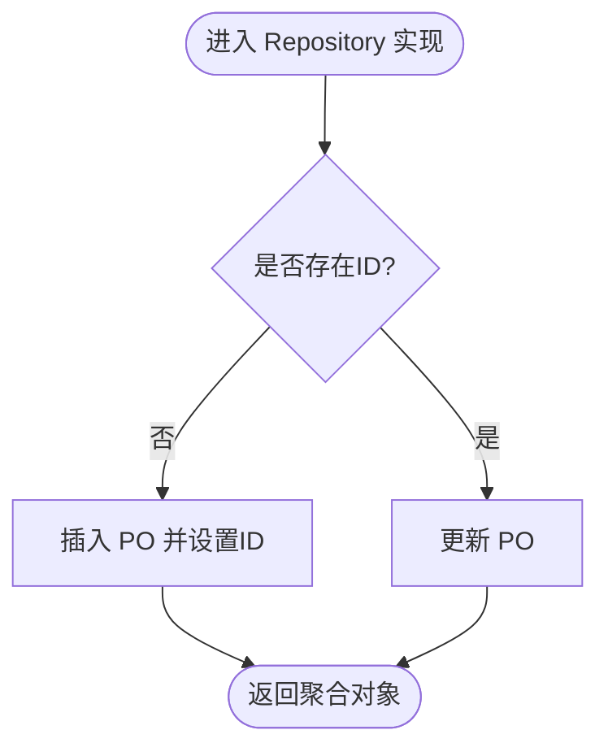
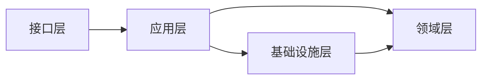

# 架构设计

<cite>
**本文引用的文件**
- [CrazydreamApplication.java](file://src/main/java/com/crazydream/CrazydreamApplication.java)
- [AchievementController.java](file://src/main/java/com/crazydream/interfaces/achievement/AchievementController.java)
- [UserController.java](file://src/main/java/com/crazydream/interfaces/user/UserController.java)
- [AchievementApplicationService.java](file://src/main/java/com/crazydream/application/achievement/service/AchievementApplicationService.java)
- [AchievementStatisticsService.java](file://src/main/java/com/crazydream/application/achievement/service/AchievementStatisticsService.java)
- [AchievementAssembler.java](file://src/main/java/com/crazydream/application/achievement/assembler/AchievementAssembler.java)
- [Achievement.java](file://src/main/java/com/crazydream/domain/achievement/model/aggregate/Achievement.java)
- [AchievementRepository.java](file://src/main/java/com/crazydream/domain/achievement/repository/AchievementRepository.java)
- [AchievementRepositoryImpl.java](file://src/main/java/com/crazydream/infrastructure/persistence/repository/AchievementRepositoryImpl.java)
- [AchievementConverter.java](file://src/main/java/com/crazydream/infrastructure/persistence/converter/AchievementConverter.java)
- [AchievementType.java](file://src/main/java/com/crazydream/domain/achievement/model/valueobject/AchievementType.java)
- [Goal.java](file://src/main/java/com/crazydream/domain/goal/model/aggregate/Goal.java)
- [UserId.java](file://src/main/java/com/crazydream/domain/shared/model/UserId.java)
- [AchievementDTO.java](file://src/main/java/com/crazydream/application/achievement/dto/AchievementDTO.java)
- [ApiResponse.java](file://src/main/java/com/crazydream/common/ApiResponse.java)
- [pom.xml](file://pom.xml)
- [application.yml](file://src/main/resources/application.yml)
</cite>

## 目录
1. [引言](#引言)
2. [项目结构](#项目结构)
3. [核心组件](#核心组件)
4. [架构总览](#架构总览)
5. [详细组件分析](#详细组件分析)
6. [依赖关系分析](#依赖关系分析)
7. [性能考量](#性能考量)
8. [故障排查指南](#故障排查指南)
9. [结论](#结论)
10. [附录](#附录)

## 引言
本文件面向 CrazyDream 项目的架构设计说明，聚焦于 DDD（领域驱动设计）与 COLA（分层架构）四层模型的落地实践。四层分别为：Interface 层（接口层）、Application 层（应用层）、Domain 层（领域层）、Infrastructure 层（基础实施层）。本文将系统阐述各层职责、依赖关系、数据流与控制流，并结合领域模型中的聚合根、值对象、仓储接口等概念，给出架构决策的技术背景与权衡。

## 项目结构
项目采用按“能力域”组织的多模块结构，核心包划分如下：
- 接口层（interfaces）：对外暴露 REST 控制器，负责请求接入、鉴权上下文解析与统一响应封装。
- 应用层（application）：编排业务用例，协调领域对象与基础设施，保证事务边界与业务顺序。
- 领域层（domain）：承载核心业务规则与不变量，使用充血模型（聚合根+值对象）表达领域概念。
- 基础设施层（infrastructure）：持久化、外部服务集成、ORM 映射与转换器。

图表来源
- [AchievementController.java](file://src/main/java/com/crazydream/interfaces/achievement/AchievementController.java#L1-L113)
- [UserController.java](file://src/main/java/com/crazydream/interfaces/user/UserController.java#L1-L132)
- [AchievementApplicationService.java](file://src/main/java/com/crazydream/application/achievement/service/AchievementApplicationService.java#L1-L91)
- [AchievementAssembler.java](file://src/main/java/com/crazydream/application/achievement/assembler/AchievementAssembler.java#L1-L34)
- [Achievement.java](file://src/main/java/com/crazydream/domain/achievement/model/aggregate/Achievement.java#L1-L184)
- [AchievementRepository.java](file://src/main/java/com/crazydream/domain/achievement/repository/AchievementRepository.java#L1-L16)
- [AchievementRepositoryImpl.java](file://src/main/java/com/crazydream/infrastructure/persistence/repository/AchievementRepositoryImpl.java#L1-L55)
- [AchievementConverter.java](file://src/main/java/com/crazydream/infrastructure/persistence/converter/AchievementConverter.java#L1-L45)

章节来源
- [CrazydreamApplication.java](file://src/main/java/com/crazydream/CrazydreamApplication.java#L1-L27)
- [pom.xml](file://pom.xml#L1-L163)
- [application.yml](file://src/main/resources/application.yml#L1-L75)

## 核心组件
- 接口层控制器：负责接收 HTTP 请求、解析安全上下文、调用应用服务并返回统一响应格式。
- 应用服务：编排业务流程、协调领域对象与仓储、管理事务边界；提供面向用例的服务方法。
- 领域模型：以聚合根为核心，封装业务不变量与行为；值对象表达领域语义与约束。
- 基础设施：实现仓储接口，完成 ORM 映射与对象转换，屏蔽持久化细节。

章节来源
- [AchievementController.java](file://src/main/java/com/crazydream/interfaces/achievement/AchievementController.java#L1-L113)
- [AchievementApplicationService.java](file://src/main/java/com/crazydream/application/achievement/service/AchievementApplicationService.java#L1-L91)
- [Achievement.java](file://src/main/java/com/crazydream/domain/achievement/model/aggregate/Achievement.java#L1-L184)
- [AchievementRepositoryImpl.java](file://src/main/java/com/crazydream/infrastructure/persistence/repository/AchievementRepositoryImpl.java#L1-L55)

## 架构总览
下图展示从接口层到基础设施层的典型调用链路与数据流向，体现 COLA 四层的职责边界与依赖方向。

图表来源
- [AchievementController.java](file://src/main/java/com/crazydream/interfaces/achievement/AchievementController.java#L28-L37)
- [AchievementApplicationService.java](file://src/main/java/com/crazydream/application/achievement/service/AchievementApplicationService.java#L41-L44)
- [AchievementAssembler.java](file://src/main/java/com/crazydream/application/achievement/assembler/AchievementAssembler.java#L28-L32)
- [AchievementRepositoryImpl.java](file://src/main/java/com/crazydream/infrastructure/persistence/repository/AchievementRepositoryImpl.java#L42-L46)
- [AchievementConverter.java](file://src/main/java/com/crazydream/infrastructure/persistence/converter/AchievementConverter.java#L10-L21)

## 详细组件分析

### 成就聚合与应用服务
- 聚合根 Achievement：封装成就生命周期、解锁条件与归属校验，提供 canUnlock 与 unlock 等业务方法。
- 应用服务 AchievementApplicationService：确保用户拥有完整成就类型集合、批量检查解锁、手动解锁并返回 DTO。
- 统计服务 AchievementStatisticsService：汇总目标完成、连续打卡、分类专注、效率指标、注册时长与完成率等，作为解锁条件输入。
- Assembler：将聚合对象转换为 DTO，贯穿应用层输出。

图表来源
- [Achievement.java](file://src/main/java/com/crazydream/domain/achievement/model/aggregate/Achievement.java#L1-L184)
- [AchievementType.java](file://src/main/java/com/crazydream/domain/achievement/model/valueobject/AchievementType.java#L1-L62)
- [AchievementAssembler.java](file://src/main/java/com/crazydream/application/achievement/assembler/AchievementAssembler.java#L1-L34)
- [AchievementApplicationService.java](file://src/main/java/com/crazydream/application/achievement/service/AchievementApplicationService.java#L1-L91)
- [AchievementStatisticsService.java](file://src/main/java/com/crazydream/application/achievement/service/AchievementStatisticsService.java#L1-L142)

章节来源
- [Achievement.java](file://src/main/java/com/crazydream/domain/achievement/model/aggregate/Achievement.java#L44-L126)
- [AchievementApplicationService.java](file://src/main/java/com/crazydream/application/achievement/service/AchievementApplicationService.java#L25-L62)
- [AchievementStatisticsService.java](file://src/main/java/com/crazydream/application/achievement/service/AchievementStatisticsService.java#L34-L117)
- [AchievementAssembler.java](file://src/main/java/com/crazydream/application/achievement/assembler/AchievementAssembler.java#L11-L32)

### 接口层与控制器
- AchievementController：提供查询用户成就、查询已解锁成就、解锁成就等接口；解析安全上下文获取当前用户 ID；统一返回 ApiResponse。
- UserController：提供用户注册、查询当前用户、更新资料、加积分等接口；同样解析安全上下文与统一响应。

图表来源
- [AchievementController.java](file://src/main/java/com/crazydream/interfaces/achievement/AchievementController.java#L50-L59)
- [AchievementApplicationService.java](file://src/main/java/com/crazydream/application/achievement/service/AchievementApplicationService.java#L74-L89)

章节来源
- [AchievementController.java](file://src/main/java/com/crazydream/interfaces/achievement/AchievementController.java#L28-L111)
- [UserController.java](file://src/main/java/com/crazydream/interfaces/user/UserController.java#L26-L99)
- [ApiResponse.java](file://src/main/java/com/crazydream/common/ApiResponse.java#L1-L108)

### 领域模型与值对象
- AchievementType：成就类型枚举，提供编码、名称与描述，支撑聚合根的解锁策略。
- UserId：跨领域共享的值对象，封装用户标识与校验。
- Goal：目标聚合根，体现状态机与进度演进，为成就统计提供输入数据。

图表来源
- [AchievementType.java](file://src/main/java/com/crazydream/domain/achievement/model/valueobject/AchievementType.java#L1-L62)
- [UserId.java](file://src/main/java/com/crazydream/domain/shared/model/UserId.java#L1-L48)
- [Goal.java](file://src/main/java/com/crazydream/domain/goal/model/aggregate/Goal.java#L1-L293)

章节来源
- [AchievementType.java](file://src/main/java/com/crazydream/domain/achievement/model/valueobject/AchievementType.java#L3-L37)
- [UserId.java](file://src/main/java/com/crazydream/domain/shared/model/UserId.java#L12-L28)
- [Goal.java](file://src/main/java/com/crazydream/domain/goal/model/aggregate/Goal.java#L106-L213)

### 基础设施与仓储实现
- AchievementRepository 接口：定义保存、查询等仓储契约。
- AchievementRepositoryImpl：实现保存、按用户查询、查询已解锁等方法；通过 Converter 在领域对象与持久化对象之间转换。
- AchievementConverter：完成 PO 与聚合对象的双向转换。
- MyBatis Mapper：SQL 映射，配合 XML 完成 CRUD。

图表来源
- [AchievementRepositoryImpl.java](file://src/main/java/com/crazydream/infrastructure/persistence/repository/AchievementRepositoryImpl.java#L24-L33)
- [AchievementConverter.java](file://src/main/java/com/crazydream/infrastructure/persistence/converter/AchievementConverter.java#L23-L43)

章节来源
- [AchievementRepository.java](file://src/main/java/com/crazydream/domain/achievement/repository/AchievementRepository.java#L10-L15)
- [AchievementRepositoryImpl.java](file://src/main/java/com/crazydream/infrastructure/persistence/repository/AchievementRepositoryImpl.java#L1-L55)
- [AchievementConverter.java](file://src/main/java/com/crazydream/infrastructure/persistence/converter/AchievementConverter.java#L1-L45)

## 依赖关系分析
- 层间依赖：接口层依赖应用层；应用层依赖领域层与基础设施层；基础设施层依赖领域层的值对象与实体。
- 依赖方向：严格自上而下，避免反向依赖；仓储接口向上暴露，实现向下隐藏。
- 循环依赖：通过允许循环依赖的配置与清晰的边界划分规避风险。

图表来源
- [pom.xml](file://pom.xml#L24-L118)
- [application.yml](file://src/main/resources/application.yml#L6-L8)

章节来源
- [pom.xml](file://pom.xml#L1-L163)
- [application.yml](file://src/main/resources/application.yml#L1-L75)

## 性能考量
- 事务边界：应用服务在需要一致性的地方开启事务，避免过度事务导致性能下降。
- 查询优化：仓储实现中按需查询，减少不必要的字段与关联；利用索引与分页。
- DTO 转换：Assembler 聚焦于轻量转换，避免在转换过程中引入复杂计算。
- 缓存策略：可在应用层引入缓存（如统计结果），降低重复计算成本（需结合具体场景评估）。
- 日志与监控：统一响应与日志级别配置有助于问题定位与性能观测。

## 故障排查指南
- 统一响应：接口层通过 ApiResponse 统一封装错误码与消息，便于前端与运维统一处理。
- 安全上下文：控制器从 SecurityContextHolder 解析用户 ID，若为空则回退至配置的默认用户 ID，便于测试与降级。
- 参数校验：应用层对非法参数抛出明确异常，避免脏数据进入领域层。
- 数据一致性：仓储实现中先转换再持久化，确保 ID 回填与状态一致。

章节来源
- [AchievementController.java](file://src/main/java/com/crazydream/interfaces/achievement/AchievementController.java#L72-L111)
- [UserController.java](file://src/main/java/com/crazydream/interfaces/user/UserController.java#L101-L130)
- [ApiResponse.java](file://src/main/java/com/crazydream/common/ApiResponse.java#L83-L107)

## 结论
本项目以 DDD 为核心，结合 COLA 四层架构，实现了清晰的职责分离与稳定的依赖方向。通过聚合根、值对象与仓储接口的组合，既保证了领域模型的内聚性，又使基础设施变化对上层透明。应用层承担编排职责，接口层专注于契约与响应格式，整体架构具备良好的可扩展性与可维护性。

## 附录
- 技术栈要点：Spring Boot、MyBatis、MySQL、JWT、阿里云 OSS、SLF4J/Logback。
- 配置要点：数据库连接、MyBatis 映射、日志级别、JWT 密钥与前缀、安全开关与测试默认用户 ID。

章节来源
- [pom.xml](file://pom.xml#L24-L118)
- [application.yml](file://src/main/resources/application.yml#L10-L75)