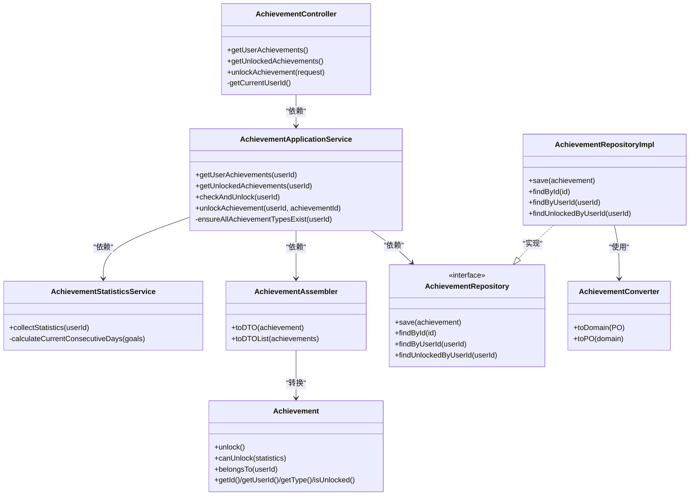

# 组件交互与依赖关系

<cite>
**本文档引用的文件**
- [CrazydreamApplication.java](file://src/main/java/com/crazydream/CrazydreamApplication.java)
- [AchievementController.java](file://src/main/java/com/crazydream/interfaces/achievement/AchievementController.java)
- [AchievementApplicationService.java](file://src/main/java/com/crazydream/application/achievement/service/AchievementApplicationService.java)
- [AchievementStatisticsService.java](file://src/main/java/com/crazydream/application/achievement/service/AchievementStatisticsService.java)
- [AchievementAssembler.java](file://src/main/java/com/crazydream/application/achievement/assembler/AchievementAssembler.java)
- [Achievement.java](file://src/main/java/com/crazydream/domain/achievement/model/aggregate/Achievement.java)
- [AchievementRepository.java](file://src/main/java/com/crazydream/domain/achievement/repository/AchievementRepository.java)
- [AchievementRepositoryImpl.java](file://src/main/java/com/crazydream/infrastructure/persistence/repository/AchievementRepositoryImpl.java)
- [AchievementConverter.java](file://src/main/java/com/crazydream/infrastructure/persistence/converter/AchievementConverter.java)
- [SecurityConfig.java](file://src/main/java/com/crazydream/security/SecurityConfig.java)
- [JwtUtils.java](file://src/main/java/com/crazydream/utils/JwtUtils.java)
- [UserController.java](file://src/main/java/com/crazydream/interfaces/user/UserController.java)
- [UserApplicationService.java](file://src/main/java/com/crazydream/application/user/service/UserApplicationService.java)
- [application.yml](file://src/main/resources/application.yml)
</cite>

## 目录
1. [简介](#简介)
2. [项目结构](#项目结构)
3. [核心组件](#核心组件)
4. [架构总览](#架构总览)
5. [详细组件分析](#详细组件分析)
6. [依赖分析](#依赖分析)
7. [性能考虑](#性能考虑)
8. [故障排查指南](#故障排查指南)
9. [结论](#结论)

## 简介
本文件聚焦 CrazyDream 项目的组件交互与依赖关系，系统性梳理控制器、应用服务、领域模型、仓储接口之间的调用链路与数据传递机制；解释依赖注入的实现方式与组件生命周期管理；分析装饰器模式、工厂模式等设计模式的应用场景；并提供组件交互图与具体调用示例，帮助开发者快速理解与维护系统。

## 项目结构
项目采用分层架构与领域驱动设计（DDD）风格，按职责划分为：
- 接口层（Interfaces）：REST 控制器，负责接收请求、封装响应
- 应用层（Application）：应用服务，编排业务流程，协调仓储与装配器
- 领域层（Domain）：领域模型与值对象，承载业务规则与不变量
- 基础设施层（Infrastructure）：持久化实现、转换器、MyBatis 映射
- 安全与工具（Security/Utils）：安全配置、JWT 工具
- 配置（Resources）：Spring Boot、MyBatis、JWT、安全等配置

图表来源
- [AchievementController.java](file://src/main/java/com/crazydream/interfaces/achievement/AchievementController.java#L1-L113)
- [UserController.java](file://src/main/java/com/crazydream/interfaces/user/UserController.java#L1-L132)
- [AchievementApplicationService.java](file://src/main/java/com/crazydream/application/achievement/service/AchievementApplicationService.java#L1-L91)
- [UserApplicationService.java](file://src/main/java/com/crazydream/application/user/service/UserApplicationService.java#L1-L98)
- [AchievementStatisticsService.java](file://src/main/java/com/crazydream/application/achievement/service/AchievementStatisticsService.java#L1-L142)
- [Achievement.java](file://src/main/java/com/crazydream/domain/achievement/model/aggregate/Achievement.java#L1-L184)
- [AchievementRepository.java](file://src/main/java/com/crazydream/domain/achievement/repository/AchievementRepository.java#L1-L16)
- [AchievementRepositoryImpl.java](file://src/main/java/com/crazydream/infrastructure/persistence/repository/AchievementRepositoryImpl.java#L1-L55)
- [AchievementConverter.java](file://src/main/java/com/crazydream/infrastructure/persistence/converter/AchievementConverter.java#L1-L45)
- [SecurityConfig.java](file://src/main/java/com/crazydream/security/SecurityConfig.java#L1-L105)
- [JwtUtils.java](file://src/main/java/com/crazydream/utils/JwtUtils.java#L1-L165)

章节来源
- [CrazydreamApplication.java](file://src/main/java/com/crazydream/CrazydreamApplication.java#L1-L27)
- [application.yml](file://src/main/resources/application.yml#L1-L75)

## 核心组件
- 接口层控制器：接收 HTTP 请求，解析用户身份，调用应用服务，并统一返回响应包装
- 应用服务：编排业务逻辑，协调仓储与装配器，保证事务边界
- 领域模型：Achievement 聚合根承载业务规则（解锁条件、归属校验等）
- 仓储接口与实现：定义持久化契约与具体实现，负责与数据库交互
- 装配器：在领域对象与 DTO 之间进行转换
- 安全与工具：SecurityConfig 提供安全策略与 CORS，JwtUtils 提供 JWT 生成与解析

章节来源
- [AchievementController.java](file://src/main/java/com/crazydream/interfaces/achievement/AchievementController.java#L1-L113)
- [UserController.java](file://src/main/java/com/crazydream/interfaces/user/UserController.java#L1-L132)
- [AchievementApplicationService.java](file://src/main/java/com/crazydream/application/achievement/service/AchievementApplicationService.java#L1-L91)
- [AchievementStatisticsService.java](file://src/main/java/com/crazydream/application/achievement/service/AchievementStatisticsService.java#L1-L142)
- [AchievementAssembler.java](file://src/main/java/com/crazydream/application/achievement/assembler/AchievementAssembler.java#L1-L34)
- [Achievement.java](file://src/main/java/com/crazydream/domain/achievement/model/aggregate/Achievement.java#L1-L184)
- [AchievementRepository.java](file://src/main/java/com/crazydream/domain/achievement/repository/AchievementRepository.java#L1-L16)
- [AchievementRepositoryImpl.java](file://src/main/java/com/crazydream/infrastructure/persistence/repository/AchievementRepositoryImpl.java#L1-L55)
- [AchievementConverter.java](file://src/main/java/com/crazydream/infrastructure/persistence/converter/AchievementConverter.java#L1-L45)
- [SecurityConfig.java](file://src/main/java/com/crazydream/security/SecurityConfig.java#L1-L105)
- [JwtUtils.java](file://src/main/java/com/crazydream/utils/JwtUtils.java#L1-L165)

## 架构总览
系统遵循“接口层-应用层-领域层-基础设施层”的分层架构，配合 Spring Boot 自动装配与 MyBatis ORM，形成清晰的职责边界与依赖方向。

图表来源
- [SecurityConfig.java](file://src/main/java/com/crazydream/security/SecurityConfig.java#L55-L91)
- [AchievementController.java](file://src/main/java/com/crazydream/interfaces/achievement/AchievementController.java#L16-L37)
- [UserController.java](file://src/main/java/com/crazydream/interfaces/user/UserController.java#L14-L45)
- [AchievementApplicationService.java](file://src/main/java/com/crazydream/application/achievement/service/AchievementApplicationService.java#L16-L24)
- [AchievementRepository.java](file://src/main/java/com/crazydream/domain/achievement/repository/AchievementRepository.java#L10-L15)
- [AchievementRepositoryImpl.java](file://src/main/java/com/crazydream/infrastructure/persistence/repository/AchievementRepositoryImpl.java#L17-L33)
- [AchievementConverter.java](file://src/main/java/com/crazydream/infrastructure/persistence/converter/AchievementConverter.java#L8-L44)
- [JwtUtils.java](file://src/main/java/com/crazydream/utils/JwtUtils.java#L29-L76)

## 详细组件分析

### 成就模块组件交互（控制器-应用服务-领域-仓储）
该模块展示了典型的 DDD 调用链：控制器解析用户身份，应用服务编排统计与解锁逻辑，领域模型执行业务规则，仓储负责持久化。

图表来源
- [AchievementController.java](file://src/main/java/com/crazydream/interfaces/achievement/AchievementController.java#L28-L59)
- [AchievementApplicationService.java](file://src/main/java/com/crazydream/application/achievement/service/AchievementApplicationService.java#L41-L89)
- [AchievementRepositoryImpl.java](file://src/main/java/com/crazydream/infrastructure/persistence/repository/AchievementRepositoryImpl.java#L35-L53)
- [AchievementAssembler.java](file://src/main/java/com/crazydream/application/achievement/assembler/AchievementAssembler.java#L28-L32)
- [AchievementConverter.java](file://src/main/java/com/crazydream/infrastructure/persistence/converter/AchievementConverter.java#L10-L43)

章节来源
- [AchievementController.java](file://src/main/java/com/crazydream/interfaces/achievement/AchievementController.java#L1-L113)
- [AchievementApplicationService.java](file://src/main/java/com/crazydream/application/achievement/service/AchievementApplicationService.java#L1-L91)
- [AchievementAssembler.java](file://src/main/java/com/crazydream/application/achievement/assembler/AchievementAssembler.java#L1-L34)
- [Achievement.java](file://src/main/java/com/crazydream/domain/achievement/model/aggregate/Achievement.java#L1-L184)
- [AchievementRepository.java](file://src/main/java/com/crazydream/domain/achievement/repository/AchievementRepository.java#L1-L16)
- [AchievementRepositoryImpl.java](file://src/main/java/com/crazydream/infrastructure/persistence/repository/AchievementRepositoryImpl.java#L1-L55)
- [AchievementConverter.java](file://src/main/java/com/crazydream/infrastructure/persistence/converter/AchievementConverter.java#L1-L45)

### 成就统计服务算法流程
统计服务负责收集多维度指标并构建成就统计对象，支撑解锁条件判断。

图表来源
- [AchievementStatisticsService.java](file://src/main/java/com/crazydream/application/achievement/service/AchievementStatisticsService.java#L34-L117)
- [AchievementStatisticsService.java](file://src/main/java/com/crazydream/application/achievement/service/AchievementStatisticsService.java#L119-L140)

章节来源
- [AchievementStatisticsService.java](file://src/main/java/com/crazydream/application/achievement/service/AchievementStatisticsService.java#L1-L142)

### 用户模块组件交互（控制器-应用服务-仓储-安全）
用户模块展示认证与授权流程：SecurityConfig 拦截请求并注入认证上下文，控制器解析用户 ID，应用服务完成注册/登录与资料更新。

图表来源
- [UserController.java](file://src/main/java/com/crazydream/interfaces/user/UserController.java#L26-L88)
- [SecurityConfig.java](file://src/main/java/com/crazydream/security/SecurityConfig.java#L55-L91)
- [UserApplicationService.java](file://src/main/java/com/crazydream/application/user/service/UserApplicationService.java#L27-L65)
- [JwtUtils.java](file://src/main/java/com/crazydream/utils/JwtUtils.java#L57-L76)

章节来源
- [UserController.java](file://src/main/java/com/crazydream/interfaces/user/UserController.java#L1-L132)
- [UserApplicationService.java](file://src/main/java/com/crazydream/application/user/service/UserApplicationService.java#L1-L98)
- [SecurityConfig.java](file://src/main/java/com/crazydream/security/SecurityConfig.java#L1-L105)
- [JwtUtils.java](file://src/main/java/com/crazydream/utils/JwtUtils.java#L1-L165)

### 类关系图（成就模块）

图表来源
- [AchievementController.java](file://src/main/java/com/crazydream/interfaces/achievement/AchievementController.java#L1-L113)
- [AchievementApplicationService.java](file://src/main/java/com/crazydream/application/achievement/service/AchievementApplicationService.java#L1-L91)
- [AchievementStatisticsService.java](file://src/main/java/com/crazydream/application/achievement/service/AchievementStatisticsService.java#L1-L142)
- [AchievementAssembler.java](file://src/main/java/com/crazydream/application/achievement/assembler/AchievementAssembler.java#L1-L34)
- [Achievement.java](file://src/main/java/com/crazydream/domain/achievement/model/aggregate/Achievement.java#L1-L184)
- [AchievementRepository.java](file://src/main/java/com/crazydream/domain/achievement/repository/AchievementRepository.java#L1-L16)
- [AchievementRepositoryImpl.java](file://src/main/java/com/crazydream/infrastructure/persistence/repository/AchievementRepositoryImpl.java#L1-L55)
- [AchievementConverter.java](file://src/main/java/com/crazydream/infrastructure/persistence/converter/AchievementConverter.java#L1-L45)

## 依赖分析
- 组件耦合与内聚
  - 控制器仅依赖应用服务接口，保持高内聚低耦合
  - 应用服务依赖仓储接口与装配器，面向抽象编程
  - 领域模型独立于基础设施，仅暴露必要方法
- 直接与间接依赖
  - 控制器 → 应用服务 → 仓储接口 → 仓储实现 → 转换器 → Mapper
  - 安全配置贯穿接口层，影响所有控制器
- 循环依赖
  - application.yml 显式允许循环依赖，便于复杂装配场景
- 外部依赖与集成点
  - MyBatis Mapper XML 与 PO 映射
  - Spring Security 与 JWT 工具
  - 数据源与 OSS 配置

图表来源
- [AchievementController.java](file://src/main/java/com/crazydream/interfaces/achievement/AchievementController.java#L1-L113)
- [AchievementApplicationService.java](file://src/main/java/com/crazydream/application/achievement/service/AchievementApplicationService.java#L1-L91)
- [AchievementRepository.java](file://src/main/java/com/crazydream/domain/achievement/repository/AchievementRepository.java#L1-L16)
- [AchievementRepositoryImpl.java](file://src/main/java/com/crazydream/infrastructure/persistence/repository/AchievementRepositoryImpl.java#L1-L55)
- [AchievementConverter.java](file://src/main/java/com/crazydream/infrastructure/persistence/converter/AchievementConverter.java#L1-L45)
- [SecurityConfig.java](file://src/main/java/com/crazydream/security/SecurityConfig.java#L1-L105)
- [JwtUtils.java](file://src/main/java/com/crazydream/utils/JwtUtils.java#L1-L165)

章节来源
- [application.yml](file://src/main/resources/application.yml#L6-L8)

## 性能考虑
- 事务边界：应用服务对写操作使用事务注解，确保一致性与原子性
- 查询优化：仓储实现基于 MyBatis Mapper，建议结合索引与分页查询
- DTO 转换：装配器集中处理转换逻辑，减少重复映射开销
- 安全过滤：无状态会话与 JWT 解析在过滤器中完成，避免控制器重复逻辑
- 缓存建议：可引入 Redis 缓存用户统计与常用查询结果（需评估一致性）

## 故障排查指南
- 认证失败
  - 检查 SecurityConfig 的拦截规则与 JWT 过滤器是否正确配置
  - 确认请求头中 Authorization 与前缀匹配
- 用户 ID 解析异常
  - 控制器在认证上下文为空或格式不支持时回退默认用户 ID，检查配置项与日志
- 成就解锁失败
  - 确认统计服务指标是否正确计算，检查目标完成状态与时间维度
  - 校验领域模型解锁条件与类型枚举
- 数据持久化异常
  - 检查 Mapper XML 与 PO 字段映射，确认转换器字段映射一致

章节来源
- [SecurityConfig.java](file://src/main/java/com/crazydream/security/SecurityConfig.java#L66-L91)
- [JwtUtils.java](file://src/main/java/com/crazydream/utils/JwtUtils.java#L149-L156)
- [AchievementController.java](file://src/main/java/com/crazydream/interfaces/achievement/AchievementController.java#L72-L111)
- [AchievementApplicationService.java](file://src/main/java/com/crazydream/application/achievement/service/AchievementApplicationService.java#L51-L89)
- [AchievementRepositoryImpl.java](file://src/main/java/com/crazydream/infrastructure/persistence/repository/AchievementRepositoryImpl.java#L24-L33)

## 结论
本项目通过清晰的分层与 DDD 设计，实现了控制器、应用服务、领域模型与仓储的职责分离与稳定依赖。依赖注入与 Spring Boot 自动装配降低了组件耦合度，配合安全过滤与 JWT 工具保障了接口安全性。建议在保持现有架构的前提下，持续完善统计缓存与查询优化，进一步提升系统性能与可维护性。