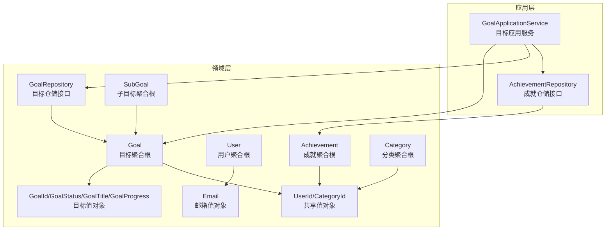
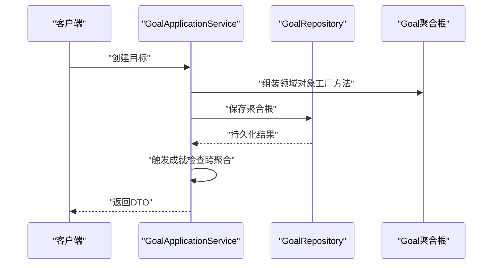
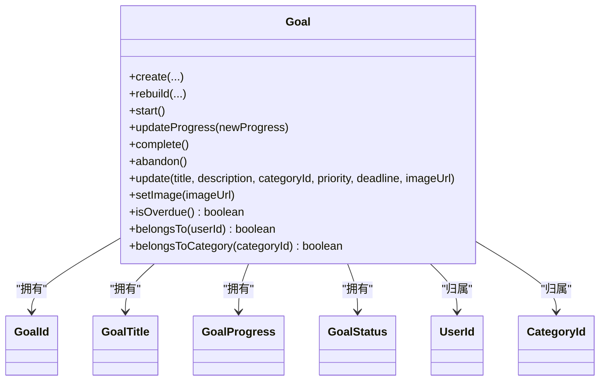
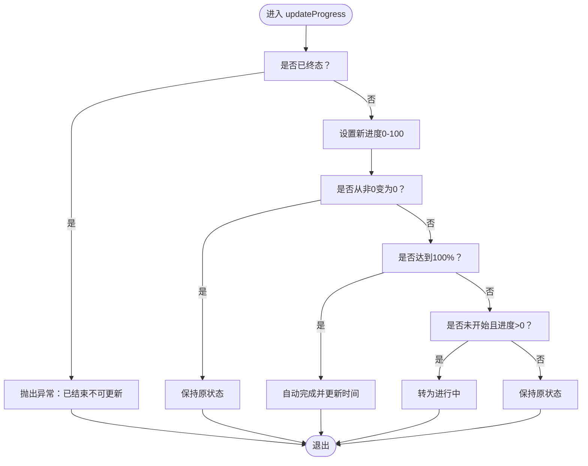
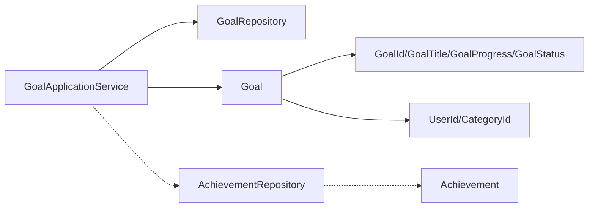

# 领域驱动设计核心概念

<cite>
**本文档引用的文件**
- [Goal.java](file://src/main/java/com/crazydream/domain/goal/model/aggregate/Goal.java)
- [GoalId.java](file://src/main/java/com/crazydream/domain/goal/model/valueobject/GoalId.java)
- [GoalStatus.java](file://src/main/java/com/crazydream/domain/goal/model/valueobject/GoalStatus.java)
- [GoalTitle.java](file://src/main/java/com/crazydream/domain/goal/model/valueobject/GoalTitle.java)
- [GoalProgress.java](file://src/main/java/com/crazydream/domain/goal/model/valueobject/GoalProgress.java)
- [GoalRepository.java](file://src/main/java/com/crazydream/domain/goal/repository/GoalRepository.java)
- [GoalApplicationService.java](file://src/main/java/com/crazydream/application/goal/service/GoalApplicationService.java)
- [User.java](file://src/main/java/com/crazydream/domain/user/model/aggregate/User.java)
- [Email.java](file://src/main/java/com/crazydream/domain/user/model/valueobject/Email.java)
- [Achievement.java](file://src/main/java/com/crazydream/domain/achievement/model/aggregate/Achievement.java)
- [AchievementRepository.java](file://src/main/java/com/crazydream/domain/achievement/repository/AchievementRepository.java)
- [Category.java](file://src/main/java/com/crazydream/domain/category/model/aggregate/Category.java)
- [SubGoal.java](file://src/main/java/com/crazydream/domain/subgoal/model/aggregate/SubGoal.java)
- [UserId.java](file://src/main/java/com/crazydream/domain/shared/model/UserId.java)
- [CategoryId.java](file://src/main/java/com/crazydream/domain/shared/model/CategoryId.java)
</cite>

## 目录
1. [引言](#引言)
2. [项目结构](#项目结构)
3. [核心组件](#核心组件)
4. [架构总览](#架构总览)
5. [详细组件分析](#详细组件分析)
6. [依赖分析](#依赖分析)
7. [性能考虑](#性能考虑)
8. [故障排除指南](#故障排除指南)
9. [结论](#结论)

## 引言
本文件面向 CrazyDream 项目的领域驱动设计（DDD）实践，系统性阐述聚合根、实体、值对象与领域服务等核心概念在代码中的落地方式。通过对目标、用户、成就、分类、子目标等聚合的设计原则、边界划分与内部协作关系进行深入解析，帮助读者理解充血模型如何封装业务规则与约束，并在应用服务中体现业务流程编排。

## 项目结构
CrazyDream 采用分层与按领域聚合组织的结构：
- domain 层：定义聚合根、值对象、仓储接口与领域服务契约，承载核心业务规则
- application 层：应用服务负责用例编排、权限校验与跨聚合协调
- infrastructure 层：仓储实现、持久化映射与基础设施对接
- interfaces 屏蔽外部细节，调用应用服务

图表来源
- [GoalApplicationService.java](file://src/main/java/com/crazydream/application/goal/service/GoalApplicationService.java#L30-L246)
- [Goal.java](file://src/main/java/com/crazydream/domain/goal/model/aggregate/Goal.java#L17-L293)
- [GoalRepository.java](file://src/main/java/com/crazydream/domain/goal/repository/GoalRepository.java#L18-L70)
- [AchievementRepository.java](file://src/main/java/com/crazydream/domain/achievement/repository/AchievementRepository.java#L10-L16)
- [User.java](file://src/main/java/com/crazydream/domain/user/model/aggregate/User.java#L12-L122)
- [Email.java](file://src/main/java/com/crazydream/domain/user/model/valueobject/Email.java#L9-L46)
- [Achievement.java](file://src/main/java/com/crazydream/domain/achievement/model/aggregate/Achievement.java#L12-L184)
- [Category.java](file://src/main/java/com/crazydream/domain/category/model/aggregate/Category.java#L11-L83)
- [SubGoal.java](file://src/main/java/com/crazydream/domain/subgoal/model/aggregate/SubGoal.java#L14-L118)
- [UserId.java](file://src/main/java/com/crazydream/domain/shared/model/UserId.java#L12-L48)
- [CategoryId.java](file://src/main/java/com/crazydream/domain/shared/model/CategoryId.java#L12-L48)

章节来源
- [GoalApplicationService.java](file://src/main/java/com/crazydream/application/goal/service/GoalApplicationService.java#L30-L246)
- [Goal.java](file://src/main/java/com/crazydream/domain/goal/model/aggregate/Goal.java#L17-L293)
- [GoalRepository.java](file://src/main/java/com/crazydream/domain/goal/repository/GoalRepository.java#L18-L70)

## 核心组件
本节聚焦四大核心概念在项目中的实现形态与职责边界：

- 聚合根（Aggregate Root）
  - Goal：封装目标生命周期、状态机与进度演进，提供充血模型的行为方法（如开始、更新进度、完成、放弃）
  - User：封装用户资料、积分与等级变更等业务行为
  - Achievement：封装成就解锁策略与归属关系
  - Category：封装分类元数据与启用/禁用状态
  - SubGoal：独立聚合根，管理子目标的进度与状态

- 实体（Entity）
  - 通过唯一标识（值对象包装）区分实例，强调“同一性”而非“相等性”。例如 Goal、User、Achievement、Category、SubGoal 均通过各自的 Id 值对象进行标识与比较

- 值对象（Value Object）
  - GoalId、GoalStatus、GoalTitle、GoalProgress、UserId、CategoryId、Email 等均不可变，通过构造器参数校验与工厂方法确保有效性；用于表达领域语义与约束

- 领域服务（Domain Service）
  - 本项目中以应用服务承担领域服务职责：GoalApplicationService 协调目标聚合与其他资源（如成就系统），执行权限校验与业务流程编排

章节来源
- [Goal.java](file://src/main/java/com/crazydream/domain/goal/model/aggregate/Goal.java#L17-L293)
- [GoalId.java](file://src/main/java/com/crazydream/domain/goal/model/valueobject/GoalId.java#L12-L48)
- [GoalStatus.java](file://src/main/java/com/crazydream/domain/goal/model/valueobject/GoalStatus.java#L10-L64)
- [GoalTitle.java](file://src/main/java/com/crazydream/domain/goal/model/valueobject/GoalTitle.java#L12-L57)
- [GoalProgress.java](file://src/main/java/com/crazydream/domain/goal/model/valueobject/GoalProgress.java#L12-L78)
- [GoalApplicationService.java](file://src/main/java/com/crazydream/application/goal/service/GoalApplicationService.java#L30-L246)
- [User.java](file://src/main/java/com/crazydream/domain/user/model/aggregate/User.java#L12-L122)
- [Email.java](file://src/main/java/com/crazydream/domain/user/model/valueobject/Email.java#L9-L46)
- [Achievement.java](file://src/main/java/com/crazydream/domain/achievement/model/aggregate/Achievement.java#L12-L184)
- [Category.java](file://src/main/java/com/crazydream/domain/category/model/aggregate/Category.java#L11-L83)
- [SubGoal.java](file://src/main/java/com/crazydream/domain/subgoal/model/aggregate/SubGoal.java#L14-L118)
- [UserId.java](file://src/main/java/com/crazydream/domain/shared/model/UserId.java#L12-L48)
- [CategoryId.java](file://src/main/java/com/crazydream/domain/shared/model/CategoryId.java#L12-L48)

## 架构总览
下图展示了应用服务如何编排聚合根与仓储接口，体现“用例驱动”的领域模型：

图表来源
- [GoalApplicationService.java](file://src/main/java/com/crazydream/application/goal/service/GoalApplicationService.java#L44-L62)
- [Goal.java](file://src/main/java/com/crazydream/domain/goal/model/aggregate/Goal.java#L65-L104)
- [GoalRepository.java](file://src/main/java/com/crazydream/domain/goal/repository/GoalRepository.java#L22-L23)

## 详细组件分析

### 目标聚合（Goal）：充血模型与状态机
- 设计原则
  - 聚合边界：Goal 聚合包含目标基本信息、进度、状态与关联的用户/分类标识
  - 不可变值对象：GoalId、GoalTitle、GoalProgress、GoalStatus、UserId、CategoryId
  - 工厂方法：统一创建与重建入口，保证初始状态一致性
  - 行为内聚：状态转换与进度演进在聚合根内部完成，禁止越界修改

- 边界与协作
  - 权限校验：通过 belongsTo(UserId) 与 belongsToCategory(CategoryId) 控制访问
  - 状态机：GoalStatus 提供状态转换规则与终态保护
  - 与子目标：SubGoal 独立聚合，但通过 GoalId 关联；进度变化不直接影响父目标，由应用层协调

- 业务规则与约束
  - 进度范围：0-100，超出范围抛出异常
  - 状态转换：严格的状态机，非终态才允许转换
  - 自动完成：进度达 100% 自动完成
  - 逾期判断：在截止日期存在且未终态时判断是否逾期

图表来源
- [Goal.java](file://src/main/java/com/crazydream/domain/goal/model/aggregate/Goal.java#L17-L293)
- [GoalId.java](file://src/main/java/com/crazydream/domain/goal/model/valueobject/GoalId.java#L12-L48)
- [GoalTitle.java](file://src/main/java/com/crazydream/domain/goal/model/valueobject/GoalTitle.java#L12-L57)
- [GoalProgress.java](file://src/main/java/com/crazydream/domain/goal/model/valueobject/GoalProgress.java#L12-L78)
- [GoalStatus.java](file://src/main/java/com/crazydream/domain/goal/model/valueobject/GoalStatus.java#L10-L64)
- [UserId.java](file://src/main/java/com/crazydream/domain/shared/model/UserId.java#L12-L48)
- [CategoryId.java](file://src/main/java/com/crazydream/domain/shared/model/CategoryId.java#L12-L48)

图表来源
- [Goal.java](file://src/main/java/com/crazydream/domain/goal/model/aggregate/Goal.java#L122-L140)
- [GoalProgress.java](file://src/main/java/com/crazydream/domain/goal/model/valueobject/GoalProgress.java#L12-L78)
- [GoalStatus.java](file://src/main/java/com/crazydream/domain/goal/model/valueobject/GoalStatus.java#L45-L62)

章节来源
- [Goal.java](file://src/main/java/com/crazydream/domain/goal/model/aggregate/Goal.java#L17-L293)
- [GoalProgress.java](file://src/main/java/com/crazydream/domain/goal/model/valueobject/GoalProgress.java#L12-L78)
- [GoalStatus.java](file://src/main/java/com/crazydream/domain/goal/model/valueobject/GoalStatus.java#L10-L64)

### 用户聚合（User）：身份与成长体系
- 设计要点
  - 工厂方法创建用户，初始化默认等级与积分
  - 业务行为：更新资料、修改密码、增加积分、升级等级
  - 与值对象：Email、NickName、UserLevel、UserId

- 与目标聚合的协作
  - 通过 UserId 在多个聚合间传递归属关系
  - 应用服务在目标完成等事件后触发成就检查与用户等级升级

章节来源
- [User.java](file://src/main/java/com/crazydream/domain/user/model/aggregate/User.java#L12-L122)
- [Email.java](file://src/main/java/com/crazydream/domain/user/model/valueobject/Email.java#L9-L46)
- [UserId.java](file://src/main/java/com/crazydream/domain/shared/model/UserId.java#L12-L48)

### 成就聚合（Achievement）：解锁策略与统计依赖
- 设计要点
  - 工厂方法创建未解锁成就，记录创建时间
  - 解锁策略基于 AchievementStatistics 的多维指标（完成目标数、连续天数、分类专注度、效率指标、注册时长、完成率等）
  - belongsTo(UserId) 确保成就归属

- 与应用服务的集成
  - GoalApplicationService 在目标创建与完成时触发成就检查，体现跨聚合协作

章节来源
- [Achievement.java](file://src/main/java/com/crazydream/domain/achievement/model/aggregate/Achievement.java#L12-L184)
- [AchievementRepository.java](file://src/main/java/com/crazydream/domain/achievement/repository/AchievementRepository.java#L10-L16)

### 分类聚合（Category）：元数据与启用控制
- 设计要点
  - 工厂方法创建分类，初始化图标、颜色、排序与启用状态
  - 提供启用/禁用与更新能力

章节来源
- [Category.java](file://src/main/java/com/crazydream/domain/category/model/aggregate/Category.java#L11-L83)
- [CategoryId.java](file://src/main/java/com/crazydream/domain/shared/model/CategoryId.java#L12-L48)

### 子目标聚合（SubGoal）：独立聚合与进度管理
- 设计要点
  - 独立聚合根，通过 GoalId 关联父目标
  - 进度与状态管理与父目标解耦，遵循自身状态机

章节来源
- [SubGoal.java](file://src/main/java/com/crazydream/domain/subgoal/model/aggregate/SubGoal.java#L14-L118)

### 值对象与共享标识
- 值对象职责
  - 通过构造器参数校验与工厂方法保障有效性（如 GoalId、GoalTitle、GoalProgress、GoalStatus、Email、UserId、CategoryId）
  - 不可变性与语义化表达，避免“贫血模型”带来的业务分散

- 共享标识
  - UserId、CategoryId 在多个聚合间共享，确保跨聚合引用的一致性

章节来源
- [GoalId.java](file://src/main/java/com/crazydream/domain/goal/model/valueobject/GoalId.java#L12-L48)
- [GoalTitle.java](file://src/main/java/com/crazydream/domain/goal/model/valueobject/GoalTitle.java#L12-L57)
- [GoalProgress.java](file://src/main/java/com/crazydream/domain/goal/model/valueobject/GoalProgress.java#L12-L78)
- [GoalStatus.java](file://src/main/java/com/crazydream/domain/goal/model/valueobject/GoalStatus.java#L10-L64)
- [Email.java](file://src/main/java/com/crazydream/domain/user/model/valueobject/Email.java#L9-L46)
- [UserId.java](file://src/main/java/com/crazydream/domain/shared/model/UserId.java#L12-L48)
- [CategoryId.java](file://src/main/java/com/crazydream/domain/shared/model/CategoryId.java#L12-L48)

## 依赖分析
- 聚合根依赖值对象与共享标识，形成强内聚弱耦合
- 应用服务作为编排者，协调聚合根与仓储接口，实现跨聚合协作
- 仓储接口位于领域层，实现位于基础设施层，符合防腐层原则

图表来源
- [GoalApplicationService.java](file://src/main/java/com/crazydream/application/goal/service/GoalApplicationService.java#L30-L246)
- [GoalRepository.java](file://src/main/java/com/crazydream/domain/goal/repository/GoalRepository.java#L18-L70)
- [Goal.java](file://src/main/java/com/crazydream/domain/goal/model/aggregate/Goal.java#L17-L293)
- [AchievementRepository.java](file://src/main/java/com/crazydream/domain/achievement/repository/AchievementRepository.java#L10-L16)
- [Achievement.java](file://src/main/java/com/crazydream/domain/achievement/model/aggregate/Achievement.java#L12-L184)

章节来源
- [GoalApplicationService.java](file://src/main/java/com/crazydream/application/goal/service/GoalApplicationService.java#L30-L246)
- [GoalRepository.java](file://src/main/java/com/crazydream/domain/goal/repository/GoalRepository.java#L18-L70)
- [AchievementRepository.java](file://src/main/java/com/crazydream/domain/achievement/repository/AchievementRepository.java#L10-L16)

## 性能考虑
- 充血模型将业务逻辑集中在聚合根，减少重复校验与跨层调用开销
- 值对象不可变，便于缓存与并发安全，降低锁竞争
- 应用服务批量操作时建议使用仓储提供的批量接口（如批量删除），减少事务次数
- 状态机与守卫条件在聚合根内完成，避免无效持久化与回滚

## 故障排除指南
- 状态转换异常
  - 现象：尝试将终态目标再次转换
  - 排查：确认当前状态与状态机规则，避免对已完成/已放弃目标进行状态变更
  - 参考路径：[Goal.java](file://src/main/java/com/crazydream/domain/goal/model/aggregate/Goal.java#L111-L163)、[GoalStatus.java](file://src/main/java/com/crazydream/domain/goal/model/valueobject/GoalStatus.java#L45-L62)

- 进度越界
  - 现象：设置进度超出 0-100 范围
  - 排查：调用工厂方法与守卫条件，确保输入合法
  - 参考路径：[GoalProgress.java](file://src/main/java/com/crazydream/domain/goal/model/valueobject/GoalProgress.java#L18-L26)

- 权限不足
  - 现象：非目标所属用户操作目标
  - 排查：应用服务在操作前调用 belongsTo 校验，确保权限一致
  - 参考路径：[GoalApplicationService.java](file://src/main/java/com/crazydream/application/goal/service/GoalApplicationService.java#L74-L76)

- 成就解锁策略失效
  - 现象：满足条件但未解锁
  - 排查：确认统计数据来源与 canUnlock(AchievementStatistics) 的分支逻辑
  - 参考路径：[Achievement.java](file://src/main/java/com/crazydream/domain/achievement/model/aggregate/Achievement.java#L61-L126)

## 结论
CrazyDream 通过充血模型将业务规则内聚在聚合根中，结合值对象与共享标识实现强一致性与高内聚。应用服务承担领域服务职责，编排跨聚合协作与权限校验，既保证了领域模型的纯净性，又提供了清晰的业务流程。该设计有助于长期演进与维护，同时为后续引入更复杂的领域服务与事件驱动提供了良好基础。