# 分类管理模块

<cite>
**本文档引用的文件**
- [CategoryController.java](file://src/main/java/com/crazydream/interfaces/category/CategoryController.java)
- [CategoryApplicationService.java](file://src/main/java/com/crazydream/application/category/service/CategoryApplicationService.java)
- [CategoryAssembler.java](file://src/main/java/com/crazydream/application/category/assembler/CategoryAssembler.java)
- [CategoryDTO.java](file://src/main/java/com/crazydream/application/category/dto/CategoryDTO.java)
- [CreateCategoryCommand.java](file://src/main/java/com/crazydream/application/category/dto/CreateCategoryCommand.java)
- [Category.java](file://src/main/java/com/crazydream/domain/category/model/aggregate/Category.java)
- [CategoryName.java](file://src/main/java/com/crazydream/domain/category/model/valueobject/CategoryName.java)
- [CategoryRepository.java](file://src/main/java/com/crazydream/domain/category/repository/CategoryRepository.java)
- [CategoryRepositoryImpl.java](file://src/main/java/com/crazydream/infrastructure/persistence/repository/CategoryRepositoryImpl.java)
- [CategoryConverter.java](file://src/main/java/com/crazydream/infrastructure/persistence/converter/CategoryConverter.java)
- [CategoryPersistenceMapper.xml](file://src/main/resources/mapper/CategoryPersistenceMapper.xml)
- [CategoryId.java](file://src/main/java/com/crazydream/domain/shared/model/CategoryId.java)
- [schema.sql](file://src/main/resources/schema.sql)
- [api-documentation.md](file://api-documentation.md)
</cite>

## 目录
1. [简介](#简介)
2. [项目结构](#项目结构)
3. [核心组件](#核心组件)
4. [架构概览](#架构概览)
5. [详细组件分析](#详细组件分析)
6. [依赖关系分析](#依赖关系分析)
7. [性能考虑](#性能考虑)
8. [故障排除指南](#故障排除指南)
9. [结论](#结论)
10. [附录](#附录)

## 简介

分类管理模块是CrazyDream目标管理系统中的核心功能模块之一，负责管理目标的分类体系。该模块实现了完整的分类生命周期管理，包括分类的创建、查询、更新和删除操作，支持分类状态管理和排序机制。

模块采用DDD（领域驱动设计）和COLA四层架构，确保了代码的清晰性、可维护性和可扩展性。通过充血模型和值对象的设计，实现了业务逻辑的封装和数据的一致性保证。

## 项目结构

分类管理模块遵循CrazyDream项目的标准目录结构，按照功能域进行组织：

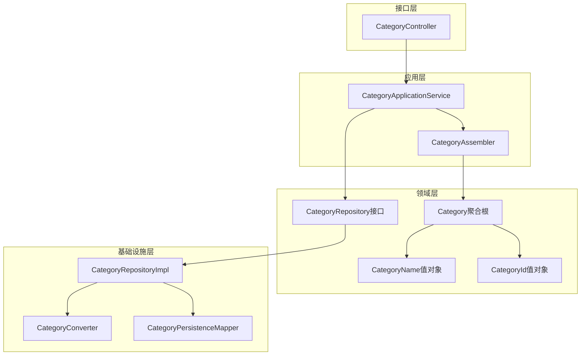

**图表来源**
- [CategoryController.java](file://src/main/java/com/crazydream/interfaces/category/CategoryController.java#L1-L83)
- [CategoryApplicationService.java](file://src/main/java/com/crazydream/application/category/service/CategoryApplicationService.java#L1-L48)
- [CategoryRepositoryImpl.java](file://src/main/java/com/crazydream/infrastructure/persistence/repository/CategoryRepositoryImpl.java#L1-L59)

**章节来源**
- [CategoryController.java](file://src/main/java/com/crazydream/interfaces/category/CategoryController.java#L1-L83)
- [CategoryApplicationService.java](file://src/main/java/com/crazydream/application/category/service/CategoryApplicationService.java#L1-L48)

## 核心组件

### 数据模型设计

分类系统的核心数据模型由多个层次组成，确保了数据的完整性和业务逻辑的正确性：

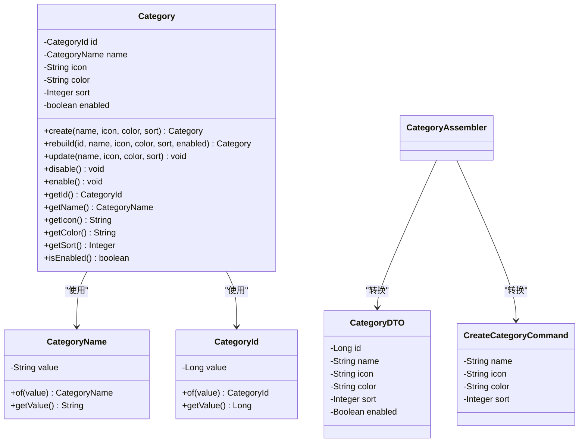

**图表来源**
- [Category.java](file://src/main/java/com/crazydream/domain/category/model/aggregate/Category.java#L1-L83)
- [CategoryName.java](file://src/main/java/com/crazydream/domain/category/model/valueobject/CategoryName.java#L1-L34)
- [CategoryId.java](file://src/main/java/com/crazydream/domain/shared/model/CategoryId.java#L1-L48)
- [CategoryDTO.java](file://src/main/java/com/crazydream/application/category/dto/CategoryDTO.java#L1-L14)
- [CreateCategoryCommand.java](file://src/main/java/com/crazydream/application/category/dto/CreateCategoryCommand.java#L1-L12)

### 业务规则和约束

分类系统实现了严格的业务规则和数据约束：

1. **分类名称验证**：名称不能为空，自动去除首尾空格
2. **分类ID约束**：ID必须为正整数，确保数据完整性
3. **状态管理**：支持启用/禁用状态，影响分类的可用性
4. **排序机制**：基于sort字段进行升序排列
5. **唯一性约束**：数据库层面保证分类名称的唯一性

**章节来源**
- [CategoryName.java](file://src/main/java/com/crazydream/domain/category/model/valueobject/CategoryName.java#L8-L13)
- [CategoryId.java](file://src/main/java/com/crazydream/domain/shared/model/CategoryId.java#L15-L20)
- [schema.sql](file://src/main/resources/schema.sql#L29)

## 架构概览

分类管理模块采用分层架构设计，每层都有明确的职责分工：

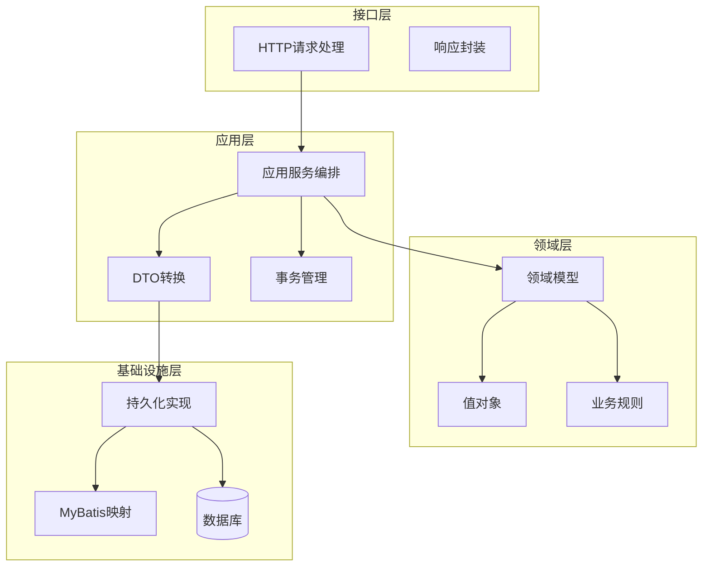

**图表来源**
- [CategoryController.java](file://src/main/java/com/crazydream/interfaces/category/CategoryController.java#L11-L16)
- [CategoryApplicationService.java](file://src/main/java/com/crazydream/application/category/service/CategoryApplicationService.java#L14-L18)
- [CategoryRepositoryImpl.java](file://src/main/java/com/crazydream/infrastructure/persistence/repository/CategoryRepositoryImpl.java#L16-L20)

### 控制流分析

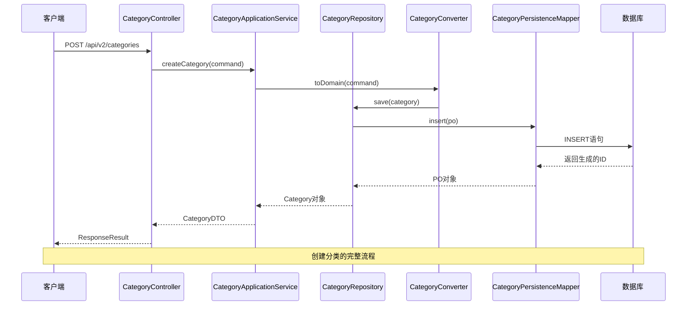

**图表来源**
- [CategoryController.java](file://src/main/java/com/crazydream/interfaces/category/CategoryController.java#L18-L26)
- [CategoryApplicationService.java](file://src/main/java/com/crazydream/application/category/service/CategoryApplicationService.java#L20-L25)
- [CategoryRepositoryImpl.java](file://src/main/java/com/crazydream/infrastructure/persistence/repository/CategoryRepositoryImpl.java#L22-L32)

**章节来源**
- [CategoryController.java](file://src/main/java/com/crazydream/interfaces/category/CategoryController.java#L1-L83)
- [CategoryApplicationService.java](file://src/main/java/com/crazydream/application/category/service/CategoryApplicationService.java#L1-L48)

## 详细组件分析

### 接口控制器

CategoryController提供了完整的REST API接口，支持分类的增删改查操作：

#### 主要接口功能

| 接口 | 方法 | URL | 功能描述 |
|------|------|-----|----------|
| 创建分类 | POST | `/api/v2/categories` | 创建新的分类 |
| 获取所有分类 | GET | `/api/v2/categories` | 获取系统中所有分类 |
| 获取启用分类 | GET | `/api/v2/categories/enabled` | 获取启用状态的分类 |
| 获取分类详情 | GET | `/api/v2/categories/{id}` | 根据ID获取分类详情 |
| 更新分类 | PUT | `/api/v2/categories/{id}` | 更新分类信息 |
| 删除分类 | DELETE | `/api/v2/categories/{id}` | 删除指定分类 |

#### 参数验证和错误处理

控制器实现了完善的参数验证和错误处理机制：

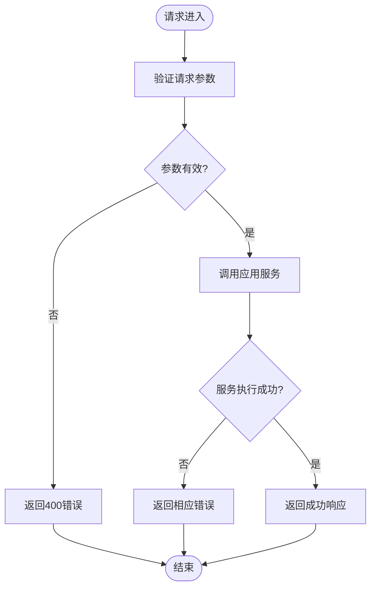

**图表来源**
- [CategoryController.java](file://src/main/java/com/crazydream/interfaces/category/CategoryController.java#L18-L81)

**章节来源**
- [CategoryController.java](file://src/main/java/com/crazydream/interfaces/category/CategoryController.java#L1-L83)

### 应用服务层

CategoryApplicationService作为应用服务编排器，负责协调各个组件完成业务逻辑：

#### 核心业务流程

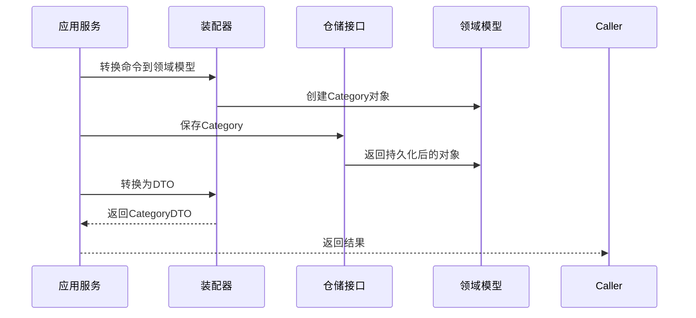

**图表来源**
- [CategoryApplicationService.java](file://src/main/java/com/crazydream/application/category/service/CategoryApplicationService.java#L20-L25)
- [CategoryAssembler.java](file://src/main/java/com/crazydream/application/category/assembler/CategoryAssembler.java#L12-L19)

#### 事务管理

应用服务层使用@Transactional注解确保数据一致性：

- 创建分类：单个事务确保数据完整性
- 删除分类：单个事务确保级联删除的一致性

**章节来源**
- [CategoryApplicationService.java](file://src/main/java/com/crazydream/application/category/service/CategoryApplicationService.java#L1-L48)

### 领域模型

Category聚合根实现了充血模型设计，封装了完整的业务逻辑：

#### 聚合根设计原则

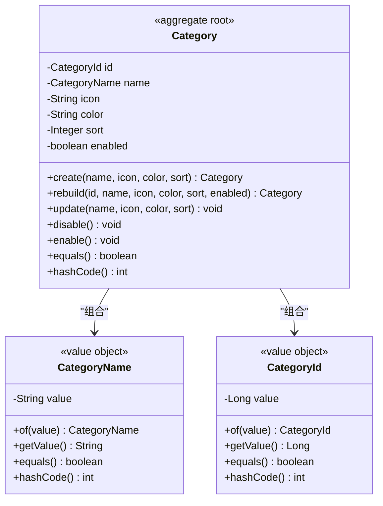

**图表来源**
- [Category.java](file://src/main/java/com/crazydream/domain/category/model/aggregate/Category.java#L11-L41)
- [CategoryName.java](file://src/main/java/com/crazydream/domain/category/model/valueobject/CategoryName.java#L5-L17)
- [CategoryId.java](file://src/main/java/com/crazydream/domain/shared/model/CategoryId.java#L12-L24)

#### 业务方法实现

| 方法 | 功能 | 参数 | 返回值 |
|------|------|------|--------|
| create | 创建新分类 | 名称、图标、颜色、排序 | Category实例 |
| rebuild | 重建分类 | ID、名称、图标、颜色、排序、状态 | Category实例 |
| update | 更新分类信息 | 新的名称、图标、颜色、排序 | void |
| disable | 禁用分类 | 无 | void |
| enable | 启用分类 | 无 | void |

**章节来源**
- [Category.java](file://src/main/java/com/crazydream/domain/category/model/aggregate/Category.java#L21-L56)

### 值对象设计

#### CategoryName值对象

CategoryName实现了不可变的值对象设计，确保数据的完整性：

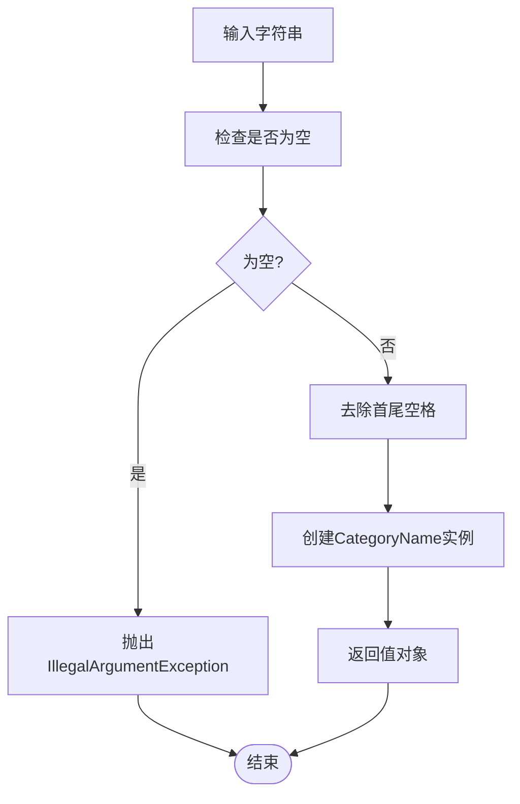

**图表来源**
- [CategoryName.java](file://src/main/java/com/crazydream/domain/category/model/valueobject/CategoryName.java#L8-L17)

#### CategoryId值对象

CategoryId确保分类ID的有效性：

- ID必须为正整数
- 提供of静态工厂方法
- 实现相等性比较

**章节来源**
- [CategoryName.java](file://src/main/java/com/crazydream/domain/category/model/valueobject/CategoryName.java#L1-L34)
- [CategoryId.java](file://src/main/java/com/crazydream/domain/shared/model/CategoryId.java#L1-L48)

### 仓储层实现

#### 仓储接口设计

CategoryRepository接口定义了分类的访问规范：

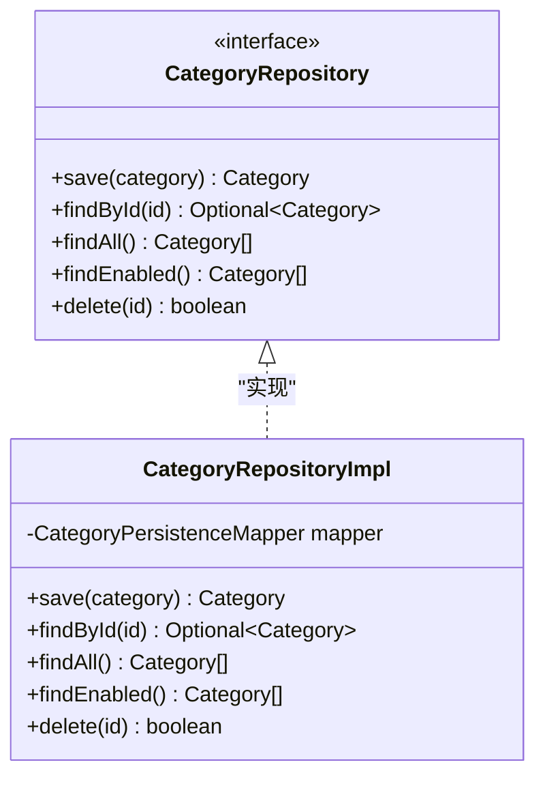

**图表来源**
- [CategoryRepository.java](file://src/main/java/com/crazydream/domain/category/repository/CategoryRepository.java#L9-L15)
- [CategoryRepositoryImpl.java](file://src/main/java/com/crazydream/infrastructure/persistence/repository/CategoryRepositoryImpl.java#L17-L58)

#### 持久化映射

CategoryPersistenceMapper.xml定义了SQL操作：

| 操作 | SQL语句 | 功能 |
|------|---------|------|
| insert | INSERT INTO category | 插入新分类 |
| update | UPDATE category | 更新分类信息 |
| selectById | SELECT * FROM category WHERE id=? | 根据ID查询 |
| selectAll | SELECT * FROM category ORDER BY sort ASC | 查询所有分类 |
| selectByStatus | SELECT * FROM category WHERE status=? ORDER BY sort ASC | 按状态查询 |
| deleteById | DELETE FROM category WHERE id=? | 删除分类 |

**章节来源**
- [CategoryRepository.java](file://src/main/java/com/crazydream/domain/category/repository/CategoryRepository.java#L1-L16)
- [CategoryRepositoryImpl.java](file://src/main/java/com/crazydream/infrastructure/persistence/repository/CategoryRepositoryImpl.java#L1-L59)
- [CategoryPersistenceMapper.xml](file://src/main/resources/mapper/CategoryPersistenceMapper.xml#L1-L47)

## 依赖关系分析

### 组件依赖图

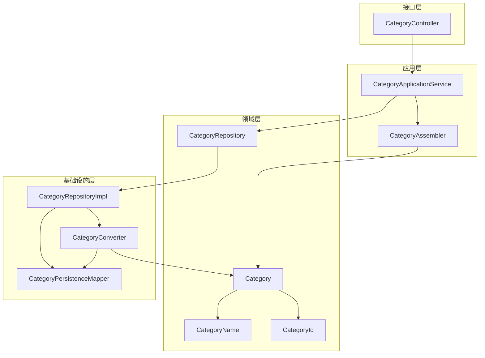

**图表来源**
- [CategoryController.java](file://src/main/java/com/crazydream/interfaces/category/CategoryController.java#L3-L16)
- [CategoryApplicationService.java](file://src/main/java/com/crazydream/application/category/service/CategoryApplicationService.java#L3-L18)
- [CategoryRepositoryImpl.java](file://src/main/java/com/crazydream/infrastructure/persistence/repository/CategoryRepositoryImpl.java#L3-L20)

### 数据流分析

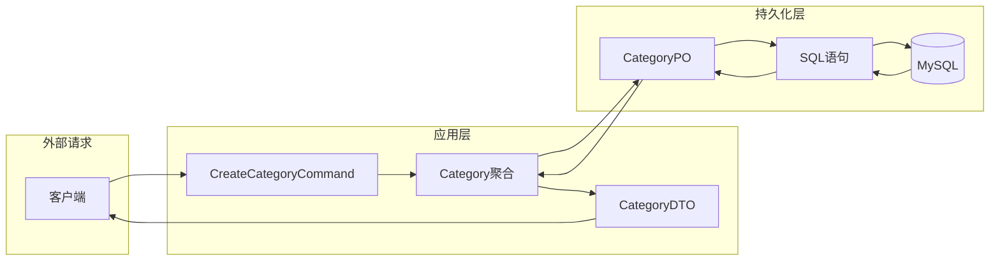

**图表来源**
- [CategoryAssembler.java](file://src/main/java/com/crazydream/application/category/assembler/CategoryAssembler.java#L12-L34)
- [CategoryConverter.java](file://src/main/java/com/crazydream/infrastructure/persistence/converter/CategoryConverter.java#L10-L36)

**章节来源**
- [CategoryAssembler.java](file://src/main/java/com/crazydream/application/category/assembler/CategoryAssembler.java#L1-L42)
- [CategoryConverter.java](file://src/main/java/com/crazydream/infrastructure/persistence/converter/CategoryConverter.java#L1-L38)

## 性能考虑

### 查询优化

1. **索引设计**：数据库表已建立合适的索引
2. **排序优化**：按sort字段排序，支持快速获取有序列表
3. **状态过滤**：提供按状态查询的专用接口

### 缓存策略

当前实现未包含缓存层，可根据业务需求考虑：
- 分类列表缓存
- 分类详情缓存
- 状态分类缓存

### 批量操作

系统支持批量查询操作，但未实现批量更新功能。可根据需求扩展批量操作接口。

## 故障排除指南

### 常见问题和解决方案

#### 分类名称验证错误

**问题**：创建分类时提示名称无效
**原因**：名称为空或仅包含空格
**解决**：确保名称非空且去除首尾空格

#### 分类ID无效

**问题**：更新或删除分类时报ID无效
**原因**：ID为空或非正数
**解决**：确保提供有效的正整数ID

#### 数据库约束冲突

**问题**：分类名称重复导致插入失败
**原因**：数据库唯一约束
**解决**：检查现有分类或修改名称

### 错误响应码

| 状态码 | 错误类型 | 说明 |
|--------|----------|------|
| 200 | 成功 | 操作成功执行 |
| 400 | 参数错误 | 请求参数无效 |
| 401 | 未授权 | JWT认证失败 |
| 404 | 资源不存在 | 分类ID不存在 |
| 500 | 服务器错误 | 系统内部错误 |

**章节来源**
- [CategoryController.java](file://src/main/java/com/crazydream/interfaces/category/CategoryController.java#L23-L81)

## 结论

分类管理模块通过合理的架构设计和严格的业务规则实现，为CrazyDream目标管理系统提供了稳定可靠的分类管理能力。模块具有以下特点：

1. **清晰的架构分层**：遵循DDD和COLA四层架构原则
2. **完整的业务逻辑**：实现了分类的全生命周期管理
3. **严格的数据约束**：通过值对象确保数据完整性
4. **良好的扩展性**：模块化设计便于功能扩展
5. **完善的错误处理**：提供友好的错误响应机制

该模块为后续的功能扩展奠定了坚实的基础，可以在此基础上实现更复杂的分类管理功能。

## 附录

### API接口完整文档

#### 创建分类

**请求**：
```
POST /api/v2/categories
Content-Type: application/json
Authorization: Bearer <token>

{
    "name": "分类名称",
    "icon": "图标emoji",
    "color": "颜色值",
    "sort": 排序序号
}
```

**响应**：
```json
{
    "code": 200,
    "message": "成功",
    "data": {
        "id": 1,
        "name": "分类名称",
        "icon": "图标emoji",
        "color": "颜色值",
        "sort": 排序序号,
        "enabled": true
    }
}
```

#### 获取所有分类

**请求**：
```
GET /api/v2/categories
Authorization: Bearer <token>
```

**响应**：
```json
{
    "code": 200,
    "message": "成功",
    "data": [
        {
            "id": 1,
            "name": "分类名称",
            "icon": "图标emoji",
            "color": "颜色值",
            "sort": 排序序号,
            "enabled": true
        }
    ]
}
```

#### 获取启用的分类

**请求**：
```
GET /api/v2/categories/enabled
Authorization: Bearer <token>
```

**响应**：
```json
{
    "code": 200,
    "message": "成功",
    "data": [
        {
            "id": 1,
            "name": "分类名称",
            "icon": "图标emoji",
            "color": "颜色值",
            "sort": 排序序号,
            "enabled": true
        }
    ]
}
```

#### 获取分类详情

**请求**：
```
GET /api/v2/categories/{id}
Authorization: Bearer <token>
```

**响应**：
```json
{
    "code": 200,
    "message": "成功",
    "data": {
        "id": 1,
        "name": "分类名称",
        "icon": "图标emoji",
        "color": "颜色值",
        "sort": 排序序号,
        "enabled": true
    }
}
```

#### 更新分类

**请求**：
```
PUT /api/v2/categories/{id}
Content-Type: application/json
Authorization: Bearer <token>

{
    "name": "新名称",
    "icon": "新图标",
    "color": "新颜色"
}
```

**响应**：
```json
{
    "code": 200,
    "message": "成功",
    "data": {
        "id": 1,
        "name": "新名称"
    }
}
```

#### 删除分类

**请求**：
```
DELETE /api/v2/categories/{id}
Authorization: Bearer <token>
```

**响应**：
```json
{
    "code": 200,
    "message": "成功",
    "data": true
}
```

### 数据模型字段说明

#### Category实体字段

| 字段名 | 类型 | 必填 | 默认值 | 说明 |
|--------|------|------|--------|------|
| id | Long | 否 | 自动分配 | 分类唯一标识符 |
| name | String | 是 | 无 | 分类名称，长度限制50字符 |
| icon | String | 否 | null | 分类图标，支持emoji |
| color | String | 否 | null | 分类颜色，十六进制格式 |
| sort | Integer | 否 | 0 | 排序序号，用于列表排序 |
| enabled | Boolean | 否 | true | 是否启用状态 |

#### 数据库表结构

```sql
CREATE TABLE category (
    id BIGINT AUTO_INCREMENT PRIMARY KEY,
    name VARCHAR(50) NOT NULL COMMENT '分类名称',
    icon VARCHAR(50) DEFAULT NULL COMMENT '分类图标',
    color VARCHAR(20) DEFAULT NULL COMMENT '分类颜色',
    sort INT DEFAULT 0 COMMENT '排序',
    status TINYINT DEFAULT 1 COMMENT '状态（1:正常, 0:禁用）',
    create_time DATETIME DEFAULT CURRENT_TIMESTAMP COMMENT '创建时间',
    update_time DATETIME DEFAULT CURRENT_TIMESTAMP ON UPDATE CURRENT_TIMESTAMP COMMENT '更新时间'
) ENGINE=InnoDB DEFAULT CHARSET=utf8mb4 COMMENT='分类表';
```

### 使用示例

#### Java集成示例

```java
// 创建分类
CreateCategoryCommand command = new CreateCategoryCommand();
command.setName("学习成长");
command.setIcon("📚");
command.setColor("#2ecc71");
command.setSort(2);

CategoryDTO result = categoryService.createCategory(command);

// 获取所有分类
List<CategoryDTO> categories = categoryService.getAllCategories();

// 更新分类
Map<String, Object> payload = new HashMap<>();
payload.put("name", "更新后的分类名称");
CategoryDTO updated = categoryService.updateCategory(1L, payload);
```

#### 前端集成示例

```javascript
// 获取分类列表
fetch('/api/v2/categories', {
    headers: {
        'Authorization': 'Bearer ' + token
    }
})
.then(response => response.json())
.then(data => console.log(data.data));

// 创建新分类
fetch('/api/v2/categories', {
    method: 'POST',
    headers: {
        'Content-Type': 'application/json',
        'Authorization': 'Bearer ' + token
    },
    body: JSON.stringify({
        name: '新分类',
        icon: '🎯',
        color: '#3498db',
        sort: 1
    })
})
.then(response => response.json())
.then(data => console.log(data.data));
```

**章节来源**
- [api-documentation.md](file://api-documentation.md#L410-L575)
- [schema.sql](file://src/main/resources/schema.sql#L26-L36)