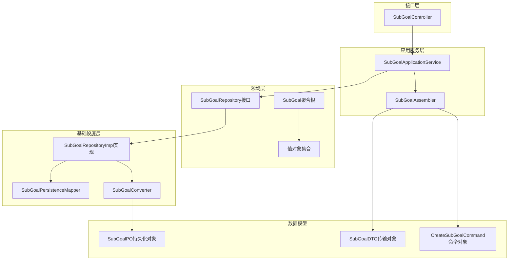
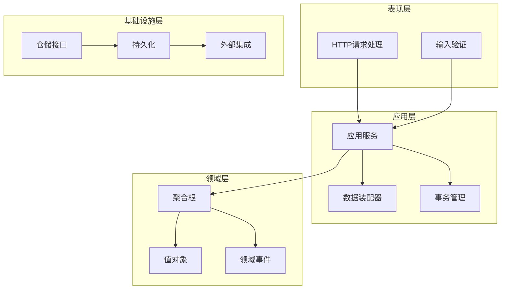
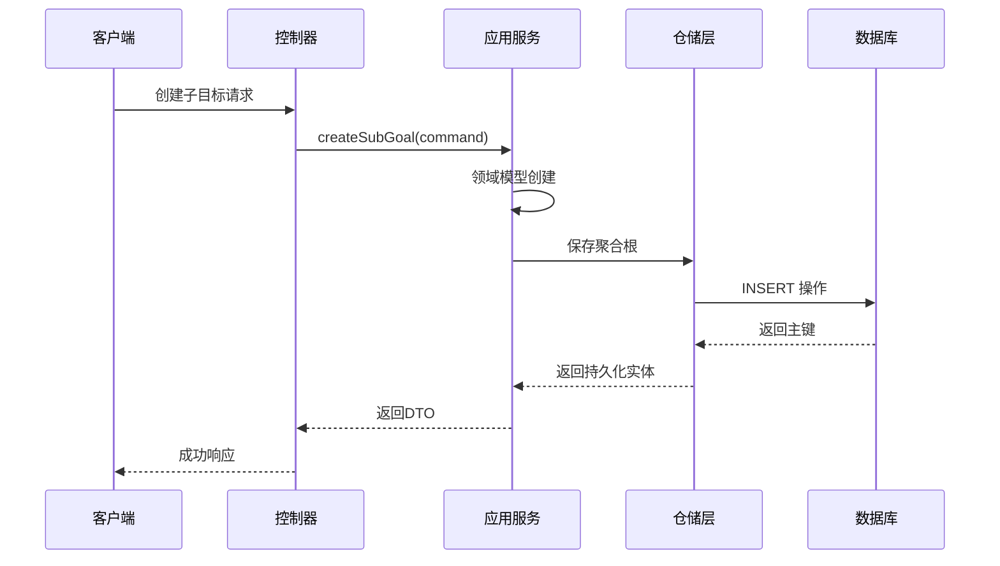
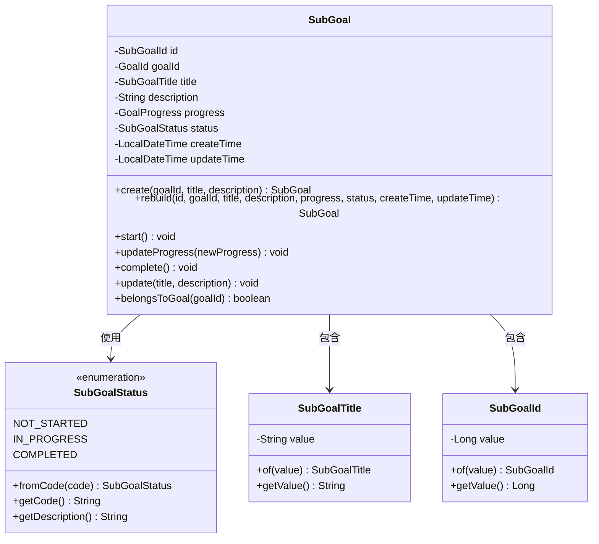
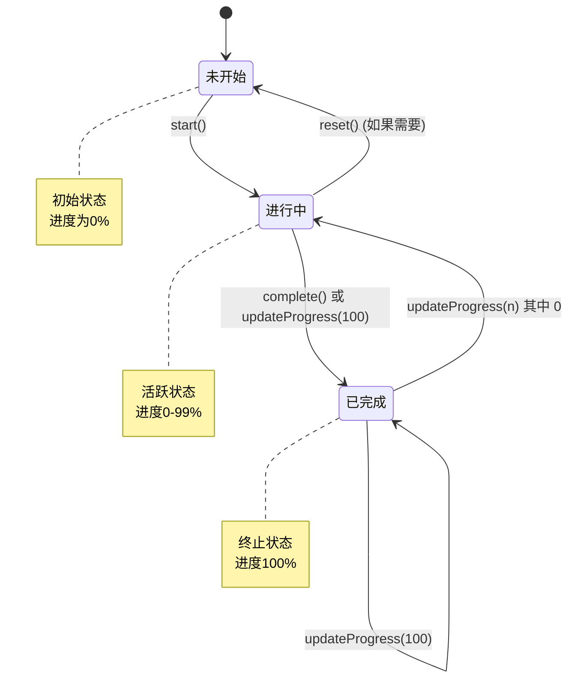
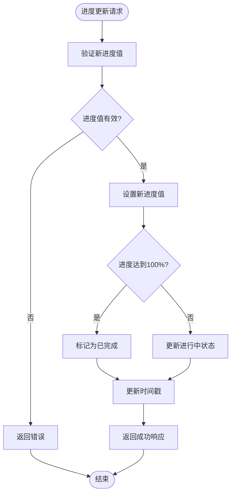
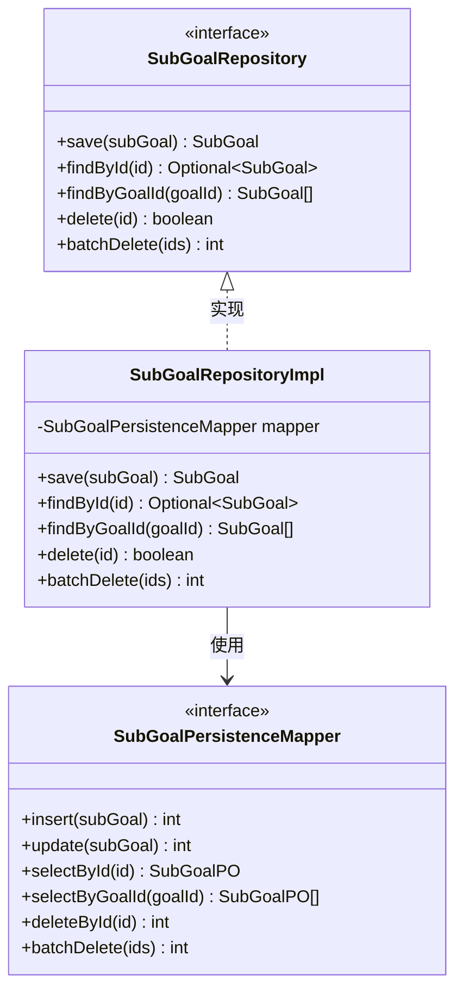
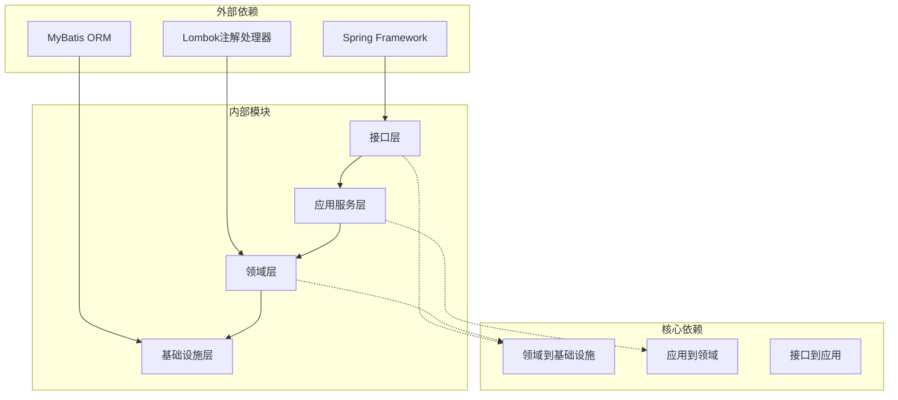
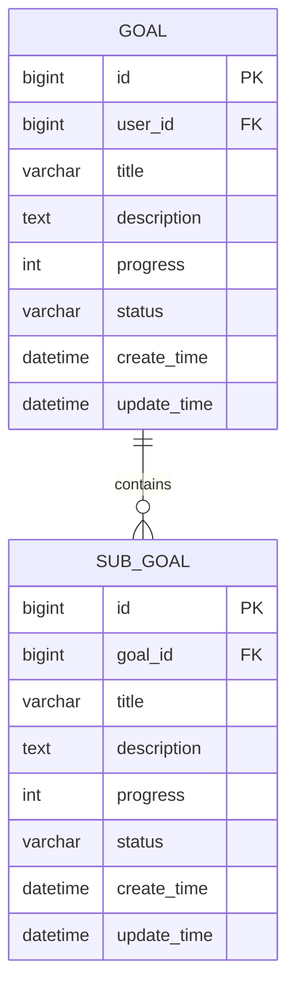

# 子目标管理模块

<cite>
**本文档引用的文件**
- [SubGoalController.java](file://src/main/java/com/crazydream/interfaces/subgoal/SubGoalController.java)
- [SubGoalApplicationService.java](file://src/main/java/com/crazydream/application/subgoal/service/SubGoalApplicationService.java)
- [SubGoalAssembler.java](file://src/main/java/com/crazydream/application/subgoal/assembler/SubGoalAssembler.java)
- [CreateSubGoalCommand.java](file://src/main/java/com/crazydream/application/subgoal/dto/CreateSubGoalCommand.java)
- [SubGoalDTO.java](file://src/main/java/com/crazydream/application/subgoal/dto/SubGoalDTO.java)
- [SubGoal.java](file://src/main/java/com/crazydream/domain/subgoal/model/aggregate/SubGoal.java)
- [SubGoalStatus.java](file://src/main/java/com/crazydream/domain/subgoal/model/valueobject/SubGoalStatus.java)
- [SubGoalTitle.java](file://src/main/java/com/crazydream/domain/subgoal/model/valueobject/SubGoalTitle.java)
- [SubGoalId.java](file://src/main/java/com/crazydream/domain/subgoal/model/valueobject/SubGoalId.java)
- [SubGoalRepository.java](file://src/main/java/com/crazydream/domain/subgoal/repository/SubGoalRepository.java)
- [SubGoalRepositoryImpl.java](file://src/main/java/com/crazydream/infrastructure/persistence/repository/SubGoalRepositoryImpl.java)
- [SubGoalPersistenceMapper.java](file://src/main/java/com/crazydream/infrastructure/persistence/mapper/SubGoalPersistenceMapper.java)
- [SubGoalConverter.java](file://src/main/java/com/crazydream/infrastructure/persistence/converter/SubGoalConverter.java)
- [schema.sql](file://src/main/resources/schema.sql)
- [SubGoalServiceTest.java](file://src/test/java/com/crazydream/service/SubGoalServiceTest.java)
</cite>

## 目录
1. [简介](#简介)
2. [项目结构](#项目结构)
3. [核心组件](#核心组件)
4. [架构概览](#架构概览)
5. [详细组件分析](#详细组件分析)
6. [依赖关系分析](#依赖关系分析)
7. [性能考虑](#性能考虑)
8. [故障排除指南](#故障排除指南)
9. [结论](#结论)
10. [附录](#附录)

## 简介

子目标管理模块是目标管理系统中的重要组成部分，负责管理用户目标下的子目标实体。该模块实现了完整的子目标生命周期管理，包括创建、查询、更新、删除等操作，以及状态管理和进度跟踪功能。

本模块采用DDD（领域驱动设计）架构，通过充血模型实现业务逻辑封装，确保数据完整性和业务规则的一致性。模块支持父子关系设计，每个子目标都明确关联到一个父目标，实现了清晰的层次结构。

## 项目结构

子目标管理模块遵循标准的分层架构设计，按照职责分离的原则组织代码：



**图表来源**
- [SubGoalController.java](file://src/main/java/com/crazydream/interfaces/subgoal/SubGoalController.java#L1-L116)
- [SubGoalApplicationService.java](file://src/main/java/com/crazydream/application/subgoal/service/SubGoalApplicationService.java#L1-L61)
- [SubGoalRepositoryImpl.java](file://src/main/java/com/crazydream/infrastructure/persistence/repository/SubGoalRepositoryImpl.java#L1-L62)

**章节来源**
- [SubGoalController.java](file://src/main/java/com/crazydream/interfaces/subgoal/SubGoalController.java#L1-L116)
- [SubGoalApplicationService.java](file://src/main/java/com/crazydream/application/subgoal/service/SubGoalApplicationService.java#L1-L61)

## 核心组件

### 接口控制器层

**SubGoalController** 提供RESTful API接口，处理HTTP请求并返回标准化响应格式。

主要功能：
- 子目标创建：支持完整的子目标信息提交
- 子目标查询：按ID查询单个子目标，按目标ID查询子目标列表
- 子目标更新：支持进度更新和基本信息修改
- 子目标删除：支持单个删除和批量删除
- 状态管理：提供完成状态的快捷操作

### 应用服务层

**SubGoalApplicationService** 实现业务用例，协调领域模型和基础设施层。

核心职责：
- 业务流程编排：组合多个领域操作
- 数据转换：在DTO和领域模型之间进行转换
- 事务管理：确保业务操作的原子性
- 错误处理：统一处理业务异常和系统异常

### 领域模型层

**SubGoal聚合根** 实现充血模型，封装业务逻辑和状态转换。

关键特性：
- 独立聚合根：具有完整的生命周期管理
- 状态机设计：定义了完整的状态转换规则
- 进度管理：支持百分比进度的精确控制
- 不变性保证：通过值对象确保数据完整性

### 值对象设计

模块使用丰富的值对象来保证数据质量和业务规则：

- **SubGoalId**：子目标唯一标识符
- **SubGoalTitle**：子目标标题，包含长度和格式验证
- **SubGoalStatus**：子目标状态枚举，支持状态码映射
- **GoalProgress**：目标进度值对象，支持进度计算

**章节来源**
- [SubGoalController.java](file://src/main/java/com/crazydream/interfaces/subgoal/SubGoalController.java#L1-L116)
- [SubGoalApplicationService.java](file://src/main/java/com/crazydream/application/subgoal/service/SubGoalApplicationService.java#L1-L61)
- [SubGoal.java](file://src/main/java/com/crazydream/domain/subgoal/model/aggregate/SubGoal.java#L1-L118)

## 架构概览

子目标管理模块采用经典的四层架构模式，每层都有明确的职责分工：



**图表来源**
- [SubGoalController.java](file://src/main/java/com/crazydream/interfaces/subgoal/SubGoalController.java#L1-L116)
- [SubGoalApplicationService.java](file://src/main/java/com/crazydream/application/subgoal/service/SubGoalApplicationService.java#L1-L61)
- [SubGoalRepositoryImpl.java](file://src/main/java/com/crazydream/infrastructure/persistence/repository/SubGoalRepositoryImpl.java#L1-L62)

### 数据流图



**图表来源**
- [SubGoalController.java](file://src/main/java/com/crazydream/interfaces/subgoal/SubGoalController.java#L18-L26)
- [SubGoalApplicationService.java](file://src/main/java/com/crazydream/application/subgoal/service/SubGoalApplicationService.java#L22-L26)
- [SubGoalRepositoryImpl.java](file://src/main/java/com/crazydream/infrastructure/persistence/repository/SubGoalRepositoryImpl.java#L24-L33)

## 详细组件分析

### 子目标聚合根分析

**SubGoal聚合根** 是模块的核心业务实体，实现了完整的充血模型设计：



**图表来源**
- [SubGoal.java](file://src/main/java/com/crazydream/domain/subgoal/model/aggregate/SubGoal.java#L14-L118)
- [SubGoalStatus.java](file://src/main/java/com/crazydream/domain/subgoal/model/valueobject/SubGoalStatus.java#L6-L39)
- [SubGoalTitle.java](file://src/main/java/com/crazydream/domain/subgoal/model/valueobject/SubGoalTitle.java#L8-L44)
- [SubGoalId.java](file://src/main/java/com/crazydream/domain/subgoal/model/valueobject/SubGoalId.java#L8-L39)

#### 状态转换规则

子目标的状态转换遵循严格的有限状态机设计：



**图表来源**
- [SubGoal.java](file://src/main/java/com/crazydream/domain/subgoal/model/aggregate/SubGoal.java#L61-L78)
- [SubGoalStatus.java](file://src/main/java/com/crazydream/domain/subgoal/model/valueobject/SubGoalStatus.java#L6-L39)

#### 进度管理算法

子目标的进度管理采用百分比制，支持精确的进度跟踪：



**图表来源**
- [SubGoal.java](file://src/main/java/com/crazydream/domain/subgoal/model/aggregate/SubGoal.java#L66-L72)

### 值对象设计分析

#### SubGoalTitle值对象

SubGoalTitle确保子目标标题的质量和一致性：

- **长度限制**：最大100个字符
- **格式验证**：不允许空值和空白字符
- **数据清理**：自动去除首尾空白
- **不可变性**：构造后无法修改

#### SubGoalStatus值对象

SubGoalStatus提供类型安全的状态管理：

- **枚举类型**：定义了三种状态
- **状态码映射**：支持字符串状态码的解析
- **本地化支持**：提供状态描述
- **默认值处理**：空状态时返回未开始状态

### 仓储层设计

仓储层实现了数据访问的抽象，提供了统一的数据操作接口：



**图表来源**
- [SubGoalRepository.java](file://src/main/java/com/crazydream/domain/subgoal/repository/SubGoalRepository.java#L10-L17)
- [SubGoalRepositoryImpl.java](file://src/main/java/com/crazydream/infrastructure/persistence/repository/SubGoalRepositoryImpl.java#L18-L62)
- [SubGoalPersistenceMapper.java](file://src/main/java/com/crazydream/infrastructure/persistence/mapper/SubGoalPersistenceMapper.java#L9-L17)

**章节来源**
- [SubGoal.java](file://src/main/java/com/crazydream/domain/subgoal/model/aggregate/SubGoal.java#L1-L118)
- [SubGoalStatus.java](file://src/main/java/com/crazydream/domain/subgoal/model/valueobject/SubGoalStatus.java#L1-L39)
- [SubGoalTitle.java](file://src/main/java/com/crazydream/domain/subgoal/model/valueobject/SubGoalTitle.java#L1-L44)
- [SubGoalId.java](file://src/main/java/com/crazydream/domain/subgoal/model/valueobject/SubGoalId.java#L1-L39)
- [SubGoalRepository.java](file://src/main/java/com/crazydream/domain/subgoal/repository/SubGoalRepository.java#L1-L17)
- [SubGoalRepositoryImpl.java](file://src/main/java/com/crazydream/infrastructure/persistence/repository/SubGoalRepositoryImpl.java#L1-L62)
- [SubGoalPersistenceMapper.java](file://src/main/java/com/crazydream/infrastructure/persistence/mapper/SubGoalPersistenceMapper.java#L1-L17)

## 依赖关系分析

模块的依赖关系遵循依赖倒置原则，通过接口隔离具体实现：



**图表来源**
- [SubGoalController.java](file://src/main/java/com/crazydream/interfaces/subgoal/SubGoalController.java#L1-L116)
- [SubGoalApplicationService.java](file://src/main/java/com/crazydream/application/subgoal/service/SubGoalApplicationService.java#L1-L61)
- [SubGoalRepositoryImpl.java](file://src/main/java/com/crazydream/infrastructure/persistence/repository/SubGoalRepositoryImpl.java#L1-L62)

### 循环依赖检测

经过分析，模块内不存在循环依赖：
- 接口层不依赖应用层实现
- 应用层不依赖基础设施实现
- 领域层不依赖应用层实现
- 仓储接口与实现分离良好

**章节来源**
- [SubGoalAssembler.java](file://src/main/java/com/crazydream/application/subgoal/assembler/SubGoalAssembler.java#L1-L44)
- [SubGoalConverter.java](file://src/main/java/com/crazydream/infrastructure/persistence/converter/SubGoalConverter.java#L1-L43)

## 性能考虑

### 查询优化策略

1. **索引设计**：子目标表基于goal_id建立索引，支持快速的父子关系查询
2. **批量操作**：提供批量删除接口，减少数据库往返次数
3. **懒加载**：避免不必要的关联数据加载

### 缓存策略

建议在应用层添加适当的缓存机制：
- 子目标详情缓存：热点数据缓存30分钟
- 子目标列表缓存：按目标ID缓存子目标列表
- 状态统计缓存：缓存目标的子目标状态统计

### 并发控制

模块通过以下机制保证并发安全性：
- 数据库层面的外键约束
- 应用层面的乐观锁检查
- 事务边界内的原子操作

## 故障排除指南

### 常见问题及解决方案

#### 1. 子目标不存在异常

**症状**：调用getSubGoalById时抛出IllegalArgumentException
**原因**：子目标ID无效或不存在
**解决方案**：先验证子目标ID的有效性，再执行查询操作

#### 2. 状态转换异常

**症状**：状态更新失败或状态码不正确
**原因**：状态转换规则被违反
**解决方案**：检查状态转换逻辑，确保遵循状态机规则

#### 3. 进度更新异常

**症状**：进度值超出范围或状态未正确更新
**原因**：进度值验证失败
**解决方案**：确保进度值在0-100范围内，并正确处理完成状态

### 调试技巧

1. **日志记录**：启用详细的业务日志，跟踪状态转换过程
2. **单元测试**：编写覆盖各种边界情况的测试用例
3. **数据库检查**：直接查询数据库验证数据一致性

**章节来源**
- [SubGoalApplicationService.java](file://src/main/java/com/crazydream/application/subgoal/service/SubGoalApplicationService.java#L33-L37)
- [SubGoal.java](file://src/main/java/com/crazydream/domain/subgoal/model/aggregate/SubGoal.java#L66-L72)

## 结论

子目标管理模块通过精心设计的DDD架构，实现了业务逻辑的清晰封装和数据的完整保护。模块具有以下优势：

1. **架构清晰**：分层设计明确，职责分离合理
2. **业务完整**：充血模型确保业务规则得到严格执行
3. **扩展性强**：值对象设计支持灵活的功能扩展
4. **性能优良**：合理的查询策略和缓存机制

模块为整个目标管理系统提供了坚实的基础，支持复杂的子目标管理需求，包括状态管理、进度跟踪、父子关系维护等功能。

## 附录

### API接口文档

#### 子目标管理API

| 方法 | URL | 参数 | 功能 | 返回值 |
|------|-----|------|------|--------|
| POST | `/api/v2/subgoals` | CreateSubGoalCommand | 创建子目标 | SubGoalDTO |
| GET | `/api/v2/subgoals` | 无 | 获取所有子目标 | List<SubGoalDTO> |
| GET | `/api/v2/subgoals/goal/{goalId}` | goalId(Long) | 按目标ID查询子目标 | List<SubGoalDTO> |
| GET | `/api/v2/subgoals/{id}` | id(Long) | 按ID查询子目标 | SubGoalDTO |
| PUT | `/api/v2/subgoals/{id}` | id(Long), payload(Map) | 更新子目标 | SubGoalDTO |
| PATCH | `/api/v2/subgoals/{id}/complete` | id(Long) | 完成子目标 | SubGoalDTO |
| DELETE | `/api/v2/subgoals/{id}` | id(Long) | 删除子目标 | Boolean |
| DELETE | `/api/v2/subgoals/batch` | ids(List<Long>) | 批量删除子目标 | Integer |
| PATCH | `/api/v2/subgoals/{id}/progress` | id(Long), progress(Integer) | 更新进度 | SubGoalDTO |

#### 请求体格式

**CreateSubGoalCommand**
```json
{
  "goalId": 1,
  "title": "学习Spring Boot",
  "description": "掌握Spring Boot框架开发"
}
```

**SubGoalDTO**
```json
{
  "id": 1,
  "goalId": 1,
  "title": "学习Spring Boot",
  "description": "掌握Spring Boot框架开发",
  "progress": 0,
  "status": "not_started",
  "createTime": "2026-01-01T00:00:00",
  "updateTime": "2026-01-01T00:00:00"
}
```

### 数据模型设计

#### 数据库表结构



**图表来源**
- [schema.sql](file://src/main/resources/schema.sql#L39-L84)

### 最佳实践指南

#### 开发最佳实践

1. **值对象使用**：始终使用值对象进行数据验证和封装
2. **状态机设计**：严格遵循状态转换规则，避免非法状态
3. **事务边界**：合理划分事务边界，确保数据一致性
4. **异常处理**：统一处理业务异常和系统异常

#### 性能优化建议

1. **批量操作**：对于大量数据操作，优先使用批量接口
2. **缓存策略**：合理使用缓存减少数据库压力
3. **索引优化**：为常用查询字段建立适当索引
4. **连接池配置**：优化数据库连接池参数

#### 安全注意事项

1. **输入验证**：对所有外部输入进行严格验证
2. **权限控制**：确保用户只能访问自己的数据
3. **SQL注入防护**：使用ORM框架提供的参数化查询
4. **XSS防护**：对用户输入进行适当的转义处理