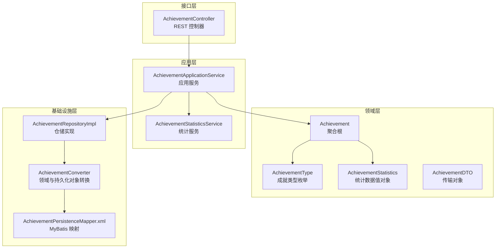
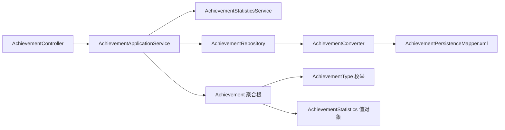
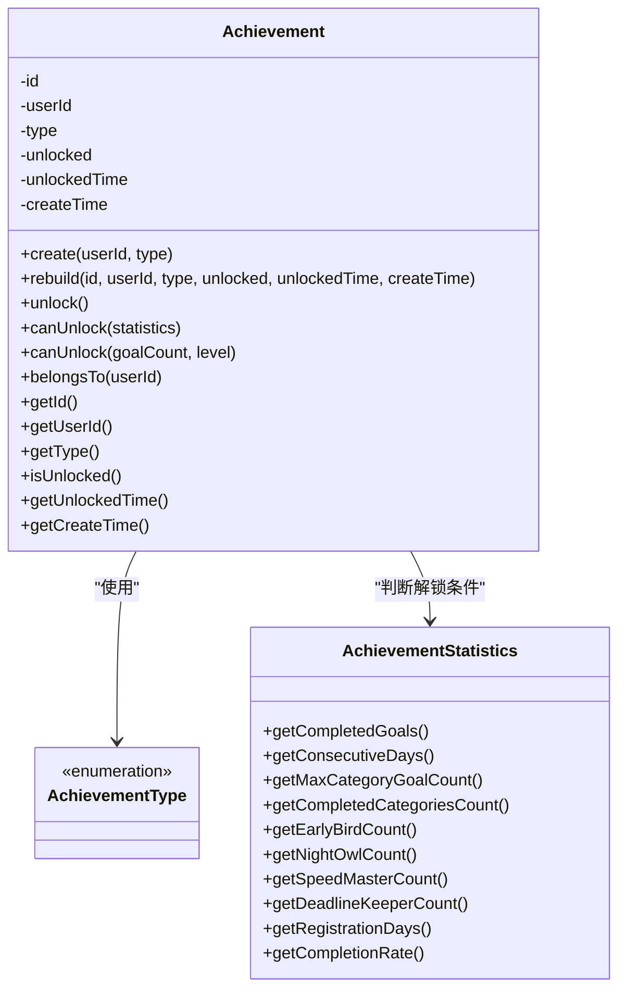
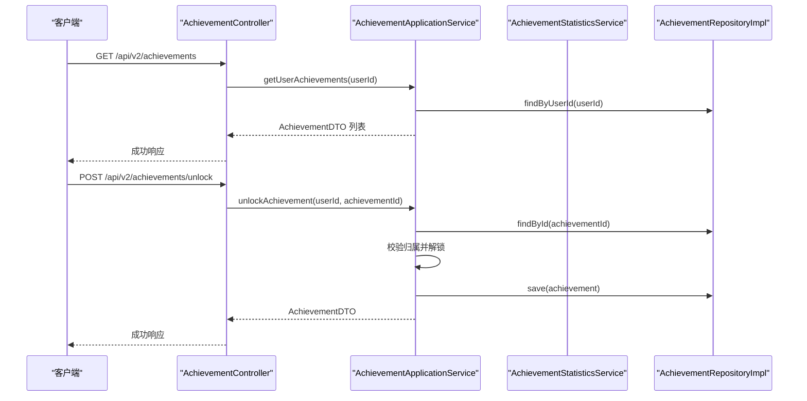
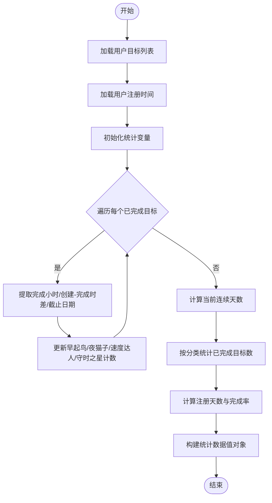
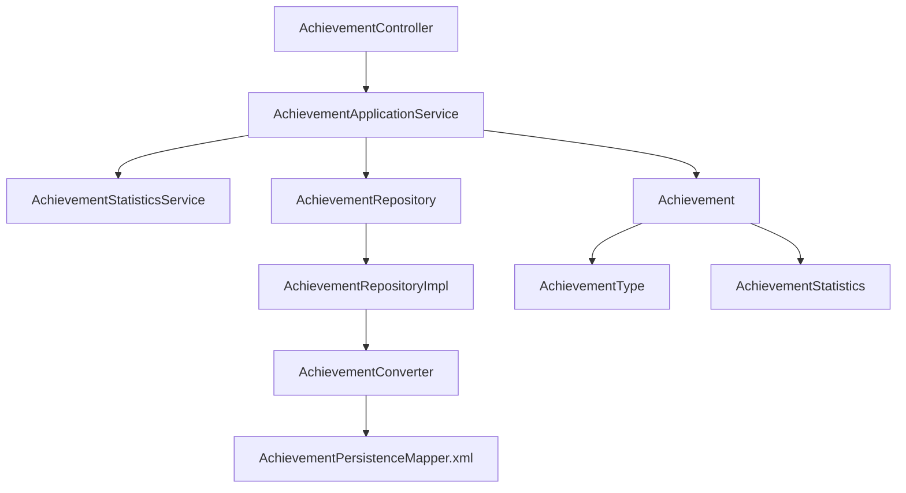

# 成就系统模块

<cite>
**本文档引用的文件**
- [Achievement.java](file://src/main/java/com/crazydream/domain/achievement/model/aggregate/Achievement.java)
- [AchievementType.java](file://src/main/java/com/crazydream/domain/achievement/model/valueobject/AchievementType.java)
- [AchievementStatistics.java](file://src/main/java/com/crazydream/domain/achievement/model/valueobject/AchievementStatistics.java)
- [AchievementRepository.java](file://src/main/java/com/crazydream/domain/achievement/repository/AchievementRepository.java)
- [AchievementApplicationService.java](file://src/main/java/com/crazydream/application/achievement/service/AchievementApplicationService.java)
- [AchievementStatisticsService.java](file://src/main/java/com/crazydream/application/achievement/service/AchievementStatisticsService.java)
- [AchievementAssembler.java](file://src/main/java/com/crazydream/application/achievement/assembler/AchievementAssembler.java)
- [AchievementDTO.java](file://src/main/java/com/crazydream/application/achievement/dto/AchievementDTO.java)
- [AchievementController.java](file://src/main/java/com/crazydream/interfaces/achievement/AchievementController.java)
- [AchievementRepositoryImpl.java](file://src/main/java/com/crazydream/infrastructure/persistence/repository/AchievementRepositoryImpl.java)
- [AchievementConverter.java](file://src/main/java/com/crazydream/infrastructure/persistence/converter/AchievementConverter.java)
- [AchievementPersistenceMapper.xml](file://src/main/resources/mapper/AchievementPersistenceMapper.xml)
- [spec.md](file://openspec/specs/achievement-system-enhancement/spec.md)
</cite>

## 目录
1. [简介](#简介)
2. [项目结构](#项目结构)
3. [核心组件](#核心组件)
4. [架构总览](#架构总览)
5. [详细组件分析](#详细组件分析)
6. [依赖关系分析](#依赖关系分析)
7. [性能考虑](#性能考虑)
8. [故障排查指南](#故障排查指南)
9. [结论](#结论)
10. [附录](#附录)

## 简介
本模块实现了一个面向目标管理系统的成就体系，围绕“成就聚合根”“成就类型枚举”“成就统计数据值对象”等核心领域模型，提供成就的创建、解锁、查询与持久化能力。系统通过应用层服务自动收集用户统计数据，并根据预设的业务规则判断成就是否可解锁；同时提供控制器接口供前端或外部系统调用。

## 项目结构
成就系统采用分层架构，遵循领域驱动设计（DDD）思想：
- 接口层：控制器负责接收请求、解析用户身份并调用应用服务
- 应用层：应用服务编排业务流程，协调仓储与统计服务
- 领域层：聚合根与值对象封装业务规则与不变量
- 基础设施层：仓储实现、转换器与MyBatis映射器负责数据持久化

图表来源
- [AchievementController.java](file://src/main/java/com/crazydream/interfaces/achievement/AchievementController.java#L1-L113)
- [AchievementApplicationService.java](file://src/main/java/com/crazydream/application/achievement/service/AchievementApplicationService.java#L1-L91)
- [AchievementStatisticsService.java](file://src/main/java/com/crazydream/application/achievement/service/AchievementStatisticsService.java#L1-L142)
- [Achievement.java](file://src/main/java/com/crazydream/domain/achievement/model/aggregate/Achievement.java#L1-L184)
- [AchievementType.java](file://src/main/java/com/crazydream/domain/achievement/model/valueobject/AchievementType.java#L1-L62)
- [AchievementStatistics.java](file://src/main/java/com/crazydream/domain/achievement/model/valueobject/AchievementStatistics.java#L1-L192)
- [AchievementRepositoryImpl.java](file://src/main/java/com/crazydream/infrastructure/persistence/repository/AchievementRepositoryImpl.java#L1-L55)
- [AchievementConverter.java](file://src/main/java/com/crazydream/infrastructure/persistence/converter/AchievementConverter.java#L1-L45)
- [AchievementPersistenceMapper.xml](file://src/main/resources/mapper/AchievementPersistenceMapper.xml#L1-L47)

章节来源
- [AchievementController.java](file://src/main/java/com/crazydream/interfaces/achievement/AchievementController.java#L1-L113)
- [AchievementApplicationService.java](file://src/main/java/com/crazydream/application/achievement/service/AchievementApplicationService.java#L1-L91)
- [AchievementStatisticsService.java](file://src/main/java/com/crazydream/application/achievement/service/AchievementStatisticsService.java#L1-L142)
- [Achievement.java](file://src/main/java/com/crazydream/domain/achievement/model/aggregate/Achievement.java#L1-L184)
- [AchievementType.java](file://src/main/java/com/crazydream/domain/achievement/model/valueobject/AchievementType.java#L1-L62)
- [AchievementStatistics.java](file://src/main/java/com/crazydream/domain/achievement/model/valueobject/AchievementStatistics.java#L1-L192)
- [AchievementRepositoryImpl.java](file://src/main/java/com/crazydream/infrastructure/persistence/repository/AchievementRepositoryImpl.java#L1-L55)
- [AchievementConverter.java](file://src/main/java/com/crazydream/infrastructure/persistence/converter/AchievementConverter.java#L1-L45)
- [AchievementPersistenceMapper.xml](file://src/main/resources/mapper/AchievementPersistenceMapper.xml#L1-L47)

## 核心组件
- 成就聚合根（Achievement）：封装成就的生命周期、解锁状态与业务判断逻辑，支持按统计数据判断解锁条件。
- 成就类型（AchievementType）：定义所有成就类型及其元数据（编码、名称、描述），并提供从编码反向解析的能力。
- 成就统计数据（AchievementStatistics）：值对象封装所有用于解锁判断的统计指标，提供Builder模式构建与便捷查询方法。
- 应用服务（AchievementApplicationService）：负责确保用户拥有全部成就条目、查询成就列表、执行解锁检查与手动解锁。
- 统计服务（AchievementStatisticsService）：从目标与用户仓储收集数据，计算各项统计指标并生成统计数据值对象。
- 仓储接口与实现（AchievementRepository/AchievementRepositoryImpl）：抽象与具体实现分离，支持按用户查询、查询已解锁成就等。
- 转换器与映射器（AchievementConverter/AchievementPersistenceMapper.xml）：负责领域对象与持久化对象之间的双向转换及SQL映射。
- 控制器（AchievementController）：暴露REST接口，解析当前用户身份并调用应用服务。

章节来源
- [Achievement.java](file://src/main/java/com/crazydream/domain/achievement/model/aggregate/Achievement.java#L1-L184)
- [AchievementType.java](file://src/main/java/com/crazydream/domain/achievement/model/valueobject/AchievementType.java#L1-L62)
- [AchievementStatistics.java](file://src/main/java/com/crazydream/domain/achievement/model/valueobject/AchievementStatistics.java#L1-L192)
- [AchievementApplicationService.java](file://src/main/java/com/crazydream/application/achievement/service/AchievementApplicationService.java#L1-L91)
- [AchievementStatisticsService.java](file://src/main/java/com/crazydream/application/achievement/service/AchievementStatisticsService.java#L1-L142)
- [AchievementRepository.java](file://src/main/java/com/crazydream/domain/achievement/repository/AchievementRepository.java#L1-L16)
- [AchievementRepositoryImpl.java](file://src/main/java/com/crazydream/infrastructure/persistence/repository/AchievementRepositoryImpl.java#L1-L55)
- [AchievementConverter.java](file://src/main/java/com/crazydream/infrastructure/persistence/converter/AchievementConverter.java#L1-L45)
- [AchievementPersistenceMapper.xml](file://src/main/resources/mapper/AchievementPersistenceMapper.xml#L1-L47)
- [AchievementController.java](file://src/main/java/com/crazydream/interfaces/achievement/AchievementController.java#L1-L113)

## 架构总览
成就系统遵循清晰的分层职责与依赖方向：
- 接口层仅依赖应用服务，不直接访问仓储
- 应用服务协调统计服务与仓储，执行业务规则
- 领域层保持纯业务逻辑，不包含框架或基础设施细节
- 基础设施层屏蔽数据库与ORM差异，向上提供统一接口

图表来源
- [AchievementController.java](file://src/main/java/com/crazydream/interfaces/achievement/AchievementController.java#L1-L113)
- [AchievementApplicationService.java](file://src/main/java/com/crazydream/application/achievement/service/AchievementApplicationService.java#L1-L91)
- [AchievementStatisticsService.java](file://src/main/java/com/crazydream/application/achievement/service/AchievementStatisticsService.java#L1-L142)
- [AchievementRepositoryImpl.java](file://src/main/java/com/crazydream/infrastructure/persistence/repository/AchievementRepositoryImpl.java#L1-L55)
- [AchievementConverter.java](file://src/main/java/com/crazydream/infrastructure/persistence/converter/AchievementConverter.java#L1-L45)
- [AchievementPersistenceMapper.xml](file://src/main/resources/mapper/AchievementPersistenceMapper.xml#L1-L47)
- [Achievement.java](file://src/main/java/com/crazydream/domain/achievement/model/aggregate/Achievement.java#L1-L184)
- [AchievementType.java](file://src/main/java/com/crazydream/domain/achievement/model/valueobject/AchievementType.java#L1-L62)
- [AchievementStatistics.java](file://src/main/java/com/crazydream/domain/achievement/model/valueobject/AchievementStatistics.java#L1-L192)

## 详细组件分析

### 成就聚合根（Achievement）
- 职责：维护成就状态（未解锁/已解锁）、创建时间、解锁时间；提供解锁动作与解锁条件判断
- 关键行为：
  - 创建与重建：支持从数据库重建聚合根实例
  - 解锁：若已解锁则抛出异常；否则标记解锁并记录时间
  - 解锁条件判断：依据统计数据值对象判断是否满足各类型成就的阈值要求
  - 用户归属校验：防止越权操作
- 设计要点：采用充血模型，将业务规则内聚在聚合根中，避免在应用层重复判断

图表来源
- [Achievement.java](file://src/main/java/com/crazydream/domain/achievement/model/aggregate/Achievement.java#L1-L184)
- [AchievementType.java](file://src/main/java/com/crazydream/domain/achievement/model/valueobject/AchievementType.java#L1-L62)
- [AchievementStatistics.java](file://src/main/java/com/crazydream/domain/achievement/model/valueobject/AchievementStatistics.java#L1-L192)

章节来源
- [Achievement.java](file://src/main/java/com/crazydream/domain/achievement/model/aggregate/Achievement.java#L1-L184)

### 成就类型（AchievementType）
- 职责：定义所有成就类型及其元数据（编码、名称、描述），并提供从编码解析类型的能力
- 类型覆盖：
  - 目标完成数量系列：首个目标、10/30/50/100/200个目标完成
  - 连续打卡系列：3/7/14/30/100天连续完成
  - 分类专注系列：单分类10/30个目标、全分类探索者
  - 效率提升系列：早起鸟、夜猫子、速度达人、守时之星
  - 里程碑系列：首周/首月/一年、高完成率
  - 等级提升（预留）
- 扩展性：新增类型只需在枚举中添加条目并更新聚合根的解锁判断分支

章节来源
- [AchievementType.java](file://src/main/java/com/crazydream/domain/achievement/model/valueobject/AchievementType.java#L1-L62)

### 成就统计数据（AchievementStatistics）
- 职责：封装所有用于解锁判断的统计指标，提供Builder模式构建与便捷查询方法
- 指标维度：
  - 目标统计：总数、已完成数
  - 连续打卡：当前连续天数、最长连续天数
  - 分类统计：分类到目标数映射、已完成分类数
  - 时间维度：早起鸟、夜猫子、24小时完成、提前完成次数
  - 里程碑：注册天数、完成率
- 查询辅助：提供最大单分类目标数、指定分类目标数等便捷方法

章节来源
- [AchievementStatistics.java](file://src/main/java/com/crazydream/domain/achievement/model/valueobject/AchievementStatistics.java#L1-L192)

### 应用服务（AchievementApplicationService）
- 职责：确保用户拥有全部成就条目；查询成就列表；执行自动解锁检查；手动解锁
- 关键流程：
  - 确保成就存在：若用户缺少某类型成就，则创建默认未解锁条目
  - 自动解锁：收集统计数据，遍历成就条目，调用canUnlock并解锁符合条件的成就
  - 权限控制：手动解锁时校验成就归属
- 兼容性：保留旧签名方法，内部委托至新实现

图表来源
- [AchievementController.java](file://src/main/java/com/crazydream/interfaces/achievement/AchievementController.java#L1-L113)
- [AchievementApplicationService.java](file://src/main/java/com/crazydream/application/achievement/service/AchievementApplicationService.java#L1-L91)
- [AchievementRepositoryImpl.java](file://src/main/java/com/crazydream/infrastructure/persistence/repository/AchievementRepositoryImpl.java#L1-L55)

章节来源
- [AchievementApplicationService.java](file://src/main/java/com/crazydream/application/achievement/service/AchievementApplicationService.java#L1-L91)

### 统计服务（AchievementStatisticsService）
- 职责：从目标与用户仓储收集数据，计算各项统计指标并生成统计数据值对象
- 计算逻辑：
  - 目标统计：总数、已完成数、活跃目标数（用于完成率）
  - 连续打卡：基于完成日期集合，从当天向前回溯连续天数
  - 分类统计：按分类聚合已完成目标数，统计完成分类数
  - 时间维度：基于完成时间小时段统计早起鸟、夜猫子；基于创建与完成时间差统计速度达人；基于截止日期统计守时之星
  - 里程碑：注册天数（含当日）；完成率 = 已完成数 / 活跃目标数
- 复杂度：主要为线性扫描与集合操作，整体O(n)，n为目标数

图表来源
- [AchievementStatisticsService.java](file://src/main/java/com/crazydream/application/achievement/service/AchievementStatisticsService.java#L1-L142)

章节来源
- [AchievementStatisticsService.java](file://src/main/java/com/crazydream/application/achievement/service/AchievementStatisticsService.java#L1-L142)

### 仓储与持久化
- 仓储接口：定义保存、按ID查找、按用户查找、按用户查找已解锁成就等契约
- 仓储实现：将领域对象转换为持久化对象，调用MyBatis映射器执行SQL
- 转换器：负责领域对象与持久化对象之间的字段映射与空值处理
- 映射器：定义插入、更新、按ID/用户查询的SQL语句

章节来源
- [AchievementRepository.java](file://src/main/java/com/crazydream/domain/achievement/repository/AchievementRepository.java#L1-L16)
- [AchievementRepositoryImpl.java](file://src/main/java/com/crazydream/infrastructure/persistence/repository/AchievementRepositoryImpl.java#L1-L55)
- [AchievementConverter.java](file://src/main/java/com/crazydream/infrastructure/persistence/converter/AchievementConverter.java#L1-L45)
- [AchievementPersistenceMapper.xml](file://src/main/resources/mapper/AchievementPersistenceMapper.xml#L1-L47)

### 控制器与装配器
- 控制器：提供获取用户成就列表、获取已解锁成就列表、手动解锁成就的接口；内置用户身份解析逻辑
- 装配器：将领域对象转换为传输对象，便于接口层序列化返回

章节来源
- [AchievementController.java](file://src/main/java/com/crazydream/interfaces/achievement/AchievementController.java#L1-L113)
- [AchievementAssembler.java](file://src/main/java/com/crazydream/application/achievement/assembler/AchievementAssembler.java#L1-L34)
- [AchievementDTO.java](file://src/main/java/com/crazydream/application/achievement/dto/AchievementDTO.java#L1-L17)

## 依赖关系分析
- 控制器依赖应用服务；应用服务依赖统计服务与仓储接口
- 领域层聚合根依赖类型枚举与统计数据值对象
- 基础设施层通过转换器与映射器向上提供统一接口
- 依赖方向清晰，耦合集中在应用层的编排与仓储接口

图表来源
- [AchievementController.java](file://src/main/java/com/crazydream/interfaces/achievement/AchievementController.java#L1-L113)
- [AchievementApplicationService.java](file://src/main/java/com/crazydream/application/achievement/service/AchievementApplicationService.java#L1-L91)
- [AchievementStatisticsService.java](file://src/main/java/com/crazydream/application/achievement/service/AchievementStatisticsService.java#L1-L142)
- [AchievementRepositoryImpl.java](file://src/main/java/com/crazydream/infrastructure/persistence/repository/AchievementRepositoryImpl.java#L1-L55)
- [AchievementConverter.java](file://src/main/java/com/crazydream/infrastructure/persistence/converter/AchievementConverter.java#L1-L45)
- [AchievementPersistenceMapper.xml](file://src/main/resources/mapper/AchievementPersistenceMapper.xml#L1-L47)
- [Achievement.java](file://src/main/java/com/crazydream/domain/achievement/model/aggregate/Achievement.java#L1-L184)
- [AchievementType.java](file://src/main/java/com/crazydream/domain/achievement/model/valueobject/AchievementType.java#L1-L62)
- [AchievementStatistics.java](file://src/main/java/com/crazydream/domain/achievement/model/valueobject/AchievementStatistics.java#L1-L192)

章节来源
- [AchievementController.java](file://src/main/java/com/crazydream/interfaces/achievement/AchievementController.java#L1-L113)
- [AchievementApplicationService.java](file://src/main/java/com/crazydream/application/achievement/service/AchievementApplicationService.java#L1-L91)
- [AchievementRepositoryImpl.java](file://src/main/java/com/crazydream/infrastructure/persistence/repository/AchievementRepositoryImpl.java#L1-L55)

## 性能考虑
- 统计计算复杂度：统计服务对目标列表进行一次线性扫描，时间复杂度O(n)，空间复杂度与分类数、日期集合相关
- 数据库访问：
  - 查询用户全部成就与按用户查询已解锁成就的SQL具备索引友好性（按用户ID过滤）
  - 插入与更新仅涉及少量字段，写入开销较小
- 缓存建议：
  - 可在应用层引入短期缓存（如Redis）存储用户最近一次统计结果，减少重复计算
  - 对于高频查询的成就列表，可在接口层增加缓存与ETag支持
- 批处理与异步：
  - 解锁检查可改为定时任务批处理，降低实时请求压力
  - 对批量解锁场景，合并事务提交以减少数据库往返

## 故障排查指南
- “成就已解锁”异常：当尝试对已解锁成就再次解锁时抛出，需确认业务流程是否重复触发
- “成就不存在”异常：手动解锁时若ID无效或不属于当前用户，会抛出异常
- 用户身份解析失败：控制器在无认证或认证主体非预期类型时，将回落到默认用户ID；需检查安全上下文配置
- 统计数据为空：若用户无目标或未完成目标，连续天数与分类统计可能为0，属于正常情况

章节来源
- [Achievement.java](file://src/main/java/com/crazydream/domain/achievement/model/aggregate/Achievement.java#L46-L52)
- [AchievementApplicationService.java](file://src/main/java/com/crazydream/application/achievement/service/AchievementApplicationService.java#L75-L89)
- [AchievementController.java](file://src/main/java/com/crazydream/interfaces/achievement/AchievementController.java#L72-L111)

## 结论
该成就系统以领域模型为核心，通过应用服务编排统计与解锁流程，实现了可扩展、可维护的成就体系。类型枚举与统计数据值对象提供了良好的扩展点，仓储与转换器解耦了持久化细节。建议在生产环境中引入统计结果缓存与批处理机制，进一步提升性能与稳定性。

## 附录

### 成就类型与解锁条件一览
- 目标完成数量系列：按已完成目标数阈值判断
- 连续打卡系列：按当前连续天数阈值判断
- 分类专注系列：按最大单分类目标数与完成分类数判断
- 效率提升系列：按特定时间段完成数与24小时完成次数、提前完成次数判断
- 里程碑系列：按注册天数与完成率判断
- 等级提升：预留类型，需单独处理用户等级

章节来源
- [Achievement.java](file://src/main/java/com/crazydream/domain/achievement/model/aggregate/Achievement.java#L61-L126)
- [AchievementType.java](file://src/main/java/com/crazydream/domain/achievement/model/valueobject/AchievementType.java#L1-L62)

### 扩展机制与自定义成就类型
- 新增成就类型：在类型枚举中添加条目，更新聚合根的canUnlock分支以支持新条件
- 新增统计指标：在统计数据值对象中添加字段与Builder方法，并在统计服务中计算该指标
- 新增解锁策略：在聚合根中扩展canUnlock的分支逻辑；必要时引入策略模式以降低分支复杂度
- 兼容性：遵循规格文档中的签名变更要求，保持对外API稳定

章节来源
- [spec.md](file://openspec/specs/achievement-system-enhancement/spec.md#L6-L62)
- [AchievementType.java](file://src/main/java/com/crazydream/domain/achievement/model/valueobject/AchievementType.java#L1-L62)
- [AchievementStatistics.java](file://src/main/java/com/crazydream/domain/achievement/model/valueobject/AchievementStatistics.java#L113-L191)
- [Achievement.java](file://src/main/java/com/crazydream/domain/achievement/model/aggregate/Achievement.java#L61-L126)

### 集成指南与最佳实践
- 接口调用：
  - 获取用户成就列表：GET /api/v2/achievements
  - 获取已解锁成就列表：GET /api/v2/achievements/unlocked
  - 手动解锁成就：POST /api/v2/achievements/unlock（请求体包含userId与achievementId）
- 最佳实践：
  - 在用户登录后定期触发自动解锁检查，或在目标状态变更时触发
  - 对统计结果进行缓存，避免频繁读取数据库
  - 对批量解锁场景使用批处理任务，降低峰值压力
  - 为控制器方法增加鉴权与速率限制，保障系统安全

章节来源
- [AchievementController.java](file://src/main/java/com/crazydream/interfaces/achievement/AchievementController.java#L28-L70)
- [AchievementApplicationService.java](file://src/main/java/com/crazydream/application/achievement/service/AchievementApplicationService.java#L51-L89)