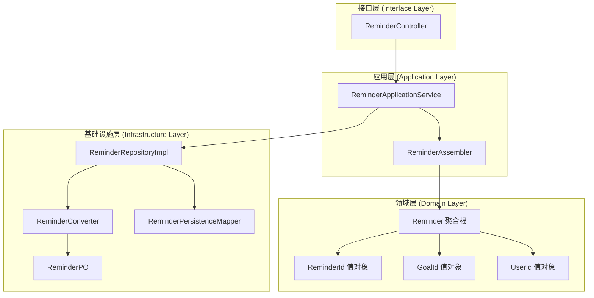
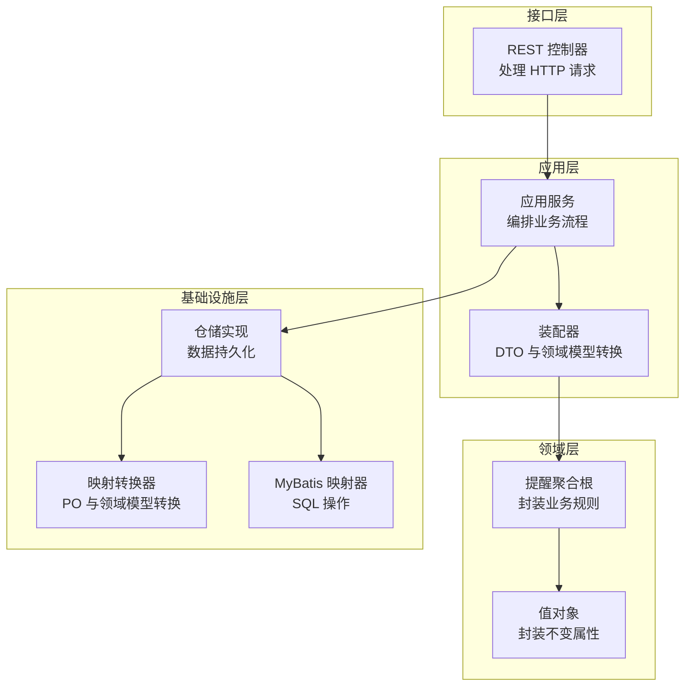
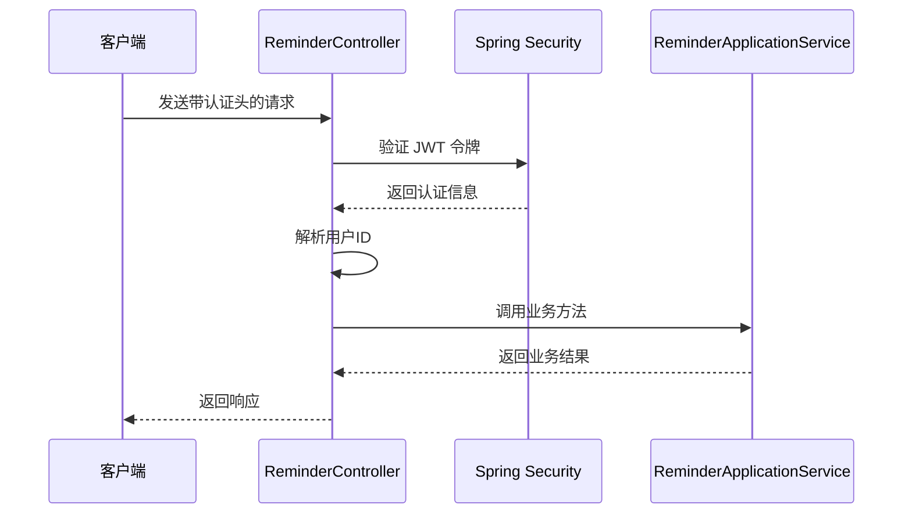
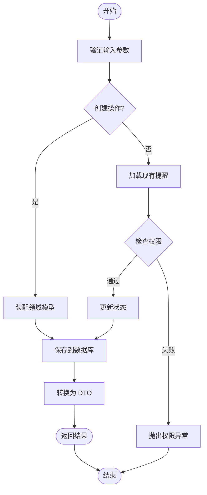
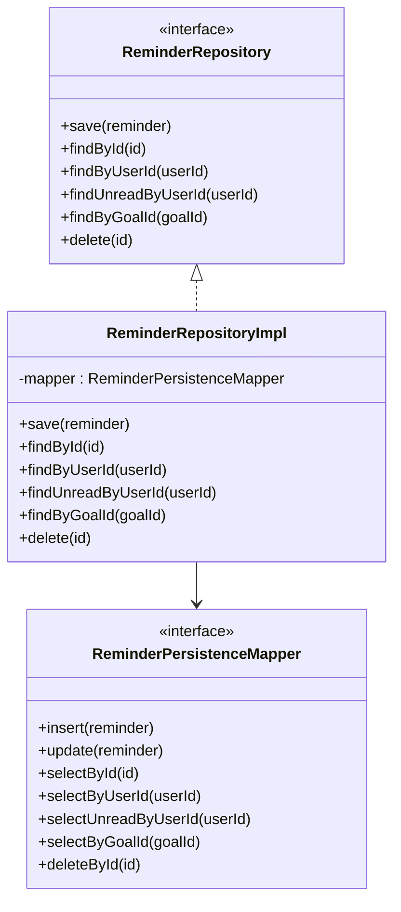
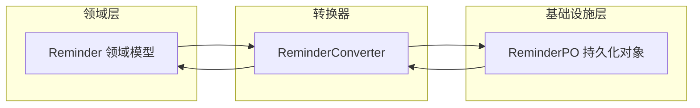
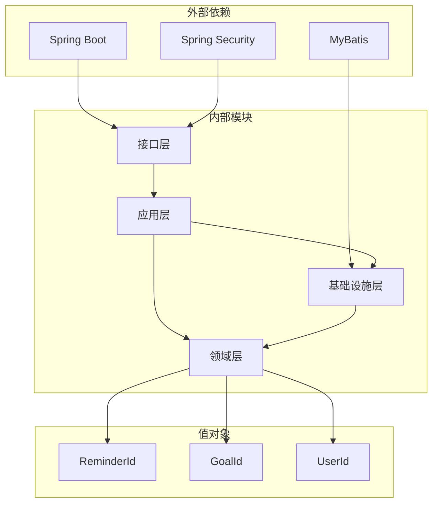

# 提醒系统模块

<cite>
**本文档引用的文件**
- [ReminderController.java](file://src/main/java/com/crazydream/interfaces/reminder/ReminderController.java)
- [ReminderApplicationService.java](file://src/main/java/com/crazydream/application/reminder/service/ReminderApplicationService.java)
- [ReminderAssembler.java](file://src/main/java/com/crazydream/application/reminder/assembler/ReminderAssembler.java)
- [CreateReminderCommand.java](file://src/main/java/com/crazydream/application/reminder/dto/CreateReminderCommand.java)
- [ReminderDTO.java](file://src/main/java/com/crazydream/application/reminder/dto/ReminderDTO.java)
- [Reminder.java](file://src/main/java/com/crazydream/domain/reminder/model/aggregate/Reminder.java)
- [ReminderId.java](file://src/main/java/com/crazydream/domain/reminder/model/valueobject/ReminderId.java)
- [ReminderRepository.java](file://src/main/java/com/crazydream/domain/reminder/repository/ReminderRepository.java)
- [ReminderRepositoryImpl.java](file://src/main/java/com/crazydream/infrastructure/persistence/repository/ReminderRepositoryImpl.java)
- [ReminderConverter.java](file://src/main/java/com/crazydream/infrastructure/persistence/converter/ReminderConverter.java)
- [ReminderPO.java](file://src/main/java/com/crazydream/infrastructure/persistence/po/ReminderPO.java)
- [ReminderPersistenceMapper.java](file://src/main/java/com/crazydream/infrastructure/persistence/mapper/ReminderPersistenceMapper.java)
- [ReminderPersistenceMapper.xml](file://src/main/resources/mapper/ReminderPersistenceMapper.xml)
- [GoalId.java](file://src/main/java/com/crazydream/domain/goal/model/valueobject/GoalId.java)
- [UserId.java](file://src/main/java/com/crazydream/domain/shared/model/UserId.java)
- [README.md](file://README.md)
</cite>

## 目录
1. [引言](#引言)
2. [项目结构](#项目结构)
3. [核心组件](#核心组件)
4. [架构概览](#架构概览)
5. [详细组件分析](#详细组件分析)
6. [依赖关系分析](#依赖关系分析)
7. [性能考虑](#性能考虑)
8. [故障排除指南](#故障排除指南)
9. [结论](#结论)
10. [附录](#附录)

## 引言

提醒系统模块是 CrazyDream 人生计划清单后端服务的重要组成部分，负责管理用户的提醒事项。该模块实现了完整的提醒生命周期管理，包括提醒的创建、查询、标记已读、删除等核心功能。

提醒系统采用领域驱动设计（DDD）和 COLA 四层架构，确保了良好的代码组织和可维护性。系统支持基于目标的提醒管理，能够与目标和子目标建立关联关系，并提供自动触发机制。

## 项目结构

提醒系统模块遵循 Spring Boot 的标准目录结构，采用分层架构设计：

**图表来源**
- [ReminderController.java](file://src/main/java/com/crazydream/interfaces/reminder/ReminderController.java#L16-L114)
- [ReminderApplicationService.java](file://src/main/java/com/crazydream/application/reminder/service/ReminderApplicationService.java#L15-L64)
- [ReminderRepositoryImpl.java](file://src/main/java/com/crazydream/infrastructure/persistence/repository/ReminderRepositoryImpl.java#L18-L68)

**章节来源**
- [ReminderController.java](file://src/main/java/com/crazydream/interfaces/reminder/ReminderController.java#L16-L114)
- [ReminderApplicationService.java](file://src/main/java/com/crazydream/application/reminder/service/ReminderApplicationService.java#L15-L64)
- [ReminderRepositoryImpl.java](file://src/main/java/com/crazydream/infrastructure/persistence/repository/ReminderRepositoryImpl.java#L18-L68)

## 核心组件

### 数据传输对象 (DTO)

提醒系统使用专门的数据传输对象来封装业务数据：

- **CreateReminderCommand**: 创建提醒时使用的命令对象，包含目标ID、标题和提醒时间
- **ReminderDTO**: 提醒的对外传输对象，包含完整的提醒信息和状态字段

### 领域模型

提醒系统的核心领域模型是一个充血模型的聚合根：

- **Reminder**: 提醒聚合根，封装了提醒的所有业务属性和行为
- **ReminderId**: 提醒ID值对象，确保ID的唯一性和有效性
- **GoalId**: 目标ID值对象，用于关联目标
- **UserId**: 用户ID值对象，用于关联用户

### 应用服务

**ReminderApplicationService** 提供了提醒系统的核心业务逻辑：

- 创建提醒：将命令对象转换为领域模型并持久化
- 查询提醒：按用户ID或状态查询提醒列表
- 管理提醒状态：标记已读、删除提醒
- 权限验证：确保用户只能操作自己的提醒

**章节来源**
- [CreateReminderCommand.java](file://src/main/java/com/crazydream/application/reminder/dto/CreateReminderCommand.java#L1-L12)
- [ReminderDTO.java](file://src/main/java/com/crazydream/application/reminder/dto/ReminderDTO.java#L1-L17)
- [Reminder.java](file://src/main/java/com/crazydream/domain/reminder/model/aggregate/Reminder.java#L13-L95)
- [ReminderId.java](file://src/main/java/com/crazydream/domain/reminder/model/valueobject/ReminderId.java#L5-L34)
- [ReminderApplicationService.java](file://src/main/java/com/crazydream/application/reminder/service/ReminderApplicationService.java#L16-L64)

## 架构概览

提醒系统采用分层架构设计，每层都有明确的职责分工：

**图表来源**
- [ReminderController.java](file://src/main/java/com/crazydream/interfaces/reminder/ReminderController.java#L16-L114)
- [ReminderApplicationService.java](file://src/main/java/com/crazydream/application/reminder/service/ReminderApplicationService.java#L15-L64)
- [ReminderRepositoryImpl.java](file://src/main/java/com/crazydream/infrastructure/persistence/repository/ReminderRepositoryImpl.java#L18-L68)

## 详细组件分析

### 控制器层 (Interface Layer)

**ReminderController** 提供了 RESTful API 接口：

#### API 接口定义

| 方法 | 路径 | 功能描述 | 请求体 | 响应体 |
|------|------|----------|--------|--------|
| POST | `/api/v2/reminders` | 创建提醒 | CreateReminderCommand | ReminderDTO |
| GET | `/api/v2/reminders` | 获取用户所有提醒 | 无 | List<ReminderDTO> |
| GET | `/api/v2/reminders/unread` | 获取用户未读提醒 | 无 | List<ReminderDTO> |
| PATCH | `/api/v2/reminders/{id}/read` | 标记提醒为已读 | 无 | ReminderDTO |
| DELETE | `/api/v2/reminders/{id}` | 删除提醒 | 无 | Boolean |

#### 认证与授权机制

控制器使用 Spring Security 进行认证，支持多种认证方式：

**图表来源**
- [ReminderController.java](file://src/main/java/com/crazydream/interfaces/reminder/ReminderController.java#L83-L112)

**章节来源**
- [ReminderController.java](file://src/main/java/com/crazydream/interfaces/reminder/ReminderController.java#L16-L114)

### 应用层 (Application Layer)

**ReminderApplicationService** 实现了提醒系统的核心业务逻辑：

#### 业务流程

**图表来源**
- [ReminderApplicationService.java](file://src/main/java/com/crazydream/application/reminder/service/ReminderApplicationService.java#L21-L62)

#### 关键业务方法

1. **创建提醒** (`createReminder`)
   - 参数：CreateReminderCommand + 当前用户ID
   - 流程：命令对象 → 领域模型 → 持久化 → DTO 转换

2. **查询提醒** (`getUserReminders`, `getUnreadReminders`)
   - 参数：用户ID
   - 流程：查询 → 转换为 DTO 列表

3. **管理提醒** (`markAsRead`, `deleteReminder`)
   - 参数：提醒ID + 用户ID
   - 流程：权限验证 → 业务操作 → 持久化

**章节来源**
- [ReminderApplicationService.java](file://src/main/java/com/crazydream/application/reminder/service/ReminderApplicationService.java#L21-L62)

### 领域层 (Domain Layer)

**Reminder 聚合根** 封装了提醒的所有业务规则：

#### 业务属性

| 属性名 | 类型 | 描述 | 必填 |
|--------|------|------|------|
| id | ReminderId | 提醒唯一标识 | 否 |
| userId | UserId | 关联用户ID | 是 |
| goalId | GoalId | 关联目标ID | 是 |
| title | String | 提醒标题 | 是 |
| remindTime | LocalDateTime | 提醒时间 | 是 |
| read | Boolean | 是否已读 | 是 |
| createTime | LocalDateTime | 创建时间 | 否 |
| updateTime | LocalDateTime | 更新时间 | 否 |

#### 业务行为

1. **创建提醒** (`create`)
   - 初始化默认状态为未读
   - 设置当前时间为创建和更新时间

2. **标记已读** (`markAsRead`)
   - 设置 read 为 true
   - 更新 updateTime 为当前时间

3. **检查过期** (`isOverdue`)
   - 比较当前时间与提醒时间
   - 如果当前时间晚于提醒时间则返回 true

4. **权限验证** (`belongsTo`)
   - 验证提醒是否属于指定用户

**章节来源**
- [Reminder.java](file://src/main/java/com/crazydream/domain/reminder/model/aggregate/Reminder.java#L13-L95)

### 基础设施层 (Infrastructure Layer)

**ReminderRepositoryImpl** 实现了数据持久化逻辑：

#### 数据访问模式

**图表来源**
- [ReminderRepository.java](file://src/main/java/com/crazydream/domain/reminder/repository/ReminderRepository.java#L11-L18)
- [ReminderRepositoryImpl.java](file://src/main/java/com/crazydream/infrastructure/persistence/repository/ReminderRepositoryImpl.java#L18-L68)
- [ReminderPersistenceMapper.java](file://src/main/java/com/crazydream/infrastructure/persistence/mapper/ReminderPersistenceMapper.java#L8-L16)

#### 数据转换层

**ReminderConverter** 负责领域模型与持久化对象之间的转换：

**图表来源**
- [ReminderConverter.java](file://src/main/java/com/crazydream/infrastructure/persistence/converter/ReminderConverter.java#L9-L42)

**章节来源**
- [ReminderRepositoryImpl.java](file://src/main/java/com/crazydream/infrastructure/persistence/repository/ReminderRepositoryImpl.java#L18-L68)
- [ReminderConverter.java](file://src/main/java/com/crazydream/infrastructure/persistence/converter/ReminderConverter.java#L9-L42)

## 依赖关系分析

提醒系统模块的依赖关系清晰，层次分明：

**图表来源**
- [ReminderController.java](file://src/main/java/com/crazydream/interfaces/reminder/ReminderController.java#L16-L114)
- [ReminderApplicationService.java](file://src/main/java/com/crazydream/application/reminder/service/ReminderApplicationService.java#L15-L64)
- [ReminderRepositoryImpl.java](file://src/main/java/com/crazydream/infrastructure/persistence/repository/ReminderRepositoryImpl.java#L18-L68)

### 核心依赖关系

1. **接口层依赖应用层**：控制器只依赖应用服务接口
2. **应用层依赖领域层**：应用服务编排领域模型
3. **基础设施层依赖映射器**：数据访问通过 MyBatis 映射器
4. **领域层依赖值对象**：确保数据完整性

**章节来源**
- [ReminderController.java](file://src/main/java/com/crazydream/interfaces/reminder/ReminderController.java#L16-L114)
- [ReminderApplicationService.java](file://src/main/java/com/crazydream/application/reminder/service/ReminderApplicationService.java#L15-L64)
- [ReminderRepositoryImpl.java](file://src/main/java/com/crazydream/infrastructure/persistence/repository/ReminderRepositoryImpl.java#L18-L68)

## 性能考虑

### 数据库优化

1. **索引策略**
   - 在 `user_id` 和 `goal_id` 字段上建立索引
   - 在 `remind_time` 字段上建立索引以支持时间查询

2. **查询优化**
   - 使用分页查询避免大量数据一次性加载
   - 优化 SQL 查询语句，避免 N+1 查询问题

3. **缓存策略**
   - 对频繁查询的提醒列表进行缓存
   - 使用 Redis 缓存用户活跃的提醒信息

### 并发控制

1. **乐观锁机制**
   - 在更新操作中使用版本号防止并发冲突
   - 提供重试机制处理并发更新失败

2. **事务管理**
   - 使用声明式事务确保数据一致性
   - 合理划分事务边界，避免长时间持有事务

### 异步处理

虽然当前实现主要是同步处理，但可以考虑以下异步优化：

1. **异步通知**
   - 使用消息队列处理提醒通知
   - 支持邮件、短信等多种通知方式

2. **批量操作**
   - 提供批量删除和批量标记已读功能
   - 减少数据库连接开销

## 故障排除指南

### 常见错误及解决方案

#### 认证相关错误

| 错误类型 | 错误码 | 可能原因 | 解决方案 |
|----------|--------|----------|----------|
| 未认证 | 401 | JWT 令牌无效或过期 | 重新登录获取新令牌 |
| 权限不足 | 403 | 用户尝试操作他人数据 | 检查用户权限和数据归属 |
| 参数错误 | 400 | 请求参数格式不正确 | 验证请求体格式和必填字段 |

#### 业务逻辑错误

| 错误类型 | 错误码 | 可能原因 | 解决方案 |
|----------|--------|----------|----------|
| 数据不存在 | 404 | 提醒ID不存在 | 检查提醒是否存在且未被删除 |
| 业务规则违反 | 400 | 违反业务约束 | 验证提醒时间、目标关联等规则 |
| 数据库异常 | 500 | 数据库连接或事务异常 | 检查数据库状态和连接池配置 |

#### 日志记录

控制器使用 SLF4J 进行日志记录，支持以下级别的调试信息：

1. **认证信息**：记录用户ID解析过程
2. **业务操作**：记录关键业务流程
3. **异常处理**：记录错误堆栈信息

**章节来源**
- [ReminderController.java](file://src/main/java/com/crazydream/interfaces/reminder/ReminderController.java#L20-L114)

## 结论

提醒系统模块展现了良好的软件架构设计，采用了 DDD 和 COLA 四层架构原则。系统具有以下特点：

1. **清晰的分层架构**：每层职责明确，便于维护和扩展
2. **完整的业务逻辑**：涵盖了提醒的全生命周期管理
3. **强类型设计**：使用值对象确保数据完整性
4. **良好的错误处理**：提供完善的异常处理和日志记录
5. **可扩展性**：支持异步处理和缓存等性能优化

该模块为 CrazyDream 系统提供了可靠的提醒功能基础，支持用户有效管理目标和子目标的截止日期提醒。

## 附录

### API 接口详细说明

#### 创建提醒
- **URL**: `POST /api/v2/reminders`
- **请求体**: CreateReminderCommand
- **响应**: ReminderDTO
- **认证**: 需要 JWT 令牌

#### 获取用户提醒
- **URL**: `GET /api/v2/reminders`
- **响应**: List<ReminderDTO>
- **认证**: 需要 JWT 令牌

#### 获取未读提醒
- **URL**: `GET /api/v2/reminders/unread`
- **响应**: List<ReminderDTO>
- **认证**: 需要 JWT 令牌

#### 标记已读
- **URL**: `PATCH /api/v2/reminders/{id}/read`
- **路径参数**: id (提醒ID)
- **响应**: ReminderDTO
- **认证**: 需要 JWT 令牌

#### 删除提醒
- **URL**: `DELETE /api/v2/reminders/{id}`
- **路径参数**: id (提醒ID)
- **响应**: Boolean
- **认证**: 需要 JWT 令牌

### 数据模型设计

#### Reminder 表结构

| 字段名 | 类型 | 描述 | 约束 |
|--------|------|------|------|
| id | BIGINT | 主键 | PRIMARY KEY |
| user_id | BIGINT | 用户ID | NOT NULL |
| goal_id | BIGINT | 目标ID | NOT NULL |
| title | VARCHAR(255) | 提醒标题 | NOT NULL |
| remind_time | DATETIME | 提醒时间 | NOT NULL |
| is_read | BOOLEAN | 是否已读 | DEFAULT FALSE |
| create_time | DATETIME | 创建时间 | NOT NULL |
| update_time | DATETIME | 更新时间 | NOT NULL |

### 扩展开发建议

1. **添加重复规则支持**
   - 实现周期性提醒（每日、每周、每月）
   - 支持自定义重复间隔

2. **增强通知机制**
   - 集成邮件通知服务
   - 支持推送通知和短信提醒
   - 实现通知历史记录

3. **优化性能**
   - 添加提醒状态缓存
   - 实现批量操作接口
   - 优化数据库查询性能

4. **增强功能**
   - 添加提醒优先级
   - 支持提醒分类管理
   - 实现提醒模板功能