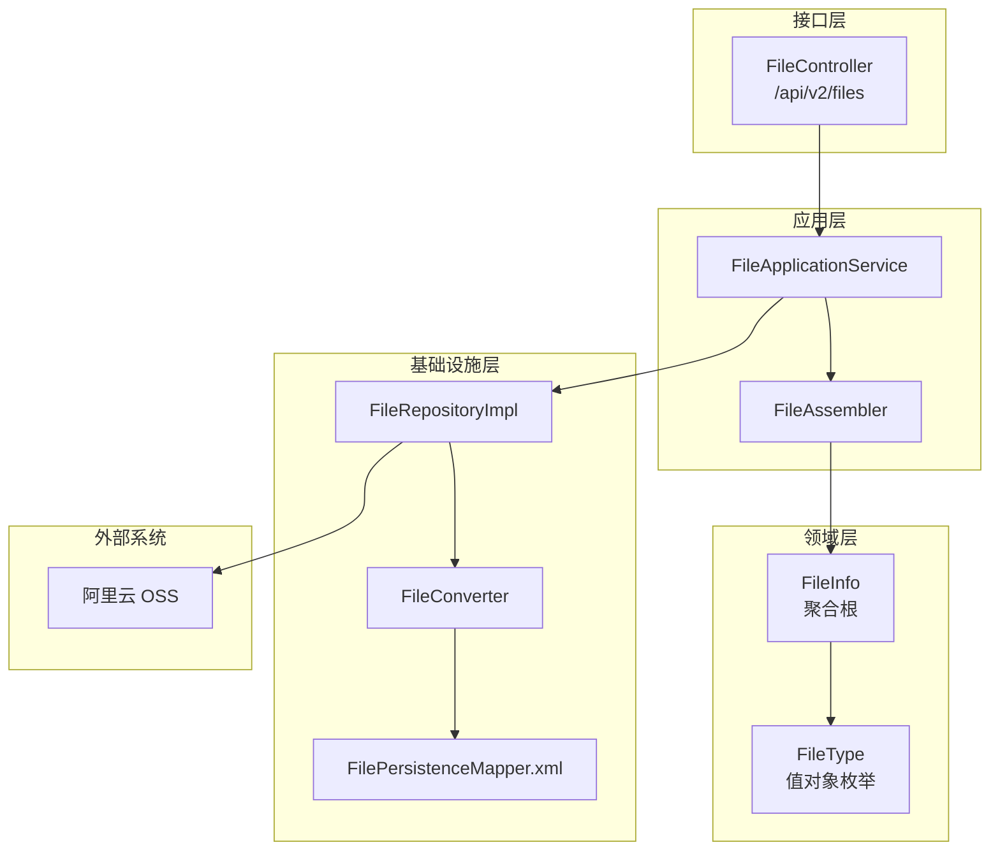
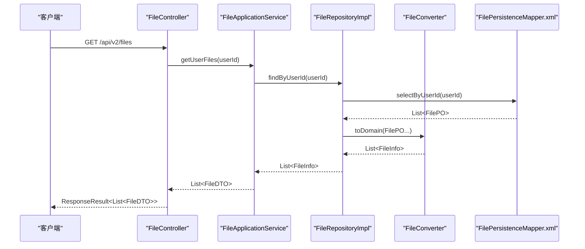
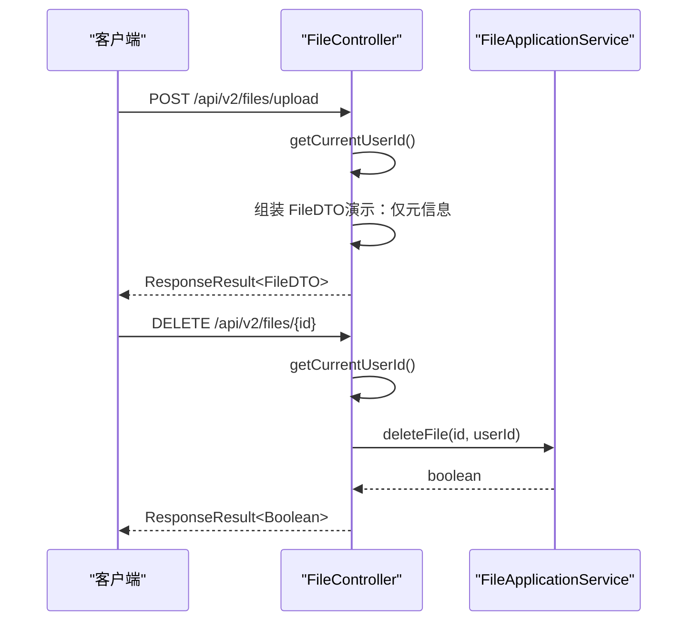
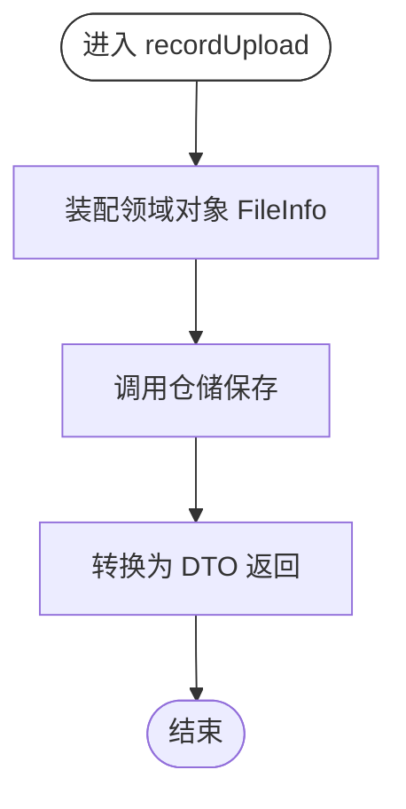
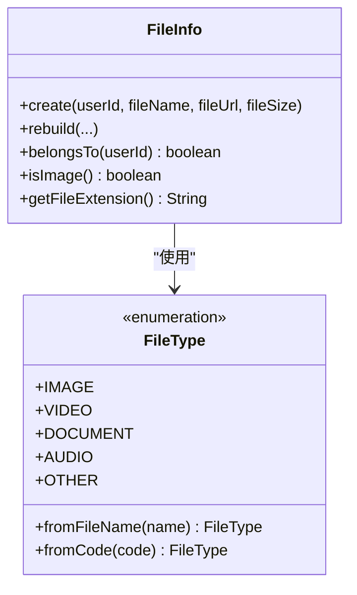
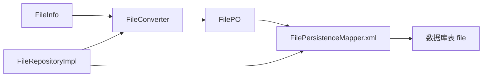
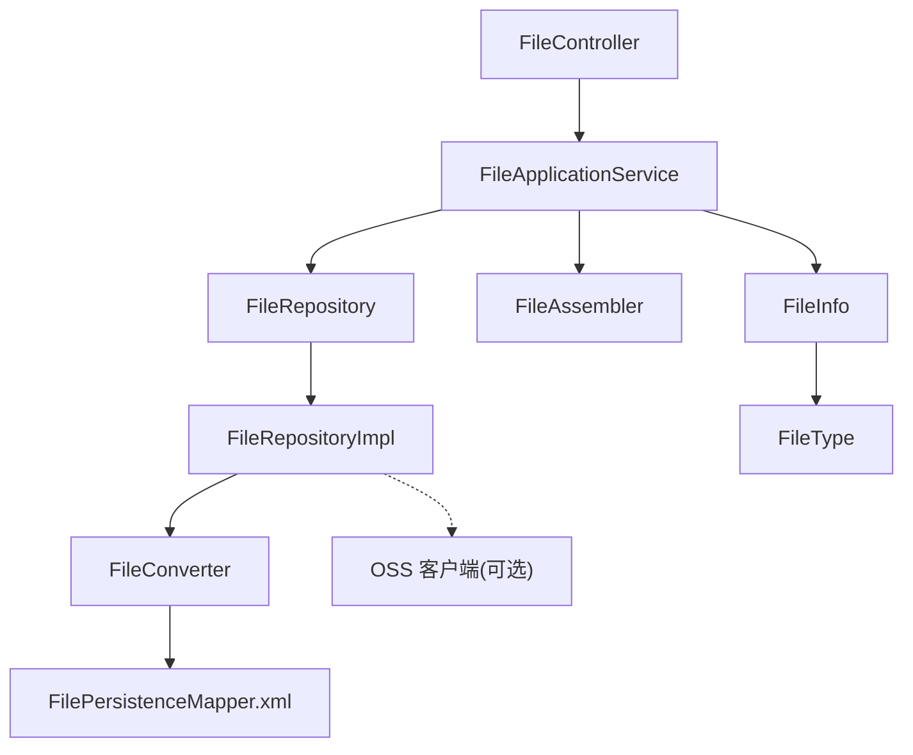

# 文件管理模块

<cite>
**本文引用的文件**
- [src/main/java/com/crazydream/interfaces/file/FileController.java](file://src/main/java/com/crazydream/interfaces/file/FileController.java)
- [src/main/java/com/crazydream/application/file/service/FileApplicationService.java](file://src/main/java/com/crazydream/application/file/service/FileApplicationService.java)
- [src/main/java/com/crazydream/application/file/assembler/FileAssembler.java](file://src/main/java/com/crazydream/application/file/assembler/FileAssembler.java)
- [src/main/java/com/crazydream/application/file/dto/FileDTO.java](file://src/main/java/com/crazydream/application/file/dto/FileDTO.java)
- [src/main/java/com/crazydream/domain/file/model/aggregate/FileInfo.java](file://src/main/java/com/crazydream/domain/file/model/aggregate/FileInfo.java)
- [src/main/java/com/crazydream/domain/file/model/valueobject/FileType.java](file://src/main/java/com/crazydream/domain/file/model/valueobject/FileType.java)
- [src/main/java/com/crazydream/domain/file/repository/FileRepository.java](file://src/main/java/com/crazydream/domain/file/repository/FileRepository.java)
- [src/main/java/com/crazydream/infrastructure/persistence/repository/FileRepositoryImpl.java](file://src/main/java/com/crazydream/infrastructure/persistence/repository/FileRepositoryImpl.java)
- [src/main/java/com/crazydream/infrastructure/persistence/converter/FileConverter.java](file://src/main/java/com/crazydream/infrastructure/persistence/converter/FileConverter.java)
- [src/main/resources/mapper/FilePersistenceMapper.xml](file://src/main/resources/mapper/FilePersistenceMapper.xml)
- [src/main/java/com/crazydream/config/OssConfig.java](file://src/main/java/com/crazydream/config/OssConfig.java)
- [src/main/resources/application.yml](file://src/main/resources/application.yml)
</cite>

## 目录
1. [简介](#简介)
2. [项目结构](#项目结构)
3. [核心组件](#核心组件)
4. [架构总览](#架构总览)
5. [详细组件分析](#详细组件分析)
6. [依赖关系分析](#依赖关系分析)
7. [性能与容量规划](#性能与容量规划)
8. [故障排查指南](#故障排查指南)
9. [结论](#结论)
10. [附录：API 接口文档](#附录api-接口文档)

## 简介
本文件管理模块采用分层架构与领域驱动设计（DDD），围绕“文件”这一聚合根构建了从接口层到应用层、领域层、基础设施层的完整链路。当前代码实现了文件元数据的记录与查询能力，并预留了与阿里云 OSS 的集成点。模块支持文件类型识别、基础权限校验、文件列表与详情查询、以及基于用户维度的数据隔离。

说明：
- 上传流程在现有代码中为演示形态：返回文件元信息但不实际上传至 OSS；OSS 上传逻辑标注由“FileService”负责（当前仓库未发现该类，见“遗留问题”）。
- 下载与删除接口在当前版本未实现，后续可基于 OSS URL 与鉴权策略扩展。

## 项目结构
文件管理模块位于应用的文件域下，按职责划分为：
- 接口层：对外暴露 REST 接口，负责参数接收、认证上下文解析与响应封装
- 应用层：编排领域对象与仓储交互，完成业务流程编排
- 领域层：以充血模型表达文件聚合根及值对象，内聚业务规则
- 基础设施层：持久化映射、转换器与仓储实现，对接数据库

图表来源
- [src/main/java/com/crazydream/interfaces/file/FileController.java](file://src/main/java/com/crazydream/interfaces/file/FileController.java#L17-L108)
- [src/main/java/com/crazydream/application/file/service/FileApplicationService.java](file://src/main/java/com/crazydream/application/file/service/FileApplicationService.java#L16-L51)
- [src/main/java/com/crazydream/application/file/assembler/FileAssembler.java](file://src/main/java/com/crazydream/application/file/assembler/FileAssembler.java#L10-L38)
- [src/main/java/com/crazydream/domain/file/model/aggregate/FileInfo.java](file://src/main/java/com/crazydream/domain/file/model/aggregate/FileInfo.java#L12-L90)
- [src/main/java/com/crazydream/domain/file/model/valueobject/FileType.java](file://src/main/java/com/crazydream/domain/file/model/valueobject/FileType.java#L3-L60)
- [src/main/java/com/crazydream/infrastructure/persistence/repository/FileRepositoryImpl.java](file://src/main/java/com/crazydream/infrastructure/persistence/repository/FileRepositoryImpl.java#L17-L48)
- [src/main/java/com/crazydream/infrastructure/persistence/converter/FileConverter.java](file://src/main/java/com/crazydream/infrastructure/persistence/converter/FileConverter.java#L8-L39)
- [src/main/resources/mapper/FilePersistenceMapper.xml](file://src/main/resources/mapper/FilePersistenceMapper.xml#L5-L30)
- [src/main/java/com/crazydream/config/OssConfig.java](file://src/main/java/com/crazydream/config/OssConfig.java#L16-L102)

章节来源
- [src/main/java/com/crazydream/interfaces/file/FileController.java](file://src/main/java/com/crazydream/interfaces/file/FileController.java#L17-L108)
- [src/main/java/com/crazydream/application/file/service/FileApplicationService.java](file://src/main/java/com/crazydream/application/file/service/FileApplicationService.java#L16-L51)
- [src/main/java/com/crazydream/domain/file/model/aggregate/FileInfo.java](file://src/main/java/com/crazydream/domain/file/model/aggregate/FileInfo.java#L12-L90)
- [src/main/java/com/crazydream/domain/file/model/valueobject/FileType.java](file://src/main/java/com/crazydream/domain/file/model/valueobject/FileType.java#L3-L60)
- [src/main/java/com/crazydream/infrastructure/persistence/repository/FileRepositoryImpl.java](file://src/main/java/com/crazydream/infrastructure/persistence/repository/FileRepositoryImpl.java#L17-L48)
- [src/main/java/com/crazydream/infrastructure/persistence/converter/FileConverter.java](file://src/main/java/com/crazydream/infrastructure/persistence/converter/FileConverter.java#L8-L39)
- [src/main/resources/mapper/FilePersistenceMapper.xml](file://src/main/resources/mapper/FilePersistenceMapper.xml#L5-L30)
- [src/main/java/com/crazydream/config/OssConfig.java](file://src/main/java/com/crazydream/config/OssConfig.java#L16-L102)

## 核心组件
- 接口层控制器：提供文件列表、详情、删除与上传接口，解析当前用户上下文并进行简单错误处理
- 应用服务：编排领域对象保存、查询与删除，执行基础权限校验
- 领域模型：FileInfo 聚合根承载文件元信息与业务行为；FileType 值对象负责类型识别
- 仓储接口与实现：抽象持久化契约，实现类负责 PO/DTO 转换与 SQL 映射
- OSS 配置：提供 OSS 客户端 Bean 与配置项读取

章节来源
- [src/main/java/com/crazydream/interfaces/file/FileController.java](file://src/main/java/com/crazydream/interfaces/file/FileController.java#L17-L108)
- [src/main/java/com/crazydream/application/file/service/FileApplicationService.java](file://src/main/java/com/crazydream/application/file/service/FileApplicationService.java#L16-L51)
- [src/main/java/com/crazydream/domain/file/model/aggregate/FileInfo.java](file://src/main/java/com/crazydream/domain/file/model/aggregate/FileInfo.java#L12-L90)
- [src/main/java/com/crazydream/domain/file/model/valueobject/FileType.java](file://src/main/java/com/crazydream/domain/file/model/valueobject/FileType.java#L3-L60)
- [src/main/java/com/crazydream/domain/file/repository/FileRepository.java](file://src/main/java/com/crazydream/domain/file/repository/FileRepository.java#L10-L15)
- [src/main/java/com/crazydream/infrastructure/persistence/repository/FileRepositoryImpl.java](file://src/main/java/com/crazydream/infrastructure/persistence/repository/FileRepositoryImpl.java#L17-L48)
- [src/main/java/com/crazydream/config/OssConfig.java](file://src/main/java/com/crazydream/config/OssConfig.java#L16-L102)

## 架构总览
文件管理模块遵循分层与关注点分离原则：
- 接口层负责请求接入与响应封装
- 应用层编排业务流程，调用仓储与装配器
- 领域层维护业务不变量与规则
- 基础设施层负责持久化与外部系统集成（OSS）

图表来源
- [src/main/java/com/crazydream/interfaces/file/FileController.java](file://src/main/java/com/crazydream/interfaces/file/FileController.java#L32-L41)
- [src/main/java/com/crazydream/application/file/service/FileApplicationService.java](file://src/main/java/com/crazydream/application/file/service/FileApplicationService.java#L30-L33)
- [src/main/java/com/crazydream/infrastructure/persistence/repository/FileRepositoryImpl.java](file://src/main/java/com/crazydream/infrastructure/persistence/repository/FileRepositoryImpl.java#L37-L41)
- [src/main/java/com/crazydream/infrastructure/persistence/converter/FileConverter.java](file://src/main/java/com/crazydream/infrastructure/persistence/converter/FileConverter.java#L10-L22)
- [src/main/resources/mapper/FilePersistenceMapper.xml](file://src/main/resources/mapper/FilePersistenceMapper.xml#L19-L24)

## 详细组件分析

### 接口层：FileController
- 负责：
  - 解析当前用户 ID（优先从认证上下文提取，否则回退默认值）
  - 提供文件列表、详情、删除接口
  - 提供上传接口（当前为演示实现：仅返回文件元信息，不实际上传至 OSS）
- 认证与权限：
  - 通过 Spring Security 上下文解析用户身份
  - 删除接口对资源归属进行校验（文件所属用户必须与当前用户一致）

图表来源
- [src/main/java/com/crazydream/interfaces/file/FileController.java](file://src/main/java/com/crazydream/interfaces/file/FileController.java#L64-L77)
- [src/main/java/com/crazydream/interfaces/file/FileController.java](file://src/main/java/com/crazydream/interfaces/file/FileController.java#L53-L62)
- [src/main/java/com/crazydream/interfaces/file/FileController.java](file://src/main/java/com/crazydream/interfaces/file/FileController.java#L79-L108)
- [src/main/java/com/crazydream/application/file/service/FileApplicationService.java](file://src/main/java/com/crazydream/application/file/service/FileApplicationService.java#L41-L51)

章节来源
- [src/main/java/com/crazydream/interfaces/file/FileController.java](file://src/main/java/com/crazydream/interfaces/file/FileController.java#L17-L108)

### 应用层：FileApplicationService
- 负责：
  - 记录上传：将文件元信息装配为领域对象并持久化
  - 查询：按用户 ID 查询文件列表，按 ID 查询单个文件
  - 删除：先校验归属再删除
- 事务性：记录上传与删除操作均声明式开启事务

图表来源
- [src/main/java/com/crazydream/application/file/service/FileApplicationService.java](file://src/main/java/com/crazydream/application/file/service/FileApplicationService.java#L23-L28)
- [src/main/java/com/crazydream/application/file/assembler/FileAssembler.java](file://src/main/java/com/crazydream/application/file/assembler/FileAssembler.java#L12-L14)
- [src/main/java/com/crazydream/domain/file/model/aggregate/FileInfo.java](file://src/main/java/com/crazydream/domain/file/model/aggregate/FileInfo.java#L23-L32)

章节来源
- [src/main/java/com/crazydream/application/file/service/FileApplicationService.java](file://src/main/java/com/crazydream/application/file/service/FileApplicationService.java#L16-L51)

### 领域层：FileInfo 与 FileType
- FileInfo 聚合根：
  - 负责文件元信息与业务行为（归属校验、类型判断、扩展名解析等）
  - 工厂方法与重建方法保证对象一致性
- FileType 值对象：
  - 依据文件扩展名进行分类（图片、视频、文档、音频、其他）
  - 支持从代码反查类型

图表来源
- [src/main/java/com/crazydream/domain/file/model/aggregate/FileInfo.java](file://src/main/java/com/crazydream/domain/file/model/aggregate/FileInfo.java#L12-L90)
- [src/main/java/com/crazydream/domain/file/model/valueobject/FileType.java](file://src/main/java/com/crazydream/domain/file/model/valueobject/FileType.java#L3-L60)

章节来源
- [src/main/java/com/crazydream/domain/file/model/aggregate/FileInfo.java](file://src/main/java/com/crazydream/domain/file/model/aggregate/FileInfo.java#L12-L90)
- [src/main/java/com/crazydream/domain/file/model/valueobject/FileType.java](file://src/main/java/com/crazydream/domain/file/model/valueobject/FileType.java#L3-L60)

### 基础设施层：仓储与持久化
- 仓储接口：定义保存、查询、删除等契约
- 仓储实现：负责 PO/DTO 转换、SQL 执行与结果映射
- 转换器：在领域对象与持久化对象之间进行双向转换
- 映射文件：定义插入、查询、删除 SQL

图表来源
- [src/main/java/com/crazydream/domain/file/repository/FileRepository.java](file://src/main/java/com/crazydream/domain/file/repository/FileRepository.java#L10-L15)
- [src/main/java/com/crazydream/infrastructure/persistence/repository/FileRepositoryImpl.java](file://src/main/java/com/crazydream/infrastructure/persistence/repository/FileRepositoryImpl.java#L17-L48)
- [src/main/java/com/crazydream/infrastructure/persistence/converter/FileConverter.java](file://src/main/java/com/crazydream/infrastructure/persistence/converter/FileConverter.java#L8-L39)
- [src/main/resources/mapper/FilePersistenceMapper.xml](file://src/main/resources/mapper/FilePersistenceMapper.xml#L5-L30)

章节来源
- [src/main/java/com/crazydream/domain/file/repository/FileRepository.java](file://src/main/java/com/crazydream/domain/file/repository/FileRepository.java#L10-L15)
- [src/main/java/com/crazydream/infrastructure/persistence/repository/FileRepositoryImpl.java](file://src/main/java/com/crazydream/infrastructure/persistence/repository/FileRepositoryImpl.java#L17-L48)
- [src/main/java/com/crazydream/infrastructure/persistence/converter/FileConverter.java](file://src/main/java/com/crazydream/infrastructure/persistence/converter/FileConverter.java#L8-L39)
- [src/main/resources/mapper/FilePersistenceMapper.xml](file://src/main/resources/mapper/FilePersistenceMapper.xml#L5-L30)

### 阿里云 OSS 集成
- 配置类提供 OSS 客户端 Bean 与配置项读取（端点、AK、Bucket、自定义域名）
- 当前上传接口为演示实现，未实际调用 OSS；可在应用层或服务层补充 OSS 上传逻辑并注入 OSS 客户端

章节来源
- [src/main/java/com/crazydream/config/OssConfig.java](file://src/main/java/com/crazydream/config/OssConfig.java#L16-L102)
- [src/main/resources/application.yml](file://src/main/resources/application.yml#L46-L56)

## 依赖关系分析
- 控制器依赖应用服务
- 应用服务依赖仓储接口与装配器
- 仓储实现依赖转换器与映射文件
- 领域模型依赖值对象
- OSS 配置为可选外部依赖

图表来源
- [src/main/java/com/crazydream/interfaces/file/FileController.java](file://src/main/java/com/crazydream/interfaces/file/FileController.java#L17-L108)
- [src/main/java/com/crazydream/application/file/service/FileApplicationService.java](file://src/main/java/com/crazydream/application/file/service/FileApplicationService.java#L16-L51)
- [src/main/java/com/crazydream/domain/file/model/aggregate/FileInfo.java](file://src/main/java/com/crazydream/domain/file/model/aggregate/FileInfo.java#L12-L90)
- [src/main/java/com/crazydream/domain/file/model/valueobject/FileType.java](file://src/main/java/com/crazydream/domain/file/model/valueobject/FileType.java#L3-L60)
- [src/main/java/com/crazydream/infrastructure/persistence/repository/FileRepositoryImpl.java](file://src/main/java/com/crazydream/infrastructure/persistence/repository/FileRepositoryImpl.java#L17-L48)
- [src/main/java/com/crazydream/infrastructure/persistence/converter/FileConverter.java](file://src/main/java/com/crazydream/infrastructure/persistence/converter/FileConverter.java#L8-L39)
- [src/main/resources/mapper/FilePersistenceMapper.xml](file://src/main/resources/mapper/FilePersistenceMapper.xml#L5-L30)
- [src/main/java/com/crazydream/config/OssConfig.java](file://src/main/java/com/crazydream/config/OssConfig.java#L16-L102)

## 性能与容量规划
- 文件大小限制：Spring Servlet 默认最大 10MB（请求与单文件）
- 数据库写入：单条文件记录写入，插入语句简单，性能瓶颈通常不在数据库层
- 类型识别：基于扩展名判断，时间复杂度 O(1)，开销极低
- 并发与事务：应用层对关键操作声明式事务，避免脏写

章节来源
- [src/main/resources/application.yml](file://src/main/resources/application.yml#L19-L24)
- [src/main/java/com/crazydream/application/file/service/FileApplicationService.java](file://src/main/java/com/crazydream/application/file/service/FileApplicationService.java#L23-L28)

## 故障排查指南
- 未登录或匿名访问
  - 表现：使用默认用户 ID 回退
  - 处理：确保前端携带有效认证头；生产环境应启用安全认证
- 权限不足
  - 表现：删除文件时报无权限
  - 处理：确认当前用户与文件所属用户一致
- 文件不存在
  - 表现：按 ID 查询抛出异常
  - 处理：检查文件 ID 或确认文件是否被删除
- OSS 上传未生效
  - 表现：上传接口仅返回元信息
  - 处理：补充应用层/服务层的 OSS 上传逻辑并注入 OSS 客户端

章节来源
- [src/main/java/com/crazydream/interfaces/file/FileController.java](file://src/main/java/com/crazydream/interfaces/file/FileController.java#L79-L108)
- [src/main/java/com/crazydream/application/file/service/FileApplicationService.java](file://src/main/java/com/crazydream/application/file/service/FileApplicationService.java#L43-L48)
- [src/main/java/com/crazydream/config/OssConfig.java](file://src/main/java/com/crazydream/config/OssConfig.java#L54-L57)

## 结论
当前文件管理模块已完成文件元数据的记录与查询能力，并具备良好的扩展性以接入 OSS。上传流程可按需扩展为真实上传，同时结合类型识别与权限校验完善安全策略。建议后续补齐下载与删除接口，并在生产环境启用安全认证与合理的文件大小限制。

## 附录：API 接口文档

- 基础路径
  - /api/v2/files

- 获取当前用户的所有文件
  - 方法：GET
  - 路径：/api/v2/files
  - 认证：需要
  - 成功响应：List<FileDTO>
  - 错误码：500

- 获取指定文件详情
  - 方法：GET
  - 路径：/api/v2/files/{id}
  - 认证：需要
  - 成功响应：FileDTO
  - 错误码：404

- 删除文件
  - 方法：DELETE
  - 路径：/api/v2/files/{id}
  - 认证：需要
  - 成功响应：Boolean
  - 错误码：500（含无权限场景）

- 上传文件（演示）
  - 方法：POST
  - 路径：/api/v2/files/upload
  - 参数：multipart/form-data，键名为 file
  - 认证：需要
  - 成功响应：FileDTO（仅包含文件名、大小与示例 URL）
  - 说明：当前为演示实现，不实际上传至 OSS

- 文件数据模型
  - FileDTO 字段：id、userId、fileName、fileUrl、fileType、fileTypeDescription、fileSize、uploadTime
  - FileInfo 字段：id、userId、fileName、fileUrl、fileType、fileSize、uploadTime
  - FileType 取值：image、video、document、audio、other

- 阿里云 OSS 配置项
  - endpoint：OSS 服务端点
  - access-key-id：访问密钥 ID
  - access-key-secret：访问密钥密钥
  - bucket-name：存储桶名称
  - domain：自定义域名

- 安全与权限
  - 用户维度隔离：按 userId 查询与删除
  - 归属校验：删除前校验文件所属用户
  - 认证回退：未登录时使用默认用户 ID（仅测试环境）

- 缓存策略
  - 当前未实现缓存层，建议在查询接口或热点数据上引入缓存（如 Redis）以降低数据库压力

章节来源
- [src/main/java/com/crazydream/interfaces/file/FileController.java](file://src/main/java/com/crazydream/interfaces/file/FileController.java#L32-L77)
- [src/main/java/com/crazydream/application/file/dto/FileDTO.java](file://src/main/java/com/crazydream/application/file/dto/FileDTO.java#L7-L16)
- [src/main/java/com/crazydream/domain/file/model/aggregate/FileInfo.java](file://src/main/java/com/crazydream/domain/file/model/aggregate/FileInfo.java#L12-L72)
- [src/main/java/com/crazydream/domain/file/model/valueobject/FileType.java](file://src/main/java/com/crazydream/domain/file/model/valueobject/FileType.java#L3-L60)
- [src/main/resources/application.yml](file://src/main/resources/application.yml#L46-L75)