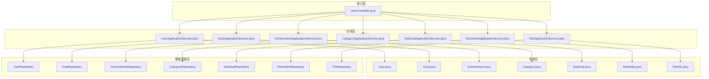
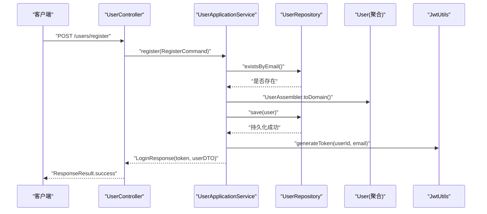
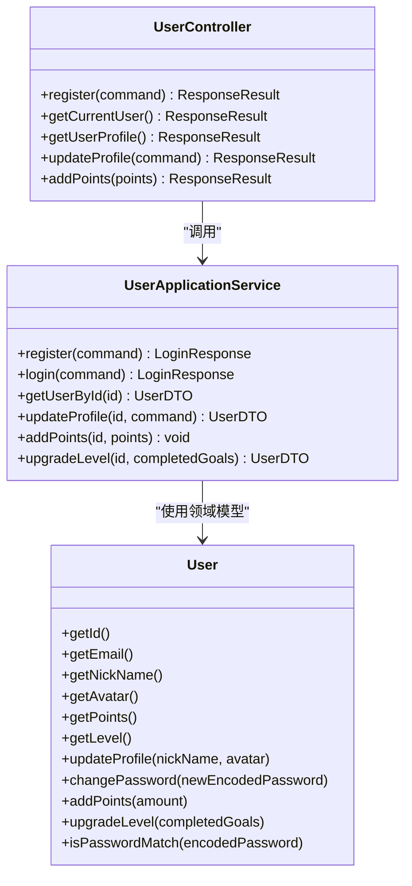
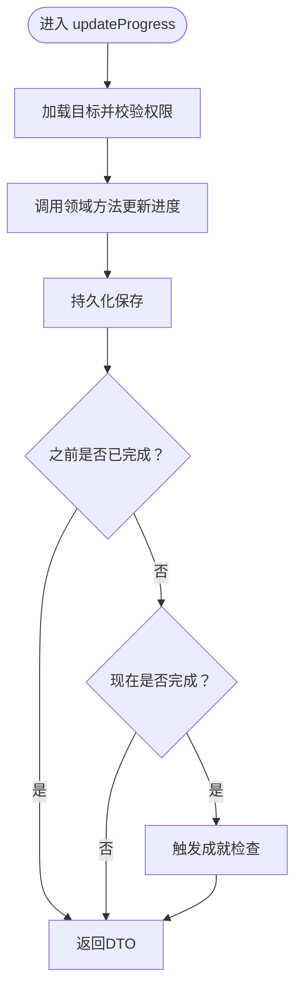
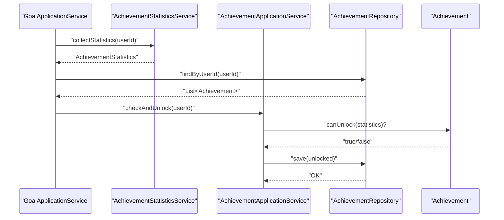
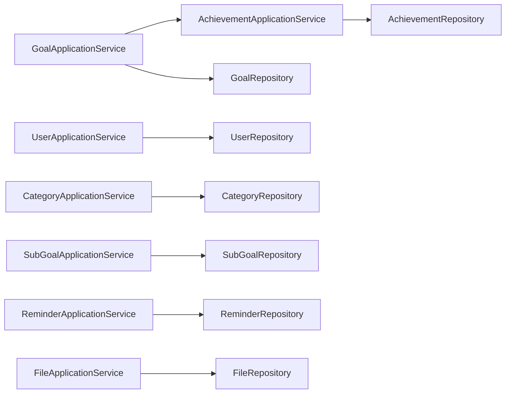

# 核心功能模块

<cite>
**本文引用的文件**
- [README.md](file://README.md)
- [CrazydreamApplication.java](file://src/main/java/com/crazydream/CrazydreamApplication.java)
- [application.yml](file://src/main/resources/application.yml)
- [User.java](file://src/main/java/com/crazydream/domain/user/model/aggregate/User.java)
- [Goal.java](file://src/main/java/com/crazydream/domain/goal/model/aggregate/Goal.java)
- [Achievement.java](file://src/main/java/com/crazydream/domain/achievement/model/aggregate/Achievement.java)
- [Category.java](file://src/main/java/com/crazydream/domain/category/model/aggregate/Category.java)
- [SubGoal.java](file://src/main/java/com/crazydream/domain/subgoal/model/aggregate/SubGoal.java)
- [Reminder.java](file://src/main/java/com/crazydream/domain/reminder/model/aggregate/Reminder.java)
- [FileInfo.java](file://src/main/java/com/crazydream/domain/file/model/aggregate/FileInfo.java)
- [UserApplicationService.java](file://src/main/java/com/crazydream/application/user/service/UserApplicationService.java)
- [GoalApplicationService.java](file://src/main/java/com/crazydream/application/goal/service/GoalApplicationService.java)
- [AchievementApplicationService.java](file://src/main/java/com/crazydream/application/achievement/service/AchievementApplicationService.java)
- [CategoryApplicationService.java](file://src/main/java/com/crazydream/application/category/service/CategoryApplicationService.java)
- [SubGoalApplicationService.java](file://src/main/java/com/crazydream/application/subgoal/service/SubGoalApplicationService.java)
- [ReminderApplicationService.java](file://src/main/java/com/crazydream/application/reminder/service/ReminderApplicationService.java)
- [FileApplicationService.java](file://src/main/java/com/crazydream/application/file/service/FileApplicationService.java)
- [UserController.java](file://src/main/java/com/crazydream/interfaces/user/UserController.java)
</cite>

## 目录
1. [引言](#引言)
2. [项目结构](#项目结构)
3. [核心组件](#核心组件)
4. [架构总览](#架构总览)
5. [详细组件分析](#详细组件分析)
6. [依赖分析](#依赖分析)
7. [性能考量](#性能考量)
8. [故障排查指南](#故障排查指南)
9. [结论](#结论)
10. [附录](#附录)

## 引言
本文件面向开发者与产品人员，系统性梳理 CrazyDream 后端的核心功能模块，包括用户管理、目标管理、成就系统、分类管理、子目标管理、提醒系统与文件管理。文档从架构视角出发，结合 DDD 与四层架构（接口层、应用层、领域层、基础设施层），解释各模块的业务逻辑、数据模型与核心功能，阐述模块间的依赖关系与协作机制，并提供使用场景、配置选项与扩展建议。

## 项目结构
系统采用 DDD + COLA 四层架构，代码按职责清晰分层：
- 接口层（interfaces）：对外暴露 REST API，负责请求适配与响应封装
- 应用层（application）：编排业务用例、事务控制，不直接依赖基础设施
- 领域层（domain）：聚合根、实体、值对象与领域服务，承载核心业务规则
- 基础设施层（infrastructure）：Repository 实现、MyBatis 映射与外部系统适配（如 OSS）

图表来源
- [UserController.java](file://src/main/java/com/crazydream/interfaces/user/UserController.java#L1-L132)
- [UserApplicationService.java](file://src/main/java/com/crazydream/application/user/service/UserApplicationService.java#L1-L98)
- [GoalApplicationService.java](file://src/main/java/com/crazydream/application/goal/service/GoalApplicationService.java#L1-L246)
- [AchievementApplicationService.java](file://src/main/java/com/crazydream/application/achievement/service/AchievementApplicationService.java#L1-L91)
- [CategoryApplicationService.java](file://src/main/java/com/crazydream/application/category/service/CategoryApplicationService.java#L1-L48)
- [SubGoalApplicationService.java](file://src/main/java/com/crazydream/application/subgoal/service/SubGoalApplicationService.java#L1-L61)
- [ReminderApplicationService.java](file://src/main/java/com/crazydream/application/reminder/service/ReminderApplicationService.java#L1-L64)
- [FileApplicationService.java](file://src/main/java/com/crazydream/application/file/service/FileApplicationService.java#L1-L53)
- [User.java](file://src/main/java/com/crazydream/domain/user/model/aggregate/User.java#L1-L122)
- [Goal.java](file://src/main/java/com/crazydream/domain/goal/model/aggregate/Goal.java#L1-L293)
- [Achievement.java](file://src/main/java/com/crazydream/domain/achievement/model/aggregate/Achievement.java#L1-L184)
- [Category.java](file://src/main/java/com/crazydream/domain/category/model/aggregate/Category.java#L1-L83)
- [SubGoal.java](file://src/main/java/com/crazydream/domain/subgoal/model/aggregate/SubGoal.java#L1-L118)
- [Reminder.java](file://src/main/java/com/crazydream/domain/reminder/model/aggregate/Reminder.java#L1-L95)
- [FileInfo.java](file://src/main/java/com/crazydream/domain/file/model/aggregate/FileInfo.java#L1-L91)

章节来源
- [README.md](file://README.md#L62-L85)
- [CrazydreamApplication.java](file://src/main/java/com/crazydream/CrazydreamApplication.java#L1-L27)
- [application.yml](file://src/main/resources/application.yml#L1-L75)

## 核心组件
本节概述六大业务模块与一个支撑模块（统计与成就统计），并给出模块职责与典型交互。

- 用户管理（User）
  - 职责：注册、登录、个人信息更新、积分与等级管理
  - 关键领域行为：更新资料、变更密码、增减积分、升级等级
  - 应用服务：UserApplicationService
  - 接口控制器：UserController

- 目标管理（Goal）
  - 职责：目标的创建、查询、更新、删除、批量删除、进度更新、完成/放弃
  - 关键领域行为：状态机推进、进度校验、到期判断、所属关系校验
  - 应用服务：GoalApplicationService
  - 与成就系统联动：创建目标与完成目标后触发成就检查

- 成就系统（Achievement）
  - 职责：成就类型枚举、成就创建与解锁、基于统计数据的条件判断
  - 统计服务：AchievementStatisticsService（由应用层调用）
  - 应用服务：AchievementApplicationService

- 分类管理（Category）
  - 职责：分类的创建、启用/禁用、查询、删除
  - 应用服务：CategoryApplicationService

- 子目标管理（SubGoal）
  - 职责：为目标创建子任务、进度追踪、查询与删除
  - 应用服务：SubGoalApplicationService

- 提醒系统（Reminder）
  - 职责：创建提醒、标记已读、查询未读、删除提醒
  - 应用服务：ReminderApplicationService

- 文件管理（File）
  - 职责：记录上传文件元数据（名称、URL、类型、大小）、查询与删除
  - 应用服务：FileApplicationService

章节来源
- [README.md](file://README.md#L9-L45)
- [User.java](file://src/main/java/com/crazydream/domain/user/model/aggregate/User.java#L1-L122)
- [Goal.java](file://src/main/java/com/crazydream/domain/goal/model/aggregate/Goal.java#L1-L293)
- [Achievement.java](file://src/main/java/com/crazydream/domain/achievement/model/aggregate/Achievement.java#L1-L184)
- [Category.java](file://src/main/java/com/crazydream/domain/category/model/aggregate/Category.java#L1-L83)
- [SubGoal.java](file://src/main/java/com/crazydream/domain/subgoal/model/aggregate/SubGoal.java#L1-L118)
- [Reminder.java](file://src/main/java/com/crazydream/domain/reminder/model/aggregate/Reminder.java#L1-L95)
- [FileInfo.java](file://src/main/java/com/crazydream/domain/file/model/aggregate/FileInfo.java#L1-L91)
- [UserApplicationService.java](file://src/main/java/com/crazydream/application/user/service/UserApplicationService.java#L1-L98)
- [GoalApplicationService.java](file://src/main/java/com/crazydream/application/goal/service/GoalApplicationService.java#L1-L246)
- [AchievementApplicationService.java](file://src/main/java/com/crazydream/application/achievement/service/AchievementApplicationService.java#L1-L91)
- [CategoryApplicationService.java](file://src/main/java/com/crazydream/application/category/service/CategoryApplicationService.java#L1-L48)
- [SubGoalApplicationService.java](file://src/main/java/com/crazydream/application/subgoal/service/SubGoalApplicationService.java#L1-L61)
- [ReminderApplicationService.java](file://src/main/java/com/crazydream/application/reminder/service/ReminderApplicationService.java#L1-L64)
- [FileApplicationService.java](file://src/main/java/com/crazydream/application/file/service/FileApplicationService.java#L1-L53)

## 架构总览
系统采用分层解耦与领域驱动设计：
- 接口层负责请求路由与响应封装，调用应用层服务
- 应用层编排业务流程，协调领域对象与仓储，处理事务边界
- 领域层承载业务规则与不变量，确保业务正确性
- 基础设施层提供持久化与外部系统适配

图表来源
- [UserController.java](file://src/main/java/com/crazydream/interfaces/user/UserController.java#L26-L34)
- [UserApplicationService.java](file://src/main/java/com/crazydream/application/user/service/UserApplicationService.java#L27-L43)
- [User.java](file://src/main/java/com/crazydream/domain/user/model/aggregate/User.java#L28-L38)

章节来源
- [README.md](file://README.md#L62-L71)
- [application.yml](file://src/main/resources/application.yml#L57-L63)

## 详细组件分析

### 用户管理模块
- 业务逻辑
  - 注册：邮箱唯一性校验、密码加密、创建用户、签发 JWT
  - 登录：邮箱查找用户、密码匹配、签发 JWT
  - 个人资料：昵称与头像更新
  - 积分与等级：增减积分、根据完成目标数升级等级
- 数据模型
  - 聚合根：User
  - 值对象：UserId、Email、NickName、UserLevel
- 关键流程
  - 注册成功后立即生成 JWT 返回
  - 登录成功后返回 token 与用户信息
  - 更新资料与积分变更均持久化保存

图表来源
- [User.java](file://src/main/java/com/crazydream/domain/user/model/aggregate/User.java#L1-L122)
- [UserApplicationService.java](file://src/main/java/com/crazydream/application/user/service/UserApplicationService.java#L1-L98)
- [UserController.java](file://src/main/java/com/crazydream/interfaces/user/UserController.java#L1-L132)

章节来源
- [User.java](file://src/main/java/com/crazydream/domain/user/model/aggregate/User.java#L28-L87)
- [UserApplicationService.java](file://src/main/java/com/crazydream/application/user/service/UserApplicationService.java#L27-L96)
- [UserController.java](file://src/main/java/com/crazydream/interfaces/user/UserController.java#L26-L99)

### 目标管理模块
- 业务逻辑
  - CRUD：创建、查询、更新、删除、批量删除
  - 进度与状态：进度更新自动推进状态；完成目标后触发成就检查
  - 权限校验：所有操作均校验目标所属用户
  - 统计：按状态分组统计目标数量
- 数据模型
  - 聚合根：Goal
  - 值对象：GoalId、GoalTitle、GoalProgress、GoalStatus、Priority、CategoryId、UserId
- 关键流程
  - 创建目标后异步触发成就检查
  - 进度更新至 100% 自动完成并触发成就检查
  - 完成目标后触发成就检查

图表来源
- [GoalApplicationService.java](file://src/main/java/com/crazydream/application/goal/service/GoalApplicationService.java#L156-L186)
- [Goal.java](file://src/main/java/com/crazydream/domain/goal/model/aggregate/Goal.java#L122-L140)

章节来源
- [Goal.java](file://src/main/java/com/crazydream/domain/goal/model/aggregate/Goal.java#L65-L181)
- [GoalApplicationService.java](file://src/main/java/com/crazydream/application/goal/service/GoalApplicationService.java#L44-L244)

### 成就系统模块
- 业务逻辑
  - 成就类型：涵盖目标完成数量、连续打卡、分类专注、效率提升、里程碑等
  - 成就创建：首次使用时按类型补齐空缺成就
  - 成就解锁：基于统计数据判断，满足条件则解锁
- 数据模型
  - 聚合根：Achievement
  - 值对象：AchievementId、AchievementType、AchievementStatistics
- 关键流程
  - 用户操作触发统计收集，再对所有成就逐一判定解锁
  - 支持手动解锁（管理员或特定场景）

图表来源
- [GoalApplicationService.java](file://src/main/java/com/crazydream/application/goal/service/GoalApplicationService.java#L52-L58)
- [AchievementApplicationService.java](file://src/main/java/com/crazydream/application/achievement/service/AchievementApplicationService.java#L51-L62)
- [Achievement.java](file://src/main/java/com/crazydream/domain/achievement/model/aggregate/Achievement.java#L61-L126)

章节来源
- [Achievement.java](file://src/main/java/com/crazydream/domain/achievement/model/aggregate/Achievement.java#L22-L126)
- [AchievementApplicationService.java](file://src/main/java/com/crazydream/application/achievement/service/AchievementApplicationService.java#L25-L62)

### 分类管理模块
- 业务逻辑
  - 创建分类：名称、图标、颜色、排序
  - 查询：全部、启用、按 ID
  - 删除：软/硬删除取决于仓储实现
- 数据模型
  - 聚合根：Category
  - 值对象：CategoryId、CategoryName
- 关键流程
  - 创建后立即持久化并返回 DTO
  - 查询时过滤启用状态

章节来源
- [Category.java](file://src/main/java/com/crazydream/domain/category/model/aggregate/Category.java#L21-L56)
- [CategoryApplicationService.java](file://src/main/java/com/crazydream/application/category/service/CategoryApplicationService.java#L21-L46)

### 子目标管理模块
- 业务逻辑
  - 为目标创建子任务，设置标题与描述
  - 进度更新与完成
  - 查询与删除（含批量）
- 数据模型
  - 聚合根：SubGoal
  - 值对象：SubGoalId、SubGoalTitle、SubGoalStatus、GoalId
- 关键流程
  - 子目标进度达 100% 自动完成
  - 通过目标 ID 查询子目标集合

章节来源
- [SubGoal.java](file://src/main/java/com/crazydream/domain/subgoal/model/aggregate/SubGoal.java#L29-L88)
- [SubGoalApplicationService.java](file://src/main/java/com/crazydream/application/subgoal/service/SubGoalApplicationService.java#L21-L59)

### 提醒系统模块
- 业务逻辑
  - 创建提醒：标题、提醒时间、关联目标
  - 标记已读、查询未读、删除提醒
  - 到期判断：当前时间超过提醒时间视为逾期
- 数据模型
  - 聚合根：Reminder
  - 值对象：ReminderId、GoalId、UserId
- 关键流程
  - 标记已读后持久化保存
  - 删除前校验提醒所属用户

章节来源
- [Reminder.java](file://src/main/java/com/crazydream/domain/reminder/model/aggregate/Reminder.java#L25-L65)
- [ReminderApplicationService.java](file://src/main/java/com/crazydream/application/reminder/service/ReminderApplicationService.java#L21-L62)

### 文件管理模块
- 业务逻辑
  - 记录上传文件：文件名、URL、大小、类型推断
  - 查询用户文件、按 ID 查询、删除文件（校验归属）
- 数据模型
  - 聚合根：FileInfo
  - 值对象：FileId、FileType
- 关键流程
  - 上传后仅记录元数据（OSS 上传在上层处理）
  - 删除前校验文件归属用户

章节来源
- [FileInfo.java](file://src/main/java/com/crazydream/domain/file/model/aggregate/FileInfo.java#L23-L58)
- [FileApplicationService.java](file://src/main/java/com/crazydream/application/file/service/FileApplicationService.java#L23-L51)

## 依赖分析
- 模块内聚与耦合
  - 应用服务之间低耦合：GoalApplicationService 与 AchievementApplicationService 通过统计服务间接协作
  - 领域模型高内聚：各聚合根封装自身不变量与业务规则
- 外部依赖
  - 数据库：MySQL + MyBatis
  - 安全：Spring Security + JWT
  - 对象存储：阿里云 OSS（配置于 application.yml）
- 循环依赖
  - application.yml 中允许循环依赖，便于某些场景下的装配

图表来源
- [GoalApplicationService.java](file://src/main/java/com/crazydream/application/goal/service/GoalApplicationService.java#L38-L39)
- [AchievementApplicationService.java](file://src/main/java/com/crazydream/application/achievement/service/AchievementApplicationService.java#L19-L23)
- [UserApplicationService.java](file://src/main/java/com/crazydream/application/user/service/UserApplicationService.java#L18-L25)
- [CategoryApplicationService.java](file://src/main/java/com/crazydream/application/category/service/CategoryApplicationService.java#L17-L18)
- [SubGoalApplicationService.java](file://src/main/java/com/crazydream/application/subgoal/service/SubGoalApplicationService.java#L18-L19)
- [ReminderApplicationService.java](file://src/main/java/com/crazydream/application/reminder/service/ReminderApplicationService.java#L18-L19)
- [FileApplicationService.java](file://src/main/java/com/crazydream/application/file/service/FileApplicationService.java#L18-L20)

章节来源
- [application.yml](file://src/main/resources/application.yml#L6-L8)

## 性能考量
- 事务边界
  - 应用服务方法标注事务，确保业务一致性；注意长事务可能带来的锁竞争
- 查询优化
  - 领域层尽量通过仓储提供的精确查询方法（如按用户、按分类）减少数据传输
- 统计与成就检查
  - 成就检查涉及全量扫描与统计计算，建议在低频场景或定时任务中执行
- 文件上传
  - 上传大小限制与 OSS 配置需结合业务规模调整

## 故障排查指南
- 常见错误与定位
  - 用户相关：邮箱重复、邮箱或密码错误、用户不存在
  - 目标相关：无权限操作、目标不存在、状态不可转换
  - 成就相关：成就不存在、无权限操作
  - 提醒相关：提醒不存在、无权限操作
  - 文件相关：文件不存在、无权限操作
- 日志与异常
  - 应用层对异常进行捕获并返回统一响应体
  - 成就检查失败会记录错误日志但不影响主流程

章节来源
- [UserApplicationService.java](file://src/main/java/com/crazydream/application/user/service/UserApplicationService.java#L31-L53)
- [GoalApplicationService.java](file://src/main/java/com/crazydream/application/goal/service/GoalApplicationService.java#L74-L76)
- [AchievementApplicationService.java](file://src/main/java/com/crazydream/application/achievement/service/AchievementApplicationService.java#L76-L82)
- [ReminderApplicationService.java](file://src/main/java/com/crazydream/application/reminder/service/ReminderApplicationService.java#L40-L61)
- [FileApplicationService.java](file://src/main/java/com/crazydream/application/file/service/FileApplicationService.java#L43-L48)

## 结论
CrazyDream 通过 DDD 四层架构实现了清晰的职责分离与强业务内聚。用户、目标、成就、分类、子目标、提醒与文件七大模块围绕领域模型展开，应用层编排业务流程并保证事务边界，接口层提供稳定的 REST API。模块间通过仓储与统计服务松耦合协作，具备良好的扩展性与可维护性。

## 附录
- 使用场景
  - 用户管理：新用户注册、登录认证、资料维护
  - 目标管理：创建长期目标、分解为子目标、追踪进度与完成
  - 成就系统：基于行为与统计自动解锁成就，增强用户粘性
  - 分类管理：对目标进行多维分类与可视化
  - 提醒系统：设定到期提醒，提高执行效率
  - 文件管理：记录头像等资源元数据，配合 OSS 实现文件存储
- 配置选项
  - 数据库连接、MyBatis 映射、JWT 密钥与过期时间、OSS 参数、文件上传大小限制、激活的 profile
- 扩展建议
  - 成就系统：新增成就类型时，只需扩展类型枚举与条件判断逻辑
  - 统计模块：引入缓存与异步统计，降低实时统计成本
  - 安全：生产环境关闭测试模式，严格启用鉴权与权限控制

章节来源
- [README.md](file://README.md#L158-L211)
- [application.yml](file://src/main/resources/application.yml#L11-L75)