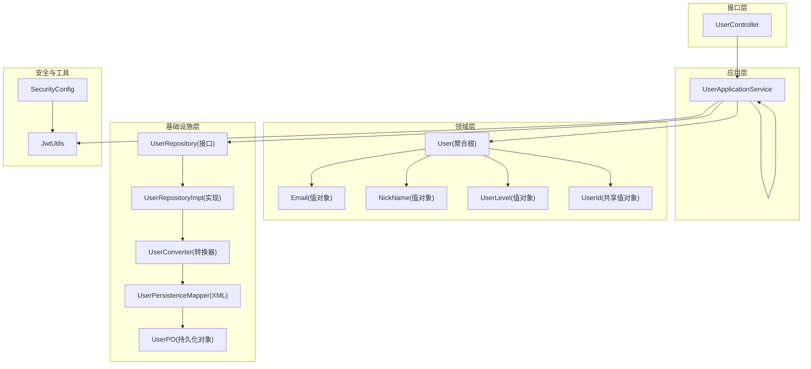
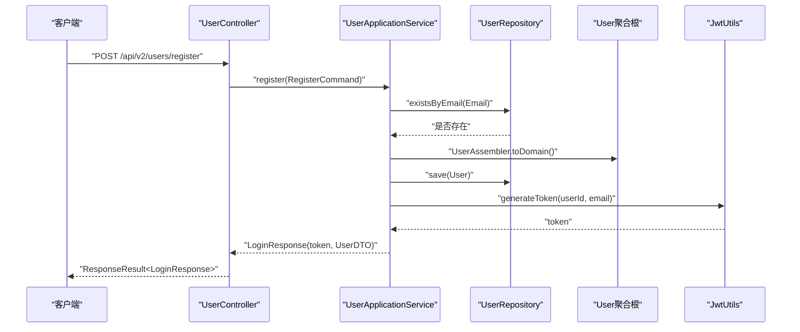
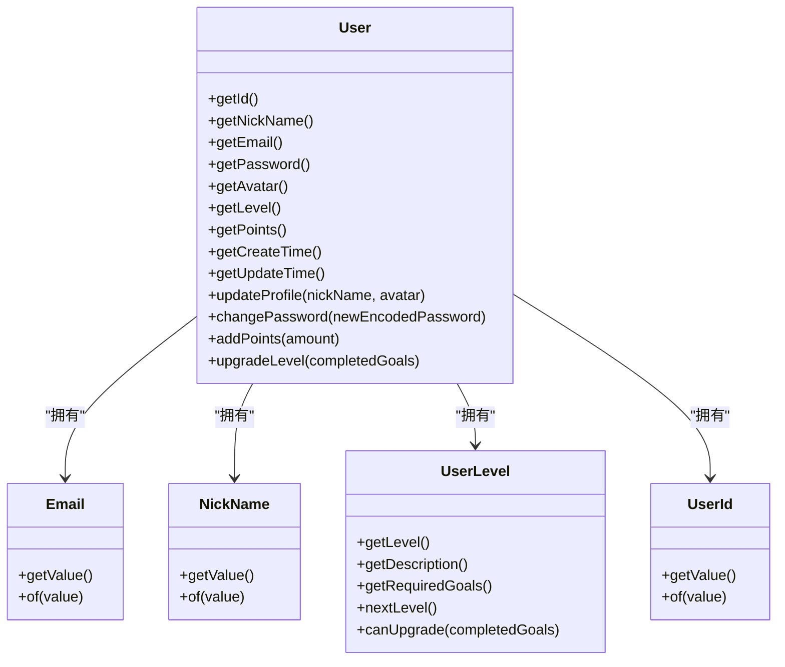
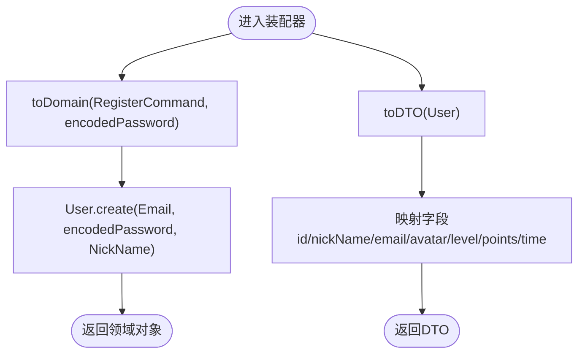
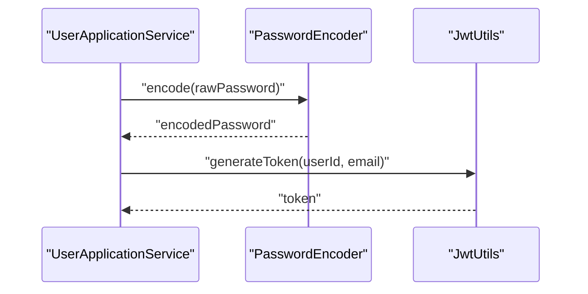
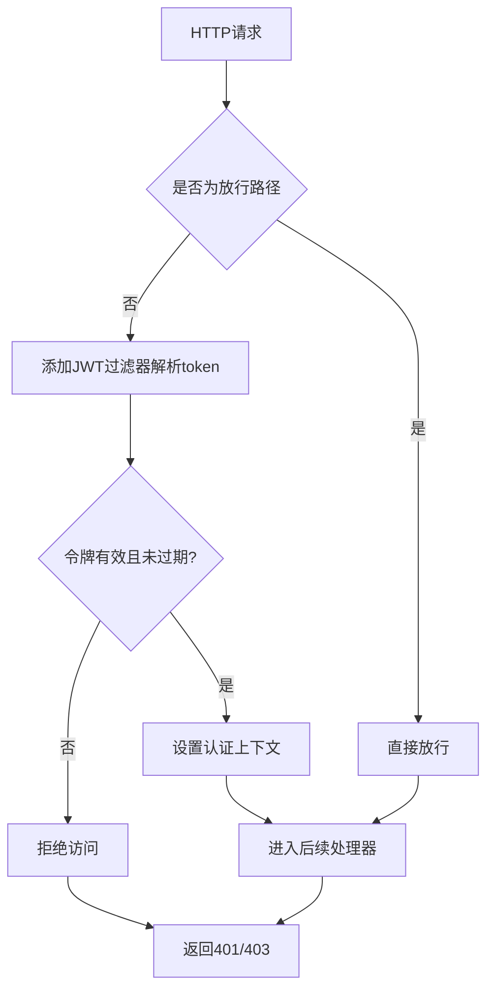
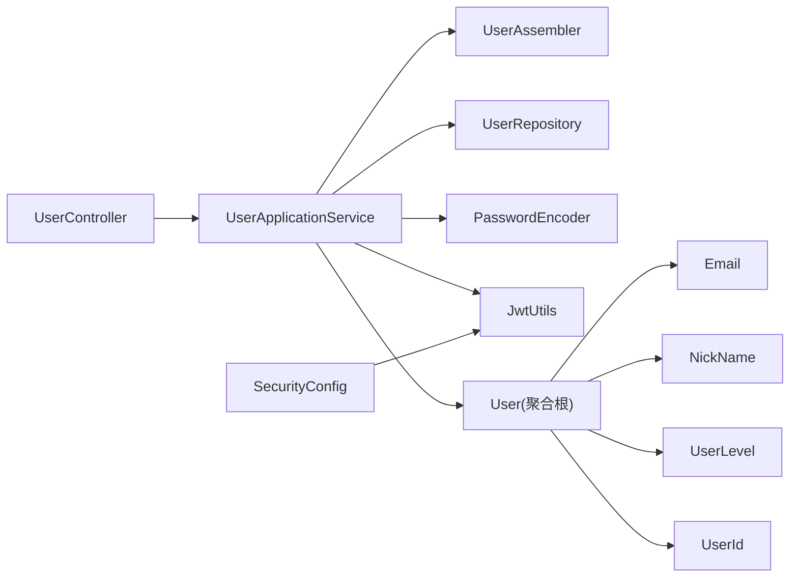

# 用户管理模块

<cite>
**本文引用的文件**
- [src/main/java/com/crazydream/application/user/service/UserApplicationService.java](file://src/main/java/com/crazydream/application/user/service/UserApplicationService.java)
- [src/main/java/com/crazydream/application/user/assembler/UserAssembler.java](file://src/main/java/com/crazydream/application/user/assembler/UserAssembler.java)
- [src/main/java/com/crazydream/application/user/dto/RegisterCommand.java](file://src/main/java/com/crazydream/application/user/dto/RegisterCommand.java)
- [src/main/java/com/crazydream/application/user/dto/LoginCommand.java](file://src/main/java/com/crazydream/application/user/dto/LoginCommand.java)
- [src/main/java/com/crazydream/application/user/dto/LoginResponse.java](file://src/main/java/com/crazydream/application/user/dto/LoginResponse.java)
- [src/main/java/com/crazydream/application/user/dto/UserDTO.java](file://src/main/java/com/crazydream/application/user/dto/UserDTO.java)
- [src/main/java/com/crazydream/application/user/dto/UpdateProfileCommand.java](file://src/main/java/com/crazydream/application/user/dto/UpdateProfileCommand.java)
- [src/main/java/com/crazydream/domain/user/model/aggregate/User.java](file://src/main/java/com/crazydream/domain/user/model/aggregate/User.java)
- [src/main/java/com/crazydream/domain/user/model/valueobject/UserLevel.java](file://src/main/java/com/crazydream/domain/user/model/valueobject/UserLevel.java)
- [src/main/java/com/crazydream/domain/user/model/valueobject/Email.java](file://src/main/java/com/crazydream/domain/user/model/valueobject/Email.java)
- [src/main/java/com/crazydream/domain/user/model/valueobject/NickName.java](file://src/main/java/com/crazydream/domain/user/model/valueobject/NickName.java)
- [src/main/java/com/crazydream/domain/shared/model/UserId.java](file://src/main/java/com/crazydream/domain/shared/model/UserId.java)
- [src/main/java/com/crazydream/interfaces/user/UserController.java](file://src/main/java/com/crazydream/interfaces/user/UserController.java)
- [src/main/java/com/crazydream/utils/JwtUtils.java](file://src/main/java/com/crazydream/utils/JwtUtils.java)
- [src/main/java/com/crazydream/security/SecurityConfig.java](file://src/main/java/com/crazydream/security/SecurityConfig.java)
</cite>

## 目录
1. [简介](#简介)
2. [项目结构](#项目结构)
3. [核心组件](#核心组件)
4. [架构总览](#架构总览)
5. [详细组件分析](#详细组件分析)
6. [依赖关系分析](#依赖关系分析)
7. [性能考量](#性能考量)
8. [故障排查指南](#故障排查指南)
9. [结论](#结论)
10. [附录](#附录)

## 简介
本文件系统性梳理用户管理模块的设计与实现，覆盖用户注册、登录、个人信息管理、等级升级等核心功能；深入解析用户实体模型、值对象设计与业务规则；阐述用户装配器的数据转换机制；给出完整API接口说明（请求参数、响应格式、错误处理）；解释密码加密、JWT令牌生成与用户权限验证的实现细节；并提供集成指南与扩展建议。

## 项目结构
用户管理模块遵循分层架构与DDD分层组织方式：
- 接口层：控制器负责HTTP请求接入与响应封装
- 应用层：应用服务编排业务流程，协调仓储与工具类
- 领域层：聚合根与值对象承载业务不变量与规则
- 基础设施层：仓储实现、持久化映射与转换器

图表来源
- [src/main/java/com/crazydream/interfaces/user/UserController.java](file://src/main/java/com/crazydream/interfaces/user/UserController.java#L1-L132)
- [src/main/java/com/crazydream/application/user/service/UserApplicationService.java](file://src/main/java/com/crazydream/application/user/service/UserApplicationService.java#L1-L98)
- [src/main/java/com/crazydream/domain/user/model/aggregate/User.java](file://src/main/java/com/crazydream/domain/user/model/aggregate/User.java#L1-L122)
- [src/main/java/com/crazydream/domain/user/model/valueobject/Email.java](file://src/main/java/com/crazydream/domain/user/model/valueobject/Email.java#L1-L46)
- [src/main/java/com/crazydream/domain/user/model/valueobject/NickName.java](file://src/main/java/com/crazydream/domain/user/model/valueobject/NickName.java#L1-L44)
- [src/main/java/com/crazydream/domain/user/model/valueobject/UserLevel.java](file://src/main/java/com/crazydream/domain/user/model/valueobject/UserLevel.java#L1-L66)
- [src/main/java/com/crazydream/domain/shared/model/UserId.java](file://src/main/java/com/crazydream/domain/shared/model/UserId.java#L1-L48)
- [src/main/java/com/crazydream/security/SecurityConfig.java](file://src/main/java/com/crazydream/security/SecurityConfig.java#L1-L105)
- [src/main/java/com/crazydream/utils/JwtUtils.java](file://src/main/java/com/crazydream/utils/JwtUtils.java#L1-L165)

章节来源
- [src/main/java/com/crazydream/interfaces/user/UserController.java](file://src/main/java/com/crazydream/interfaces/user/UserController.java#L1-L132)
- [src/main/java/com/crazydream/application/user/service/UserApplicationService.java](file://src/main/java/com/crazydream/application/user/service/UserApplicationService.java#L1-L98)

## 核心组件
- 控制器：提供REST接口，封装统一响应体，解析当前用户上下文
- 应用服务：编排注册、登录、查询、更新、加积分、升级等级等业务
- 领域模型：User聚合根承载业务行为；Email、NickName、UserLevel、UserId为值对象
- 安全与工具：SecurityConfig配置无状态认证与CORS；JwtUtils负责令牌生成与校验

章节来源
- [src/main/java/com/crazydream/interfaces/user/UserController.java](file://src/main/java/com/crazydream/interfaces/user/UserController.java#L1-L132)
- [src/main/java/com/crazydream/application/user/service/UserApplicationService.java](file://src/main/java/com/crazydream/application/user/service/UserApplicationService.java#L1-L98)
- [src/main/java/com/crazydream/domain/user/model/aggregate/User.java](file://src/main/java/com/crazydream/domain/user/model/aggregate/User.java#L1-L122)
- [src/main/java/com/crazydream/domain/user/model/valueobject/Email.java](file://src/main/java/com/crazydream/domain/user/model/valueobject/Email.java#L1-L46)
- [src/main/java/com/crazydream/domain/user/model/valueobject/NickName.java](file://src/main/java/com/crazydream/domain/user/model/valueobject/NickName.java#L1-L44)
- [src/main/java/com/crazydream/domain/user/model/valueobject/UserLevel.java](file://src/main/java/com/crazydream/domain/user/model/valueobject/UserLevel.java#L1-L66)
- [src/main/java/com/crazydream/domain/shared/model/UserId.java](file://src/main/java/com/crazydream/domain/shared/model/UserId.java#L1-L48)
- [src/main/java/com/crazydream/security/SecurityConfig.java](file://src/main/java/com/crazydream/security/SecurityConfig.java#L1-L105)
- [src/main/java/com/crazydream/utils/JwtUtils.java](file://src/main/java/com/crazydream/utils/JwtUtils.java#L1-L165)

## 架构总览
用户模块采用“接口层-应用层-领域层-基础设施层”的清晰分层，配合Spring Security与JWT实现无状态认证，应用服务通过装配器在DTO与领域对象间进行数据转换。

图表来源
- [src/main/java/com/crazydream/interfaces/user/UserController.java](file://src/main/java/com/crazydream/interfaces/user/UserController.java#L26-L34)
- [src/main/java/com/crazydream/application/user/service/UserApplicationService.java](file://src/main/java/com/crazydream/application/user/service/UserApplicationService.java#L28-L43)
- [src/main/java/com/crazydream/application/user/assembler/UserAssembler.java](file://src/main/java/com/crazydream/application/user/assembler/UserAssembler.java#L9-L15)
- [src/main/java/com/crazydream/utils/JwtUtils.java](file://src/main/java/com/crazydream/utils/JwtUtils.java#L57-L76)

## 详细组件分析

### 用户实体模型与值对象
- User聚合根：包含用户标识、邮箱、昵称、加密密码、头像、等级、积分、创建与更新时间；提供更新资料、变更密码、加积分、升级等级等业务方法
- Email值对象：校验非空、格式与大小写归一化
- NickName值对象：校验非空与最大长度
- UserLevel值对象：定义等级枚举、升级阈值、下一等级判断
- UserId值对象：跨领域共享的用户标识，校验非空与正数

图表来源
- [src/main/java/com/crazydream/domain/user/model/aggregate/User.java](file://src/main/java/com/crazydream/domain/user/model/aggregate/User.java#L12-L122)
- [src/main/java/com/crazydream/domain/user/model/valueobject/Email.java](file://src/main/java/com/crazydream/domain/user/model/valueobject/Email.java#L9-L46)
- [src/main/java/com/crazydream/domain/user/model/valueobject/NickName.java](file://src/main/java/com/crazydream/domain/user/model/valueobject/NickName.java#L8-L44)
- [src/main/java/com/crazydream/domain/user/model/valueobject/UserLevel.java](file://src/main/java/com/crazydream/domain/user/model/valueobject/UserLevel.java#L6-L66)
- [src/main/java/com/crazydream/domain/shared/model/UserId.java](file://src/main/java/com/crazydream/domain/shared/model/UserId.java#L12-L48)

章节来源
- [src/main/java/com/crazydream/domain/user/model/aggregate/User.java](file://src/main/java/com/crazydream/domain/user/model/aggregate/User.java#L1-L122)
- [src/main/java/com/crazydream/domain/user/model/valueobject/Email.java](file://src/main/java/com/crazydream/domain/user/model/valueobject/Email.java#L1-L46)
- [src/main/java/com/crazydream/domain/user/model/valueobject/NickName.java](file://src/main/java/com/crazydream/domain/user/model/valueobject/NickName.java#L1-L44)
- [src/main/java/com/crazydream/domain/user/model/valueobject/UserLevel.java](file://src/main/java/com/crazydream/domain/user/model/valueobject/UserLevel.java#L1-L66)
- [src/main/java/com/crazydream/domain/shared/model/UserId.java](file://src/main/java/com/crazydream/domain/shared/model/UserId.java#L1-L48)

### 用户装配器与数据转换
- 装配器作用：在DTO与领域对象之间进行双向转换，保证接口层与领域层解耦
- 转换逻辑：注册时将命令对象转为领域对象；查询时将领域对象转为DTO；包含空值与可选字段处理

图表来源
- [src/main/java/com/crazydream/application/user/assembler/UserAssembler.java](file://src/main/java/com/crazydream/application/user/assembler/UserAssembler.java#L7-L34)

章节来源
- [src/main/java/com/crazydream/application/user/assembler/UserAssembler.java](file://src/main/java/com/crazydream/application/user/assembler/UserAssembler.java#L1-L35)

### 密码加密与JWT令牌
- 密码加密：应用服务注入BCryptPasswordEncoder，注册时编码密码，登录时匹配
- JWT令牌：JwtUtils根据配置生成签名令牌，包含用户ID与用户名，支持解析、校验与头部提取

图表来源
- [src/main/java/com/crazydream/application/user/service/UserApplicationService.java](file://src/main/java/com/crazydream/application/user/service/UserApplicationService.java#L35-L42)
- [src/main/java/com/crazydream/utils/JwtUtils.java](file://src/main/java/com/crazydream/utils/JwtUtils.java#L57-L76)
- [src/main/java/com/crazydream/security/SecurityConfig.java](file://src/main/java/com/crazydream/security/SecurityConfig.java#L45-L47)

章节来源
- [src/main/java/com/crazydream/application/user/service/UserApplicationService.java](file://src/main/java/com/crazydream/application/user/service/UserApplicationService.java#L1-L98)
- [src/main/java/com/crazydream/utils/JwtUtils.java](file://src/main/java/com/crazydream/utils/JwtUtils.java#L1-L165)
- [src/main/java/com/crazydream/security/SecurityConfig.java](file://src/main/java/com/crazydream/security/SecurityConfig.java#L1-L105)

### 权限验证与安全配置
- 无状态会话：配置SessionCreationPolicy.STATELESS
- 放行路径：登录/注册接口放行；健康检查接口放行
- 过滤器：在用户名密码过滤器之前添加JWT过滤器以解析令牌
- 测试开关：可通过配置禁用认证（仅测试）

图表来源
- [src/main/java/com/crazydream/security/SecurityConfig.java](file://src/main/java/com/crazydream/security/SecurityConfig.java#L55-L91)

章节来源
- [src/main/java/com/crazydream/security/SecurityConfig.java](file://src/main/java/com/crazydream/security/SecurityConfig.java#L1-L105)

### API接口说明

- 注册
  - 方法与路径：POST /api/v2/users/register
  - 请求体：RegisterCommand
    - 字段：email(String)、password(String)、nickName(String)
  - 成功响应：LoginResponse
    - 字段：token(String)、user(UserDTO)
  - 错误：邮箱已存在、参数非法
  - 实现参考：[注册流程](file://src/main/java/com/crazydream/application/user/service/UserApplicationService.java#L28-L43)

- 登录
  - 方法与路径：POST /api/v2/users/login
  - 请求体：LoginCommand
    - 字段：email(String)、password(String)
  - 成功响应：LoginResponse
  - 错误：邮箱或密码错误
  - 实现参考：[登录流程](file://src/main/java/com/crazydream/application/user/service/UserApplicationService.java#L45-L59)

- 获取当前用户信息
  - 方法与路径：GET /api/v2/users/me
  - 认证：需携带JWT
  - 成功响应：UserDTO
  - 错误：用户不存在、认证异常
  - 实现参考：[当前用户](file://src/main/java/com/crazydream/interfaces/user/UserController.java#L36-L45)

- 获取指定用户资料
  - 方法与路径：GET /api/v2/users/{id}
  - 成功响应：UserDTO
  - 错误：用户不存在
  - 实现参考：[按ID查询](file://src/main/java/com/crazydream/interfaces/user/UserController.java#L58-L66)

- 更新个人资料
  - 方法与路径：PUT /api/v2/users/profile
  - 请求体：UpdateProfileCommand
    - 字段：nickName(String)、avatar(String)
  - 认证：需携带JWT
  - 成功响应：UserDTO
  - 实现参考：[更新资料](file://src/main/java/com/crazydream/interfaces/user/UserController.java#L79-L88)

- 加积分
  - 方法与路径：POST /api/v2/users/points?points={int}
  - 认证：需携带JWT
  - 成功响应：无内容
  - 实现参考：[加积分](file://src/main/java/com/crazydream/interfaces/user/UserController.java#L90-L99)

- DTO与命令对象
  - RegisterCommand：email、password、nickName
  - LoginCommand：email、password
  - UpdateProfileCommand：nickName、avatar
  - UserDTO：id、nickName、email、avatar、level、levelDescription、points、createTime、updateTime
  - LoginResponse：token、user

章节来源
- [src/main/java/com/crazydream/interfaces/user/UserController.java](file://src/main/java/com/crazydream/interfaces/user/UserController.java#L1-L132)
- [src/main/java/com/crazydream/application/user/dto/RegisterCommand.java](file://src/main/java/com/crazydream/application/user/dto/RegisterCommand.java#L1-L11)
- [src/main/java/com/crazydream/application/user/dto/LoginCommand.java](file://src/main/java/com/crazydream/application/user/dto/LoginCommand.java#L1-L10)
- [src/main/java/com/crazydream/application/user/dto/UpdateProfileCommand.java](file://src/main/java/com/crazydream/application/user/dto/UpdateProfileCommand.java#L1-L10)
- [src/main/java/com/crazydream/application/user/dto/UserDTO.java](file://src/main/java/com/crazydream/application/user/dto/UserDTO.java#L1-L18)
- [src/main/java/com/crazydream/application/user/dto/LoginResponse.java](file://src/main/java/com/crazydream/application/user/dto/LoginResponse.java#L1-L12)

### 业务规则与数据模型

- 用户实体字段与约束
  - id：UserId，非空且正数
  - email：Email，非空、格式正确、小写归一化
  - nickName：NickName，非空、长度≤50
  - password：字符串，存储加密后密码
  - avatar：字符串，可为空
  - level：UserLevel，初始为BEGINNER
  - points：整数，初始为0
  - createTime/updateTime：时间戳

- 等级升级规则
  - BEGINNER → 10个完成目标
  - INTERMEDIATE → 30个完成目标
  - ADVANCED → 50个完成目标
  - EXPERT为最高等级，不可再升
  - 升级条件：completedGoals达到下一等级阈值

- 业务行为
  - 更新资料：可选头像，更新时间戳
  - 变更密码：更新密码与时间戳
  - 加积分：仅允许正数增量
  - 升级等级：满足条件才升级

章节来源
- [src/main/java/com/crazydream/domain/user/model/aggregate/User.java](file://src/main/java/com/crazydream/domain/user/model/aggregate/User.java#L1-L122)
- [src/main/java/com/crazydream/domain/user/model/valueobject/UserLevel.java](file://src/main/java/com/crazydream/domain/user/model/valueobject/UserLevel.java#L1-L66)
- [src/main/java/com/crazydream/domain/user/model/valueobject/Email.java](file://src/main/java/com/crazydream/domain/user/model/valueobject/Email.java#L1-L46)
- [src/main/java/com/crazydream/domain/user/model/valueobject/NickName.java](file://src/main/java/com/crazydream/domain/user/model/valueobject/NickName.java#L1-L44)
- [src/main/java/com/crazydream/domain/shared/model/UserId.java](file://src/main/java/com/crazydream/domain/shared/model/UserId.java#L1-L48)

## 依赖关系分析

图表来源
- [src/main/java/com/crazydream/interfaces/user/UserController.java](file://src/main/java/com/crazydream/interfaces/user/UserController.java#L1-L132)
- [src/main/java/com/crazydream/application/user/service/UserApplicationService.java](file://src/main/java/com/crazydream/application/user/service/UserApplicationService.java#L1-L98)
- [src/main/java/com/crazydream/application/user/assembler/UserAssembler.java](file://src/main/java/com/crazydream/application/user/assembler/UserAssembler.java#L1-L35)
- [src/main/java/com/crazydream/domain/user/model/aggregate/User.java](file://src/main/java/com/crazydream/domain/user/model/aggregate/User.java#L1-L122)
- [src/main/java/com/crazydream/security/SecurityConfig.java](file://src/main/java/com/crazydream/security/SecurityConfig.java#L1-L105)
- [src/main/java/com/crazydream/utils/JwtUtils.java](file://src/main/java/com/crazydream/utils/JwtUtils.java#L1-L165)

章节来源
- [src/main/java/com/crazydream/application/user/service/UserApplicationService.java](file://src/main/java/com/crazydream/application/user/service/UserApplicationService.java#L1-L98)
- [src/main/java/com/crazydream/domain/user/model/aggregate/User.java](file://src/main/java/com/crazydream/domain/user/model/aggregate/User.java#L1-L122)

## 性能考量
- 事务边界：注册、更新资料、加积分、升级等级均在事务内执行，确保一致性
- 密码加密成本：BCrypt计算成本较高，建议在批量场景下异步处理或限流
- JWT负载：仅包含必要声明（用户ID、用户名），避免过大载荷
- 查询优化：按ID查询用户为主，建议在UserId上建立索引
- 并发控制：升级等级依赖领域规则，内部已做条件判断，避免重复升级

## 故障排查指南
- 邮箱格式错误：Email值对象校验失败
  - 触发点：注册/登录时构造Email
  - 处理：修正邮箱格式或检查输入
  - 参考：[Email校验](file://src/main/java/com/crazydream/domain/user/model/valueobject/Email.java#L15-L23)

- 昵称非法：长度超限或为空
  - 触发点：注册/更新资料时构造NickName
  - 处理：缩短昵称或去除多余空白
  - 参考：[NickName校验](file://src/main/java/com/crazydream/domain/user/model/valueobject/NickName.java#L13-L21)

- 邮箱已被注册：唯一性约束
  - 触发点：注册前查询
  - 处理：更换邮箱或找回账号
  - 参考：[唯一性检查](file://src/main/java/com/crazydream/application/user/service/UserApplicationService.java#L31-L33)

- 邮箱或密码错误：登录校验失败
  - 触发点：登录时匹配密码
  - 处理：确认凭据或重置密码
  - 参考：[登录校验](file://src/main/java/com/crazydream/application/user/service/UserApplicationService.java#L48-L53)

- JWT无效：签名不匹配或过期
  - 触发点：令牌解析/校验
  - 处理：重新登录获取新令牌
  - 参考：[JWT解析与校验](file://src/main/java/com/crazydream/utils/JwtUtils.java#L81-L125)

- 用户不存在：按ID查询失败
  - 触发点：查询/更新/加积分/升级
  - 处理：确认用户ID或检查数据一致性
  - 参考：[按ID查询](file://src/main/java/com/crazydream/application/user/service/UserApplicationService.java#L61-L64)

章节来源
- [src/main/java/com/crazydream/domain/user/model/valueobject/Email.java](file://src/main/java/com/crazydream/domain/user/model/valueobject/Email.java#L1-L46)
- [src/main/java/com/crazydream/domain/user/model/valueobject/NickName.java](file://src/main/java/com/crazydream/domain/user/model/valueobject/NickName.java#L1-L44)
- [src/main/java/com/crazydream/application/user/service/UserApplicationService.java](file://src/main/java/com/crazydream/application/user/service/UserApplicationService.java#L1-L98)
- [src/main/java/com/crazydream/utils/JwtUtils.java](file://src/main/java/com/crazydream/utils/JwtUtils.java#L1-L165)

## 结论
用户管理模块以DDD为核心，通过值对象保障业务不变量，应用服务编排核心流程，装配器实现DTO与领域对象的解耦转换，并结合Spring Security与JWT实现无状态认证。模块具备清晰的职责划分与良好的扩展性，便于后续增强如密码修改、积分明细、等级策略配置等功能。

## 附录

### 集成指南
- 启用安全配置：确保SecurityConfig生效，正确配置JWT密钥、过期时间与放行路径
- 依赖注入：确认PasswordEncoder、JwtUtils、UserRepository在应用服务中注入
- 前端接入：使用Bearer Token携带JWT，调用受保护接口
- 测试模式：可通过配置禁用认证（仅测试）

### 扩展建议
- 密码修改：新增ChangePasswordCommand与对应应用服务方法
- 积分流水：引入积分明细聚合，记录增减原因与时间
- 等级策略：将等级阈值与描述抽象为配置，支持动态调整
- 头像上传：集成文件服务，完善头像字段与裁剪策略
- 审计日志：记录用户关键操作（登录、升级、资料变更）以便追踪