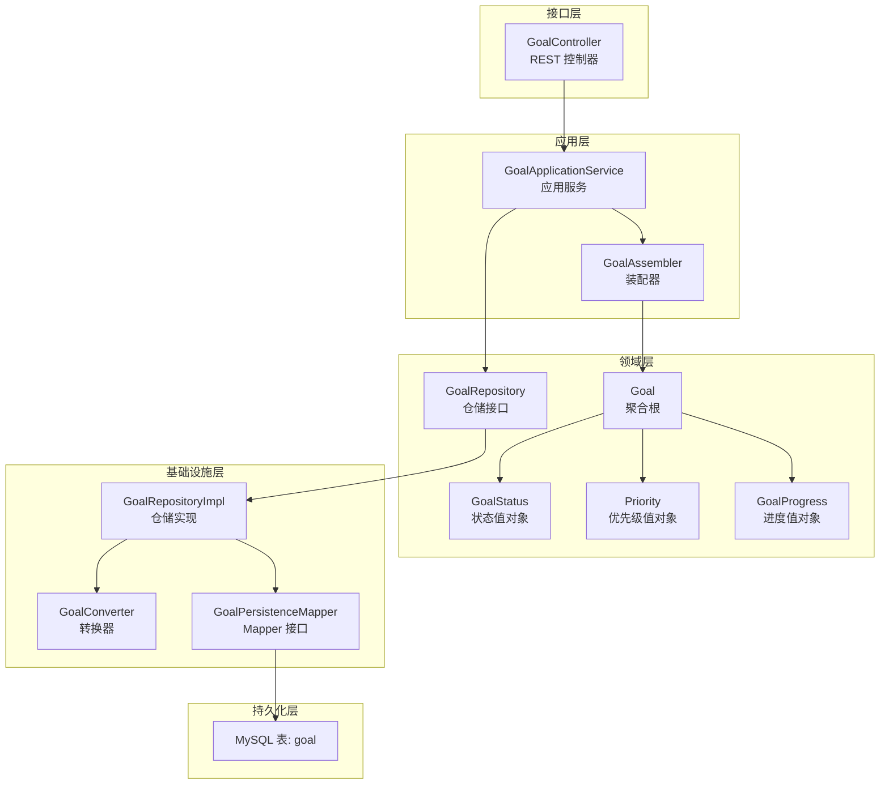
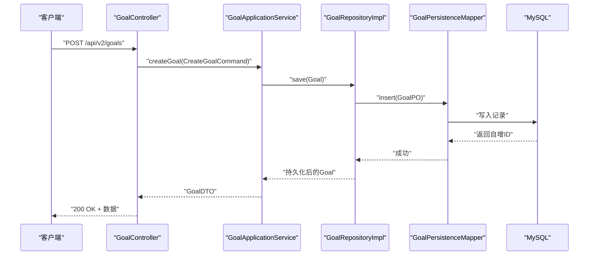
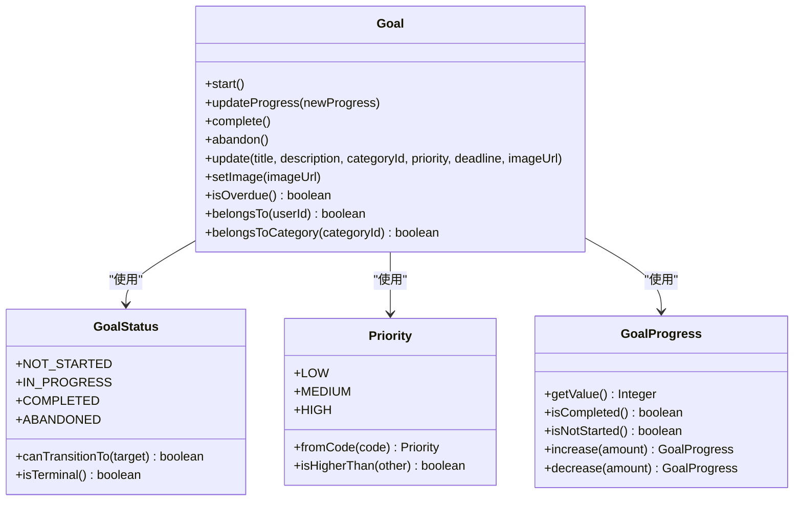
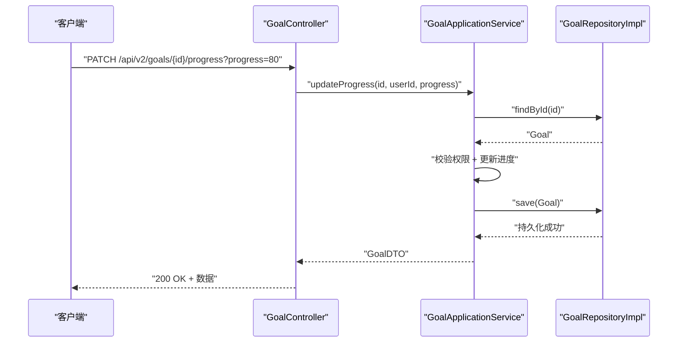
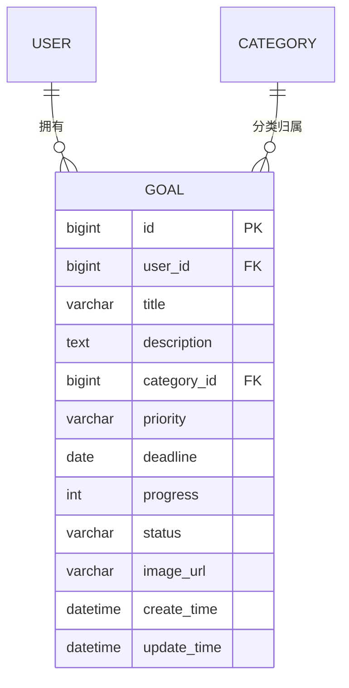

# 目标管理模块

<cite>
**本文档引用的文件**
- [GoalApplicationService.java](file://src/main/java/com/crazydream/application/goal/service/GoalApplicationService.java)
- [Goal.java](file://src/main/java/com/crazydream/domain/goal/model/aggregate/Goal.java)
- [GoalStatus.java](file://src/main/java/com/crazydream/domain/goal/model/valueobject/GoalStatus.java)
- [Priority.java](file://src/main/java/com/crazydream/domain/goal/model/valueobject/Priority.java)
- [GoalProgress.java](file://src/main/java/com/crazydream/domain/goal/model/valueobject/GoalProgress.java)
- [CreateGoalCommand.java](file://src/main/java/com/crazydream/application/goal/dto/CreateGoalCommand.java)
- [UpdateGoalCommand.java](file://src/main/java/com/crazydream/application/goal/dto/UpdateGoalCommand.java)
- [GoalDTO.java](file://src/main/java/com/crazydream/application/goal/dto/GoalDTO.java)
- [GoalController.java](file://src/main/java/com/crazydream/interfaces/goal/GoalController.java)
- [GoalRepository.java](file://src/main/java/com/crazydream/domain/goal/repository/GoalRepository.java)
- [GoalAssembler.java](file://src/main/java/com/crazydream/application/goal/assembler/GoalAssembler.java)
- [GoalConverter.java](file://src/main/java/com/crazydream/infrastructure/persistence/converter/GoalConverter.java)
- [GoalPersistenceMapper.java](file://src/main/java/com/crazydream/infrastructure/persistence/mapper/GoalPersistenceMapper.java)
- [GoalRepositoryImpl.java](file://src/main/java/com/crazydream/infrastructure/persistence/repository/GoalRepositoryImpl.java)
- [schema.sql](file://src/main/resources/schema.sql)
</cite>

## 目录
1. [简介](#简介)
2. [项目结构](#项目结构)
3. [核心组件](#核心组件)
4. [架构总览](#架构总览)
5. [详细组件分析](#详细组件分析)
6. [依赖关系分析](#依赖关系分析)
7. [性能考虑](#性能考虑)
8. [故障排查指南](#故障排查指南)
9. [结论](#结论)
10. [附录](#附录)

## 简介
本文件系统性地梳理目标管理模块的设计与实现，覆盖目标的创建、更新、删除、查询与状态管理；解释目标实体的业务规则（优先级、截止日期、进度追踪）；阐述状态转换规则与边界条件；描述目标与用户、分类的关系设计；提供完整的API接口说明（CRUD、状态更新、批量操作）；解释数据模型字段、校验规则与索引设计；给出进度计算与完成度统计方法，并提供使用示例与最佳实践。

## 项目结构
目标管理模块遵循分层架构与DDD思想，分为接口层、应用层、领域层、基础设施层与持久化层，职责清晰、耦合度低、可扩展性强。



图表来源
- [GoalController.java](file://src/main/java/com/crazydream/interfaces/goal/GoalController.java#L26-L288)
- [GoalApplicationService.java](file://src/main/java/com/crazydream/application/goal/service/GoalApplicationService.java#L31-L246)
- [GoalAssembler.java](file://src/main/java/com/crazydream/application/goal/assembler/GoalAssembler.java#L21-L87)
- [Goal.java](file://src/main/java/com/crazydream/domain/goal/model/aggregate/Goal.java#L17-L293)
- [GoalStatus.java](file://src/main/java/com/crazydream/domain/goal/model/valueobject/GoalStatus.java#L10-L64)
- [Priority.java](file://src/main/java/com/crazydream/domain/goal/model/valueobject/Priority.java#L10-L58)
- [GoalProgress.java](file://src/main/java/com/crazydream/domain/goal/model/valueobject/GoalProgress.java#L12-L78)
- [GoalRepository.java](file://src/main/java/com/crazydream/domain/goal/repository/GoalRepository.java#L18-L70)
- [GoalRepositoryImpl.java](file://src/main/java/com/crazydream/infrastructure/persistence/repository/GoalRepositoryImpl.java#L25-L112)
- [GoalConverter.java](file://src/main/java/com/crazydream/infrastructure/persistence/converter/GoalConverter.java#L15-L68)
- [GoalPersistenceMapper.java](file://src/main/java/com/crazydream/infrastructure/persistence/mapper/GoalPersistenceMapper.java#L16-L75)
- [schema.sql](file://src/main/resources/schema.sql#L38-L54)

章节来源
- [GoalController.java](file://src/main/java/com/crazydream/interfaces/goal/GoalController.java#L26-L288)
- [GoalApplicationService.java](file://src/main/java/com/crazydream/application/goal/service/GoalApplicationService.java#L31-L246)
- [GoalRepositoryImpl.java](file://src/main/java/com/crazydream/infrastructure/persistence/repository/GoalRepositoryImpl.java#L25-L112)

## 核心组件
- 接口层控制器：提供REST API，负责请求接入、鉴权上下文提取与响应封装。
- 应用服务：编排业务流程，协调领域对象与仓储，处理事务与跨域副作用（如成就检查）。
- 领域模型：Goal聚合根封装业务规则；值对象封装状态、优先级、进度等不变语义。
- 仓储接口与实现：定义数据访问契约与具体实现，桥接领域与持久化。
- 装配器与转换器：负责DTO与领域对象、PO之间的双向转换。
- 数据模型：MySQL表结构定义字段、约束与外键关系。

章节来源
- [GoalController.java](file://src/main/java/com/crazydream/interfaces/goal/GoalController.java#L26-L288)
- [GoalApplicationService.java](file://src/main/java/com/crazydream/application/goal/service/GoalApplicationService.java#L31-L246)
- [Goal.java](file://src/main/java/com/crazydream/domain/goal/model/aggregate/Goal.java#L17-L293)
- [GoalStatus.java](file://src/main/java/com/crazydream/domain/goal/model/valueobject/GoalStatus.java#L10-L64)
- [Priority.java](file://src/main/java/com/crazydream/domain/goal/model/valueobject/Priority.java#L10-L58)
- [GoalProgress.java](file://src/main/java/com/crazydream/domain/goal/model/valueobject/GoalProgress.java#L12-L78)
- [GoalRepository.java](file://src/main/java/com/crazydream/domain/goal/repository/GoalRepository.java#L18-L70)
- [GoalAssembler.java](file://src/main/java/com/crazydream/application/goal/assembler/GoalAssembler.java#L21-L87)
- [GoalConverter.java](file://src/main/java/com/crazydream/infrastructure/persistence/converter/GoalConverter.java#L15-L68)
- [GoalPersistenceMapper.java](file://src/main/java/com/crazydream/infrastructure/persistence/mapper/GoalPersistenceMapper.java#L16-L75)
- [schema.sql](file://src/main/resources/schema.sql#L38-L54)

## 架构总览
目标管理模块采用分层与DDD架构，接口层接收HTTP请求，应用层编排业务，领域层承载业务规则，仓储抽象连接数据访问，转换器与装配器保证数据形态一致。



图表来源
- [GoalController.java](file://src/main/java/com/crazydream/interfaces/goal/GoalController.java#L76-L91)
- [GoalApplicationService.java](file://src/main/java/com/crazydream/application/goal/service/GoalApplicationService.java#L44-L62)
- [GoalRepositoryImpl.java](file://src/main/java/com/crazydream/infrastructure/persistence/repository/GoalRepositoryImpl.java#L32-L46)
- [GoalPersistenceMapper.java](file://src/main/java/com/crazydream/infrastructure/persistence/mapper/GoalPersistenceMapper.java#L22-L27)
- [schema.sql](file://src/main/resources/schema.sql#L38-L54)

## 详细组件分析

### 1) 领域模型与业务规则
- 聚合根Goal封装目标的全部业务行为，包括状态转换、进度更新、截止日期判断、权限归属校验等。
- 值对象GoalStatus定义状态码与状态转换规则；Priority定义优先级等级与比较；GoalProgress封装0-100进度与边界校验。
- 关键业务规则：
  - 状态转换：未开始 → 进行中/已放弃；进行中 → 已完成/已放弃；已完成/已放弃为终态不可再转换。
  - 进度更新：若进度达100%，自动完成；若进度>0且状态为未开始，自动进入进行中。
  - 截止日期：仅在非终态且存在截止日期时才判定逾期。
  - 权限控制：所有修改/删除均需校验目标所属用户。



图表来源
- [Goal.java](file://src/main/java/com/crazydream/domain/goal/model/aggregate/Goal.java#L17-L293)
- [GoalStatus.java](file://src/main/java/com/crazydream/domain/goal/model/valueobject/GoalStatus.java#L10-L64)
- [Priority.java](file://src/main/java/com/crazydream/domain/goal/model/valueobject/Priority.java#L10-L58)
- [GoalProgress.java](file://src/main/java/com/crazydream/domain/goal/model/valueobject/GoalProgress.java#L12-L78)

章节来源
- [Goal.java](file://src/main/java/com/crazydream/domain/goal/model/aggregate/Goal.java#L106-L214)
- [GoalStatus.java](file://src/main/java/com/crazydream/domain/goal/model/valueobject/GoalStatus.java#L45-L62)
- [Priority.java](file://src/main/java/com/crazydream/domain/goal/model/valueobject/Priority.java#L25-L56)
- [GoalProgress.java](file://src/main/java/com/crazydream/domain/goal/model/valueobject/GoalProgress.java#L18-L58)

### 2) 应用服务与API编排
- 应用服务负责事务边界、权限校验、调用仓储与触发跨域事件（如成就检查）。
- 提供以下能力：
  - CRUD：创建、更新、删除、按用户/分类查询、按ID查询。
  - 状态管理：更新进度、完成目标。
  - 辅助查询：最近更新目标、今日提醒目标、目标统计。
  - 批量操作：批量删除。



图表来源
- [GoalController.java](file://src/main/java/com/crazydream/interfaces/goal/GoalController.java#L204-L219)
- [GoalApplicationService.java](file://src/main/java/com/crazydream/application/goal/service/GoalApplicationService.java#L156-L186)
- [GoalRepositoryImpl.java](file://src/main/java/com/crazydream/infrastructure/persistence/repository/GoalRepositoryImpl.java#L48-L52)

章节来源
- [GoalApplicationService.java](file://src/main/java/com/crazydream/application/goal/service/GoalApplicationService.java#L44-L244)
- [GoalController.java](file://src/main/java/com/crazydream/interfaces/goal/GoalController.java#L76-L286)

### 3) 数据模型与持久化
- MySQL表goal包含用户ID、标题、描述、分类ID、优先级、截止日期、进度、状态、图片URL及时间戳。
- 外键约束：user_id指向用户表，category_id指向分类表（删除时置空）。
- 仓储接口定义了常用查询与统计方法，实现类通过Mapper与转换器完成PO与领域对象互转。



图表来源
- [schema.sql](file://src/main/resources/schema.sql#L38-L54)
- [GoalPersistenceMapper.java](file://src/main/java/com/crazydream/infrastructure/persistence/mapper/GoalPersistenceMapper.java#L16-L75)
- [GoalRepositoryImpl.java](file://src/main/java/com/crazydream/infrastructure/persistence/repository/GoalRepositoryImpl.java#L25-L112)

章节来源
- [schema.sql](file://src/main/resources/schema.sql#L38-L54)
- [GoalRepository.java](file://src/main/java/com/crazydream/domain/goal/repository/GoalRepository.java#L18-L70)
- [GoalRepositoryImpl.java](file://src/main/java/com/crazydream/infrastructure/persistence/repository/GoalRepositoryImpl.java#L25-L112)
- [GoalPersistenceMapper.java](file://src/main/java/com/crazydream/infrastructure/persistence/mapper/GoalPersistenceMapper.java#L16-L75)

### 4) API接口文档
- 基础路径：/api/v2/goals
- 认证：通过SecurityContextHolder获取当前用户ID，匿名用户使用默认用户ID。

通用响应结构
- 成功：{ "code": 200, "message": "success", "data": ... }
- 失败：{ "code": 4xx/5xx, "message": "...", "data": null }

接口定义
- 创建目标
  - 方法：POST
  - 路径：/api/v2/goals
  - 请求体：CreateGoalCommand
  - 响应：GoalDTO
- 更新目标
  - 方法：PUT
  - 路径：/api/v2/goals/{id}
  - 路径参数：id
  - 请求体：UpdateGoalCommand
  - 响应：GoalDTO
- 查询用户所有目标
  - 方法：GET
  - 路径：/api/v2/goals
  - 响应：List<GoalDTO>
- 按ID查询目标
  - 方法：GET
  - 路径：/api/v2/goals/{id}
  - 路径参数：id
  - 响应：GoalDTO
- 按分类查询目标
  - 方法：GET
  - 路径：/api/v2/goals/category/{categoryId}
  - 路径参数：categoryId
  - 响应：List<GoalDTO>
- 删除目标
  - 方法：DELETE
  - 路径：/api/v2/goals/{id}
  - 路径参数：id
  - 响应：Boolean
- 批量删除
  - 方法：DELETE
  - 路径：/api/v2/goals/batch
  - 请求体：List<Long> ids
  - 响应：Integer（删除数量）
- 更新进度
  - 方法：PATCH
  - 路径：/api/v2/goals/{id}/progress
  - 路径参数：id
  - 查询参数：progress（0-100整数）
  - 响应：GoalDTO
- 完成目标
  - 方法：PATCH
  - 路径：/api/v2/goals/{id}/complete
  - 路径参数：id
  - 响应：GoalDTO
- 最近更新目标
  - 方法：GET
  - 路径：/api/v2/goals/recent
  - 查询参数：limit，默认10
  - 响应：List<GoalDTO>
- 今日提醒目标
  - 方法：GET
  - 路径：/api/v2/goals/today-reminders
  - 查询参数：date（YYYY-MM-DD，可选，默认当天）
  - 响应：List<GoalDTO>
- 目标统计
  - 方法：GET
  - 路径：/api/v2/goals/statistics
  - 响应：Map<String, Integer>（状态码→数量）

章节来源
- [GoalController.java](file://src/main/java/com/crazydream/interfaces/goal/GoalController.java#L76-L286)
- [CreateGoalCommand.java](file://src/main/java/com/crazydream/application/goal/dto/CreateGoalCommand.java#L12-L21)
- [UpdateGoalCommand.java](file://src/main/java/com/crazydream/application/goal/dto/UpdateGoalCommand.java#L12-L23)
- [GoalDTO.java](file://src/main/java/com/crazydream/application/goal/dto/GoalDTO.java#L13-L28)

### 5) 进度计算与完成度统计
- 进度计算
  - 进度值域0-100，超出范围抛出异常；达到100%自动完成。
  - 若进度>0且状态为未开始，自动进入进行中。
- 完成度统计
  - 按状态分组统计数量，返回Map<状态码, 数量>。

章节来源
- [GoalProgress.java](file://src/main/java/com/crazydream/domain/goal/model/valueobject/GoalProgress.java#L18-L58)
- [Goal.java](file://src/main/java/com/crazydream/domain/goal/model/aggregate/Goal.java#L122-L140)
- [GoalApplicationService.java](file://src/main/java/com/crazydream/application/goal/service/GoalApplicationService.java#L235-L244)

### 6) 状态转换规则与业务规则实现
- 状态转换矩阵
  - 未开始 → 进行中 或 已放弃
  - 进行中 → 已完成 或 已放弃
  - 已完成/已放弃 → 不可再转换
- 终态判定：已完成或已放弃视为终态，不可再转换。
- 异常处理：非法状态转换与对终态的修改会抛出异常。

章节来源
- [GoalStatus.java](file://src/main/java/com/crazydream/domain/goal/model/valueobject/GoalStatus.java#L45-L62)
- [Goal.java](file://src/main/java/com/crazydream/domain/goal/model/aggregate/Goal.java#L111-L163)

### 7) 关系设计：目标与用户、分类
- 用户关系：Goal持有UserId，提供belongsTo校验，确保操作权限。
- 分类关系：Goal持有CategoryId，支持按分类过滤查询。
- 外键约束：category_id删除时置空，避免级联破坏目标完整性。

章节来源
- [Goal.java](file://src/main/java/com/crazydream/domain/goal/model/aggregate/Goal.java#L204-L213)
- [GoalRepository.java](file://src/main/java/com/crazydream/domain/goal/repository/GoalRepository.java#L36-L38)
- [schema.sql](file://src/main/resources/schema.sql#L52-L53)

### 8) 使用示例与最佳实践
- 创建目标
  - 步骤：准备CreateGoalCommand（含userId、title、priority、deadline等），调用POST /api/v2/goals。
  - 注意：priority支持low/medium/high，deadline为空表示无截止日期。
- 更新目标
  - 步骤：准备UpdateGoalCommand（含id、userId、title等），调用PUT /api/v2/goals/{id}。
  - 注意：仅目标所属用户可更新；禁止对终态目标更新。
- 更新进度
  - 步骤：调用PATCH /api/v2/goals/{id}/progress?progress=N。
  - 注意：N应在0-100；达到100%自动完成。
- 完成目标
  - 步骤：调用PATCH /api/v2/goals/{id}/complete。
  - 注意：仅允许对进行中目标完成。
- 批量删除
  - 步骤：调用DELETE /api/v2/goals/batch，传入id列表。
  - 注意：建议先逐个校验权限，生产环境谨慎使用批量删除。

章节来源
- [GoalController.java](file://src/main/java/com/crazydream/interfaces/goal/GoalController.java#L76-L200)
- [GoalApplicationService.java](file://src/main/java/com/crazydream/application/goal/service/GoalApplicationService.java#L67-L151)

## 依赖关系分析
- 控制器依赖应用服务；应用服务依赖仓储接口与装配器；仓储实现依赖转换器与Mapper；Mapper映射到数据库表。
- 关键依赖链路：
  - GoalController → GoalApplicationService → GoalRepository → GoalRepositoryImpl → GoalPersistenceMapper → MySQL
  - GoalAssembler ↔ Goal（DTO↔领域对象）
  - GoalConverter ↔ GoalPO（领域对象↔持久化对象）

```mermaid
graph LR
Ctrl["GoalController"] --> App["GoalApplicationService"]
App --> Repo["GoalRepository"]
Repo --> Impl["GoalRepositoryImpl"]
Impl --> Conv["GoalConverter"]
Impl --> Map["GoalPersistenceMapper"]
Map --> DB["MySQL goal 表"]
App --> Asm["GoalAssembler"]
Asm <- --> E["Goal 聚合根"]
```

图表来源
- [GoalController.java](file://src/main/java/com/crazydream/interfaces/goal/GoalController.java#L26-L288)
- [GoalApplicationService.java](file://src/main/java/com/crazydream/application/goal/service/GoalApplicationService.java#L31-L246)
- [GoalRepositoryImpl.java](file://src/main/java/com/crazydream/infrastructure/persistence/repository/GoalRepositoryImpl.java#L25-L112)
- [GoalPersistenceMapper.java](file://src/main/java/com/crazydream/infrastructure/persistence/mapper/GoalPersistenceMapper.java#L16-L75)
- [GoalAssembler.java](file://src/main/java/com/crazydream/application/goal/assembler/GoalAssembler.java#L21-L87)
- [GoalConverter.java](file://src/main/java/com/crazydream/infrastructure/persistence/converter/GoalConverter.java#L15-L68)

章节来源
- [GoalController.java](file://src/main/java/com/crazydream/interfaces/goal/GoalController.java#L26-L288)
- [GoalApplicationService.java](file://src/main/java/com/crazydream/application/goal/service/GoalApplicationService.java#L31-L246)
- [GoalRepositoryImpl.java](file://src/main/java/com/crazydream/infrastructure/persistence/repository/GoalRepositoryImpl.java#L25-L112)

## 性能考虑
- 查询优化
  - 按用户ID查询：利用索引user_id；按分类+用户查询：复合索引(category_id, user_id)更优。
  - 最近更新与今日提醒：按时间倒序查询，建议在create_time/update_time上建立索引。
- 写入优化
  - 批量删除：一次性提交多个ID，减少往返；注意权限校验成本。
  - 进度更新：单条更新，尽量避免频繁写入。
- 缓存策略
  - 可对热门用户的近期目标结果做缓存，降低数据库压力。
- 并发控制
  - 事务边界明确，避免长事务；对终态检查与状态转换在应用层统一处理，减少并发冲突。

## 故障排查指南
- 常见错误与定位
  - 400 参数错误：创建/更新/进度参数非法（如progress越界、priority非法、deadline格式错误）。
  - 404 目标不存在：查询/更新/删除时目标ID无效。
  - 400 权限不足：非目标所属用户尝试操作。
  - 400 状态非法：对终态目标进行不允许的操作（如更新、开始）。
  - 500 系统错误：数据库异常、转换异常、成就检查失败等。
- 日志与监控
  - 控制器与应用服务均记录错误日志，便于定位问题。
  - 建议增加埋点统计各接口QPS、耗时与错误率。

章节来源
- [GoalController.java](file://src/main/java/com/crazydream/interfaces/goal/GoalController.java#L84-L112)
- [GoalApplicationService.java](file://src/main/java/com/crazydream/application/goal/service/GoalApplicationService.java#L73-L76)
- [Goal.java](file://src/main/java/com/crazydream/domain/goal/model/aggregate/Goal.java#L122-L125)

## 结论
目标管理模块以DDD为核心，通过清晰的分层与职责划分，实现了目标的全生命周期管理。状态机设计严谨，进度与截止日期规则明确，权限与终态保护完善。接口层提供完备的REST API，应用层编排业务流程，仓储与转换器解耦持久化细节。建议在生产环境中强化权限校验与批量操作的安全性，并结合索引与缓存提升查询性能。

## 附录

### A. 字段定义与校验规则
- 字段清单（来自表goal）
  - id：主键，自增
  - user_id：外键，目标所属用户
  - title：字符串，必填
  - description：文本，可空
  - category_id：外键，可空（删除置空）
  - priority：字符串，取值low/medium/high，默认medium
  - deadline：日期，可空
  - progress：整数，0-100，默认0
  - status：字符串，取值not_started/in_progress/completed/abandoned，默认not_started
  - image_url：字符串，可空
  - create_time/update_time：时间戳，默认当前时间

- 校验规则
  - progress范围：0-100，越界抛异常
  - 状态转换：严格遵循状态机，终态不可再转换
  - 权限：所有变更需校验用户归属

章节来源
- [schema.sql](file://src/main/resources/schema.sql#L38-L54)
- [GoalProgress.java](file://src/main/java/com/crazydream/domain/goal/model/valueobject/GoalProgress.java#L18-L26)
- [GoalStatus.java](file://src/main/java/com/crazydream/domain/goal/model/valueobject/GoalStatus.java#L45-L57)

### B. 索引设计建议
- 唯一/普通索引
  - user_id：高频过滤字段，建议建立索引
  - category_id：分类过滤字段，建议建立索引
  - create_time/update_time：排序与分页常用，建议建立索引
  - 复合索引：category_id + user_id，用于按分类筛选目标
- 外键
  - user_id → user(id)，级联删除
  - category_id → category(id)，删除置空

章节来源
- [schema.sql](file://src/main/resources/schema.sql#L52-L53)
- [GoalRepositoryImpl.java](file://src/main/java/com/crazydream/infrastructure/persistence/repository/GoalRepositoryImpl.java#L55-L71)