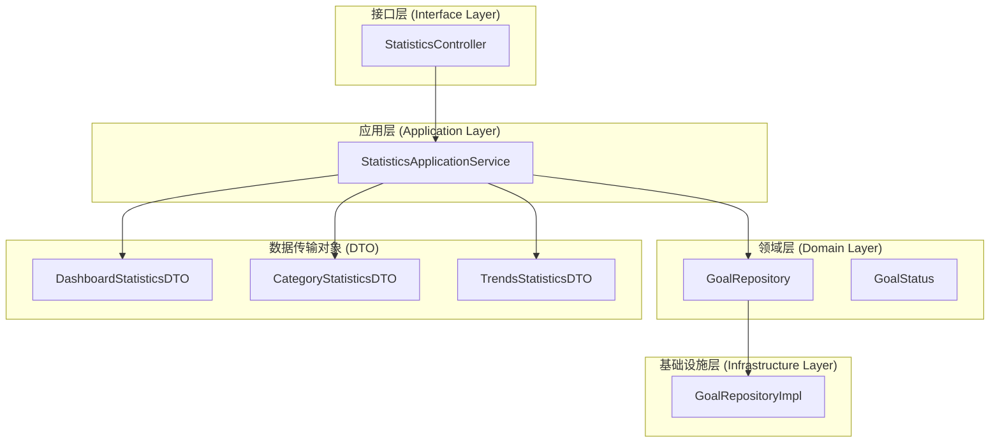
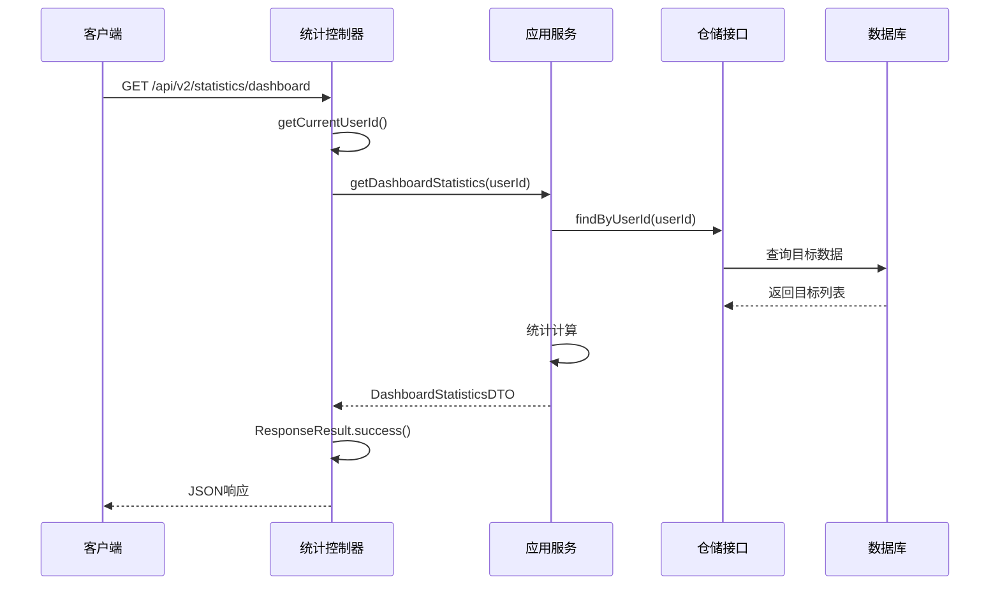
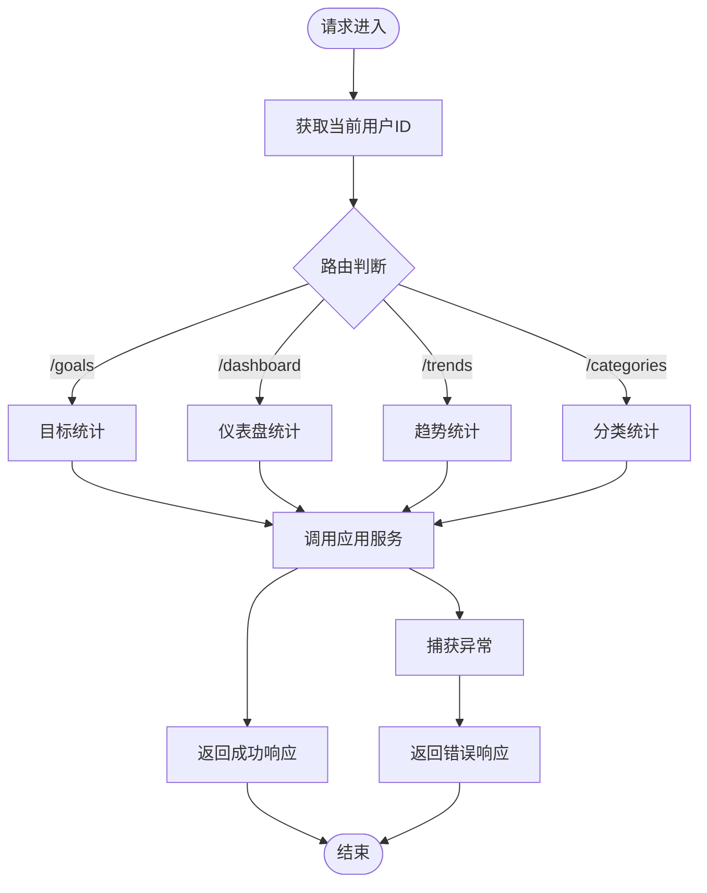
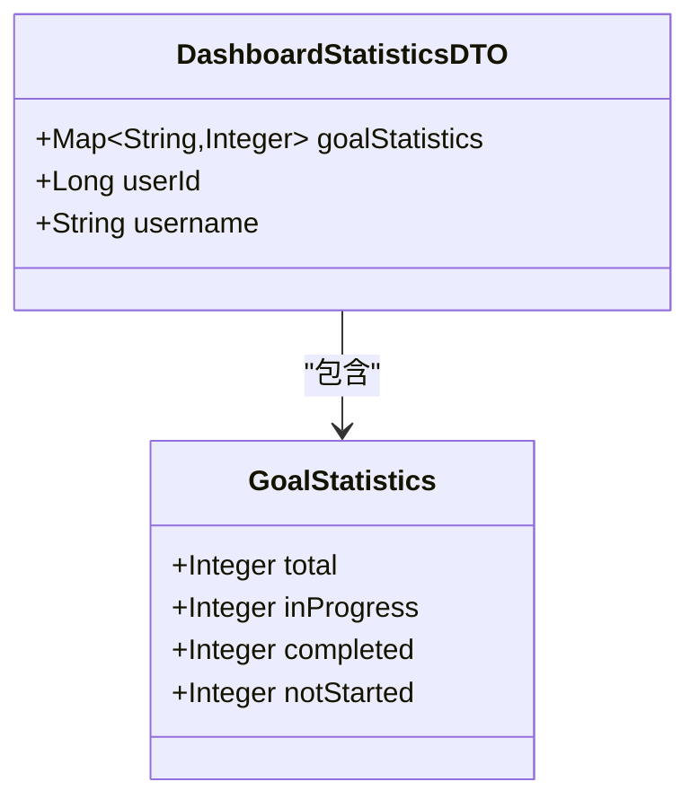
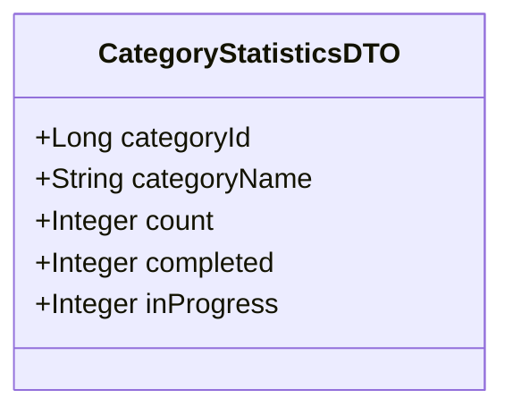
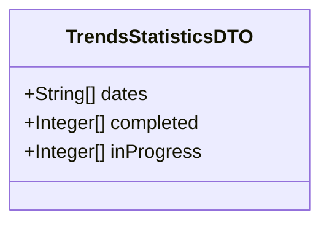
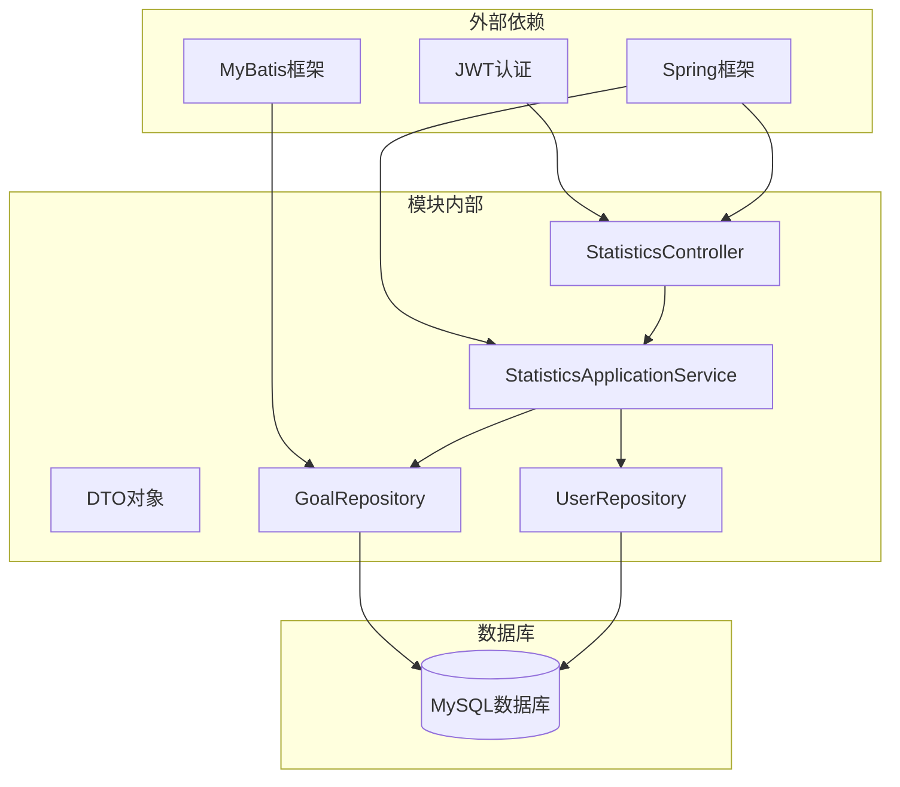
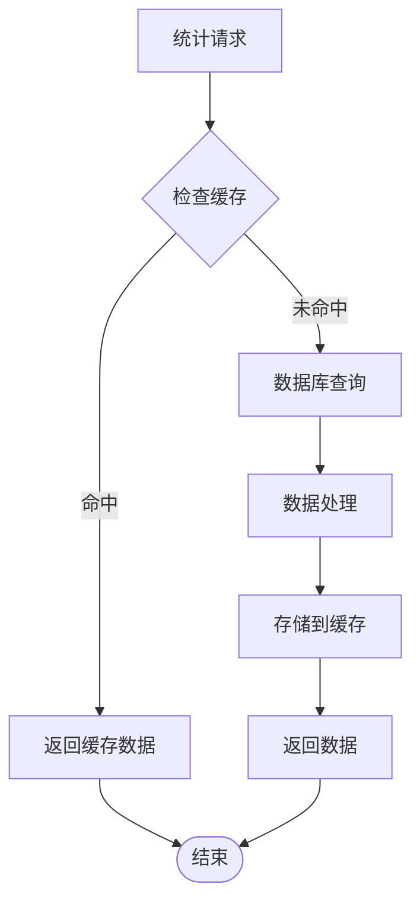

# 统计分析模块

<cite>
**本文档引用的文件**
- [StatisticsApplicationService.java](file://src/main/java/com/crazydream/application/statistics/service/StatisticsApplicationService.java)
- [StatisticsController.java](file://src/main/java/com/crazydream/interfaces/statistics/StatisticsController.java)
- [DashboardStatisticsDTO.java](file://src/main/java/com/crazydream/application/statistics/dto/DashboardStatisticsDTO.java)
- [CategoryStatisticsDTO.java](file://src/main/java/com/crazydream/application/statistics/dto/CategoryStatisticsDTO.java)
- [TrendsStatisticsDTO.java](file://src/main/java/com/crazydream/application/statistics/dto/TrendsStatisticsDTO.java)
- [GoalRepository.java](file://src/main/java/com/crazydream/domain/goal/repository/GoalRepository.java)
- [GoalRepositoryImpl.java](file://src/main/java/com/crazydream/infrastructure/persistence/repository/GoalRepositoryImpl.java)
- [GoalStatus.java](file://src/main/java/com/crazydream/domain/goal/model/valueobject/GoalStatus.java)
- [application.yml](file://src/main/resources/application.yml)
- [ResponseResult.java](file://src/main/java/com/crazydream/utils/ResponseResult.java)
- [api-documentation.md](file://api-documentation.md)
</cite>

## 目录
1. [简介](#简介)
2. [项目结构](#项目结构)
3. [核心组件](#核心组件)
4. [架构概览](#架构概览)
5. [详细组件分析](#详细组件分析)
6. [依赖关系分析](#依赖关系分析)
7. [性能考虑](#性能考虑)
8. [故障排除指南](#故障排除指南)
9. [结论](#结论)
10. [附录](#附录)

## 简介

统计分析模块是CrazyDream项目中的一个核心功能模块，负责为用户提供全面的统计数据展示、分类统计和趋势分析能力。该模块基于DDD（领域驱动设计）和COLA四层架构构建，实现了清晰的职责分离和良好的可扩展性。

该模块的主要功能包括：
- **仪表盘统计数据**：提供用户目标的整体统计概览
- **分类统计**：按目标分类维度进行统计分析
- **趋势分析**：展示目标完成情况的时间趋势
- **实时数据聚合**：从数据库中实时获取和聚合统计数据

## 项目结构

统计分析模块遵循CrazyDream项目的标准目录结构，采用分层架构设计：



**图表来源**
- [StatisticsController.java](file://src/main/java/com/crazydream/interfaces/statistics/StatisticsController.java#L25-L135)
- [StatisticsApplicationService.java](file://src/main/java/com/crazydream/application/statistics/service/StatisticsApplicationService.java#L18-L106)
- [GoalRepository.java](file://src/main/java/com/crazydream/domain/goal/repository/GoalRepository.java#L18-L70)

**章节来源**
- [StatisticsController.java](file://src/main/java/com/crazydream/interfaces/statistics/StatisticsController.java#L1-L135)
- [StatisticsApplicationService.java](file://src/main/java/com/crazydream/application/statistics/service/StatisticsApplicationService.java#L1-L106)

## 核心组件

统计分析模块由四个主要组件构成，每个组件都有明确的职责和边界：

### 1. 统计控制器 (StatisticsController)
负责处理HTTP请求，接收用户参数，调用应用服务，并返回标准化的响应结果。

### 2. 统计应用服务 (StatisticsApplicationService)
实现具体的统计逻辑，包括数据聚合、计算和转换为DTO格式。

### 3. 数据传输对象 (DTO)
定义统计结果的数据结构，确保前后端数据传递的一致性和完整性。

### 4. 仓储接口 (GoalRepository)
抽象数据访问层，定义目标数据的查询操作规范。

**章节来源**
- [StatisticsController.java](file://src/main/java/com/crazydream/interfaces/statistics/StatisticsController.java#L25-L135)
- [StatisticsApplicationService.java](file://src/main/java/com/crazydream/application/statistics/service/StatisticsApplicationService.java#L18-L106)
- [DashboardStatisticsDTO.java](file://src/main/java/com/crazydream/application/statistics/dto/DashboardStatisticsDTO.java#L12-L16)
- [CategoryStatisticsDTO.java](file://src/main/java/com/crazydream/application/statistics/dto/CategoryStatisticsDTO.java#L10-L16)
- [TrendsStatisticsDTO.java](file://src/main/java/com/crazydream/application/statistics/dto/TrendsStatisticsDTO.java#L12-L16)

## 架构概览

统计分析模块采用经典的四层架构模式，实现了关注点分离和职责清晰的软件设计：



**图表来源**
- [StatisticsController.java](file://src/main/java/com/crazydream/interfaces/statistics/StatisticsController.java#L90-L101)
- [StatisticsApplicationService.java](file://src/main/java/com/crazydream/application/statistics/service/StatisticsApplicationService.java#L44-L55)
- [GoalRepository.java](file://src/main/java/com/crazydream/domain/goal/repository/GoalRepository.java#L30-L38)

该架构的优势包括：
- **清晰的职责分离**：每层专注于特定的职责
- **良好的可测试性**：接口抽象使得单元测试更加容易
- **易于维护和扩展**：修改某一层不会影响其他层
- **符合DDD最佳实践**：使用聚合根、值对象等概念建模

## 详细组件分析

### 统计控制器 (StatisticsController)

统计控制器是模块的入口点，负责处理HTTP请求和响应封装：

#### 主要功能
- **用户身份验证**：从安全上下文中提取当前用户ID
- **请求路由**：根据不同的统计类型分发到相应的处理方法
- **错误处理**：捕获异常并返回标准化的错误响应
- **响应封装**：使用统一的ResponseResult格式返回数据

#### 关键方法分析



**图表来源**
- [StatisticsController.java](file://src/main/java/com/crazydream/interfaces/statistics/StatisticsController.java#L74-L133)

**章节来源**
- [StatisticsController.java](file://src/main/java/com/crazydream/interfaces/statistics/StatisticsController.java#L25-L135)

### 统计应用服务 (StatisticsApplicationService)

统计应用服务是模块的核心业务逻辑实现，负责具体的统计计算和数据聚合：

#### 统计类型及实现

##### 1. 目标统计 (getGoalStatistics)
计算用户目标的基本统计信息：
- 总目标数
- 进行中目标数
- 已完成目标数
- 未开始目标数

##### 2. 仪表盘统计 (getDashboardStatistics)
整合用户信息和目标统计，提供综合概览：
- 用户名显示
- 目标状态分布
- 用户ID标识

##### 3. 分类统计 (getCategoryStatistics)
按目标分类进行统计分析：
- 按分类ID分组
- 计算各类别的总数、完成数、进行中数
- 生成分类统计DTO列表

##### 4. 趋势统计 (getTrendsStatistics)
时间序列统计分析（简化实现）：
- 当前实现返回空数据
- 预留未来扩展空间

**章节来源**
- [StatisticsApplicationService.java](file://src/main/java/com/crazydream/application/statistics/service/StatisticsApplicationService.java#L26-L104)

### 数据传输对象 (DTO)

统计模块使用专门的DTO来封装统计结果，确保数据结构的标准化：

#### DashboardStatisticsDTO


**图表来源**
- [DashboardStatisticsDTO.java](file://src/main/java/com/crazydream/application/statistics/dto/DashboardStatisticsDTO.java#L12-L16)

#### CategoryStatisticsDTO


**图表来源**
- [CategoryStatisticsDTO.java](file://src/main/java/com/crazydream/application/statistics/dto/CategoryStatisticsDTO.java#L10-L16)

#### TrendsStatisticsDTO


**图表来源**
- [TrendsStatisticsDTO.java](file://src/main/java/com/crazydream/application/statistics/dto/TrendsStatisticsDTO.java#L12-L16)

**章节来源**
- [DashboardStatisticsDTO.java](file://src/main/java/com/crazydream/application/statistics/dto/DashboardStatisticsDTO.java#L1-L17)
- [CategoryStatisticsDTO.java](file://src/main/java/com/crazydream/application/statistics/dto/CategoryStatisticsDTO.java#L1-L17)
- [TrendsStatisticsDTO.java](file://src/main/java/com/crazydream/application/statistics/dto/TrendsStatisticsDTO.java#L1-L17)

### 仓储接口与实现

统计模块通过仓储模式实现数据访问的抽象化：

#### GoalRepository接口
定义了目标数据的查询操作：
- `findByUserId()`：按用户ID查询所有目标
- `findByCategoryIdAndUserId()`：按分类和用户查询目标
- `countCompletedByUserId()`：统计用户已完成目标数
- `countActiveByUserId()`：统计用户有效目标数

#### GoalRepositoryImpl实现
基于MyBatis的数据库访问实现：
- 将领域模型转换为持久化对象
- 执行SQL查询并返回领域对象
- 支持批量操作和高级查询

**章节来源**
- [GoalRepository.java](file://src/main/java/com/crazydream/domain/goal/repository/GoalRepository.java#L18-L70)
- [GoalRepositoryImpl.java](file://src/main/java/com/crazydream/infrastructure/persistence/repository/GoalRepositoryImpl.java#L25-L112)

## 依赖关系分析

统计分析模块的依赖关系体现了清晰的分层架构设计：



**图表来源**
- [StatisticsController.java](file://src/main/java/com/crazydream/interfaces/statistics/StatisticsController.java#L8-L16)
- [StatisticsApplicationService.java](file://src/main/java/com/crazydream/application/statistics/service/StatisticsApplicationService.java#L11-L24)

### 关键依赖特性

1. **松耦合设计**：通过接口抽象实现依赖注入
2. **单一职责原则**：每个组件专注于特定的职责
3. **可替换性**：仓储接口允许不同的实现
4. **测试友好**：接口抽象便于单元测试

**章节来源**
- [StatisticsController.java](file://src/main/java/com/crazydream/interfaces/statistics/StatisticsController.java#L1-L135)
- [StatisticsApplicationService.java](file://src/main/java/com/crazydream/application/statistics/service/StatisticsApplicationService.java#L1-L106)

## 性能考虑

统计分析模块在设计时充分考虑了性能优化和可扩展性：

### 1. 数据库查询优化
- 使用`findByUserId()`一次性获取用户所有目标
- 避免N+1查询问题
- 利用数据库索引优化查询性能

### 2. 内存使用优化
- 使用流式处理减少内存占用
- 及时释放不需要的对象引用
- 避免重复的数据拷贝

### 3. 缓存策略建议
虽然当前实现未包含缓存，但可以考虑以下优化方案：



### 4. 并发处理
- 使用线程安全的数据结构
- 避免共享可变状态
- 考虑使用读写锁优化并发访问

## 故障排除指南

### 常见问题及解决方案

#### 1. 用户认证问题
**症状**：返回默认用户ID或认证失败
**原因**：
- 缺少JWT Token
- Token格式不正确
- 用户名格式异常

**解决方案**：
- 确保请求头包含正确的Authorization头
- 验证JWT Token的有效性
- 检查用户ID的格式和范围

#### 2. 数据库连接问题
**症状**：统计查询超时或失败
**原因**：
- 数据库连接池耗尽
- SQL查询性能问题
- 数据库服务器不可达

**解决方案**：
- 检查数据库连接配置
- 优化慢查询语句
- 增加连接池大小

#### 3. 统计数据异常
**症状**：统计结果不准确或为空
**原因**：
- 目标状态数据异常
- 分类关联数据缺失
- 权限控制问题

**解决方案**：
- 验证目标状态枚举值
- 检查分类ID的有效性
- 确认用户权限范围

**章节来源**
- [StatisticsController.java](file://src/main/java/com/crazydream/interfaces/statistics/StatisticsController.java#L40-L69)
- [application.yml](file://src/main/resources/application.yml#L66-L75)

## 结论

统计分析模块是一个设计良好、职责清晰的功能模块，它成功地实现了以下目标：

### 主要成就
1. **架构设计优秀**：采用DDD和COLA四层架构，职责分离明确
2. **扩展性强**：接口抽象设计便于功能扩展和维护
3. **性能考虑周到**：关注查询优化和内存使用
4. **错误处理完善**：提供统一的异常处理和响应格式

### 技术亮点
- **统一响应格式**：使用ResponseResult确保API一致性
- **类型安全**：利用Java泛型和枚举类型
- **测试友好**：接口抽象便于单元测试和集成测试
- **配置灵活**：支持多环境配置和动态参数

### 改进建议
1. **实现趋势统计**：完善时间序列分析功能
2. **添加缓存机制**：提升高并发场景下的性能
3. **增强错误监控**：添加更详细的日志和监控
4. **扩展统计维度**：支持更多自定义统计指标

该模块为CrazyDream项目提供了坚实的数据统计基础，为后续的功能扩展和性能优化奠定了良好的技术基础。

## 附录

### API接口文档

#### 1. 获取目标统计
- **URL**: `/api/v2/statistics/goals`
- **方法**: `GET`
- **认证**: 需要JWT Token
- **响应**: `Map<String, Integer>`

#### 2. 获取仪表盘统计
- **URL**: `/api/v2/statistics/dashboard`
- **方法**: `GET`
- **认证**: 需要JWT Token
- **响应**: `DashboardStatisticsDTO`

#### 3. 获取趋势统计
- **URL**: `/api/v2/statistics/trends`
- **方法**: `GET`
- **认证**: 需要JWT Token
- **响应**: `TrendsStatisticsDTO`

#### 4. 获取分类统计
- **URL**: `/api/v2/statistics/categories`
- **方法**: `GET`
- **认证**: 需要JWT Token
- **响应**: `List<CategoryStatisticsDTO>`

### 统计指标说明

#### 目标状态指标
- **total**: 目标总数
- **inProgress**: 进行中目标数
- **completed**: 已完成目标数
- **notStarted**: 未开始目标数

#### 分类统计指标
- **count**: 分类下目标总数
- **completed**: 分类下已完成目标数
- **inProgress**: 分类下进行中目标数

### 配置说明

#### 安全配置
```yaml
security:
  auth:
    disabled: true
  test:
    default-user-id: 1
```

#### JWT配置
```yaml
jwt:
  secret: ${JWT_SECRET:your-secret-key}
  expiration: ${JWT_EXPIRATION:86400}
  header: Authorization
  prefix: "Bearer "
```

**章节来源**
- [api-documentation.md](file://api-documentation.md#L1-L800)
- [application.yml](file://src/main/resources/application.yml#L66-L75)