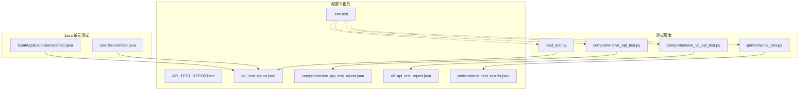
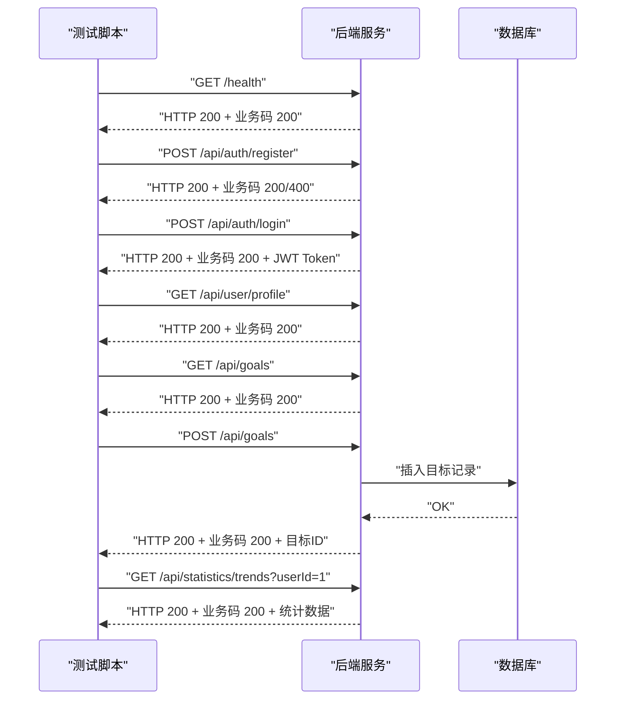
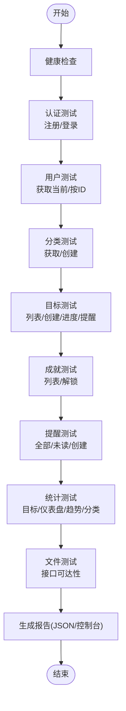
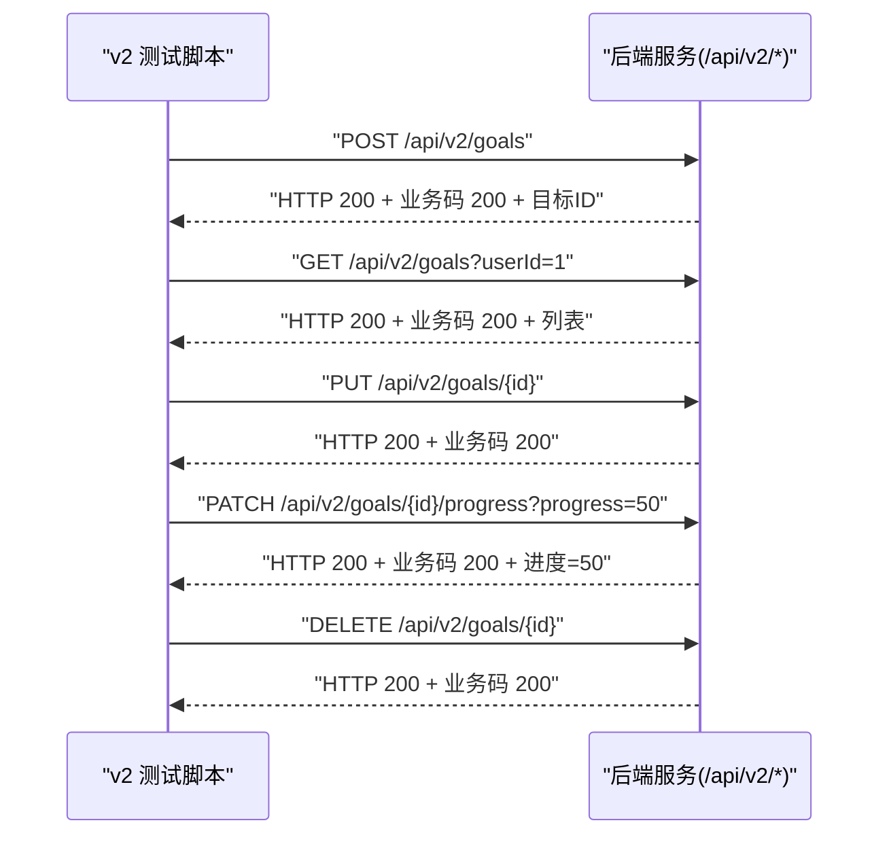
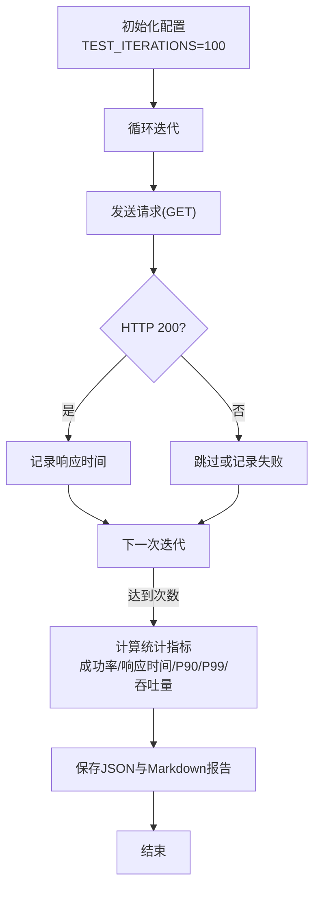
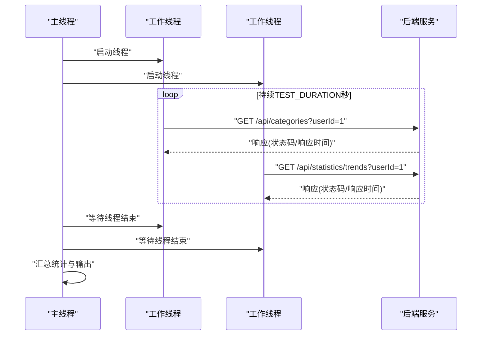
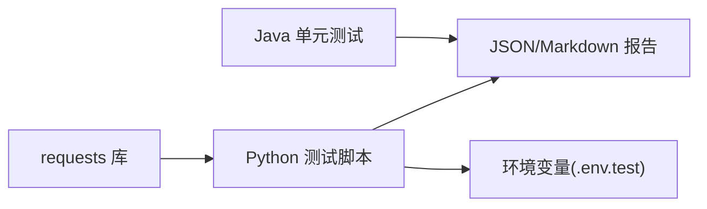

# API 测试

<cite>
**本文引用的文件**
- [comprehensive_api_test.py](file://comprehensive_api_test.py)
- [comprehensive_v2_api_test.py](file://comprehensive_v2_api_test.py)
- [load_test.py](file://load_test.py)
- [performance_test.py](file://performance_test.py)
- [API_TEST_REPORT.md](file://API_TEST_REPORT.md)
- [api_test_report.json](file://api_test_report_json)
- [comprehensive_api_test_report.json](file://comprehensive_api_test_report.json)
- [v2_api_test_report.json](file://v2_api_test_report.json)
- [performance_test_results.json](file://performance_test_results.json)
- [.env.test](file://.env.test)
- [README.md](file://README.md)
- [UserServiceTest.java](file://src/test/java/com/crazydream/service/UserServiceTest.java)
- [GoalApplicationServiceTest.java](file://src/test/java/com/crazydream/application/goal/GoalApplicationServiceTest.java)
</cite>

## 目录
1. [引言](#引言)
2. [项目结构](#项目结构)
3. [核心组件](#核心组件)
4. [架构总览](#架构总览)
5. [详细组件分析](#详细组件分析)
6. [依赖关系分析](#依赖关系分析)
7. [性能考量](#性能考量)
8. [故障排查指南](#故障排查指南)
9. [结论](#结论)
10. [附录](#附录)

## 引言
本文件面向 CrazyDream 项目的 API 测试，系统化梳理 Python 自动化测试脚本的编写与执行、测试用例设计与批量执行策略、测试报告生成与分析方法（含成功率、模块统计、性能指标与错误日志），并给出认证测试、功能测试、边界测试与错误处理测试的完整流程建议。同时提供测试数据管理、环境配置与测试结果验证的最佳实践，展示如何基于测试报告进行质量评估与持续改进。

## 项目结构
CrazyDream 后端采用 DDD + COLA 四层架构，对外提供 v2 API（/api/v2/*）与通用 API（认证、统计、健康检查）。测试体系由 Python 脚本与 Java 单元测试共同构成：
- Python 自动化测试：覆盖 v1 与 v2 API 的全面功能测试、性能基准测试与负载测试
- Java 单元测试：覆盖应用层与服务层的业务逻辑与边界条件
- 环境配置：通过 .env.test 与 Spring Profile 控制测试环境参数

图表来源
- [comprehensive_api_test.py](file://comprehensive_api_test.py#L1-L397)
- [comprehensive_v2_api_test.py](file://comprehensive_v2_api_test.py#L1-L683)
- [performance_test.py](file://performance_test.py#L1-L209)
- [load_test.py](file://load_test.py#L1-L132)
- [.env.test](file://.env.test#L1-L5)
- [API_TEST_REPORT.md](file://API_TEST_REPORT.md#L1-L298)

章节来源
- [README.md](file://README.md#L62-L85)
- [.env.test](file://.env.test#L1-L5)

## 核心组件
- Python 全面测试脚本（v1 API）：对健康检查、认证、用户、分类、目标、成就、提醒、统计、文件等模块逐一测试，记录结果并生成 JSON 报告
- Python v2 API 测试脚本：针对 DDD 架构 v2 的 CRUD 与业务流程进行测试，校验 HTTP 与业务状态码一致性
- 性能基准测试：固定迭代次数，统计成功率、响应时间分布（p50/p90/p95/p99）、吞吐量与响应时间
- 负载测试：多线程并发访问指定接口，统计成功率、响应时间与吞吐量
- Java 单元测试：验证用户服务与目标应用服务的边界条件、异常场景与业务逻辑
- 环境配置：通过 .env.test 设置 Spring Profile 与 JWT Secret 等测试参数

章节来源
- [comprehensive_api_test.py](file://comprehensive_api_test.py#L14-L397)
- [comprehensive_v2_api_test.py](file://comprehensive_v2_api_test.py#L12-L683)
- [performance_test.py](file://performance_test.py#L25-L209)
- [load_test.py](file://load_test.py#L25-L132)
- [UserServiceTest.java](file://src/test/java/com/crazydream/service/UserServiceTest.java#L18-L400)
- [GoalApplicationServiceTest.java](file://src/test/java/com/crazydream/application/goal/GoalApplicationServiceTest.java#L30-L162)

## 架构总览
Python 测试脚本通过 requests 库调用后端 API，遵循以下流程：
- 健康检查：GET /health
- 认证模块：POST /api/auth/register、POST /api/auth/login
- 用户模块：GET /api/user/profile、GET /api/user/{id}
- 分类模块：GET /api/categories、POST /api/categories
- 目标模块：GET /api/goals、POST /api/goals、PUT /api/goals/{id}/progress、GET /api/goals/today-reminders
- 成就模块：GET /api/achievements、POST /api/achievements/check
- 提醒模块：GET /api/reminders、GET /api/reminders/unread、POST /api/reminders
- 统计模块：GET /api/statistics/goals、GET /api/statistics/dashboard、GET /api/statistics/trends、GET /api/statistics/categories
- 文件模块：GET /api/files（接口可达性）

v2 API 测试流程与上述类似，但统一采用 /api/v2/* 路径与业务状态码校验。

图表来源
- [comprehensive_api_test.py](file://comprehensive_api_test.py#L36-L338)
- [comprehensive_v2_api_test.py](file://comprehensive_v2_api_test.py#L40-L678)

## 详细组件分析

### Python 全面测试脚本（v1 API）
- 设计要点
  - 使用 requests 发送 HTTP 请求，统一超时与异常捕获
  - 将每个接口的 HTTP 状态码与业务状态码（来自响应体）分别记录，便于定位“业务失败”场景
  - 通过 test_data 字典在模块间传递 ID（如目标ID、分类ID），支持链式测试
  - 生成 JSON 报告，包含汇总统计与详细条目
- 关键流程
  - 健康检查：GET /health
  - 认证：注册（可能返回 400 用户已存在）、登录（成功则提取 token）
  - 用户：获取当前用户、按 ID 获取用户
  - 分类：获取列表、创建分类并缓存新分类 ID
  - 目标：获取列表、创建目标、更新进度、获取今日提醒
  - 成就：获取列表、检查解锁
  - 提醒：获取全部、获取未读、创建提醒
  - 统计：目标统计、仪表盘统计、趋势统计、分类统计
  - 文件：GET /api/files（接口可达性检查）
- 报告生成
  - 统计总测试数、成功数、失败数与成功率
  - 按模块统计通过率
  - 保存 JSON 报告与控制台输出

图表来源
- [comprehensive_api_test.py](file://comprehensive_api_test.py#L319-L397)

章节来源
- [comprehensive_api_test.py](file://comprehensive_api_test.py#L14-L397)
- [API_TEST_REPORT.md](file://API_TEST_REPORT.md#L10-L298)

### Python v2 API 测试脚本（DDD 架构）
- 设计要点
  - 统一基址为 http://localhost:8080，接口路径为 /api/v2/*
  - 对每个接口同时校验 HTTP 状态码与业务状态码，确保一致性
  - 通过 test_data 在目标、子目标、分类、提醒等模块内传递 ID，形成端到端链路
  - 生成模块级统计与失败详情，便于快速定位问题
- 关键流程
  - 健康检查：GET /health
  - 目标管理：创建、查询列表、查询详情、更新、更新进度、删除
  - 子目标管理：创建、查询列表、更新、完成、删除
  - 用户管理：查询、更新
  - 分类管理：查询、创建、更新、删除
  - 成就管理：查询、解锁（部分场景业务码非 200 也视为通过）
  - 提醒管理：查询、创建、标记已读
  - 文件管理：上传文件（multipart/form-data）
- 报告生成
  - 汇总通过数、失败数、通过率
  - 模块统计与失败明细
  - 保存 JSON 报告

图表来源
- [comprehensive_v2_api_test.py](file://comprehensive_v2_api_test.py#L63-L199)

章节来源
- [comprehensive_v2_api_test.py](file://comprehensive_v2_api_test.py#L12-L683)
- [v2_api_test_report.json](file://v2_api_test_report.json#L1-L333)

### 性能基准测试
- 设计要点
  - 固定迭代次数（TEST_ITERATIONS），统计成功率、最小/最大/平均/中位数响应时间、p50/p90/p95/p99
  - 计算吞吐量（请求/秒），便于横向对比不同接口
  - 输出 Markdown 报告与 JSON 结果
- 测试接口
  - 获取所有分类、获取单个分类、获取用户信息、分类统计、趋势统计

图表来源
- [performance_test.py](file://performance_test.py#L25-L209)
- [performance_test_results.json](file://performance_test_results.json#L1-L602)

章节来源
- [performance_test.py](file://performance_test.py#L25-L209)
- [performance_test_results.json](file://performance_test_results.json#L1-L602)

### 负载测试
- 设计要点
  - 多线程并发（NUM_THREADS=50），持续时间（TEST_DURATION=30 秒），请求间隔（SLEEP_TIME=0.1 秒）
  - 统计每个接口的成功/失败数、成功率与响应时间分布（min/max/avg/median/p90/p95/p99）
  - 计算整体吞吐量（总请求数/测试时长）
- 测试接口
  - /api/categories、/api/statistics/categories、/api/statistics/trends

图表来源
- [load_test.py](file://load_test.py#L64-L132)

章节来源
- [load_test.py](file://load_test.py#L11-L132)
- [api_test_report.json](file://api_test_report_json#L1-L57)

### Java 单元测试（补充）
- 用户服务测试：覆盖注册、登录、更新、删除等场景，验证空参数、重复邮箱等边界条件
- 目标应用服务测试：验证创建、更新、更新进度至完成、删除不存在/越权等边界条件

章节来源
- [UserServiceTest.java](file://src/test/java/com/crazydream/service/UserServiceTest.java#L18-L400)
- [GoalApplicationServiceTest.java](file://src/test/java/com/crazydream/application/goal/GoalApplicationServiceTest.java#L30-L162)

## 依赖关系分析
- Python 测试脚本依赖 requests 库与标准库（json、datetime、statistics、threading）
- v2 测试脚本对业务状态码（data.code）进行严格校验，有助于区分“HTTP 成功但业务失败”的场景
- 负载测试与性能测试通过共享的 BASE_URL 与参数（如 userId）保证测试一致性
- Java 单元测试通过 Mockito 验证应用层与服务层的边界条件与异常处理

图表来源
- [comprehensive_api_test.py](file://comprehensive_api_test.py#L7-L12)
- [comprehensive_v2_api_test.py](file://comprehensive_v2_api_test.py#L8-L14)
- [load_test.py](file://load_test.py#L1-L7)
- [performance_test.py](file://performance_test.py#L1-L5)
- [.env.test](file://.env.test#L1-L5)

章节来源
- [comprehensive_api_test.py](file://comprehensive_api_test.py#L7-L12)
- [comprehensive_v2_api_test.py](file://comprehensive_v2_api_test.py#L8-L14)
- [load_test.py](file://load_test.py#L1-L7)
- [performance_test.py](file://performance_test.py#L1-L5)
- [.env.test](file://.env.test#L1-L5)

## 性能考量
- 基准测试
  - 使用固定迭代次数（如 100 次）评估接口稳定性与响应时间分布
  - 关注 p90/p95/p99 响应时间，识别尾部延迟风险
  - 吞吐量用于衡量接口在稳定状态下的承载能力
- 负载测试
  - 多线程并发模拟真实高负载场景，关注成功率与响应时间分布
  - 通过线程数与持续时间组合，评估系统的峰值承载与恢复能力
- 报告解读
  - JSON 报告包含详细响应时间序列，便于进一步分析
  - Markdown 报告提供直观的汇总视图，适合团队评审与汇报

章节来源
- [performance_test.py](file://performance_test.py#L25-L209)
- [performance_test_results.json](file://performance_test_results.json#L1-L602)
- [load_test.py](file://load_test.py#L64-L132)
- [api_test_report.json](file://api_test_report_json#L1-L57)

## 故障排查指南
- 常见问题
  - 连接被拒绝：服务未启动或端口占用，检查服务状态与端口配置
  - 认证禁用：测试模式下跳过注册/登录，需启用认证后再测试
  - 业务失败：HTTP 200 但业务码非 200，需查看响应体 message 与 data
- 日志与报告
  - 控制台输出包含每个接口的状态与消息
  - JSON 报告记录详细响应，便于回溯
  - v2 报告包含业务码字段，便于区分“HTTP 成功但业务失败”
- 建议
  - 在本地开发环境先运行健康检查与认证测试
  - 对关键接口增加边界测试（空参数、超长输入、非法 ID）
  - 对并发敏感接口（统计类）增加负载测试

章节来源
- [API_TEST_REPORT.md](file://API_TEST_REPORT.md#L240-L277)
- [v2_api_test_report.json](file://v2_api_test_report.json#L260-L283)
- [api_test_report.json](file://api_test_report_json#L13-L56)

## 结论
CrazyDream 的 API 测试体系由 Python 自动化脚本与 Java 单元测试组成，覆盖 v1 与 v2 API 的核心功能与边界条件。通过统一的报告格式与性能指标，能够有效评估系统质量并指导持续改进。建议在后续迭代中：
- 补充认证启用后的注册/登录测试
- 增加更多边界与错误处理场景
- 对关键接口进行持续的性能回归测试
- 将测试脚本纳入 CI/CD，实现自动化质量门禁

## 附录

### 测试流程最佳实践
- 环境准备
  - 设置 SPRING_PROFILES_ACTIVE=dev，加载测试配置
  - 配置 JWT_SECRET 与数据库用户名等敏感参数
- 执行顺序
  - 健康检查 → 认证（可选）→ 用户 → 分类 → 目标 → 成就 → 提醒 → 统计 → 文件
  - v2 测试优先执行 CRUD 链路，再执行业务流程（如成就解锁、提醒标记）
- 数据管理
  - 使用 test_data 缓存动态 ID，避免硬编码
  - 对于需要预置数据的接口，先创建再验证
- 结果验证
  - 统一校验 HTTP 与业务状态码
  - 保存 JSON 报告并生成 Markdown 汇总
  - 对失败用例补充截图或响应体片段以便复现

章节来源
- [.env.test](file://.env.test#L1-L5)
- [comprehensive_api_test.py](file://comprehensive_api_test.py#L14-L397)
- [comprehensive_v2_api_test.py](file://comprehensive_v2_api_test.py#L12-L683)
- [API_TEST_REPORT.md](file://API_TEST_REPORT.md#L1-L298)