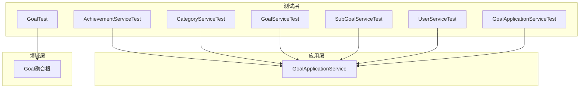
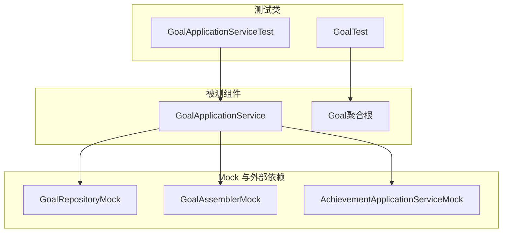
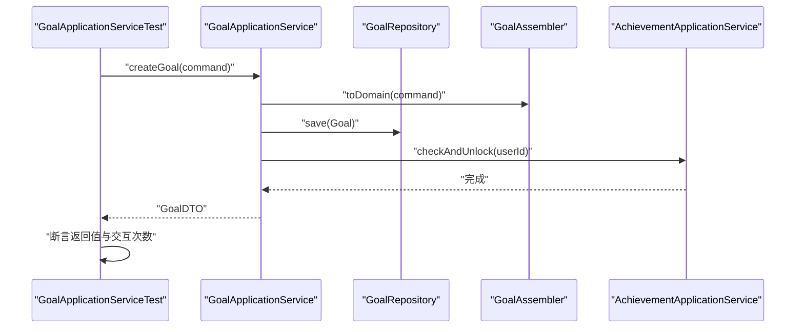
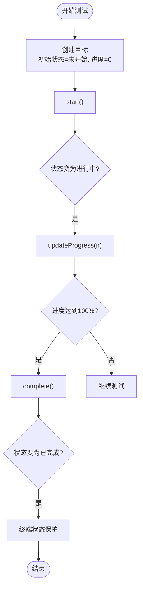
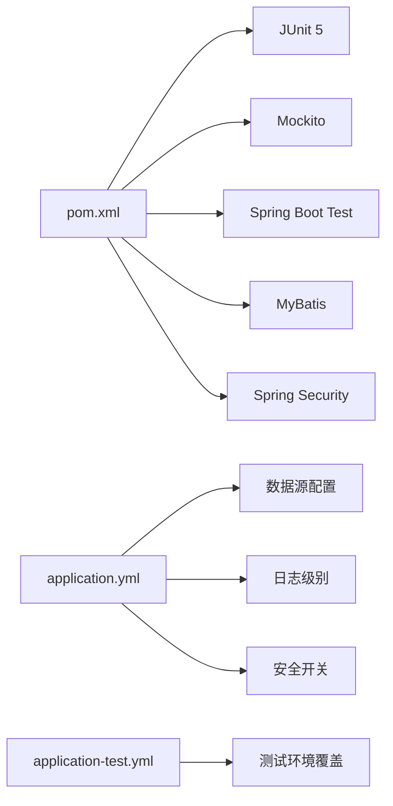

# 单元测试

<cite>
**本文引用的文件**
- [pom.xml](file://pom.xml)
- [application.yml](file://src/main/resources/application.yml)
- [application-test.yml](file://src/main/resources/application-test.yml)
- [AchievementServiceTest.java](file://src/test/java/com/crazydream/service/AchievementServiceTest.java)
- [CategoryServiceTest.java](file://src/test/java/com/crazydream/service/CategoryServiceTest.java)
- [GoalServiceTest.java](file://src/test/java/com/crazydream/service/GoalServiceTest.java)
- [SubGoalServiceTest.java](file://src/test/java/com/crazydream/service/SubGoalServiceTest.java)
- [UserServiceTest.java](file://src/test/java/com/crazydream/service/UserServiceTest.java)
- [GoalApplicationServiceTest.java](file://src/test/java/com/crazydream/application/goal/GoalApplicationServiceTest.java)
- [GoalTest.java](file://src/test/java/com/crazydream/domain/goal/GoalTest.java)
- [GoalApplicationService.java](file://src/main/java/com/crazydream/application/goal/service/GoalApplicationService.java)
- [Goal.java](file://src/main/java/com/crazydream/domain/goal/model/aggregate/Goal.java)
</cite>

## 目录
1. [简介](#简介)
2. [项目结构](#项目结构)
3. [核心组件](#核心组件)
4. [架构总览](#架构总览)
5. [详细组件分析](#详细组件分析)
6. [依赖分析](#依赖分析)
7. [性能考虑](#性能考虑)
8. [故障排查指南](#故障排查指南)
9. [结论](#结论)
10. [附录](#附录)

## 简介
本文件面向 CrazyDream 项目的单元测试，系统性讲解 JUnit 5 与 Mockito 在本项目中的使用方式，涵盖：
- 测试类与测试方法的组织结构
- 断言策略与异常场景验证
- Mock 机制在服务层与应用层的实践
- 领域模型测试与应用服务测试最佳实践
- 测试数据准备、边界条件与异常场景
- 测试命名规范与覆盖率建议

## 项目结构
CrazyDream 采用分层架构，单元测试主要覆盖以下层次：
- 应用层：GoalApplicationServiceTest
- 领域层：GoalTest
- 服务层：AchievementServiceTest、CategoryServiceTest、GoalServiceTest、SubGoalServiceTest、UserServiceTest
- 配置层：application.yml、application-test.yml
- 工程依赖：pom.xml 中包含 spring-boot-starter-test、MyBatis、Spring Security 等

图表来源
- [GoalApplicationServiceTest.java](file://src/test/java/com/crazydream/application/goal/GoalApplicationServiceTest.java#L30-L161)
- [GoalApplicationService.java](file://src/main/java/com/crazydream/application/goal/service/GoalApplicationService.java#L31-L200)
- [GoalTest.java](file://src/test/java/com/crazydream/domain/goal/GoalTest.java#L18-L157)
- [Goal.java](file://src/main/java/com/crazydream/domain/goal/model/aggregate/Goal.java#L17-L200)

章节来源
- [pom.xml](file://pom.xml#L24-L118)
- [application.yml](file://src/main/resources/application.yml#L1-L75)
- [application-test.yml](file://src/main/resources/application-test.yml#L1-L5)

## 核心组件
- 测试框架与工具
  - JUnit 5：测试类与测试方法注解、断言与异常验证
  - Mockito：@Mock、@InjectMocks、when/verify/any/matchers
- 测试配置
  - application.yml 提供默认配置；application-test.yml 可覆盖测试专用配置
  - pom.xml 引入 spring-boot-starter-test、MyBatis、Security 等依赖，便于集成测试与安全相关验证

章节来源
- [pom.xml](file://pom.xml#L24-L118)
- [application.yml](file://src/main/resources/application.yml#L1-L75)
- [application-test.yml](file://src/main/resources/application-test.yml#L1-L5)

## 架构总览
下图展示了测试层与被测组件之间的关系，以及 Mock 的使用位置。

图表来源
- [GoalApplicationServiceTest.java](file://src/test/java/com/crazydream/application/goal/GoalApplicationServiceTest.java#L30-L161)
- [GoalApplicationService.java](file://src/main/java/com/crazydream/application/goal/service/GoalApplicationService.java#L31-L200)
- [GoalTest.java](file://src/test/java/com/crazydream/domain/goal/GoalTest.java#L18-L157)
- [Goal.java](file://src/main/java/com/crazydream/domain/goal/model/aggregate/Goal.java#L17-L200)

## 详细组件分析

### 应用服务测试：GoalApplicationServiceTest
- 测试目标
  - 验证应用服务的业务流程编排：创建、更新、删除、进度更新、权限校验与成就联动
- 关键测试点
  - 创建目标：校验 DTO 返回值、调用仓库保存、触发成就检查
  - 更新目标：加载存在性校验、权限校验、应用命令、持久化
  - 进度更新：状态机变化（自动完成）、触发成就检查
  - 删除目标：存在性校验、权限校验、删除
- Mock 使用
  - 使用 @Mock 注入 GoalRepository
  - 使用 @InjectMocks 注入 GoalApplicationService
  - 使用 when/thenAnswer/verify 验证交互与返回值
- 异常场景
  - 目标不存在、权限不足、非法参数等均抛出 IllegalArgumentException 并被断言捕获

图表来源
- [GoalApplicationServiceTest.java](file://src/test/java/com/crazydream/application/goal/GoalApplicationServiceTest.java#L43-L67)
- [GoalApplicationService.java](file://src/main/java/com/crazydream/application/goal/service/GoalApplicationService.java#L44-L62)

章节来源
- [GoalApplicationServiceTest.java](file://src/test/java/com/crazydream/application/goal/GoalApplicationServiceTest.java#L30-L161)
- [GoalApplicationService.java](file://src/main/java/com/crazydream/application/goal/service/GoalApplicationService.java#L31-L200)

### 领域模型测试：GoalTest
- 测试目标
  - 验证领域模型的充血行为：创建、开始、更新进度、自动完成、放弃、归属校验
- 关键测试点
  - 创建目标：初始状态、默认优先级、进度与时间戳
  - 行为验证：start/updateProgress/complete/abandon 的状态流转
  - 自动完成：进度达到阈值自动完成
  - 终态保护：终端状态下禁止继续更新
  - 归属校验：belongsTo/belongsToCategory 的正确性
- 断言策略
  - 使用 assertEquals/assertTrue/assertFalse 验证状态与属性
  - 使用 assertThrows 验证非法状态转换抛出异常

图表来源
- [GoalTest.java](file://src/test/java/com/crazydream/domain/goal/GoalTest.java#L20-L126)
- [Goal.java](file://src/main/java/com/crazydream/domain/goal/model/aggregate/Goal.java#L111-L152)

章节来源
- [GoalTest.java](file://src/test/java/com/crazydream/domain/goal/GoalTest.java#L18-L157)
- [Goal.java](file://src/main/java/com/crazydream/domain/goal/model/aggregate/Goal.java#L17-L200)

### 服务层测试：AchievementServiceTest
- 测试目标
  - 成就解锁、查询用户成就、基于目标统计检查并解锁成就
- 关键测试点
  - 解锁成就：校验 Mapper 插入、返回值属性
  - 无效名称：断言非法参数异常
  - 查询成就：校验 Mapper 查询与返回集合大小
  - 基于统计的成就检查：根据统计结果判断应解锁数量
- Mock 使用
  - AchievementMapper、GoalMapper 双 Mock
  - when/verify 验证插入与查询次数

章节来源
- [AchievementServiceTest.java](file://src/test/java/com/crazydream/service/AchievementServiceTest.java#L22-L169)

### 服务层测试：CategoryServiceTest
- 测试目标
  - 分类的增删改查与空名校验
- 关键测试点
  - getAllCategories/getCategoryById：Mapper 查询与断言
  - createCategory：空名断言异常
  - updateCategory/deleteCategory：更新与删除成功路径
- Mock 使用
  - CategoryMapper Mock 与断言

章节来源
- [CategoryServiceTest.java](file://src/test/java/com/crazydream/service/CategoryServiceTest.java#L16-L132)

### 服务层测试：GoalServiceTest
- 测试目标
  - 目标的多维度查询、创建、更新、删除、最近目标、今日提醒目标
- 关键测试点
  - 统计查询：返回 Map 中各项指标断言
  - 创建目标：默认进度与状态断言
  - 空标题断言异常
  - 最近目标与今日提醒目标：Mapper 查询断言
- Mock 使用
  - GoalMapper Mock 与断言

章节来源
- [GoalServiceTest.java](file://src/test/java/com/crazydream/service/GoalServiceTest.java#L18-L232)

### 服务层测试：SubGoalServiceTest
- 测试目标
  - 子目标的创建、查询、更新、删除、批量删除与空参数校验
- 关键测试点
  - 空参数断言异常
  - 更新/删除前的存在性校验与异常路径
  - 批量删除：空列表断言异常
- Mock 使用
  - SubGoalMapper Mock 与断言

章节来源
- [SubGoalServiceTest.java](file://src/test/java/com/crazydream/service/SubGoalServiceTest.java#L18-L253)

### 服务层测试：UserServiceTest
- 测试目标
  - 用户登录、注册、查询、创建、更新、删除与密码编码
- 关键测试点
  - 登录：邮箱存在性、密码匹配、返回值断言与密码字段清空
  - 注册：邮箱唯一性、密码编码、返回值断言
  - 更新/删除：存在性校验与异常路径
- Mock 使用
  - UserMapper、PasswordEncoder 双 Mock 与断言

章节来源
- [UserServiceTest.java](file://src/test/java/com/crazydream/service/UserServiceTest.java#L18-L400)

## 依赖分析
- 测试依赖
  - spring-boot-starter-test：JUnit 5、Mockito、AssertJ
  - MyBatis 与 Spring Security：支持应用层与安全相关测试
- 配置依赖
  - application.yml 提供默认数据源、日志与安全开关
  - application-test.yml 作为测试环境覆盖入口

图表来源
- [pom.xml](file://pom.xml#L24-L118)
- [application.yml](file://src/main/resources/application.yml#L1-L75)
- [application-test.yml](file://src/main/resources/application-test.yml#L1-L5)

章节来源
- [pom.xml](file://pom.xml#L24-L118)
- [application.yml](file://src/main/resources/application.yml#L1-L75)
- [application-test.yml](file://src/main/resources/application-test.yml#L1-L5)

## 性能考虑
- 测试隔离与 Mock 化
  - 通过 @Mock 与 @InjectMocks 避免真实数据库与网络 IO，提升测试执行速度
- 断言与交互验证
  - 使用 verify(times/n times/never) 控制交互次数，避免过度断言导致脆弱测试
- 异常路径快速失败
  - 对非法输入与越权场景尽早断言异常，减少无效分支计算

## 故障排查指南
- 常见问题
  - Mock 注入失败：确认 @Mock 字段与 @InjectMocks 类型一致，且在 @BeforeEach 初始化
  - 断言失败：核对 when/verify 的参数匹配器（any/eq/matchers），确保与实际调用一致
  - 异常未抛出：检查被测方法是否抛出受检异常，必要时使用 assertThrows 包裹
- 排查步骤
  - 逐步缩小范围：先验证 Mock 行为，再验证断言
  - 输出日志：在应用层测试中可利用日志辅助定位异常链路
  - 边界条件：针对空值、空集合、越界值、越权操作逐一回归

## 结论
本项目的单元测试以 JUnit 5 与 Mockito 为核心，覆盖应用层、领域层与服务层的关键业务路径。通过合理的 Mock 设计与断言策略，测试具备高可读性与高稳定性。建议持续补充边界与异常场景，保持测试覆盖率稳定增长，并遵循统一的命名规范与断言风格。

## 附录

### 测试命名规范建议
- 测试类：被测类名 + Test（如 GoalServiceTest）
- 测试方法：
  - 正向场景：testXxx（如 testCreateGoal）
  - 异常场景：testXxx_WithInvalidInput 或 testXxx_WhenNotFound
  - 权限/越权：testXxx_WhenUnauthorized
  - 边界条件：testXxx_WithEdgeCase

### 测试覆盖率建议
- 语句覆盖率：≥ 80%
- 分支覆盖率：≥ 70%
- 行为覆盖率：重点保障应用层与领域层关键状态机与异常路径