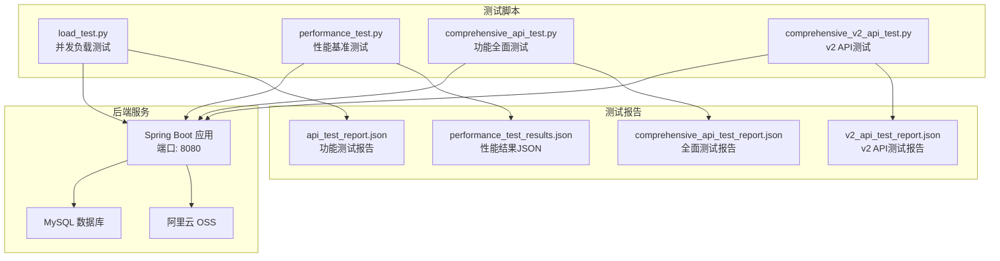
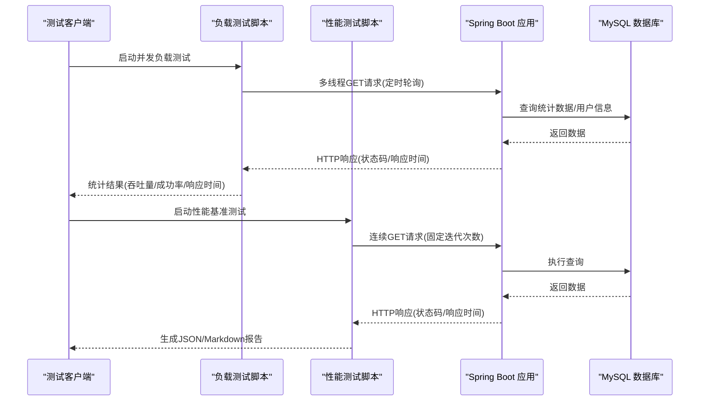
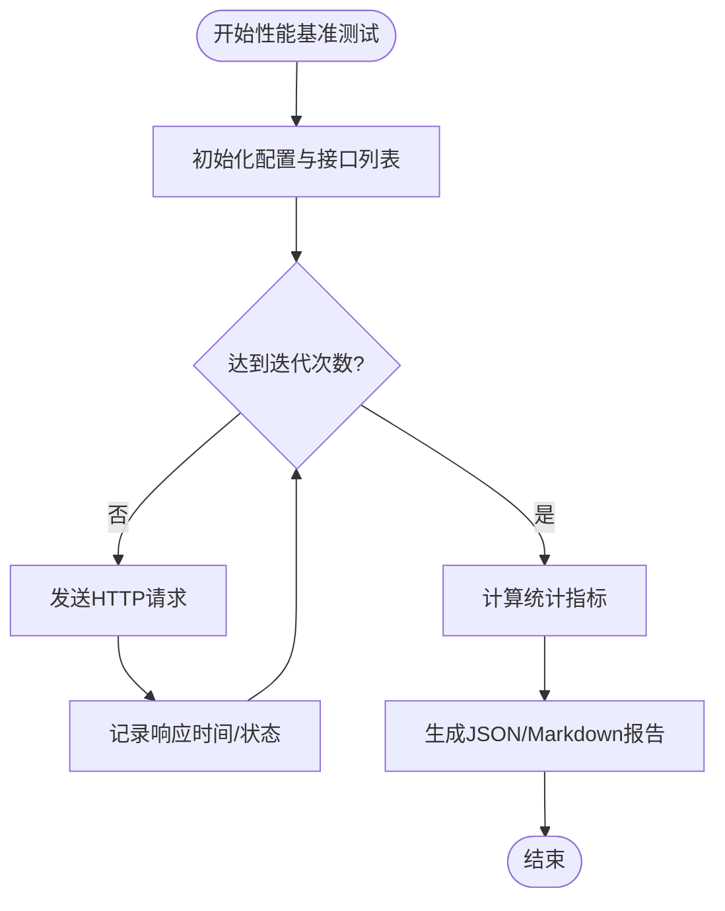
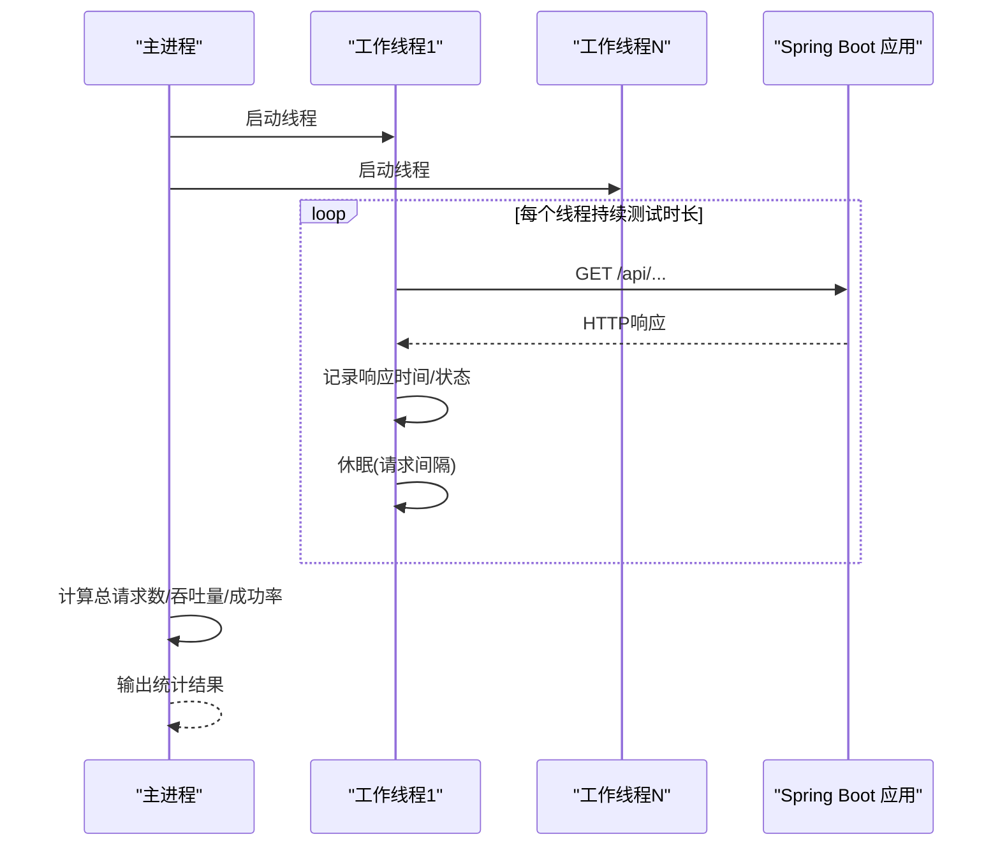
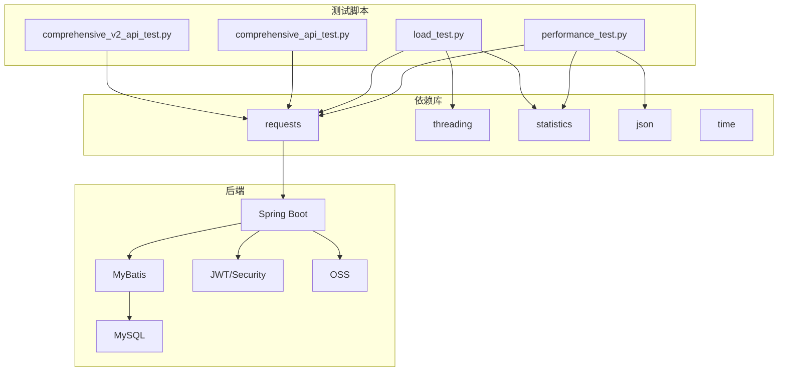

# 性能测试

<cite>
**本文档引用的文件**
- [load_test.py](file://load_test.py)
- [performance_test.py](file://performance_test.py)
- [performance_test_results.json](file://performance_test_results.json)
- [comprehensive_api_test.py](file://comprehensive_api_test.py)
- [comprehensive_v2_api_test.py](file://comprehensive_v2_api_test.py)
- [api_test_report.json](file://api_test_report.json)
- [comprehensive_api_test_report.json](file://comprehensive_api_test_report.json)
- [v2_api_test_report.json](file://v2_api_test_report.json)
- [pom.xml](file://pom.xml)
- [README.md](file://README.md)
- [API_TEST_REPORT.md](file://API_TEST_REPORT.md)
- [application.yml](file://src/main/resources/application.yml)
- [application-dev.yml](file://src/main/resources/application-dev.yml)
- [application-prod.yml](file://src/main/resources/application-prod.yml)
</cite>

## 目录
1. [引言](#引言)
2. [项目结构](#项目结构)
3. [核心组件](#核心组件)
4. [架构概览](#架构概览)
5. [详细组件分析](#详细组件分析)
6. [依赖关系分析](#依赖关系分析)
7. [性能考量](#性能考量)
8. [故障排除指南](#故障排除指南)
9. [结论](#结论)
10. [附录](#附录)

## 引言
本技术文档面向 CrazyDream 项目，系统化阐述性能测试的工具、方法与实践，涵盖压力测试、负载测试与稳定性测试的实施策略；详细说明性能测试脚本的编写与执行要点（并发用户模拟、请求频率控制、响应时间监控）；提供性能指标采集与分析方法（吞吐量、延迟、资源利用率、错误率）；展示性能瓶颈识别与优化建议（数据库查询优化、缓存策略、服务器资源配置）；并给出性能测试报告解读与性能基准线建立方法。

## 项目结构
CrazyDream 采用 DDD + COLA 四层架构，后端基于 Spring Boot 3.2.0 + MyBatis 3.0.3 + MySQL 8.0+ 技术栈。项目包含多套测试脚本与报告，覆盖功能测试、v2 API 测试与性能基准测试，便于从不同维度评估系统性能。

**图表来源**
- [load_test.py](file://load_test.py#L1-L132)
- [performance_test.py](file://performance_test.py#L1-L209)
- [comprehensive_api_test.py](file://comprehensive_api_test.py#L1-L397)
- [comprehensive_v2_api_test.py](file://comprehensive_v2_api_test.py#L1-L683)
- [performance_test_results.json](file://performance_test_results.json#L1-L602)
- [api_test_report.json](file://api_test_report.json#L1-L57)
- [comprehensive_api_test_report.json](file://comprehensive_api_test_report.json#L1-L239)
- [v2_api_test_report.json](file://v2_api_test_report.json#L1-L333)

**章节来源**
- [README.md](file://README.md#L46-L85)
- [pom.xml](file://pom.xml#L24-L118)

## 核心组件
- 性能基准测试脚本：对指定接口进行多次请求，统计响应时间分布、吞吐量与成功率，生成 JSON 报告与 Markdown 报告。
- 并发负载测试脚本：通过多线程模拟并发用户，定时轮询多个接口，统计各接口的响应时间与成功率。
- 功能全面测试脚本：覆盖认证、用户、分类、目标、成就、提醒、统计、文件等模块，生成详细测试报告。
- v2 API 测试脚本：专门针对 DDD 架构下的 v2 接口进行 CRUD 与业务流程测试，输出模块化报告。
- 配置文件：application.yml 提供服务器端口、数据库、JWT、安全认证等配置；开发/生产环境配置文件分别覆盖差异化设置。

**章节来源**
- [performance_test.py](file://performance_test.py#L14-L20)
- [load_test.py](file://load_test.py#L11-L20)
- [comprehensive_api_test.py](file://comprehensive_api_test.py#L14-L19)
- [comprehensive_v2_api_test.py](file://comprehensive_v2_api_test.py#L12-L17)
- [application.yml](file://src/main/resources/application.yml#L30-L75)

## 架构概览
CrazyDream 的性能测试体系围绕以下要素展开：
- 测试工具链：Python requests + 多线程 + 统计库，结合 Spring Boot 应用与 MySQL 数据库。
- 测试场景：压力测试（高并发）、负载测试（持续时间与请求间隔）、稳定性测试（长时间运行）。
- 指标采集：响应时间（最小/最大/平均/中位数/百分位）、吞吐量、成功率、错误率。
- 报告输出：JSON 详细结果 + Markdown 汇总报告，便于对比与归档。

**图表来源**
- [load_test.py](file://load_test.py#L26-L62)
- [performance_test.py](file://performance_test.py#L26-L76)
- [application.yml](file://src/main/resources/application.yml#L13-L17)

## 详细组件分析

### 性能基准测试组件（performance_test.py）
该脚本用于建立性能基准线，支持多接口、多迭代的响应时间统计与吞吐量计算，并输出详细报告。

- 关键特性
  - 接口列表：包含分类、用户、统计等常用接口。
  - 迭代次数：每接口固定测试次数，便于对比与复现。
  - 指标统计：最小/最大/平均/中位数/百分位响应时间；吞吐量；成功率。
  - 报告生成：JSON 详细结果 + Markdown 汇总报告。

- 执行流程
  - 初始化测试配置与接口列表。
  - 循环发送请求，记录响应时间与状态。
  - 计算各项指标并输出。
  - 生成 JSON 与 Markdown 报告文件。

**图表来源**
- [performance_test.py](file://performance_test.py#L26-L146)
- [performance_test_results.json](file://performance_test_results.json#L1-L602)

**章节来源**
- [performance_test.py](file://performance_test.py#L14-L20)
- [performance_test.py](file://performance_test.py#L26-L146)
- [performance_test_results.json](file://performance_test_results.json#L1-L602)

### 并发负载测试组件（load_test.py）
该脚本通过多线程模拟并发用户，定时轮询多个接口，统计整体吞吐量与各接口响应时间。

- 关键特性
  - 并发用户数：可配置线程数量。
  - 测试时长：固定持续时间。
  - 请求间隔：线程休眠时间，控制请求频率。
  - 统计维度：总请求数、吞吐量、成功率、各接口响应时间分布。

- 执行流程
  - 启动多个工作线程。
  - 线程按固定间隔轮询接口。
  - 记录响应时间与状态，统计成功率与响应时间。
  - 输出总体与分接口统计结果。

**图表来源**
- [load_test.py](file://load_test.py#L53-L82)
- [load_test.py](file://load_test.py#L26-L62)

**章节来源**
- [load_test.py](file://load_test.py#L11-L20)
- [load_test.py](file://load_test.py#L53-L82)
- [load_test.py](file://load_test.py#L83-L129)

### 功能全面测试组件（comprehensive_api_test.py）
该脚本覆盖认证、用户、分类、目标、成就、提醒、统计、文件等模块，生成全面测试报告，辅助性能测试前的功能验证。

- 关键特性
  - 模块化测试：健康检查、认证、用户、分类、目标、成就、提醒、统计、文件。
  - 结果记录：HTTP 状态码、业务状态码、成功/失败标记、消息与响应片段。
  - 报告生成：JSON 详细结果 + 按模块统计 + 失败详情。

**章节来源**
- [comprehensive_api_test.py](file://comprehensive_api_test.py#L14-L396)
- [comprehensive_api_test_report.json](file://comprehensive_api_test_report.json#L1-L239)

### v2 API 测试组件（comprehensive_v2_api_test.py）
该脚本专门针对 DDD 架构下的 v2 接口进行 CRUD 与业务流程测试，输出模块化报告，便于评估新架构性能。

- 关键特性
  - v2 接口覆盖：目标、子目标、用户、分类、成就、提醒、文件。
  - 业务状态码校验：同时检查 HTTP 状态码与业务状态码。
  - 报告生成：模块统计、失败详情、JSON 报告。

**章节来源**
- [comprehensive_v2_api_test.py](file://comprehensive_v2_api_test.py#L12-L682)
- [v2_api_test_report.json](file://v2_api_test_report.json#L1-L333)

## 依赖关系分析
- 测试脚本依赖
  - Python requests：发起 HTTP 请求。
  - statistics：计算均值、中位数、百分位数。
  - threading：并发线程控制。
  - json/time：报告生成与时间戳记录。
- 后端依赖
  - Spring Boot Web：提供 REST 接口。
  - MyBatis：数据库访问。
  - MySQL：数据存储。
  - JWT/Spring Security：认证与授权（测试环境可禁用）。
  - 阿里云 OSS：文件上传（可选）。

**图表来源**
- [performance_test.py](file://performance_test.py#L1-L4)
- [load_test.py](file://load_test.py#L1-L6)
- [comprehensive_api_test.py](file://comprehensive_api_test.py#L7-L10)
- [comprehensive_v2_api_test.py](file://comprehensive_v2_api_test.py#L8-L10)
- [pom.xml](file://pom.xml#L24-L118)

**章节来源**
- [pom.xml](file://pom.xml#L24-L118)

## 性能考量
- 并发与请求频率
  - 并发用户数：根据服务器资源与预期峰值合理设置，避免过载导致错误率上升。
  - 请求间隔：通过线程休眠时间控制请求频率，平衡吞吐量与服务器压力。
- 指标选择与阈值
  - 响应时间：关注最小/最大/平均/中位数与 P90/P95/P99，定位尾部延迟。
  - 吞吐量：单位时间内处理的请求数，反映系统承载能力。
  - 成功率与错误率：衡量系统稳定性与健壮性。
- 资源利用
  - CPU/内存/网络：结合系统监控工具观察服务器资源占用，识别瓶颈。
  - 数据库：关注慢查询、连接池使用率、锁等待等。
- 配置优化
  - 端口与上下文路径：确保测试端口与应用配置一致。
  - 安全认证：测试环境可禁用，生产环境必须启用。
  - 数据库连接池与超时：根据并发量调整连接池大小与查询超时。

**章节来源**
- [load_test.py](file://load_test.py#L11-L13)
- [performance_test.py](file://performance_test.py#L9-L11)
- [application.yml](file://src/main/resources/application.yml#L30-L75)

## 故障排除指南
- 服务不可达
  - 现象：连接被拒绝或超时。
  - 排查：确认服务端口与配置一致；检查防火墙与网络；查看应用日志。
  - 参考：功能测试报告中部分接口出现连接被拒绝的情况。
- 认证问题
  - 现象：测试模式下认证被禁用，生产环境需启用。
  - 排查：检查 security.auth.disabled 配置；确保生产环境开启认证。
- 数据库连接问题
  - 现象：数据库连接失败或超时。
  - 排查：核对数据库 URL、用户名、密码；检查数据库服务状态。
- 文件上传问题
  - 现象：multipart/form-data 接口可达但上传失败。
  - 排查：确认文件大小限制与 OSS 配置；检查上传逻辑。

**章节来源**
- [api_test_report.json](file://api_test_report.json#L13-L56)
- [API_TEST_REPORT.md](file://API_TEST_REPORT.md#L178-L251)
- [application.yml](file://src/main/resources/application.yml#L13-L17)
- [application.yml](file://src/main/resources/application.yml#L65-L75)

## 结论
通过对 CrazyDream 项目的性能测试脚本与报告进行系统分析，可以建立完善的性能测试体系：以性能基准测试确定基线，以并发负载测试评估峰值承载能力，以功能与 v2 API 测试保障接口正确性。结合合理的并发与请求频率控制、关键性能指标监控与资源利用观测，能够有效识别瓶颈并指导优化。建议在生产环境启用安全认证与严格的数据库配置，并持续维护性能基准线以支持回归与容量规划。

## 附录
- 测试报告解读要点
  - 性能基准报告：关注各接口的响应时间分布与吞吐量，作为后续优化的参考。
  - 负载测试报告：关注整体吞吐量与各接口的成功率与响应时间，识别热点接口。
  - 功能测试报告：确认接口可用性与业务状态码一致性。
- 性能基准线建立方法
  - 在稳定环境下运行性能基准测试，记录关键指标。
  - 周期性回归测试，对比历史数据，发现回归。
  - 结合业务场景设定 SLA，如 P95 响应时间阈值与错误率上限。

**章节来源**
- [performance_test_results.json](file://performance_test_results.json#L1-L602)
- [v2_api_test_report.json](file://v2_api_test_report.json#L1-L333)
- [API_TEST_REPORT.md](file://API_TEST_REPORT.md#L10-L244)