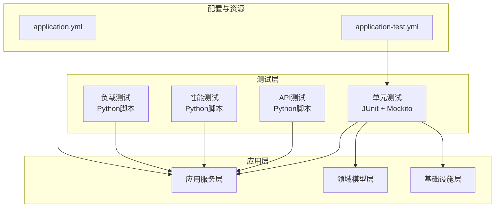
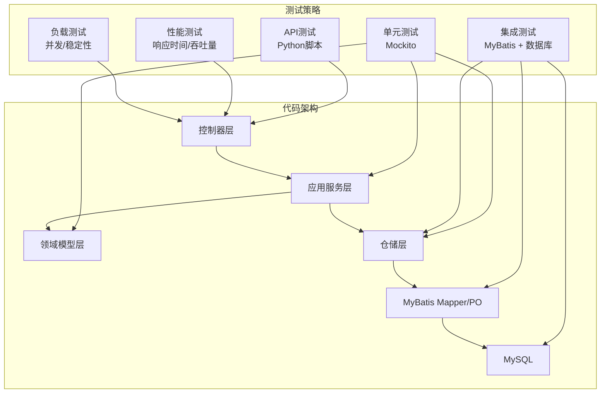
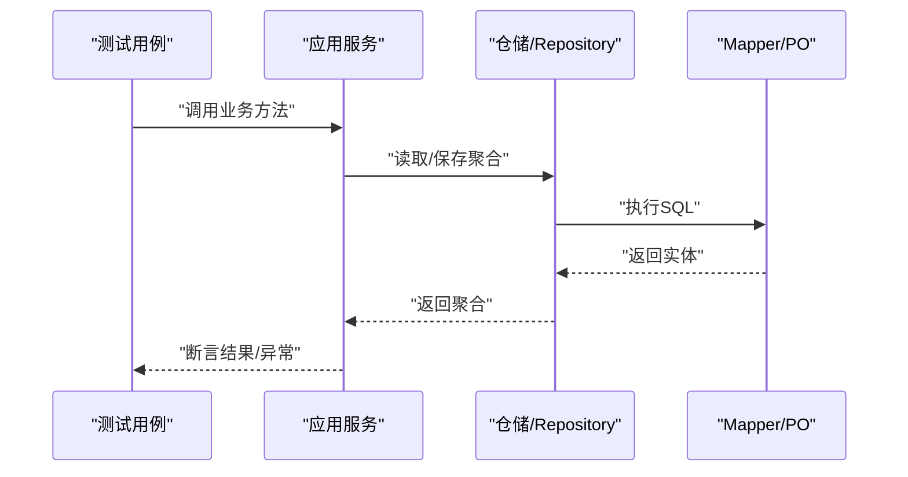
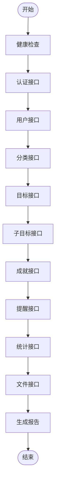
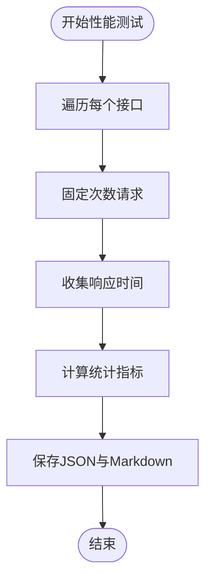
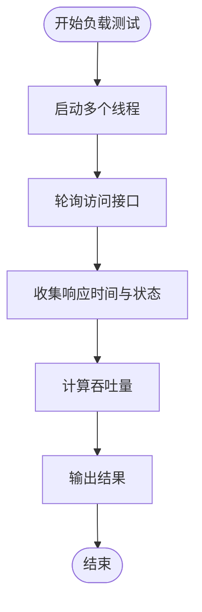
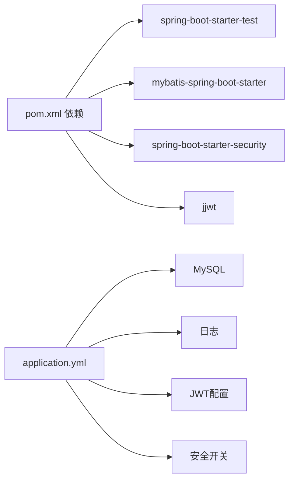

# 测试策略

<cite>
**本文引用的文件**
- [pom.xml](file://pom.xml)
- [application.yml](file://src/main/resources/application.yml)
- [application-test.yml](file://src/main/resources/application-test.yml)
- [UserServiceTest.java](file://src/test/java/com/crazydream/service/UserServiceTest.java)
- [AchievementServiceTest.java](file://src/test/java/com/crazydream/service/AchievementServiceTest.java)
- [GoalApplicationServiceTest.java](file://src/test/java/com/crazydream/application/goal/GoalApplicationServiceTest.java)
- [GoalTest.java](file://src/test/java/com/crazydream/domain/goal/GoalTest.java)
- [CategoryServiceTest.java](file://src/test/java/com/crazydream/service/CategoryServiceTest.java)
- [GoalServiceTest.java](file://src/test/java/com/crazydream/service/GoalServiceTest.java)
- [SubGoalServiceTest.java](file://src/test/java/com/crazydream/service/SubGoalServiceTest.java)
- [comprehensive_api_test.py](file://comprehensive_api_test.py)
- [performance_test.py](file://performance_test.py)
- [load_test.py](file://load_test.py)
- [API_TEST_REPORT.md](file://API_TEST_REPORT.md)
- [api_test_final_summary.txt](file://api_test_final_summary.txt)
</cite>

## 目录
1. [引言](#引言)
2. [项目结构](#项目结构)
3. [核心组件](#核心组件)
4. [架构总览](#架构总览)
5. [详细组件分析](#详细组件分析)
6. [依赖分析](#依赖分析)
7. [性能考虑](#性能考虑)
8. [故障排查指南](#故障排查指南)
9. [结论](#结论)
10. [附录](#附录)

## 引言
本测试策略文档面向 CrazyDream 项目，系统化阐述单元测试、集成测试与 API 测试的实施方法与最佳实践。结合现有 JUnit 与 Mockito 单元测试、Python 自动化 API 测试脚本、性能与负载测试脚本，给出测试用例设计原则、覆盖率目标、测试数据管理、自动化执行方案以及质量保证流程，帮助开发者建立完善的测试体系。

## 项目结构
项目采用 Spring Boot + MyBatis 技术栈，测试相关目录组织如下：
- 单元测试：位于 src/test/java 下，按领域/应用服务/基础设施分层组织
- API 测试：位于仓库根目录，使用 Python 编写的自动化脚本
- 性能与负载测试：独立 Python 脚本，分别评估响应时间与并发能力
- 配置文件：application.yml 提供默认配置；application-test.yml 为测试环境覆盖

**图表来源**
- [pom.xml](file://pom.xml#L24-L50)
- [application.yml](file://src/main/resources/application.yml#L1-L75)
- [application-test.yml](file://src/main/resources/application-test.yml#L1-L5)

**章节来源**
- [pom.xml](file://pom.xml#L24-L50)
- [application.yml](file://src/main/resources/application.yml#L1-L75)
- [application-test.yml](file://src/main/resources/application-test.yml#L1-L5)

## 核心组件
- 测试框架与工具
  - 单元测试：JUnit 5 + Mockito（模拟依赖、断言与行为验证）
  - API 测试：requests + JSON 报告生成
  - 性能/负载测试：requests + 统计分析
- 测试覆盖范围
  - 领域模型：Goal 的状态机与业务行为
  - 应用服务：GoalApplicationService 的 CRUD 与进度更新
  - 领域服务：AchievementService 的成就解锁与统计联动
  - 基础设施服务：User/Category/Goal/SubGoal 的持久化服务
  - 控制器层：通过 API 测试脚本覆盖接口可达性与基本响应

**章节来源**
- [GoalTest.java](file://src/test/java/com/crazydream/domain/goal/GoalTest.java#L1-L158)
- [GoalApplicationServiceTest.java](file://src/test/java/com/crazydream/application/goal/GoalApplicationServiceTest.java#L1-L162)
- [AchievementServiceTest.java](file://src/test/java/com/crazydream/service/AchievementServiceTest.java#L1-L169)
- [UserServiceTest.java](file://src/test/java/com/crazydream/service/UserServiceTest.java#L1-L400)
- [CategoryServiceTest.java](file://src/test/java/com/crazydream/service/CategoryServiceTest.java#L1-L132)
- [GoalServiceTest.java](file://src/test/java/com/crazydream/service/GoalServiceTest.java#L1-L232)
- [SubGoalServiceTest.java](file://src/test/java/com/crazydream/service/SubGoalServiceTest.java#L1-L253)

## 架构总览
测试策略与代码架构的对应关系如下：

**图表来源**
- [pom.xml](file://pom.xml#L24-L50)
- [UserServiceTest.java](file://src/test/java/com/crazydream/service/UserServiceTest.java#L1-L400)
- [GoalApplicationServiceTest.java](file://src/test/java/com/crazydream/application/goal/GoalApplicationServiceTest.java#L1-L162)
- [AchievementServiceTest.java](file://src/test/java/com/crazydream/service/AchievementServiceTest.java#L1-L169)

## 详细组件分析

### 单元测试：应用服务与领域模型
- 设计原则
  - 使用 Mockito 模拟外部依赖，隔离被测应用服务
  - 针对关键业务路径（创建、更新、删除、查询）编写正反用例
  - 验证异常场景与边界条件（空参数、非法状态）
- 关键测试要点
  - GoalApplicationServiceTest：验证创建、更新、进度更新、删除失败（未授权/不存在）等
  - GoalTest：验证领域模型的状态转换与不可逆状态约束
  - AchievementServiceTest：验证成就解锁与统计联动
  - UserServiceTest：验证用户注册/登录/CRUD的业务规则与异常处理
  - Category/Goal/SubGoal Service：验证参数校验与仓储调用次数

**图表来源**
- [GoalApplicationServiceTest.java](file://src/test/java/com/crazydream/application/goal/GoalApplicationServiceTest.java#L44-L67)
- [GoalTest.java](file://src/test/java/com/crazydream/domain/goal/GoalTest.java#L20-L36)
- [AchievementServiceTest.java](file://src/test/java/com/crazydream/service/AchievementServiceTest.java#L38-L65)

**章节来源**
- [GoalApplicationServiceTest.java](file://src/test/java/com/crazydream/application/goal/GoalApplicationServiceTest.java#L1-L162)
- [GoalTest.java](file://src/test/java/com/crazydream/domain/goal/GoalTest.java#L1-L158)
- [AchievementServiceTest.java](file://src/test/java/com/crazydream/service/AchievementServiceTest.java#L1-L169)
- [UserServiceTest.java](file://src/test/java/com/crazydream/service/UserServiceTest.java#L1-L400)
- [CategoryServiceTest.java](file://src/test/java/com/crazydream/service/CategoryServiceTest.java#L1-L132)
- [GoalServiceTest.java](file://src/test/java/com/crazydream/service/GoalServiceTest.java#L1-L232)
- [SubGoalServiceTest.java](file://src/test/java/com/crazydream/service/SubGoalServiceTest.java#L1-L253)

### API 测试：自动化接口测试
- 实施方法
  - 使用 Python requests 调用 /health、/api/* 等接口
  - 统计成功率、按模块汇总并通过 JSON/Mardown 报告输出
  - 自动记录响应状态码、消息与简要响应体
- 覆盖范围
  - 健康检查、认证、用户、分类、目标、子目标、成就、提醒、统计、文件
- 报告与回归
  - 自动生成 comprehensive_api_test_report.json 与 Markdown 报告
  - API_TEST_REPORT.md 提供历史测试摘要与改进建议

**图表来源**
- [comprehensive_api_test.py](file://comprehensive_api_test.py#L319-L397)
- [API_TEST_REPORT.md](file://API_TEST_REPORT.md#L10-L35)

**章节来源**
- [comprehensive_api_test.py](file://comprehensive_api_test.py#L1-L397)
- [API_TEST_REPORT.md](file://API_TEST_REPORT.md#L1-L298)

### 性能测试：响应时间与吞吐量
- 方法
  - 固定迭代次数（如 100 次）对关键接口进行压力测试
  - 统计最小/最大/平均/中位数、P50/P90/P95/P99 响应时间
  - 计算成功率与吞吐量（请求/秒）
- 输出
  - JSON 结果文件与 Markdown 报告，便于对比不同版本性能

**图表来源**
- [performance_test.py](file://performance_test.py#L26-L209)

**章节来源**
- [performance_test.py](file://performance_test.py#L1-L209)

### 负载测试：并发与稳定性
- 方法
  - 多线程并发访问选定接口，持续固定时间
  - 统计各接口的成功/失败数、成功率与响应时间分布
- 输出
  - 控制台汇总与统计，便于定位瓶颈与异常

**图表来源**
- [load_test.py](file://load_test.py#L64-L132)

**章节来源**
- [load_test.py](file://load_test.py#L1-L132)

## 依赖分析
- 测试依赖
  - spring-boot-starter-test：JUnit、Mockito、AssertJ
  - MyBatis starter：集成数据库与 Mapper
  - Spring Security + JWT：认证与授权（测试环境可禁用）
- 配置依赖
  - application.yml 提供数据库、日志、OSS、JWT、安全开关等默认配置
  - application-test.yml 作为测试环境覆盖（当前为空）

**图表来源**
- [pom.xml](file://pom.xml#L24-L118)
- [application.yml](file://src/main/resources/application.yml#L10-L75)

**章节来源**
- [pom.xml](file://pom.xml#L24-L118)
- [application.yml](file://src/main/resources/application.yml#L10-L75)
- [application-test.yml](file://src/main/resources/application-test.yml#L1-L5)

## 性能考虑
- 基准测试建议
  - 固定迭代次数（如 100 次）评估关键接口的 P90/P99 响应时间
  - 关注成功率与吞吐量，识别慢查询与热点接口
- 负载测试建议
  - 逐步增加并发线程数，观察成功率与响应时间拐点
  - 结合数据库连接池与缓存策略优化瓶颈
- 报告与对比
  - 使用 performance_test.py 生成 JSON 与 Markdown 报告，便于版本对比

**章节来源**
- [performance_test.py](file://performance_test.py#L1-L209)
- [load_test.py](file://load_test.py#L1-L132)

## 故障排查指南
- 常见问题与定位
  - 认证禁用导致的用户ID为空：检查 security.auth.disabled 与 test.default-user-id
  - 数据库字段缺失或字段名不一致：对照 API 测试修复记录
  - UPDATE 操作失败：检查 Repository.save 与领域模型业务方法
- 建议步骤
  - 校验 application.yml 中的数据库与安全配置
  - 使用 API 测试脚本快速验证接口可达性
  - 结合单元测试定位应用服务与领域模型边界
  - 使用性能/负载测试脚本定位瓶颈

**章节来源**
- [application.yml](file://src/main/resources/application.yml#L65-L75)
- [api_test_final_summary.txt](file://api_test_final_summary.txt#L53-L82)

## 结论
本测试策略基于现有的 JUnit/Mockito 单元测试、Python 自动化 API 测试、性能与负载测试脚本，形成了从单元到集成再到端到端的测试闭环。建议在后续迭代中补充：
- 更多边界与异常场景的单元测试
- v2 API 的专项测试与对比
- 权限与安全测试（生产环境启用认证）
- 持续集成中的自动化执行与报告归档

## 附录
- 测试用例设计原则
  - 每个业务路径至少一个正向与一个反向用例
  - 边界条件与异常场景必须覆盖
  - 使用行为验证（verify）确保依赖调用符合预期
- 覆盖率要求（建议）
  - 关键应用服务与领域模型覆盖率不低于 80%
  - API 接口功能测试 100% 可达性与响应正确性
- 测试数据管理
  - 使用测试环境默认用户ID（security.test.default-user-id）
  - 在测试前准备必要测试数据（如目标、成就）
  - 保持测试数据最小化与可重复性