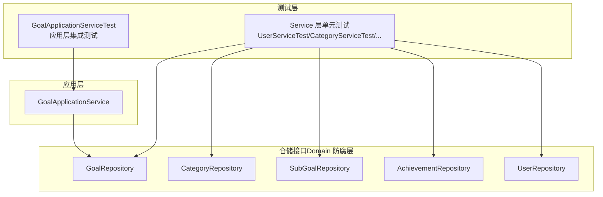
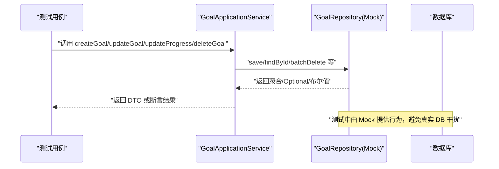
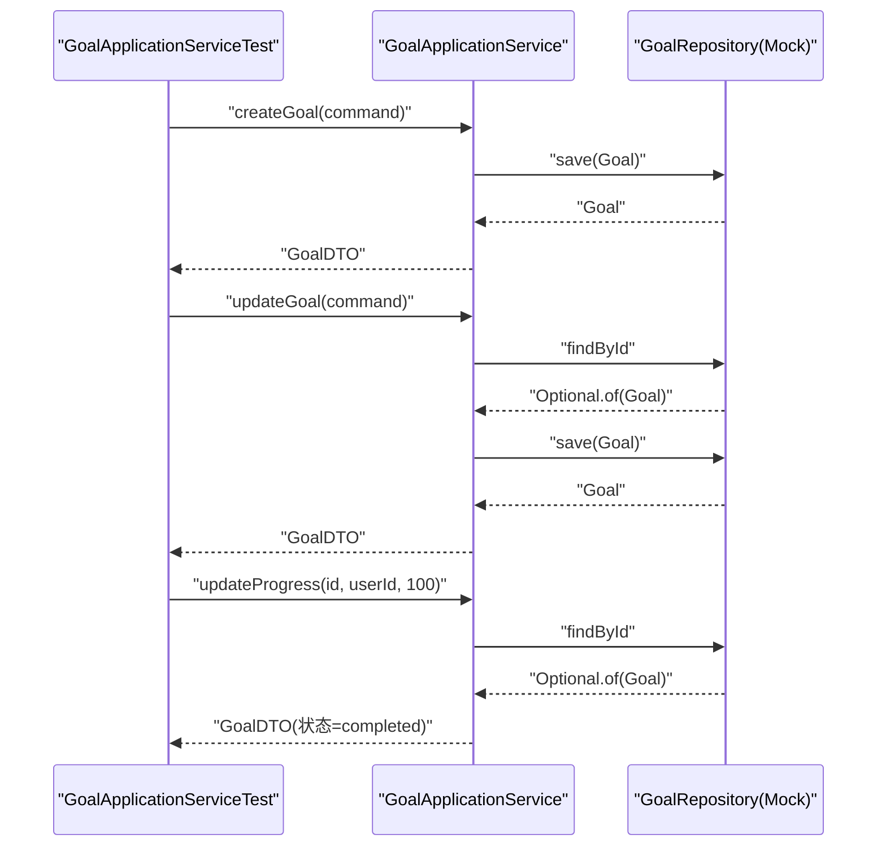
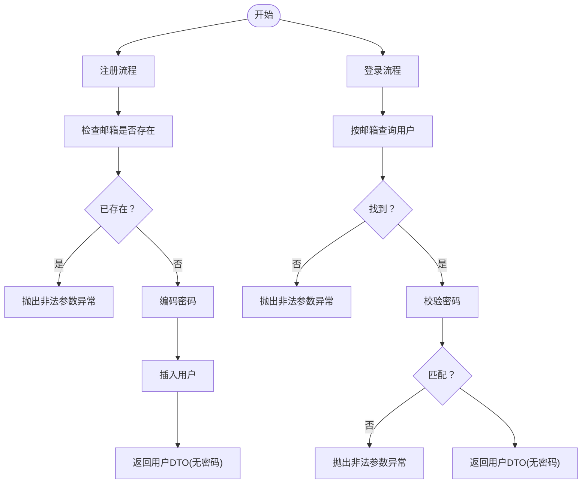
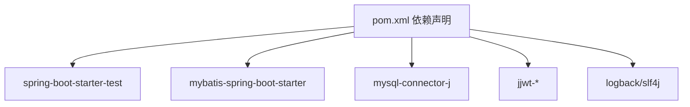

# 集成测试

<cite>
**本文引用的文件**
- [pom.xml](file://pom.xml)
- [application-test.yml](file://src/main/resources/application-test.yml)
- [schema.sql](file://src/main/resources/schema.sql)
- [GoalApplicationServiceTest.java](file://src/test/java/com/crazydream/application/goal/GoalApplicationServiceTest.java)
- [GoalServiceTest.java](file://src/test/java/com/crazydream/service/GoalServiceTest.java)
- [CategoryServiceTest.java](file://src/test/java/com/crazydream/service/CategoryServiceTest.java)
- [SubGoalServiceTest.java](file://src/test/java/com/crazydream/service/SubGoalServiceTest.java)
- [AchievementServiceTest.java](file://src/test/java/com/crazydream/service/AchievementServiceTest.java)
- [UserServiceTest.java](file://src/test/java/com/crazydream/service/UserServiceTest.java)
- [GoalRepository.java](file://src/main/java/com/crazydream/domain/goal/repository/GoalRepository.java)
- [CategoryRepository.java](file://src/main/java/com/crazydream/domain/category/repository/CategoryRepository.java)
- [SubGoalRepository.java](file://src/main/java/com/crazydream/domain/subgoal/repository/SubGoalRepository.java)
- [AchievementRepository.java](file://src/main/java/com/crazydream/domain/achievement/repository/AchievementRepository.java)
- [UserRepository.java](file://src/main/java/com/crazydream/domain/user/repository/UserRepository.java)
</cite>

## 目录
1. [简介](#简介)
2. [项目结构](#项目结构)
3. [核心组件](#核心组件)
4. [架构总览](#架构总览)
5. [详细组件分析](#详细组件分析)
6. [依赖分析](#依赖分析)
7. [性能考量](#性能考量)
8. [故障排查指南](#故障排查指南)
9. [结论](#结论)
10. [附录](#附录)

## 简介
本文件面向 CrazyDream 项目的集成测试实践，聚焦于模块间交互与数据流验证，覆盖服务层与仓储层的集成测试方法，并提供数据库集成测试的配置与管理策略（测试数据库设置、事务管理与数据清理）。文档同时给出用户服务、分类服务、目标服务、子目标服务与成就服务的完整测试场景设计，以及测试环境隔离、测试数据同步与测试结果验证的方法；最后展示如何基于 Spring Boot Test 进行端到端功能测试。

## 项目结构
CrazyDream 采用分层架构：Domain（领域）、Infrastructure（基础设施）、Application（应用层）、Interfaces（接口层）。测试覆盖了应用层与服务层，分别通过 Mock 仓储接口进行集成测试，以验证业务流程与数据一致性。

图表来源
- [GoalApplicationServiceTest.java](file://src/test/java/com/crazydream/application/goal/GoalApplicationServiceTest.java#L30-L161)
- [GoalRepository.java](file://src/main/java/com/crazydream/domain/goal/repository/GoalRepository.java#L18-L69)
- [CategoryRepository.java](file://src/main/java/com/crazydream/domain/category/repository/CategoryRepository.java#L9-L15)
- [SubGoalRepository.java](file://src/main/java/com/crazydream/domain/subgoal/repository/SubGoalRepository.java#L10-L16)
- [AchievementRepository.java](file://src/main/java/com/crazydream/domain/achievement/repository/AchievementRepository.java#L10-L15)
- [UserRepository.java](file://src/main/java/com/crazydream/domain/user/repository/UserRepository.java#L9-L14)

章节来源
- [pom.xml](file://pom.xml#L24-L118)
- [application-test.yml](file://src/main/resources/application-test.yml#L1-L5)

## 核心组件
- 应用层集成测试：以 GoalApplicationService 为例，通过 Mock GoalRepository 验证创建、更新、进度变更与删除等业务流程。
- 服务层单元测试：对 UserService、CategoryService、GoalService、SubGoalService、AchievementService 进行边界条件、异常路径与数据一致性校验。
- 仓储接口：位于 Domain 层，作为防腐层，被应用层与服务层通过 Mock 实现进行集成测试。

章节来源
- [GoalApplicationServiceTest.java](file://src/test/java/com/crazydream/application/goal/GoalApplicationServiceTest.java#L30-L161)
- [GoalServiceTest.java](file://src/test/java/com/crazydream/service/GoalServiceTest.java#L18-L232)
- [CategoryServiceTest.java](file://src/test/java/com/crazydream/service/CategoryServiceTest.java#L16-L132)
- [SubGoalServiceTest.java](file://src/test/java/com/crazydream/service/SubGoalServiceTest.java#L18-L253)
- [AchievementServiceTest.java](file://src/test/java/com/crazydream/service/AchievementServiceTest.java#L22-L169)
- [UserServiceTest.java](file://src/test/java/com/crazydream/service/UserServiceTest.java#L18-L400)

## 架构总览
下图展示了从应用层到仓储层的调用链路，以及测试中如何通过 Mock 仓储接口实现集成测试：

图表来源
- [GoalApplicationServiceTest.java](file://src/test/java/com/crazydream/application/goal/GoalApplicationServiceTest.java#L44-L128)
- [GoalRepository.java](file://src/main/java/com/crazydream/domain/goal/repository/GoalRepository.java#L18-L69)

## 详细组件分析

### 应用层集成测试：GoalApplicationService
- 测试目标：验证应用服务在不同业务场景下的行为，包括创建目标、更新目标、更新进度至完成、删除失败（未找到/无权限）等。
- 关键流程：
  - 创建目标：构造命令对象，Mock 保存后返回带 ID 的聚合，断言 DTO 字段。
  - 更新目标：根据 ID 查找现有聚合，Mock 保存后返回相同聚合，断言字段更新。
  - 更新进度：将进度设为 100，断言状态变为完成。
  - 删除失败：未找到或无权限时抛出非法参数异常。

图表来源
- [GoalApplicationServiceTest.java](file://src/test/java/com/crazydream/application/goal/GoalApplicationServiceTest.java#L44-L128)

章节来源
- [GoalApplicationServiceTest.java](file://src/test/java/com/crazydream/application/goal/GoalApplicationServiceTest.java#L30-L161)

### 服务层集成测试：用户服务
- 测试目标：验证用户注册、登录、CRUD 等核心流程，以及边界与异常处理。
- 关键流程：
  - 注册：邮箱唯一性校验、密码编码、插入用户后返回无敏感信息。
  - 登录：邮箱存在性、密码匹配校验，返回用户信息且无密码。
  - CRUD：创建、更新（含不存在与空参数）、删除（含不存在与空参数）。

图表来源
- [UserServiceTest.java](file://src/test/java/com/crazydream/service/UserServiceTest.java#L139-L263)

章节来源
- [UserServiceTest.java](file://src/test/java/com/crazydream/service/UserServiceTest.java#L18-L400)

### 服务层集成测试：分类服务
- 测试目标：分类的增删改查与空名称校验。
- 关键流程：获取全部、按 ID 查询、创建（空名抛异常）、更新、删除。

章节来源
- [CategoryServiceTest.java](file://src/test/java/com/crazydream/service/CategoryServiceTest.java#L16-L132)

### 服务层集成测试：目标服务
- 测试目标：按用户/分类查询、统计、创建（空标题抛异常）、更新、删除、近期目标、今日提醒目标。
- 关键流程：多维度查询与统计、状态与进度默认值校验。

章节来源
- [GoalServiceTest.java](file://src/test/java/com/crazydream/service/GoalServiceTest.java#L18-L232)

### 服务层集成测试：子目标服务
- 测试目标：子目标的创建、查询、更新（含空参数与不存在）、删除（含空参数与不存在）、按目标查询、批量删除（含空列表）。
- 关键流程：空参数与不存在场景的异常处理，批量删除的边界校验。

章节来源
- [SubGoalServiceTest.java](file://src/test/java/com/crazydream/service/SubGoalServiceTest.java#L18-L253)

### 服务层集成测试：成就服务
- 测试目标：解锁成就（含无效名称）、查询用户成就、基于目标统计自动检查并解锁成就。
- 关键流程：统计目标完成情况，与已解锁成就比对后决定是否插入新成就记录。

章节来源
- [AchievementServiceTest.java](file://src/test/java/com/crazydream/service/AchievementServiceTest.java#L22-L169)

## 依赖分析
- 测试依赖：Spring Boot Starter Test、MyBatis、MySQL Connector、Lombok、JWT、日志等。
- 测试配置：application-test.yml 复用默认配置，便于在测试环境中快速切换数据源或日志级别。
- 数据库脚本：schema.sql 定义用户、分类、目标、提醒、子目标、成就表及默认分类数据，用于初始化测试数据库。

图表来源
- [pom.xml](file://pom.xml#L24-L118)

章节来源
- [pom.xml](file://pom.xml#L24-L118)
- [application-test.yml](file://src/main/resources/application-test.yml#L1-L5)
- [schema.sql](file://src/main/resources/schema.sql#L1-L111)

## 性能考量
- 测试隔离：通过 Mock 仓储接口避免真实数据库 IO，提升测试执行速度与稳定性。
- 数据最小化：仅在必要时使用 schema.sql 初始化默认数据，减少测试数据体量。
- 并发与事务：集成测试中建议使用短事务或回滚策略，避免跨测试用例的数据污染。
- 资源复用：测试容器或内存数据库（如 H2）可进一步加速集成测试，但需确保与生产 SQL 兼容。

## 故障排查指南
- 常见问题
  - 未找到目标/子目标：检查 ID 是否正确、用户权限是否一致。
  - 密码错误/用户不存在：确认登录凭据与数据库初始化数据。
  - 成就解锁条件不满足：核对目标统计与已解锁成就列表。
- 排查步骤
  - 启用 DEBUG 日志，观察应用层与仓储层调用链。
  - 在测试中打印关键输入输出，定位异常分支。
  - 使用断言细化结果字段，缩小问题范围。

章节来源
- [GoalApplicationServiceTest.java](file://src/test/java/com/crazydream/application/goal/GoalApplicationServiceTest.java#L131-L160)
- [UserServiceTest.java](file://src/test/java/com/crazydream/service/UserServiceTest.java#L231-L263)
- [AchievementServiceTest.java](file://src/test/java/com/crazydream/service/AchievementServiceTest.java#L131-L168)

## 结论
通过 Mock 仓储接口的集成测试，CrazyDream 在不依赖真实数据库的前提下，有效验证了应用层与服务层的业务流程与数据一致性。配合 schema.sql 初始化脚本与 application-test.yml 配置，可实现稳定的测试环境与可重复的测试结果。建议在持续集成中引入更严格的数据库兼容性检查与性能回归测试，以保障系统长期演进的可靠性。

## 附录

### 数据库集成测试配置与管理
- 测试数据库设置
  - 使用 schema.sql 初始化用户、分类、目标、提醒、子目标、成就表及默认分类数据。
  - 在 application-test.yml 中可覆盖默认配置，如数据源 URL、用户名、密码与日志级别。
- 事务管理
  - 单元测试中使用短事务并在测试结束回滚，避免污染共享数据库。
  - 对需要真实持久化的场景，使用 @Commit 触发提交或在测试后显式清理。
- 数据清理策略
  - 测试前导入 schema.sql，测试后执行 TRUNCATE/DELETE 清理表或重建数据库。
  - 对于关键测试用例，使用固定种子数据并确保幂等性。

章节来源
- [application-test.yml](file://src/main/resources/application-test.yml#L1-L5)
- [schema.sql](file://src/main/resources/schema.sql#L1-L111)

### 测试环境隔离与数据同步
- 环境隔离
  - 使用 application-test.yml 与 Maven Profile 切换测试环境配置。
  - 将测试数据库与开发/生产数据库分离，避免相互影响。
- 数据同步
  - 在测试启动时执行 schema.sql，保证测试数据一致性。
  - 对于外部依赖（如 OSS），可通过 Mock 或本地 MinIO 提升可移植性。

章节来源
- [pom.xml](file://pom.xml#L24-L118)

### 端到端功能测试（Spring Boot Test）
- 基本步骤
  - 使用 @SpringBootTest 启动完整上下文，或 @WebMvcTest/@DataJdbcTest 等按需加载。
  - 使用 @AutoConfigureTestDatabase 替换为内存数据库或禁用真实数据源。
  - 使用 TestRestTemplate/RestAssured 或 @WebTestClient 发起请求，断言响应状态与内容。
- 集成要点
  - 保持控制器/服务/仓储的职责清晰，便于在测试中替换实现。
  - 对认证与授权场景，注入模拟用户或使用测试令牌。

章节来源
- [pom.xml](file://pom.xml#L45-L50)