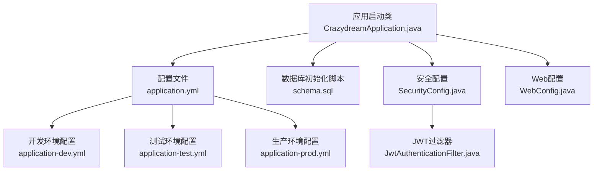
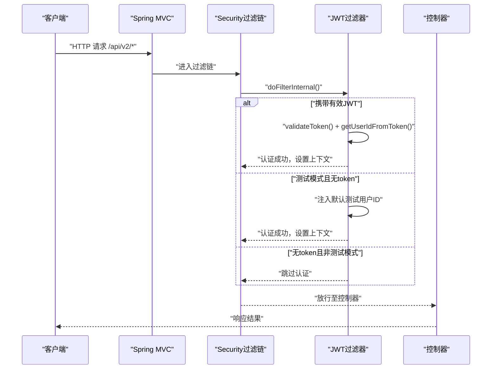
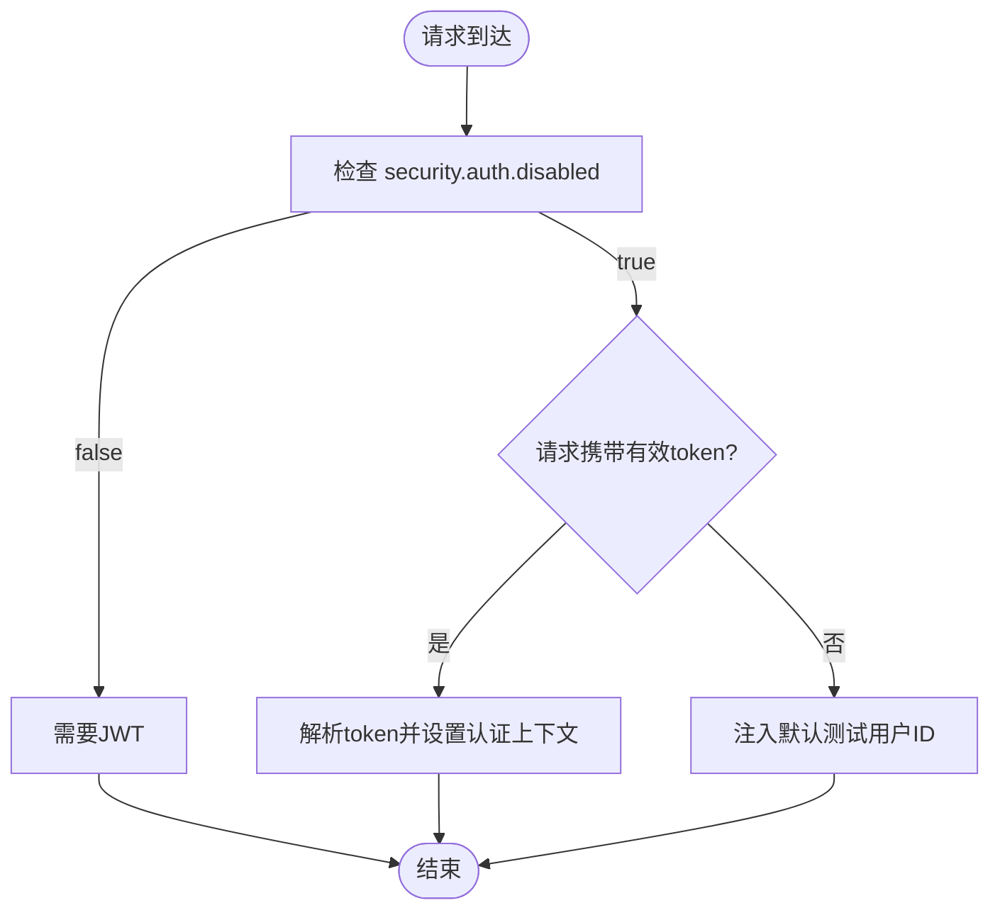
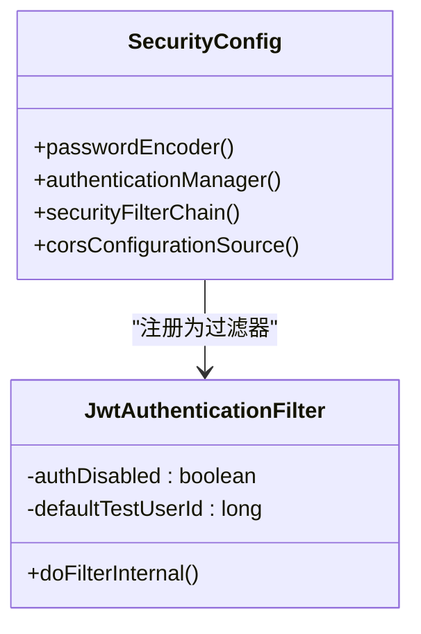
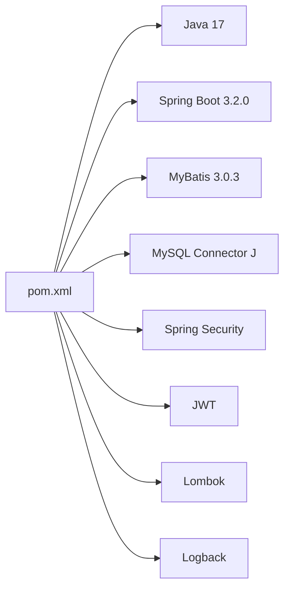

# 本地开发部署

<cite>
**本文引用的文件**
- [pom.xml](file://pom.xml)
- [README.md](file://README.md)
- [application.yml](file://src/main/resources/application.yml)
- [application-dev.yml](file://src/main/resources/application-dev.yml)
- [application-test.yml](file://src/main/resources/application-test.yml)
- [application-prod.yml](file://src/main/resources/application-prod.yml)
- [.env.example](file://.env.example)
- [.env.test](file://.env.test)
- [schema.sql](file://src/main/resources/schema.sql)
- [CrazydreamApplication.java](file://src/main/java/com/crazydream/CrazydreamApplication.java)
- [SecurityConfig.java](file://src/main/java/com/crazydream/security/SecurityConfig.java)
- [JwtAuthenticationFilter.java](file://src/main/java/com/crazydream/security/JwtAuthenticationFilter.java)
- [WebConfig.java](file://src/main/java/com/crazydream/config/WebConfig.java)
</cite>

## 目录
1. [简介](#简介)
2. [项目结构](#项目结构)
3. [核心组件](#核心组件)
4. [架构总览](#架构总览)
5. [详细组件分析](#详细组件分析)
6. [依赖分析](#依赖分析)
7. [性能注意事项](#性能注意事项)
8. [故障排查指南](#故障排查指南)
9. [结论](#结论)
10. [附录](#附录)

## 简介
本指南面向本地开发环境的搭建与运行，涵盖 JDK 17+、Maven 3.8+、MySQL 8.0+ 的安装配置，项目克隆、数据库初始化与应用启动流程，以及开发环境的特殊配置（如默认测试用户）。同时提供常见开发工具配置与调试技巧，帮助开发者快速建立高效、稳定的本地开发环境。

## 项目结构
CrazyDream 采用 Spring Boot 3.2.0 + MyBatis 的后端服务，遵循 DDD + COLA 四层架构（接口层、应用层、领域层、基础设施层）。核心启动类位于应用根包，配置文件位于 resources 目录，数据库初始化 SQL 位于 resources 下的 schema.sql。

图表来源
- [CrazydreamApplication.java](file://src/main/java/com/crazydream/CrazydreamApplication.java#L1-L27)
- [application.yml](file://src/main/resources/application.yml#L1-L75)
- [application-dev.yml](file://src/main/resources/application-dev.yml#L1-L5)
- [application-test.yml](file://src/main/resources/application-test.yml#L1-L5)
- [application-prod.yml](file://src/main/resources/application-prod.yml#L1-L14)
- [schema.sql](file://src/main/resources/schema.sql#L1-L111)
- [SecurityConfig.java](file://src/main/java/com/crazydream/security/SecurityConfig.java#L1-L105)
- [JwtAuthenticationFilter.java](file://src/main/java/com/crazydream/security/JwtAuthenticationFilter.java#L1-L129)
- [WebConfig.java](file://src/main/java/com/crazydream/config/WebConfig.java#L1-L18)

章节来源
- [CrazydreamApplication.java](file://src/main/java/com/crazydream/CrazydreamApplication.java#L1-L27)
- [application.yml](file://src/main/resources/application.yml#L1-L75)
- [schema.sql](file://src/main/resources/schema.sql#L1-L111)

## 核心组件
- 启动类与扫描：应用启动类负责引导 Spring Boot 并启用 MyBatis Mapper 扫描，确保持久层接口被正确识别。
- 配置体系：application.yml 为主配置，application-dev.yml、application-test.yml、application-prod.yml 用于不同环境覆盖；同时支持通过环境变量覆盖敏感配置。
- 安全与认证：基于 Spring Security + JWT，支持测试模式下的默认用户注入与 CORS 配置。
- 数据库初始化：schema.sql 提供完整的建表与默认数据插入，便于本地快速初始化。

章节来源
- [CrazydreamApplication.java](file://src/main/java/com/crazydream/CrazydreamApplication.java#L14-L16)
- [application.yml](file://src/main/resources/application.yml#L25-L27)
- [SecurityConfig.java](file://src/main/java/com/crazydream/security/SecurityConfig.java#L32-L91)
- [JwtAuthenticationFilter.java](file://src/main/java/com/crazydream/security/JwtAuthenticationFilter.java#L40-L46)
- [schema.sql](file://src/main/resources/schema.sql#L21-L24)

## 架构总览
本地开发环境的关键交互如下：浏览器/客户端向 /api/v2 发起请求，Spring MVC 接收后进入 Spring Security 过滤链，JWT 过滤器解析并校验令牌；若处于测试模式且未携带有效令牌，则注入默认测试用户；随后进入控制器处理业务逻辑。

图表来源
- [SecurityConfig.java](file://src/main/java/com/crazydream/security/SecurityConfig.java#L55-L91)
- [JwtAuthenticationFilter.java](file://src/main/java/com/crazydream/security/JwtAuthenticationFilter.java#L48-L127)

章节来源
- [SecurityConfig.java](file://src/main/java/com/crazydream/security/SecurityConfig.java#L55-L91)
- [JwtAuthenticationFilter.java](file://src/main/java/com/crazydream/security/JwtAuthenticationFilter.java#L48-L127)

## 详细组件分析

### 本地开发环境搭建步骤
- 安装前置条件
  - JDK 17+：用于编译与运行 Java 应用。
  - Maven 3.8+：用于项目构建与依赖管理。
  - MySQL 8.0+：用于数据持久化。
- 克隆项目与构建
  - 克隆仓库后，使用 Maven 清理并安装依赖，确保本地依赖完整。
- 数据库初始化
  - 在本地 MySQL 中创建数据库（字符集建议 utf8mb4）。
  - 执行 schema.sql 初始化表结构与默认数据（含测试用户）。
- 配置应用
  - application.yml 已内置本地开发默认配置，可通过环境变量覆盖敏感信息。
  - 若使用 .env 文件，可复制 .env.example 并按需填写，再通过 IDE 或命令行导入环境变量。
- 启动应用
  - 使用 Maven 启动或打包后运行 jar 包。
  - 访问 http://localhost:8080/api 验证服务可用性。

章节来源
- [README.md](file://README.md#L89-L156)
- [application.yml](file://src/main/resources/application.yml#L10-L17)
- [schema.sql](file://src/main/resources/schema.sql#L1-L111)
- [.env.example](file://.env.example#L1-L40)

### 开发环境特殊配置：默认测试用户
- 测试模式开关
  - security.auth.disabled=true 时，系统允许未携带 JWT 的请求通过，但仍会尝试解析 token。
- 默认测试用户注入
  - 当 security.auth.disabled=true 且请求未携带有效 token 时，系统将注入默认用户 ID（默认为 1）。
- 配置位置
  - application.yml 中提供 security.auth.disabled 与 security.test.default-user-id 的默认值。
  - 可通过环境变量覆盖，例如 .env.test 中的示例。

图表来源
- [application.yml](file://src/main/resources/application.yml#L66-L74)
- [JwtAuthenticationFilter.java](file://src/main/java/com/crazydream/security/JwtAuthenticationFilter.java#L103-L122)

章节来源
- [application.yml](file://src/main/resources/application.yml#L66-L74)
- [JwtAuthenticationFilter.java](file://src/main/java/com/crazydream/security/JwtAuthenticationFilter.java#L40-L46)
- [JwtAuthenticationFilter.java](file://src/main/java/com/crazydream/security/JwtAuthenticationFilter.java#L103-L122)
- [.env.test](file://.env.test#L2-L5)

### 安全与认证配置
- Spring Security 配置
  - 禁用 CSRF，启用无状态会话。
  - CORS 允许任意来源与方法，便于前端联调。
  - 测试模式下允许所有请求，否则仅登录/注册与健康检查接口免认证。
- JWT 过滤器
  - 解析 Authorization 头中的 Bearer Token。
  - 支持测试模式下注入默认用户。
  - 将认证信息写入 SecurityContext，供后续业务使用。

图表来源
- [SecurityConfig.java](file://src/main/java/com/crazydream/security/SecurityConfig.java#L32-L105)
- [JwtAuthenticationFilter.java](file://src/main/java/com/crazydream/security/JwtAuthenticationFilter.java#L29-L129)

章节来源
- [SecurityConfig.java](file://src/main/java/com/crazydream/security/SecurityConfig.java#L54-L91)
- [JwtAuthenticationFilter.java](file://src/main/java/com/crazydream/security/JwtAuthenticationFilter.java#L48-L127)

### Web 路由与重定向
- WebConfig 提供旧版 /auth/* 路径到新版 /api/auth/* 的重定向，便于历史接口过渡。
- 该配置不影响核心业务，但有助于前后端联调时的路径兼容。

章节来源
- [WebConfig.java](file://src/main/java/com/crazydream/config/WebConfig.java#L10-L17)

### 数据库初始化与默认数据
- schema.sql 完成以下初始化：
  - 用户表、分类表、目标表、提醒表、子目标表、成就表的建表。
  - 插入默认测试用户与若干默认分类数据。
- 建议在本地 MySQL 中执行该脚本，确保开发环境具备初始数据。

章节来源
- [schema.sql](file://src/main/resources/schema.sql#L1-L111)

### 环境变量与配置覆盖
- application.yml 支持通过环境变量覆盖敏感配置（如数据库连接、JWT 密钥、OSS 参数）。
- .env.example 提供了完整的环境变量模板，.env.test 提供了测试环境变量示例。
- 建议在本地开发时复制 .env.example 为 .env 并按需填写，避免提交敏感信息。

章节来源
- [application.yml](file://src/main/resources/application.yml#L10-L17)
- [application.yml](file://src/main/resources/application.yml#L47-L55)
- [application.yml](file://src/main/resources/application.yml#L58-L63)
- [.env.example](file://.env.example#L1-L40)
- [.env.test](file://.env.test#L1-L5)

## 依赖分析
- 构建工具与语言
  - Maven 3.8+、Java 17，确保编译与运行环境一致。
- 核心依赖
  - Spring Boot Starter Web、MyBatis、MySQL Connector、Spring Security、JWT、Lombok、Logback 等。
- 插件
  - maven-compiler-plugin、spring-boot-maven-plugin、mybatis-generator-maven-plugin。

图表来源
- [pom.xml](file://pom.xml#L18-L22)
- [pom.xml](file://pom.xml#L24-L118)
- [pom.xml](file://pom.xml#L120-L162)

章节来源
- [pom.xml](file://pom.xml#L1-L163)

## 性能注意事项
- 开发阶段建议使用内存数据库或本地 MySQL，避免网络延迟影响。
- 启动参数可适当调整 JVM 内存与垃圾回收策略，提升热更新效率。
- 关闭不必要的日志级别，减少磁盘 IO；生产环境建议降低日志级别。

## 故障排查指南
- 无法连接数据库
  - 检查 application.yml 中的数据库 URL、用户名、密码是否正确。
  - 确认 MySQL 服务已启动，网络连通性正常。
- JWT 认证失败
  - 确认请求头中 Authorization: Bearer {token} 是否正确。
  - 检查 JWT 密钥与过期时间配置是否与前端一致。
- 测试模式下未注入默认用户
  - 确认 security.auth.disabled=true 且请求未携带有效 token。
  - 检查 security.test.default-user-id 是否为有效用户 ID。
- CORS 跨域问题
  - 确认 SecurityConfig 中的 CORS 配置是否允许当前来源与方法。
- 启动报错或端口占用
  - 更换 server.port 或关闭占用进程。
- 依赖冲突或版本不匹配
  - 清理并重新安装依赖，确保 Maven 3.8+ 与 JDK 17+ 版本一致。

章节来源
- [application.yml](file://src/main/resources/application.yml#L10-L17)
- [application.yml](file://src/main/resources/application.yml#L58-L63)
- [SecurityConfig.java](file://src/main/java/com/crazydream/security/SecurityConfig.java#L94-L103)
- [JwtAuthenticationFilter.java](file://src/main/java/com/crazydream/security/JwtAuthenticationFilter.java#L103-L122)

## 结论
通过本指南，您可以快速完成 CrazyDream 项目的本地开发环境搭建：安装 JDK 17+、Maven 3.8+、MySQL 8.0+，克隆项目、初始化数据库、配置环境变量与应用参数，并成功启动服务。开发期间可利用测试模式的默认用户与 CORS 配置提升联调效率；遇到问题时，可依据故障排查指南逐项定位与解决。

## 附录
- API 根路径与认证方式
  - 业务接口：http://localhost:8080/api/v2
  - 认证接口：http://localhost:8080/api/auth/*
  - 认证方式：JWT 令牌，请求头添加 Authorization: Bearer {token}
- 常用命令
  - 构建：mvn clean install
  - 运行：mvn spring-boot:run
  - 验证：访问 http://localhost:8080/api

章节来源
- [README.md](file://README.md#L160-L167)
- [README.md](file://README.md#L140-L156)