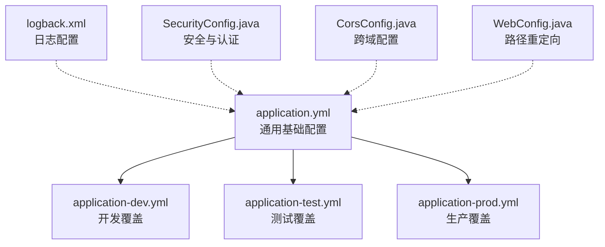
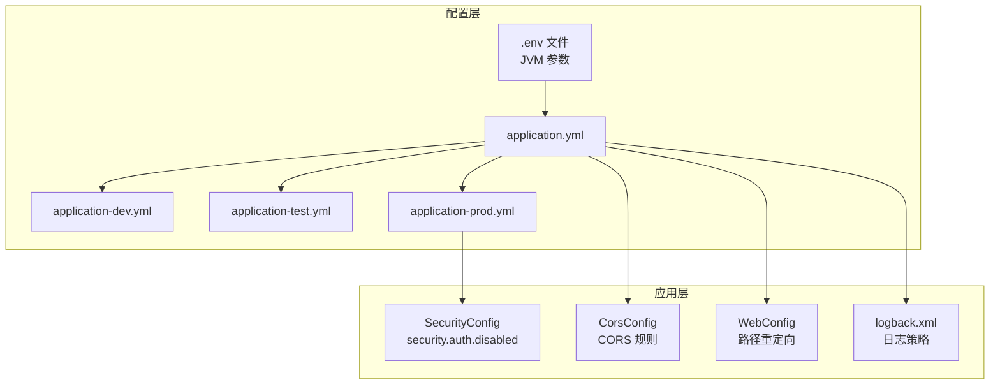
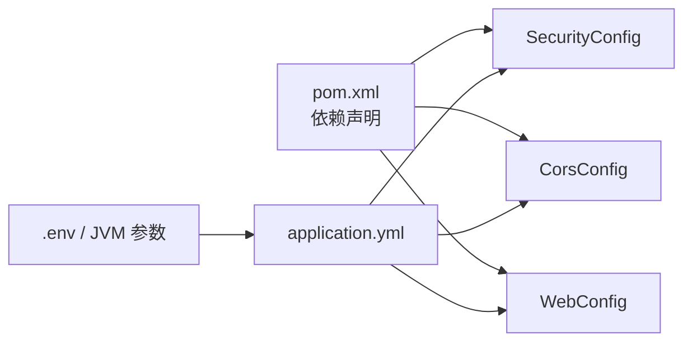

# 环境配置

<cite>
**本文引用的文件**
- [application.yml](file://src/main/resources/application.yml)
- [application-dev.yml](file://src/main/resources/application-dev.yml)
- [application-test.yml](file://src/main/resources/application-test.yml)
- [application-prod.yml](file://src/main/resources/application-prod.yml)
- [.env.example](file://.env.example)
- [.env.test](file://.env.test)
- [DEPLOYMENT.md](file://DEPLOYMENT.md)
- [logback.xml](file://src/main/resources/logback.xml)
- [SecurityConfig.java](file://src/main/java/com/crazydream/security/SecurityConfig.java)
- [CorsConfig.java](file://src/main/java/com/crazydream/config/CorsConfig.java)
- [WebConfig.java](file://src/main/java/com/crazydream/config/WebConfig.java)
- [pom.xml](file://pom.xml)
</cite>

## 目录
1. [简介](#简介)
2. [项目结构](#项目结构)
3. [核心组件](#核心组件)
4. [架构总览](#架构总览)
5. [详细组件分析](#详细组件分析)
6. [依赖分析](#依赖分析)
7. [性能考虑](#性能考虑)
8. [故障排查指南](#故障排查指南)
9. [结论](#结论)
10. [附录](#附录)

## 简介
本文件面向 CrazyDream 项目的运维与开发团队，系统化阐述环境配置体系，包括开发、测试与生产三类环境的配置文件结构与差异；解释主配置文件 application.yml 的职责与关键键位；说明 application-dev.yml、application-test.yml、application-prod.yml 的覆盖重点；给出环境变量配置方法（含 .env 文件与 JVM 参数），并总结配置优先级与覆盖规则，最后提供各环境的最佳实践与排障建议。

## 项目结构
- 配置文件位于资源目录下，采用 Spring Boot 的多 profile 配置约定：
  - application.yml：通用基础配置
  - application-dev.yml：开发环境覆盖
  - application-test.yml：测试环境覆盖
  - application-prod.yml：生产环境覆盖
- 日志配置通过 logback.xml 统一管理
- 安全与跨域配置分别由 SecurityConfig 与 CorsConfig 提供
- Web 层路径重定向由 WebConfig 提供

图表来源
- [application.yml](file://src/main/resources/application.yml#L1-L75)
- [application-dev.yml](file://src/main/resources/application-dev.yml#L1-L5)
- [application-test.yml](file://src/main/resources/application-test.yml#L1-L5)
- [application-prod.yml](file://src/main/resources/application-prod.yml#L1-L14)
- [logback.xml](file://src/main/resources/logback.xml#L1-L99)
- [SecurityConfig.java](file://src/main/java/com/crazydream/security/SecurityConfig.java#L1-L105)
- [CorsConfig.java](file://src/main/java/com/crazydream/config/CorsConfig.java#L1-L53)
- [WebConfig.java](file://src/main/java/com/crazydream/config/WebConfig.java#L1-L18)

章节来源
- [application.yml](file://src/main/resources/application.yml#L1-L75)
- [application-dev.yml](file://src/main/resources/application-dev.yml#L1-L5)
- [application-test.yml](file://src/main/resources/application-test.yml#L1-L5)
- [application-prod.yml](file://src/main/resources/application-prod.yml#L1-L14)
- [logback.xml](file://src/main/resources/logback.xml#L1-L99)
- [SecurityConfig.java](file://src/main/java/com/crazydream/security/SecurityConfig.java#L1-L105)
- [CorsConfig.java](file://src/main/java/com/crazydream/config/CorsConfig.java#L1-L53)
- [WebConfig.java](file://src/main/java/com/crazydream/config/WebConfig.java#L1-L18)

## 核心组件
- application.yml：定义应用名称、主入口、数据库、文件上传、激活的 profile、服务器端口、MyBatis 映射、日志级别、阿里云 OSS、JWT 与安全认证开关等。其中敏感信息通过占位符引用环境变量，便于在不同环境注入真实值。
- application-dev.yml：开发环境覆盖文件，默认空文件，用于按需覆盖开发专用配置。
- application-test.yml：测试环境覆盖文件，默认空文件，用于按需覆盖测试专用配置。
- application-prod.yml：生产环境覆盖文件，主要覆盖日志级别与安全认证开关，确保生产环境更严格的日志与安全策略。
- .env.example 与 .env.test：示例与测试环境变量文件，提供环境变量命名规范与示例值，避免将真实密钥提交至版本控制。
- logback.xml：统一日志输出策略，包含控制台与滚动文件输出，按级别分文件存储。
- SecurityConfig：基于 Spring Security 的认证与授权链路，读取 security.auth.disabled 决定是否禁用认证；同时集成 CORS。
- CorsConfig：独立的 CORS 配置类，允许前端跨域访问。
- WebConfig：提供旧版登录路径重定向到新版 API 路径，提升兼容性。

章节来源
- [application.yml](file://src/main/resources/application.yml#L1-L75)
- [application-dev.yml](file://src/main/resources/application-dev.yml#L1-L5)
- [application-test.yml](file://src/main/resources/application-test.yml#L1-L5)
- [application-prod.yml](file://src/main/resources/application-prod.yml#L1-L14)
- [.env.example](file://.env.example#L1-L40)
- [.env.test](file://.env.test#L1-L5)
- [logback.xml](file://src/main/resources/logback.xml#L1-L99)
- [SecurityConfig.java](file://src/main/java/com/crazydream/security/SecurityConfig.java#L1-L105)
- [CorsConfig.java](file://src/main/java/com/crazydream/config/CorsConfig.java#L1-L53)
- [WebConfig.java](file://src/main/java/com/crazydream/config/WebConfig.java#L1-L18)

## 架构总览
下图展示配置加载与覆盖关系，以及关键模块如何读取配置：

图表来源
- [application.yml](file://src/main/resources/application.yml#L1-L75)
- [application-dev.yml](file://src/main/resources/application-dev.yml#L1-L5)
- [application-test.yml](file://src/main/resources/application-test.yml#L1-L5)
- [application-prod.yml](file://src/main/resources/application-prod.yml#L1-L14)
- [SecurityConfig.java](file://src/main/java/com/crazydream/security/SecurityConfig.java#L40-L42)
- [CorsConfig.java](file://src/main/java/com/crazydream/config/CorsConfig.java#L1-L53)
- [WebConfig.java](file://src/main/java/com/crazydream/config/WebConfig.java#L1-L18)
- [logback.xml](file://src/main/resources/logback.xml#L1-L99)
- [.env.example](file://.env.example#L1-L40)
- [.env.test](file://.env.test#L1-L5)

## 详细组件分析

### application.yml：主配置文件
- 作用：定义应用通用配置，包括应用名、主入口、数据库、文件上传、激活的 profile、服务器端口、MyBatis 映射、日志级别、阿里云 OSS、JWT 与安全认证开关等。
- 关键要点：
  - 数据库连接通过占位符引用环境变量，便于在不同环境注入真实值。
  - MyBatis 配置开启驼峰命名映射，mapper 位置与实体包扫描路径明确。
  - 日志级别对业务包与 MyBatis 设为 DEBUG，便于开发调试。
  - JWT 密钥与过期时间通过占位符引用环境变量，生产环境务必替换为强随机密钥。
  - 安全认证默认关闭（仅测试用途），生产环境应改为开启。

章节来源
- [application.yml](file://src/main/resources/application.yml#L1-L75)

### application-dev.yml：开发环境覆盖
- 作用：复用 application.yml 的默认配置，如需针对开发环境进行额外覆盖，可在该文件中添加相应键位。
- 建议：通常保持空文件，通过环境变量与命令行参数在本地灵活调整。

章节来源
- [application-dev.yml](file://src/main/resources/application-dev.yml#L1-L5)

### application-test.yml：测试环境覆盖
- 作用：复用 application.yml 的默认配置，如需为测试环境单独指定数据源或日志级别，可在该文件中覆盖。
- 建议：结合 .env.test 使用，集中管理测试环境变量。

章节来源
- [application-test.yml](file://src/main/resources/application-test.yml#L1-L5)
- [.env.test](file://.env.test#L1-L5)

### application-prod.yml：生产环境覆盖
- 作用：仅覆盖生产环境特有的差异配置，主要包括：
  - 日志级别：业务包设为 INFO，MyBatis 设为 WARN，降低生产日志噪声。
  - 安全认证：关闭开关设为 false，确保生产环境强制认证。
- 建议：配合 .env 文件与 JVM 参数，严格禁止明文敏感信息进入代码仓库。

章节来源
- [application-prod.yml](file://src/main/resources/application-prod.yml#L1-L14)

### 环境变量与 .env 文件
- .env.example：提供完整的环境变量清单与示例值，强调生产环境必须配置的项（如数据库、JWT 密钥、OSS 等）。
- .env.test：测试环境变量示例，便于快速切换测试场景。
- 使用方式：
  - 在本地或 CI 环境中复制示例文件并填写真实值。
  - 通过命令导出环境变量后启动应用，或直接以 JVM 参数传入。
- 关键变量：
  - SPRING_PROFILES_ACTIVE：激活的 profile（dev/test/prod）
  - SPRING_DATASOURCE_*：数据库连接信息
  - JWT_*：JWT 密钥与过期时间
  - ALIYUN_OSS_*：阿里云 OSS 配置
  - security.auth.disabled：安全认证开关（仅测试可用）

章节来源
- [.env.example](file://.env.example#L1-L40)
- [.env.test](file://.env.test#L1-L5)
- [DEPLOYMENT.md](file://DEPLOYMENT.md#L90-L158)

### JVM 参数与命令行参数
- Maven 启动：可通过 -Dspring-boot.run.profiles 指定 profile。
- Jar 启动：通过 --spring.profiles.active 指定 profile。
- JVM 参数：可直接传入具体配置键值，用于临时覆盖或 CI 场景。

章节来源
- [DEPLOYMENT.md](file://DEPLOYMENT.md#L35-L48)
- [DEPLOYMENT.md](file://DEPLOYMENT.md#L142-L151)

### 配置优先级与覆盖规则
- Spring Boot 配置优先级（从高到低）：
  1) 命令行参数（如 --spring.datasource.password=xxx）
  2) 环境变量（如 SPRING_DATASOURCE_PASSWORD=xxx）
  3) application-{profile}.yml
  4) application.yml
- 实践建议：
  - 敏感信息一律通过环境变量或 JVM 参数注入，不在代码中硬编码。
  - 不同环境仅在必要时覆盖差异化配置，尽量保持 application.yml 的通用性。
  - 生产环境必须启用安全认证，且使用强随机 JWT 密钥。

章节来源
- [DEPLOYMENT.md](file://DEPLOYMENT.md#L180-L188)
- [application.yml](file://src/main/resources/application.yml#L10-L17)
- [application.yml](file://src/main/resources/application.yml#L46-L63)
- [application-prod.yml](file://src/main/resources/application-prod.yml#L6-L14)

### 安全认证与跨域配置
- 安全认证：
  - 通过 security.auth.disabled 控制是否禁用认证，开发/测试可临时关闭，生产必须开启。
  - 未认证时，SecurityConfig 支持解析 JWT 并设置认证上下文，便于测试场景。
- 跨域配置：
  - SecurityConfig 与 CorsConfig 均提供 CORS 支持，前者更偏向全局与细粒度控制，后者提供独立的 CORS Bean。
  - 建议在生产环境明确允许来源与暴露头，避免通配符带来的安全风险。

章节来源
- [SecurityConfig.java](file://src/main/java/com/crazydream/security/SecurityConfig.java#L40-L42)
- [SecurityConfig.java](file://src/main/java/com/crazydream/security/SecurityConfig.java#L66-L88)
- [CorsConfig.java](file://src/main/java/com/crazydream/config/CorsConfig.java#L1-L53)

### 日志配置
- logback.xml：
  - 控制台与多文件输出（INFO/WARN/ERROR/ALL），按日期滚动，保留历史若干天。
  - 根日志级别与业务包日志级别可按环境调整（生产建议 INFO/WARN）。
- 与 application.yml 的关系：
  - application.yml 的 logging.level 与 logback.xml 共同影响最终日志输出行为。

章节来源
- [logback.xml](file://src/main/resources/logback.xml#L1-L99)
- [application.yml](file://src/main/resources/application.yml#L40-L44)

### Web 路径重定向
- WebConfig 将旧版登录路径重定向到新版 API 路径，提升兼容性与用户体验。
- 适用于开发与测试环境的平滑过渡。

章节来源
- [WebConfig.java](file://src/main/java/com/crazydream/config/WebConfig.java#L10-L16)

## 依赖分析
- 配置依赖关系：
  - application.yml 是基础，其他 profile 作为覆盖层。
  - .env 与 JVM 参数在运行时注入，优先级高于 profile 文件。
  - SecurityConfig 与 CorsConfig 读取 application.yml 中的键位，形成认证与跨域策略。
- 外部依赖：
  - Spring Boot Starter Web、Security、Validation、MyBatis、OSS SDK 等均在 pom.xml 中声明，间接影响配置加载与运行时行为。

图表来源
- [pom.xml](file://pom.xml#L24-L118)
- [SecurityConfig.java](file://src/main/java/com/crazydream/security/SecurityConfig.java#L1-L105)
- [CorsConfig.java](file://src/main/java/com/crazydream/config/CorsConfig.java#L1-L53)
- [WebConfig.java](file://src/main/java/com/crazydream/config/WebConfig.java#L1-L18)
- [application.yml](file://src/main/resources/application.yml#L1-L75)
- [.env.example](file://.env.example#L1-L40)

章节来源
- [pom.xml](file://pom.xml#L24-L118)
- [SecurityConfig.java](file://src/main/java/com/crazydream/security/SecurityConfig.java#L1-L105)
- [CorsConfig.java](file://src/main/java/com/crazydream/config/CorsConfig.java#L1-L53)
- [WebConfig.java](file://src/main/java/com/crazydream/config/WebConfig.java#L1-L18)
- [application.yml](file://src/main/resources/application.yml#L1-L75)
- [.env.example](file://.env.example#L1-L40)

## 性能考虑
- 日志级别：
  - 开发环境 DEBUG 有助于定位问题；生产环境建议提升至 INFO/WARN，减少 IO 压力。
- 数据库连接：
  - 通过环境变量注入连接池参数（如最大连接数、超时等），避免在代码中硬编码。
- 认证开销：
  - 生产环境启用认证与无状态会话，避免会话存储带来的额外开销。
- 跨域配置：
  - 生产环境限制允许来源与暴露头，减少不必要的预检请求与带宽消耗。

## 故障排查指南
- 启动失败：端口被占用
  - 检查 8080 端口占用并释放进程。
- 数据库连接失败
  - 核对数据库服务状态、连接 URL、用户名与密码、防火墙策略。
- JWT Token 无效
  - 确认生产环境使用自定义 JWT 密钥，检查 token 是否过期，确认请求头格式。
- 文件上传失败
  - 确认 OSS 配置正确、AccessKey 权限充足、Bucket 存在。
- 日志无法输出或级别异常
  - 检查 application.yml 与 logback.xml 的日志级别配置，确认环境变量是否覆盖。

章节来源
- [DEPLOYMENT.md](file://DEPLOYMENT.md#L221-L251)
- [logback.xml](file://src/main/resources/logback.xml#L85-L99)
- [application.yml](file://src/main/resources/application.yml#L40-L44)

## 结论
CrazyDream 的配置体系遵循 Spring Boot 的多 profile 约定，通过 application.yml 提供通用配置，application-dev/test/prod 进行差异化覆盖，并辅以 .env 与 JVM 参数实现环境解耦。生产环境应严格启用安全认证与合理的日志策略，开发与测试环境可适度放宽以便调试。遵循上述优先级与最佳实践，可显著提升部署一致性与安全性。

## 附录
- 环境变量优先级（从高到低）：命令行参数 → 环境变量 → application-{profile}.yml → application.yml
- 生产环境关键配置清单（摘自 .env.example）：
  - SPRING_PROFILES_ACTIVE=prod
  - SPRING_DATASOURCE_URL/USERNAME/PASSWORD
  - JWT_SECRET（强随机密钥）
  - ALIYUN_OSS_*（如使用文件上传）
- 启动方式参考：
  - Maven：spring-boot:run 指定 profile
  - Jar：--spring.profiles.active 指定 profile
  - 环境变量：export $(cat .env | grep -v '^#' | xargs)

章节来源
- [DEPLOYMENT.md](file://DEPLOYMENT.md#L180-L188)
- [.env.example](file://.env.example#L7-L32)
- [DEPLOYMENT.md](file://DEPLOYMENT.md#L35-L48)
- [DEPLOYMENT.md](file://DEPLOYMENT.md#L142-L151)