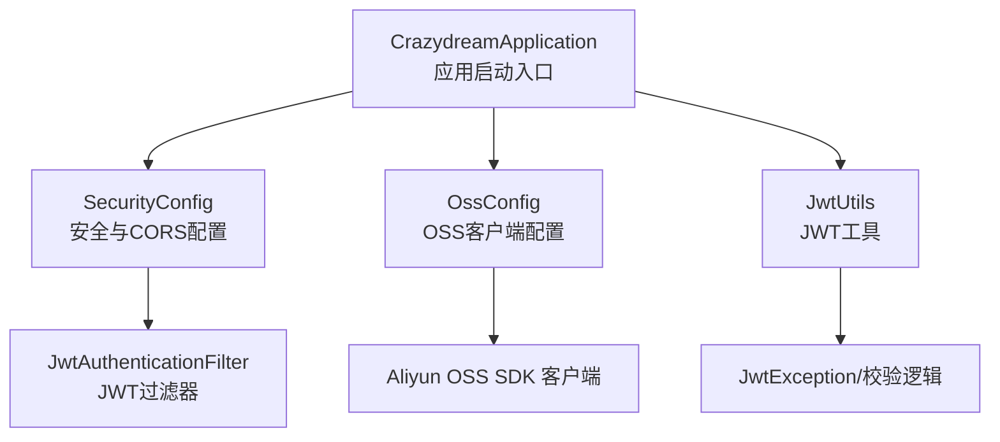
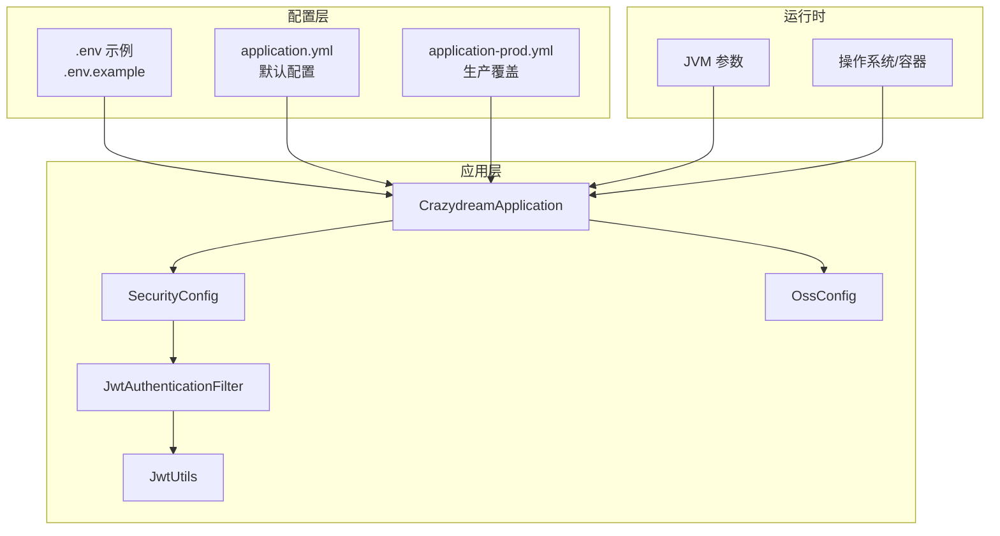
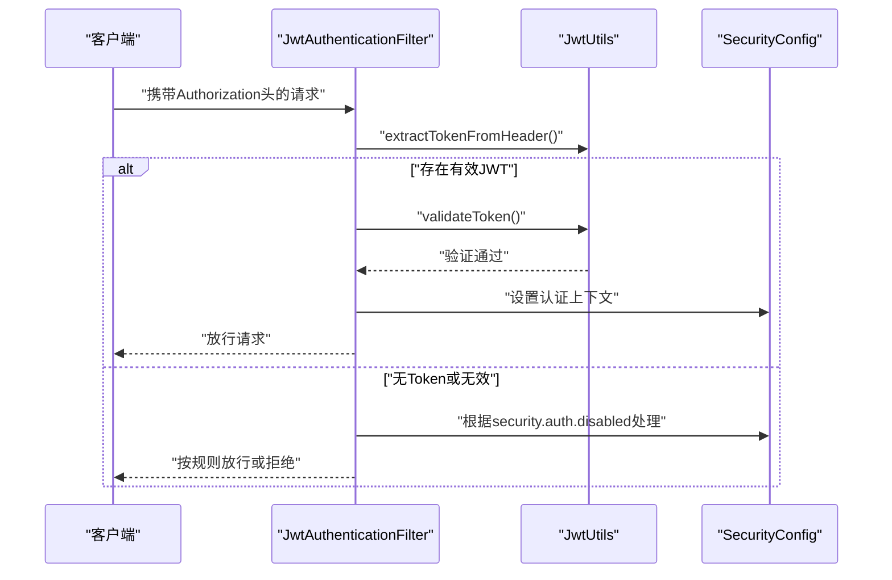

# 生产环境部署

<cite>
**本文引用的文件**
- [DEPLOYMENT.md](file://DEPLOYMENT.md)
- [.env.example](file://.env.example)
- [application.yml](file://src/main/resources/application.yml)
- [application-prod.yml](file://src/main/resources/application-prod.yml)
- [application-dev.yml](file://src/main/resources/application-dev.yml)
- [application-test.yml](file://src/main/resources/application-test.yml)
- [pom.xml](file://pom.xml)
- [SecurityConfig.java](file://src/main/java/com/crazydream/security/SecurityConfig.java)
- [JwtUtils.java](file://src/main/java/com/crazydream/utils/JwtUtils.java)
- [JwtAuthenticationFilter.java](file://src/main/java/com/crazydream/security/JwtAuthenticationFilter.java)
- [OssConfig.java](file://src/main/java/com/crazydream/config/OssConfig.java)
- [CrazydreamApplication.java](file://src/main/java/com/crazydream/CrazydreamApplication.java)
</cite>

## 目录
1. [引言](#引言)
2. [项目结构](#项目结构)
3. [核心组件](#核心组件)
4. [架构总览](#架构总览)
5. [详细组件分析](#详细组件分析)
6. [依赖关系分析](#依赖关系分析)
7. [性能考虑](#性能考虑)
8. [故障排除指南](#故障排除指南)
9. [结论](#结论)
10. [附录](#附录)

## 引言
本指南面向运维人员，提供 CrazyDream 项目的生产环境部署与运维实践，涵盖环境变量配置、JVM 参数设置、手动部署流程、安全检查（JWT 密钥、数据库密码、OSS 配置）、性能优化与监控、部署脚本使用、进程管理与故障排除。

## 项目结构
- 应用启动入口位于主类，负责扫描 Mapper 与启动 Spring Boot 应用。
- 配置文件分层：通用配置与多环境配置分离，生产环境通过独立 profile 覆盖日志与安全策略。
- 安全模块基于 Spring Security + JWT，支持按环境开关认证。
- OSS 集成通过配置类注入客户端，支持通过环境变量覆盖敏感信息。



图表来源
- [CrazydreamApplication.java](file://src/main/java/com/crazydream/CrazydreamApplication.java#L14-L27)
- [SecurityConfig.java](file://src/main/java/com/crazydream/security/SecurityConfig.java#L32-L105)
- [JwtUtils.java](file://src/main/java/com/crazydream/utils/JwtUtils.java#L29-L165)
- [JwtAuthenticationFilter.java](file://src/main/java/com/crazydream/security/JwtAuthenticationFilter.java#L29-L129)
- [OssConfig.java](file://src/main/java/com/crazydream/config/OssConfig.java#L16-L103)

章节来源
- [CrazydreamApplication.java](file://src/main/java/com/crazydream/CrazydreamApplication.java#L14-L27)
- [application.yml](file://src/main/resources/application.yml#L1-L75)
- [application-prod.yml](file://src/main/resources/application-prod.yml#L1-L14)

## 核心组件
- 应用启动与扫描：主类负责启动与 Mapper 扫描。
- 配置体系：application.yml 提供通用默认值；application-{profile}.yml 覆盖特定环境差异。
- 安全与认证：SecurityConfig 控制 CSRF、CORS、会话策略与认证规则；JwtAuthenticationFilter 拦截请求并解析 JWT；JwtUtils 提供签发、解析与校验能力。
- 文件存储：OssConfig 注入 OSS 客户端，支持通过环境变量覆盖敏感配置。

章节来源
- [CrazydreamApplication.java](file://src/main/java/com/crazydream/CrazydreamApplication.java#L14-L27)
- [SecurityConfig.java](file://src/main/java/com/crazydream/security/SecurityConfig.java#L32-L105)
- [JwtUtils.java](file://src/main/java/com/crazydream/utils/JwtUtils.java#L29-L165)
- [JwtAuthenticationFilter.java](file://src/main/java/com/crazydream/security/JwtAuthenticationFilter.java#L29-L129)
- [OssConfig.java](file://src/main/java/com/crazydream/config/OssConfig.java#L16-L103)

## 架构总览
生产环境部署遵循“配置外置 + 环境隔离 + 安全优先”的原则。通过环境变量覆盖敏感配置，结合生产 profile 的日志与安全策略，确保应用在生产环境稳定运行。



图表来源
- [application.yml](file://src/main/resources/application.yml#L1-L75)
- [application-prod.yml](file://src/main/resources/application-prod.yml#L1-L14)
- [.env.example](file://.env.example#L1-L40)
- [CrazydreamApplication.java](file://src/main/java/com/crazydream/CrazydreamApplication.java#L14-L27)
- [SecurityConfig.java](file://src/main/java/com/crazydream/security/SecurityConfig.java#L32-L105)
- [JwtUtils.java](file://src/main/java/com/crazydream/utils/JwtUtils.java#L29-L165)
- [JwtAuthenticationFilter.java](file://src/main/java/com/crazydream/security/JwtAuthenticationFilter.java#L29-L129)
- [OssConfig.java](file://src/main/java/com/crazydream/config/OssConfig.java#L16-L103)

## 详细组件分析

### 环境变量与配置优先级
- 通用配置：数据库、文件上传、MyBatis、日志、OSS、JWT、安全认证等均支持通过环境变量覆盖。
- 环境切换：通过激活 prod profile 启动生产环境。
- 配置优先级（从高到低）：命令行参数 > 环境变量 > application-{profile}.yml > application.yml。

章节来源
- [application.yml](file://src/main/resources/application.yml#L10-L75)
- [application-prod.yml](file://src/main/resources/application-prod.yml#L6-L14)
- [DEPLOYMENT.md](file://DEPLOYMENT.md#L162-L188)

### 安全配置与认证
- 生产环境默认启用安全认证，禁止匿名访问受保护接口。
- 登录/注册与健康检查接口免认证放行。
- 测试模式可通过配置禁用认证并设置默认用户 ID，仅用于测试环境。



图表来源
- [JwtAuthenticationFilter.java](file://src/main/java/com/crazydream/security/JwtAuthenticationFilter.java#L48-L127)
- [JwtUtils.java](file://src/main/java/com/crazydream/utils/JwtUtils.java#L149-L165)
- [SecurityConfig.java](file://src/main/java/com/crazydream/security/SecurityConfig.java#L54-L91)

章节来源
- [SecurityConfig.java](file://src/main/java/com/crazydream/security/SecurityConfig.java#L32-L105)
- [JwtAuthenticationFilter.java](file://src/main/java/com/crazydream/security/JwtAuthenticationFilter.java#L29-L129)
- [JwtUtils.java](file://src/main/java/com/crazydream/utils/JwtUtils.java#L29-L165)

### JWT 密钥与令牌管理
- JWT 密钥通过环境变量注入，生产环境必须使用强随机密钥。
- 支持自定义过期时间、请求头与前缀。
- 工具类提供签发、解析、校验与用户信息提取。

章节来源
- [.env.example](file://.env.example#L18-L24)
- [application.yml](file://src/main/resources/application.yml#L57-L64)
- [JwtUtils.java](file://src/main/java/com/crazydream/utils/JwtUtils.java#L29-L165)

### 数据库与连接配置
- 数据库 URL、用户名、密码通过环境变量覆盖，避免硬编码。
- 建议生产环境开启 SSL 连接与合适的时区设置。

章节来源
- [.env.example](file://.env.example#L10-L16)
- [application.yml](file://src/main/resources/application.yml#L10-L18)

### 阿里云 OSS 配置
- OSS 端点、AccessKey、Secret、Bucket、域名通过环境变量覆盖。
- 配置类注入 OSS 客户端，便于在业务层直接使用。

章节来源
- [.env.example](file://.env.example#L25-L33)
- [application.yml](file://src/main/resources/application.yml#L46-L56)
- [OssConfig.java](file://src/main/java/com/crazydream/config/OssConfig.java#L16-L103)

### 日志与生产日志级别
- 生产环境日志级别提升，减少冗余日志，聚焦业务与异常信息。

章节来源
- [application-prod.yml](file://src/main/resources/application-prod.yml#L6-L14)

### 部署策略与流程

#### 使用环境变量（推荐）
- 复制示例环境变量文件并填写真实值。
- 加载环境变量后构建并后台启动应用。

章节来源
- [DEPLOYMENT.md](file://DEPLOYMENT.md#L90-L141)
- [.env.example](file://.env.example#L1-L40)

#### 使用 JVM 参数
- 通过命令行参数直接传入生产所需的关键配置。

章节来源
- [DEPLOYMENT.md](file://DEPLOYMENT.md#L142-L152)

#### 使用 Docker（待实现）
- 提供容器化部署思路，建议结合 env-file 注入环境变量。

章节来源
- [DEPLOYMENT.md](file://DEPLOYMENT.md#L153-L159)

#### 环境切换
- 通过激活 prod profile 启动生产环境。

章节来源
- [DEPLOYMENT.md](file://DEPLOYMENT.md#L35-L49)

### 安全检查
- CI/CD 自动安全检查：在推送主分支或发起 PR 时触发。
- 检查要点：生产环境必须启用安全认证、JWT 密钥不可使用默认值、数据库密码不得明文提交。

章节来源
- [DEPLOYMENT.md](file://DEPLOYMENT.md#L191-L219)

## 依赖关系分析
- 应用启动类扫描 Mapper 并启动 Spring Boot。
- 安全配置依赖 JWT 过滤器与用户详情服务。
- JWT 工具类依赖 Spring 配置与 SLF4J 日志。
- OSS 配置依赖 Spring 容器与 Aliyun OSS SDK。

```mermaid
classDiagram
class CrazydreamApplication
class SecurityConfig
class JwtAuthenticationFilter
class JwtUtils
class OssConfig
SecurityConfig --> JwtAuthenticationFilter : "使用"
JwtAuthenticationFilter --> JwtUtils : "调用"
OssConfig --> "Aliyun OSS SDK" : "构建客户端"
CrazydreamApplication --> SecurityConfig : "依赖"
CrazydreamApplication --> OssConfig : "依赖"
```

图表来源
- [CrazydreamApplication.java](file://src/main/java/com/crazydream/CrazydreamApplication.java#L14-L27)
- [SecurityConfig.java](file://src/main/java/com/crazydream/security/SecurityConfig.java#L32-L105)
- [JwtAuthenticationFilter.java](file://src/main/java/com/crazydream/security/JwtAuthenticationFilter.java#L29-L129)
- [JwtUtils.java](file://src/main/java/com/crazydream/utils/JwtUtils.java#L29-L165)
- [OssConfig.java](file://src/main/java/com/crazydream/config/OssConfig.java#L16-L103)

章节来源
- [pom.xml](file://pom.xml#L24-L118)

## 性能考虑
- JVM 参数建议：结合 GC 日志、堆大小与并发线程数进行调优；生产环境建议开启必要的 JVM 监控参数。
- 连接池与数据库：确保数据库连接池参数合理，避免连接泄漏与超时。
- 日志级别：生产环境降低日志级别，避免过多 IO 压力。
- 文件上传：限制最大文件大小与并发上传数量，结合 OSS CDN 优化访问性能。
- 依赖版本：保持 Spring Boot、MyBatis、MySQL 驱动与 OSS SDK 的兼容性与最新稳定版本。

[本节为通用性能建议，不直接分析具体文件]

## 故障排除指南
- 启动失败：端口被占用
  - 排查占用进程并释放端口。
- 数据库连接失败
  - 检查数据库服务状态、连接 URL、用户名与密码、防火墙策略。
- JWT Token 无效
  - 确认生产环境使用自定义 JWT_SECRET、检查 token 是否过期、请求头格式是否正确。
- 文件上传失败
  - 确认 OSS 配置正确、AccessKey 权限足够、Bucket 存在且可写。
- 进程管理
  - 查找进程 PID，优雅停止或强制停止；避免直接 kill 导致资源未释放。
- 日志定位
  - 实时查看日志、搜索错误关键字、查看最近日志片段。

章节来源
- [DEPLOYMENT.md](file://DEPLOYMENT.md#L221-L299)

## 结论
通过将敏感配置外置、严格区分环境、启用生产安全策略与合理的日志级别，CrazyDream 在生产环境中具备良好的安全性与可运维性。配合 CI/CD 安全检查与完善的故障排除流程，可显著降低生产风险并提升稳定性。

[本节为总结性内容，不直接分析具体文件]

## 附录

### 环境变量清单与优先级
- 关键变量：SPRING_PROFILES_ACTIVE、SPRING_DATASOURCE_URL/USERNAME/PASSWORD、JWT_SECRET/EXPIRATION、ALIYUN_OSS_*。
- 优先级：命令行参数 > 环境变量 > application-{profile}.yml > application.yml。

章节来源
- [DEPLOYMENT.md](file://DEPLOYMENT.md#L162-L188)
- [.env.example](file://.env.example#L7-L39)
- [application.yml](file://src/main/resources/application.yml#L10-L75)

### 配置文件结构与环境覆盖
- application.yml：通用默认配置与占位符。
- application-{dev/test/prod}.yml：按环境覆盖差异化配置。

章节来源
- [application.yml](file://src/main/resources/application.yml#L1-L75)
- [application-dev.yml](file://src/main/resources/application-dev.yml#L1-L5)
- [application-test.yml](file://src/main/resources/application-test.yml#L1-L5)
- [application-prod.yml](file://src/main/resources/application-prod.yml#L1-L14)