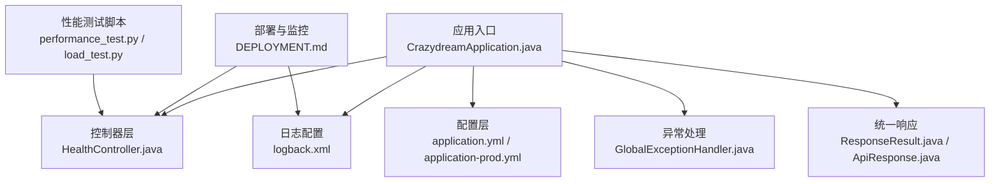
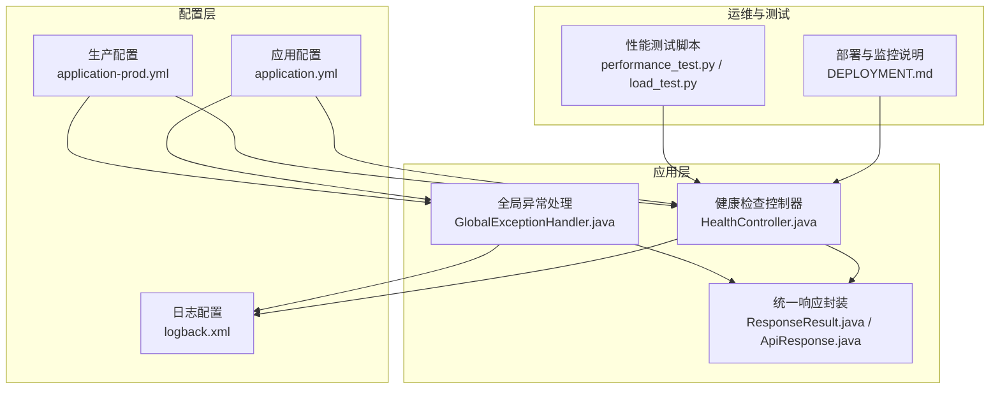
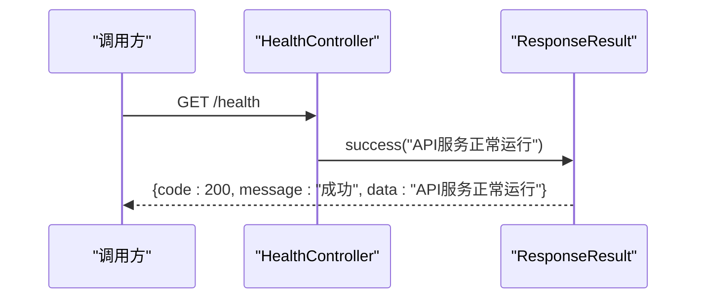
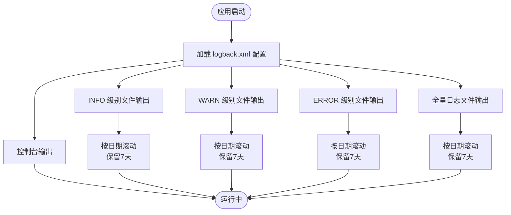
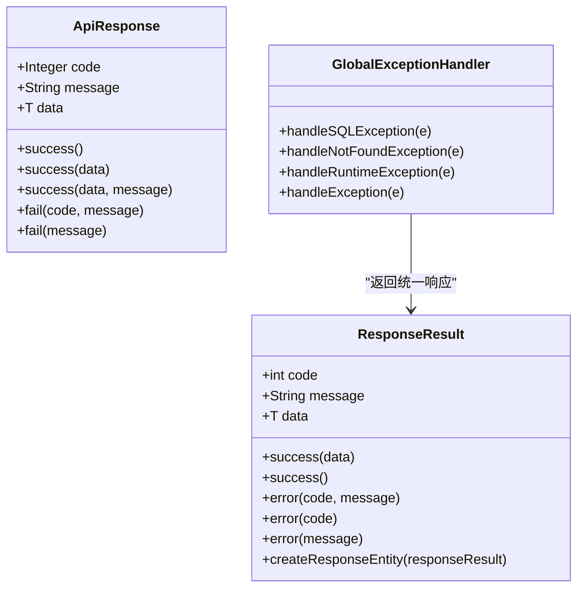
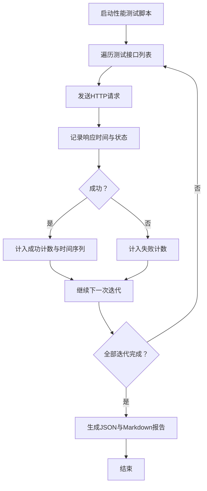
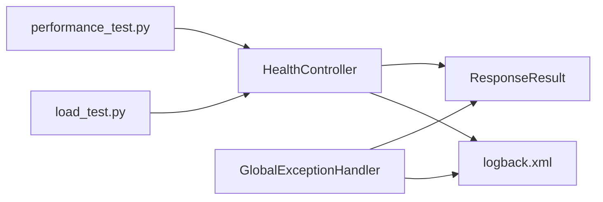

# 监控与日志

<cite>
**本文引用的文件**
- [src/main/resources/logback.xml](file://src/main/resources/logback.xml)
- [src/main/java/com/crazydream/controller/HealthController.java](file://src/main/java/com/crazydream/controller/HealthController.java)
- [src/main/resources/application.yml](file://src/main/resources/application.yml)
- [src/main/resources/application-prod.yml](file://src/main/resources/application-prod.yml)
- [src/main/java/com/crazydream/config/GlobalExceptionHandler.java](file://src/main/java/com/crazydream/config/GlobalExceptionHandler.java)
- [src/main/java/com/crazydream/utils/ResponseResult.java](file://src/main/java/com/crazydream/utils/ResponseResult.java)
- [src/main/java/com/crazydream/common/ApiResponse.java](file://src/main/java/com/crazydream/common/ApiResponse.java)
- [DEPLOYMENT.md](file://DEPLOYMENT.md)
- [performance_test.py](file://performance_test.py)
- [load_test.py](file://load_test.py)
</cite>

## 目录
1. [引言](#引言)
2. [项目结构](#项目结构)
3. [核心组件](#核心组件)
4. [架构总览](#架构总览)
5. [详细组件分析](#详细组件分析)
6. [依赖关系分析](#依赖关系分析)
7. [性能考量](#性能考量)
8. [故障排查指南](#故障排查指南)
9. [结论](#结论)
10. [附录](#附录)

## 引言
本文件面向运维与开发团队，系统性说明 CrazyDream 项目的监控与日志管理实践，涵盖健康检查接口、日志采集与轮转、异常处理与统一响应、性能测试与压测脚本、以及生产环境的监控与告警建议。内容基于仓库现有实现与文档，帮助快速建立稳定可靠的运行时可观测体系。

## 项目结构
围绕监控与日志的关键文件分布如下：
- 日志配置：Logback XML 配置文件
- 健康检查：健康检查控制器
- 统一响应：全局异常处理与统一响应封装
- 环境配置：开发/生产配置文件
- 部署与监控：部署文档中的日志与健康检查说明
- 性能测试：Python 脚本用于基准与负载测试

图表来源
- [src/main/java/com/crazydream/controller/HealthController.java](file://src/main/java/com/crazydream/controller/HealthController.java#L1-L16)
- [src/main/resources/application.yml](file://src/main/resources/application.yml#L1-L75)
- [src/main/resources/application-prod.yml](file://src/main/resources/application-prod.yml#L1-L14)
- [src/main/java/com/crazydream/config/GlobalExceptionHandler.java](file://src/main/java/com/crazydream/config/GlobalExceptionHandler.java#L1-L61)
- [src/main/resources/logback.xml](file://src/main/resources/logback.xml#L1-L99)
- [src/main/java/com/crazydream/utils/ResponseResult.java](file://src/main/java/com/crazydream/utils/ResponseResult.java#L1-L149)
- [src/main/java/com/crazydream/common/ApiResponse.java](file://src/main/java/com/crazydream/common/ApiResponse.java#L1-L108)
- [DEPLOYMENT.md](file://DEPLOYMENT.md#L254-L281)
- [performance_test.py](file://performance_test.py#L1-L209)
- [load_test.py](file://load_test.py#L1-L132)

章节来源
- [DEPLOYMENT.md](file://DEPLOYMENT.md#L254-L281)

## 核心组件
- 健康检查接口：提供 /health 快速判断服务可用性
- 日志系统：基于 Logback 的多级别文件轮转与控制台输出
- 统一响应与异常处理：规范化错误返回与日志记录
- 环境配置：开发/生产环境日志级别与安全策略差异
- 性能测试脚本：提供基准与负载测试能力

章节来源
- [src/main/java/com/crazydream/controller/HealthController.java](file://src/main/java/com/crazydream/controller/HealthController.java#L1-L16)
- [src/main/resources/logback.xml](file://src/main/resources/logback.xml#L1-L99)
- [src/main/java/com/crazydream/config/GlobalExceptionHandler.java](file://src/main/java/com/crazydream/config/GlobalExceptionHandler.java#L1-L61)
- [src/main/resources/application.yml](file://src/main/resources/application.yml#L1-L75)
- [src/main/resources/application-prod.yml](file://src/main/resources/application-prod.yml#L1-L14)
- [src/main/java/com/crazydream/utils/ResponseResult.java](file://src/main/java/com/crazydream/utils/ResponseResult.java#L1-L149)
- [src/main/java/com/crazydream/common/ApiResponse.java](file://src/main/java/com/crazydream/common/ApiResponse.java#L1-L108)
- [performance_test.py](file://performance_test.py#L1-L209)
- [load_test.py](file://load_test.py#L1-L132)

## 架构总览
下图展示监控与日志在系统中的位置与交互关系。

图表来源
- [src/main/java/com/crazydream/controller/HealthController.java](file://src/main/java/com/crazydream/controller/HealthController.java#L1-L16)
- [src/main/java/com/crazydream/config/GlobalExceptionHandler.java](file://src/main/java/com/crazydream/config/GlobalExceptionHandler.java#L1-L61)
- [src/main/java/com/crazydream/utils/ResponseResult.java](file://src/main/java/com/crazydream/utils/ResponseResult.java#L1-L149)
- [src/main/java/com/crazydream/common/ApiResponse.java](file://src/main/java/com/crazydream/common/ApiResponse.java#L1-L108)
- [src/main/resources/application.yml](file://src/main/resources/application.yml#L1-L75)
- [src/main/resources/application-prod.yml](file://src/main/resources/application-prod.yml#L1-L14)
- [src/main/resources/logback.xml](file://src/main/resources/logback.xml#L1-L99)
- [DEPLOYMENT.md](file://DEPLOYMENT.md#L254-L281)
- [performance_test.py](file://performance_test.py#L1-L209)
- [load_test.py](file://load_test.py#L1-L132)

## 详细组件分析

### 健康检查接口
- 接口路径：/health
- 方法：GET
- 返回：统一响应封装，包含状态码、消息与数据
- 响应示例（来自部署文档）：
  - code: 200
  - message: “成功”
  - data: “API服务正常运行”

图表来源
- [src/main/java/com/crazydream/controller/HealthController.java](file://src/main/java/com/crazydream/controller/HealthController.java#L1-L16)
- [src/main/java/com/crazydream/utils/ResponseResult.java](file://src/main/java/com/crazydream/utils/ResponseResult.java#L1-L149)
- [DEPLOYMENT.md](file://DEPLOYMENT.md#L269-L281)

章节来源
- [src/main/java/com/crazydream/controller/HealthController.java](file://src/main/java/com/crazydream/controller/HealthController.java#L1-L16)
- [src/main/java/com/crazydream/utils/ResponseResult.java](file://src/main/java/com/crazydream/utils/ResponseResult.java#L1-L149)
- [DEPLOYMENT.md](file://DEPLOYMENT.md#L269-L281)

### 日志系统与轮转
- 日志输出目标：
  - 控制台输出
  - INFO/WARN/ERROR 级别分别写入独立文件
  - 全量日志写入 all.log
- 日志轮转策略：
  - 基于日期滚动
  - 保留历史天数（MaxHistory）
- 日志级别：
  - 开发环境：com.crazydream/INFO，org.mybatis/INFO，java.sql/DEBUG
  - 生产环境：com.crazydream/INFO，org.mybatis/WARN
- 日志目录：./logs

图表来源
- [src/main/resources/logback.xml](file://src/main/resources/logback.xml#L1-L99)
- [src/main/resources/application.yml](file://src/main/resources/application.yml#L40-L45)
- [src/main/resources/application-prod.yml](file://src/main/resources/application-prod.yml#L6-L10)

章节来源
- [src/main/resources/logback.xml](file://src/main/resources/logback.xml#L1-L99)
- [src/main/resources/application.yml](file://src/main/resources/application.yml#L40-L45)
- [src/main/resources/application-prod.yml](file://src/main/resources/application-prod.yml#L6-L10)

### 统一响应与异常处理
- 统一响应：
  - ResponseResult：封装 code/message/data，并可转换为 ResponseEntity
  - ApiResponse：Lombok模型，用于某些场景下的响应封装
- 全局异常处理：
  - 捕获 SQL 异常、资源未找到、运行时异常、通用异常
  - 记录日志并返回标准化错误响应
  - 对特定业务异常进行状态码细分（如 404/400/500）

图表来源
- [src/main/java/com/crazydream/utils/ResponseResult.java](file://src/main/java/com/crazydream/utils/ResponseResult.java#L1-L149)
- [src/main/java/com/crazydream/common/ApiResponse.java](file://src/main/java/com/crazydream/common/ApiResponse.java#L1-L108)
- [src/main/java/com/crazydream/config/GlobalExceptionHandler.java](file://src/main/java/com/crazydream/config/GlobalExceptionHandler.java#L1-L61)

章节来源
- [src/main/java/com/crazydream/utils/ResponseResult.java](file://src/main/java/com/crazydream/utils/ResponseResult.java#L1-L149)
- [src/main/java/com/crazydream/common/ApiResponse.java](file://src/main/java/com/crazydream/common/ApiResponse.java#L1-L108)
- [src/main/java/com/crazydream/config/GlobalExceptionHandler.java](file://src/main/java/com/crazydream/config/GlobalExceptionHandler.java#L1-L61)

### 环境配置与日志级别差异
- 开发环境：
  - 日志级别：com.crazydream/INFO，org.mybatis/INFO，java.sql/DEBUG
  - 安全认证可禁用（仅测试）
- 生产环境：
  - 日志级别：com.crazydream/INFO，org.mybatis/WARN
  - 安全认证启用
- 环境切换：通过 spring.profiles.active 激活不同配置文件

章节来源
- [src/main/resources/application.yml](file://src/main/resources/application.yml#L25-L27)
- [src/main/resources/application.yml](file://src/main/resources/application.yml#L40-L45)
- [src/main/resources/application.yml](file://src/main/resources/application.yml#L66-L75)
- [src/main/resources/application-prod.yml](file://src/main/resources/application-prod.yml#L6-L14)

### 性能测试与负载测试
- 基准测试（performance_test.py）：
  - 测试多个接口的响应时间、成功率、吞吐量、百分位数
  - 输出 JSON 与 Markdown 报告
- 负载测试（load_test.py）：
  - 多线程并发模拟用户行为，统计吞吐量与响应时间分布

图表来源
- [performance_test.py](file://performance_test.py#L1-L209)

章节来源
- [performance_test.py](file://performance_test.py#L1-L209)
- [load_test.py](file://load_test.py#L1-L132)

## 依赖关系分析
- 健康检查依赖统一响应封装，保证返回格式一致
- 全局异常处理依赖日志记录与统一响应，形成统一的错误输出
- 日志配置影响开发/生产环境的可观测性与调试成本
- 性能测试脚本依赖健康检查接口与业务接口，用于评估系统稳定性

图表来源
- [src/main/java/com/crazydream/controller/HealthController.java](file://src/main/java/com/crazydream/controller/HealthController.java#L1-L16)
- [src/main/java/com/crazydream/utils/ResponseResult.java](file://src/main/java/com/crazydream/utils/ResponseResult.java#L1-L149)
- [src/main/java/com/crazydream/config/GlobalExceptionHandler.java](file://src/main/java/com/crazydream/config/GlobalExceptionHandler.java#L1-L61)
- [src/main/resources/logback.xml](file://src/main/resources/logback.xml#L1-L99)
- [performance_test.py](file://performance_test.py#L1-L209)
- [load_test.py](file://load_test.py#L1-L132)

## 性能考量
- 基准测试关注：
  - 成功率、平均/中位/百分位响应时间、吞吐量
  - 通过脚本输出 JSON 与 Markdown 报告，便于对比与归档
- 负载测试关注：
  - 并发用户数、测试时长、请求间隔
  - 统计各接口的成功率与响应时间分布，识别瓶颈
- 建议：
  - 在预生产环境先进行基准与负载测试，记录基线
  - 结合日志级别与数据库慢查询日志，定位性能热点
  - 对关键接口增加缓存与异步处理，降低数据库压力

章节来源
- [performance_test.py](file://performance_test.py#L1-L209)
- [load_test.py](file://load_test.py#L1-L132)

## 故障排查指南
- 健康检查
  - 使用 /health 快速确认服务可用性
  - 若返回非 200，结合日志定位异常
- 日志查看与分析
  - 实时查看：tail -f app.log
  - 错误搜索：grep ERROR app.log
  - 最近日志：tail -n 100 app.log
- 常见问题
  - 端口占用：查找占用进程并释放
  - 数据库连接失败：核对连接URL、用户名、密码与防火墙
  - JWT 无效：确认生产环境使用自定义密钥、检查过期与请求头格式
  - 文件上传失败：核对 OSS 配置与权限

章节来源
- [DEPLOYMENT.md](file://DEPLOYMENT.md#L254-L281)
- [DEPLOYMENT.md](file://DEPLOYMENT.md#L221-L251)

## 结论
通过健康检查接口、完善的日志配置与轮转、统一的异常处理与响应封装，以及性能测试脚本，CrazyDream 项目具备了基础而实用的监控与日志能力。建议在生产环境中：
- 明确日志级别与保留策略
- 建立健康检查与日志告警联动
- 定期进行性能回归测试
- 结合数据库慢查询与外部依赖监控，完善整体可观测性

## 附录
- 健康检查接口
  - 路径：/health
  - 方法：GET
  - 响应示例（来自部署文档）：
    - code: 200
    - message: “成功”
    - data: “API服务正常运行”
- 日志查看命令
  - 实时查看：tail -f app.log
  - 错误搜索：grep ERROR app.log
  - 最近日志：tail -n 100 app.log

章节来源
- [DEPLOYMENT.md](file://DEPLOYMENT.md#L269-L281)
- [DEPLOYMENT.md](file://DEPLOYMENT.md#L254-L267)