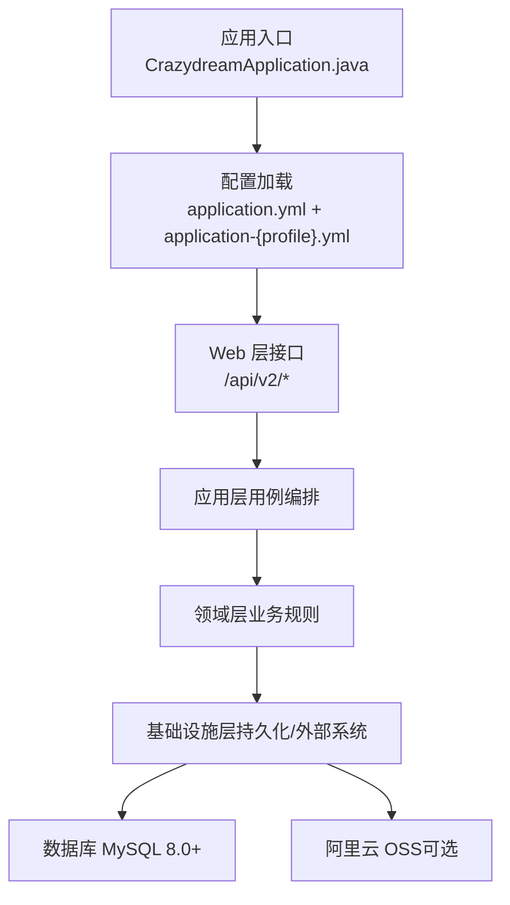
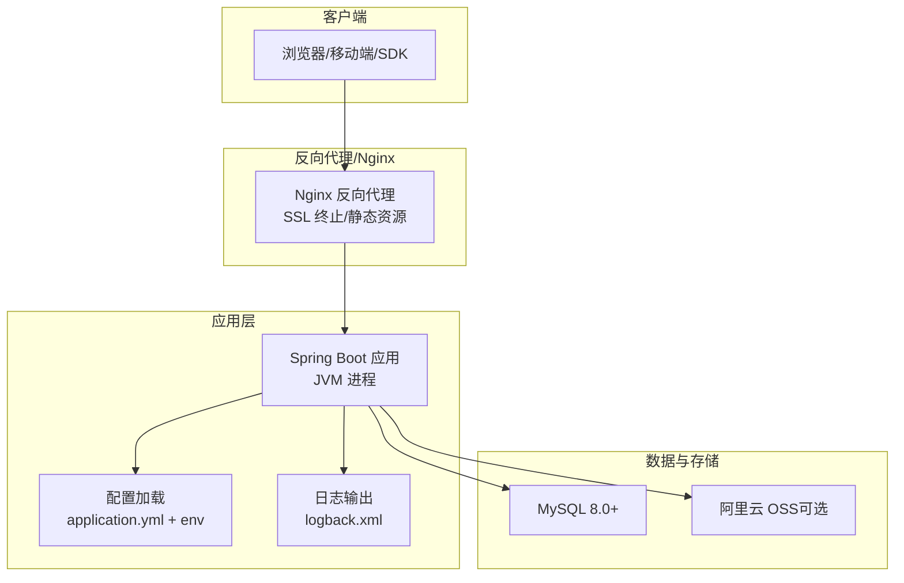
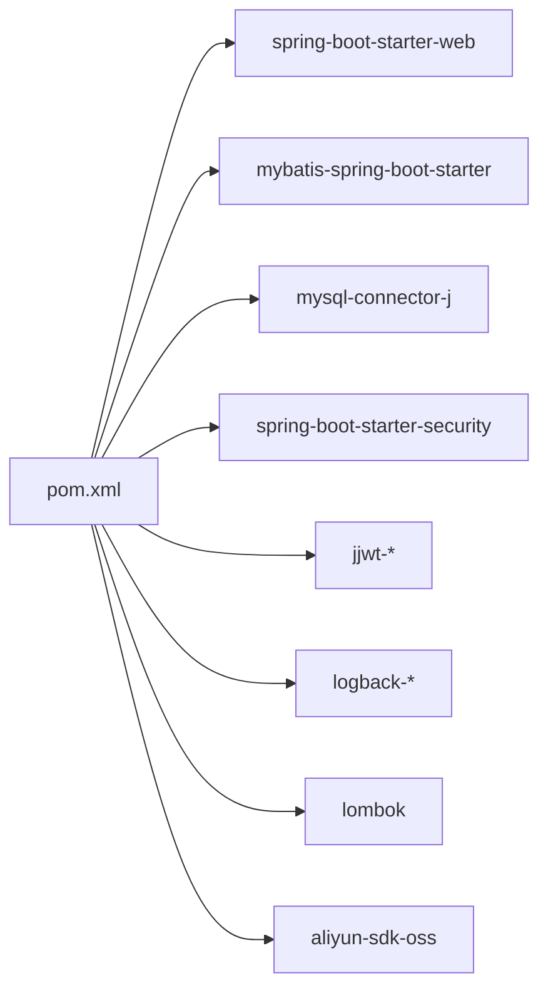

# 部署指南

<cite>
**本文引用的文件**
- [DEPLOYMENT.md](file://DEPLOYMENT.md)
- [README.md](file://README.md)
- [pom.xml](file://pom.xml)
- [.env.example](file://.env.example)
- [.env.test](file://.env.test)
- [application.yml](file://src/main/resources/application.yml)
- [application-dev.yml](file://src/main/resources/application-dev.yml)
- [application-test.yml](file://src/main/resources/application-test.yml)
- [application-prod.yml](file://src/main/resources/application-prod.yml)
- [schema.sql](file://src/main/resources/schema.sql)
- [logback.xml](file://src/main/resources/logback.xml)
</cite>

## 目录
1. [简介](#简介)
2. [项目结构](#项目结构)
3. [核心组件](#核心组件)
4. [架构总览](#架构总览)
5. [详细组件分析](#详细组件分析)
6. [依赖分析](#依赖分析)
7. [性能考虑](#性能考虑)
8. [故障排除指南](#故障排除指南)
9. [结论](#结论)
10. [附录](#附录)

## 简介
本指南面向运维与开发团队，提供 CrazyDream 项目的完整部署与维护方案，涵盖开发、测试与生产环境的配置差异与部署流程；同时给出容器化部署思路、数据库初始化与迁移策略、环境变量配置、Nginx 反向代理与 SSL 证书设置、监控与告警建议、部署脚本与回滚策略、以及常见问题排查方法。

## 项目结构
- 应用采用 Spring Boot 3.2.0 + Java 17 + MyBatis 架构，按 DDD + COLA 四层分层组织代码。
- 配置采用多 profile 的 YAML 文件与环境变量组合，支持 dev/test/prod 三套环境。
- 项目通过 Maven 构建，打包为可执行 JAR，支持直接运行与容器化部署。

图表来源
- [application.yml](file://src/main/resources/application.yml#L1-L75)
- [pom.xml](file://pom.xml#L1-L163)

章节来源
- [README.md](file://README.md#L46-L85)
- [application.yml](file://src/main/resources/application.yml#L1-L75)
- [pom.xml](file://pom.xml#L1-L163)

## 核心组件
- 配置体系
  - application.yml 提供通用配置与默认值，application-{profile}.yml 覆盖特定环境差异。
  - 支持通过环境变量覆盖敏感配置（数据库、JWT、OSS 等）。
- 数据库与初始化
  - schema.sql 提供初始表结构与默认数据，生产环境建议配合迁移工具管理变更。
- 日志与监控
  - logback.xml 定义滚动日志与级别过滤，生产环境建议结合集中式日志与告警平台。
- 安全与认证
  - security.auth.disabled 在不同环境有不同默认行为，生产环境必须启用认证。

章节来源
- [application.yml](file://src/main/resources/application.yml#L10-L75)
- [application-prod.yml](file://src/main/resources/application-prod.yml#L1-L14)
- [schema.sql](file://src/main/resources/schema.sql#L1-L111)
- [logback.xml](file://src/main/resources/logback.xml#L1-L99)

## 架构总览
下图展示从客户端到应用、数据库与对象存储的整体交互：

图表来源
- [application.yml](file://src/main/resources/application.yml#L10-L75)
- [logback.xml](file://src/main/resources/logback.xml#L1-L99)

## 详细组件分析

### 开发环境（dev）
- 启动方式
  - 直接使用 Maven 启动，默认激活 dev。
  - 可通过命令行参数或环境变量覆盖配置。
- 数据库
  - 默认使用本地 MySQL，建议先创建数据库并执行 schema.sql 初始化。
- 认证
  - 默认允许禁用认证，便于本地联调。
- 日志
  - 默认开启 DEBUG 级别，便于开发调试。

章节来源
- [DEPLOYMENT.md](file://DEPLOYMENT.md#L52-L84)
- [application.yml](file://src/main/resources/application.yml#L10-L75)
- [application-dev.yml](file://src/main/resources/application-dev.yml#L1-L5)

### 测试环境（test）
- 启动方式
  - 通过 Maven 指定 profile=test 启动。
- 数据库
  - 可使用独立测试库，避免与开发数据冲突。
- 认证
  - 可根据需要启用或禁用认证，便于自动化测试。
- 日志
  - 日志级别与开发一致，便于定位问题。

章节来源
- [DEPLOYMENT.md](file://DEPLOYMENT.md#L35-L48)
- [application-test.yml](file://src/main/resources/application-test.yml#L1-L5)
- [.env.test](file://.env.test#L1-L5)

### 生产环境（prod）
- 启动方式
  - 推荐使用环境变量文件加载配置，然后以 nohup 或 systemd 管理进程。
  - 也可通过 JVM 参数覆盖配置。
- 安全
  - 生产环境必须启用认证，JWT 密钥必须使用强随机值。
- 数据库
  - 建议使用专用生产库，开启 SSL 连接，严格限制网络访问。
- 日志
  - 生产环境日志级别提升为 INFO/WARN/ERROR，建议接入集中式日志平台。

章节来源
- [DEPLOYMENT.md](file://DEPLOYMENT.md#L88-L158)
- [application-prod.yml](file://src/main/resources/application-prod.yml#L1-L14)
- [.env.example](file://.env.example#L1-L40)

### 配置优先级与覆盖
- Spring Boot 配置优先级（从高到低）：命令行参数 > 环境变量 > application-{profile}.yml > application.yml。
- 建议生产环境通过环境变量覆盖敏感信息，避免硬编码。

章节来源
- [DEPLOYMENT.md](file://DEPLOYMENT.md#L180-L188)
- [application.yml](file://src/main/resources/application.yml#L10-L75)

### 数据库初始化与迁移
- 初始化
  - 使用 schema.sql 创建表结构与默认数据。
- 迁移策略
  - 建议引入数据库迁移工具（如 Flyway/Liquibase），在生产环境以只读方式执行迁移脚本，确保结构演进可控。
- 备份与恢复
  - 定期备份数据库，验证恢复流程，制定最小 RTO/RPO。

章节来源
- [schema.sql](file://src/main/resources/schema.sql#L1-L111)

### 日志与监控
- 日志
  - logback.xml 定义控制台与滚动文件输出，按级别拆分文件，保留 7 天历史。
- 监控
  - 建议结合应用健康检查接口与第三方监控平台，设置 CPU/内存/数据库连接数/请求延迟/错误率等告警。

章节来源
- [logback.xml](file://src/main/resources/logback.xml#L1-L99)
- [DEPLOYMENT.md](file://DEPLOYMENT.md#L254-L281)

### 安全检查与 CI/CD
- 安全检查
  - 包含对生产配置的检查脚本，验证 JWT 密钥、数据库密码、认证开关等。
- CI/CD
  - 可在推送主分支或 PR 时触发安全检查工作流。

章节来源
- [DEPLOYMENT.md](file://DEPLOYMENT.md#L191-L218)

### 容器化部署（Docker）
- 构建镜像
  - 使用多阶段构建减少镜像体积，暴露应用端口。
- 运行容器
  - 通过 --env-file 挂载 .env 文件，或使用 Docker 环境变量覆盖敏感配置。
- 健康检查
  - 在容器中执行健康检查 URL，确保容器重启策略与编排平台联动。

章节来源
- [DEPLOYMENT.md](file://DEPLOYMENT.md#L153-L158)

### Nginx 反向代理与 SSL
- 反向代理
  - 将域名解析到 Nginx，Nginx 将请求转发至应用端口。
- SSL 证书
  - 建议使用 Let’s Encrypt 自动签发与续期，开启 HSTS 与现代 TLS 参数。
- 静态资源
  - 可由 Nginx 提供静态资源，减轻应用压力。

章节来源
- [DEPLOYMENT.md](file://DEPLOYMENT.md#L88-L158)

### 部署脚本与回滚策略
- 部署脚本
  - 建议封装构建、安全检查、停止旧实例、启动新实例、健康检查等步骤。
- 回滚策略
  - 保留上一版本制品，快速回滚；若涉及数据库变更，需准备逆向迁移脚本。

章节来源
- [DEPLOYMENT.md](file://DEPLOYMENT.md#L122-L140)

## 依赖分析
- 运行时依赖
  - Spring Web、MyBatis、MySQL 驱动、Spring Security、JWT、Logback、Lombok、阿里云 OSS SDK。
- 构建插件
  - maven-compiler-plugin、spring-boot-maven-plugin、mybatis-generator-maven-plugin。

图表来源
- [pom.xml](file://pom.xml#L24-L118)

章节来源
- [pom.xml](file://pom.xml#L1-L163)

## 性能考虑
- JVM 参数
  - 合理设置堆大小、GC 策略与线程池大小，结合压测结果优化。
- 数据库
  - 为热点表建立合适索引，避免 N+1 查询，使用连接池参数调优。
- 缓存
  - 对热点读取场景引入缓存（Redis），降低数据库压力。
- 网络与并发
  - Nginx 与应用并发配置匹配，开启压缩与 Keep-Alive。

## 故障排除指南
- 启动失败：端口被占用
  - 查找占用进程并释放端口。
- 数据库连接失败
  - 检查数据库服务状态、连接串、账号密码与网络策略。
- JWT 无效
  - 确认生产环境使用强随机密钥，校验请求头格式与过期时间。
- 文件上传失败
  - 校验 OSS 配置、权限与 Bucket 状态。
- 健康检查异常
  - 通过健康检查接口确认服务状态，结合日志定位问题。

章节来源
- [DEPLOYMENT.md](file://DEPLOYMENT.md#L221-L251)
- [DEPLOYMENT.md](file://DEPLOYMENT.md#L269-L281)

## 结论
通过明确的环境配置、严格的生产安全策略、完善的日志与监控、以及标准化的部署与回滚流程，CrazyDream 可以稳定地在各类环境中交付与运营。建议在生产环境引入数据库迁移工具、集中式日志与告警平台，并完善自动化测试与 CI/CD 流水线。

## 附录

### 环境变量与配置对照
- 关键变量
  - SPRING_PROFILES_ACTIVE：dev/test/prod
  - SPRING_DATASOURCE_*：数据库连接
  - JWT_SECRET/JWT_EXPIRATION：JWT 密钥与过期时间
  - ALIYUN_OSS_*：OSS 配置（可选）
  - SECURITY_AUTH_DISABLED：生产环境必须关闭
- 优先级
  - 命令行参数 > 环境变量 > application-{profile}.yml > application.yml

章节来源
- [DEPLOYMENT.md](file://DEPLOYMENT.md#L162-L188)
- [.env.example](file://.env.example#L1-L40)
- [application.yml](file://src/main/resources/application.yml#L10-L75)

### 配置文件结构与差异
- application.yml：通用默认配置与占位变量
- application-dev.yml：开发环境特有覆盖（当前为空）
- application-test.yml：测试环境特有覆盖（当前为空）
- application-prod.yml：生产环境特有覆盖（日志级别、安全开关）

章节来源
- [application.yml](file://src/main/resources/application.yml#L1-L75)
- [application-dev.yml](file://src/main/resources/application-dev.yml#L1-L5)
- [application-test.yml](file://src/main/resources/application-test.yml#L1-L5)
- [application-prod.yml](file://src/main/resources/application-prod.yml#L1-L14)