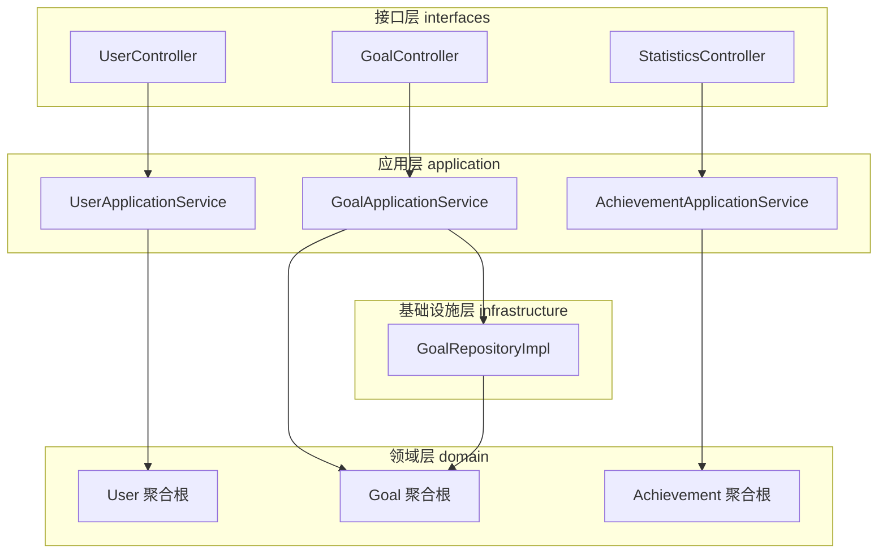
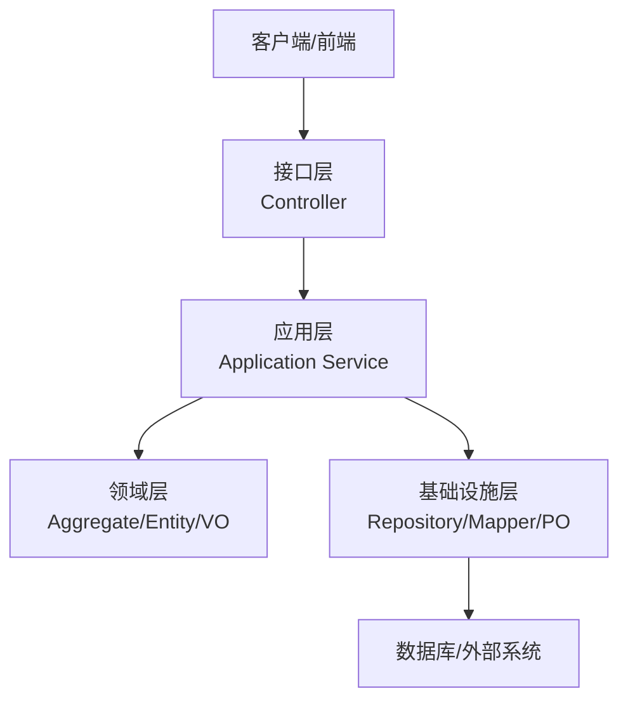
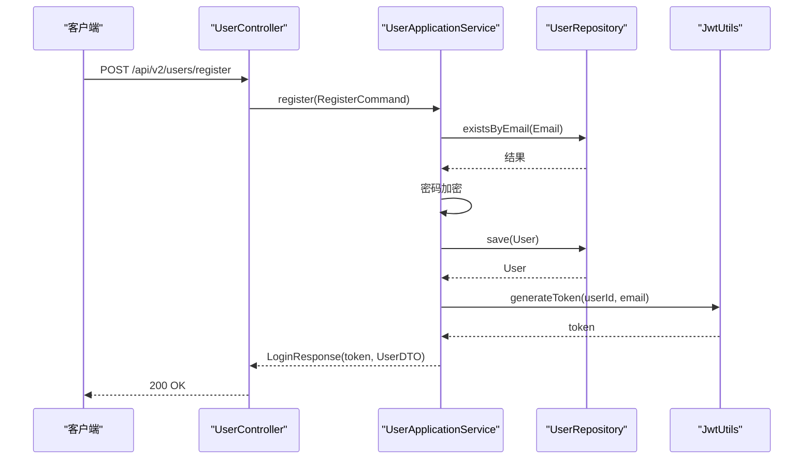
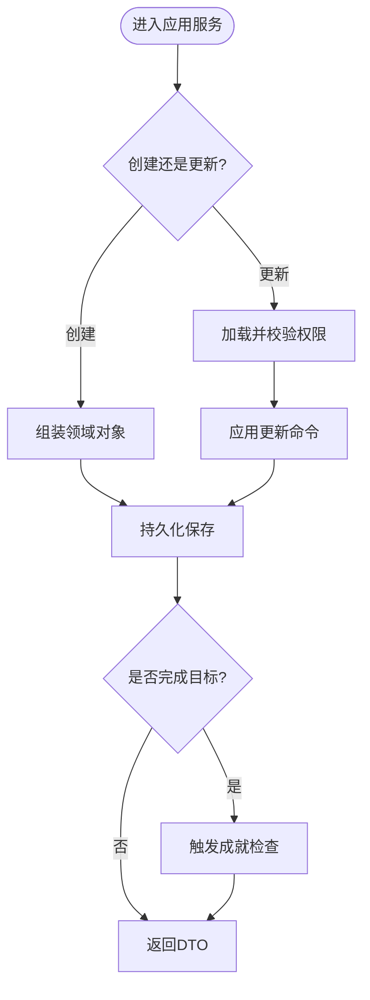
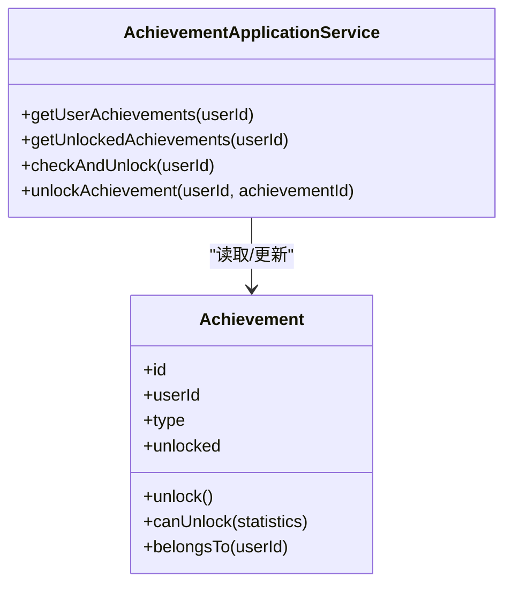
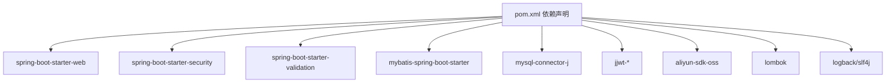

# 项目概述

<cite>
**本文引用的文件**
- [README.md](file://README.md)
- [pom.xml](file://pom.xml)
- [application.yml](file://src/main/resources/application.yml)
- [CrazydreamApplication.java](file://src/main/java/com/crazydream/CrazydreamApplication.java)
- [SecurityConfig.java](file://src/main/java/com/crazydream/security/SecurityConfig.java)
- [UserController.java](file://src/main/java/com/crazydream/interfaces/user/UserController.java)
- [UserApplicationService.java](file://src/main/java/com/crazydream/application/user/service/UserApplicationService.java)
- [User.java](file://src/main/java/com/crazydream/domain/user/model/aggregate/User.java)
- [GoalController.java](file://src/main/java/com/crazydream/interfaces/goal/GoalController.java)
- [GoalApplicationService.java](file://src/main/java/com/crazydream/application/goal/service/GoalApplicationService.java)
- [Goal.java](file://src/main/java/com/crazydream/domain/goal/model/aggregate/Goal.java)
- [GoalRepositoryImpl.java](file://src/main/java/com/crazydream/infrastructure/persistence/repository/GoalRepositoryImpl.java)
- [AchievementApplicationService.java](file://src/main/java/com/crazydream/application/achievement/service/AchievementApplicationService.java)
- [Achievement.java](file://src/main/java/com/crazydream/domain/achievement/model/aggregate/Achievement.java)
- [StatisticsController.java](file://src/main/java/com/crazydream/interfaces/statistics/StatisticsController.java)
- [project.md](file://openspec/project.md)
</cite>

## 目录
1. [引言](#引言)
2. [项目结构](#项目结构)
3. [核心组件](#核心组件)
4. [架构总览](#架构总览)
5. [详细组件分析](#详细组件分析)
6. [依赖关系分析](#依赖关系分析)
7. [性能考量](#性能考量)
8. [故障排查指南](#故障排查指南)
9. [结论](#结论)
10. [附录](#附录)

## 引言
CrazyDream 是一个面向个人人生规划与目标管理的后端服务系统，帮助用户将宏大目标拆解为可执行的小目标，通过持续追踪与成就激励机制，推动用户实现梦想。系统提供用户认证与授权、目标与子目标管理、分类管理、成就系统、数据统计与文件上传等能力，支持将人生目标转化为可落地的行动计划。

- 核心价值主张
  - 以目标为导向的“人生计划清单”，帮助用户建立长期愿景与短期行动之间的桥梁。
  - 通过成就系统与统计面板，形成正向反馈闭环，提升坚持与完成率。
  - 采用 DDD + COLA 四层架构，确保业务内核稳定、可演进、易维护。

- 主要功能特性
  - 用户管理：注册、登录、个人信息与积分等级管理。
  - 目标管理：创建、查询、更新、删除、批量操作、进度追踪、完成与提醒。
  - 子目标管理：围绕目标的子任务与进度管理。
  - 分类管理：目标分类与权限控制。
  - 成就系统：自动解锁与条件检查。
  - 数据统计：目标完成统计、仪表盘与趋势分析。
  - 文件管理：头像上传与阿里云 OSS 集成。

- 技术架构优势
  - DDD + COLA 四层架构：清晰分层、职责分离、领域模型驱动。
  - Spring Boot + MyBatis：轻量、高效、易于扩展。
  - Spring Security + JWT：无状态认证与细粒度授权。
  - 可插拔的基础设施层：便于替换持久化与外部系统。

**章节来源**
- [README.md](file://README.md#L3-L45)

## 项目结构
项目采用按“层次”划分的目录结构，配合按“领域/功能”组织的包结构，体现 COLA 四层与 DDD 的结合：

- 接口层（interfaces）：对外暴露 REST API（v2：/api/v2/*），负责请求适配与 DTO 组装。
- 应用层（application）：编排用例流程、事务控制，不直接依赖基础设施。
- 领域层（domain）：聚合根、实体、值对象、领域服务等，承载核心业务规则。
- 基础设施层（infrastructure）：实现 Repository、数据持久化与外部系统（如 OSS）适配。
- 支撑模块：config、security、common、utils 提供配置、安全、公共模型与通用工具。

**图示来源**
- [CrazydreamApplication.java](file://src/main/java/com/crazydream/CrazydreamApplication.java#L14-L27)
- [UserController.java](file://src/main/java/com/crazydream/interfaces/user/UserController.java#L14-L132)
- [GoalController.java](file://src/main/java/com/crazydream/interfaces/goal/GoalController.java#L26-L288)
- [StatisticsController.java](file://src/main/java/com/crazydream/interfaces/statistics/StatisticsController.java#L25-L135)
- [UserApplicationService.java](file://src/main/java/com/crazydream/application/user/service/UserApplicationService.java#L15-L98)
- [GoalApplicationService.java](file://src/main/java/com/crazydream/application/goal/service/GoalApplicationService.java#L30-L246)
- [AchievementApplicationService.java](file://src/main/java/com/crazydream/application/achievement/service/AchievementApplicationService.java#L16-L91)
- [GoalRepositoryImpl.java](file://src/main/java/com/crazydream/infrastructure/persistence/repository/GoalRepositoryImpl.java#L25-L112)
- [User.java](file://src/main/java/com/crazydream/domain/user/model/aggregate/User.java#L12-L122)
- [Goal.java](file://src/main/java/com/crazydream/domain/goal/model/aggregate/Goal.java#L17-L293)
- [Achievement.java](file://src/main/java/com/crazydream/domain/achievement/model/aggregate/Achievement.java#L12-L184)

**章节来源**
- [README.md](file://README.md#L62-L85)

## 核心组件
- 启动类与扫描
  - 应用启动类负责引导 Spring Boot 并启用 MyBatis Mapper 扫描。
- 安全与认证
  - 基于 Spring Security + JWT 的无状态认证；支持开发/测试模式下的默认用户与 CORS 配置。
- 控制器与应用服务
  - 控制器负责请求适配、鉴权上下文解析与响应封装；应用服务编排业务流程、事务控制与领域交互。
- 领域模型
  - 用户、目标、成就等聚合根封装业务行为与不变量，体现充血模型。
- 仓储实现
  - 基础设施层实现 Repository，桥接领域对象与持久化映射。

**章节来源**
- [CrazydreamApplication.java](file://src/main/java/com/crazydream/CrazydreamApplication.java#L14-L27)
- [SecurityConfig.java](file://src/main/java/com/crazydream/security/SecurityConfig.java#L32-L105)
- [UserController.java](file://src/main/java/com/crazydream/interfaces/user/UserController.java#L14-L132)
- [GoalController.java](file://src/main/java/com/crazydream/interfaces/goal/GoalController.java#L26-L288)
- [StatisticsController.java](file://src/main/java/com/crazydream/interfaces/statistics/StatisticsController.java#L25-L135)
- [UserApplicationService.java](file://src/main/java/com/crazydream/application/user/service/UserApplicationService.java#L15-L98)
- [GoalApplicationService.java](file://src/main/java/com/crazydream/application/goal/service/GoalApplicationService.java#L30-L246)
- [AchievementApplicationService.java](file://src/main/java/com/crazydream/application/achievement/service/AchievementApplicationService.java#L16-L91)
- [User.java](file://src/main/java/com/crazydream/domain/user/model/aggregate/User.java#L12-L122)
- [Goal.java](file://src/main/java/com/crazydream/domain/goal/model/aggregate/Goal.java#L17-L293)
- [Achievement.java](file://src/main/java/com/crazydream/domain/achievement/model/aggregate/Achievement.java#L12-L184)
- [GoalRepositoryImpl.java](file://src/main/java/com/crazydream/infrastructure/persistence/repository/GoalRepositoryImpl.java#L25-L112)

## 架构总览
系统采用 DDD + COLA 四层架构，强调“领域驱动”的设计思想与“接口-应用-领域-基础设施”的职责分离。接口层负责对外暴露 API；应用层编排业务流程；领域层承载核心业务规则；基础设施层实现持久化与外部系统适配。

**图示来源**
- [README.md](file://README.md#L62-L71)
- [CrazydreamApplication.java](file://src/main/java/com/crazydream/CrazydreamApplication.java#L14-L27)
- [SecurityConfig.java](file://src/main/java/com/crazydream/security/SecurityConfig.java#L54-L91)

## 详细组件分析

### 用户模块（认证与资料）
- 控制器职责
  - 提供注册、登录、获取当前用户信息、更新资料、加积分等接口。
  - 通过安全上下文解析当前用户 ID，支持测试模式下的默认用户回退。
- 应用服务职责
  - 注册时校验邮箱唯一性、加密密码、生成 JWT、保存用户并返回 DTO。
  - 登录时校验凭据并签发令牌。
  - 更新资料与加积分均在事务中保证一致性。
- 领域模型
  - User 聚合根封装用户基本信息、等级、积分与业务行为（更新资料、变更密码、加积分、升级等级）。

**图示来源**
- [UserController.java](file://src/main/java/com/crazydream/interfaces/user/UserController.java#L26-L44)
- [UserApplicationService.java](file://src/main/java/com/crazydream/application/user/service/UserApplicationService.java#L27-L43)
- [User.java](file://src/main/java/com/crazydream/domain/user/model/aggregate/User.java#L28-L38)

**章节来源**
- [UserController.java](file://src/main/java/com/crazydream/interfaces/user/UserController.java#L14-L132)
- [UserApplicationService.java](file://src/main/java/com/crazydream/application/user/service/UserApplicationService.java#L15-L98)
- [User.java](file://src/main/java/com/crazydream/domain/user/model/aggregate/User.java#L12-L122)

### 目标模块（目标生命周期与成就联动）
- 控制器职责
  - 提供创建、更新、查询、删除、批量删除、进度更新、完成、最近更新、今日提醒、统计等接口。
  - 统一解析当前用户 ID，严格校验资源归属。
- 应用服务职责
  - 编排目标创建、更新、删除、进度更新、完成等流程。
  - 在创建与完成目标后触发成就检查，实现业务闭环。
- 领域模型
  - Goal 聚合根封装目标标题、描述、分类、优先级、截止日期、进度、状态、图片等。
  - 内含状态机与业务行为（开始、更新进度、完成、放弃、更新信息、逾期判断、归属校验）。
- 仓储实现
  - GoalRepositoryImpl 负责持久化映射（PO/DTO/VO 转换）、按用户/分类查询、批量删除、最近更新与今日提醒查询等。

**图示来源**
- [GoalApplicationService.java](file://src/main/java/com/crazydream/application/goal/service/GoalApplicationService.java#L44-L86)
- [GoalApplicationService.java](file://src/main/java/com/crazydream/application/goal/service/GoalApplicationService.java#L156-L214)
- [Goal.java](file://src/main/java/com/crazydream/domain/goal/model/aggregate/Goal.java#L108-L152)
- [GoalRepositoryImpl.java](file://src/main/java/com/crazydream/infrastructure/persistence/repository/GoalRepositoryImpl.java#L32-L46)

**章节来源**
- [GoalController.java](file://src/main/java/com/crazydream/interfaces/goal/GoalController.java#L26-L288)
- [GoalApplicationService.java](file://src/main/java/com/crazydream/application/goal/service/GoalApplicationService.java#L30-L246)
- [Goal.java](file://src/main/java/com/crazydream/domain/goal/model/aggregate/Goal.java#L17-L293)
- [GoalRepositoryImpl.java](file://src/main/java/com/crazydream/infrastructure/persistence/repository/GoalRepositoryImpl.java#L25-L112)

### 成就模块（条件检查与解锁）
- 应用服务职责
  - 确保用户拥有全部成就类型记录，按统计数据进行条件检查并解锁。
  - 支持手动解锁与权限校验。
- 领域模型
  - Achievement 聚合根封装成就类型、解锁状态与解锁时间，提供多维度解锁条件（目标完成数、连续天数、分类专注、效率指标、里程碑等）。

**图示来源**
- [AchievementApplicationService.java](file://src/main/java/com/crazydream/application/achievement/service/AchievementApplicationService.java#L16-L91)
- [Achievement.java](file://src/main/java/com/crazydream/domain/achievement/model/aggregate/Achievement.java#L12-L184)

**章节来源**
- [AchievementApplicationService.java](file://src/main/java/com/crazydream/application/achievement/service/AchievementApplicationService.java#L16-L91)
- [Achievement.java](file://src/main/java/com/crazydream/domain/achievement/model/aggregate/Achievement.java#L12-L184)

### 统计模块（仪表盘与趋势）
- 控制器职责
  - 提供目标统计、仪表盘统计、趋势统计、分类统计等接口。
- 应用服务职责
  - 聚合目标数据，计算各类统计指标，返回 DTO。

**章节来源**
- [StatisticsController.java](file://src/main/java/com/crazydream/interfaces/statistics/StatisticsController.java#L25-L135)

## 依赖关系分析
- 技术栈概览
  - Java 17、Spring Boot 3.2.0、MyBatis 3.0.3、MySQL 8.0+、Spring Security 6.0+、JWT 0.12.3、Lombok 1.18.30、阿里云 OSS 3.17.1、Maven 3.8+。
- 关键依赖
  - Web 与安全：spring-boot-starter-web、spring-boot-starter-security、spring-boot-starter-validation。
  - 持久化：mybatis-spring-boot-starter、mysql-connector-j。
  - 认证：jjwt-api/jjwt-impl/jjwt-jackson。
  - 工具：lombok、logback/slf4j。

**图示来源**
- [pom.xml](file://pom.xml#L24-L118)

**章节来源**
- [pom.xml](file://pom.xml#L18-L118)

## 性能考量
- 事务边界与幂等
  - 应用服务对关键业务操作（创建、更新、删除、进度更新、完成）使用事务，确保一致性。
- 查询优化
  - 仓储实现提供按用户、分类、最近更新、今日提醒等查询，建议在数据库层面建立索引以优化查询性能。
- 缓存与异步
  - 可在应用层引入缓存（如 Redis）减少热点查询压力；成就检查等耗时逻辑可异步化，避免阻塞请求。
- 日志与监控
  - 建议开启慢查询日志与链路追踪，结合日志级别控制降低开销。

[本节为通用指导，不直接分析具体文件]

## 故障排查指南
- 认证相关
  - 若出现未认证或匿名用户，检查安全配置与 JWT 过滤器是否正确添加；确认请求头 Authorization 格式与前缀。
- 参数与权限
  - 出现“无权限操作/访问”提示，检查控制器中当前用户 ID 解析与资源归属校验逻辑。
- 数据库连接
  - 若启动失败，检查 application.yml 中数据库 URL、用户名、密码与驱动配置。
- 文件上传
  - 若上传失败，检查 OSS 配置与最大文件大小限制。

**章节来源**
- [SecurityConfig.java](file://src/main/java/com/crazydream/security/SecurityConfig.java#L54-L91)
- [application.yml](file://src/main/resources/application.yml#L10-L75)
- [GoalController.java](file://src/main/java/com/crazydream/interfaces/goal/GoalController.java#L41-L71)
- [UserController.java](file://src/main/java/com/crazydream/interfaces/user/UserController.java#L101-L130)

## 结论
CrazyDream 通过 DDD + COLA 四层架构，将业务复杂度沉淀在领域层，接口层与应用层保持简洁清晰，既适合初学者理解系统设计思路，也为有经验的开发者提供了良好的扩展空间。围绕目标、子目标、分类与成就的闭环设计，能够有效帮助用户管理人生目标、追踪学习计划与积累个人成就。

[本节为总结性内容，不直接分析具体文件]

## 附录

### 快速开始指南
- 前置条件
  - JDK 17+、MySQL 8.0+、Maven 3.8+、Git（可选）。
- 步骤
  - 克隆项目、创建数据库、配置 application.yml、可选配置 OSS、构建与运行、访问 http://localhost:8080/api 验证。
- API 使用示例
  - 用户注册、登录、创建目标、获取目标列表等，详见 README 的使用指南与 API 示例。

**章节来源**
- [README.md](file://README.md#L87-L167)
- [application.yml](file://src/main/resources/application.yml#L10-L75)

### 开发环境与配置
- 应用配置
  - 服务器端口、数据库连接、MyBatis 映射、JWT 密钥与过期时间、OSS 配置、文件上传大小限制等。
- 环境变量
  - 可通过环境变量覆盖敏感配置，便于不同环境部署。

**章节来源**
- [application.yml](file://src/main/resources/application.yml#L10-L75)
- [README.md](file://README.md#L212-L236)

### 项目约定与领域背景
- 项目约定
  - 代码风格、架构模式、测试策略、Git 工作流等可在 openspec 中查阅。
- 领域背景
  - 项目旨在帮助用户管理人生目标与学习计划，强调目标拆解、进度追踪与成就激励。

**章节来源**
- [project.md](file://openspec/project.md#L1-L32)
- [README.md](file://README.md#L3-L45)